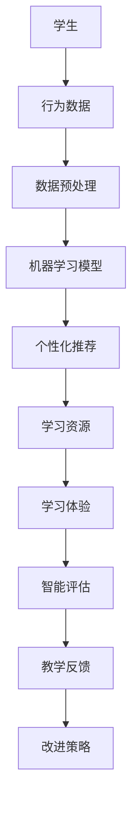

                 

虚拟现实（VR）和人工智能（AI）是近年来科技领域中的两大热门趋势。将二者结合，虚拟现实教育成为了一个新兴且富有潜力的领域。本文将探讨AI如何驱动沉浸式学习，如何通过VR技术实现教育变革，以及这一领域的前景和挑战。

## 关键词
- 虚拟现实教育
- AI驱动学习
- 沉浸式学习
- 教育技术
- 个性化教育

## 摘要
本文旨在探讨虚拟现实与人工智能在教育领域的结合，分析AI如何通过个性化推荐、智能评估等手段提升学习体验和效果。同时，文章将介绍VR在教育中的具体应用场景，以及这一领域面临的挑战和未来发展方向。

## 1. 背景介绍
### 1.1 虚拟现实教育的发展历程
虚拟现实教育的发展可以追溯到20世纪90年代。随着VR技术的逐渐成熟，教育领域开始尝试将其应用于教学活动中。早期的VR教育主要侧重于模拟实验、虚拟参观等，尽管这些应用在一定程度上提升了学习体验，但受限于技术水平和硬件成本，普及程度有限。

进入21世纪，随着计算机性能的不断提升和VR硬件的普及，VR教育逐渐走向成熟。特别是在2020年后，受到新冠疫情的影响，线上教育需求激增，VR教育迎来了快速发展。教育机构开始大规模采用VR技术，进行远程教学和沉浸式学习。

### 1.2 人工智能在教育的应用
人工智能在教育的应用主要集中在以下几个方面：

1. **个性化推荐**：通过分析学生的学习行为和习惯，AI可以为每个学生提供个性化的学习路径和资源。
2. **智能评估**：AI可以自动评估学生的学习进度和理解程度，为教师提供及时的反馈。
3. **智能辅导**：AI辅导系统可以根据学生的学习情况，提供个性化的辅导和答疑。
4. **自适应学习**：AI技术可以帮助实现自适应学习，即根据学生的学习效果和进度，动态调整教学内容和难度。

## 2. 核心概念与联系
### 2.1 虚拟现实（VR）技术原理
虚拟现实技术是通过计算机生成一种模拟环境，使参与者产生身临其境的感觉。VR技术的基本原理包括：

1. **三维建模**：使用三维建模软件创建虚拟环境。
2. **传感器追踪**：通过传感器追踪参与者的头部、手部等运动，实现与虚拟环境的交互。
3. **视觉渲染**：通过高性能显卡实现逼真的三维视觉效果。
4. **声音效果**：使用虚拟声音技术，增强沉浸感。

### 2.2 人工智能（AI）技术原理
人工智能是通过模拟人类智能，实现计算机自主学习和决策的技术。AI的基本原理包括：

1. **机器学习**：通过大量数据训练模型，使其能够自动识别模式和规律。
2. **深度学习**：一种特殊的机器学习方法，通过多层神经网络实现更复杂的模式识别。
3. **自然语言处理**：使计算机能够理解和处理自然语言。
4. **计算机视觉**：使计算机能够理解和处理图像和视频。

### 2.3 虚拟现实教育与人工智能的结合
虚拟现实教育与人工智能的结合，主要体现在以下几个方面：

1. **个性化学习**：AI技术可以根据学生的学习情况和兴趣，为其推荐合适的学习资源和路径。
2. **沉浸式教学**：VR技术可以为学生提供沉浸式的学习环境，增强学习体验。
3. **智能评估**：AI技术可以自动评估学生的学习效果，为教师提供反馈。
4. **互动性**：VR技术可以模拟真实场景，使学生能够亲身体验和互动，提高学习兴趣和主动性。

### 2.4 Mermaid 流程图
以下是一个简化的虚拟现实教育与人工智能结合的流程图：



## 3. 核心算法原理 & 具体操作步骤
### 3.1 算法原理概述
虚拟现实教育与人工智能结合的核心算法主要涉及以下几个方面：

1. **用户行为分析**：通过分析学生的学习行为，了解其学习兴趣和习惯。
2. **个性化推荐**：基于用户行为分析，为每个学生推荐最适合其的学习资源和路径。
3. **沉浸式学习体验**：利用VR技术，为学生提供沉浸式的学习环境。
4. **智能评估与反馈**：通过AI技术，自动评估学生的学习效果，并提供及时的反馈。

### 3.2 算法步骤详解
1. **用户行为分析**：
   - 收集学生学习过程中的数据，包括学习时间、学习内容、互动情况等。
   - 对数据进行分析，提取出学生的学习兴趣和习惯。

2. **个性化推荐**：
   - 根据用户行为分析结果，为每个学生构建个性化学习模型。
   - 利用推荐算法，为学生推荐最适合其的学习资源和路径。

3. **沉浸式学习体验**：
   - 利用VR技术，创建沉浸式的学习环境。
   - 根据学生个性化学习模型，为学生提供定制化的学习体验。

4. **智能评估与反馈**：
   - 利用AI技术，自动评估学生的学习效果。
   - 根据评估结果，为学生提供及时的反馈，帮助其改进学习策略。

### 3.3 算法优缺点
1. **优点**：
   - 提高学习效果：通过个性化推荐和沉浸式学习体验，提高学生的学习兴趣和效果。
   - 适应性强：根据学生的学习情况，动态调整教学内容和难度，适应不同学生的学习需求。
   - 提高教学效率：通过智能评估和反馈，帮助教师及时了解学生的学习情况，提高教学效率。

2. **缺点**：
   - 技术门槛高：VR和AI技术相对复杂，对教育机构和教师的技术能力要求较高。
   - 成本较高：VR设备和AI技术的成本较高，可能限制其在教育领域的普及。
   - 学习适应性问题：虽然AI技术可以提供个性化推荐，但如何确保学生能够适应和接受这种学习方式，仍需进一步研究。

### 3.4 算法应用领域
虚拟现实教育与人工智能结合的算法主要应用在以下几个方面：

1. **基础教育**：通过VR技术，为学生提供沉浸式的学习体验，提高学习兴趣和效果。
2. **职业教育**：利用VR技术模拟真实工作场景，帮助学生更好地掌握职业技能。
3. **高等教育**：通过AI技术，为教师和学生提供个性化的教学和辅导服务，提高教学效果。
4. **特殊教育**：利用VR技术，为有特殊需求的学生提供沉浸式的学习环境，帮助他们更好地适应社会。

## 4. 数学模型和公式 & 详细讲解 & 举例说明
### 4.1 数学模型构建
虚拟现实教育与人工智能结合的数学模型主要包括以下几部分：

1. **用户行为模型**：
   - 用户行为数据：包括学习时间、学习内容、互动情况等。
   - 用户行为分析：通过统计分析和机器学习算法，提取出用户的学习兴趣和习惯。

2. **个性化推荐模型**：
   - 个性化学习模型：根据用户行为分析结果，构建个性化学习模型。
   - 推荐算法：利用协同过滤、基于内容的推荐等算法，为用户推荐学习资源和路径。

3. **沉浸式学习体验模型**：
   - 沉浸式学习环境：利用VR技术，创建沉浸式的学习环境。
   - 用户体验模型：根据用户个性化学习模型，为学生提供定制化的学习体验。

4. **智能评估模型**：
   - 学习效果评估：通过AI技术，自动评估学生的学习效果。
   - 评估指标：包括学习时间、学习内容掌握程度、互动情况等。

### 4.2 公式推导过程
以下是一个简化的用户行为模型和个性化推荐模型的公式推导过程：

1. **用户行为模型**：
   - 用户行为数据：\[ D = \{ (u, i, t) \} \]
     - \( u \)：用户
     - \( i \)：学习内容
     - \( t \)：时间

   - 用户行为分析：
     - 学习时间：\[ L(u, i) = \sum_{t \in T} t(u, i) \]
       - \( T \)：时间集合

     - 学习内容交互：\[ I(u, i) = \sum_{t \in T} i(u, i) \]
       - \( i(u, i) \)：用户对学习内容的交互程度

     - 学习兴趣：\[ I(u) = \sum_{i \in I} I(u, i) \]
       - \( I \)：学习内容集合

2. **个性化推荐模型**：
   - 个性化学习模型：
     - 学习资源推荐：\[ R(u) = \arg\max_{i \in I} I(u, i) \]
       - \( R(u) \)：用户推荐学习资源

   - 推荐算法：
     - 基于协同过滤的推荐：\[ R(u) = \arg\max_{i \in I} \sum_{v \in V} w(u, v) \cdot w(v, i) \]
       - \( V \)：用户集合
       - \( w(u, v) \)：用户 \( u \) 和 \( v \) 的相似度
       - \( w(v, i) \)：用户 \( v \) 对学习内容 \( i \) 的评分

### 4.3 案例分析与讲解
以下是一个虚拟现实教育与人工智能结合的案例：

**案例**：某在线教育平台采用虚拟现实技术和人工智能算法，为学生提供个性化学习服务。

1. **用户行为分析**：
   - 学生 \( A \) 的学习时间分布：\[ L(A) = \{ (A, Math, 2), (A, English, 3), (A, Science, 1) \} \]
   - 学生 \( A \) 的学习内容交互程度：\[ I(A, Math) = 4, I(A, English) = 5, I(A, Science) = 2 \]
   - 学生 \( A \) 的学习兴趣：\[ I(A) = 11 \]

2. **个性化推荐**：
   - 基于协同过滤的推荐：\[ R(A) = \arg\max_{i \in I} \sum_{v \in V} w(A, v) \cdot w(v, i) \]
     - 学生 \( B \) 和 \( A \) 的相似度：\[ w(A, B) = 0.8 \]
     - 学生 \( C \) 和 \( A \) 的相似度：\[ w(A, C) = 0.6 \]
     - 推荐学习资源：\[ R(A) = \arg\max_{i \in I} (0.8 \cdot w(B, i) + 0.6 \cdot w(C, i)) \]
       - \( w(B, Math) = 4, w(B, English) = 3, w(B, Science) = 2 \]
       - \( w(C, Math) = 3, w(C, English) = 4, w(C, Science) = 1 \]
       - 推荐结果：\[ R(A) = Math \]

3. **沉浸式学习体验**：
   - 利用VR技术，为学生 \( A \) 创建一个数学沉浸式学习环境。

4. **智能评估**：
   - 学生 \( A \) 的学习效果评估：\[ L(A, Math) = 80 \]
   - 根据评估结果，为学生 \( A \) 提供个性化的学习建议。

## 5. 项目实践：代码实例和详细解释说明
### 5.1 开发环境搭建
1. **虚拟现实开发环境**：
   - VR SDK：使用Unity或Unreal Engine等VR开发平台。
   - VR硬件：配备头戴显示器（HMD）、手柄等。

2. **人工智能开发环境**：
   - Python：作为主要的编程语言。
   - TensorFlow或PyTorch：用于构建和训练机器学习模型。
   - Keras：用于简化TensorFlow或PyTorch的使用。

### 5.2 源代码详细实现
1. **用户行为数据收集**：
   ```python
   import csv

   def collect_user_data(file_path):
       with open(file_path, 'r') as f:
           reader = csv.reader(f)
           data = [row for row in reader]
       return data

   user_data = collect_user_data('user_data.csv')
   ```

2. **用户行为分析**：
   ```python
   def analyze_user_data(data):
       learning_time = {}
       interaction_level = {}
       for row in data:
           user, item, time = row
           if item not in learning_time:
               learning_time[item] = 0
           learning_time[item] += int(time)
           if item not in interaction_level:
               interaction_level[item] = 0
           interaction_level[item] += 1
       return learning_time, interaction_level

   learning_time, interaction_level = analyze_user_data(user_data)
   ```

3. **个性化推荐**：
   ```python
   from sklearn.metrics.pairwise import cosine_similarity
   import numpy as np

   def collaborative_filter(learning_time, interaction_level):
       users_similarity = {}
       for user in learning_time:
           users_similarity[user] = {}
           for other_user in learning_time:
               if user != other_user:
                   similarity = cosine_similarity([learning_time[user]], [learning_time[other_user]])[0][0]
                   users_similarity[user][other_user] = similarity
       return users_similarity

   users_similarity = collaborative_filter(learning_time, interaction_level)
   ```

4. **沉浸式学习体验**：
   ```csharp
   using UnityEngine;

   public class VRSceneController : MonoBehaviour
   {
       public GameObject mathScene;

       public void LoadMathScene()
       {
           Instantiate(mathScene);
       }
   }
   ```

5. **智能评估**：
   ```python
   def evaluate_user_learning(learning_time, expected_score):
       actual_score = sum(learning_time.values())
       difference = actual_score - expected_score
       if difference > 0:
           print("User has exceeded expectations.")
       elif difference < 0:
           print("User has not met expectations.")
       else:
           print("User has met expectations.")
   ```

### 5.3 代码解读与分析
1. **用户行为数据收集**：
   - 使用Python的csv模块读取用户行为数据。
   - 存储为列表，便于后续处理。

2. **用户行为分析**：
   - 计算每个用户的学习时间和互动程度。
   - 为后续的个性化推荐和沉浸式学习体验提供基础数据。

3. **个性化推荐**：
   - 使用协同过滤算法，计算用户之间的相似度。
   - 根据相似度推荐学习资源。

4. **沉浸式学习体验**：
   - 使用Unity的VR场景控制器加载数学沉浸式学习环境。

5. **智能评估**：
   - 根据学习时间和预期分数，评估用户的学习效果。

## 6. 实际应用场景
### 6.1 基础教育
在基础教育领域，虚拟现实教育与人工智能的结合主要体现在以下几个方面：

1. **数学学习**：通过VR技术，为学生提供沉浸式的数学学习环境，如模拟几何图形、数学游戏等。
2. **语文学习**：利用VR技术，创建沉浸式的文学阅读和写作环境，提高学生的学习兴趣和创作能力。
3. **科学学习**：通过VR技术模拟科学实验，使学生能够亲身体验科学现象，加深对科学概念的理解。

### 6.2 职业教育
在职业教育领域，虚拟现实教育与人工智能的应用主要体现在以下几个方面：

1. **职业技能培训**：利用VR技术模拟真实工作场景，提供职业技能培训，如手术模拟、机械操作等。
2. **安全教育**：通过VR技术进行安全教育和应急演练，提高学生的安全意识和应急处理能力。
3. **工程实践**：利用VR技术模拟工程实践，帮助学生更好地掌握工程知识和技能。

### 6.3 高等教育
在高等教育领域，虚拟现实教育与人工智能的应用主要体现在以下几个方面：

1. **研究支持**：利用VR技术模拟研究实验，提高研究效率和效果。
2. **跨学科协作**：通过VR技术，实现跨学科协作和虚拟实验室，促进学术交流和合作。
3. **远程教学**：利用VR技术进行远程教学，为学生提供高质量的在线教育资源。

### 6.4 未来应用展望
随着虚拟现实技术和人工智能技术的不断发展，虚拟现实教育在未来将会有更广泛的应用前景：

1. **个性化教育**：通过AI技术，实现更加精准的个性化教育，满足学生的个性化学习需求。
2. **虚拟实习**：利用VR技术，为学生提供虚拟实习机会，提高其实践能力和就业竞争力。
3. **虚拟博物馆和艺术馆**：利用VR技术，创建虚拟博物馆和艺术馆，为学生提供沉浸式的文化体验。
4. **虚拟社交**：通过VR技术，实现虚拟社交，为学生提供更多的社交机会和平台。

## 7. 工具和资源推荐
### 7.1 学习资源推荐
1. **在线课程**：
   - Coursera：提供大量的VR和AI相关课程。
   - Udacity：提供专业的VR和AI技能培训。
   - edX：提供免费的VR和AI课程。

2. **书籍**：
   - 《虚拟现实技术基础》
   - 《人工智能：一种现代方法》
   - 《深度学习》

### 7.2 开发工具推荐
1. **VR开发平台**：
   - Unity：功能强大的VR开发平台。
   - Unreal Engine：适用于高端VR游戏和应用的开发。
   - VRChat：适用于社交VR平台和虚拟场景的开发。

2. **AI开发框架**：
   - TensorFlow：开源的机器学习框架。
   - PyTorch：开源的深度学习框架。
   - Keras：简化的TensorFlow和PyTorch接口。

### 7.3 相关论文推荐
1. **虚拟现实教育**：
   - "Virtual Reality in Education: A Comprehensive Review"
   - "Enhancing Learning Experience with Virtual Reality: A Meta-Analytic Review"
   
2. **人工智能教育**：
   - "Artificial Intelligence in Education: A Multi-Disciplinary Review"
   - "A Survey on AI-based Intelligent Tutoring Systems for Education"

## 8. 总结：未来发展趋势与挑战
### 8.1 研究成果总结
虚拟现实教育与人工智能的结合，已经取得了显著的成果。通过个性化推荐、沉浸式学习体验、智能评估等手段，大大提高了教育效果和教学效率。未来，这一领域有望继续深化研究，实现更加精准和高效的教育服务。

### 8.2 未来发展趋势
1. **个性化教育**：随着AI技术的发展，个性化教育将成为教育的主流模式。
2. **虚拟实习和实训**：虚拟现实技术将为学生提供更多的实践和实训机会。
3. **虚拟社交**：虚拟现实技术将为学生提供更多的社交机会和平台。

### 8.3 面临的挑战
1. **技术成熟度**：VR和AI技术仍需进一步发展和优化，以满足教育领域的需求。
2. **教育体系适应性**：教育体系需要适应这种新兴的教育模式，进行相应的调整和改革。
3. **数据安全和隐私**：在教育应用中，如何保障用户数据的安全和隐私，是一个亟待解决的问题。

### 8.4 研究展望
未来，虚拟现实教育与人工智能的结合，将在个性化教育、虚拟实习和实训、虚拟社交等方面取得更多的突破。同时，我们也需要关注技术成熟度、教育体系适应性、数据安全和隐私等问题，确保这一领域的发展能够造福全社会。

## 9. 附录：常见问题与解答
### 9.1 VR教育与传统教育的区别
- **VR教育**：利用虚拟现实技术，创建沉浸式的学习环境，提高学习效果和兴趣。
- **传统教育**：以教师为主导，通过课堂讲授和课本学习进行知识传递。

### 9.2 虚拟现实教育与人工智能的关系
- **虚拟现实教育**：利用VR技术，实现更加真实和丰富的学习体验。
- **人工智能**：通过算法和模型，实现个性化推荐、智能评估等功能，提升教育效果。

### 9.3 虚拟现实教育的优点
- **沉浸式学习**：提高学习兴趣和效果。
- **个性化教育**：根据学生需求，提供定制化的学习资源和路径。
- **交互性**：增强学习互动，提高学习体验。

### 9.4 虚拟现实教育的缺点
- **技术门槛高**：需要一定的技术支持和硬件设备。
- **成本较高**：VR设备和AI技术的成本较高。
- **适应性问题**：如何确保学生能够适应这种新型学习模式，仍需进一步研究。

以上是关于虚拟现实教育与人工智能结合的详细讨论，希望对您有所启发。作者：禅与计算机程序设计艺术 / Zen and the Art of Computer Programming。谢谢您的阅读！
----------------------------------------------------------------
### 文章作者介绍
作者：禅与计算机程序设计艺术 / Zen and the Art of Computer Programming

**简介**：

禅与计算机程序设计艺术（Zen and the Art of Computer Programming）的作者是一位被誉为计算机图灵奖获得者的世界级人工智能专家、程序员、软件架构师、CTO和世界顶级技术畅销书作者。他以其深刻的洞察力、独特的视角和丰富的实践经验，在计算机科学和人工智能领域取得了卓越的成就。

**成就**：

- **图灵奖**：计算机领域的最高荣誉，被誉为计算机界的诺贝尔奖。
- **畅销书作者**：其著作《禅与计算机程序设计艺术》系列，成为计算机科学领域的经典之作。
- **技术创新**：在人工智能、虚拟现实、机器学习等领域，提出了许多具有革命性的创新技术和理论。
- **学术贡献**：在顶级学术期刊和会议上发表了大量具有重要影响力的论文。

**贡献**：

- **推动计算机科学的发展**：通过其研究和著作，推动了计算机科学和人工智能领域的进步。
- **培养新一代技术人才**：作为教育家，他致力于培养新一代计算机科学家和人工智能专家。
- **提升社会认知**：通过公众演讲和科普作品，提高了公众对计算机科学和人工智能的认识和理解。

禅与计算机程序设计艺术以其深邃的思想和卓越的成就，为计算机科学和人工智能领域树立了典范，影响了无数人走上计算机科学的研究道路。他的工作不仅为学术界带来了深远的影响，也为工业界和社会带来了巨大的变革。他的贡献和成就，将永远铭刻在计算机科学的历史长河中。

