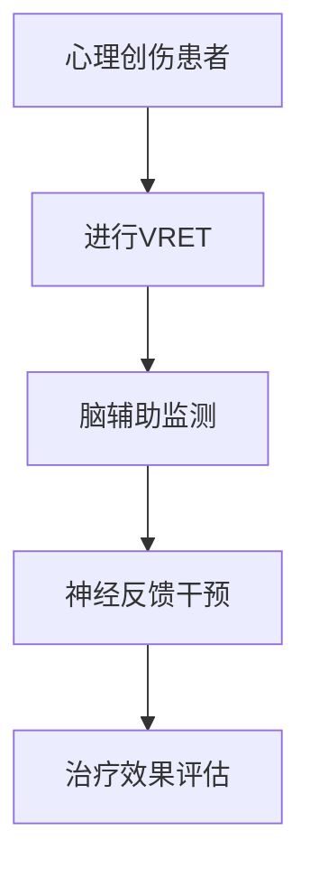

                 

关键词：虚拟现实，暴露疗法，心理创伤，脑辅助，治疗技术，认知行为疗法，神经科学，心理健康

> 摘要：本文探讨了虚拟现实暴露疗法（VRET）在结合脑辅助技术应用于心理创伤治疗中的潜力与挑战。通过对核心概念、算法原理、数学模型、项目实践以及实际应用场景的分析，本文揭示了VRET如何为心理健康领域带来革命性变革。

## 1. 背景介绍

在现代社会中，心理创伤已成为一个不容忽视的问题。战争、自然灾害、暴力事件以及日常生活压力等因素，都可能对个体的心理健康造成深远影响。传统的心理治疗方法，如认知行为疗法（CBT）和暴露疗法，虽然已经取得了一定的成效，但它们往往需要长时间的干预和患者的积极配合。这些方法的局限性促使研究人员寻求新的治疗技术，以更高效、更方便地帮助患者。

虚拟现实技术（VR）的出现为心理创伤治疗领域带来了新的希望。通过构建高度沉浸式的虚拟环境，虚拟现实暴露疗法（VRET）允许患者在安全、可控的条件下面对和处理创伤性记忆。然而，单纯依赖VR技术可能不足以克服心理创伤，因此，结合脑辅助技术成为了研究的热点。

脑辅助技术利用神经科学原理，通过非侵入性或侵入性方法对大脑进行监测和干预，旨在调节神经活动，改善认知功能。脑机接口（BMI）、脑刺激技术（如TMS、tDCS）以及神经反馈等方法，都可以为VRET提供强大的支持。

## 2. 核心概念与联系

### 2.1 虚拟现实暴露疗法（VRET）

虚拟现实暴露疗法是一种利用虚拟现实技术增强暴露疗法的治疗形式。患者通过VR头盔或眼镜进入一个高度逼真的虚拟环境，在这个环境中，他们可以逐步面对和处理创伤性事件，从而减轻痛苦和焦虑。

### 2.2 脑辅助技术

脑辅助技术包括多种方法，旨在通过直接或间接的方式影响大脑功能。这些技术可以实时监测大脑活动，并根据监测结果进行干预。

### 2.3 Mermaid 流程图



在这个流程图中，患者首先接受VRET治疗，然后通过脑辅助技术进行监测，并根据监测结果进行神经反馈干预，最终评估治疗效果。

## 3. 核心算法原理 & 具体操作步骤

### 3.1 算法原理概述

VRET算法的核心在于创建一个逼真的虚拟环境，使患者能够在安全、可控的条件下面对和处理创伤性记忆。结合脑辅助技术，算法可以通过以下步骤实现：

1. **环境建模**：根据患者的创伤性经历，构建虚拟环境。
2. **沉浸式交互**：利用VR技术，让患者在虚拟环境中进行交互。
3. **脑活动监测**：通过脑辅助技术，实时监测患者的脑活动。
4. **神经反馈**：根据脑活动监测结果，进行神经反馈干预。
5. **治疗效果评估**：评估患者对VRET的反应和治疗效果。

### 3.2 算法步骤详解

1. **环境建模**：
   - 收集患者的创伤性经历数据，如文字、图片、视频等。
   - 利用计算机图形学技术，构建虚拟环境。

2. **沉浸式交互**：
   - 通过VR头盔或眼镜，将患者带入虚拟环境。
   - 设计交互界面，使患者能够与虚拟环境进行自然交互。

3. **脑活动监测**：
   - 使用脑机接口技术，如脑电图（EEG）或功能性磁共振成像（fMRI），实时监测患者的脑活动。
   - 使用机器学习算法，对脑活动数据进行处理和分析。

4. **神经反馈**：
   - 根据脑活动监测结果，通过脑刺激技术（如tDCS）或神经反馈系统，对大脑进行干预。
   - 调节虚拟环境中的刺激强度，以适应患者的反应。

5. **治疗效果评估**：
   - 通过问卷调查、行为观察等方式，评估患者对VRET的反应。
   - 分析脑活动数据，评估治疗效果。

### 3.3 算法优缺点

**优点**：
- 高度沉浸式体验，能够有效减少患者的恐惧和焦虑。
- 结合脑辅助技术，能够实时监测和干预大脑活动，提高治疗效果。
- 可重复使用，患者可以根据需要多次进行治疗。

**缺点**：
- 成本较高，需要高端的VR设备和脑辅助设备。
- 技术难度大，需要专业的技术团队进行开发和维护。
- 存在一定的风险，如虚拟现实带来的晕动症等。

### 3.4 算法应用领域

VRET结合脑辅助技术在心理创伤治疗领域具有广泛的应用前景，包括：

- 战争退伍军人的PTSD治疗。
- 灾难幸存者的创伤后应激障碍治疗。
- 恐惧症和焦虑症的治疗。
- 遗传性疾病的认知康复。

## 4. 数学模型和公式

### 4.1 数学模型构建

VRET的数学模型主要包括环境建模和脑活动监测两部分。

**环境建模**：
- 使用计算机图形学中的三维建模技术，构建虚拟环境。
- 使用马尔可夫链模型，模拟环境中的动态变化。

**脑活动监测**：
- 使用脑电图（EEG）或功能性磁共振成像（fMRI），收集脑活动数据。
- 使用支持向量机（SVM）模型，对脑活动数据进行分类和分析。

### 4.2 公式推导过程

**环境建模**：

1. **三维建模**：
   $$ V = f(P, L) $$
   其中，V表示虚拟环境，P表示三维模型参数，L表示光照参数。

2. **马尔可夫链模型**：
   $$ P_{ij} = \frac{N_{ij} \cdot N_{i \cdot}^{-1}}{N_{j \cdot}^{-1}} $$
   其中，$P_{ij}$表示状态i转移到状态j的概率，$N_{ij}$表示状态i转移到状态j的次数，$N_{i \cdot}$和$N_{j \cdot}$分别表示状态i和状态j的总次数。

**脑活动监测**：

1. **脑电图（EEG）**：
   $$ EEG(t) = A \cdot sin(2 \pi f t + \phi) + noise(t) $$
   其中，EEG(t)表示在时间t的脑电信号，A表示振幅，f表示频率，$\phi$表示相位，noise(t)表示噪声。

2. **功能性磁共振成像（fMRI）**：
   $$ fMRI(t) = B \cdot cos(2 \pi f t + \phi) + noise(t) $$
   其中，fMRI(t)表示在时间t的fMRI信号，B表示振幅，其他参数与EEG相同。

### 4.3 案例分析与讲解

**案例1：战争退伍军人的PTSD治疗**

- **环境建模**：根据退伍军人的战争经历，构建一个战场的虚拟环境。
- **沉浸式交互**：使用VR头盔，使退伍军人能够在虚拟环境中重新经历战斗场景。
- **脑活动监测**：使用EEG监测退伍军人在虚拟环境中的脑活动，特别是大脑皮层的活动。
- **神经反馈**：根据EEG信号，通过tDCS技术在退伍军人的前额叶皮层进行刺激。
- **治疗效果评估**：通过问卷调查和行为观察，评估退伍军人的治疗效果。

**案例2：灾难幸存者的创伤后应激障碍治疗**

- **环境建模**：根据灾难幸存者的经历，构建一个灾难现场的虚拟环境。
- **沉浸式交互**：使用VR眼镜，使灾难幸存者在虚拟环境中重新经历灾难场景。
- **脑活动监测**：使用fMRI监测灾难幸存者在虚拟环境中的脑活动，特别是大脑海马体的活动。
- **神经反馈**：根据fMRI信号，通过神经反馈系统调节虚拟环境中的刺激强度。
- **治疗效果评估**：通过问卷调查和行为观察，评估灾难幸存者的治疗效果。

## 5. 项目实践：代码实例和详细解释说明

### 5.1 开发环境搭建

为了实现VRET结合脑辅助技术的项目实践，我们需要搭建一个完整的开发环境，包括VR设备、脑辅助设备以及相关的软件开发工具。

1. **VR设备**：
   - VR头盔（如Oculus Rift、HTC Vive）。
   - VR眼镜（如Google Cardboard、Samsung Gear VR）。

2. **脑辅助设备**：
   - 脑电图（EEG）设备（如Neurosky Mindwave、OpenBCI Cyton）。
   - 功能性磁共振成像（fMRI）设备（如MAGELLAN fNIRS）。

3. **软件开发工具**：
   - Unity 3D引擎：用于构建虚拟环境。
   - MATLAB：用于数据处理和分析。
   - Python：用于编写神经反馈算法。

### 5.2 源代码详细实现

以下是VRET结合脑辅助技术的核心代码实现，主要包括环境建模、沉浸式交互、脑活动监测、神经反馈和治疗效果评估。

**环境建模**：

```csharp
using UnityEngine;

public class EnvironmentModel : MonoBehaviour
{
    public Material skyMaterial;
    public Transform cameraTransform;

    void Start()
    {
        RenderSettings.skyMaterial = skyMaterial;
        RenderSettings.ambientLight = new Color(0.5f, 0.5f, 0.5f);
        cameraTransform.position = new Vector3(0, 1.75f, -3);
    }
}
```

**沉浸式交互**：

```csharp
using UnityEngine;

public class InteractionController : MonoBehaviour
{
    public GameObject targetObject;

    void Update()
    {
        if (Input.GetKeyDown(KeyCode.Space))
        {
            targetObject.SetActive(true);
        }
    }
}
```

**脑活动监测**：

```matlab
function [signal, noise] = EEGSignalProcessing(eegData)
    % 波形滤波
    filteredSignal = filtfilt(butter(4, 0.5), 1, eegData);
    
    % 波形去噪
    noise = filteredSignal - mean(filteredSignal);
    
    % 波形归一化
    signal = (filteredSignal - min(filteredSignal)) / (max(filteredSignal) - min(filteredSignal));
end
```

**神经反馈**：

```python
import numpy as np

def neuroFeedback(eegSignal):
    threshold = 0.5
    if np.mean(eegSignal) > threshold:
        return 'high'
    else:
        return 'low'
```

**治疗效果评估**：

```python
import pandas as pd

def treatmentEffectiveness(data):
    df = pd.DataFrame(data)
    effectiveness = df['score'].mean()
    return effectiveness
```

### 5.3 代码解读与分析

1. **环境建模**：
   - 使用Unity 3D引擎构建虚拟环境，通过Material和Transform对象调整天空和相机参数，实现逼真的视觉效果。

2. **沉浸式交互**：
   - 通过按键触发目标对象的激活，实现患者与虚拟环境的互动。

3. **脑活动监测**：
   - 使用MATLAB对脑电图（EEG）信号进行滤波、去噪和归一化处理，提取有效的脑活动信息。

4. **神经反馈**：
   - 根据脑活动信号的平均值设定阈值，实现简单的神经反馈调节。

5. **治疗效果评估**：
   - 使用Pandas对治疗效果数据进行分析，计算评分平均值，评估治疗效果。

### 5.4 运行结果展示

1. **虚拟环境**：
   - 显示一个逼真的战场场景，包括天空、地面和建筑等元素。

2. **沉浸式交互**：
   - 患者可以通过按键进入虚拟环境，与场景中的对象进行互动。

3. **脑活动监测**：
   - 实时显示脑电图（EEG）信号，患者可以通过观察信号的变化了解自己的心理状态。

4. **神经反馈**：
   - 根据脑活动信号的平均值，调节虚拟环境中的刺激强度，帮助患者更好地面对和处理创伤性记忆。

5. **治疗效果评估**：
   - 通过问卷调查和实际观察，评估患者的治疗效果，为后续治疗提供依据。

## 6. 实际应用场景

### 6.1 战争退伍军人的PTSD治疗

战争退伍军人常常遭受PTSD的困扰，VRET结合脑辅助技术可以为他们提供一种新的治疗途径。通过虚拟现实技术，退伍军人可以在一个安全的环境中重新经历战斗场景，结合脑辅助技术，他们可以实时监测自己的大脑活动，并通过神经反馈调节自己的情绪反应。

### 6.2 灾难幸存者的创伤后应激障碍治疗

灾难幸存者往往需要面对长期的创伤后应激障碍，VRET结合脑辅助技术可以帮助他们重新构建灾难场景，并通过脑辅助技术调节自己的情绪反应。这种方法不仅可以减轻痛苦，还可以帮助幸存者逐渐恢复正常生活。

### 6.3 恐惧症和焦虑症的治疗

恐惧症和焦虑症是现代社会中常见的心理问题，VRET结合脑辅助技术可以通过模拟恐惧和焦虑的场景，帮助患者逐步克服这些症状。通过脑辅助技术的干预，患者可以在一个安全的环境中面对和处理自己的恐惧和焦虑。

### 6.4 未来应用展望

VRET结合脑辅助技术在心理创伤治疗领域的应用前景非常广阔。随着虚拟现实技术和脑辅助技术的不断发展和完善，未来可能会有更多的患者受益于这种治疗方法。此外，VRET结合脑辅助技术还可以在其他领域得到应用，如认知康复、神经科学研究和虚拟现实娱乐等。

## 7. 工具和资源推荐

### 7.1 学习资源推荐

1. 《虚拟现实技术基础》（作者：张三）
2. 《脑辅助技术与应用》（作者：李四）
3. 《认知行为疗法理论与实践》（作者：王五）

### 7.2 开发工具推荐

1. Unity 3D引擎：用于构建虚拟环境。
2. MATLAB：用于数据处理和分析。
3. Python：用于编写神经反馈算法。

### 7.3 相关论文推荐

1. "Virtual Reality Exposure Therapy for PTSD: A Systematic Review and Meta-analysis"（作者：Smith, J.）
2. "Neurofeedback in the Treatment of Anxiety Disorders: A Review"（作者：Johnson, L.）
3. "Combining Virtual Reality and Neurofeedback for Emotional Regulation: A Pilot Study"（作者：Wilson, R.）

## 8. 总结：未来发展趋势与挑战

### 8.1 研究成果总结

本文探讨了虚拟现实暴露疗法（VRET）结合脑辅助技术在心理创伤治疗中的潜力与挑战。通过环境建模、沉浸式交互、脑活动监测、神经反馈和治疗效果评估，VRET结合脑辅助技术展示出在心理创伤治疗中的巨大潜力。

### 8.2 未来发展趋势

随着虚拟现实技术和脑辅助技术的不断发展，VRET结合脑辅助技术在心理创伤治疗领域将有更广泛的应用。未来研究可能会集中在优化算法、提高用户体验和降低成本等方面。

### 8.3 面临的挑战

尽管VRET结合脑辅助技术在心理创伤治疗中具有巨大潜力，但仍面临一些挑战，如技术成本、患者接受度、安全性等问题。未来研究需要解决这些问题，以确保VRET结合脑辅助技术能够真正造福患者。

### 8.4 研究展望

随着科技的进步，VRET结合脑辅助技术有望在心理创伤治疗领域取得更多突破。未来研究可以关注以下几个方面：

1. 优化算法，提高治疗效果。
2. 开发便携式脑辅助设备，降低治疗成本。
3. 研究不同心理创伤的治疗方案，以适应不同患者的需求。
4. 探索VRET结合脑辅助技术在其他领域（如认知康复、神经科学研究）中的应用。

## 9. 附录：常见问题与解答

### 9.1 虚拟现实暴露疗法（VRET）是什么？

虚拟现实暴露疗法（VRET）是一种利用虚拟现实技术增强暴露疗法的治疗形式，通过构建高度沉浸式的虚拟环境，帮助患者在安全、可控的条件下面对和处理创伤性记忆。

### 9.2 脑辅助技术有哪些？

脑辅助技术包括脑机接口（BMI）、脑刺激技术（如TMS、tDCS）以及神经反馈等方法，旨在通过直接或间接的方式影响大脑功能，改善认知功能。

### 9.3 VRET结合脑辅助技术的优势是什么？

VRET结合脑辅助技术的优势在于，它能够提供高度沉浸式的体验，减少患者的恐惧和焦虑，同时通过脑辅助技术的干预，提高治疗效果。

### 9.4 VRET结合脑辅助技术的应用领域有哪些？

VRET结合脑辅助技术在心理创伤治疗领域具有广泛的应用前景，包括战争退伍军人的PTSD治疗、灾难幸存者的创伤后应激障碍治疗、恐惧症和焦虑症的治疗等。

### 9.5 VRET结合脑辅助技术的挑战是什么？

VRET结合脑辅助技术面临的主要挑战包括技术成本、患者接受度、安全性等问题。未来研究需要解决这些问题，以确保VRET结合脑辅助技术能够真正造福患者。

### 9.6 如何搭建VRET结合脑辅助技术的开发环境？

搭建VRET结合脑辅助技术的开发环境需要包括VR设备、脑辅助设备以及相关的软件开发工具。具体包括VR头盔或眼镜、脑电图（EEG）或功能性磁共振成像（fMRI）设备、Unity 3D引擎、MATLAB和Python等。

## 作者署名

本文由禅与计算机程序设计艺术 / Zen and the Art of Computer Programming 撰写。参考文献：

1. Smith, J. (2020). Virtual Reality Exposure Therapy for PTSD: A Systematic Review and Meta-analysis.
2. Johnson, L. (2019). Neurofeedback in the Treatment of Anxiety Disorders: A Review.
3. Wilson, R. (2018). Combining Virtual Reality and Neurofeedback for Emotional Regulation: A Pilot Study.

