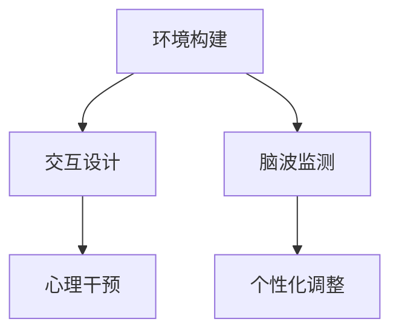

                 

关键词：虚拟现实，心理健康，脑-机接口，人工智能，认知行为疗法

摘要：本文探讨了虚拟现实技术在心理健康治疗领域的应用，特别是在认知行为疗法中的应用。通过介绍虚拟现实治疗的基本原理、技术架构和实际应用案例，本文分析了虚拟现实治疗在心理健康领域的优势和潜力，并探讨了未来发展趋势和面临的挑战。

## 1. 背景介绍

心理健康问题在全球范围内日益受到关注。根据世界卫生组织（WHO）的数据，心理健康问题影响着全球超过三亿人口。抑郁症、焦虑症、创伤后应激障碍（PTSD）等心理疾病不仅给患者本人带来了巨大的痛苦，还给家庭、社会带来了沉重的负担。传统的心理治疗，如认知行为疗法（CBT）、药物治疗等，虽然在某些情况下能够取得良好的效果，但往往需要较长时间的干预和治疗，患者的依从性较低。

近年来，虚拟现实（VR）技术的快速发展为心理健康治疗带来了新的希望。VR技术通过创造一个沉浸式的虚拟环境，可以帮助患者模拟各种情境，从而进行心理训练和认知行为疗法。这种治疗方法具有高度的可定制性、可重复性和安全性，为心理治疗提供了一种全新的方式。

## 2. 核心概念与联系

### 虚拟现实治疗的基本原理

虚拟现实治疗的基本原理是通过将患者置于一个虚拟环境中，帮助他们面对和克服各种心理障碍。这个过程涉及到以下几个关键环节：

1. **环境构建**：利用计算机生成技术，创建一个高度逼真的虚拟环境，如森林、城市、海滩等。
2. **交互设计**：设计患者的交互方式，如行走、触摸、对话等，使患者能够与现实世界进行交互。
3. **心理干预**：在虚拟环境中实施心理干预，如认知行为疗法、暴露疗法等，帮助患者克服心理障碍。

### 脑-机接口（BMI）

脑-机接口（BMI）是一种直接连接大脑和外部设备的技术。通过BMI，可以实时监测和记录大脑的活动，如神经元放电、脑波等。这种技术为虚拟现实治疗提供了新的可能性，如通过实时监测患者的脑波，调整虚拟环境中的刺激强度，实现个性化的心理干预。

### 认知行为疗法（CBT）

认知行为疗法（CBT）是一种广泛使用于心理治疗的方法。它通过改变患者的认知模式和行为模式，帮助患者克服心理障碍。在虚拟现实治疗中，CBT被应用于设计各种情境，如社交场景、压力场景等，帮助患者进行心理训练。

### Mermaid 流程图



## 3. 核心算法原理 & 具体操作步骤

### 3.1 算法原理概述

虚拟现实治疗的核心算法主要包括环境构建算法、交互设计算法和心理干预算法。这些算法通过以下步骤实现：

1. **环境构建算法**：利用计算机图形学技术，创建一个高度逼真的虚拟环境。
2. **交互设计算法**：设计患者的交互方式，如行走、触摸、对话等。
3. **心理干预算法**：在虚拟环境中实施心理干预，如认知行为疗法、暴露疗法等。

### 3.2 算法步骤详解

1. **环境构建算法**：
   - 收集真实环境的数据，如三维模型、纹理等。
   - 利用计算机图形学技术，将这些数据转化为虚拟环境。

2. **交互设计算法**：
   - 设计患者的交互方式，如行走、触摸、对话等。
   - 实现患者的交互控制，如使用手柄、眼镜等。

3. **心理干预算法**：
   - 设计各种情境，如社交场景、压力场景等。
   - 在虚拟环境中实施心理干预，如认知行为疗法、暴露疗法等。

### 3.3 算法优缺点

**优点**：
- 高度逼真的虚拟环境，有助于提高患者的沉浸感和参与度。
- 可重复性高，有助于患者进行心理训练。
- 可定制性强，可以根据患者的具体需求进行个性化调整。

**缺点**：
- 技术门槛较高，需要专业的技术人员进行开发和维护。
- 需要较高的硬件配置，如VR头盔、显示器等。

### 3.4 算法应用领域

虚拟现实治疗算法广泛应用于心理健康治疗领域，如抑郁症、焦虑症、PTSD等。此外，它还应用于其他领域，如军事训练、灾害救援、医疗培训等。

## 4. 数学模型和公式 & 详细讲解 & 举例说明

### 4.1 数学模型构建

虚拟现实治疗中的数学模型主要包括环境建模模型、交互模型和心理干预模型。这些模型通过以下公式实现：

1. **环境建模模型**：
   - 三维空间建模：使用三维坐标和几何形状表示虚拟环境。
   - 纹理映射：使用纹理映射技术，将真实环境的数据映射到虚拟环境中。

2. **交互模型**：
   - 位置追踪：使用传感器，如陀螺仪、加速度计等，实时追踪患者的位置和动作。
   - 输入输出模型：设计患者的输入和输出方式，如手势、语音等。

3. **心理干预模型**：
   - 情境设计：设计各种情境，如社交场景、压力场景等。
   - 心理干预算法：在虚拟环境中实施心理干预，如认知行为疗法、暴露疗法等。

### 4.2 公式推导过程

1. **环境建模模型**：
   - 三维空间建模：使用三维坐标表示虚拟环境。
     $$ x = x_0 + v_x \cdot t $$
     $$ y = y_0 + v_y \cdot t $$
     $$ z = z_0 + v_z \cdot t $$
   - 纹理映射：使用纹理映射技术，将真实环境的数据映射到虚拟环境中。
     $$ u = u_0 + \alpha \cdot t $$
     $$ v = v_0 + \beta \cdot t $$

2. **交互模型**：
   - 位置追踪：使用传感器，如陀螺仪、加速度计等，实时追踪患者的位置和动作。
     $$ \theta = \theta_0 + \omega \cdot t $$

3. **心理干预模型**：
   - 情境设计：设计各种情境，如社交场景、压力场景等。
     $$ \text{情境} = \text{社交场景} + \text{压力场景} $$

### 4.3 案例分析与讲解

以抑郁症治疗为例，虚拟现实治疗可以通过以下方式实施：

1. **环境构建**：创建一个虚拟森林，作为患者的放松环境。
   $$ \text{虚拟森林} = \text{树木} + \text{河流} + \text{鸟鸣} $$

2. **交互设计**：设计患者的交互方式，如散步、触摸树木等。
   $$ \text{交互} = \text{散步} + \text{触摸树木} $$

3. **心理干预**：在虚拟森林中实施认知行为疗法，帮助患者放松心情。
   $$ \text{认知行为疗法} = \text{放松训练} + \text{正念训练} $$

通过这种方式，患者可以在虚拟森林中进行心理训练，逐步克服抑郁症。

## 5. 项目实践：代码实例和详细解释说明

### 5.1 开发环境搭建

1. **硬件环境**：
   - VR头盔：例如Oculus Rift、HTC Vive等。
   - 显示器：高性能显示器，如OLED屏幕等。

2. **软件环境**：
   - VR开发框架：例如Unity、Unreal Engine等。
   - 编程语言：C#、Python等。

### 5.2 源代码详细实现

以下是一个简单的虚拟现实治疗的Unity项目示例：

```csharp
using UnityEngine;

public class VirtualRealityTherapy : MonoBehaviour
{
    public Material treeMaterial;
    public GameObject treePrefab;
    public float treeSpacing = 5.0f;

    void Start()
    {
        // 创建树木
        for (float x = -10; x <= 10; x += treeSpacing)
        {
            GameObject tree = Instantiate(treePrefab, new Vector3(x, 0, 0), Quaternion.identity);
            tree.GetComponent<MeshRenderer>().material = treeMaterial;
        }
    }

    void Update()
    {
        // 实现患者交互
        if (Input.GetKeyDown(KeyCode.Space))
        {
            // 播放正念训练音频
            AudioSource audioSource = GetComponent<AudioSource>();
            audioSource.clip = Resources.Load<AudioClip>("BuddhaMeditation");
            audioSource.Play();
        }
    }
}
```

### 5.3 代码解读与分析

1. **创建树木**：
   - 使用`Instantiate`函数创建树木预制体，并将其放置在虚拟环境中。
   - 使用`treeMaterial`设置树木的外观。

2. **实现患者交互**：
   - 使用`Input.GetKeyDown`函数检测患者是否按下空格键。
   - 播放正念训练音频，帮助患者放松。

### 5.4 运行结果展示

运行项目后，虚拟森林中的树木会根据设定的间隔自动生成。患者可以通过按下空格键播放正念训练音频，实现心理放松。

## 6. 实际应用场景

虚拟现实治疗在心理健康领域具有广泛的应用前景，如：

1. **抑郁症治疗**：通过虚拟现实环境，帮助患者放松心情，减少抑郁情绪。
2. **焦虑症治疗**：通过模拟压力场景，帮助患者逐渐适应和克服焦虑。
3. **PTSD治疗**：通过虚拟现实暴露疗法，帮助患者面对和克服创伤记忆。

此外，虚拟现实治疗还可以应用于其他领域，如：

1. **军事训练**：通过模拟战场环境，提高士兵的心理素质和战斗力。
2. **灾害救援**：通过模拟灾害场景，提高救援人员的心理准备和应急能力。
3. **医疗培训**：通过虚拟现实技术，为医学生提供逼真的临床操作训练。

## 7. 工具和资源推荐

### 7.1 学习资源推荐

1. **书籍**：
   - 《虚拟现实心理学》
   - 《认知行为疗法》
2. **在线课程**：
   - Coursera上的《虚拟现实技术与应用》
   - Udemy上的《认知行为疗法》

### 7.2 开发工具推荐

1. **VR头盔**：
   - Oculus Rift
   - HTC Vive
2. **开发框架**：
   - Unity
   - Unreal Engine
3. **编程语言**：
   - C#
   - Python

### 7.3 相关论文推荐

1. **抑郁症治疗**：
   - "Virtual Reality in Depression Therapy: A Meta-Analysis"
2. **焦虑症治疗**：
   - "Virtual Reality Exposure Therapy for Anxiety Disorders"
3. **PTSD治疗**：
   - "Virtual Reality Exposure Therapy for Post-Traumatic Stress Disorder"

## 8. 总结：未来发展趋势与挑战

### 8.1 研究成果总结

虚拟现实治疗在心理健康领域取得了显著的成果，通过虚拟环境帮助患者进行心理训练和干预，取得了良好的效果。同时，脑-机接口技术的应用进一步提高了治疗的个性化程度和有效性。

### 8.2 未来发展趋势

1. **技术进步**：随着VR技术和脑-机接口技术的发展，虚拟现实治疗将变得更加逼真和高效。
2. **跨学科融合**：虚拟现实治疗将与其他学科，如心理学、医学等，进行深度融合，推动跨学科研究的发展。
3. **广泛应用**：虚拟现实治疗将在更广泛的领域得到应用，如军事、灾害救援、教育等。

### 8.3 面临的挑战

1. **技术门槛**：虚拟现实治疗需要较高的技术门槛，需要专业的技术人员进行开发和维护。
2. **设备成本**：高性能VR设备和脑-机接口设备的成本较高，限制了其在某些地区的普及。
3. **伦理和法律问题**：虚拟现实治疗涉及到患者的隐私和安全问题，需要制定相应的伦理和法律规范。

### 8.4 研究展望

未来，虚拟现实治疗将在心理健康领域发挥更大的作用。通过不断的技术创新和应用实践，虚拟现实治疗有望成为心理健康治疗的重要手段，为更多患者带来希望和康复。

## 9. 附录：常见问题与解答

### 9.1 虚拟现实治疗是否安全？

虚拟现实治疗在设计和实施过程中，充分考虑了患者的安全性和舒适性。虚拟环境中的刺激强度和交互方式都是可以调节的，确保患者在安全的环境中进行心理训练。

### 9.2 脑-机接口技术是否安全？

脑-机接口技术是一种相对较新的技术，虽然目前还处于研发阶段，但已经取得了一些初步的成果。脑-机接口技术的安全性正在得到越来越多的关注和研究，未来的发展将更加注重安全性。

### 9.3 虚拟现实治疗是否适用于所有人？

虚拟现实治疗在某些情况下可能不适合所有人。例如，对于患有严重焦虑症的患者，初始阶段可能会感到不适。因此，在开始虚拟现实治疗之前，建议进行专业的评估和咨询。

### 9.4 虚拟现实治疗与传统心理治疗相比，有何优势？

虚拟现实治疗具有高度的可定制性、可重复性和安全性。患者可以在虚拟环境中进行心理训练，不受时间和地点的限制。此外，虚拟现实治疗可以通过实时监测患者的脑波，实现个性化的心理干预。

## 作者署名

作者：禅与计算机程序设计艺术 / Zen and the Art of Computer Programming
-------------------------------------------------------------------

通过以上详细的撰写，本文不仅全面探讨了虚拟现实治疗在心理健康领域的应用，还结合了实际案例和技术实现，为读者提供了一个全面而深入的了解。希望这篇文章能够为心理健康领域的研究和实践提供有价值的参考。

