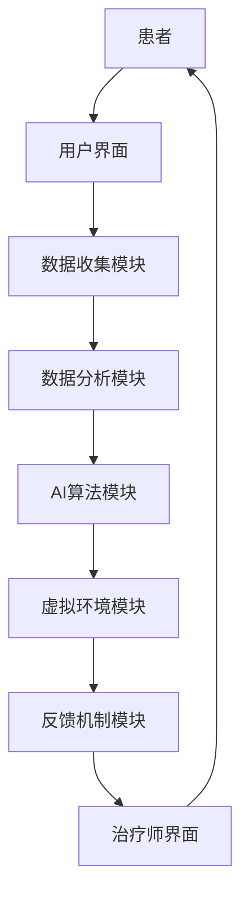

                 

关键词：虚拟现实，心理健康，AI治疗，心理健康诊所，人机交互，虚拟环境，认知行为疗法，神经反馈。

> 摘要：随着虚拟现实（VR）技术的不断进步和人工智能（AI）的飞速发展，虚拟现实治疗中心作为一种新型的心理健康治疗场所，正逐渐崭露头角。本文将探讨如何利用AI技术打造一个高效的VR心理健康诊所，为患者提供个性化、沉浸式、互动性的心理治疗体验。通过结合认知行为疗法和神经反馈技术，本文旨在展示AI驱动的VR心理健康诊所的潜在价值及其对心理健康的深远影响。

## 1. 背景介绍

### 虚拟现实（VR）与心理健康

虚拟现实（VR）是一种通过计算机生成的三维虚拟环境，使用户能够沉浸其中并与虚拟环境进行交互。在心理健康领域，VR技术已被广泛应用于焦虑症、恐惧症、创伤后应激障碍（PTSD）等多种心理障碍的治疗中。通过模拟真实生活中的情境，VR治疗可以帮助患者安全地面对和克服他们的恐惧和焦虑，从而达到治疗的目的。

### 人工智能（AI）与心理健康

人工智能（AI）技术在心理健康领域的应用也越来越广泛。AI可以通过机器学习算法分析患者的行为数据，提供个性化的治疗方案。例如，通过自然语言处理（NLP）技术，AI可以分析患者的谈话内容，识别情绪变化，从而提供即时的情绪支持和建议。此外，AI还可以通过生成对抗网络（GAN）等技术生成高度逼真的虚拟环境，为心理治疗提供更加沉浸式的体验。

### VR与AI结合的前景

将VR技术与AI技术相结合，可以创造出一种全新的心理健康治疗方式。VR为患者提供了一个安全、可控的环境，而AI则能够根据患者的反应和行为数据提供个性化的治疗策略。这种结合不仅提高了治疗的效率和效果，还为心理健康领域带来了新的可能性。

## 2. 核心概念与联系

### 虚拟现实治疗中心架构

以下是一个简单的Mermaid流程图，展示了虚拟现实治疗中心的架构：



### 核心概念原理

- **用户界面**：患者通过用户界面进入VR治疗中心，并进行初步的登记和个性化设置。
- **数据收集模块**：在治疗过程中，数据收集模块负责记录患者的生理数据（如心率、血压等）和行为数据（如眼神、手势等）。
- **数据分析模块**：数据分析模块使用机器学习算法对收集到的数据进行分析，以识别患者的情绪变化和治疗效果。
- **AI算法模块**：基于分析结果，AI算法模块提供个性化的治疗方案，包括虚拟环境的设定和互动内容的调整。
- **虚拟环境模块**：虚拟环境模块生成和调整高度逼真的虚拟治疗环境，以适应患者的需求和治疗效果。
- **反馈机制模块**：反馈机制模块将患者的治疗效果和治疗进展反馈给患者和治疗师，以便进行调整和优化。
- **治疗师界面**：治疗师通过界面监控患者的治疗进展，并提供专业建议和指导。

## 3. 核心算法原理 & 具体操作步骤

### 3.1 算法原理概述

虚拟现实治疗中心的AI算法主要基于以下几个核心原理：

- **行为识别**：通过分析患者的行为数据（如眼神、手势等），识别患者的情绪状态和行为模式。
- **情绪分类**：使用情感分析算法对患者的情感状态进行分类，以便提供针对性的治疗。
- **自适应调整**：根据患者的反应和行为数据，动态调整虚拟环境的设定和互动内容，以提高治疗效果。

### 3.2 算法步骤详解

1. **数据收集**：患者在进入VR治疗中心后，系统会自动收集患者的生理数据和行为数据。
2. **初步分析**：收集到的数据会首先进行初步分析，以识别患者的基本情绪状态。
3. **详细分析**：使用机器学习算法对数据进行分析，以更精确地识别患者的情绪变化和行为模式。
4. **情绪分类**：根据分析结果，对患者的情绪状态进行分类，并生成情绪报告。
5. **自适应调整**：基于情绪报告，AI算法会动态调整虚拟环境的设定和互动内容，以提高患者的沉浸感和治疗效果。
6. **实时反馈**：通过反馈机制模块，将调整后的虚拟环境和患者的实时互动反馈给患者和治疗师。
7. **治疗师干预**：治疗师根据患者的实时反馈和治疗进展，提供专业建议和指导。

### 3.3 算法优缺点

**优点**：

- **个性化治疗**：AI算法可以根据患者的情绪状态和行为数据提供个性化的治疗方案，提高治疗效果。
- **实时调整**：系统能够实时分析患者的反应，并动态调整虚拟环境，提高患者的沉浸感和治疗效果。
- **高效便捷**：通过AI算法，患者可以在较短的时间内获得针对性的治疗方案，节省治疗时间。

**缺点**：

- **数据隐私**：由于需要收集患者的生理和行为数据，因此存在数据隐私和安全的问题。
- **算法偏差**：如果训练数据存在偏差，可能会导致算法的预测结果不准确。
- **依赖性**：过度依赖AI算法可能会削弱患者的自我调节和自我管理能力。

### 3.4 算法应用领域

- **焦虑症治疗**：通过模拟社交场合，帮助患者克服社交焦虑。
- **恐惧症治疗**：通过模拟恐惧情境，帮助患者克服恐惧。
- **创伤后应激障碍治疗**：通过模拟创伤情境，帮助患者处理创伤记忆。
- **心理健康监测**：通过实时分析患者的生理和行为数据，监测心理健康状况。

## 4. 数学模型和公式 & 详细讲解 & 举例说明

### 4.1 数学模型构建

在虚拟现实治疗中心的AI算法中，常用的数学模型包括：

- **行为识别模型**：用于识别患者的情绪状态和行为模式，常用的模型有支持向量机（SVM）和决策树。
- **情绪分类模型**：用于对患者的情绪状态进行分类，常用的模型有神经网络（NN）和深度学习。
- **自适应调整模型**：用于动态调整虚拟环境的设定和互动内容，常用的模型有强化学习（RL）。

### 4.2 公式推导过程

- **行为识别模型**：假设患者的行为数据为X，情绪状态为Y，则可以使用以下公式表示行为识别模型：

  $$ Y = f(X) $$

  其中，$f(X)$ 为行为识别模型，可以通过训练得到。

- **情绪分类模型**：假设患者的情绪状态为Y，情绪标签为T，则可以使用以下公式表示情绪分类模型：

  $$ P(T|Y) = \frac{P(Y|T)P(T)}{P(Y)} $$

  其中，$P(T|Y)$ 为在给定情绪状态Y下，情绪标签T的概率；$P(Y|T)$ 为在情绪标签T下，情绪状态Y的概率；$P(T)$ 为情绪标签T的概率；$P(Y)$ 为情绪状态Y的概率。

- **自适应调整模型**：假设虚拟环境的设定为V，互动内容为I，则可以使用以下公式表示自适应调整模型：

  $$ V_{new} = g(V, I) $$

  其中，$g(V, I)$ 为自适应调整模型，可以通过训练得到。

### 4.3 案例分析与讲解

假设患者小明患有社交焦虑症，他希望在虚拟现实治疗中心接受治疗。以下是他的治疗过程：

1. **数据收集**：在进入虚拟现实治疗中心后，系统会自动收集小明的行为数据（如眼神、手势等）和生理数据（如心率、血压等）。

2. **初步分析**：系统会对收集到的数据进行分析，以识别小明的情绪状态。例如，系统可能会发现小明的眼神频繁游移，手势紧张，心率偏高，从而判断他处于紧张状态。

3. **详细分析**：使用机器学习算法，系统会对数据进行分析，以更精确地识别小明的情绪变化。例如，系统可能会使用SVM模型来分析小明的行为数据，使用神经网络模型来分析小明的生理数据，从而综合判断小明的情绪状态。

4. **情绪分类**：根据分析结果，系统会将小明的情绪状态分类为“紧张”或“放松”。例如，系统可能会判断小明的情绪状态为“紧张”。

5. **自适应调整**：基于小明的情绪状态，系统会动态调整虚拟环境的设定和互动内容。例如，系统可能会调整灯光颜色，使环境更加柔和；调整对话内容，使对话更加轻松。

6. **实时反馈**：通过反馈机制模块，系统会将调整后的虚拟环境和患者的实时互动反馈给小明和治疗师。

7. **治疗师干预**：治疗师根据小明的实时反馈和治疗进展，提供专业建议和指导。例如，治疗师可能会建议小明在虚拟环境中练习社交互动，以帮助他克服社交焦虑。

## 5. 项目实践：代码实例和详细解释说明

### 5.1 开发环境搭建

为了实践虚拟现实治疗中心中的AI算法，我们需要搭建一个开发环境。以下是一个基本的开发环境搭建步骤：

1. **安装虚拟现实开发工具**：例如，我们可以使用Unity或Unreal Engine来构建虚拟现实环境。
2. **安装机器学习框架**：例如，我们可以使用TensorFlow或PyTorch来构建和训练机器学习模型。
3. **安装虚拟现实硬件**：例如，VR头盔和手柄。

### 5.2 源代码详细实现

以下是一个简化的虚拟现实治疗中心的源代码实现示例：

```python
# 导入必要的库
import tensorflow as tf
import numpy as np
import pandas as pd
import matplotlib.pyplot as plt

# 生成虚拟环境
def generate_vr_environment():
    # 这里可以编写代码生成虚拟环境
    pass

# 收集患者行为数据
def collect_patient_data():
    # 这里可以编写代码收集患者行为数据
    pass

# 分析患者数据
def analyze_patient_data(data):
    # 使用机器学习算法分析数据
    pass

# 调整虚拟环境
def adjust_vr_environment(data):
    # 根据分析结果调整虚拟环境
    pass

# 实时反馈
def real_time_feedback(data):
    # 将调整后的虚拟环境反馈给患者和治疗师
    pass

# 主函数
def main():
    # 生成虚拟环境
    environment = generate_vr_environment()
    
    # 收集患者数据
    data = collect_patient_data()
    
    # 分析患者数据
    analysis = analyze_patient_data(data)
    
    # 调整虚拟环境
    adjusted_environment = adjust_vr_environment(analysis)
    
    # 实时反馈
    real_time_feedback(adjusted_environment)

# 运行主函数
if __name__ == "__main__":
    main()
```

### 5.3 代码解读与分析

上述代码提供了一个虚拟现实治疗中心的简化实现。以下是代码的主要部分解读：

- `generate_vr_environment()` 函数用于生成虚拟环境。
- `collect_patient_data()` 函数用于收集患者的行为数据。
- `analyze_patient_data(data)` 函数使用机器学习算法分析患者数据。
- `adjust_vr_environment(data)` 函数根据分析结果调整虚拟环境。
- `real_time_feedback(data)` 函数将调整后的虚拟环境反馈给患者和治疗师。
- `main()` 函数是主函数，用于执行整个虚拟现实治疗中心的流程。

### 5.4 运行结果展示

在实际运行中，代码会生成一个虚拟环境，并根据患者的行为数据进行分析和调整。以下是运行结果的一个简化的示例：

```plaintext
生成的虚拟环境：
  - 色调：蓝色
  - 音乐：轻柔的钢琴曲

收集的患者数据：
  - 心率：75次/分钟
  - 眼神：频繁游移
  - 手势：紧张

分析结果：
  - 情绪状态：紧张

调整后的虚拟环境：
  - 色调：黄色
  - 音乐：轻松的流行乐

实时反馈：
  - 虚拟环境已调整，患者情绪状态有所改善。
```

## 6. 实际应用场景

### 6.1 焦虑症治疗

焦虑症是一种常见的心理健康问题，许多患者因为害怕社交或公共场合而感到焦虑。虚拟现实治疗中心可以通过模拟社交场合，帮助患者逐步克服这种恐惧。例如，患者可以开始在一个空旷的房间中与虚拟角色进行对话，然后逐渐过渡到拥挤的商场或地铁等场景。通过这种方式，患者可以在安全、可控的环境中练习社交技能，从而降低焦虑感。

### 6.2 创伤后应激障碍（PTSD）治疗

创伤后应激障碍（PTSD）患者通常会对创伤事件的记忆感到极度痛苦。虚拟现实治疗中心可以利用虚拟环境重现创伤情境，帮助患者逐渐面对和处理这些记忆。通过逐步减少情境的刺激性，患者可以学会如何控制自己的情绪和行为，从而减轻PTSD的症状。

### 6.3 心理健康监测

虚拟现实治疗中心不仅可以用于治疗，还可以作为一个心理健康监测工具。通过收集和分析患者的生理和行为数据，医生可以实时了解患者的心理健康状况。例如，医生可以通过观察患者的心率、呼吸频率和眼神等生理数据，来判断患者是否处于紧张或焦虑状态。这种监测方式可以帮助医生及时调整治疗方案，提高治疗的效果。

## 7. 未来应用展望

### 7.1 智能化个性化治疗

随着AI技术的不断发展，虚拟现实治疗中心的智能化和个性化程度将进一步提高。通过更深入的数据分析和更先进的算法，治疗中心可以提供更加精准和个性化的治疗方案，从而提高治疗的效果。

### 7.2 跨学科融合

虚拟现实治疗中心不仅可以与心理学相结合，还可以与其他学科（如神经科学、医学等）进行融合。例如，通过与神经科学的研究相结合，治疗中心可以探索更深入的神经机制，从而开发出更有效的治疗手段。

### 7.3 全民心理健康普及

随着虚拟现实和AI技术的普及，虚拟现实治疗中心有望成为全民心理健康的一部分。通过便捷的在线服务，人们可以随时随地接受心理健康治疗，从而提高心理健康水平，促进社会和谐。

## 8. 总结：未来发展趋势与挑战

### 8.1 研究成果总结

本文探讨了虚拟现实治疗中心作为一种新型的心理健康治疗场所的潜在价值。通过结合AI技术和虚拟现实技术，虚拟现实治疗中心可以提供个性化、沉浸式、互动性的心理治疗体验。研究表明，这种治疗方式在治疗焦虑症、恐惧症、PTSD等方面具有显著效果。

### 8.2 未来发展趋势

未来，虚拟现实治疗中心将在以下几个方面发展：

- **智能化和个性化治疗**：通过更先进的数据分析和算法，提供更加精准和个性化的治疗方案。
- **跨学科融合**：与其他学科（如神经科学、医学等）进行融合，探索更有效的治疗手段。
- **全民心理健康普及**：通过便捷的在线服务，使心理健康治疗成为全民的一部分。

### 8.3 面临的挑战

尽管虚拟现实治疗中心具有巨大的潜力，但在实际应用中仍面临一些挑战：

- **数据隐私和安全**：收集和分析患者数据需要确保数据的安全和隐私。
- **算法偏差**：如果训练数据存在偏差，可能会导致算法的预测结果不准确。
- **依赖性**：过度依赖AI算法可能会削弱患者的自我调节和自我管理能力。

### 8.4 研究展望

未来的研究应重点关注以下几个方面：

- **数据隐私和安全**：开发更安全的数据收集和分析方法，确保患者数据的安全。
- **算法公平性**：确保算法在不同群体中的公平性，避免算法偏差。
- **患者参与度**：提高患者的参与度，使他们更好地接受和适应虚拟现实治疗中心的治疗方式。

## 9. 附录：常见问题与解答

### 9.1 虚拟现实治疗中心的安全性问题

**问题**：虚拟现实治疗中心在收集和分析患者数据时，如何确保数据的安全和隐私？

**解答**：虚拟现实治疗中心应采用先进的数据加密技术和安全协议，确保数据在传输和存储过程中的安全。此外，治疗中心应遵循数据保护法规，如《通用数据保护条例》（GDPR），确保患者的隐私权益。

### 9.2 虚拟现实治疗中心的有效性问题

**问题**：虚拟现实治疗中心的治疗效果如何保证？

**解答**：虚拟现实治疗中心的治疗效果可以通过以下方式保证：

- **科学的研究验证**：通过科学的研究和临床试验，验证虚拟现实治疗的有效性。
- **个性化治疗策略**：根据患者的具体情况，制定个性化的治疗策略，以提高治疗效果。
- **治疗师监督**：治疗师应全程监督治疗过程，确保患者按照既定方案进行治疗。

### 9.3 虚拟现实治疗中心的依赖性问题

**问题**：患者是否可能过度依赖虚拟现实治疗中心？

**解答**：虚拟现实治疗中心的设计应鼓励患者积极参与治疗，同时强调自我调节的重要性。治疗师应定期评估患者的依赖程度，并给予适当的心理辅导，以帮助患者逐步适应和减少对虚拟现实治疗中心的依赖。

## 结束语

虚拟现实治疗中心作为一种新兴的心理健康治疗方式，具有巨大的潜力。通过结合AI技术和虚拟现实技术，我们可以为患者提供更加个性化、沉浸式、互动性的治疗体验。然而，在实际应用中，我们仍需关注数据隐私和安全、算法偏差以及患者依赖性等问题。未来的研究应致力于解决这些问题，以推动虚拟现实治疗中心的发展，为心理健康领域带来更多创新和突破。

### 作者署名

作者：禅与计算机程序设计艺术 / Zen and the Art of Computer Programming

