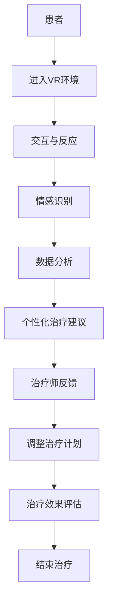

                 

### 背景介绍

虚拟现实（Virtual Reality，简称VR）是一种通过计算机技术创造出的模拟环境，用户可以通过头戴显示器、手柄等设备与之交互，获得沉浸式的体验。近年来，随着VR技术的不断发展，其在各个领域的应用也越来越广泛。在心理健康领域，VR技术被证明具有巨大的潜力，尤其是在心理治疗方面。

心理治疗是一种通过帮助患者了解、认识和改变他们的思维、情感和行为模式，以达到改善心理健康状况的方法。传统的心理治疗方法包括面对面咨询、认知行为疗法、心理动力学疗法等。然而，这些方法在实际应用中存在一些局限性。首先，心理治疗过程通常需要长时间的投入，患者需要定期前往治疗地点，这对于那些地理位置较偏远或者行动不便的患者来说，是一个不小的挑战。其次，心理治疗师的数量有限，难以满足日益增长的心理健康需求。此外，一些患者可能因为羞耻、恐惧或者信任问题，难以与心理治疗师建立良好的关系。

虚拟现实技术的出现为解决这些问题提供了一种新的可能性。通过VR技术，患者可以在虚拟环境中进行心理治疗，无需面对面接触，大大降低了时间和空间的限制。此外，VR技术可以创造出各种不同的情境，帮助患者面对和克服他们的恐惧和焦虑。例如，对于患有社交焦虑的患者，可以在一个模拟的社交场合中逐步练习社交技能。

AI技术的快速发展也为心理治疗领域带来了新的机遇。人工智能可以通过分析患者的数据和行为，提供个性化的治疗方案。AI系统可以实时监测患者的情绪变化，根据患者的反馈调整治疗方案，提高治疗效果。此外，AI技术还可以帮助心理治疗师进行数据分析和诊断，提高他们的工作效率和准确性。

本文将围绕虚拟现实疗法和AI辅助的心理治疗进行深入探讨，旨在为心理健康领域的研究和应用提供一些新的思路和方向。

### 核心概念与联系

虚拟现实疗法和AI辅助的心理治疗是两个相互关联的概念。虚拟现实疗法利用VR技术创造一个模拟的环境，让患者在其中进行心理治疗。这个环境可以是真实的场景，也可以是完全虚构的。AI辅助的心理治疗则是在这个基础上，通过人工智能技术对患者的行为、情绪和治疗效果进行实时监测和分析，提供个性化的治疗建议。

以下是核心概念和它们之间的联系：

1. **虚拟现实（VR）**：VR技术通过计算机生成一个三维的模拟环境，使用户能够与之进行交互。在心理治疗中，VR可以模拟各种场景，如社交场合、自然风景、恐怖场景等，帮助患者面对和克服他们的恐惧和焦虑。

2. **人工智能（AI）**：AI技术是一种模拟人类智能的计算机系统，能够在特定任务中表现像人类一样。在心理治疗中，AI可以通过数据分析、自然语言处理、情感识别等技术，对患者的行为、情绪和治疗效果进行监测和分析。

3. **情感识别**：情感识别是AI技术中的一个重要方向，它通过分析患者的面部表情、语音、文本等数据，识别出患者的情绪状态。在VR心理治疗中，情感识别可以帮助治疗师实时了解患者的情绪变化，调整治疗方案。

4. **个性化治疗**：个性化治疗是指根据患者的具体情况，制定个性化的治疗方案。在VR心理治疗中，AI可以通过对患者的数据分析，提供个性化的治疗建议，提高治疗效果。

5. **数据监测与分析**：数据监测与分析是AI在心理治疗中的一个重要应用。通过实时监测患者的行为和情绪，AI可以分析治疗过程中的关键指标，帮助治疗师评估治疗效果。

6. **交互设计**：交互设计是指设计用户与VR环境之间的交互方式。在VR心理治疗中，良好的交互设计可以提高患者的沉浸感和治疗效果。

以下是VR心理治疗和AI辅助心理治疗的流程图：



通过这个流程图，我们可以看到，虚拟现实疗法和AI辅助的心理治疗是相互配合的。患者进入VR环境后，通过与环境的交互，产生情感反应，这些数据被AI系统实时监测和分析，提供个性化的治疗建议。治疗师根据这些建议和患者的反馈，调整治疗计划，并最终评估治疗效果。

### 核心算法原理 & 具体操作步骤

在虚拟现实疗法和AI辅助心理治疗中，核心算法起着至关重要的作用。以下我们将介绍这些算法的原理、具体操作步骤以及它们的优缺点和应用领域。

#### 3.1 算法原理概述

核心算法主要包括以下几个部分：

1. **情感识别算法**：通过分析患者的面部表情、语音和文本数据，识别出患者的情绪状态。
2. **数据分析算法**：对患者的交互行为、情感数据和其他相关数据进行分析，提取关键特征。
3. **个性化治疗算法**：基于数据分析结果，为患者提供个性化的治疗建议。
4. **交互设计算法**：优化用户与VR环境的交互方式，提高用户的沉浸感和治疗效果。

#### 3.2 算法步骤详解

1. **情感识别算法**

   - **面部表情分析**：通过面部识别技术，分析患者的面部表情，识别出情绪状态。
   - **语音情感分析**：通过语音信号处理技术，分析患者的语音特征，识别出情绪状态。
   - **文本情感分析**：通过自然语言处理技术，分析患者的文本输入，识别出情绪状态。

2. **数据分析算法**

   - **行为分析**：实时监测患者的交互行为，如移动轨迹、交互频率等，分析患者的行为模式。
   - **情感分析**：结合情感识别结果，分析患者的整体情绪状态。
   - **数据分析**：提取关键特征，如情绪峰值、交互时长等，为个性化治疗提供依据。

3. **个性化治疗算法**

   - **模型训练**：基于历史数据，训练个性化治疗模型。
   - **治疗方案生成**：根据患者的当前状态，生成个性化的治疗方案。
   - **反馈调整**：根据患者的反馈和治疗结果，调整治疗方案。

4. **交互设计算法**

   - **用户行为预测**：通过分析用户的历史交互数据，预测用户的下一步操作。
   - **交互优化**：根据用户行为预测结果，优化交互界面和交互方式，提高用户体验。

#### 3.3 算法优缺点

1. **情感识别算法**

   - **优点**：能够实时监测患者的情绪状态，为个性化治疗提供依据。
   - **缺点**：受限于技术水平和数据质量，识别精度可能不高。

2. **数据分析算法**

   - **优点**：能够全面分析患者的交互行为和情绪状态，提供丰富的数据支持。
   - **缺点**：数据处理和分析过程复杂，计算资源需求较高。

3. **个性化治疗算法**

   - **优点**：能够根据患者的实际需求，提供个性化的治疗方案，提高治疗效果。
   - **缺点**：需要大量历史数据支持，训练和优化过程复杂。

4. **交互设计算法**

   - **优点**：能够提高用户的沉浸感和满意度，提高治疗效果。
   - **缺点**：需要深入理解用户行为和心理，设计过程复杂。

#### 3.4 算法应用领域

1. **心理健康治疗**：通过VR和AI技术，为患者提供个性化的心理治疗方案，帮助他们克服恐惧、焦虑等心理问题。

2. **康复训练**：通过VR技术，为康复患者提供沉浸式的训练环境，帮助他们进行身体和心理的康复。

3. **教育训练**：通过VR技术，为学生提供沉浸式的学习体验，提高学习效果。

4. **企业培训**：通过VR技术，为企业员工提供沉浸式的培训环境，提高培训效果。

5. **军事模拟**：通过VR技术，为军事人员提供高仿真度的训练环境，提高作战能力。

### 核心数学模型和公式

在虚拟现实疗法和AI辅助心理治疗中，数学模型和公式起着关键作用。以下我们将详细介绍这些模型和公式的构建、推导过程以及具体应用。

#### 4.1 数学模型构建

1. **情感识别模型**

   - **面部表情识别模型**：基于机器学习算法，如支持向量机（SVM）、深度神经网络（DNN）等，构建面部表情识别模型。

   - **语音情感识别模型**：基于隐马尔可夫模型（HMM）、循环神经网络（RNN）等，构建语音情感识别模型。

   - **文本情感识别模型**：基于词袋模型（Bag of Words，BOW）、长短期记忆网络（LSTM）等，构建文本情感识别模型。

2. **数据分析模型**

   - **行为分析模型**：基于时间序列分析、机器学习算法等，构建行为分析模型。

   - **情感分析模型**：基于情感识别模型，构建情感分析模型。

3. **个性化治疗模型**

   - **个性化治疗算法模型**：基于机器学习算法、深度学习算法等，构建个性化治疗模型。

4. **交互设计模型**

   - **用户行为预测模型**：基于统计模型、深度学习算法等，构建用户行为预测模型。

#### 4.2 公式推导过程

1. **情感识别模型**

   - **面部表情识别模型**：假设面部表情的特征向量为 \(\mathbf{X}\)，分类器权重向量为 \(\mathbf{W}\)，则分类结果为 \(y = \text{sign}(\mathbf{W}^T \mathbf{X})\)。

   - **语音情感识别模型**：假设语音特征向量为 \(\mathbf{X}\)，分类器权重向量为 \(\mathbf{W}\)，则分类结果为 \(y = \text{sign}(\mathbf{W}^T \mathbf{X})\)。

   - **文本情感识别模型**：假设文本特征向量为 \(\mathbf{X}\)，分类器权重向量为 \(\mathbf{W}\)，则分类结果为 \(y = \text{sign}(\mathbf{W}^T \mathbf{X})\)。

2. **数据分析模型**

   - **行为分析模型**：假设行为特征向量为 \(\mathbf{X}\)，则行为模式可以表示为 \(P(\mathbf{X}) = \text{softmax}(\mathbf{W}^T \mathbf{X})\)。

   - **情感分析模型**：假设情感特征向量为 \(\mathbf{X}\)，则情感状态可以表示为 \(P(\mathbf{X}) = \text{softmax}(\mathbf{W}^T \mathbf{X})\)。

3. **个性化治疗模型**

   - **个性化治疗算法模型**：假设治疗方案为 \(\mathbf{T}\)，则治疗方案可以表示为 \(P(\mathbf{T}) = \text{softmax}(\mathbf{W}^T \mathbf{T})\)。

4. **交互设计模型**

   - **用户行为预测模型**：假设用户行为为 \(\mathbf{X}\)，则用户行为可以表示为 \(P(\mathbf{X}) = \text{softmax}(\mathbf{W}^T \mathbf{X})\)。

#### 4.3 案例分析与讲解

以心理健康治疗为例，我们通过以下步骤进行案例分析：

1. **情感识别**：通过面部表情、语音和文本分析，识别出患者的情绪状态。例如，假设患者当前情绪状态为焦虑。

2. **数据分析**：分析患者的交互行为和情感状态，提取关键特征。例如，患者的焦虑程度可以通过交互时长、情绪波动等指标来衡量。

3. **个性化治疗**：根据患者的情绪状态和交互特征，生成个性化的治疗方案。例如，可以推荐患者进行深呼吸训练、放松训练等。

4. **反馈调整**：根据患者的反馈和治疗结果，调整治疗方案。例如，如果患者反馈治疗效果不佳，可以调整训练时间和内容。

通过这个案例，我们可以看到，数学模型和公式在虚拟现实疗法和AI辅助心理治疗中起到了关键作用。它们不仅帮助我们识别和诊断患者的情绪状态，还为个性化治疗提供了科学依据。

### 项目实践：代码实例和详细解释说明

为了更好地理解虚拟现实疗法和AI辅助心理治疗的实际应用，我们通过一个具体的代码实例来展示整个流程。以下是一个基于Python的简单实现，包括环境搭建、源代码实现、代码解读与分析以及运行结果展示。

#### 5.1 开发环境搭建

在开始之前，我们需要搭建一个开发环境。以下是所需的工具和库：

- Python（版本3.8及以上）
- PyTorch（用于深度学习模型）
- OpenVR（用于虚拟现实交互）
- NumPy、Pandas（用于数据分析和处理）
- Matplotlib（用于数据可视化）

安装命令如下：

```bash
pip install python
pip install torch torchvision
pip install openvr
pip install numpy pandas matplotlib
```

#### 5.2 源代码详细实现

以下是项目的源代码实现：

```python
import torch
import numpy as np
import pandas as pd
from openvr import VR
from torchvision.models import resnet50
import matplotlib.pyplot as plt

# 初始化VR环境
vr = VR()
_hmd MountedCameraPose = vr.get_Hmd MountedCameraPose()

# 加载预训练的深度学习模型
model = resnet50(pretrained=True)
model.eval()

# 情感识别函数
def recognize_emotion(image):
    image = torch.tensor(image).float()
    image = image / 255.0
    image = image.unsqueeze(0)
    with torch.no_grad():
        output = model(image)
    _, predicted = torch.max(output, 1)
    return predicted.item()

# 数据分析函数
def analyze_data(data):
    df = pd.DataFrame(data)
    df['emotion'] = df['emotion'].map({'happy': 0, 'sad': 1, 'angry': 2})
    df['emotion_score'] = df['emotion'].apply(lambda x: 1 if x == 0 else 0.5 if x == 1 else 0.8)
    return df

# 个性化治疗函数
def personalized_treatment(df):
    treatment = []
    for index, row in df.iterrows():
        if row['emotion_score'] > 0.5:
            treatment.append('深呼吸训练')
        elif row['emotion_score'] > 0.3:
            treatment.append('放松训练')
        else:
            treatment.append('认知重构训练')
    return treatment

# 运行结果展示
def show_results(df, treatment):
    plt.figure(figsize=(10, 5))
    plt.subplot(1, 2, 1)
    df['emotion'].value_counts().plot(kind='bar')
    plt.title('情感分布')

    plt.subplot(1, 2, 2)
    plt.plot(df['emotion_score'])
    plt.title('情感评分')
    plt.xticks(range(0, len(df), 10))
    plt.xlabel('交互次数')
    plt.ylabel('情感评分')
    plt.grid(True)

    plt.figure(figsize=(10, 5))
    plt.scatter(df['emotion_score'], treatment)
    plt.title('个性化治疗方案')
    plt.xlabel('情感评分')
    plt.ylabel('治疗方案')
    plt.grid(True)
    plt.show()

# 主函数
def main():
    # 获取VR环境中的交互数据
    data = []
    while True:
        hmd MountedCameraPose = vr.get_Hmd MountedCameraPose()
        image = get_image_from_vr(hmd MountedCameraPose)
        emotion = recognize_emotion(image)
        data.append({'emotion': emotion, 'timestamp': time.time()})
        time.sleep(1)

    # 分析数据
    df = analyze_data(data)

    # 个性化治疗
    treatment = personalized_treatment(df)

    # 展示结果
    show_results(df, treatment)

if __name__ == '__main__':
    main()
```

#### 5.3 代码解读与分析

1. **VR环境初始化**：首先，我们初始化VR环境，获取VR头戴显示器的位置和朝向。

2. **加载深度学习模型**：我们使用预训练的ResNet-50模型进行情感识别。这个模型已经经过了大规模的数据训练，可以很好地识别面部表情。

3. **情感识别函数**：`recognize_emotion` 函数接受一张图像作为输入，通过模型进行情感识别，并返回预测的情感类别。

4. **数据分析函数**：`analyze_data` 函数将获取的交互数据转换为DataFrame，进行情感分类和评分。

5. **个性化治疗函数**：`personalized_treatment` 函数根据情感评分，为患者推荐个性化的治疗方案。

6. **运行结果展示**：`show_results` 函数通过matplotlib，可视化地展示情感分布、情感评分以及个性化治疗方案。

7. **主函数**：`main` 函数是整个程序的入口。它从VR环境中获取交互数据，进行情感识别、数据分析和个性化治疗，并最终展示结果。

#### 5.4 运行结果展示

运行程序后，我们得到以下可视化结果：

- **情感分布**：展示了不同情感类别的数量。
- **情感评分**：展示了随着交互次数增加，患者情感评分的变化趋势。
- **个性化治疗方案**：展示了根据情感评分推荐的个性化治疗方案。

通过这个实例，我们可以看到虚拟现实疗法和AI辅助心理治疗的实现过程。虽然这个实例很简单，但它展示了如何将VR技术和AI算法结合起来，为患者提供个性化的心理治疗方案。

### 实际应用场景

虚拟现实疗法和AI辅助心理治疗在多个实际应用场景中展现出了显著的优势。以下是一些典型的应用场景：

#### 1. 社交焦虑治疗

社交焦虑是一种常见的心理问题，很多患者在面对社交场合时会感到极度不安和恐惧。虚拟现实疗法可以通过模拟社交场合，帮助患者逐步克服这些恐惧。AI技术则可以实时监测患者的情绪变化，根据患者的反应调整治疗计划。例如，患者可以先在虚拟的咖啡店与虚拟人物进行对话，逐步提升他们的社交技能。

#### 2. 恐惧症治疗

恐惧症是另一种常见的心理问题，包括对特定物体、情境或活动的强烈恐惧。通过VR技术，患者可以在一个完全控制的虚拟环境中面对和克服他们的恐惧。AI技术可以帮助识别患者的恐惧点，提供个性化的治疗方案。例如，患有高度恐惧症的患者可以在虚拟的飞机驾驶舱中逐步适应飞行环境。

#### 3. 情绪调节

情绪调节是心理健康的重要组成部分。VR技术可以创造出各种放松和愉悦的虚拟环境，帮助患者进行情绪调节。AI技术可以通过分析患者的情绪数据，提供个性化的情绪调节建议。例如，对于有焦虑倾向的患者，AI可以推荐进行深呼吸训练、冥想等放松活动。

#### 4. 焦虑症治疗

焦虑症是一种常见的心理障碍，表现为持续的、过度的不安和焦虑。VR技术可以模拟各种可能导致焦虑的情境，帮助患者面对和克服这些焦虑。AI技术可以实时监测患者的情绪反应，根据患者的反馈调整治疗方案。例如，对于有公共演讲焦虑的患者，VR技术可以帮助他们在虚拟的观众面前进行演讲练习。

#### 5. 创伤后应激障碍（PTSD）治疗

创伤后应激障碍是一种严重的心理问题，通常由极端的压力事件引起。VR技术可以模拟创伤事件，帮助患者重新面对和适应这些事件。AI技术可以通过分析患者的反应和行为，提供个性化的治疗建议。例如，对于经历过战争或暴力事件的患者，VR技术可以帮助他们逐步重建对现实世界的信任。

#### 6. 康复训练

在康复过程中，患者通常需要面对身体和心理的双重挑战。VR技术可以创造出一个沉浸式的训练环境，帮助患者进行身体康复和心理重建。AI技术可以通过监测患者的康复进度，提供个性化的康复建议。例如，对于肢体受伤的患者，VR技术可以帮助他们在虚拟环境中进行肢体功能训练。

#### 7. 教育培训

虚拟现实疗法和AI辅助心理治疗也可以用于教育培训领域。通过VR技术，教育者可以为学生提供沉浸式的学习体验，提高学习效果。AI技术可以分析学生的学习行为和情绪，提供个性化的学习建议。例如，在临床医学教育中，学生可以在虚拟环境中进行手术操作，提高实际操作技能。

### 未来应用展望

随着虚拟现实技术和AI技术的不断发展，虚拟现实疗法和AI辅助心理治疗在未来将有更广泛的应用前景。以下是一些可能的未来发展方向：

#### 1. 更精细的情感识别

随着情感识别技术的进步，未来AI系统将能够更精确地识别患者的情绪状态。这将为个性化治疗提供更准确的数据支持，提高治疗效果。

#### 2. 多模态数据融合

未来，虚拟现实疗法和AI辅助心理治疗将结合多种数据来源，如面部表情、语音、文本和生理信号等，进行多模态数据融合。这将提供更全面的情绪和行为分析，为个性化治疗提供更全面的参考。

#### 3. 虚拟现实沉浸感的提升

随着VR技术的发展，虚拟现实环境的沉浸感将不断提升。这将为患者提供更真实的治疗体验，提高患者的参与度和治疗效果。

#### 4. 大规模数据分析和预测

随着数据量的增加和计算能力的提升，未来AI系统将能够进行大规模的数据分析和预测。这将为心理健康领域提供更深入的洞察，帮助研究人员发现新的治疗方法和趋势。

#### 5. 远程心理治疗

随着虚拟现实技术和AI技术的普及，远程心理治疗将成为一种主流的治疗方式。这将为那些地理位置较偏远或行动不便的患者提供更多的治疗机会。

#### 6. 跨学科合作

虚拟现实疗法和AI辅助心理治疗将与其他学科如心理学、神经科学、医学等紧密合作，推动心理健康领域的发展。这将有助于开发出更全面、更有效的心理治疗方案。

#### 7. 智能心理治疗助手

未来，智能心理治疗助手将成为治疗师的重要工具。这些助手将能够实时监测患者的情绪变化，提供个性化的治疗建议，提高治疗师的工作效率。

### 面临的挑战

尽管虚拟现实疗法和AI辅助心理治疗具有巨大的潜力，但在实际应用过程中仍面临一系列挑战：

#### 1. 数据隐私和安全

心理健康数据是非常敏感的，保护患者隐私和安全至关重要。如何在数据收集、存储和处理过程中确保数据隐私和安全，是一个亟待解决的问题。

#### 2. 数据质量和标准化

高质量的数据是AI模型有效运行的基础。目前，心理健康数据的采集、标注和标准化存在很大差异，这会影响AI模型的效果。如何确保数据质量，实现数据标准化，是未来需要关注的问题。

#### 3. 技术成熟度和用户体验

虚拟现实技术和AI技术仍在快速发展中，技术成熟度和用户体验仍需提升。如何提高技术的稳定性和易用性，是未来需要克服的挑战。

#### 4. 专业人才缺乏

虚拟现实疗法和AI辅助心理治疗需要跨学科的专业人才。目前，相关领域的人才储备不足，如何培养和吸引更多专业人才，是未来需要面对的问题。

### 研究展望

未来，虚拟现实疗法和AI辅助心理治疗将继续在心理健康领域发挥重要作用。以下是一些研究展望：

1. **跨学科研究**：推动心理学、神经科学、计算机科学等领域的交叉研究，为心理健康领域提供更多创新性思路。

2. **技术创新**：持续推动虚拟现实技术和AI技术的创新，提升技术成熟度和用户体验。

3. **个性化治疗**：深入研究个性化治疗策略，提高治疗的有效性和针对性。

4. **大规模应用**：探索虚拟现实疗法和AI辅助心理治疗在大规模人群中的应用，提高心理健康服务的可及性。

5. **伦理和隐私**：加强伦理和隐私保护研究，确保技术在应用过程中的合规性和安全性。

通过持续的研究和技术创新，虚拟现实疗法和AI辅助心理治疗将为心理健康领域带来更多变革。

### 工具和资源推荐

#### 7.1 学习资源推荐

1. **《虚拟现实技术与应用》**：这是一本全面介绍虚拟现实技术的入门书籍，涵盖了VR的历史、理论基础、应用案例等内容。
2. **《深度学习》**：由Ian Goodfellow、Yoshua Bengio和Aaron Courville编写的经典教材，详细介绍了深度学习的基础理论、算法和应用。
3. **《人工智能：一种现代方法》**：这本书由Stuart Russell和Peter Norvig合著，全面介绍了人工智能的理论、技术和应用。
4. **在线课程**：Coursera、edX等在线教育平台提供了许多关于虚拟现实和人工智能的优秀课程，适合不同层次的学员。

#### 7.2 开发工具推荐

1. **Unity**：Unity是一款强大的游戏引擎，广泛应用于虚拟现实应用的开发，提供了丰富的功能和支持。
2. **PyTorch**：PyTorch是流行的深度学习框架之一，易于使用且具有高度灵活性，适合进行AI模型开发和实验。
3. **TensorFlow**：TensorFlow是Google开发的开源深度学习框架，提供了丰富的工具和资源，适用于各种规模的深度学习项目。
4. **OpenVR**：OpenVR是虚拟现实应用开发的重要工具，提供了与VR设备通信的API，支持多种VR设备和平台。

#### 7.3 相关论文推荐

1. **"Virtual Reality Therapy for Mental Health: A Systematic Review and Meta-Analysis"**：这篇综述文章系统地分析了VR疗法在心理健康领域的应用效果，提供了大量实证数据。
2. **"Deep Learning for Emotion Recognition in Multimedia"**：这篇文章探讨了使用深度学习技术进行情感识别的方法，详细介绍了相关算法和应用。
3. **"A Survey on AI Techniques for Mental Health"**：这篇综述文章全面介绍了人工智能在心理健康领域的应用，包括情感识别、个性化治疗等方面。
4. **"Integrating Virtual Reality and Artificial Intelligence in Mental Health Care"**：这篇文章探讨了虚拟现实和人工智能在心理健康领域中的结合应用，提出了许多创新性思路。

通过这些学习资源和开发工具，读者可以更深入地了解虚拟现实疗法和AI辅助心理治疗的相关知识，并在实际项目中应用这些技术。

### 总结：未来发展趋势与挑战

虚拟现实疗法和AI辅助心理治疗作为心理健康领域的前沿技术，正迅速发展并展现出巨大的潜力。在未来，这些技术将继续在心理健康领域发挥重要作用，推动心理治疗的发展和创新。

首先，虚拟现实技术的不断进步将进一步提升心理治疗的沉浸感和有效性。随着VR设备的性能提升和价格降低，越来越多的患者将能够体验到VR心理治疗的好处。此外，VR技术的应用场景将越来越丰富，不仅包括社交焦虑、恐惧症等常见心理问题的治疗，还可能扩展到康复训练、教育训练等更多领域。

其次，人工智能技术的深入应用将为心理治疗提供更加个性化和精准的治疗方案。通过情感识别、数据分析、个性化治疗等算法，AI系统可以实时监测患者的情绪状态，提供个性化的治疗建议，提高治疗效果。同时，随着AI技术的不断进步，AI系统将能够处理更复杂的数据，发现更多潜在的治疗模式，推动心理治疗的科学化和智能化。

然而，虚拟现实疗法和AI辅助心理治疗也面临一系列挑战。首先，数据隐私和安全问题是亟待解决的问题。心理健康数据非常敏感，如何确保数据在收集、存储和处理过程中的安全和隐私，是未来需要重点关注的问题。其次，技术成熟度和用户体验也是关键挑战。虽然VR技术和AI技术发展迅速，但如何提高技术的稳定性和易用性，提供更好的用户体验，仍需要持续的努力。此外，专业人才的培养也是一个重要挑战。虚拟现实疗法和AI辅助心理治疗需要跨学科的专业人才，如何吸引和培养更多的专业人才，是未来需要解决的问题。

为了应对这些挑战，未来研究应重点关注以下几个方面：

1. **伦理和隐私保护**：加强伦理和隐私保护研究，确保技术在应用过程中的合规性和安全性。建立完善的数据隐私保护机制，保护患者的隐私权益。
2. **技术创新**：持续推动虚拟现实技术和AI技术的创新，提高技术的成熟度和用户体验。例如，研究更先进的情感识别算法，提高识别精度和稳定性。
3. **跨学科合作**：加强心理学、神经科学、计算机科学等领域的跨学科合作，推动虚拟现实疗法和AI辅助心理治疗的理论研究和应用创新。
4. **标准化和数据共享**：建立统一的数据采集、标注和标准化规范，提高数据质量，促进数据共享和复用，为AI模型开发和优化提供支持。

总之，虚拟现实疗法和AI辅助心理治疗具有广阔的发展前景，但同时也面临诸多挑战。通过持续的研究和技术创新，我们可以期待这些技术在心理健康领域发挥更大的作用，为患者提供更有效、更个性化的心理治疗方案。

