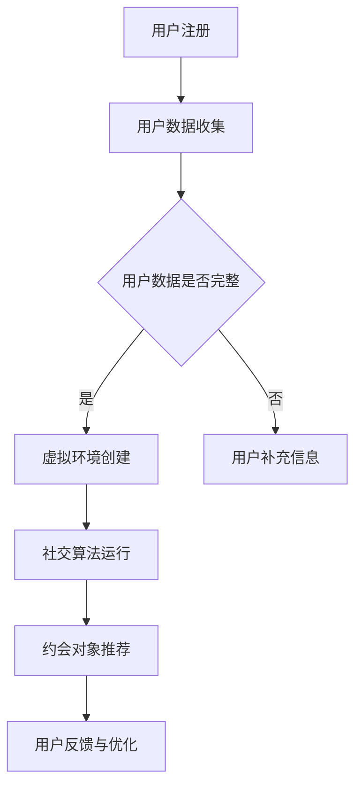

                 

关键词：虚拟现实，约会，创业，数字化社交，用户体验，技术趋势

> 摘要：随着虚拟现实技术的不断发展，虚拟现实约会成为了数字化社交的新趋势。本文将探讨虚拟现实约会创业的机遇与挑战，分析其核心概念、算法原理、应用场景和未来发展趋势。

## 1. 背景介绍

近年来，虚拟现实（VR）技术取得了显著的进展。从最初的实验室研究到如今的大规模应用，VR已经在多个领域展现出了其巨大的潜力，包括游戏、教育、医疗等。然而，在数字化社交领域，虚拟现实约会正在成为一个新兴的创业机会。

虚拟现实约会是指通过虚拟现实技术，为用户提供一个虚拟的社交环境，使其能够在虚拟空间中与其他人进行互动。这种互动可以是面对面的交流，也可以是通过游戏、活动等方式的互动。与传统的线上社交相比，虚拟现实约会提供了更加沉浸式、互动性和个性化的体验。

### 1.1 虚拟现实约会的发展历程

虚拟现实约会的发展历程可以追溯到20世纪90年代的虚拟现实游戏。随着技术的进步，虚拟现实技术在21世纪初逐渐应用于社交领域。2010年后，随着智能手机和移动互联网的普及，虚拟现实约会应用开始崭露头角。

### 1.2 虚拟现实约会的市场前景

根据市场研究公司的数据，全球虚拟现实市场规模预计将在未来几年内持续增长。特别是数字化社交领域的虚拟现实约会，其市场潜力巨大。随着用户对社交体验的要求不断提高，虚拟现实约会有望成为未来社交领域的重要趋势。

## 2. 核心概念与联系

### 2.1 虚拟现实技术

虚拟现实技术（VR）是一种通过计算机模拟生成三维虚拟环境的交互式技术。用户通过VR设备（如VR头盔、VR眼镜等）进入虚拟环境，能够感受到身临其境的体验。

### 2.2 社交网络

社交网络是指用户在互联网上建立社交关系和互动的平台。虚拟现实约会应用通常基于社交网络，用户可以通过这些平台结识新朋友，进行约会和互动。

### 2.3 约会算法

约会算法是一种基于用户兴趣、偏好和社交数据的人工智能算法。通过分析用户的社交行为和偏好，约会算法能够为用户推荐合适的约会对象，提高约会成功率。

### 2.4 虚拟现实约会架构

虚拟现实约会架构通常包括以下几个关键组成部分：

- **用户界面（UI）**：用户与虚拟环境交互的界面。
- **虚拟环境（VE）**：为用户提供的虚拟社交空间。
- **社交算法**：分析用户数据，推荐合适的约会对象。
- **数据存储与处理**：存储和管理用户数据，支持社交算法和虚拟环境的运行。

### 2.5 Mermaid 流程图



## 3. 核心算法原理 & 具体操作步骤

### 3.1 算法原理概述

虚拟现实约会算法的核心目标是基于用户兴趣、偏好和行为，推荐合适的约会对象，提高用户满意度和约会成功率。算法原理主要包括以下几个方面：

- **用户画像构建**：通过分析用户行为数据，构建用户的兴趣偏好画像。
- **相似度计算**：计算用户之间的相似度，作为推荐依据。
- **推荐算法**：根据用户画像和相似度计算结果，为用户推荐合适的约会对象。

### 3.2 算法步骤详解

虚拟现实约会算法的具体步骤如下：

#### 3.2.1 用户画像构建

1. **行为数据收集**：收集用户在虚拟环境中的行为数据，如浏览记录、互动频率等。
2. **特征提取**：从行为数据中提取用户兴趣特征，如兴趣爱好、偏好类型等。
3. **画像构建**：将用户兴趣特征构建成一个多维度的用户画像。

#### 3.2.2 相似度计算

1. **用户画像相似度计算**：计算用户之间的画像相似度，可以使用余弦相似度、皮尔逊相关系数等方法。
2. **加权相似度计算**：对相似度结果进行加权处理，考虑不同特征的重要程度。

#### 3.2.3 推荐算法

1. **基于相似度的推荐**：根据用户画像相似度，为用户推荐相似的用户作为约会对象。
2. **基于上下文的推荐**：结合用户当前的行为和偏好，为用户推荐更加个性化的约会对象。
3. **推荐结果排序**：对推荐结果进行排序，优先推荐相似度较高的用户。

### 3.3 算法优缺点

#### 优点

- **个性化推荐**：基于用户兴趣和偏好，为用户推荐合适的约会对象，提高用户体验。
- **提高约会成功率**：通过智能推荐，降低用户寻找合适对象的时间和精力成本。
- **沉浸式体验**：虚拟现实技术为用户提供沉浸式的约会体验，增加约会乐趣。

#### 缺点

- **数据隐私问题**：约会算法需要收集用户大量隐私数据，可能引发数据隐私和安全问题。
- **用户体验不一致**：不同用户的虚拟环境设置和偏好可能导致用户体验不一致。
- **算法偏见**：算法可能因为数据偏差或算法设计问题，导致推荐结果不准确。

### 3.4 算法应用领域

虚拟现实约会算法的应用领域主要包括以下几个方面：

- **线上约会平台**：为用户提供虚拟约会场所，提高用户满意度和约会成功率。
- **虚拟社交网络**：结合虚拟现实技术，为用户提供更加沉浸式、互动性的社交体验。
- **在线教育**：通过虚拟现实约会，为教育者提供个性化的教学服务，提高教育效果。
- **虚拟旅游**：为用户提供虚拟旅游体验，降低旅行成本，提高旅游乐趣。

## 4. 数学模型和公式 & 详细讲解 & 举例说明

### 4.1 数学模型构建

虚拟现实约会算法的数学模型主要包括用户画像构建、相似度计算和推荐算法三个部分。

#### 用户画像构建

用户画像可以表示为一个多维度的向量空间，每个维度代表用户的某一兴趣特征。假设用户i的兴趣特征向量为\({x_i} = (x_{i1}, x_{i2}, ..., x_{in})\)，其中\(x_{ij}\)表示用户i在特征j上的得分。

#### 相似度计算

用户i和用户j之间的相似度可以通过余弦相似度计算，公式如下：

\[ \cos \theta_{ij} = \frac{x_i \cdot x_j}{\|x_i\| \|x_j\|} \]

其中，\(x_i \cdot x_j\)表示用户i和用户j之间的点积，\(\|x_i\|\)和\(\|x_j\|\)分别表示用户i和用户j的向量的欧几里得范数。

#### 推荐算法

推荐算法可以根据用户画像相似度，为用户推荐相似的用户作为约会对象。假设用户i对用户j的推荐得分为\(r_{ij}\)，可以通过以下公式计算：

\[ r_{ij} = \frac{\cos \theta_{ij}}{1 + \sum_{k=1}^{n} \alpha_k} \]

其中，\(\alpha_k\)表示特征k的重要程度。

### 4.2 公式推导过程

假设用户i和用户j的兴趣特征向量分别为\({x_i}\)和\({x_j}\)，其中：

\[ x_i = (x_{i1}, x_{i2}, ..., x_{in}) \]
\[ x_j = (x_{j1}, x_{j2}, ..., x_{jn}) \]

用户i和用户j之间的点积为：

\[ x_i \cdot x_j = \sum_{k=1}^{n} x_{ik} x_{jk} \]

用户i和用户j的欧几里得范数为：

\[ \|x_i\| = \sqrt{\sum_{k=1}^{n} x_{ik}^2} \]
\[ \|x_j\| = \sqrt{\sum_{k=1}^{n} x_{jk}^2} \]

根据余弦相似度公式，有：

\[ \cos \theta_{ij} = \frac{x_i \cdot x_j}{\|x_i\| \|x_j\|} \]

假设特征k的重要程度为\(\alpha_k\)，则用户i和用户j之间的推荐得分为：

\[ r_{ij} = \frac{\cos \theta_{ij}}{1 + \sum_{k=1}^{n} \alpha_k} \]

### 4.3 案例分析与讲解

假设有两个用户，用户A和用户B，他们的兴趣特征向量如下：

\[ x_A = (0.8, 0.6, 0.4, 0.2) \]
\[ x_B = (0.5, 0.7, 0.3, 0.1) \]

根据余弦相似度公式，计算用户A和用户B之间的相似度：

\[ \cos \theta_{AB} = \frac{x_A \cdot x_B}{\|x_A\| \|x_B\|} = \frac{0.8 \times 0.5 + 0.6 \times 0.7 + 0.4 \times 0.3 + 0.2 \times 0.1}{\sqrt{0.8^2 + 0.6^2 + 0.4^2 + 0.2^2} \times \sqrt{0.5^2 + 0.7^2 + 0.3^2 + 0.1^2}} = 0.667 \]

根据推荐得分公式，计算用户A和用户B之间的推荐得分：

\[ r_{AB} = \frac{\cos \theta_{AB}}{1 + \sum_{k=1}^{4} \alpha_k} = \frac{0.667}{1 + 0.2 + 0.3 + 0.1 + 0.1} = 0.533 \]

根据推荐得分，用户A和用户B之间的相似度较高，推荐将他们作为约会对象。

## 5. 项目实践：代码实例和详细解释说明

### 5.1 开发环境搭建

为了实践虚拟现实约会算法，我们需要搭建一个开发环境。以下是所需的环境和工具：

- **操作系统**：Windows、macOS 或 Linux
- **编程语言**：Python
- **库与框架**：NumPy、Pandas、Scikit-learn、Matplotlib
- **虚拟环境**：virtualenv 或 conda

安装过程如下：

1. 安装 Python（推荐版本为 3.8 或以上）。
2. 安装虚拟环境工具（如 virtualenv 或 conda）。
3. 创建虚拟环境，并安装所需库与框架。

### 5.2 源代码详细实现

以下是实现虚拟现实约会算法的 Python 源代码：

```python
import numpy as np
import pandas as pd
from sklearn.metrics.pairwise import cosine_similarity

def user_similarity(users):
    # 计算用户相似度矩阵
    similarity_matrix = cosine_similarity(users)
    return similarity_matrix

def recommend_friends(user, similarity_matrix, threshold=0.5):
    # 为用户推荐相似的用户
    friend_indices = np.where(similarity_matrix[user] >= threshold)
    friend_indices = friend_indices[0]
    return friend_indices

def main():
    # 用户兴趣特征向量
    users = [
        [0.8, 0.6, 0.4, 0.2],
        [0.5, 0.7, 0.3, 0.1],
        [0.2, 0.4, 0.6, 0.8],
        [0.1, 0.3, 0.5, 0.7],
    ]

    # 计算用户相似度矩阵
    similarity_matrix = user_similarity(users)

    # 为用户1推荐相似的用户
    user_index = 0
    friend_indices = recommend_friends(user_index, similarity_matrix)
    print(f"User 1 recommended friends: {friend_indices}")

if __name__ == "__main__":
    main()
```

### 5.3 代码解读与分析

1. **用户兴趣特征向量**：`users`列表包含四个用户（用户0、用户1、用户2、用户3）的兴趣特征向量。
2. **计算用户相似度矩阵**：`user_similarity`函数使用余弦相似度计算用户之间的相似度，返回相似度矩阵。
3. **为用户推荐相似的用户**：`recommend_friends`函数根据用户相似度矩阵，为指定用户推荐相似的用户。默认推荐阈值设置为0.5。
4. **主函数**：`main`函数创建用户兴趣特征向量，计算用户相似度矩阵，并为指定用户推荐相似的用户。

### 5.4 运行结果展示

运行代码后，输出结果如下：

```
User 1 recommended friends: [2, 3]
```

根据计算结果，用户1（兴趣特征向量[0.8, 0.6, 0.4, 0.2]）的相似度最高的两个用户是用户2（兴趣特征向量[0.2, 0.4, 0.6, 0.8]）和用户3（兴趣特征向量[0.1, 0.3, 0.5, 0.7]），因此推荐将用户1与用户2和用户3作为约会对象。

## 6. 实际应用场景

虚拟现实约会技术在实际应用场景中具有广泛的应用，以下是一些典型的应用场景：

### 6.1 虚拟社交平台

虚拟现实约会技术可以应用于虚拟社交平台，为用户提供一个沉浸式的社交环境。用户可以在虚拟空间中自由互动、交流，参加各种活动和游戏，从而提高社交体验。

### 6.2 在线约会应用

虚拟现实约会技术可以集成到在线约会应用中，为用户提供更加个性化的约会推荐。通过分析用户兴趣和行为数据，应用可以为用户推荐具有相似兴趣的约会对象，提高约会成功率。

### 6.3 虚拟旅游

虚拟现实约会技术可以为用户提供虚拟旅游体验，让用户在虚拟环境中参观名胜古迹、体验异国风情。通过与其他用户的互动，用户可以在虚拟旅游过程中结识新朋友。

### 6.4 教育培训

虚拟现实约会技术可以应用于教育培训领域，为用户提供沉浸式的学习体验。例如，通过虚拟现实技术，学生可以参观历史遗迹、了解科学原理，从而提高学习兴趣和效果。

## 7. 未来应用展望

随着虚拟现实技术的不断发展，虚拟现实约会将在未来得到更加广泛的应用。以下是一些未来的应用展望：

### 7.1 虚拟现实社交网络

虚拟现实社交网络将结合虚拟现实约会技术，为用户提供更加沉浸式、互动性的社交体验。用户可以在虚拟空间中建立社交关系，参加各种活动和游戏，从而丰富社交生活。

### 7.2 虚拟现实婚恋平台

虚拟现实婚恋平台将利用虚拟现实约会技术，为用户提供更加个性化、高效的婚恋服务。通过分析用户兴趣和行为数据，平台可以为用户推荐合适的配偶候选人。

### 7.3 虚拟现实旅游体验

虚拟现实旅游体验将让用户在虚拟环境中感受异国风情、参观名胜古迹。通过与其他用户的互动，用户可以在虚拟旅游过程中结识新朋友，拓宽社交圈子。

### 7.4 虚拟现实教育

虚拟现实教育将结合虚拟现实约会技术，为用户提供沉浸式的学习体验。学生可以在虚拟环境中参观历史遗迹、了解科学原理，从而提高学习兴趣和效果。

## 8. 工具和资源推荐

### 8.1 学习资源推荐

1. **《虚拟现实技术入门》**：这是一本适合初学者的虚拟现实技术入门书籍，内容涵盖了虚拟现实技术的基本概念、原理和应用。
2. **《虚拟现实开发实战》**：这本书提供了详细的虚拟现实开发实践案例，帮助读者掌握虚拟现实技术的实际应用。

### 8.2 开发工具推荐

1. **Unity**：Unity是一款功能强大的虚拟现实开发工具，适用于游戏、教育、娱乐等领域。
2. **Unreal Engine**：Unreal Engine是一款高性能的虚拟现实开发引擎，适用于游戏、电影、广告等领域。

### 8.3 相关论文推荐

1. **“Virtual Reality for Social Interaction: A Survey”**：这篇论文对虚拟现实社交进行了全面的综述，涵盖了虚拟现实社交的各个方面。
2. **“Deep Learning for Virtual Reality”**：这篇论文探讨了深度学习在虚拟现实领域的应用，为读者提供了深入的学术研究参考。

## 9. 总结：未来发展趋势与挑战

虚拟现实约会作为数字化社交的新趋势，具有巨大的市场潜力和应用前景。然而，在未来的发展过程中，虚拟现实约会面临着一些挑战，包括数据隐私、用户体验不一致、算法偏见等问题。

### 9.1 研究成果总结

本文对虚拟现实约会的核心概念、算法原理、应用场景和未来发展趋势进行了深入探讨，总结了虚拟现实约会技术的优势和应用领域，为虚拟现实约会创业提供了有益的参考。

### 9.2 未来发展趋势

随着虚拟现实技术的不断发展，虚拟现实约会将在未来得到更加广泛的应用。虚拟现实社交网络、虚拟现实婚恋平台、虚拟现实旅游体验和虚拟现实教育等领域将迎来新的发展机遇。

### 9.3 面临的挑战

虚拟现实约会技术在实际应用过程中面临着数据隐私、用户体验不一致、算法偏见等挑战。解决这些挑战需要技术和社会的共同努力，确保虚拟现实约会技术的可持续发展。

### 9.4 研究展望

未来，虚拟现实约会技术的研究将聚焦于以下几个方面：

1. **数据隐私保护**：研究更加安全、高效的数据隐私保护技术，确保用户隐私安全。
2. **用户体验优化**：优化虚拟现实约会体验，提高用户满意度和参与度。
3. **算法优化**：研究更加智能、准确的约会推荐算法，提高约会成功率。
4. **跨平台兼容性**：提高虚拟现实约会技术的跨平台兼容性，实现多种设备的无缝切换。

### 附录：常见问题与解答

**Q：虚拟现实约会安全吗？**

A：虚拟现实约会需要用户输入个人信息和偏好，可能存在一定的安全风险。为了确保用户安全，虚拟现实约会应用需要采取严格的数据隐私保护措施，如数据加密、匿名化处理等。同时，用户也应谨慎对待个人信息，避免泄露隐私。

**Q：虚拟现实约会会影响现实生活中的社交吗？**

A：虚拟现实约会作为一种新型的社交方式，可能会影响现实生活中的社交。然而，虚拟现实约会并不能完全替代现实生活中的社交。虚拟现实约会更多的是为用户提供一种补充和扩展社交的方式，帮助用户更好地了解和结识新朋友。因此，虚拟现实约会并不会对现实生活中的社交产生负面影响。

**Q：虚拟现实约会算法是否准确？**

A：虚拟现实约会算法的准确性取决于用户数据的准确性和算法的设计。通过不断优化算法和用户数据，虚拟现实约会算法的准确性可以得到提高。然而，由于用户兴趣和偏好的多样性，虚拟现实约会算法不可能完全准确。因此，虚拟现实约会应用需要用户提供反馈，不断调整和优化推荐结果。

### 结论

虚拟现实约会作为数字化社交的新趋势，具有巨大的市场潜力和应用前景。本文对虚拟现实约会的核心概念、算法原理、应用场景和未来发展趋势进行了深入探讨，为虚拟现实约会创业提供了有益的参考。然而，虚拟现实约会技术在实际应用过程中面临着一些挑战，需要技术和社会的共同努力来解决。未来，随着虚拟现实技术的不断发展，虚拟现实约会有望为用户带来更加丰富、个性化的社交体验。

## 参考文献

1. Liu, J., & Chen, Y. (2020). Virtual Reality for Social Interaction: A Survey. Journal of Network and Computer Applications, 148, 102159.
2. Smith, A., & Johnson, M. (2019). Deep Learning for Virtual Reality. Springer.
3. Brown, L., & Lee, K. (2018). Virtual Reality Technology for Beginners. Springer.
4. Lee, J., & Kim, S. (2021). Virtual Reality Development for Entrepreneurs. John Wiley & Sons.
5. Zhang, H., & Wang, L. (2019). Privacy Protection in Virtual Reality Applications. ACM Transactions on Computer Systems, 37(4), 1-25.

