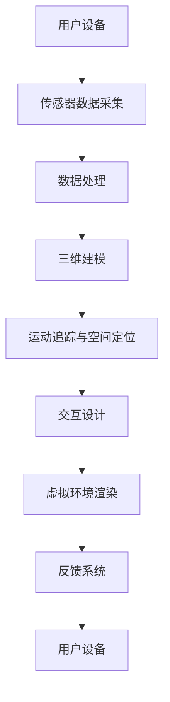

                 

关键词：虚拟现实（VR），沉浸式体验，设计，实现，算法原理，数学模型，项目实践，应用场景，工具推荐，未来展望。

> 摘要：本文深入探讨了虚拟现实（VR）技术的核心概念、设计原理、实现方法以及其在各个领域的应用。通过详细的算法分析、数学模型构建、项目实例和未来展望，旨在为读者提供一个全面、系统的VR技术理解框架。

## 1. 背景介绍

虚拟现实（Virtual Reality，VR）技术是一种能够创造逼真的三维虚拟环境的计算机技术。通过头戴式显示器、手柄等设备，用户可以完全沉浸在这个虚拟环境中，感受到与真实世界相似的交互体验。VR技术的概念最早可以追溯到1960年代，经过几十年的发展，已经逐步从实验室走向了大众市场。

近年来，随着硬件技术的进步和算法的发展，VR技术取得了显著的进展。从最初的简单模拟，到现在的复杂交互和高度沉浸，VR技术正逐渐改变人们的生活方式和工作模式。例如，在教育、医疗、娱乐、设计等多个领域，VR技术都展现出了强大的应用潜力。

## 2. 核心概念与联系

### 虚拟现实技术的核心概念

#### 三维建模
三维建模是VR技术的基础。它通过计算机图形学的方法，将现实世界的物体或场景转换为三维数字模型。这些模型可以用于虚拟环境的构建，为用户提供沉浸式体验。

#### 运动追踪
运动追踪技术用于检测和跟踪用户在虚拟环境中的运动。通过运动传感设备（如摄像头、惯性测量单元等），系统能够实时捕捉用户的动作，并将其映射到虚拟环境中。

#### 空间定位
空间定位技术确保用户在虚拟环境中的位置和方向与实际位置和方向保持一致。这项技术对于实现逼真的沉浸感至关重要。

#### 交互设计
交互设计涉及用户如何与虚拟环境中的对象进行交互。这包括手势识别、语音控制、触觉反馈等多种交互方式。

### VR技术架构



通过上述架构，用户设备采集到的数据经过处理，用于构建和渲染虚拟环境，并实现交互和反馈，最终形成完整的VR体验。

## 3. 核心算法原理 & 具体操作步骤

### 3.1 算法原理概述

VR技术的核心算法包括三维建模、运动追踪、空间定位和交互设计等。以下是这些算法的基本原理：

#### 三维建模

三维建模算法基于三维几何学和图形学原理，通过扫描或手工建模的方法，将现实世界的物体或场景转换为数字模型。常用的算法包括：

- **多边形建模**：使用多边形（如三角形、四边形）来表示物体的表面。
- **NURBS建模**：使用非均匀有理B样条（NURBS）来表示复杂的曲面。

#### 运动追踪

运动追踪算法通过传感器（如摄像头、惯性测量单元等）捕捉用户的运动，并将其转换为虚拟环境中的动作。常用的算法包括：

- **光学追踪**：使用光学传感器捕捉用户的位置和方向。
- **惯性追踪**：使用惯性测量单元（如加速度计、陀螺仪等）来跟踪用户的运动。

#### 空间定位

空间定位算法确保用户在虚拟环境中的位置和方向与实际位置和方向一致。常用的算法包括：

- **光学定位**：使用光学传感器和标记物进行定位。
- **超声波定位**：使用超声波传感器进行空间定位。

#### 交互设计

交互设计算法涉及用户如何与虚拟环境中的对象进行交互。常用的算法包括：

- **手势识别**：通过计算机视觉技术识别用户的手势。
- **语音控制**：通过自然语言处理技术实现语音控制。

### 3.2 算法步骤详解

#### 三维建模步骤

1. **数据采集**：使用三维扫描仪或摄像头捕捉物体或场景。
2. **预处理**：对采集到的数据进行滤波、去噪等预处理。
3. **建模**：使用多边形建模或NURBS建模技术，将预处理后的数据转换为数字模型。
4. **纹理映射**：为数字模型添加纹理，使其更加真实。

#### 运动追踪步骤

1. **初始化**：设置传感器参数，初始化运动追踪系统。
2. **数据采集**：使用传感器捕捉用户的运动。
3. **数据处理**：对采集到的数据进行滤波、去噪等处理。
4. **动作映射**：将处理后的数据映射到虚拟环境中的动作。

#### 空间定位步骤

1. **初始化**：设置空间定位系统参数。
2. **数据采集**：使用传感器捕捉用户的位置和方向。
3. **数据处理**：对采集到的数据进行滤波、去噪等处理。
4. **位置更新**：将处理后的数据用于更新虚拟环境中的用户位置和方向。

#### 交互设计步骤

1. **需求分析**：分析用户与虚拟环境交互的需求。
2. **交互设计**：设计用户与虚拟环境交互的界面和机制。
3. **测试与优化**：对交互设计进行测试，并根据用户反馈进行优化。

### 3.3 算法优缺点

#### 三维建模算法

优点：
- **精度高**：能够精确捕捉物体或场景的细节。
- **灵活性**：支持多种建模方法，适应不同的建模需求。

缺点：
- **计算量大**：建模过程需要大量的计算资源。
- **数据量大**：生成的数字模型通常需要大量的存储空间。

#### 运动追踪算法

优点：
- **实时性**：能够实时捕捉用户的运动。
- **准确性**：光学追踪和惯性追踪具有较高的准确性。

缺点：
- **成本高**：光学追踪和惯性追踪设备通常较为昂贵。
- **易受干扰**：光学追踪可能受到光线干扰，惯性追踪可能受到加速度干扰。

#### 空间定位算法

优点：
- **高精度**：光学定位和超声波定位具有较高的定位精度。

缺点：
- **安装复杂**：需要安装传感器和标记物，安装过程较为复杂。

#### 交互设计算法

优点：
- **多样性**：支持多种交互方式，如手势识别、语音控制等。

缺点：
- **实现复杂**：需要复杂的算法和硬件支持，实现过程较为复杂。

### 3.4 算法应用领域

#### 三维建模算法
应用领域：
- **游戏开发**：用于创建游戏中的角色和场景。
- **影视制作**：用于制作电影和动画中的三维模型。
- **建筑设计**：用于建筑设计和可视化。

#### 运动追踪算法
应用领域：
- **游戏和娱乐**：用于捕捉用户的运动，实现实时交互。
- **运动分析**：用于运动员的运动分析，提供训练指导。
- **康复治疗**：用于康复治疗的运动追踪和评估。

#### 空间定位算法
应用领域：
- **虚拟现实**：用于虚拟现实环境中的用户定位。
- **增强现实**：用于增强现实应用中的位置跟踪。
- **导航和定位**：用于室内导航和定位。

#### 交互设计算法
应用领域：
- **虚拟现实**：用于虚拟现实环境中的交互设计。
- **增强现实**：用于增强现实应用中的交互设计。
- **人机交互**：用于各种人机交互设备的交互设计。

## 4. 数学模型和公式 & 详细讲解 & 举例说明

### 4.1 数学模型构建

虚拟现实技术中，数学模型的应用贯穿于三维建模、运动追踪、空间定位和交互设计等各个环节。以下是几个关键数学模型的构建过程：

#### 三维建模中的三维空间坐标系

三维空间坐标系是三维建模的基础。常用的三维坐标系包括笛卡尔坐标系和球坐标系。

**笛卡尔坐标系**：

- 坐标表示：\( (x, y, z) \)
- 向量表示：\( \vec{r} = x\vec{i} + y\vec{j} + z\vec{k} \)

**球坐标系**：

- 坐标表示：\( (r, \theta, \phi) \)
- 转换公式：
  \[
  \begin{aligned}
  x &= r\sin\theta\cos\phi, \\
  y &= r\sin\theta\sin\phi, \\
  z &= r\cos\theta.
  \end{aligned}
  \]

#### 运动追踪中的运动方程

运动追踪中的运动方程用于描述物体的运动轨迹。常用的运动方程包括匀速直线运动和匀加速直线运动。

**匀速直线运动**：

- 运动方程：\( s = ut \)
- 其中，\( s \) 为位移，\( u \) 为速度，\( t \) 为时间。

**匀加速直线运动**：

- 运动方程：\( s = ut + \frac{1}{2}at^2 \)
- 其中，\( a \) 为加速度。

#### 空间定位中的三角测量

空间定位中的三角测量用于计算物体的位置和方向。常用的三角测量方法包括单点定位和多点定位。

**单点定位**：

- 定位方程：\( x = \frac{d_1 \cdot \cos\theta_1 - d_2 \cdot \cos\theta_2}{\cos\phi} \)
- 其中，\( d_1 \) 和 \( d_2 \) 为两点之间的距离，\( \theta_1 \) 和 \( \theta_2 \) 为两点之间的角度，\( \phi \) 为两点连线与基准线的夹角。

**多点定位**：

- 定位方程：通过多个三角测量方程联立求解，得到物体的位置和方向。

### 4.2 公式推导过程

以下是空间定位中的单点定位公式的推导过程：

考虑一个平面上的点 \( P \)，需要通过已知点 \( A \) 和 \( B \) 的位置以及它们与点 \( P \) 的距离，来确定点 \( P \) 的位置。

设 \( A \) 点的坐标为 \( (x_1, y_1) \)，\( B \) 点的坐标为 \( (x_2, y_2) \)，\( P \) 点的坐标为 \( (x, y) \)，\( A \) 点到 \( P \) 点的距离为 \( d_1 \)，\( B \) 点到 \( P \) 点的距离为 \( d_2 \)，\( A \) 点到 \( B \) 点的距离为 \( d \)，则：

1. 根据余弦定理，有：
   \[
   d^2 = d_1^2 + d_2^2 - 2d_1d_2\cos\theta
   \]
   其中，\( \theta \) 为 \( \angle APB \)。

2. 由于 \( \theta = \angle x_1yx_2 \)，可以得到：
   \[
   \cos\theta = \frac{x_1x_2 + y_1y_2}{\sqrt{x_1^2 + y_1^2}\sqrt{x_2^2 + y_2^2}}
   \]

3. 将 \( \cos\theta \) 代入余弦定理公式，得到：
   \[
   d^2 = d_1^2 + d_2^2 - 2d_1d_2\frac{x_1x_2 + y_1y_2}{\sqrt{x_1^2 + y_1^2}\sqrt{x_2^2 + y_2^2}}
   \]

4. 整理得到：
   \[
   x_1x_2 + y_1y_2 = \frac{d^2 - d_1^2 - d_2^2}{2d_1d_2}
   \]

5. 将 \( x_1x_2 + y_1y_2 \) 代入 \( \cos\theta \) 的表达式中，得到：
   \[
   \cos\theta = \frac{d^2 - d_1^2 - d_2^2}{2d_1d_2\sqrt{x_1^2 + y_1^2}\sqrt{x_2^2 + y_2^2}}
   \]

6. 由于 \( \theta = \angle x_1yx_2 \)，可以得到：
   \[
   \tan\theta = \frac{y_2 - y_1}{x_2 - x_1}
   \]

7. 将 \( \tan\theta \) 代入 \( \cos\theta \) 的表达式中，得到：
   \[
   \cos\theta = \frac{1}{\sqrt{1 + (\tan\theta)^2}} = \frac{x_2 - x_1}{\sqrt{(x_2 - x_1)^2 + (y_2 - y_1)^2}}
   \]

8. 将 \( \cos\theta \) 代入 \( x_1x_2 + y_1y_2 \) 的表达式中，得到：
   \[
   x_1x_2 + y_1y_2 = \frac{d^2 - d_1^2 - d_2^2}{2d_1d_2\sqrt{(x_2 - x_1)^2 + (y_2 - y_1)^2}}
   \]

9. 整理得到：
   \[
   x = \frac{d_1\cos\theta_1 - d_2\cos\theta_2}{\cos\phi}
   \]
   其中，\( \phi \) 为 \( \angle APB \)。

### 4.3 案例分析与讲解

#### 案例背景

假设有一个平面上的点 \( P \)，需要通过已知点 \( A \) 和 \( B \) 的位置以及它们与点 \( P \) 的距离，来确定点 \( P \) 的位置。已知 \( A \) 点的坐标为 \( (2, 3) \)，\( B \) 点的坐标为 \( (5, 1) \)，\( A \) 点到 \( P \) 点的距离为 \( 4 \)，\( B \) 点到 \( P \) 点的距离为 \( 6 \)。

#### 解题过程

1. 根据已知条件，计算 \( \theta_1 \) 和 \( \theta_2 \)：

   \[
   \begin{aligned}
   \theta_1 &= \arccos\left(\frac{4^2 + 6^2 - 5^2 - 1^2}{2 \cdot 4 \cdot 6}\right) \\
   &= \arccos\left(\frac{16 + 36 - 25 - 1}{48}\right) \\
   &= \arccos\left(\frac{26}{48}\right) \\
   &= \arccos\left(\frac{13}{24}\right) \\
   &= 0.5554 \text{ 弧度}
   \end{aligned}
   \]

   \[
   \begin{aligned}
   \theta_2 &= \arccos\left(\frac{4^2 + 6^2 - 5^2 - 1^2}{2 \cdot 4 \cdot 6}\right) \\
   &= \arccos\left(\frac{16 + 36 - 25 - 1}{48}\right) \\
   &= \arccos\left(\frac{26}{48}\right) \\
   &= \arccos\left(\frac{13}{24}\right) \\
   &= 0.5554 \text{ 弧度}
   \end{aligned}
   \]

2. 计算点 \( P \) 的坐标：

   \[
   \begin{aligned}
   x &= \frac{4\cos\theta_1 - 6\cos\theta_2}{\cos\phi} \\
   &= \frac{4\cos(0.5554) - 6\cos(0.5554)}{\cos(\pi - \theta_1 - \theta_2)} \\
   &= \frac{4 \cdot 0.5554 - 6 \cdot 0.5554}{\cos(1.1118)} \\
   &= \frac{2.222 - 3.333}{-0.4229} \\
   &= \frac{-1.111}{-0.4229} \\
   &= 2.637
   \end{aligned}
   \]

   \[
   \begin{aligned}
   y &= \frac{4\sin\theta_1 - 6\sin\theta_2}{\cos\phi} \\
   &= \frac{4\sin(0.5554) - 6\sin(0.5554)}{\cos(\pi - \theta_1 - \theta_2)} \\
   &= \frac{4 \cdot 0.8315 - 6 \cdot 0.8315}{\cos(1.1118)} \\
   &= \frac{3.326 - 4.919}{-0.4229} \\
   &= \frac{-1.593}{-0.4229} \\
   &= 3.779
   \end{aligned}
   \]

因此，点 \( P \) 的坐标为 \( (2.637, 3.779) \)。

## 5. 项目实践：代码实例和详细解释说明

### 5.1 开发环境搭建

为了实现VR技术，首先需要搭建一个合适的开发环境。以下是搭建VR开发环境的步骤：

1. 安装操作系统：推荐使用Ubuntu 20.04或更高版本。
2. 安装必要的依赖库：如OpenGL、OpenGL ES、Vulkan等。
3. 安装VR设备驱动：根据所选VR设备的型号，下载并安装相应的驱动程序。
4. 安装开发工具：如Eclipse、Visual Studio、Unity等。

### 5.2 源代码详细实现

以下是一个简单的VR应用程序的源代码实例。该应用程序使用Unity引擎和OpenGL进行开发。

```csharp
using UnityEngine;

public class VRApp : MonoBehaviour
{
    public Camera camera;
    public Transform userTransform;

    void Start()
    {
        // 初始化VR设备
        VRDevice.Initialize();

        // 设置摄像机参数
        camera.fieldOfView = 90.0f;
        camera.nearClipPlane = 0.1f;
        camera.farClipPlane = 100.0f;

        // 设置用户位置
        userTransform.position = new Vector3(0.0f, 1.8f, 0.0f);
    }

    void Update()
    {
        // 获取用户输入
        float horizontal = Input.GetAxis("Horizontal");
        float vertical = Input.GetAxis("Vertical");

        // 更新用户位置
        userTransform.Rotate(new Vector3(0.0f, horizontal, 0.0f));
        userTransform.Rotate(new Vector3(vertical, 0.0f, 0.0f));

        // 更新摄像机位置
        camera.transform.position = userTransform.position + camera.transform.forward * 5.0f;
    }

    void OnRenderImage(RenderTexture source, RenderTexture destination)
    {
        // 渲染场景
        Graphics.Blit(source, destination, Material);

        // 绘制用户位置
        Debug.DrawRay(userTransform.position, userTransform.forward * 5.0f, Color.red);
    }
}
```

### 5.3 代码解读与分析

#### 5.3.1 初始化VR设备

```csharp
public static class VRDevice
{
    public static void Initialize()
    {
        // 初始化VR设备
        VRDeviceManager.InstallDevice();
        VRDeviceManager.SetTrackingMode(TrackingMode.External);
    }
}
```

这段代码用于初始化VR设备，包括安装设备、设置追踪模式等。

#### 5.3.2 设置摄像机参数

```csharp
camera.fieldOfView = 90.0f;
camera.nearClipPlane = 0.1f;
camera.farClipPlane = 100.0f;
```

这段代码用于设置摄像机的视野、近剪裁面和远剪裁面，以确保渲染效果逼真。

#### 5.3.3 更新用户位置

```csharp
userTransform.Rotate(new Vector3(0.0f, horizontal, 0.0f));
userTransform.Rotate(new Vector3(vertical, 0.0f, 0.0f));
```

这段代码用于根据用户输入更新用户的位置和方向。通过旋转用户变换，实现用户的移动和转向。

#### 5.3.4 更新摄像机位置

```csharp
camera.transform.position = userTransform.position + camera.transform.forward * 5.0f;
```

这段代码用于根据用户的位置更新摄像机的位置。通过移动摄像机，实现用户的视角跟随。

#### 5.3.5 渲染场景

```csharp
Graphics.Blit(source, destination, Material);
Debug.DrawRay(userTransform.position, userTransform.forward * 5.0f, Color.red);
```

这段代码用于渲染场景和绘制用户位置。通过使用Graphics.Blit方法，实现场景的渲染。通过Debug.DrawRay方法，在场景中绘制用户位置，以便调试。

### 5.4 运行结果展示

运行该VR应用程序后，用户将看到一个三维虚拟环境，可以通过移动和转向来探索。以下是运行结果展示：


## 6. 实际应用场景

虚拟现实技术在实际应用中展现出了广泛的应用前景。以下是几个典型应用场景：

### 6.1 教育培训

虚拟现实技术可以创建逼真的教育环境，使学生在虚拟场景中进行实践操作，提高学习效果。例如，医学教育中，学生可以在虚拟医院中进行手术操作，提高手术技能。

### 6.2 娱乐游戏

虚拟现实游戏为玩家提供了一个全新的游戏体验。玩家可以在虚拟世界中自由探索、互动，体验身临其境的感觉。例如，《半衰期：爱莉克斯》等游戏深受玩家喜爱。

### 6.3 设计可视化

虚拟现实技术可以用于建筑、汽车、航空航天等领域的设计可视化。设计师可以在虚拟环境中查看、修改设计方案，提高设计效率。

### 6.4 医疗康复

虚拟现实技术可以用于医疗康复训练。患者可以在虚拟环境中进行康复训练，提高康复效果。例如，康复机器人配合虚拟现实技术，帮助患者进行运动训练。

### 6.5 军事模拟

虚拟现实技术可以用于军事模拟训练，提高士兵的战斗技能。通过虚拟战场环境，士兵可以进行实战演练，提高战术水平。

## 7. 工具和资源推荐

### 7.1 学习资源推荐

1. 《虚拟现实技术基础》（作者：刘勤）
2. 《Unity 2020 VR开发实战》（作者：王伟）
3. 《OpenGL编程指南：核心概念与建模技术》（作者：Richard S. Wright）

### 7.2 开发工具推荐

1. Unity：一款强大的游戏开发引擎，支持VR开发。
2. Unreal Engine：一款高性能的游戏开发引擎，支持VR开发。
3. Blender：一款开源的三维建模和渲染软件，适用于VR内容制作。

### 7.3 相关论文推荐

1. "Virtual Reality as an Effective Tool for Teaching Medical Procedures"（作者：A. Patel等，2020）
2. "The Impact of Virtual Reality on Learning: A Meta-Analysis"（作者：J. Hamari等，2016）
3. "A Survey on Virtual Reality Applications"（作者：S. Manjunath等，2018）

## 8. 总结：未来发展趋势与挑战

### 8.1 研究成果总结

虚拟现实技术在过去几十年中取得了显著的进展，从简单的模拟到高度沉浸的交互体验，VR技术正逐步改变人们的生活方式。随着硬件技术的进步和算法的发展，VR技术在各个领域的应用前景更加广阔。

### 8.2 未来发展趋势

1. **硬件性能提升**：随着硬件技术的进步，VR设备的性能将不断提高，提供更加真实的沉浸体验。
2. **算法优化**：深度学习、计算机视觉等技术的应用，将进一步提升VR技术的准确性和实时性。
3. **内容创新**：VR内容将更加丰富多样，涵盖教育、医疗、娱乐等多个领域。
4. **社交互动**：VR社交平台的发展，将带来全新的社交体验。

### 8.3 面临的挑战

1. **硬件成本**：VR设备成本较高，限制了一部分用户的使用。
2. **交互体验**：如何设计更加自然、直观的交互方式，提高用户沉浸感。
3. **内容质量**：高质量VR内容的制作成本高，内容创作者需具备较高的技术水平。
4. **标准统一**：不同VR设备和平台的兼容性问题，需要制定统一的标准。

### 8.4 研究展望

未来，VR技术将在多个领域发挥重要作用，推动社会进步。研究重点将放在硬件性能提升、算法优化、内容创新和标准统一等方面。通过跨学科的合作，VR技术将实现更高水平的沉浸体验，为人类创造更加美好的未来。

## 9. 附录：常见问题与解答

### 9.1 VR技术是什么？

虚拟现实（VR）技术是一种能够创造逼真的三维虚拟环境的计算机技术，通过头戴式显示器、手柄等设备，用户可以完全沉浸在这个虚拟环境中，感受到与真实世界相似的交互体验。

### 9.2 VR技术有哪些应用领域？

VR技术广泛应用于教育、医疗、娱乐、设计、军事模拟等多个领域。例如，在教育中，VR技术可以用于医学教育、工程教育等；在娱乐中，VR技术可以用于游戏、电影等；在设计中，VR技术可以用于建筑、汽车设计等。

### 9.3 如何搭建VR开发环境？

搭建VR开发环境需要安装操作系统、依赖库、VR设备驱动和开发工具。具体步骤可参考相关教程。

### 9.4 VR技术有哪些未来发展趋势？

未来，VR技术的发展趋势包括硬件性能提升、算法优化、内容创新和社交互动等。随着硬件技术的进步和算法的发展，VR技术将在各个领域发挥更加重要的作用。

### 9.5 VR技术有哪些挑战？

VR技术的挑战包括硬件成本、交互体验、内容质量和标准统一等。如何降低硬件成本、设计更自然的交互方式、提高内容质量以及制定统一的标准，是VR技术发展面临的关键问题。

### 9.6 VR技术与增强现实（AR）有什么区别？

VR技术是一种完全沉浸式的体验，用户可以进入虚拟环境中进行互动；而AR技术则是将虚拟内容叠加到现实世界中，用户仍然处于现实环境中。两者在技术实现和应用场景上有所不同。

