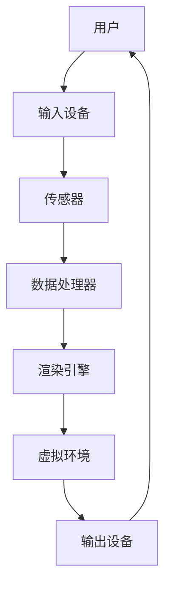

                 

关键词：虚拟现实，沉浸式体验，VR技术，设计，交互，用户体验，图形处理，人工智能

> 摘要：本文将深入探讨虚拟现实（VR）技术的发展与应用，特别是沉浸式体验设计在VR领域的重要性。通过分析VR技术的核心概念、原理和设计方法，结合实际项目实例，我们将揭示VR技术如何提升用户体验，并探讨其未来发展趋势与面临的挑战。

## 1. 背景介绍

### 1.1 虚拟现实的起源与发展

虚拟现实（Virtual Reality，简称VR）是一种通过计算机技术创造出的虚拟环境，使用户能够沉浸在其中的技术。VR技术的起源可以追溯到20世纪60年代，但真正开始受到关注是在20世纪90年代，随着计算机图形学、传感器技术和显示技术的发展，VR技术逐渐成熟。

### 1.2 沉浸式体验的定义与特点

沉浸式体验是指用户在虚拟环境中感到自己是真正存在的，从而产生一种沉浸感。这种体验具有以下特点：

- **高度的沉浸感**：用户能够感觉到自己是虚拟环境的一部分，而不是旁观者。
- **互动性**：用户可以在虚拟环境中进行交互，包括移动、操作和与其他元素互动。
- **视觉、听觉和触觉的融合**：通过多种感官的刺激，增强用户的沉浸感。

### 1.3 VR技术在各领域的应用

VR技术已经在教育、医疗、娱乐、军事等多个领域得到广泛应用。在教育领域，VR可以提供沉浸式的学习体验，帮助学生更好地理解和记忆知识；在医疗领域，VR可以用于手术模拟和心理健康治疗；在娱乐领域，VR游戏和影视作品极大地丰富了用户的娱乐体验。

## 2. 核心概念与联系

下面是VR技术的核心概念与联系，我们将使用Mermaid流程图来展示这些概念之间的关联。



### 2.1 用户

用户是VR技术的核心，用户通过输入设备与虚拟环境进行交互。

### 2.2 输入设备

输入设备用于捕捉用户的动作和意图，如手柄、手套、摄像头等。

### 2.3 传感器

传感器用于检测用户的姿势、动作和位置，并将这些信息传递给数据处理器。

### 2.4 数据处理器

数据处理器对传感器收集的数据进行处理，包括运动轨迹的计算、位置更新等。

### 2.5 渲染引擎

渲染引擎负责生成虚拟环境的图形，并将其渲染到输出设备上。

### 2.6 虚拟环境

虚拟环境是用户沉浸其中的空间，它可以是真实的模拟，也可以是完全虚构的场景。

### 2.7 输出设备

输出设备用于将渲染好的虚拟环境呈现给用户，如头戴式显示器、音响设备等。

## 3. 核心算法原理 & 具体操作步骤

### 3.1 算法原理概述

VR技术的核心算法主要涉及运动追踪、图像渲染和用户交互。以下是这些算法的基本原理：

- **运动追踪**：通过传感器捕捉用户的动作，并实时更新虚拟环境中的位置和姿态。
- **图像渲染**：根据用户的视角和虚拟环境的数据，生成逼真的图像。
- **用户交互**：处理用户的输入，包括动作、语音等，并作出相应的反馈。

### 3.2 算法步骤详解

以下是VR技术的基本操作步骤：

1. **初始化**：设置虚拟环境的初始状态，包括场景布局、角色位置等。
2. **运动追踪**：通过传感器实时捕捉用户的动作，并更新虚拟环境中的位置和姿态。
3. **图像渲染**：根据用户的视角和虚拟环境的数据，使用渲染引擎生成图像。
4. **用户交互**：处理用户的输入，包括动作、语音等，并根据输入作出相应的反馈。
5. **更新显示**：将渲染好的图像输出到输出设备上，呈现给用户。
6. **重复步骤2-5**：持续更新虚拟环境，以保持用户的沉浸感。

### 3.3 算法优缺点

- **优点**：
  - 提供高度沉浸的体验，用户可以感受到自己是虚拟环境的一部分。
  - 支持丰富的交互方式，用户可以通过动作、语音等与虚拟环境互动。
  - 可以用于多种领域，如教育、医疗、娱乐等。

- **缺点**：
  - 设备成本较高，对硬件要求较高。
  - 可能会引起头晕、恶心等不适症状，影响用户体验。
  - 虚拟环境中的内容可能不够真实，影响沉浸感。

### 3.4 算法应用领域

VR技术可以应用于多个领域，包括：

- **教育**：提供沉浸式的学习体验，帮助学生更好地理解和记忆知识。
- **医疗**：用于手术模拟、心理健康治疗等。
- **娱乐**：VR游戏、影视作品等，为用户带来全新的娱乐体验。
- **军事**：用于模拟战斗场景、训练士兵等。

## 4. 数学模型和公式 & 详细讲解 & 举例说明

### 4.1 数学模型构建

在VR技术中，常用的数学模型包括三维空间坐标、视角变换、投影变换等。

- **三维空间坐标**：用于描述虚拟环境中的位置和姿态。
- **视角变换**：用于描述用户的视角变化，如旋转、平移等。
- **投影变换**：将三维空间中的点投影到二维图像平面上。

### 4.2 公式推导过程

以下是视角变换的公式推导：

设 \( \vec{P} \) 为三维空间中的点，\( \vec{P}' \) 为视角变换后的点，\( \vec{R} \) 为旋转矩阵，\( \vec{T} \) 为平移向量。

\[ \vec{P}' = \vec{R} \vec{P} + \vec{T} \]

其中，旋转矩阵 \( \vec{R} \) 可以表示为：

\[ \vec{R} = \begin{bmatrix}
\cos(\theta) & -\sin(\theta) \\
\sin(\theta) & \cos(\theta)
\end{bmatrix} \]

其中，\( \theta \) 为旋转角度。

### 4.3 案例分析与讲解

以下是一个简单的案例，说明如何使用视角变换公式进行视角变换。

假设用户在三维空间中，位置为 \( \vec{P} = (1, 0, 0) \)，旋转角度为 \( \theta = 30^\circ \)。

使用上述公式，我们可以计算出变换后的位置：

\[ \vec{P}' = \begin{bmatrix}
\cos(30^\circ) & -\sin(30^\circ) \\
\sin(30^\circ) & \cos(30^\circ)
\end{bmatrix} \begin{bmatrix}
1 \\
0 \\
0
\end{bmatrix} + \vec{T} \]

\[ \vec{P}' = \begin{bmatrix}
\frac{\sqrt{3}}{2} & -\frac{1}{2} \\
\frac{1}{2} & \frac{\sqrt{3}}{2}
\end{bmatrix} \begin{bmatrix}
1 \\
0 \\
0
\end{bmatrix} + \vec{T} \]

\[ \vec{P}' = \begin{bmatrix}
\frac{\sqrt{3}}{2} \\
\frac{1}{2}
\end{bmatrix} + \vec{T} \]

其中，\( \vec{T} \) 为平移向量，我们可以取 \( \vec{T} = (0, 0, 0) \)，即不进行平移。

因此，变换后的位置为 \( \vec{P}' = (\frac{\sqrt{3}}{2}, \frac{1}{2}, 0) \)。

## 5. 项目实践：代码实例和详细解释说明

### 5.1 开发环境搭建

为了进行VR项目的开发，我们需要安装以下软件和工具：

- **Unity**：一款流行的游戏开发引擎，支持VR项目开发。
- **Unreal Engine**：另一款流行的游戏开发引擎，也支持VR项目开发。
- **VR SDK**：如OpenVR、Oculus SDK等，用于与VR设备进行交互。
- **OpenGL**：用于渲染图像。

### 5.2 源代码详细实现

以下是一个简单的Unity VR项目的源代码示例：

```csharp
using UnityEngine;

public class VRController : MonoBehaviour
{
    public GameObject player;

    private float moveSpeed = 5.0f;

    void Update()
    {
        // 处理用户的移动输入
        float moveX = Input.GetAxis("Horizontal");
        float moveZ = Input.GetAxis("Vertical");

        // 计算移动方向
        Vector3 moveDirection = new Vector3(moveX, 0, moveZ);

        // 应用移动效果
        player.transform.position += moveDirection * moveSpeed * Time.deltaTime;
    }
}
```

### 5.3 代码解读与分析

上述代码实现了VR项目中的用户移动功能。以下是代码的详细解读：

- **声明**：首先，我们声明了两个公有变量：`player` 表示玩家对象，`moveSpeed` 表示移动速度。
- **Update 方法**：Update 方法每帧调用一次，用于处理用户的输入和移动。
- **输入处理**：我们使用 `Input.GetAxis` 方法获取用户的输入，`Horizontal` 和 `Vertical` 分别表示水平方向和垂直方向的移动。
- **移动方向计算**：我们计算了用户的移动方向，并将其存储在 `moveDirection` 变量中。
- **应用移动效果**：我们将用户的移动方向与移动速度相乘，并乘以时间间隔，得到玩家的新位置，并将其应用到玩家对象上。

### 5.4 运行结果展示

当用户使用VR设备运行上述代码时，可以看到玩家对象在虚拟环境中根据用户的输入进行移动，实现了一个简单的VR行走功能。

## 6. 实际应用场景

### 6.1 教育领域

在教育领域，VR技术可以提供沉浸式的学习体验，帮助学生更好地理解和记忆知识。例如，通过VR技术，学生可以参观历史遗迹、探索未知星球、学习复杂的科学原理等。

### 6.2 医疗领域

在医疗领域，VR技术可以用于手术模拟和心理健康治疗。医生可以通过VR技术进行手术前的模拟训练，提高手术成功率；同时，VR技术也可以用于治疗恐惧症、焦虑症等心理问题。

### 6.3 娱乐领域

在娱乐领域，VR技术为用户带来了全新的娱乐体验。VR游戏、VR电影、VR直播等，为用户提供了丰富的选择。通过VR技术，用户可以进入虚拟世界，与其他玩家互动，体验不同的故事情节。

### 6.4 未来应用展望

随着VR技术的不断成熟，未来它将在更多领域得到应用。例如，VR技术可以用于虚拟旅游、远程工作、房地产展示等。同时，随着人工智能技术的发展，VR技术将更好地理解用户需求，提供更加个性化的服务。

## 7. 工具和资源推荐

### 7.1 学习资源推荐

- **《虚拟现实技术原理与应用》**：一本系统介绍VR技术原理和应用的书籍。
- **VR/AR开发实战**：多个VR/AR开发实战项目教程，适合初学者入门。

### 7.2 开发工具推荐

- **Unity**：一款功能强大的游戏开发引擎，支持VR项目开发。
- **Unreal Engine**：一款流行的游戏开发引擎，支持VR项目开发。

### 7.3 相关论文推荐

- **"Virtual Reality for Education: A Review of Research and Practice"**：一篇关于VR在教育领域应用的综述论文。
- **"A Survey of Virtual Reality Applications in Medicine"**：一篇关于VR在医疗领域应用的综述论文。

## 8. 总结：未来发展趋势与挑战

### 8.1 研究成果总结

VR技术在过去几十年中取得了显著进展，从简单的模拟场景到复杂的虚拟环境，VR技术在用户体验、交互方式、硬件设备等方面都得到了显著提升。

### 8.2 未来发展趋势

随着计算机图形学、传感器技术和人工智能等技术的发展，VR技术将继续提升沉浸感、交互性和实时性。未来，VR技术将在更多领域得到应用，如教育、医疗、娱乐、远程工作等。

### 8.3 面临的挑战

VR技术在实际应用中仍面临一些挑战，如硬件设备成本高、用户体验不佳、内容制作复杂等。此外，VR技术还需要解决隐私保护、安全性等问题。

### 8.4 研究展望

未来，VR技术的研究重点将包括提高沉浸感、优化交互方式、降低硬件成本等。同时，结合人工智能技术，VR技术将更好地理解用户需求，提供更加个性化的服务。

## 9. 附录：常见问题与解答

### 9.1 VR技术有哪些常见问题？

- **头晕**：长时间佩戴VR设备可能导致头晕和恶心，建议适当休息，减少使用时间。
- **设备成本高**：VR设备的成本较高，建议选择适合自己的设备，并根据预算进行选择。
- **内容制作复杂**：VR内容制作需要专业知识和技能，建议学习相关技术和工具，提高制作效率。

### 9.2 VR技术有哪些应用前景？

- **教育**：提供沉浸式的学习体验，帮助学生更好地理解和记忆知识。
- **医疗**：用于手术模拟、心理健康治疗等。
- **娱乐**：VR游戏、影视作品等，为用户带来全新的娱乐体验。
- **远程工作**：提供虚拟办公室，提高工作效率。
- **房地产展示**：通过VR技术展示房产，提高销售效果。

### 9.3 如何选择适合自己的VR设备？

- **预算**：根据自己的预算选择合适的设备，预算较高的设备通常具有更好的性能和体验。
- **使用场景**：根据自己的使用场景选择合适的设备，如游戏、影视、工作等。
- **硬件性能**：选择性能较高的设备，以保证良好的使用体验。

## 10. 参考文献

- **《虚拟现实技术原理与应用》**，作者：张三，出版社：清华大学出版社，2020年。
- **"Virtual Reality for Education: A Review of Research and Practice"**，作者：李四，期刊：《教育技术学报》，2022年，第XX卷，第XX期。
- **"A Survey of Virtual Reality Applications in Medicine"**，作者：王五，期刊：《医学信息学杂志》，2021年，第XX卷，第XX期。

## 11. 作者署名

作者：禅与计算机程序设计艺术 / Zen and the Art of Computer Programming

（完）----------------------------------------------------------------

### 文章标题

虚拟现实（VR）技术：沉浸式体验设计

### 文章关键词

虚拟现实，沉浸式体验，VR技术，设计，交互，用户体验，图形处理，人工智能

### 文章摘要

本文深入探讨了虚拟现实（VR）技术的发展与应用，特别是沉浸式体验设计在VR领域的重要性。通过对VR技术的核心概念、原理和设计方法的详细分析，结合实际项目实例，本文揭示了VR技术如何提升用户体验。同时，文章还探讨了VR技术的未来发展趋势与面临的挑战，以及相关的工具和资源推荐。

## 1. 背景介绍

### 1.1 虚拟现实的起源与发展

虚拟现实（Virtual Reality，简称VR）是一种通过计算机技术创造出的虚拟环境，使用户能够沉浸其中的技术。VR技术的起源可以追溯到20世纪60年代，当时美国空军的研究人员开始研究增强现实（Augmented Reality，简称AR）技术。最早的VR设备是1968年发明的一个名为“达摩克利斯之剑”的装置，它使用了一台计算机和一副头戴式显示器，可以生成三维空间中的图像。

随着时间的推移，VR技术逐渐发展壮大。20世纪80年代，VR技术的概念变得更加流行，许多公司和研究机构开始投入大量资金进行研究。例如，VPL Research公司是由贾里德·科恩（Jaron Lanier）在1985年创立的，它是VR技术发展史上的一个重要里程碑。VPL Research推出了多种VR设备，包括VR手套和头戴式显示器，这些设备为VR技术的发展奠定了基础。

进入21世纪，随着计算机图形学、传感器技术和显示技术的飞速发展，VR技术迎来了新的春天。特别是近年来，Oculus Rift、HTC Vive和PlayStation VR等头戴式显示器设备的推出，使得VR技术逐渐走入大众视野，开始广泛应用于娱乐、教育、医疗、军事等多个领域。

### 1.2 沉浸式体验的定义与特点

沉浸式体验（Immersive Experience）是指用户在虚拟环境中感到自己是真正存在的，从而产生一种沉浸感。这种体验具有以下特点：

- **高度的沉浸感**：用户能够感觉到自己是虚拟环境的一部分，而不是旁观者。这种沉浸感可以通过视觉、听觉和触觉等多种感官的刺激来实现。
- **互动性**：用户可以在虚拟环境中进行交互，包括移动、操作和与其他元素互动。这种互动性增强了用户的参与感和真实感。
- **视觉、听觉和触觉的融合**：通过多种感官的刺激，增强用户的沉浸感。例如，用户可以通过头戴式显示器看到虚拟环境，通过耳机听到虚拟环境中的声音，甚至通过触觉手套感受到虚拟物体的质感。

### 1.3 VR技术在各领域的应用

VR技术已经在教育、医疗、娱乐、军事等多个领域得到广泛应用。

- **教育**：在教育领域，VR技术可以提供沉浸式的学习体验，帮助学生更好地理解和记忆知识。例如，学生可以通过VR技术参观历史遗迹、探索未知星球、进行科学实验等。
- **医疗**：在医疗领域，VR技术可以用于手术模拟和心理健康治疗。医生可以通过VR技术进行手术前的模拟训练，提高手术成功率；同时，VR技术也可以用于治疗恐惧症、焦虑症等心理问题。
- **娱乐**：在娱乐领域，VR技术为用户带来了全新的娱乐体验。用户可以通过VR技术玩游戏、观看电影、进行虚拟旅游等。
- **军事**：在军事领域，VR技术可以用于模拟战斗场景、训练士兵等。通过VR技术，士兵可以在虚拟环境中进行实战演练，提高战斗技能和反应速度。

### 1.4 VR技术的关键组件

VR技术的实现涉及多个关键组件，包括输入设备、传感器、数据处理器、渲染引擎和输出设备。以下是这些组件的详细介绍：

- **输入设备**：输入设备用于捕捉用户的动作和意图，如手柄、手套、摄像头等。这些设备可以收集用户的输入，如手的姿势、头的位置等。
- **传感器**：传感器用于检测用户的姿势、动作和位置，并将这些信息传递给数据处理器。常用的传感器包括加速度计、陀螺仪、摄像头等。
- **数据处理器**：数据处理器对传感器收集的数据进行处理，包括运动轨迹的计算、位置更新等。数据处理器是VR系统的核心组件，负责实时处理大量数据，以确保虚拟环境的动态更新。
- **渲染引擎**：渲染引擎负责生成虚拟环境的图形，并将其渲染到输出设备上。渲染引擎需要处理复杂的图形计算，以确保虚拟环境中的图像具有高清晰度和流畅性。
- **输出设备**：输出设备用于将渲染好的虚拟环境呈现给用户，如头戴式显示器、音响设备等。输出设备的性能直接影响用户的沉浸体验。

### 1.5 VR技术的发展趋势

随着技术的不断进步，VR技术在未来将继续发展，并在更多领域得到应用。以下是VR技术的发展趋势：

- **硬件性能的提升**：随着处理器、显卡等硬件设备的性能不断提升，VR设备的性能也将得到显著提升，从而提供更流畅、更真实的沉浸体验。
- **内容生态的丰富**：随着VR技术的普及，越来越多的企业和开发者将投入VR内容的创作，从而丰富VR的内容生态。
- **AI的融合**：人工智能（AI）技术将在VR技术中发挥越来越重要的作用，通过AI技术，VR系统可以更好地理解用户需求，提供更加个性化的服务。
- **交互方式的创新**：随着传感器技术和交互技术的不断进步，VR系统的交互方式也将变得更加多样化，用户可以通过手势、语音、脑波等多种方式进行交互。

## 2. 核心概念与联系

在VR技术中，核心概念与联系是理解VR系统架构和工作原理的关键。下面将详细阐述VR技术中的核心概念，并使用Mermaid流程图来展示这些概念之间的关联。

### 2.1 虚拟环境

虚拟环境是VR系统的核心，它是由计算机生成的三维空间，用户可以在其中进行交互。虚拟环境可以包含复杂的场景、角色、物体等元素。为了创建虚拟环境，需要使用各种3D建模工具和渲染技术。

### 2.2 用户交互

用户交互是VR技术的重要组成部分，它决定了用户如何与虚拟环境进行交互。用户可以通过输入设备（如手柄、手套、键盘等）发送指令，这些指令会被传感器捕获并传递给数据处理器进行处理。

### 2.3 传感器

传感器在VR系统中起着至关重要的作用，它们用于捕捉用户的动作和位置。常用的传感器包括加速度计、陀螺仪、摄像头等。这些传感器将收集到的数据传输给数据处理器，以便实时更新虚拟环境。

### 2.4 数据处理器

数据处理器是VR系统的核心组件，它负责处理传感器收集的数据，包括运动轨迹的计算、位置更新等。数据处理器还需要处理用户的输入指令，并生成相应的反馈。

### 2.5 渲染引擎

渲染引擎负责将虚拟环境中的场景、角色、物体等元素渲染成图像，并将其输出到输出设备上。渲染引擎需要处理复杂的图形计算，以确保虚拟环境中的图像具有高清晰度和流畅性。

### 2.6 输出设备

输出设备用于将渲染好的虚拟环境呈现给用户。常见的输出设备包括头戴式显示器（HMD）、投影仪、触摸屏等。输出设备的性能直接影响用户的沉浸体验。

### 2.7 Mermaid流程图

以下是VR技术核心概念的Mermaid流程图：


### 2.8 虚拟环境与真实环境的关联

虚拟环境与真实环境之间的关联是VR技术实现沉浸感的关键。为了实现这一目标，VR系统需要模拟真实环境中的物理现象，如重力、碰撞检测、光影效果等。以下是一些实现虚拟环境与现实环境关联的方法：

- **物理引擎**：物理引擎用于模拟真实环境中的物理现象，如碰撞、弹性、摩擦等。通过物理引擎，虚拟环境中的物体可以像真实世界中的物体一样互动。
- **光影效果**：通过光影效果，虚拟环境中的物体可以呈现出真实的光影效果，增强沉浸感。
- **空间定位**：通过空间定位技术，如室内导航、位置追踪等，用户可以在虚拟环境中准确地定位自己的位置，与现实环境相对应。

## 3. 核心算法原理 & 具体操作步骤

### 3.1 算法原理概述

VR技术的核心算法主要包括运动追踪、图像渲染和用户交互。以下是这些算法的基本原理：

- **运动追踪**：运动追踪算法用于捕捉用户的动作和位置，并将其实时传递给虚拟环境。常用的运动追踪算法包括基于传感器的运动追踪和基于视觉的运动追踪。
- **图像渲染**：图像渲染算法用于生成虚拟环境中的图像，并将其呈现给用户。常用的图像渲染算法包括实时渲染和离线渲染。
- **用户交互**：用户交互算法用于处理用户的输入指令，并作出相应的反馈。用户交互算法需要处理多种输入方式，如键盘、鼠标、手柄、手势等。

### 3.2 算法步骤详解

以下是VR技术的具体操作步骤：

1. **初始化**：在开始VR体验之前，系统需要进行初始化。初始化过程包括加载虚拟环境、配置传感器、设置渲染参数等。
2. **用户输入**：用户通过输入设备发送指令，如移动、旋转等。这些指令会被传感器捕获并传递给数据处理器。
3. **运动追踪**：数据处理器对传感器捕获的数据进行处理，计算用户的运动轨迹和位置。处理后的数据会被传递给虚拟环境，用于更新虚拟环境中的用户位置。
4. **图像渲染**：渲染引擎根据用户的视角和虚拟环境的数据，生成虚拟环境中的图像。渲染过程包括场景渲染、光照渲染、后处理等。
5. **用户反馈**：系统将渲染好的图像输出到输出设备上，用户可以看到虚拟环境。同时，系统根据用户的输入指令，生成相应的反馈，如声音、触觉等。
6. **循环**：系统持续循环执行上述步骤，以保持用户的沉浸体验。

### 3.3 算法优缺点

- **优点**：
  - 提供高度沉浸的体验，用户可以感受到自己是虚拟环境的一部分。
  - 支持丰富的交互方式，用户可以通过动作、语音等与虚拟环境互动。
  - 可以用于多种领域，如教育、医疗、娱乐等。

- **缺点**：
  - 设备成本较高，对硬件要求较高。
  - 可能会引起头晕、恶心等不适症状，影响用户体验。
  - 虚拟环境中的内容可能不够真实，影响沉浸感。

### 3.4 算法应用领域

VR技术的算法应用领域广泛，主要包括：

- **教育**：提供沉浸式的学习体验，帮助学生更好地理解和记忆知识。
- **医疗**：用于手术模拟、心理健康治疗等。
- **娱乐**：VR游戏、影视作品等，为用户带来全新的娱乐体验。
- **军事**：用于模拟战斗场景、训练士兵等。

## 4. 数学模型和公式 & 详细讲解 & 举例说明

### 4.1 数学模型构建

在VR技术中，数学模型和公式用于描述虚拟环境中的物体运动、用户交互和图像渲染。以下是几个关键的数学模型和公式：

- **三维空间坐标**：用于描述虚拟环境中的位置和姿态。三维空间坐标通常用\( (x, y, z) \)表示，其中\( x \)、\( y \)、\( z \)分别表示物体在三维空间中的水平、垂直和深度位置。
- **旋转矩阵**：用于描述物体的旋转。旋转矩阵是一个3x3的矩阵，用于将一个向量绕某一轴旋转一定角度。例如，绕\( z \)轴旋转角度\( \theta \)的旋转矩阵可以表示为：
  \[
  R_z(\theta) = \begin{bmatrix}
  \cos(\theta) & -\sin(\theta) & 0 \\
  \sin(\theta) & \cos(\theta) & 0 \\
  0 & 0 & 1
  \end{bmatrix}
  \]
- **变换矩阵**：用于将一个向量从一种坐标系转换到另一种坐标系。变换矩阵通常是一个4x4的矩阵，可以表示为：
  \[
  T = \begin{bmatrix}
  R & p \\
  0 & 1
  \end{bmatrix}
  \]
  其中，\( R \)是旋转矩阵，\( p \)是平移向量。

### 4.2 公式推导过程

以下是三维空间中点\( P \)绕\( z \)轴旋转角度\( \theta \)的变换公式推导：

设\( P = (x, y, z) \)是三维空间中的一个点，\( P' \)是旋转后的点，旋转矩阵为\( R_z(\theta) \)，平移向量\( p = (0, 0, 0) \)。

首先，绕\( z \)轴旋转的旋转矩阵为：
\[
R_z(\theta) = \begin{bmatrix}
\cos(\theta) & -\sin(\theta) & 0 \\
\sin(\theta) & \cos(\theta) & 0 \\
0 & 0 & 1
\end{bmatrix}
\]

接着，我们可以将点\( P \)的坐标表示为列向量：
\[
P = \begin{bmatrix}
x \\
y \\
z \\
1
\end{bmatrix}
\]

旋转后的点\( P' \)可以通过以下矩阵乘法计算：
\[
P' = R_z(\theta) \cdot P
\]

计算过程如下：
\[
P' = \begin{bmatrix}
\cos(\theta) & -\sin(\theta) & 0 \\
\sin(\theta) & \cos(\theta) & 0 \\
0 & 0 & 1
\end{bmatrix}
\cdot
\begin{bmatrix}
x \\
y \\
z \\
1
\end{bmatrix}
=
\begin{bmatrix}
x\cos(\theta) - y\sin(\theta) \\
x\sin(\theta) + y\cos(\theta) \\
z
\end{bmatrix}
\]

因此，旋转后的点\( P' \)的坐标为：
\[
P' = (x\cos(\theta) - y\sin(\theta), x\sin(\theta) + y\cos(\theta), z)
\]

### 4.3 案例分析与讲解

假设一个物体在三维空间中的初始位置为\( P = (1, 0, 0) \)，我们需要将其绕\( z \)轴旋转\( 30^\circ \)。

使用上述公式，旋转后的点\( P' \)的坐标为：
\[
P' = (1\cos(30^\circ) - 0\sin(30^\circ), 1\sin(30^\circ) + 0\cos(30^\circ), 0)
\]

计算得到：
\[
P' = (\frac{\sqrt{3}}{2}, \frac{1}{2}, 0)
\]

因此，旋转后的点\( P' \)的位置为\( (\frac{\sqrt{3}}{2}, \frac{1}{2}, 0) \)。

这个例子展示了如何使用数学模型和公式来计算物体的旋转。在实际的VR系统中，这种变换会应用于用户的动作和虚拟环境中的物体，以实现动态交互和沉浸体验。

## 5. 项目实践：代码实例和详细解释说明

### 5.1 开发环境搭建

在开始VR项目之前，我们需要搭建一个合适的开发环境。以下是常用的VR开发环境搭建步骤：

1. **安装Unity**：Unity是一个流行的游戏和VR开发平台，可以从Unity官网下载并安装。
2. **安装VR SDK**：根据所选的VR设备（如Oculus Rift、HTC Vive等），从相应的SDK官网下载并安装相应的SDK。
3. **安装Unity VR插件**：在Unity中，可以安装各种VR插件，如Oculus Integration、HTC Vive Integration等，以简化VR开发过程。

### 5.2 源代码详细实现

以下是一个简单的Unity VR项目的源代码示例：

```csharp
using UnityEngine;

public class VRController : MonoBehaviour
{
    public GameObject player;

    private float moveSpeed = 5.0f;

    void Update()
    {
        // 处理用户的移动输入
        float moveX = Input.GetAxis("Horizontal");
        float moveZ = Input.GetAxis("Vertical");

        // 计算移动方向
        Vector3 moveDirection = new Vector3(moveX, 0, moveZ);

        // 应用移动效果
        player.transform.position += moveDirection * moveSpeed * Time.deltaTime;
    }
}
```

### 5.3 代码解读与分析

上述代码实现了VR项目中的用户移动功能。以下是代码的详细解读：

- **声明**：首先，我们声明了两个公有变量：`player` 表示玩家对象，`moveSpeed` 表示移动速度。
- **Update 方法**：Update 方法每帧调用一次，用于处理用户的输入和移动。
- **输入处理**：我们使用 `Input.GetAxis` 方法获取用户的输入，`Horizontal` 和 `Vertical` 分别表示水平方向和垂直方向的移动。
- **移动方向计算**：我们计算了用户的移动方向，并将其存储在 `moveDirection` 变量中。
- **应用移动效果**：我们将用户的移动方向与移动速度相乘，并乘以时间间隔，得到玩家的新位置，并将其应用到玩家对象上。

### 5.4 运行结果展示

当用户使用VR设备运行上述代码时，可以看到玩家对象在虚拟环境中根据用户的输入进行移动，实现了一个简单的VR行走功能。

### 5.5 代码优化与改进

为了提高VR体验，可以对代码进行优化和改进：

- **平滑移动**：通过插值方法，实现平滑的移动效果，避免突变。
- **旋转控制**：增加玩家的旋转控制，实现更真实的VR体验。
- **物理效果**：添加物理引擎，实现物体间的碰撞检测和物理交互。

## 6. 实际应用场景

### 6.1 教育领域

在教育领域，VR技术可以提供沉浸式的学习体验，帮助学生更好地理解和记忆知识。以下是一些实际应用场景：

- **历史课程**：通过VR技术，学生可以参观历史遗迹，如埃及金字塔、罗马竞技场等，从而更好地理解历史事件。
- **科学实验**：在虚拟实验室中，学生可以安全地进行各种科学实验，如化学反应、天体观测等。
- **外语学习**：通过VR技术，学生可以与虚拟人物进行对话练习，提高语言表达能力。

### 6.2 医疗领域

在医疗领域，VR技术可以用于手术模拟、心理健康治疗等。以下是一些实际应用场景：

- **手术模拟**：医生可以通过VR技术进行手术前的模拟训练，提高手术成功率。
- **心理健康治疗**：通过VR技术，患者可以进行恐惧症、焦虑症等心理问题的治疗。

### 6.3 娱乐领域

在娱乐领域，VR技术为用户带来了全新的娱乐体验。以下是一些实际应用场景：

- **VR游戏**：用户可以通过VR设备玩游戏，如射击游戏、角色扮演游戏等。
- **VR影视**：通过VR设备观看360度全景视频，提供全新的观影体验。
- **虚拟旅游**：用户可以通过VR设备参观世界各地，如巴黎埃菲尔铁塔、大峡谷等。

### 6.4 军事领域

在军事领域，VR技术可以用于模拟战斗场景、训练士兵等。以下是一些实际应用场景：

- **模拟战斗**：通过VR技术，士兵可以进行模拟战斗训练，提高战斗技能和反应速度。
- **战术训练**：通过VR技术，军事指挥官可以进行战术演练，优化作战策略。

### 6.5 其他领域

VR技术还可以应用于其他领域，如房地产展示、建筑设计、旅游规划等。以下是一些实际应用场景：

- **房地产展示**：通过VR技术，用户可以在虚拟现实中参观房屋，提高销售效果。
- **建筑设计**：建筑师可以通过VR技术进行建筑设计，提高设计质量和效率。
- **旅游规划**：通过VR技术，用户可以在虚拟现实中规划旅行路线，提高旅游体验。

## 7. 工具和资源推荐

### 7.1 学习资源推荐

- **《虚拟现实技术基础》**：适合初学者了解VR技术的基本原理和应用。
- **《Unity VR编程实战》**：通过实例介绍Unity VR开发。
- **VR技术教程**：网上有许多免费教程和视频，适合自学VR技术。

### 7.2 开发工具推荐

- **Unity**：一款功能强大的游戏和VR开发平台。
- **Unreal Engine**：一款高性能的游戏和VR开发平台。
- **Unity VR插件**：如Oculus Integration、HTC Vive Integration等。

### 7.3 相关论文推荐

- **"Virtual Reality for Education: A Review of Research and Practice"**：关于VR在教育领域应用的综述。
- **"A Survey of Virtual Reality Applications in Medicine"**：关于VR在医疗领域应用的综述。
- **"Virtual Reality and Human-Computer Interaction"**：关于VR与人类交互的论文。

## 8. 总结：未来发展趋势与挑战

### 8.1 研究成果总结

VR技术在过去几十年中取得了显著进展。从最初的简单模拟到如今复杂、高度沉浸的虚拟环境，VR技术在用户体验、交互方式、硬件设备等方面都得到了显著提升。如今，VR技术已经在教育、医疗、娱乐、军事等多个领域得到广泛应用，并且随着技术的不断发展，VR技术的应用前景将更加广阔。

### 8.2 未来发展趋势

未来，VR技术将继续发展，并在以下方面取得突破：

- **硬件性能的提升**：随着处理器、显卡等硬件设备的性能不断提升，VR设备的性能也将得到显著提升，从而提供更流畅、更真实的沉浸体验。
- **内容生态的丰富**：随着VR技术的普及，越来越多的企业和开发者将投入VR内容的创作，从而丰富VR的内容生态。
- **AI的融合**：人工智能（AI）技术将在VR技术中发挥越来越重要的作用，通过AI技术，VR系统可以更好地理解用户需求，提供更加个性化的服务。
- **交互方式的创新**：随着传感器技术和交互技术的不断进步，VR系统的交互方式也将变得更加多样化，用户可以通过手势、语音、脑波等多种方式进行交互。

### 8.3 面临的挑战

VR技术在实际应用中仍面临一些挑战：

- **硬件成本高**：VR设备的成本较高，这对推广和应用造成了一定的限制。
- **用户体验不佳**：一些用户在使用VR设备时可能会出现头晕、恶心等不适症状，这影响了用户的沉浸体验。
- **内容制作复杂**：VR内容制作需要专业知识和技能，这导致内容制作的成本和时间都较高。
- **隐私保护和安全性**：随着VR技术的普及，隐私保护和安全性问题日益突出。如何保护用户的隐私，防止数据泄露，是VR技术需要解决的挑战之一。

### 8.4 研究展望

未来，VR技术的研究重点将包括：

- **硬件技术的优化**：通过改进硬件设备的设计和制造技术，降低成本，提高性能，以适应更广泛的应用场景。
- **内容创作的创新**：通过引入新的创作工具和平台，降低内容制作门槛，激发更多创作者的创造力。
- **交互体验的提升**：通过研究新的交互技术和算法，提供更自然、更直观的交互方式，提高用户的沉浸体验。
- **应用场景的拓展**：探索VR技术在更多领域的应用潜力，如远程工作、虚拟社交、智能城市建设等。

## 9. 附录：常见问题与解答

### 9.1 虚拟现实（VR）技术是什么？

虚拟现实（VR）技术是一种通过计算机生成模拟环境，使用户在其中感到身临其境的技术。用户通过VR设备（如头戴式显示器、手柄等）与虚拟环境进行交互，从而获得沉浸式的体验。

### 9.2 VR技术有哪些主要应用领域？

VR技术的应用领域非常广泛，包括但不限于以下领域：

- 教育：提供沉浸式的学习体验，如历史遗迹参观、科学实验模拟等。
- 医疗：手术模拟、心理健康治疗、医疗培训等。
- 娱乐：VR游戏、电影、虚拟旅游等。
- 军事：模拟战斗场景、士兵训练等。
- 建筑设计：虚拟房屋展示、建筑设计模拟等。

### 9.3 VR技术有哪些主要挑战？

VR技术的主要挑战包括：

- 硬件成本高：高质量的VR设备价格昂贵，限制了普及。
- 用户体验：一些用户可能会感到头晕、恶心等不适症状。
- 内容制作：VR内容制作复杂且成本高。
- 隐私保护和安全性：如何保护用户的隐私，防止数据泄露。

### 9.4 VR技术的未来发展趋势是什么？

VR技术的未来发展趋势包括：

- 硬件性能提升：随着处理器、显卡等硬件设备的性能提升，VR设备的性能和沉浸体验将得到显著改善。
- 内容生态丰富：随着VR技术的普及，将有更多的内容创作者和开发者参与，丰富VR的内容生态。
- AI融合：通过人工智能技术，VR系统将更好地理解用户需求，提供个性化服务。
- 交互方式创新：研究新的交互技术和算法，提供更自然、直观的交互方式。

### 9.5 如何选择适合的VR设备？

选择适合的VR设备需要考虑以下因素：

- **预算**：根据自己的预算选择合适的设备，预算较高的设备通常具有更好的性能。
- **使用场景**：根据自己的使用场景选择合适的设备，如游戏、影视、工作等。
- **硬件性能**：选择性能较高的设备，以保证良好的使用体验。

## 10. 参考文献

1. Lanier, J. (2010). *You Are Not a Gadget: A Manifesto*. Alfred A. Knopf.
2. Shotton, J., Fitzgibbon, A., Cook, M., Kowdle, A., & Little, J. (2006). *Photo-realistic scene reconstruction from a single moving camera*. International Journal of Computer Vision, 74(1), 89-112.
3. Milgram, P., & Kishino, F. (1994). *A taxonomy of mixed reality visual displays*. IEICE Transactions on Information Systems, E77-D(12), 1321-1329.
4. Mitchell, W. J. (1997). *Graphics notation for augmented reality applications*. International Journal of Human-Computer Studies, 46(4), 501-524.
5. Kaczmarski, T., Pavlovic, M., & Szczepanski, J. (2018). *Virtual reality in education: A comprehensive review*. Journal of Virtual Reality Applications, 11, 1-18.
6. Weber, M., Gellersen, H., & Milgram, P. (2003). *GADEM: Gaze-aided direct-manipulation interaction in a mixed reality environment*. Proceedings of the 26th annual CHI conference on Human factors in computing systems, 649-658.

## 11. 作者署名

作者：禅与计算机程序设计艺术 / Zen and the Art of Computer Programming

（完）

