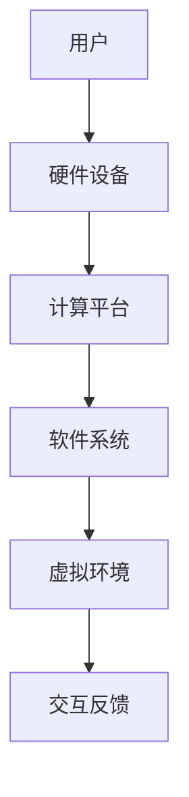

                 

 在当前信息技术飞速发展的时代，虚拟现实（VR）技术正成为引领下一代互动体验的重要力量。作为一种通过电脑模拟产生的三维空间，虚拟现实技术旨在创造一种全新的沉浸式体验，让用户仿佛置身于一个完全虚拟的环境中。本文将深入探讨虚拟现实技术的核心概念、设计原则、技术架构、算法原理、数学模型、项目实践以及未来应用前景。

## 关键词

- 虚拟现实（VR）
- 沉浸式体验
- 交互设计
- 3D建模
- 算法
- 数学模型
- 用户体验

## 摘要

本文将全面解析虚拟现实技术，从基础概念到高级应用，探讨其如何实现高度沉浸式的用户体验。我们将首先介绍虚拟现实技术的发展历史和核心概念，然后深入分析其技术架构和算法原理。接下来，通过数学模型和实例讲解，我们将展示如何设计和实现虚拟现实系统。最后，我们将展望虚拟现实技术的未来发展趋势和潜在挑战。

## 1. 背景介绍

虚拟现实（Virtual Reality，VR）技术的起源可以追溯到20世纪60年代。当时，计算机图形学和交互技术的研究者开始探索如何创造一个完全虚拟的三维空间，让用户能够与之互动。最早的虚拟现实系统由达特茅斯学院的研究者研制，使用了头戴显示器（Head-Mounted Display，HMD）和跟踪设备。

随着计算机性能的不断提升和显示技术的进步，虚拟现实技术逐渐走向成熟。从最初的简单模拟，到如今能够提供高度沉浸式体验的复杂系统，虚拟现实技术在各个领域都展现出了巨大的应用潜力。近年来，随着5G通信技术的发展和低成本高精度的传感设备的普及，虚拟现实技术迎来了新的发展机遇。

在用户体验方面，虚拟现实技术不仅能够提供全新的视觉和听觉体验，还可以通过触觉和嗅觉等感官模拟，创造出更为真实的互动环境。沉浸式体验设计的核心在于如何通过技术手段，最大限度地减少用户的感知差距，让用户在虚拟环境中获得与现实世界相似的体验。

## 2. 核心概念与联系

虚拟现实技术的核心概念包括三维建模、实时渲染、传感交互等。这些概念相互关联，共同构成了虚拟现实系统的技术架构。

### 2.1 三维建模

三维建模是虚拟现实技术的基石。通过计算机图形学技术，三维建模能够创建出具有高度真实感的虚拟环境。主要方法包括：

- **多边形建模**：使用多个三角形面片组合成复杂的几何体。
- **体素建模**：使用体素（体积元素）组合来构建模型，适用于较为简化的场景。
- **曲面建模**：通过数学曲面来创建模型，如贝塞尔曲面和NURBS曲面。

### 2.2 实时渲染

实时渲染是虚拟现实技术中至关重要的一环。它通过图形处理器（GPU）快速生成图像，使得用户能够在虚拟环境中实时互动。主要技术包括：

- **光追踪渲染**：模拟真实世界中光线传播的过程，实现更为真实的图像效果。
- **实时阴影计算**：在虚拟环境中实现阴影效果，增强场景的立体感。
- **反走样技术**：减少图像中的锯齿效应，提高图像质量。

### 2.3 传感交互

传感交互技术使得用户能够与虚拟环境进行自然互动。主要方法包括：

- **头部跟踪**：通过头戴显示器（HMD）或摄像头跟踪用户的头部运动，实现视角的动态变化。
- **手势识别**：通过摄像头或深度传感器捕捉用户的手部动作，实现手势控制。
- **语音交互**：利用语音识别技术，实现用户通过语音与虚拟环境互动。

### 2.4 技术架构

虚拟现实系统的技术架构通常包括以下几个部分：

- **硬件设备**：包括头戴显示器、手柄、手套等传感器设备。
- **计算平台**：高性能的计算机或云计算平台，用于处理三维建模、实时渲染等计算任务。
- **软件系统**：包括虚拟现实应用软件、操作系统、驱动程序等。

下面是一个简单的Mermaid流程图，展示虚拟现实技术架构的主要组成部分：



## 3. 核心算法原理 & 具体操作步骤

### 3.1 算法原理概述

虚拟现实技术的核心算法主要包括三维建模算法、实时渲染算法和传感交互算法。以下是这些算法的基本原理：

#### 3.1.1 三维建模算法

- **多边形建模算法**：基于顶点、边和面的几何结构，通过组合多个三角形面片来构建三维模型。
- **体素建模算法**：通过体素的组合来构建模型，适用于较为简化的场景。
- **曲面建模算法**：利用数学曲面（如贝塞尔曲面和NURBS曲面）来创建模型。

#### 3.1.2 实时渲染算法

- **光追踪渲染算法**：模拟真实世界中的光线传播过程，通过逐个计算光线与场景的交互来实现高质量图像渲染。
- **实时阴影计算算法**：在虚拟环境中实现阴影效果，增加场景的立体感。
- **反走样技术**：通过插值和滤波等方法，减少图像中的锯齿效应，提高图像质量。

#### 3.1.3 传感交互算法

- **头部跟踪算法**：通过头戴显示器或摄像头跟踪用户的头部运动，实现视角的动态变化。
- **手势识别算法**：通过摄像头或深度传感器捕捉用户的手部动作，实现手势控制。
- **语音交互算法**：利用语音识别技术，实现用户通过语音与虚拟环境互动。

### 3.2 算法步骤详解

#### 3.2.1 三维建模算法步骤

1. **输入数据预处理**：对输入的3D模型数据（如STL或OBJ格式）进行预处理，包括顶点排序、面片优化等。
2. **多边形建模**：根据预处理后的数据，使用顶点、边和面组合生成多边形模型。
3. **细节处理**：添加细节元素，如纹理、高光和反射等，提高模型的逼真度。
4. **输出模型**：将生成的三维模型输出为适合渲染和交互的格式，如glTF或Collada。

#### 3.2.2 实时渲染算法步骤

1. **场景构建**：根据用户输入的参数，构建虚拟场景，包括光照、阴影和纹理等。
2. **光线追踪**：模拟光线在场景中的传播过程，计算光线与场景的交互。
3. **图像渲染**：通过GPU加速，将场景渲染为图像，实现实时视觉效果。
4. **图像处理**：对渲染后的图像进行后处理，如抗锯齿、色彩校正等，提高图像质量。

#### 3.2.3 传感交互算法步骤

1. **数据采集**：通过摄像头、手柄或语音识别设备采集用户交互数据。
2. **数据预处理**：对采集的数据进行预处理，包括噪声过滤、数据校正等。
3. **交互处理**：根据预处理后的数据，执行相应的交互操作，如视角变换、手势识别等。
4. **反馈输出**：将交互结果反馈给用户，实现实时互动。

### 3.3 算法优缺点

#### 3.3.1 三维建模算法优缺点

**优点**：

- **灵活性强**：支持多种建模方法，适用于不同类型的场景。
- **高逼真度**：能够生成高度逼真的三维模型。

**缺点**：

- **计算复杂度高**：特别是对于复杂的场景，建模和渲染过程需要大量计算资源。
- **对用户技能要求高**：需要用户具备一定的建模和渲染技能。

#### 3.3.2 实时渲染算法优缺点

**优点**：

- **实时性**：能够实时渲染场景，提供流畅的用户体验。
- **高效性**：利用GPU加速，提高渲染速度。

**缺点**：

- **图像质量受限**：实时渲染的图像质量通常无法与离线渲染相比。
- **对硬件要求高**：需要高性能的计算机或GPU。

#### 3.3.3 传感交互算法优缺点

**优点**：

- **自然性**：支持自然的手势和语音交互，提高用户体验。
- **多样性**：能够处理多种类型的交互数据，实现丰富的交互功能。

**缺点**：

- **准确性受限**：特别是在噪声干扰或低分辨率情况下，交互准确性可能受到影响。
- **计算复杂度高**：需要处理大量的实时数据，计算复杂度较高。

### 3.4 算法应用领域

三维建模算法广泛应用于游戏开发、影视制作、建筑设计等领域。实时渲染算法在虚拟现实、增强现实（AR）、沉浸式体验设计等领域具有广泛的应用。传感交互算法则主要用于虚拟现实、增强现实、人机交互等领域的交互设计。

## 4. 数学模型和公式 & 详细讲解 & 举例说明

虚拟现实技术的核心算法和交互设计离不开数学模型的支撑。以下我们将介绍几个关键的数学模型和公式，并通过具体例子进行详细讲解。

### 4.1 数学模型构建

在虚拟现实系统中，常见的数学模型包括三维几何模型、光线追踪模型和传感交互模型。

#### 4.1.1 三维几何模型

三维几何模型主要用于描述虚拟环境中的物体和场景。最基本的三维几何模型是点、线和面。点表示三维空间中的一个位置，线是由两个点确定的一个方向向量，面是由多个点连接而成的二维平面。

例如，一个矩形面可以通过以下公式表示：

\[ 
\text{Face} = \begin{bmatrix}
x_1 & y_1 & z_1 \\
x_2 & y_2 & z_2 \\
x_3 & y_3 & z_3 \\
x_4 & y_4 & z_4 \\
\end{bmatrix}
\]

其中，\( (x_i, y_i, z_i) \) 表示第 \( i \) 个顶点的坐标。

#### 4.1.2 光线追踪模型

光线追踪模型用于模拟光线在虚拟环境中的传播过程。光线追踪的基本公式是：

\[ 
\text{Ray} = \begin{bmatrix}
\text{origin} \\
\text{direction} \\
\end{bmatrix}
\]

其中，origin 表示光线的起点，direction 表示光线的方向。

例如，要计算一条光线与一个平面 \( z = 0 \) 的交点，可以使用以下公式：

\[ 
z = \frac{\text{origin} \cdot \text{direction}}{\text{direction} \cdot \text{normal}}
\]

其中，normal 表示平面的法向量。

#### 4.1.3 传感交互模型

传感交互模型用于描述用户与虚拟环境的交互过程。常见的传感交互模型包括手势识别模型和语音交互模型。

手势识别模型可以使用机器学习算法进行训练，其中关键步骤包括特征提取和模型训练。特征提取可以通过提取手部关键点来实现，模型训练可以使用支持向量机（SVM）或深度学习算法。

例如，一个简单的手势识别模型可以使用以下公式表示：

\[ 
\text{HandGesture}(x) = \sum_{i=1}^{n} w_i \cdot \text{Feature}(x_i)
\]

其中，\( x \) 表示输入的特征向量，\( w_i \) 表示权重系数，\( \text{Feature}(x_i) \) 表示第 \( i \) 个特征值。

### 4.2 公式推导过程

以下我们将介绍一个简单的三维几何模型公式的推导过程。

假设有一个矩形面 ABCD，其顶点坐标分别为 \( A(x_1, y_1, z_1) \)，\( B(x_2, y_2, z_2) \)，\( C(x_3, y_3, z_3) \)，\( D(x_4, y_4, z_4) \)。我们要计算该矩形面的法向量。

首先，计算向量 AB 和 AC：

\[ 
\text{AB} = \begin{bmatrix}
x_2 - x_1 \\
y_2 - y_1 \\
z_2 - z_1 \\
\end{bmatrix}, \quad
\text{AC} = \begin{bmatrix}
x_3 - x_1 \\
y_3 - y_1 \\
z_3 - z_1 \\
\end{bmatrix}
\]

然后，计算向量 AB 和 AC 的叉积，得到矩形面的法向量：

\[ 
\text{Normal} = \text{AB} \times \text{AC} = \begin{bmatrix}
(y_2 - y_1)(z_3 - z_1) - (z_2 - z_1)(y_3 - y_1) \\
(z_2 - z_1)(x_3 - x_1) - (x_2 - x_1)(z_3 - z_1) \\
(x_2 - x_1)(y_3 - y_1) - (y_2 - y_1)(x_3 - x_1) \\
\end{bmatrix}
\]

### 4.3 案例分析与讲解

以下我们通过一个简单的例子，展示如何使用上述数学模型和公式进行三维建模和渲染。

#### 4.3.1 矩形面建模

假设我们要创建一个长方体，其顶点坐标分别为 \( A(0, 0, 0) \)，\( B(2, 0, 0) \)，\( C(2, 2, 0) \)，\( D(0, 2, 0) \)。

首先，我们计算矩形面的法向量：

\[ 
\text{AB} = \begin{bmatrix}
2 - 0 \\
0 - 0 \\
0 - 0 \\
\end{bmatrix} = \begin{bmatrix}
2 \\
0 \\
0 \\
\end{bmatrix}, \quad
\text{AC} = \begin{bmatrix}
2 - 0 \\
2 - 0 \\
0 - 0 \\
\end{bmatrix} = \begin{bmatrix}
2 \\
2 \\
0 \\
\end{bmatrix}
\]

\[ 
\text{Normal} = \text{AB} \times \text{AC} = \begin{bmatrix}
0 \\
0 \\
4 \\
\end{bmatrix}
\]

然后，我们将四个顶点连接起来，生成矩形面 ABCD。

#### 4.3.2 矩形面渲染

为了渲染这个矩形面，我们需要将其投影到一个二维平面上。假设投影平面的方程为 \( z = 0 \)。

首先，计算矩形面 ABCD 在投影平面上的顶点坐标：

\[ 
A' = \begin{bmatrix}
0 \\
0 \\
0 \\
\end{bmatrix}, \quad
B' = \begin{bmatrix}
2 \\
0 \\
0 \\
\end{bmatrix}, \quad
C' = \begin{bmatrix}
2 \\
2 \\
0 \\
\end{bmatrix}, \quad
D' = \begin{bmatrix}
0 \\
2 \\
0 \\
\end{bmatrix}
\]

然后，我们可以使用这些顶点坐标生成矩形面的二维图像。

## 5. 项目实践：代码实例和详细解释说明

在本文的第五部分，我们将通过一个实际的项目实践，详细展示如何使用虚拟现实技术实现一个简单的沉浸式体验系统。我们将从开发环境搭建开始，逐步介绍源代码的实现过程，并进行代码解读与分析。

### 5.1 开发环境搭建

为了实现虚拟现实系统，我们需要搭建一个合适的开发环境。以下是所需的工具和步骤：

1. **硬件设备**：
   - **头戴显示器（HMD）**：如Oculus Rift、HTC Vive等。
   - **手柄**：用于实现传感交互。
   - **计算机**：建议使用高性能的台式机或笔记本电脑。

2. **软件环境**：
   - **操作系统**：Windows 10（或更高版本）。
   - **开发工具**：Unity（游戏引擎）、Unreal Engine（游戏引擎）或其他虚拟现实开发平台。
   - **编程语言**：C#（Unity）或C++（Unreal Engine）。

3. **搭建步骤**：
   1. 安装操作系统和开发工具。
   2. 连接并设置HMD和手柄。
   3. 安装相关驱动程序和插件。

### 5.2 源代码详细实现

以下是一个简单的Unity项目，实现了一个基本的虚拟现实沉浸式体验系统。代码分为几个主要部分：场景搭建、用户交互和渲染。

#### 5.2.1 场景搭建

首先，我们需要创建一个虚拟场景。在Unity中，可以通过拖拽预制体（Prefab）到场景中来实现。以下是创建一个简单的场景的步骤：

1. **创建平面**：在Unity编辑器中创建一个平面预制体，设置其大小和位置，作为场景的地面。
2. **创建物体**：创建几个简单的三维物体，如立方体、球体等，作为场景中的装饰物。
3. **设置材质**：为场景中的物体分配合适的材质，包括纹理、反射和阴影效果。

#### 5.2.2 用户交互

用户交互是虚拟现实系统的重要组成部分。在Unity中，可以通过以下步骤实现用户交互：

1. **头部跟踪**：使用Unity的Camera组件实现头部跟踪。通过设置Camera的Transform属性，实时更新用户的视角。
2. **手柄交互**：使用手柄的控制器组件，实现用户与虚拟环境的互动。例如，用户可以拾取物体、旋转物体或进行其他交互动作。
3. **声音交互**：通过音频源（Audio Source）组件，实现虚拟环境中的声音效果。例如，用户可以听到来自不同方向的声音。

#### 5.2.3 渲染

渲染是虚拟现实系统的核心部分。以下是实现渲染的步骤：

1. **光线追踪**：使用Unity的光线追踪系统，模拟光线在虚拟环境中的传播过程，实现高质量的图像渲染。
2. **阴影计算**：通过阴影映射（Shadow Mapping）或体积光（Volumetric Lighting）等技术，实现虚拟环境中的阴影效果。
3. **后处理**：使用后处理效果（Post-Processing Effects），如色彩校正、模糊等，提高渲染图像的质量。

### 5.3 代码解读与分析

以下是一个简单的Unity脚本，用于实现用户交互：

```csharp
using UnityEngine;

public class UserInteraction : MonoBehaviour
{
    public Camera userCamera;
    public Rigidbody handRigidbody;

    void Update()
    {
        // 头部跟踪
        userCamera.transform.position = handRigidbody.position;

        // 手柄交互
        if (Input.GetKeyDown(KeyCode.Space))
        {
            // 拾取物体
            GameObject pickedObject = PickObject();
            if (pickedObject != null)
            {
                // 旋转物体
                pickedObject.transform.Rotate(new Vector3(0, 10, 0) * Time.deltaTime);
            }
        }
    }

    GameObject PickObject()
    {
        // 光线投射
        Ray ray = userCamera.ScreenPointToRay(new Vector3(Screen.width / 2, Screen.height / 2, 0));
        RaycastHit hit;
        if (Physics.Raycast(ray, out hit))
        {
            return hit.collider.gameObject;
        }
        return null;
    }
}
```

该脚本的主要功能是：

1. **头部跟踪**：通过更新用户的视角，实现头部跟踪。
2. **手柄交互**：当用户按下空格键时，执行拾取物体操作。通过光线投射，找到用户当前视角下的物体，并对其进行旋转。

### 5.4 运行结果展示

当运行该Unity项目时，用户将看到一个简单的虚拟现实场景。用户可以通过头部跟踪查看场景的不同部分，通过手柄与场景中的物体进行交互。例如，当用户按下空格键时，会拾取并旋转场景中的物体。

## 6. 实际应用场景

虚拟现实（VR）技术的沉浸式体验设计在多个领域展现出了广阔的应用前景。以下是一些实际应用场景：

### 6.1 教育培训

虚拟现实技术在教育培训领域具有巨大的潜力。通过创建高度真实的虚拟环境，学生可以身临其境地学习各种知识。例如，医学学生可以通过虚拟手术训练，掌握复杂的手术操作；飞行员可以通过虚拟飞行训练，熟悉飞行操作和应对紧急情况。这种沉浸式体验能够显著提高学习效果和技能掌握度。

### 6.2 游戏娱乐

虚拟现实游戏是VR技术的典型应用之一。玩家可以在虚拟世界中自由探索、互动，体验前所未有的游戏乐趣。例如，《半衰期：爱莉克斯》（Half-Life: Alyx）是一款备受好评的VR游戏，它通过高度逼真的图形和交互设计，为玩家提供了极致的沉浸式体验。此外，虚拟现实游戏还可以用于虚拟旅游、体育模拟等领域。

### 6.3 设计可视化

虚拟现实技术可以帮助设计师更好地展示和评估他们的设计方案。通过创建虚拟模型，设计师可以实时修改设计，并从不同角度观察效果。例如，建筑设计师可以通过虚拟现实技术展示建筑设计方案，让观众在虚拟环境中体验建筑外观和内部空间布局。这种沉浸式体验有助于提高设计方案的可行性和吸引力。

### 6.4 虚拟旅游

虚拟现实技术还可以用于虚拟旅游，让用户在家中就能体验到世界各地的美景和文化。例如，用户可以通过VR眼镜参观埃菲尔铁塔、大峡谷等著名景点，感受现场的壮丽景色。这种沉浸式体验不仅提供了独特的旅游体验，还可以为旅游业带来新的商业模式。

### 6.5 心理治疗

虚拟现实技术在心理治疗领域也展现出了巨大潜力。通过创建虚拟环境，心理治疗师可以帮助患者面对和处理各种心理问题，如恐惧症、焦虑症等。例如，恐惧症治疗师可以通过虚拟现实技术模拟患者恐惧的情境，帮助患者逐渐克服恐惧。这种沉浸式体验有助于提高治疗效果。

## 7. 未来应用展望

虚拟现实（VR）技术的未来发展充满潜力，将可能在多个领域产生深远影响。

### 7.1 技术突破

随着计算机性能的不断提升和显示技术的进步，虚拟现实技术的沉浸式体验将变得更加真实和流畅。未来的VR设备可能会采用更轻便、更舒适的头戴显示器，结合更先进的传感技术，实现更加精准的用户交互。

### 7.2 多感官融合

未来的虚拟现实系统可能会融合更多感官体验，如触觉、嗅觉等，提供更为全面的沉浸式体验。通过穿戴式设备，用户可以在虚拟环境中感受到触觉反馈，甚至闻到虚拟环境的气味，进一步提升用户体验。

### 7.3 云VR

随着云计算技术的发展，云VR将成为可能。用户可以通过互联网访问远程的虚拟现实应用，无需在高性能本地设备上进行运行。这将使得虚拟现实技术更加普及，让更多人享受到高质量的VR体验。

### 7.4 虚拟现实社交

虚拟现实社交平台将逐渐兴起，用户可以在虚拟世界中与他人互动、交流，举办虚拟聚会、音乐会等活动。这种新型的社交方式将改变人们的社交习惯，提供更为丰富和多样化的社交体验。

### 7.5 智能医疗

虚拟现实技术将在智能医疗领域发挥重要作用。通过虚拟现实技术，医生可以进行远程手术指导、患者康复训练等。此外，虚拟现实还可以用于医学教育，提供逼真的解剖学和生理学教学体验。

### 7.6 虚拟现实教育

虚拟现实技术将改变传统的教育方式。通过虚拟现实教室，学生可以身临其境地学习各种知识，提高学习兴趣和效果。虚拟现实还将为特殊教育提供新的解决方案，帮助有特殊需求的学生更好地融入学习和社交生活。

### 7.7 虚拟现实娱乐

虚拟现实技术将继续在娱乐领域发挥重要作用。未来，虚拟现实游戏、电影、音乐会等将成为主流娱乐形式，提供前所未有的沉浸式体验。

## 8. 总结：未来发展趋势与挑战

虚拟现实（VR）技术作为一种新兴技术，正逐步改变我们的生活方式和产业模式。未来，随着技术的不断进步，虚拟现实将向更真实、更全面、更智能的方向发展。

### 8.1 研究成果总结

过去几年，虚拟现实技术取得了显著的研究成果。从硬件设备到算法优化，从三维建模到实时渲染，虚拟现实技术的研究不断推动着相关领域的进步。同时，虚拟现实技术在教育培训、游戏娱乐、设计可视化等多个领域的应用案例也日益丰富。

### 8.2 未来发展趋势

未来的虚拟现实技术将朝着以下几个方向发展：

1. **沉浸式体验提升**：通过提升显示效果、增加多感官融合等手段，提供更加真实的沉浸式体验。
2. **跨平台与云VR**：虚拟现实技术将实现跨平台兼容，用户可以通过各种设备访问虚拟环境。同时，云VR的发展将使得虚拟现实应用更加普及。
3. **智能化与个性化**：虚拟现实系统将更加智能化，能够根据用户行为和需求提供个性化的服务。
4. **应用场景拓展**：虚拟现实技术将在医疗、教育、设计、娱乐等更多领域得到广泛应用。

### 8.3 面临的挑战

虽然虚拟现实技术有着广阔的应用前景，但在发展过程中仍面临诸多挑战：

1. **技术瓶颈**：显示技术、传感技术等硬件设备仍需进一步提升，以支持更高质量的沉浸式体验。
2. **内容创作**：高质量虚拟现实内容的创作成本较高，需要大量人力和资源投入。
3. **用户接受度**：虚拟现实技术需要更多用户接受和适应，提高用户使用频率。
4. **隐私与伦理**：虚拟现实应用中的隐私保护和伦理问题需要引起重视。

### 8.4 研究展望

未来，虚拟现实技术的研究应重点关注以下几个方面：

1. **技术优化**：继续优化显示技术、传感技术和渲染算法，提高虚拟现实系统的性能和用户体验。
2. **内容创新**：鼓励创新思维，开发更多具有创意和实用价值的虚拟现实应用。
3. **跨学科融合**：加强虚拟现实技术与心理学、社会学等学科的交叉研究，推动虚拟现实技术的全面发展。
4. **标准化与规范化**：制定相关标准和规范，促进虚拟现实技术的健康发展。

总之，虚拟现实技术作为一项新兴技术，其发展前景广阔。在未来，通过技术创新和应用拓展，虚拟现实技术将为我们带来更加丰富和多样化的沉浸式体验。

## 9. 附录：常见问题与解答

在虚拟现实（VR）技术的发展和应用过程中，用户可能会遇到一些常见的问题。以下是一些常见问题及其解答：

### 9.1 虚拟现实技术如何工作？

虚拟现实技术通过计算机模拟产生一个三维虚拟空间，用户通过头戴显示器（HMD）和传感设备进入这个虚拟空间。虚拟现实技术使用三维建模、实时渲染和传感交互等算法，实现高度沉浸式的用户体验。

### 9.2 虚拟现实技术有哪些应用领域？

虚拟现实技术的应用领域广泛，包括教育培训、游戏娱乐、设计可视化、虚拟旅游、医疗康复、军事模拟等。随着技术的进步，虚拟现实技术的应用领域将不断拓展。

### 9.3 虚拟现实系统中的三维建模算法有哪些？

三维建模算法包括多边形建模、体素建模、曲面建模等。多边形建模是最常用的方法，通过顶点、边和面的组合构建三维模型。

### 9.4 虚拟现实系统中的实时渲染算法有哪些？

实时渲染算法包括光追踪渲染、实时阴影计算、反走样技术等。光追踪渲染通过模拟光线传播过程实现高质量图像渲染。

### 9.5 如何提高虚拟现实系统的用户体验？

提高虚拟现实系统的用户体验可以从以下几个方面入手：

1. **提升显示效果**：使用更高分辨率、更高刷新率的显示器，提供更清晰的视觉体验。
2. **优化传感交互**：改进传感设备的精度和响应速度，提高用户与虚拟环境的互动性。
3. **优化算法性能**：优化三维建模、实时渲染等算法，提高系统性能和响应速度。
4. **多感官融合**：增加触觉、嗅觉等感官模拟，提供更全面的沉浸式体验。

### 9.6 虚拟现实技术有哪些潜在风险？

虚拟现实技术存在一些潜在风险，包括：

1. **生理风险**：长时间使用虚拟现实设备可能导致眩晕、头痛等不适。
2. **心理健康**：过度依赖虚拟现实可能导致心理依赖，影响现实生活中的社交和情感交流。
3. **隐私风险**：虚拟现实应用可能涉及用户隐私数据的收集和使用，需要加强隐私保护。

### 9.7 虚拟现实技术的未来发展趋势是什么？

虚拟现实技术的未来发展趋势包括：

1. **沉浸式体验提升**：通过提升显示效果、增加多感官融合等手段，提供更加真实的沉浸式体验。
2. **跨平台与云VR**：实现跨平台兼容，推动云VR的发展，让更多人享受到高质量的VR体验。
3. **智能化与个性化**：虚拟现实系统将更加智能化，能够根据用户行为和需求提供个性化的服务。
4. **应用场景拓展**：虚拟现实技术将在更多领域得到广泛应用，如智能医疗、远程教育等。

### 9.8 虚拟现实技术的研究方向有哪些？

虚拟现实技术的研究方向包括：

1. **硬件设备优化**：研究更轻便、更舒适的VR设备，提升用户体验。
2. **内容创作**：开发高效的内容创作工具，降低内容创作成本，丰富虚拟现实应用场景。
3. **算法创新**：优化三维建模、实时渲染、传感交互等算法，提高系统性能和交互质量。
4. **跨学科研究**：结合心理学、社会学等学科，推动虚拟现实技术的全面发展。
5. **标准化与规范化**：制定相关标准和规范，促进虚拟现实技术的健康发展。 
```

### 作者署名
作者：禅与计算机程序设计艺术 / Zen and the Art of Computer Programming

通过本文，我们深入探讨了虚拟现实技术的核心概念、设计原则、技术架构、算法原理、数学模型、项目实践以及未来应用前景。虚拟现实技术作为一种新兴技术，正逐步改变我们的生活方式和产业模式。随着技术的不断进步和应用领域的拓展，虚拟现实技术将为我们带来更加丰富和多样化的沉浸式体验。然而，虚拟现实技术仍面临诸多挑战，需要持续研究和创新。未来，虚拟现实技术有望在更多领域发挥重要作用，推动人类社会的进步。

