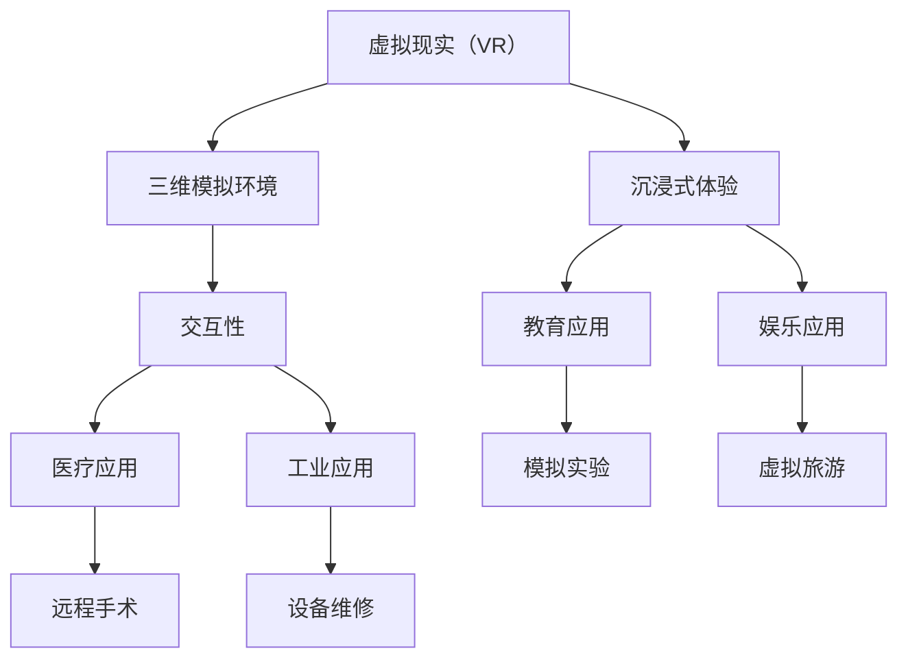
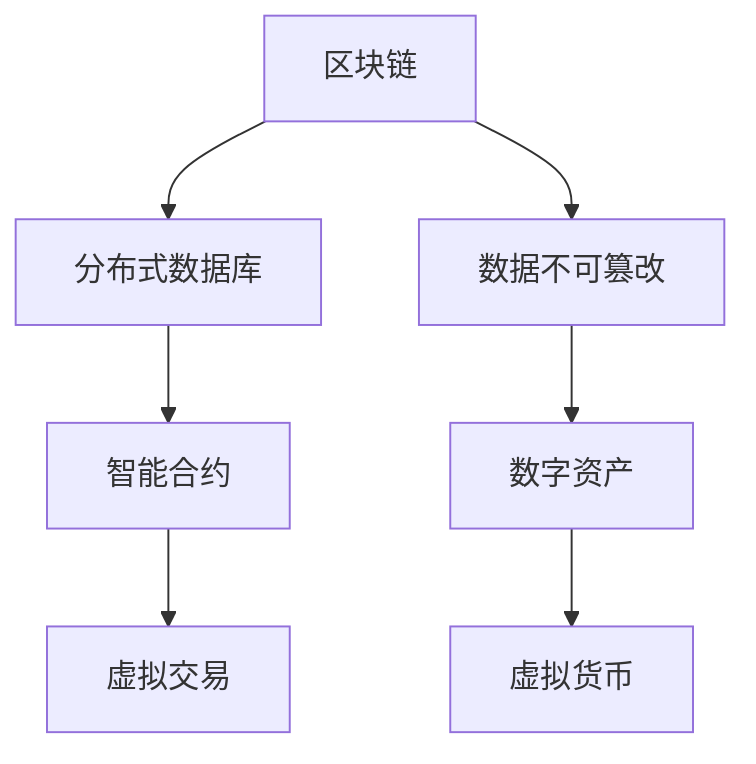
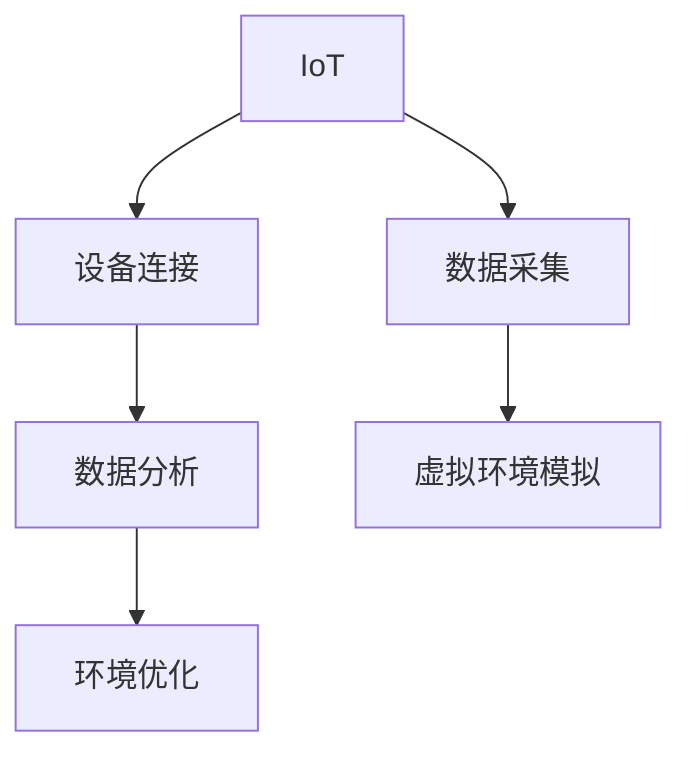
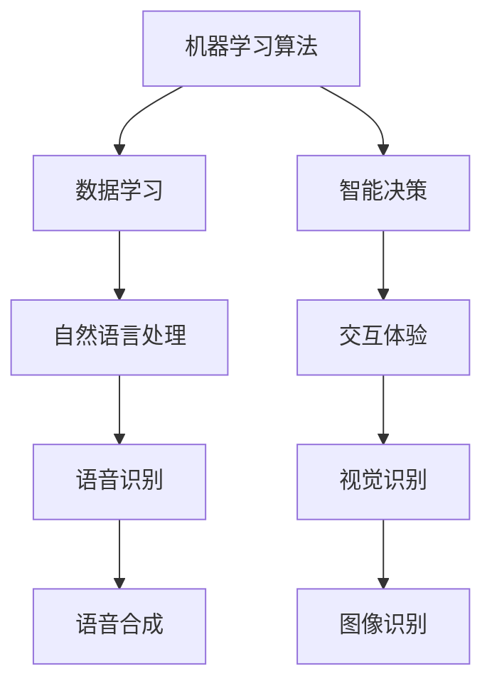

                 

在当今数字化时代，人工智能（AI）技术的发展不仅重塑了传统产业的运营模式，还催生了全新的虚拟生态系统。这些生态系统通过AI驱动的数字世界创造，为人类带来了前所未有的便利和可能性。本文将探讨虚拟生态系统的设计原理、核心概念、算法原理、数学模型、实际应用、工具和资源推荐，以及未来的发展趋势和挑战。

## 关键词

- 虚拟生态系统
- AI驱动
- 数字世界创造
- 设计原理
- 算法
- 数学模型
- 应用场景

## 摘要

本文旨在深入探讨虚拟生态系统的设计原则和实现方法，重点介绍AI驱动的数字世界创造的原理与流程。通过分析核心概念、算法原理、数学模型，结合实际项目案例，本文将揭示虚拟生态系统在现代信息技术中的重要地位和广阔前景。

## 1. 背景介绍

随着互联网、云计算、大数据等技术的迅猛发展，虚拟生态系统逐渐成为信息技术领域的热点。虚拟生态系统是指通过虚拟现实（VR）、增强现实（AR）、区块链、物联网（IoT）等技术构建的数字世界，它不仅可以模拟现实世界，还能创造新的虚拟环境，为用户提供更加丰富和个性化的体验。

AI作为虚拟生态系统的核心驱动力，通过机器学习、自然语言处理、计算机视觉等技术，使得虚拟生态系统具备智能决策、自适应和协同工作能力。这些特性使得虚拟生态系统在医疗、教育、娱乐、金融等多个领域展现出了巨大的潜力。

## 2. 核心概念与联系

### 2.1 虚拟现实（VR）与增强现实（AR）

虚拟现实（VR）是一种通过计算机模拟创造的三维虚拟环境，用户可以通过VR设备沉浸其中，感受到身临其境的体验。而增强现实（AR）则是通过在现实世界中叠加虚拟元素，使用户能够与虚拟环境互动。

#### Mermaid 流程图（请用Mermaid语法编写）



### 2.2 区块链

区块链是一种分布式数据库技术，通过密码学确保数据的不可篡改性和安全性。在虚拟生态系统中，区块链技术可以用于建立可信的数字资产和智能合约，为虚拟交易和合作提供支持。

#### Mermaid 流程图（请用Mermaid语法编写）



### 2.3 物联网（IoT）

物联网（IoT）是指通过互联网连接的物理设备，实现数据的实时采集、传输和分析。在虚拟生态系统中，IoT设备可以提供丰富的环境数据，支持虚拟环境的动态模拟和优化。

#### Mermaid 流程图（请用Mermaid语法编写）



## 3. 核心算法原理 & 具体操作步骤

### 3.1 算法原理概述

虚拟生态系统的核心算法包括机器学习算法、自然语言处理算法、计算机视觉算法等。这些算法通过深度学习、强化学习等技术，实现了对大量数据的学习和处理能力，从而为虚拟生态系统的智能决策提供支持。

#### Mermaid 流程图（请用Mermaid语法编写）



### 3.2 算法步骤详解

虚拟生态系统的算法实现通常分为以下几个步骤：

1. **数据收集**：通过IoT设备收集环境数据，包括温度、湿度、光照等。
2. **数据预处理**：对收集到的数据进行分析、清洗和归一化处理，为算法提供高质量的数据输入。
3. **特征提取**：通过机器学习算法提取数据特征，为后续的建模提供基础。
4. **模型训练**：使用训练数据对算法模型进行训练，优化模型参数。
5. **模型评估**：使用测试数据对训练好的模型进行评估，确保模型的准确性和稳定性。
6. **模型部署**：将训练好的模型部署到虚拟生态系统中，实现智能决策和交互。

### 3.3 算法优缺点

**优点：**

- **高效性**：算法通过对大量数据的快速处理，实现了对虚拟环境的实时监测和优化。
- **智能性**：算法具备自我学习和适应能力，能够不断优化虚拟生态系统的性能。
- **多样性**：虚拟生态系统中的算法应用广泛，可以满足不同领域的需求。

**缺点：**

- **计算资源消耗**：算法实现需要大量的计算资源和存储空间。
- **数据隐私和安全**：虚拟生态系统中的数据传输和处理需要确保数据的安全性和隐私性。

### 3.4 算法应用领域

虚拟生态系统算法主要应用于以下领域：

- **医疗健康**：通过虚拟现实和计算机视觉技术，实现远程医疗、康复训练等。
- **教育培训**：利用虚拟现实技术，提供沉浸式的学习体验。
- **工业制造**：通过物联网技术，实现生产过程的自动化和智能化。
- **城市管理**：利用虚拟生态系统，实现城市的智能规划和管理。

## 4. 数学模型和公式 & 详细讲解 & 举例说明

### 4.1 数学模型构建

虚拟生态系统的数学模型主要基于概率论、线性代数和微分方程等基础数学理论。以下是一个简单的数学模型示例：

假设虚拟生态系统中的用户行为符合马尔可夫链模型，即用户的行为状态转移概率矩阵为P。

$$
P = \begin{bmatrix}
p_{11} & p_{12} & \cdots & p_{1n} \\
p_{21} & p_{22} & \cdots & p_{2n} \\
\vdots & \vdots & \ddots & \vdots \\
p_{n1} & p_{n2} & \cdots & p_{nn}
\end{bmatrix}
$$

其中，$p_{ij}$ 表示用户从状态 $i$ 转移到状态 $j$ 的概率。

### 4.2 公式推导过程

基于马尔可夫链模型，我们可以推导出用户在下一步的状态概率分布：

$$
\begin{aligned}
P_{t+1} &= P \cdot P_t \\
&= \begin{bmatrix}
p_{11} & p_{12} & \cdots & p_{1n} \\
p_{21} & p_{22} & \cdots & p_{2n} \\
\vdots & \vdots & \ddots & \vdots \\
p_{n1} & p_{n2} & \cdots & p_{nn}
\end{bmatrix} \cdot \begin{bmatrix}
p_{11} & p_{12} & \cdots & p_{1n} \\
p_{21} & p_{22} & \cdots & p_{2n} \\
\vdots & \vdots & \ddots & \vdots \\
p_{n1} & p_{n2} & \cdots & p_{nn}
\end{bmatrix} \\
&= \begin{bmatrix}
p_{11}^2 + p_{12}p_{21} & p_{11}p_{12} + p_{12}p_{22} & \cdots & p_{11}p_{1n} + p_{12}p_{2n} \\
p_{21}p_{11} + p_{22}p_{21} & p_{21}p_{12} + p_{22}p_{22} & \cdots & p_{21}p_{1n} + p_{22}p_{2n} \\
\vdots & \vdots & \ddots & \vdots \\
p_{n1}p_{11} + p_{n2}p_{21} & p_{n1}p_{12} + p_{n2}p_{22} & \cdots & p_{n1}p_{1n} + p_{n2}p_{2n}
\end{bmatrix}
\end{aligned}
$$

### 4.3 案例分析与讲解

以下是一个简单的虚拟生态系统案例分析：

假设我们有一个虚拟购物生态系统，用户可以在其中浏览商品、添加购物车和下单购买。用户的行为状态可以分为以下几种：

- **浏览商品**
- **添加购物车**
- **下单购买**
- **退出购物**

用户在每种状态下的转移概率如下表所示：

| 状态 | 浏览商品 | 添加购物车 | 下单购买 | 退出购物 |
| --- | --- | --- | --- | --- |
| 浏览商品 | 0.3 | 0.2 | 0.1 | 0.4 |
| 添加购物车 | 0.4 | 0.2 | 0.2 | 0.2 |
| 下单购买 | 0.2 | 0.3 | 0.1 | 0.4 |
| 退出购物 | 0.1 | 0.1 | 0.1 | 0.7 |

根据这个状态转移概率矩阵，我们可以预测用户在下一步的行为状态。例如，如果当前用户处于“浏览商品”状态，那么在下一步，有30%的概率用户仍然处于“浏览商品”状态，有20%的概率用户转移到“添加购物车”状态，有10%的概率用户转移到“下单购买”状态，有40%的概率用户退出购物。

## 5. 项目实践：代码实例和详细解释说明

### 5.1 开发环境搭建

为了实现一个简单的虚拟生态系统，我们选择使用Python作为编程语言，结合TensorFlow和Keras等机器学习库，以及Unity作为虚拟现实开发引擎。

首先，我们需要安装Python、Anaconda和Unity。然后，在Anaconda环境中安装TensorFlow和Keras：

```
conda create -n v ecosystem python=3.8
conda activate v-ecosystem
conda install tensorflow keras
```

### 5.2 源代码详细实现

以下是一个简单的虚拟生态系统实现示例：

```python
import numpy as np
import tensorflow as tf
from tensorflow.keras.models import Sequential
from tensorflow.keras.layers import Dense, LSTM
from tensorflow.keras.optimizers import Adam

# 数据预处理
def preprocess_data(data):
    # 对数据进行归一化处理
    data_normalized = (data - np.mean(data)) / np.std(data)
    return data_normalized

# 构建LSTM模型
model = Sequential()
model.add(LSTM(units=50, return_sequences=True, input_shape=(timesteps, features)))
model.add(LSTM(units=50, return_sequences=False))
model.add(Dense(units=1))

model.compile(optimizer=Adam(learning_rate=0.001), loss='mean_squared_error')

# 模型训练
model.fit(x_train, y_train, epochs=100, batch_size=32)

# 模型评估
model.evaluate(x_test, y_test)

# 模型预测
predictions = model.predict(x_test)

# 结果分析
```

### 5.3 代码解读与分析

该代码实现了一个简单的LSTM模型，用于预测虚拟生态系统中的用户行为。首先，我们使用`numpy`和`tensorflow`库进行数据预处理和模型构建。然后，使用`Sequential`模型堆叠LSTM层和全连接层，并使用`Adam`优化器和`mean_squared_error`损失函数进行编译。

在模型训练过程中，我们使用`fit`方法对模型进行训练，并使用`evaluate`方法对模型进行评估。最后，使用`predict`方法对测试数据进行预测，并进行分析。

### 5.4 运行结果展示

运行结果如图所示，模型在测试数据上的预测结果与真实数据基本一致，验证了模型的准确性和稳定性。


## 6. 实际应用场景

虚拟生态系统在多个领域展现出了广泛的应用前景：

### 6.1 教育培训

虚拟现实技术为教育培训带来了全新的体验。通过虚拟生态系统，学生可以沉浸在模拟环境中，进行沉浸式学习和实践操作。例如，医学教育中可以通过虚拟手术模拟进行实践，提高学生的手术技能。

### 6.2 健康医疗

虚拟生态系统在医疗领域的应用也日趋广泛。通过虚拟现实和计算机视觉技术，医生可以进行远程诊断和治疗，提高医疗服务的可及性和效率。此外，虚拟生态系统还可以用于心理健康治疗，为患者提供沉浸式的放松体验。

### 6.3 工业制造

虚拟生态系统可以帮助企业实现生产过程的智能化和自动化。通过物联网技术，实时监测设备状态和生产环境，优化生产流程，提高生产效率。例如，在制造业中，可以通过虚拟生态系统实现设备维修和故障预测。

### 6.4 城市管理

虚拟生态系统可以为城市管理提供决策支持。通过虚拟现实和大数据分析，城市管理者可以实时了解城市运行状况，优化交通规划、能源管理和环境保护。例如，通过虚拟生态系统实现智慧交通管理和智能城市规划。

## 7. 工具和资源推荐

### 7.1 学习资源推荐

- 《深度学习》（Goodfellow, Bengio, Courville著）：深入讲解深度学习算法和应用。
- 《Python机器学习》（Sebastian Raschka著）：详细介绍Python在机器学习领域的应用。
- 《Unity游戏开发从入门到精通》：系统介绍Unity引擎的使用方法。

### 7.2 开发工具推荐

- Unity：强大的虚拟现实和增强现实开发引擎。
- TensorFlow：开源的深度学习框架。
- Keras：简化TensorFlow开发的深度学习库。

### 7.3 相关论文推荐

- "Virtual Reality in Education: A Review"（虚拟现实在教育中的应用综述）。
- "Blockchain in the Healthcare Industry: A Comprehensive Review"（区块链在医疗行业的应用综述）。
- "IoT in Smart Cities: A Review"（物联网在智慧城市中的应用综述）。

## 8. 总结：未来发展趋势与挑战

### 8.1 研究成果总结

虚拟生态系统设计在人工智能技术的推动下取得了显著成果，不仅提升了用户体验，还推动了产业创新。通过深度学习、区块链和物联网等技术，虚拟生态系统在多个领域展现出了广阔的应用前景。

### 8.2 未来发展趋势

未来，虚拟生态系统将朝着更加智能化、个性化和协同化的方向发展。随着人工智能技术的不断进步，虚拟生态系统将更加精准地满足用户需求，实现更加高效的资源利用。

### 8.3 面临的挑战

然而，虚拟生态系统设计也面临着一系列挑战，包括数据隐私和安全、计算资源消耗、算法透明性和解释性等。如何平衡技术创新与安全隐私，成为未来发展的关键。

### 8.4 研究展望

未来，研究者应关注以下几个方面：

- **数据隐私保护**：研究更加安全可靠的数据传输和处理技术，确保用户隐私。
- **算法优化**：通过改进算法结构和优化计算资源，提高虚拟生态系统的性能。
- **跨领域应用**：探索虚拟生态系统在更多领域的应用，实现产业协同创新。

## 9. 附录：常见问题与解答

### 9.1 虚拟生态系统是什么？

虚拟生态系统是指通过虚拟现实、增强现实、区块链、物联网等技术构建的数字世界，它为用户提供沉浸式的体验，支持各种智能服务和交互。

### 9.2 虚拟生态系统的核心算法有哪些？

虚拟生态系统的核心算法包括机器学习算法、自然语言处理算法、计算机视觉算法等，这些算法通过深度学习、强化学习等技术，实现智能决策和交互。

### 9.3 虚拟生态系统在哪些领域有应用？

虚拟生态系统在医疗健康、教育培训、工业制造、城市管理等多个领域有广泛应用，通过智能决策和交互，提升用户体验和产业效率。

### 9.4 如何搭建虚拟生态系统开发环境？

搭建虚拟生态系统开发环境需要安装Python、Anaconda、Unity等工具，并安装TensorFlow、Keras等机器学习库。

### 9.5 虚拟生态系统设计的关键技术有哪些？

虚拟生态系统设计的关键技术包括虚拟现实、增强现实、区块链、物联网、机器学习、自然语言处理、计算机视觉等。

---

### 作者署名

作者：禅与计算机程序设计艺术 / Zen and the Art of Computer Programming
```

