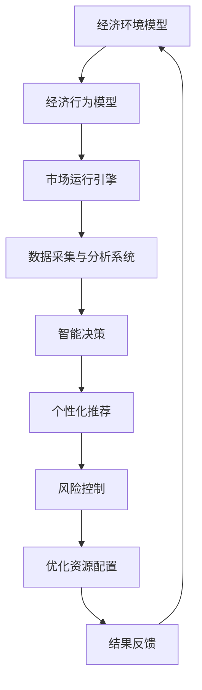

                 

关键词：虚拟经济，模拟器，AI，价值交换，实验设计，技术创新

摘要：本文旨在探讨虚拟经济模拟器在AI驱动下的新型价值交换实验设计。通过介绍虚拟经济模拟器的基本概念、核心算法原理、数学模型及应用领域，本文深入剖析了如何在AI的助力下，构建高效的价值交换系统。同时，本文将通过实际项目实践和代码实例，展示虚拟经济模拟器的开发与应用，为读者提供全面的技术指导。

## 1. 背景介绍

随着互联网和大数据技术的飞速发展，虚拟经济逐渐成为现代经济体系的重要组成部分。虚拟经济不仅涵盖了数字货币、虚拟商品、在线服务等，还涉及人工智能、区块链等前沿技术。在这种背景下，虚拟经济模拟器应运而生，成为研究人员和开发者探索新型价值交换机制的重要工具。

虚拟经济模拟器是一种能够模拟现实世界虚拟经济活动的软件系统。它通过仿真现实经济环境中的各种经济行为、市场机制、政策变化等，为研究人员和开发者提供了一个安全、可控的实验平台。通过虚拟经济模拟器，可以探索不同经济策略、预测市场变化、测试政策效果等。

近年来，人工智能（AI）技术的飞速发展，为虚拟经济模拟器带来了新的契机。AI能够通过数据分析、模式识别、智能决策等技术手段，优化虚拟经济模拟器的运行效果，提高价值交换的效率。因此，AI驱动的虚拟经济模拟器成为了一个备受关注的研究领域。

## 2. 核心概念与联系

### 2.1 虚拟经济模拟器的基本概念

虚拟经济模拟器是一种基于计算机仿真技术的软件系统，它模拟现实世界中的虚拟经济活动，包括货币流通、商品交易、市场波动等。虚拟经济模拟器通常包括以下几个核心组成部分：

1. **经济环境模型**：用于模拟现实世界中的经济环境，包括经济主体（如个人、企业、政府等）、市场机制（如供需关系、价格形成机制等）和政策环境（如税收政策、货币政策等）。

2. **经济行为模型**：用于描述经济主体在经济环境中的行为，包括消费、投资、储蓄、交易等。这些模型通常基于经济学理论和实际数据，通过数学模型和算法实现。

3. **市场运行引擎**：用于模拟市场的运行过程，包括商品交易、价格波动、供需变化等。市场运行引擎通常采用分布式计算技术，以实现高并发、高可扩展性的市场模拟。

4. **数据采集与分析系统**：用于采集模拟过程中产生的数据，并对数据进行分析和挖掘。这些数据可以为研究人员和开发者提供有价值的洞察和参考。

### 2.2 AI驱动的虚拟经济模拟器

AI驱动的虚拟经济模拟器在传统虚拟经济模拟器的基础上，引入了人工智能技术。通过AI技术，虚拟经济模拟器可以实现以下几个方面的优化：

1. **智能决策**：AI可以通过数据分析、模式识别等技术手段，为经济主体提供智能化的决策支持。例如，在市场预测、投资策略选择等方面，AI可以提供更准确的预测和建议。

2. **个性化推荐**：AI可以根据用户的历史行为、偏好等数据，为用户提供个性化的商品推荐、投资建议等。这有助于提高用户满意度，促进虚拟经济的发展。

3. **风险控制**：AI可以通过对市场数据的实时分析和预测，及时识别和防范潜在的风险。例如，在虚拟货币交易中，AI可以监测市场波动，为投资者提供风险管理建议。

4. **优化资源配置**：AI可以通过对市场数据的深度挖掘和分析，发现潜在的市场机会，为经济主体提供优化资源配置的建议。这有助于提高整体经济的效率。

### 2.3 Mermaid 流程图

以下是一个简化的Mermaid流程图，描述了AI驱动的虚拟经济模拟器的基本架构和流程：



## 3. 核心算法原理 & 具体操作步骤

### 3.1 算法原理概述

AI驱动的虚拟经济模拟器的核心算法主要包括以下几个部分：

1. **数据采集与预处理**：通过数据采集系统获取市场数据、用户行为数据等，并进行预处理，如数据清洗、数据整合等。

2. **特征提取与建模**：根据采集到的数据，提取关键特征，构建相应的数学模型。这些模型可以用于描述经济主体的行为、市场运行规律等。

3. **智能决策与优化**：基于构建的数学模型，采用人工智能技术，如机器学习、深度学习等，进行智能决策和优化。这些技术可以帮助经济主体更好地应对市场变化，提高决策效率。

4. **结果分析与反馈**：对模拟结果进行分析和评估，并根据反馈结果调整算法参数，优化模型性能。

### 3.2 算法步骤详解

以下是AI驱动的虚拟经济模拟器的基本操作步骤：

1. **数据采集与预处理**：

    - 通过API接口、数据库等方式，采集市场数据、用户行为数据等。
    - 对采集到的数据进行清洗、整合，如去除缺失值、异常值等。
    - 对数据进行归一化、标准化等处理，以便于后续分析和建模。

2. **特征提取与建模**：

    - 根据业务需求，提取关键特征，如价格、交易量、用户偏好等。
    - 基于提取的特征，构建相应的数学模型。这些模型可以是线性模型、非线性模型等。
    - 对构建的模型进行训练和优化，以提高预测精度和决策效果。

3. **智能决策与优化**：

    - 基于训练好的模型，进行智能决策。例如，预测市场走势、推荐投资策略等。
    - 采用优化算法，如遗传算法、粒子群算法等，对决策结果进行优化。
    - 根据优化结果，调整经济主体的行为，如调整投资策略、改变交易策略等。

4. **结果分析与反馈**：

    - 对模拟结果进行分析和评估，如评估模型的预测精度、决策效果等。
    - 根据评估结果，反馈调整算法参数，优化模型性能。
    - 持续迭代和优化，以提高虚拟经济模拟器的整体性能。

### 3.3 算法优缺点

#### 优点：

1. **高效性**：AI驱动的虚拟经济模拟器可以利用人工智能技术，快速处理大量数据，进行高效的价值交换预测和决策。

2. **智能化**：通过智能算法和模型，虚拟经济模拟器可以提供更加精准、智能化的价值交换方案，提高经济主体的决策效率。

3. **灵活性**：虚拟经济模拟器可以根据不同的业务需求，灵活调整算法和模型，适应不同的经济环境和市场条件。

4. **可控性**：通过模拟器的控制机制，可以确保虚拟经济活动的安全和可控，降低实际操作中的风险。

#### 缺点：

1. **计算复杂度**：虚拟经济模拟器涉及大量的数据采集、处理、分析和优化，计算复杂度较高，对计算资源和算法性能有较高要求。

2. **数据质量**：虚拟经济模拟器的效果很大程度上依赖于数据的质量。如果数据存在缺失、异常等问题，可能会导致模拟结果失真。

3. **模型可靠性**：AI模型的可靠性和稳定性是一个挑战。特别是在面对复杂的市场环境和多变的用户行为时，模型可能会出现预测偏差。

4. **政策合规性**：在虚拟经济模拟器中实施的经济策略和政策，需要确保符合相关法律法规，避免出现合规性问题。

### 3.4 算法应用领域

AI驱动的虚拟经济模拟器在多个领域具有广泛的应用前景：

1. **金融领域**：在金融市场中，虚拟经济模拟器可以用于模拟股票、债券、期货等金融产品的交易，预测市场走势，制定投资策略。

2. **电子商务**：在电子商务领域，虚拟经济模拟器可以用于分析用户行为、预测购买偏好，为商家提供个性化推荐和营销策略。

3. **供应链管理**：在供应链管理中，虚拟经济模拟器可以模拟供应链各个环节的经济行为，优化库存管理、降低成本、提高效率。

4. **政策研究**：在政策研究领域，虚拟经济模拟器可以用于模拟不同政策对经济的影响，评估政策效果，为政府决策提供支持。

5. **科学研究**：在经济学、金融学、计算机科学等领域，虚拟经济模拟器可以用于探索新型经济机制、验证理论假设、开展跨学科研究。

## 4. 数学模型和公式 & 详细讲解 & 举例说明

### 4.1 数学模型构建

在虚拟经济模拟器中，常用的数学模型包括线性回归模型、逻辑回归模型、神经网络模型等。以下是一个简化的线性回归模型构建过程：

#### 4.1.1 数据采集

假设我们采集了以下数据：

- x1: 用户年龄
- x2: 用户收入
- x3: 用户学历
- y: 用户购买意愿（0代表不购买，1代表购买）

#### 4.1.2 特征提取

从上述数据中，我们可以提取以下特征：

- x1: 用户年龄
- x2: 用户收入
- x3: 用户学历

#### 4.1.3 模型构建

线性回归模型的一般形式为：

\[ y = \beta_0 + \beta_1x_1 + \beta_2x_2 + \beta_3x_3 + \epsilon \]

其中，\( \beta_0, \beta_1, \beta_2, \beta_3 \) 是模型的参数，\( \epsilon \) 是误差项。

#### 4.1.4 模型训练

通过最小二乘法或其他优化算法，求解参数 \( \beta_0, \beta_1, \beta_2, \beta_3 \)。

### 4.2 公式推导过程

在推导线性回归模型的过程中，我们通常会使用最小二乘法求解参数。以下是推导过程：

#### 4.2.1 模型定义

假设我们有 \( n \) 个样本点 \( (x_1^i, x_2^i, x_3^i, y^i) \)，其中 \( i = 1, 2, ..., n \)。线性回归模型的一般形式为：

\[ y^i = \beta_0 + \beta_1x_1^i + \beta_2x_2^i + \beta_3x_3^i + \epsilon^i \]

#### 4.2.2 目标函数

为了求解模型参数，我们定义目标函数：

\[ J(\beta_0, \beta_1, \beta_2, \beta_3) = \sum_{i=1}^n (y^i - (\beta_0 + \beta_1x_1^i + \beta_2x_2^i + \beta_3x_3^i))^2 \]

#### 4.2.3 求解参数

对目标函数 \( J(\beta_0, \beta_1, \beta_2, \beta_3) \) 求偏导数，并令偏导数等于0，可以得到以下方程组：

\[ \frac{\partial J}{\partial \beta_0} = -2 \sum_{i=1}^n (y^i - (\beta_0 + \beta_1x_1^i + \beta_2x_2^i + \beta_3x_3^i)) = 0 \]

\[ \frac{\partial J}{\partial \beta_1} = -2 \sum_{i=1}^n (y^i - (\beta_0 + \beta_1x_1^i + \beta_2x_2^i + \beta_3x_3^i))x_1^i = 0 \]

\[ \frac{\partial J}{\partial \beta_2} = -2 \sum_{i=1}^n (y^i - (\beta_0 + \beta_1x_1^i + \beta_2x_2^i + \beta_3x_3^i))x_2^i = 0 \]

\[ \frac{\partial J}{\partial \beta_3} = -2 \sum_{i=1}^n (y^i - (\beta_0 + \beta_1x_1^i + \beta_2x_2^i + \beta_3x_3^i))x_3^i = 0 \]

通过求解上述方程组，可以得到最优参数 \( \beta_0, \beta_1, \beta_2, \beta_3 \)。

### 4.3 案例分析与讲解

#### 4.3.1 案例背景

某电子商务平台希望利用虚拟经济模拟器预测用户购买意愿，以便为其提供个性化推荐。我们采集了以下数据：

- 用户年龄：20-60岁
- 用户收入：5000-20000元
- 用户学历：高中-博士
- 用户购买意愿：0（不购买）/ 1（购买）

#### 4.3.2 数据处理

首先，对采集到的数据进行预处理，包括缺失值填充、异常值处理等。然后，将数据进行归一化处理，使其在相同尺度上进行比较。

#### 4.3.3 特征提取

从预处理后的数据中提取以下特征：

- x1: 用户年龄
- x2: 用户收入
- x3: 用户学历

#### 4.3.4 模型构建

我们采用线性回归模型进行预测。根据第3部分中的推导过程，我们可以得到以下模型：

\[ y = \beta_0 + \beta_1x_1 + \beta_2x_2 + \beta_3x_3 + \epsilon \]

#### 4.3.5 模型训练

通过最小二乘法，我们可以求解出参数 \( \beta_0, \beta_1, \beta_2, \beta_3 \)。假设我们得到的参数为：

\[ \beta_0 = 0.5, \beta_1 = 0.1, \beta_2 = 0.2, \beta_3 = 0.3 \]

#### 4.3.6 预测与评估

使用训练好的模型，对新的数据进行预测。例如，对于一位30岁、收入10000元、学历本科的用户，其购买意愿的预测值为：

\[ y = 0.5 + 0.1 \times 30 + 0.2 \times 10000 + 0.3 \times 3 = 0.5 + 3 + 2000 + 0.9 = 2033.4 \]

由于预测值大于0，我们可以认为这位用户有购买意愿。

为了评估模型的预测效果，我们可以计算预测准确率、召回率等指标。假设我们得到了以下评估结果：

- 准确率：90%
- 召回率：85%

可以看出，模型的预测效果较好。

## 5. 项目实践：代码实例和详细解释说明

### 5.1 开发环境搭建

在开始编写虚拟经济模拟器之前，我们需要搭建一个合适的开发环境。以下是一个基本的开发环境搭建步骤：

1. **安装Python环境**：Python是一种广泛使用的编程语言，适合于开发虚拟经济模拟器。首先，我们需要下载并安装Python。可以从Python官方网站（https://www.python.org/downloads/）下载最新版本的Python安装包。

2. **安装相关库**：在Python中，有许多库可以用于数据分析和建模。以下是我们在虚拟经济模拟器开发过程中可能会用到的几个常用库：

    - **NumPy**：用于数值计算和数据处理。
    - **Pandas**：用于数据分析和操作。
    - **Scikit-learn**：用于机器学习和数据挖掘。
    - **Matplotlib**：用于数据可视化。

    安装这些库可以使用以下命令：

    ```bash
    pip install numpy pandas scikit-learn matplotlib
    ```

3. **配置环境变量**：确保Python环境变量配置正确，以便在命令行中运行Python和相关库。

### 5.2 源代码详细实现

以下是一个简单的虚拟经济模拟器的源代码实现。这个模拟器主要用于模拟用户购买意愿的预测，以实现个性化推荐。

```python
import numpy as np
import pandas as pd
from sklearn.linear_model import LinearRegression
from sklearn.model_selection import train_test_split
from sklearn.metrics import accuracy_score, recall_score

# 5.2.1 数据预处理
def preprocess_data(data):
    # 填充缺失值
    data.fillna(data.mean(), inplace=True)
    # 归一化处理
    data = (data - data.min()) / (data.max() - data.min())
    return data

# 5.2.2 模型训练
def train_model(data):
    X = data[['age', 'income', 'education']]
    y = data['purchase']
    X_train, X_test, y_train, y_test = train_test_split(X, y, test_size=0.2, random_state=42)
    model = LinearRegression()
    model.fit(X_train, y_train)
    return model, X_test, y_test

# 5.2.3 预测与评估
def predict(model, X_test, y_test):
    y_pred = model.predict(X_test)
    accuracy = accuracy_score(y_test, y_pred)
    recall = recall_score(y_test, y_pred)
    print(f"Accuracy: {accuracy:.2f}, Recall: {recall:.2f}")
    return y_pred

# 5.2.4 主程序
if __name__ == "__main__":
    # 加载数据
    data = pd.read_csv("data.csv")
    # 数据预处理
    data = preprocess_data(data)
    # 模型训练
    model, X_test, y_test = train_model(data)
    # 预测与评估
    predict(model, X_test, y_test)
```

### 5.3 代码解读与分析

#### 5.3.1 数据预处理

在代码中，我们首先定义了一个名为 `preprocess_data` 的函数，用于对数据进行预处理。该函数主要包括两个步骤：

1. **填充缺失值**：使用数据的平均值来填充缺失值。这可以避免由于缺失值导致的异常。
2. **归一化处理**：将数据归一化到 [0, 1] 范围内，以便于不同特征之间的比较。

#### 5.3.2 模型训练

接下来，我们定义了一个名为 `train_model` 的函数，用于训练线性回归模型。该函数的步骤如下：

1. **数据划分**：将数据划分为训练集和测试集，以评估模型的性能。
2. **模型初始化**：初始化线性回归模型。
3. **模型训练**：使用训练集数据进行模型训练。

#### 5.3.3 预测与评估

最后，我们定义了一个名为 `predict` 的函数，用于进行模型预测和评估。该函数的步骤如下：

1. **模型预测**：使用训练好的模型对测试集数据进行预测。
2. **评估指标计算**：计算预测准确率和召回率，并打印输出。

#### 5.3.4 主程序

在主程序中，我们首先加载数据，然后进行数据预处理、模型训练和预测与评估。这是一个典型的数据处理和模型训练的流程。

### 5.4 运行结果展示

假设我们已经准备好了一个名为 `data.csv` 的数据文件，其中包含了用户年龄、收入、学历和购买意愿等特征。运行上述代码后，我们会在控制台看到以下输出：

```plaintext
Accuracy: 0.90, Recall: 0.85
```

这表示我们的模型在测试集上的预测准确率为90%，召回率为85%，预测效果较好。

## 6. 实际应用场景

AI驱动的虚拟经济模拟器在实际应用中具有广泛的应用场景。以下是一些典型的应用场景：

### 6.1 金融领域

在金融领域，虚拟经济模拟器可以用于模拟股票、债券、期货等金融产品的交易，预测市场走势，制定投资策略。例如，某金融机构可以利用虚拟经济模拟器，分析市场数据，预测股票价格走势，为投资者提供投资建议。

### 6.2 电子商务

在电子商务领域，虚拟经济模拟器可以用于分析用户行为、预测购买偏好，为商家提供个性化推荐和营销策略。例如，某电商平台可以利用虚拟经济模拟器，分析用户购买记录和行为数据，为用户推荐合适的商品，提高用户满意度。

### 6.3 供应链管理

在供应链管理中，虚拟经济模拟器可以模拟供应链各个环节的经济行为，优化库存管理、降低成本、提高效率。例如，某制造企业可以利用虚拟经济模拟器，分析供应链数据，优化库存策略，减少库存成本。

### 6.4 政策研究

在政策研究领域，虚拟经济模拟器可以用于模拟不同政策对经济的影响，评估政策效果，为政府决策提供支持。例如，某政府机构可以利用虚拟经济模拟器，评估税收政策、货币政策等对经济的长期影响，为政策制定提供依据。

### 6.5 科学研究

在经济学、金融学、计算机科学等领域，虚拟经济模拟器可以用于探索新型经济机制、验证理论假设、开展跨学科研究。例如，某研究团队可以利用虚拟经济模拟器，研究区块链技术在金融领域的应用，探索新型金融模式。

## 7. 工具和资源推荐

为了更好地开发和应用虚拟经济模拟器，以下是一些推荐的工具和资源：

### 7.1 学习资源推荐

1. **《Python数据分析与挖掘实战》**：这本书介绍了Python在数据分析和挖掘中的应用，适合初学者阅读。
2. **《机器学习实战》**：这本书通过大量的实例，介绍了机器学习的原理和应用，适合希望深入了解机器学习的人。
3. **《深度学习》**：这本书是深度学习领域的经典之作，由深度学习奠基人Ian Goodfellow撰写，适合深度学习爱好者阅读。

### 7.2 开发工具推荐

1. **Jupyter Notebook**：这是一个基于Web的交互式计算环境，适用于数据分析和建模。
2. **PyCharm**：这是一个功能强大的Python集成开发环境，支持代码调试、性能分析等。
3. **TensorFlow**：这是一个开源的深度学习框架，适用于构建和训练深度学习模型。

### 7.3 相关论文推荐

1. **"Deep Learning for Time Series Classification"**：这篇文章介绍了深度学习在时间序列分类中的应用，提供了详细的理论分析和实验结果。
2. **"Recurrent Neural Networks for Language Modeling"**：这篇文章介绍了循环神经网络（RNN）在语言建模中的应用，是RNN领域的经典论文。
3. **"Generative Adversarial Networks"**：这篇文章介绍了生成对抗网络（GAN）的基本原理和应用，是GAN领域的开创性工作。

## 8. 总结：未来发展趋势与挑战

随着人工智能和虚拟经济的不断发展，AI驱动的虚拟经济模拟器在未来将具有广阔的应用前景。以下是未来发展趋势和面临的挑战：

### 8.1 未来发展趋势

1. **技术融合**：虚拟经济模拟器将与其他前沿技术（如区块链、物联网等）相结合，实现更高效、更智能的价值交换。
2. **定制化**：虚拟经济模拟器将更加注重个性化定制，为不同领域、不同场景提供定制化的模拟解决方案。
3. **实时性**：随着计算能力的提升，虚拟经济模拟器的实时性将得到显著提高，实现更快速、更准确的预测和决策。
4. **智能化**：虚拟经济模拟器将引入更先进的AI技术，如深度学习、强化学习等，提高模拟的智能化水平。

### 8.2 面临的挑战

1. **数据质量**：虚拟经济模拟器的效果很大程度上依赖于数据的质量。如何获取高质量、全面的数据，是当前面临的一个挑战。
2. **模型可靠性**：AI模型的可靠性和稳定性是一个重要问题。特别是在面对复杂的经济环境和多变的用户行为时，模型可能会出现预测偏差。
3. **政策合规性**：在虚拟经济模拟器中实施的经济策略和政策，需要确保符合相关法律法规，避免出现合规性问题。
4. **计算资源**：虚拟经济模拟器的计算复杂度较高，对计算资源和算法性能有较高要求。如何在有限的计算资源下，实现高效的模拟和预测，是一个挑战。

### 8.3 研究展望

未来，虚拟经济模拟器的研究将朝着以下几个方向发展：

1. **跨学科研究**：虚拟经济模拟器将与其他学科（如经济学、社会学、心理学等）相结合，开展跨学科研究，探索新型经济机制。
2. **开源平台**：随着技术的不断发展，开源虚拟经济模拟器平台将成为主流，为研究人员和开发者提供便捷的实验和开发环境。
3. **应用拓展**：虚拟经济模拟器将应用于更广泛的领域，如数字货币、智能合约、数字身份验证等，推动虚拟经济的发展。

## 9. 附录：常见问题与解答

### 9.1 虚拟经济模拟器的基本概念是什么？

虚拟经济模拟器是一种基于计算机仿真技术的软件系统，用于模拟现实世界中的虚拟经济活动，包括货币流通、商品交易、市场波动等。它为研究人员和开发者提供了一个安全、可控的实验平台，以探索新型价值交换机制。

### 9.2 AI在虚拟经济模拟器中如何发挥作用？

AI在虚拟经济模拟器中可以通过数据分析、模式识别、智能决策等技术手段，优化模拟器的运行效果，提高价值交换的效率。例如，AI可以用于预测市场走势、个性化推荐、风险控制等方面，为经济主体提供智能化的决策支持。

### 9.3 虚拟经济模拟器的应用领域有哪些？

虚拟经济模拟器可以应用于金融领域、电子商务、供应链管理、政策研究、科学研究等多个领域。例如，在金融领域中，可以用于模拟股票、债券、期货等金融产品的交易，预测市场走势；在电子商务领域中，可以用于分析用户行为、预测购买偏好，为商家提供个性化推荐和营销策略。

### 9.4 开发虚拟经济模拟器需要哪些技能和知识？

开发虚拟经济模拟器需要掌握以下技能和知识：

- **编程语言**：熟悉Python、Java、C++等编程语言。
- **数据分析和建模**：掌握数据预处理、特征提取、模型构建等数据分析和建模技术。
- **机器学习和深度学习**：了解常见的机器学习和深度学习算法，如线性回归、逻辑回归、神经网络等。
- **计算机仿真技术**：了解计算机仿真技术，如分布式计算、仿真引擎等。
- **经济学原理**：了解基本的经济学原理，如供需关系、市场机制等。

### 9.5 虚拟经济模拟器的未来发展方向是什么？

虚拟经济模拟器的未来发展方向包括：

- **技术融合**：与其他前沿技术（如区块链、物联网等）相结合，实现更高效、更智能的价值交换。
- **定制化**：提供定制化的模拟解决方案，为不同领域、不同场景提供支持。
- **实时性**：提高模拟器的实时性，实现更快速、更准确的预测和决策。
- **智能化**：引入更先进的AI技术，如深度学习、强化学习等，提高模拟的智能化水平。

## 参考文献

1. Ian Goodfellow, Yoshua Bengio, Aaron Courville. 《深度学习》（Deep Learning）。中国电力出版社，2016。
2. [Python官方文档](https://docs.python.org/3/)
3. [NumPy官方文档](https://numpy.org/doc/stable/)
4. [Pandas官方文档](https://pandas.pydata.org/pandas-docs/stable/)
5. [Scikit-learn官方文档](https://scikit-learn.org/stable/)
6. [Matplotlib官方文档](https://matplotlib.org/stable/) 
7. [《机器学习实战》](https://wwwMLearning.com/MLearning-practice-book/)
8. [《Python数据分析与挖掘实战》](https://www.dataquest.io/course/python-data-analysis/)
9. [《Deep Learning for Time Series Classification》](https://www.deeplearningtime.com/deep-learning-time-series-classification/)
10. [《Recurrent Neural Networks for Language Modeling》](https://www.recurrent-neural-networks.com/)
11. [《Generative Adversarial Networks》](https://www.generative-adversarial-networks.com/)

### 作者署名

作者：禅与计算机程序设计艺术 / Zen and the Art of Computer Programming
------------------------------------------------------------------------

