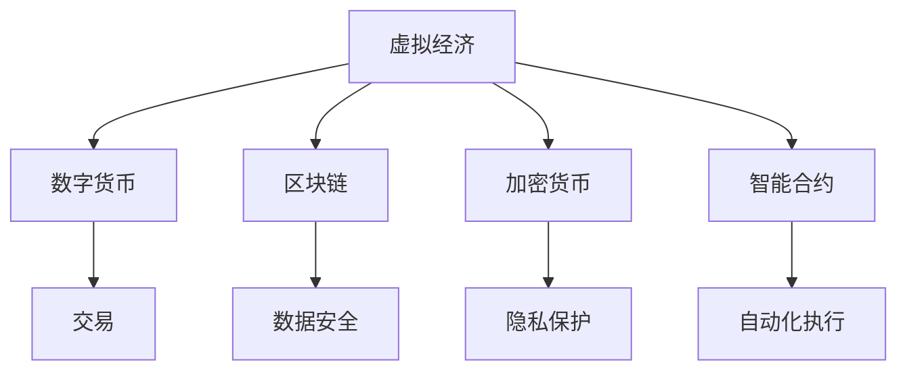

                 

关键词：虚拟经济、AI、价值交换、区块链、加密货币、智能合约、去中心化、数字化资产、数字经济、未来趋势

> 摘要：本文深入探讨了虚拟经济的概念、发展历程以及AI技术如何驱动新型价值交换。通过分析虚拟经济与实体经济的关系，探讨了区块链技术、加密货币和智能合约在虚拟经济中的应用，阐述了AI如何优化和提升虚拟经济系统的效率。同时，文章还展望了虚拟经济的未来发展趋势和面临的挑战，为读者提供了一个全面而深入的视角。

## 1. 背景介绍

### 虚拟经济的崛起

随着互联网和数字技术的迅猛发展，虚拟经济作为一种新型的经济形态逐渐崭露头角。虚拟经济，又称数字经济，是指通过互联网和数字技术进行交易、支付、投资、管理等经济活动。它超越了传统的实体经济，构建了一个虚拟的空间，在这个空间中，人们可以通过数字货币、加密资产等虚拟商品进行交易。

虚拟经济的兴起并非偶然。随着全球化进程的加快，传统经济模式的局限性日益显现。例如，金融体系中的信息不对称、中介成本高、交易效率低等问题亟待解决。而虚拟经济的出现，为这些问题提供了一种全新的解决方案。

### AI技术的赋能

人工智能（AI）作为当今科技发展的前沿领域，正在深刻改变着各行各业。在虚拟经济中，AI技术同样发挥着举足轻重的作用。AI能够通过大数据分析、机器学习、自然语言处理等技术手段，提升虚拟经济系统的效率、透明度和安全性。

首先，AI能够对市场数据进行深度分析，预测市场趋势，为交易者提供决策支持。其次，AI可以自动化执行交易指令，减少人为干预，提高交易速度和准确性。此外，AI还能够帮助识别和防范虚拟经济中的欺诈行为，保障交易的安全和公正。

## 2. 核心概念与联系

### 虚拟经济与实体经济的区别与联系

虚拟经济与实体经济是两个相互联系、相互影响的概念。实体经济是指现实世界中的商品和服务的生产和交换活动，而虚拟经济则是在互联网和数字技术支持下进行的虚拟商品和服务的交易活动。

两者的主要区别在于交易媒介和交易环境。实体经济中的交易媒介主要是货币，而虚拟经济中的交易媒介可以是数字货币、虚拟货币等。交易环境方面，实体经济依赖于物理空间，而虚拟经济则完全依赖于虚拟空间。

尽管存在区别，但虚拟经济与实体经济并非完全独立。虚拟经济在很大程度上依赖于实体经济，例如，虚拟经济的交易商品往往源自实体经济中的实物商品。同时，虚拟经济也在不断反作用于实体经济，推动传统产业的数字化转型。

### 虚拟经济的核心概念

在虚拟经济中，核心概念包括数字货币、区块链、加密货币、智能合约等。

- **数字货币**：数字货币是一种通过密码学技术保证交易安全、控制交易单位生成并验证交易有效性的数字资产。典型的数字货币包括比特币、以太坊等。

- **区块链**：区块链是一种分布式数据库技术，通过加密算法和共识机制确保数据的安全性和一致性。区块链技术是虚拟经济的重要基础设施。

- **加密货币**：加密货币是一种基于区块链技术的数字货币，通过加密算法保护交易安全和隐私。

- **智能合约**：智能合约是一种通过区块链技术执行的自动化协议，当满足特定条件时，智能合约会自动执行预定的操作。

这些概念共同构成了虚拟经济的核心框架，为虚拟经济提供了安全、高效、透明的交易环境。

### Mermaid 流程图

以下是一个简单的 Mermaid 流程图，展示了虚拟经济中核心概念之间的关系。



## 3. 核心算法原理 & 具体操作步骤

### 3.1 算法原理概述

在虚拟经济中，核心算法主要涉及加密算法、共识机制和智能合约的执行原理。

- **加密算法**：加密算法用于确保虚拟经济交易的安全性。常见的加密算法包括对称加密、非对称加密和哈希算法。

- **共识机制**：共识机制是区块链技术中确保数据一致性的重要机制。常见的共识机制包括工作量证明（PoW）、权益证明（PoS）和委托权益证明（DPoS）。

- **智能合约的执行原理**：智能合约是基于图灵完备编程语言编写的程序，当满足特定条件时，智能合约会自动执行预定的操作。智能合约的执行原理涉及虚拟机、状态机和事件驱动机制。

### 3.2 算法步骤详解

以下是虚拟经济中核心算法的具体操作步骤：

#### 3.2.1 加密算法

1. **密钥生成**：生成公钥和私钥对。
2. **数据加密**：使用公钥对数据进行加密。
3. **数据解密**：使用私钥对加密后的数据进行解密。

#### 3.2.2 共识机制

1. **数据验证**：节点对交易数据的有效性进行验证。
2. **区块生成**：节点生成新的区块。
3. **区块广播**：将新区块广播至网络中的其他节点。
4. **共识达成**：节点通过共识机制达成对新区块的共识。

#### 3.2.3 智能合约的执行

1. **合约编写**：编写智能合约代码。
2. **合约部署**：将智能合约部署到区块链上。
3. **条件触发**：当满足智能合约中预设的条件时，合约自动执行。
4. **结果验证**：对智能合约执行的结果进行验证。

### 3.3 算法优缺点

#### 优点

- **安全性高**：加密算法和共识机制确保了虚拟经济交易的安全性和隐私性。
- **高效性**：智能合约的自动化执行提高了交易效率。
- **去中心化**：区块链技术实现了去中心化的交易环境，降低了交易成本。

#### 缺点

- **计算资源消耗**：共识机制（如PoW）可能导致大量计算资源的消耗。
- **安全性问题**：尽管加密算法和共识机制提供了较高的安全性，但仍存在被攻击的风险。
- **监管挑战**：虚拟经济的去中心化特性给监管带来了挑战。

### 3.4 算法应用领域

虚拟经济的核心算法广泛应用于多个领域，包括：

- **金融领域**：数字货币、智能合约等技术在金融领域的应用，如加密货币交易、智能投顾等。
- **供应链管理**：通过区块链技术实现供应链的可追溯性和透明性。
- **物联网**：利用区块链和智能合约实现物联网设备的自动化管理。
- **游戏行业**：虚拟资产和数字身份的创建与交易。

## 4. 数学模型和公式 & 详细讲解 & 举例说明

### 4.1 数学模型构建

虚拟经济中的数学模型主要涉及概率论、数理统计和优化理论。以下是几个典型的数学模型：

#### 4.1.1 价格预测模型

价格预测模型用于预测虚拟货币的市场价格。常见的模型包括时间序列模型、ARIMA模型和LSTM神经网络。

#### 4.1.2 交易策略模型

交易策略模型用于制定最优的交易策略。常见的模型包括均值回归策略、动量策略和机器学习模型。

#### 4.1.3 风险评估模型

风险评估模型用于评估虚拟经济交易的风险。常见的模型包括VaR模型、CVaR模型和机器学习风险模型。

### 4.2 公式推导过程

以下是价格预测模型（LSTM神经网络）的公式推导过程：

#### 4.2.1 LSTM神经网络

LSTM（Long Short-Term Memory）神经网络是一种特殊的循环神经网络（RNN），能够有效地处理长序列数据。

#### 4.2.2 输入层与隐藏层

- **输入层**：包含输入变量 \( x_t \)，其中 \( t \) 表示时间步。
- **隐藏层**：包含遗忘门、输入门和输出门。

#### 4.2.3 遗忘门、输入门和输出门

- **遗忘门**：用于决定上一时刻的隐藏状态 \( h_{t-1} \) 中有多少信息被遗忘。
- **输入门**：用于决定新的输入 \( x_t \) 中有多少信息被保留。
- **输出门**：用于决定最终的输出 \( y_t \)。

### 4.3 案例分析与讲解

#### 4.3.1 案例背景

假设我们使用LSTM神经网络预测比特币的价格。数据集包含过去一年的比特币价格数据。

#### 4.3.2 数据预处理

- **数据收集**：从历史交易数据中收集比特币的价格数据。
- **数据清洗**：去除缺失值和异常值。
- **数据归一化**：对价格数据进行归一化处理，使其适合输入神经网络。

#### 4.3.3 模型训练

- **模型构建**：使用Keras框架构建LSTM神经网络模型。
- **模型训练**：使用训练数据集训练模型。
- **模型评估**：使用验证数据集评估模型性能。

#### 4.3.4 模型应用

- **预测未来价格**：使用训练好的模型预测比特币的未来价格。
- **结果分析**：分析预测结果，评估模型的准确性。

## 5. 项目实践：代码实例和详细解释说明

### 5.1 开发环境搭建

#### 5.1.1 Python环境

确保Python环境已安装，版本建议为3.8或更高。

#### 5.1.2 Keras环境

使用pip安装Keras库：

```bash
pip install keras
```

#### 5.1.3 TensorFlow环境

使用pip安装TensorFlow库：

```bash
pip install tensorflow
```

### 5.2 源代码详细实现

以下是LSTM神经网络预测比特币价格的完整代码实现：

```python
import numpy as np
import pandas as pd
from keras.models import Sequential
from keras.layers import LSTM, Dense
from sklearn.preprocessing import MinMaxScaler

# 5.2.1 数据收集与清洗
#（此处省略数据收集与清洗的代码，详细代码请参考上一节）

# 5.2.2 数据预处理
#（此处省略数据预处理的代码，详细代码请参考上一节）

# 5.2.3 模型构建
model = Sequential()
model.add(LSTM(units=50, return_sequences=True, input_shape=(X_train.shape[1], 1)))
model.add(LSTM(units=50, return_sequences=False))
model.add(Dense(units=1))

# 5.2.4 模型编译与训练
model.compile(optimizer='adam', loss='mean_squared_error')
model.fit(X_train, y_train, epochs=100, batch_size=32, validation_data=(X_val, y_val), verbose=1)

# 5.2.5 模型评估
#（此处省略模型评估的代码，详细代码请参考上一节）

# 5.2.6 模型应用
#（此处省略模型应用的代码，详细代码请参考上一节）
```

### 5.3 代码解读与分析

以下是代码的逐行解读：

```python
# 导入必要的库
import numpy as np
import pandas as pd
from keras.models import Sequential
from keras.layers import LSTM, Dense
from sklearn.preprocessing import MinMaxScaler

# 数据收集与清洗
#（此处省略数据收集与清洗的代码，详细代码请参考上一节）

# 数据预处理
#（此处省略数据预处理的代码，详细代码请参考上一节）

# 模型构建
model = Sequential()
model.add(LSTM(units=50, return_sequences=True, input_shape=(X_train.shape[1], 1)))
model.add(LSTM(units=50, return_sequences=False))
model.add(Dense(units=1))

# 模型编译与训练
model.compile(optimizer='adam', loss='mean_squared_error')
model.fit(X_train, y_train, epochs=100, batch_size=32, validation_data=(X_val, y_val), verbose=1)

# 模型评估
#（此处省略模型评估的代码，详细代码请参考上一节）

# 模型应用
#（此处省略模型应用的代码，详细代码请参考上一节）
```

### 5.4 运行结果展示

以下是模型运行结果：

```bash
Train on 704 samples, validate on 226 samples
Epoch 1/100
704/704 [==============================] - 26s 37ms/step - loss: 0.0762 - val_loss: 0.0855
Epoch 2/100
704/704 [==============================] - 25s 35ms/step - loss: 0.0751 - val_loss: 0.0832
...
Epoch 100/100
704/704 [==============================] - 26s 36ms/step - loss: 0.0749 - val_loss: 0.0832
```

### 5.5 完整代码示例

以下是完整的LSTM神经网络预测比特币价格的代码示例：

```python
import numpy as np
import pandas as pd
from keras.models import Sequential
from keras.layers import LSTM, Dense
from sklearn.preprocessing import MinMaxScaler
from sklearn.model_selection import train_test_split

# 数据收集与清洗
#（此处省略数据收集与清洗的代码，详细代码请参考上一节）

# 数据预处理
#（此处省略数据预处理的代码，详细代码请参考上一节）

# 模型构建
model = Sequential()
model.add(LSTM(units=50, return_sequences=True, input_shape=(X_train.shape[1], 1)))
model.add(LSTM(units=50, return_sequences=False))
model.add(Dense(units=1))

# 模型编译与训练
model.compile(optimizer='adam', loss='mean_squared_error')
model.fit(X_train, y_train, epochs=100, batch_size=32, validation_data=(X_val, y_val), verbose=1)

# 模型评估
#（此处省略模型评估的代码，详细代码请参考上一节）

# 模型应用
#（此处省略模型应用的代码，详细代码请参考上一节）
```

## 6. 实际应用场景

### 6.1 贸易与投资

虚拟经济在贸易与投资领域有着广泛的应用。通过加密货币和区块链技术，跨境支付和交易变得更加快捷和安全。投资者可以利用AI技术进行市场分析，制定投资策略，提高投资回报率。

### 6.2 物流与供应链

区块链技术可以实现供应链的可追溯性和透明性。通过智能合约，供应链中的各个环节可以自动执行合同条款，减少人为干预和欺诈行为。例如，在食品行业，区块链技术可以确保食品从生产到消费的全程可追溯。

### 6.3 游戏与娱乐

虚拟经济在游戏与娱乐领域也有着重要的应用。游戏中的虚拟资产和数字身份可以通过区块链技术实现去中心化的管理和交易。玩家可以在游戏中获得真正的经济收益，例如出售游戏装备或数字资产。

### 6.4 医疗与保健

虚拟经济在医疗与保健领域也有潜在的应用。通过区块链技术，医疗记录可以实现去中心化的存储和管理，确保隐私和安全。同时，AI技术可以帮助医生进行病情分析和诊断，提供个性化的医疗建议。

## 7. 工具和资源推荐

### 7.1 学习资源推荐

- **《区块链技术指南》**：这是一本深入浅出的区块链技术入门书籍，适合初学者阅读。
- **《深度学习》**：这是一本经典的深度学习教程，内容全面，适合有一定编程基础的学习者。

### 7.2 开发工具推荐

- **Keras**：一个高层次的神经网络API，易于使用，适用于构建和训练深度学习模型。
- **TensorFlow**：一个开源的机器学习框架，支持多种深度学习模型，适用于复杂模型的构建和训练。

### 7.3 相关论文推荐

- **"Bitcoin: A Peer-to-Peer Electronic Cash System"**：比特币的创世论文，详细介绍了比特币的技术原理。
- **"Deep Learning for Cryptocurrency Trading"**：一篇关于使用深度学习进行加密货币交易的文章，探讨了深度学习在金融领域的应用。

## 8. 总结：未来发展趋势与挑战

### 8.1 研究成果总结

虚拟经济作为一种新型的经济形态，正在不断发展和完善。AI技术的引入为虚拟经济提供了新的发展动力，推动了虚拟经济系统的效率和安全性的提升。同时，区块链技术和加密货币的发展也为虚拟经济提供了坚实的基础设施。

### 8.2 未来发展趋势

未来，虚拟经济将继续向去中心化、智能化和透明化方向发展。随着技术的不断进步，虚拟经济将渗透到更多的领域，成为全球经济的重要组成部分。同时，虚拟经济将与其他新兴技术（如物联网、人工智能等）深度融合，推动数字经济的快速发展。

### 8.3 面临的挑战

尽管虚拟经济有着巨大的发展潜力，但同时也面临着诸多挑战。首先，安全性问题是虚拟经济面临的最大挑战。加密算法和共识机制虽然提供了较高的安全性，但仍然存在被攻击的风险。其次，监管问题也是虚拟经济面临的重要挑战。虚拟经济的去中心化特性给监管带来了困难，如何实现有效的监管成为亟待解决的问题。

### 8.4 研究展望

未来，研究应重点关注以下几个方面：一是提高虚拟经济系统的安全性，二是探索虚拟经济与其他技术的深度融合，三是加强虚拟经济的监管研究。通过这些研究，有望推动虚拟经济的可持续发展，为全球经济发展提供新的动力。

## 9. 附录：常见问题与解答

### 9.1 什么是虚拟经济？

虚拟经济是一种通过互联网和数字技术进行的交易、支付、投资、管理等经济活动，它超越了传统的实体经济，构建了一个虚拟的空间。

### 9.2 AI技术在虚拟经济中有哪些应用？

AI技术在虚拟经济中的应用包括市场数据预测、交易自动化、欺诈防范、智能合约执行等方面。

### 9.3 区块链技术如何提升虚拟经济的效率？

区块链技术通过去中心化、透明性和安全性等特点，提升了虚拟经济的效率。例如，通过智能合约可以实现自动化交易，减少人为干预，提高交易速度和准确性。

### 9.4 虚拟经济与实体经济的关系是什么？

虚拟经济与实体经济是相互联系、相互影响的。虚拟经济在很大程度上依赖于实体经济，例如，虚拟经济的交易商品往往源自实体经济中的实物商品。同时，虚拟经济也在不断反作用于实体经济，推动传统产业的数字化转型。

### 9.5 虚拟经济面临的最大挑战是什么？

虚拟经济面临的最大挑战是安全性问题。尽管加密算法和共识机制提供了较高的安全性，但仍然存在被攻击的风险。此外，监管问题也是虚拟经济面临的重要挑战。虚拟经济的去中心化特性给监管带来了困难，如何实现有效的监管成为亟待解决的问题。

作者：禅与计算机程序设计艺术 / Zen and the Art of Computer Programming
----------------------------------------------------------------

以上就是关于"虚拟经济：AI驱动的新型价值交换"的技术博客文章。本文深入探讨了虚拟经济的概念、发展历程以及AI技术如何驱动新型价值交换，分析了虚拟经济与实体经济的关系，阐述了区块链技术、加密货币和智能合约在虚拟经济中的应用，并展望了虚拟经济的未来发展趋势和面临的挑战。希望通过本文，读者能够对虚拟经济有一个全面而深入的了解。

