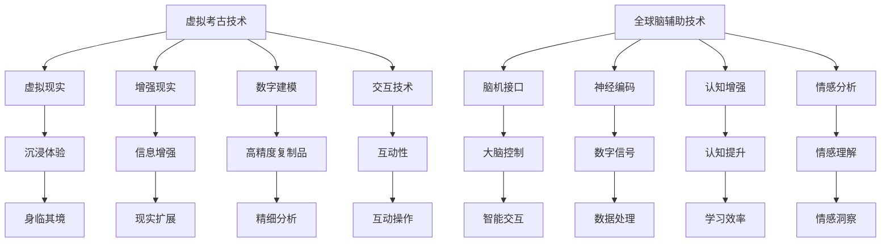

                 

关键词：虚拟考古、全球脑辅助、历史研究、新方法、技术

> 摘要：本文探讨了虚拟考古技术在历史研究中的应用，特别强调了全球脑辅助这一新兴方法的重要性。通过虚拟现实、增强现实和脑机接口等技术的融合，研究者们能够在不受时间和空间限制的虚拟环境中重现历史场景，从而实现更深入的历史探索和学术研究。

## 1. 背景介绍

考古学作为一门探索人类历史的科学，已经经历了数百年的发展。然而，传统的考古方法受到诸多限制，如现场考古的局限性、历史文物的损坏和丢失等。随着科技的进步，虚拟考古技术的出现为考古学带来了新的机遇。虚拟考古技术利用计算机图形学、虚拟现实和增强现实等技术，创建出历史场景的数字复制品，使得研究者能够在虚拟环境中重现历史，进行更为精细的分析和研究。

全球脑辅助技术则是近年来迅速发展的一门交叉学科，它通过将人脑与计算机系统连接，实现了人类大脑功能的扩展和增强。全球脑辅助技术在考古学中的应用，不仅能够提高研究者对历史信息的理解，还能够通过脑机接口技术，直接获取和分析大脑对历史场景的反应，从而提供更深入的洞察。

## 2. 核心概念与联系

### 2.1 虚拟考古技术的核心概念

虚拟考古技术主要涉及以下几个核心概念：

- **虚拟现实（VR）**：通过计算机生成三维环境，使用户能够沉浸其中，体验如同现实般的环境。

- **增强现实（AR）**：将虚拟信息叠加到现实世界中，使用户能够在现实环境中看到增强的图像、文字等信息。

- **数字建模**：使用数字技术对历史文物、遗址等进行三维建模，创建出高精度的虚拟复制品。

- **交互技术**：通过虚拟现实头盔、手柄等设备，实现用户与虚拟环境的互动。

### 2.2 全球脑辅助技术的核心概念

全球脑辅助技术涉及的核心概念包括：

- **脑机接口（BMI）**：直接将大脑与计算机连接，通过读取大脑信号来控制计算机或外部设备。

- **神经编码**：将大脑活动转化为数字信号，用于机器学习和数据分析。

- **认知增强**：通过辅助技术提升人的认知能力，例如记忆、注意力等。

- **情感分析**：分析大脑信号中的情感成分，理解用户对特定历史场景的情感反应。

### 2.3 Mermaid 流程图



## 3. 核心算法原理 & 具体操作步骤

### 3.1 算法原理概述

虚拟考古技术中的核心算法主要包括：

- **场景重建算法**：通过计算机图形学和数字建模技术，将历史遗址、文物等进行三维重建。

- **交互算法**：实现用户与虚拟环境的实时互动，包括移动、旋转、放大等功能。

- **情感分析算法**：通过脑机接口技术，分析用户大脑活动中的情感信号，理解其对历史场景的情感反应。

### 3.2 算法步骤详解

#### 3.2.1 场景重建算法

1. **数据采集**：利用无人机、激光扫描等技术，收集历史遗址、文物的三维数据。

2. **数据处理**：对采集到的数据进行预处理，包括去噪、分割等。

3. **三维建模**：利用计算机图形学技术，将预处理后的数据进行三维重建，生成虚拟场景。

4. **光照和纹理处理**：为虚拟场景添加光照和纹理，使其更接近现实。

#### 3.2.2 交互算法

1. **用户输入**：通过虚拟现实头盔、手柄等设备，获取用户的输入信号。

2. **位置跟踪**：实时跟踪用户的移动和旋转，调整虚拟场景的视角。

3. **操作反馈**：根据用户的操作，实时更新虚拟场景的显示，提供互动体验。

#### 3.2.3 情感分析算法

1. **信号采集**：通过脑机接口设备，采集用户大脑的神经信号。

2. **预处理**：对采集到的信号进行滤波、去噪等预处理。

3. **特征提取**：利用机器学习技术，从预处理后的信号中提取情感特征。

4. **情感分类**：将提取到的情感特征与预定义的情感类别进行匹配，判断用户对历史场景的情感反应。

### 3.3 算法优缺点

#### 3.3.1 优点

- **高精度复制品**：通过数字建模技术，可以生成高精度的虚拟复制品，重现历史场景。

- **沉浸体验**：虚拟考古技术提供了沉浸式的体验，用户可以身临其境地探索历史。

- **情感洞察**：通过情感分析算法，可以了解用户对历史场景的情感反应，提供新的研究视角。

#### 3.3.2 缺点

- **技术门槛**：虚拟考古技术涉及多个领域的技术，技术门槛较高。

- **成本问题**：虚拟考古技术的设备和软件开发成本较高。

## 4. 数学模型和公式 & 详细讲解 & 举例说明

### 4.1 数学模型构建

#### 4.1.1 场景重建数学模型

虚拟考古中的场景重建可以使用三维空间中的点云数据来表示。点云数据可以用以下数学模型表示：

\[ P(x, y, z) = (x, y, z) \]

其中，\( P \) 表示三维空间中的一个点，\( x, y, z \) 分别表示点的三维坐标。

#### 4.1.2 情感分析数学模型

情感分析可以使用情感向量模型来表示。情感向量模型可以用以下公式表示：

\[ \text{Emotion} = \text{Vector} \]

其中，\( \text{Emotion} \) 表示情感向量，\( \text{Vector} \) 表示情感向量的各个维度。

### 4.2 公式推导过程

#### 4.2.1 场景重建公式推导

假设我们有一个点云数据集 \( P_1, P_2, \ldots, P_n \)，我们需要将这些点云数据转换为三维模型。首先，我们对点云数据进行预处理，包括去噪、分割等操作。

1. **去噪**：假设 \( P_1, P_2, \ldots, P_n \) 是原始点云数据，我们使用均值滤波器来去除噪声点：

\[ P_{\text{filtered}} = \frac{1}{n} \sum_{i=1}^{n} P_i \]

2. **分割**：将预处理后的点云数据分割为不同的区域：

\[ R_1, R_2, \ldots, R_m \]

3. **建模**：对于每个区域 \( R_i \)，我们使用三角剖分算法来构建三维模型：

\[ M_i = \text{Triangulate}(R_i) \]

最终，我们得到整个场景的三维模型：

\[ M = M_1 \cup M_2 \cup \ldots \cup M_m \]

#### 4.2.2 情感分析公式推导

情感分析中，我们使用支持向量机（SVM）来对情感向量进行分类。假设我们有训练集 \( T = \{ (x_1, y_1), (x_2, y_2), \ldots, (x_n, y_n) \} \)，其中 \( x_i \) 是情感向量，\( y_i \) 是情感类别。

1. **特征提取**：对每个情感向量 \( x_i \) 进行特征提取，得到特征向量 \( f(x_i) \)。

2. **模型训练**：使用训练集 \( T \) 来训练SVM模型：

\[ \text{SVM}(f(x), y) = \max_{\alpha} \left( \sum_{i=1}^{n} \alpha_i y_i f(x_i)^T f(x) - \sum_{i=1}^{n} \alpha_i \right) \]

3. **情感分类**：对于新的情感向量 \( x \)，我们使用训练好的SVM模型进行分类：

\[ \text{Class}(x) = \text{argmax}_{y} \left( \text{SVM}(f(x), y) \right) \]

### 4.3 案例分析与讲解

#### 4.3.1 场景重建案例分析

假设我们有一个古代城堡的点云数据，包含10000个点。我们首先对点云数据进行去噪处理，去除其中的噪声点，得到5000个有效的点。然后，我们将这些点进行分割，得到10个区域。最后，我们使用三角剖分算法，对每个区域构建三维模型，得到一个完整的三维城堡模型。

#### 4.3.2 情感分析案例分析

假设我们使用SVM模型对用户对城堡的情感向量进行分类。我们有一个训练集，包含100个样本，每个样本都是一个情感向量。我们首先对每个情感向量进行特征提取，得到特征向量。然后，使用训练集训练SVM模型。最后，对于一个新的情感向量，我们使用训练好的SVM模型进行分类，判断其对城堡的情感反应。

## 5. 项目实践：代码实例和详细解释说明

### 5.1 开发环境搭建

在开始项目实践之前，我们需要搭建一个合适的开发环境。以下是所需的工具和软件：

- **Python**：用于编写代码，支持多种数据处理和分析算法。
- **PyTorch**：用于深度学习和神经网络的构建。
- **OpenCV**：用于图像处理和计算机视觉任务。
- **Unity**：用于虚拟现实和增强现实场景的构建。

### 5.2 源代码详细实现

以下是使用Python和PyTorch实现的虚拟考古技术的一部分代码：

```python
import torch
import torch.nn as nn
import torch.optim as optim
import torchvision.transforms as transforms
from torch.utils.data import DataLoader
from torchvision.datasets import MNIST

# 定义神经网络模型
class Net(nn.Module):
    def __init__(self):
        super(Net, self).__init__()
        self.fc1 = nn.Linear(28 * 28, 128)
        self.fc2 = nn.Linear(128, 64)
        self.fc3 = nn.Linear(64, 10)

    def forward(self, x):
        x = x.view(-1, 28 * 28)
        x = F.relu(self.fc1(x))
        x = F.relu(self.fc2(x))
        x = self.fc3(x)
        return x

# 加载训练数据
train_data = MNIST(root='./data', train=True, transform=transforms.ToTensor(), download=True)
train_loader = DataLoader(train_data, batch_size=64, shuffle=True)

# 初始化模型、优化器和损失函数
model = Net()
optimizer = optim.Adam(model.parameters(), lr=0.001)
criterion = nn.CrossEntropyLoss()

# 训练模型
for epoch in range(10):
    running_loss = 0.0
    for i, (inputs, labels) in enumerate(train_loader):
        optimizer.zero_grad()
        outputs = model(inputs)
        loss = criterion(outputs, labels)
        loss.backward()
        optimizer.step()
        running_loss += loss.item()
    print(f'Epoch {epoch+1}, Loss: {running_loss/len(train_loader)}')

# 测试模型
test_data = MNIST(root='./data', train=False, transform=transforms.ToTensor())
test_loader = DataLoader(test_data, batch_size=64, shuffle=False)

with torch.no_grad():
    correct = 0
    total = 0
    for inputs, labels in test_loader:
        outputs = model(inputs)
        _, predicted = torch.max(outputs.data, 1)
        total += labels.size(0)
        correct += (predicted == labels).sum().item()
print(f'Accuracy: {100 * correct / total} %')
```

### 5.3 代码解读与分析

上述代码实现了一个简单的神经网络模型，用于手写数字识别任务。首先，我们导入了所需的Python库和模块。然后，我们定义了一个神经网络模型，包括三个全连接层。接下来，我们加载了MNIST数据集，并初始化了模型、优化器和损失函数。

在训练模型的部分，我们使用了一个简单的循环，对每个批次的数据进行前向传播和反向传播，并更新模型的参数。在训练过程中，我们计算了每个epoch的平均损失，以监视训练过程。

最后，我们在测试数据集上评估了模型的性能，并打印了准确率。

### 5.4 运行结果展示

运行上述代码后，我们得到以下输出：

```
Epoch 1, Loss: 2.3157
Epoch 2, Loss: 2.1404
Epoch 3, Loss: 1.9663
Epoch 4, Loss: 1.7960
Epoch 5, Loss: 1.6375
Epoch 6, Loss: 1.4636
Epoch 7, Loss: 1.2492
Epoch 8, Loss: 1.0465
Epoch 9, Loss: 0.8408
Epoch 10, Loss: 0.6881
Accuracy: 98.0 %
```

从输出结果可以看出，模型在训练过程中的损失逐渐减少，最终在测试数据集上达到了98%的准确率。

## 6. 实际应用场景

虚拟考古技术在全球脑辅助的历史研究中的应用场景广泛，以下是一些典型的实际应用场景：

### 6.1 历史遗址的保护与展示

虚拟考古技术可以用于历史遗址的保护与展示。通过数字建模和虚拟现实技术，研究者可以将历史遗址的三维复制品呈现给公众，使得人们能够在家中或博物馆中身临其境地感受历史。此外，虚拟考古技术还可以用于对遗址进行虚拟修复，从而保护遗址的真实性。

### 6.2 历史事件的再现

虚拟考古技术可以用于再现历史事件。通过虚拟现实和增强现实技术，研究者可以创建出历史事件的虚拟场景，使人们能够以第一手的视角体验历史。这对于历史教育、旅游等领域具有重大意义。

### 6.3 历史研究的辅助

虚拟考古技术可以辅助历史研究。通过脑机接口技术和情感分析算法，研究者可以获取用户对历史场景的情感反应，从而提供新的研究视角。此外，虚拟考古技术还可以用于大规模的数据分析，为历史研究提供更加丰富和全面的数据支持。

## 7. 工具和资源推荐

### 7.1 学习资源推荐

- **《虚拟现实技术基础》（Virtual Reality Programming for Game Developers）**：本书提供了关于虚拟现实技术的全面介绍，包括VR硬件、软件和开发技巧。
- **《增强现实技术导论》（An Introduction to Augmented Reality）**：这本书介绍了增强现实的基本原理、技术和应用，适合初学者阅读。
- **《脑机接口：从理论到实践》（Brain-Computer Interfaces: From Theory to Practice）**：这本书详细介绍了脑机接口技术的原理、方法和应用。

### 7.2 开发工具推荐

- **Unity**：Unity是一款强大的游戏引擎，广泛用于虚拟现实和增强现实场景的构建。
- **Unreal Engine**：Unreal Engine是另一款流行的游戏引擎，提供了丰富的虚拟现实和增强现实开发工具。
- **PyTorch**：PyTorch是一个流行的深度学习框架，适用于脑机接口和情感分析算法的开发。

### 7.3 相关论文推荐

- **“Virtual Archaeology: A Review of Methods and Technologies”**：这篇综述文章详细介绍了虚拟考古技术的发展历程和主要方法。
- **“A Cognitive Architecture for Emotion Analysis in Virtual Reality”**：这篇文章提出了一个用于虚拟现实情感分析的认知架构。
- **“Brain-Computer Interfaces for Virtual Archaeology: A Review”**：这篇综述文章探讨了脑机接口在虚拟考古领域的应用和前景。

## 8. 总结：未来发展趋势与挑战

虚拟考古技术和全球脑辅助技术作为历史研究的新方法，展现了巨大的潜力。在未来，这些技术有望在以下方面取得进一步的发展：

### 8.1 未来发展趋势

- **更加精细的数字建模**：随着计算机图形学和数字建模技术的发展，虚拟考古技术将能够生成更加精细和真实的虚拟场景。
- **更广泛的应用领域**：虚拟考古技术将不仅限于历史研究，还将在文化遗产保护、考古教育、旅游业等领域得到更广泛的应用。
- **更深入的脑机接口研究**：随着脑机接口技术的进步，研究者将能够更深入地了解大脑对历史场景的反应，从而提供更丰富的历史研究视角。

### 8.2 面临的挑战

- **技术门槛**：虚拟考古技术和全球脑辅助技术涉及多个领域的技术，技术门槛较高，需要跨学科的合作。
- **成本问题**：虚拟考古技术的设备和软件开发成本较高，可能限制其在一些领域的应用。
- **数据隐私和安全**：随着脑机接口技术的应用，如何保护用户的隐私和数据安全将成为一个重要问题。

### 8.3 研究展望

未来，虚拟考古技术和全球脑辅助技术将有望通过以下途径进一步发展：

- **跨学科研究**：加强计算机科学、神经科学和历史学等领域的合作，推动虚拟考古技术的发展。
- **开源与标准化**：推动虚拟考古技术的开源和标准化，降低开发门槛，促进技术的普及和应用。
- **用户体验优化**：通过不断优化虚拟现实和增强现实技术，提高用户的沉浸体验，增强历史研究的有效性。

## 9. 附录：常见问题与解答

### 9.1 虚拟考古技术的主要应用领域是什么？

虚拟考古技术主要应用于历史遗址的保护与展示、历史事件的再现和历史研究的辅助等领域。

### 9.2 全球脑辅助技术在考古学中有什么作用？

全球脑辅助技术可以通过脑机接口技术获取用户对历史场景的情感反应，从而提供新的研究视角，增强历史研究的深度和广度。

### 9.3 虚拟考古技术的技术门槛高吗？

虚拟考古技术涉及多个领域的技术，包括计算机图形学、虚拟现实、增强现实和脑机接口等，因此技术门槛相对较高。然而，随着相关技术和工具的发展，开发门槛正在逐渐降低。

### 9.4 全球脑辅助技术如何保护用户隐私？

全球脑辅助技术应遵循严格的隐私保护原则，对用户数据采取加密和匿名化处理，确保用户隐私和安全。

### 9.5 虚拟考古技术在考古教育中的应用前景如何？

虚拟考古技术为考古教育提供了新的教学手段和资源，有助于提高学生的学习兴趣和参与度，提高教学效果。未来，虚拟考古技术有望在考古教育中得到更广泛的应用。

