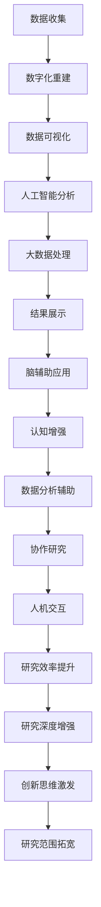

                 

### 关键词 Keywords

- 虚拟考古
- 脑辅助技术
- 历史研究
- 数据可视化
- 人工智能

### 摘要 Abstract

本文旨在探讨虚拟考古技术在全球历史研究中的应用及其所带来的脑辅助效应。通过结合先进的人工智能算法和数据可视化技术，虚拟考古技术为考古学家和历史研究者提供了全新的研究工具和方法。本文将详细介绍虚拟考古技术的基本概念、核心算法原理、数学模型构建、应用领域、项目实践，并探讨其在实际应用中的前景和挑战。文章最后还将对相关工具和资源进行推荐，并对未来发展趋势和研究展望进行总结。

## 1. 背景介绍

虚拟考古技术是一种新兴的考古学研究方法，它利用虚拟现实、增强现实、人工智能和大数据分析等现代技术手段，对历史遗址、文物和考古资料进行数字化重建、分析和解释。随着信息技术的飞速发展，虚拟考古技术逐渐成为考古学研究的重要工具，为历史研究带来了革命性的变化。

在过去，考古学家和历史研究者主要依靠实地考察、文献考证和人工分析等方法进行历史研究。然而，这种方法往往受限于时间和空间，难以全面、深入地揭示历史真相。虚拟考古技术的出现，不仅提高了研究的效率和精度，还突破了传统研究的局限，使得历史研究进入了一个全新的时代。

本文将重点探讨虚拟考古技术在历史研究中的应用，以及如何通过脑辅助技术来提升研究者的认知能力和工作效率。文章结构如下：

- **第1章**：背景介绍，概述虚拟考古技术的概念、发展历程及其在历史研究中的重要性。
- **第2章**：核心概念与联系，介绍虚拟考古技术的核心原理、算法和架构。
- **第3章**：核心算法原理 & 具体操作步骤，详细解释虚拟考古技术的基本算法和操作步骤。
- **第4章**：数学模型和公式 & 详细讲解 & 举例说明，探讨虚拟考古技术中的数学模型和公式，并通过实例进行说明。
- **第5章**：项目实践：代码实例和详细解释说明，提供具体的虚拟考古项目实例，并对其进行详细解释和分析。
- **第6章**：实际应用场景，介绍虚拟考古技术在历史研究中的实际应用案例。
- **第7章**：工具和资源推荐，推荐相关的学习资源、开发工具和学术论文。
- **第8章**：总结：未来发展趋势与挑战，总结研究成果，探讨未来发展趋势和面临的挑战。
- **第9章**：附录：常见问题与解答，回答读者可能遇到的问题。

通过本文的探讨，希望能够为读者提供对虚拟考古技术及其在历史研究中的应用的全面了解，并激发更多研究者在这一领域进行深入探索和研究。

## 2. 核心概念与联系

### 虚拟考古技术的基本概念

虚拟考古技术是指通过现代科技手段对考古遗址、文物和历史资料进行数字化重建和分析的技术。它包括以下几个核心概念：

1. **数字化重建**：通过高精度的扫描和三维建模技术，将实际的考古遗址、文物和考古资料转化为数字化的三维模型。
2. **数据可视化**：利用数据可视化技术，将数字化的考古数据转化为图表、图像和动画等形式，使得研究者可以直观地分析和理解考古信息。
3. **人工智能算法**：利用人工智能算法，对数字化数据进行深度学习和模式识别，从而发现隐藏在数据中的规律和关联。
4. **大数据分析**：通过大数据分析技术，对海量考古数据进行处理和分析，从中提取有价值的信息和洞见。

### 脑辅助技术的应用

脑辅助技术是指通过科技手段辅助人类大脑进行信息处理、记忆、学习和思考的技术。在虚拟考古技术中，脑辅助技术可以发挥以下作用：

1. **认知增强**：通过虚拟现实和增强现实技术，提供沉浸式的学习体验，增强研究者的认知能力和记忆效果。
2. **数据分析辅助**：利用人工智能算法，对复杂的数据集进行分析和处理，减轻研究者的工作负担，提高数据分析的效率和准确性。
3. **协作研究**：通过远程协作平台和虚拟会议室，实现全球范围内的研究者之间的实时沟通和合作，促进跨学科和跨地域的研究。
4. **人机交互**：利用自然语言处理、手势识别和脑机接口等技术，实现人与虚拟环境的自然交互，提升研究者的操作效率和体验。

### 虚拟考古技术与脑辅助技术的结合

虚拟考古技术与脑辅助技术的结合，可以带来以下几个方面的优势：

1. **提高研究效率**：通过脑辅助技术，研究者可以更快速地获取和处理大量考古数据，减少人工分析的耗时和错误。
2. **增强研究深度**：虚拟考古技术可以提供更加精细和直观的考古数据，使得研究者能够从多个角度深入分析和理解考古信息。
3. **促进创新思维**：脑辅助技术提供的沉浸式体验和交互式工具，可以激发研究者的创新思维，推动考古学研究的突破。
4. **拓宽研究范围**：虚拟考古技术使得考古研究不再受限于实地考察，可以远程研究和分析全球范围内的考古遗址和文物。

### Mermaid 流程图

下面是一个简单的 Mermaid 流程图，展示了虚拟考古技术与脑辅助技术的结合流程：



通过这个流程图，我们可以清晰地看到虚拟考古技术与脑辅助技术的结合如何通过各个环节的相互作用，实现考古研究的全面升级和优化。

## 3. 核心算法原理 & 具体操作步骤

### 3.1 算法原理概述

虚拟考古技术的核心算法主要包括三维建模、数据可视化、人工智能分析和大数据处理等几个方面。下面将分别介绍这些算法的基本原理。

#### 3.1.1 三维建模

三维建模技术是虚拟考古技术的基石。它利用激光扫描、摄影测量和计算机图形学等技术，将实际的考古遗址、文物和考古资料转化为数字化的三维模型。三维建模的算法主要包括：

1. **激光扫描**：通过激光发射器对目标物体进行扫描，获取物体表面的三维坐标点。
2. **点云处理**：将激光扫描得到的点云数据进行处理，去除噪声和冗余信息，生成高质量的三维模型。
3. **表面重建**：利用点云数据生成物体的表面模型，通过表面重建算法将点云数据转化为三角面片或曲面。

#### 3.1.2 数据可视化

数据可视化技术是将数字化的考古数据转化为图表、图像和动画等形式，使得研究者可以直观地分析和理解考古信息。数据可视化的算法主要包括：

1. **图像渲染**：通过计算机图形学技术，将三维模型渲染成逼真的图像或动画。
2. **数据映射**：将考古数据（如温度、湿度、土壤成分等）映射到图像或三维模型上，以颜色、纹理或标签等形式进行表示。
3. **交互式可视化**：通过用户交互技术，实现数据可视化的动态更新和实时交互，提升研究者的分析体验。

#### 3.1.3 人工智能分析

人工智能分析技术是虚拟考古技术的重要补充，它利用机器学习和深度学习算法，对大量的考古数据进行分析和模式识别，从而发现隐藏在数据中的规律和关联。人工智能分析的算法主要包括：

1. **特征提取**：从考古数据中提取具有代表性的特征，如形状、纹理、颜色等。
2. **分类与聚类**：利用分类和聚类算法，对考古数据进行分析，识别出不同类型和模式的考古现象。
3. **关联分析**：通过关联分析算法，发现考古数据之间的关联关系，揭示历史事件和现象之间的联系。

#### 3.1.4 大数据处理

大数据处理技术是对海量考古数据进行处理和分析的技术，它利用分布式计算、并行处理和大数据存储等技术，实现高效的数据处理和分析。大数据处理的算法主要包括：

1. **分布式计算**：利用分布式计算技术，将大数据集分解为多个小数据集，同时在多个计算节点上并行处理，提高数据处理效率。
2. **并行处理**：利用并行处理技术，对大数据集进行并行分析和计算，减少计算时间。
3. **数据存储与管理**：利用大数据存储技术，高效地存储和管理海量考古数据，为后续分析提供数据支持。

### 3.2 算法步骤详解

虚拟考古技术的具体操作步骤可以分为以下几个阶段：

#### 3.2.1 数据收集

数据收集是虚拟考古技术的第一步，主要包括以下几个方面：

1. **实地考察**：通过实地考察，获取考古遗址、文物和考古资料的照片、视频和文字描述等信息。
2. **数字化采集**：利用激光扫描仪、摄影测量仪等设备，对考古遗址和文物进行高精度的数字化采集。
3. **文献资料收集**：收集与考古遗址、文物相关的历史文献、考古报告和研究论文等资料。

#### 3.2.2 数字化重建

数字化重建是将收集到的数据转化为数字化的三维模型的过程，主要包括以下几个步骤：

1. **激光扫描数据处理**：对激光扫描得到的点云数据进行处理，去除噪声和冗余信息，生成高质量的三维模型。
2. **点云处理**：利用点云处理算法，对点云数据进行平滑处理、降噪处理和三角化处理，生成网格化的三维模型。
3. **表面重建**：利用表面重建算法，将点云数据转化为三角面片或曲面，生成完整的三维模型。

#### 3.2.3 数据可视化

数据可视化是将数字化的考古数据转化为图表、图像和动画等形式，以便研究者进行直观分析和理解。数据可视化的步骤主要包括：

1. **图像渲染**：利用计算机图形学技术，将三维模型渲染成逼真的图像或动画。
2. **数据映射**：将考古数据（如温度、湿度、土壤成分等）映射到图像或三维模型上，以颜色、纹理或标签等形式进行表示。
3. **交互式可视化**：通过用户交互技术，实现数据可视化的动态更新和实时交互，提升研究者的分析体验。

#### 3.2.4 人工智能分析

人工智能分析是对数字化的考古数据进行深度分析和模式识别，以发现隐藏在数据中的规律和关联。人工智能分析的步骤主要包括：

1. **特征提取**：从考古数据中提取具有代表性的特征，如形状、纹理、颜色等。
2. **分类与聚类**：利用分类和聚类算法，对考古数据进行分析，识别出不同类型和模式的考古现象。
3. **关联分析**：通过关联分析算法，发现考古数据之间的关联关系，揭示历史事件和现象之间的联系。

#### 3.2.5 大数据处理

大数据处理是对海量考古数据进行处理和分析的过程，以提取有价值的信息和洞见。大数据处理的步骤主要包括：

1. **分布式计算**：利用分布式计算技术，将大数据集分解为多个小数据集，同时在多个计算节点上并行处理，提高数据处理效率。
2. **并行处理**：利用并行处理技术，对大数据集进行并行分析和计算，减少计算时间。
3. **数据存储与管理**：利用大数据存储技术，高效地存储和管理海量考古数据，为后续分析提供数据支持。

### 3.3 算法优缺点

虚拟考古技术的核心算法在提升考古研究效率和深度方面具有显著优势，但也存在一些局限性：

#### 3.3.1 优点

1. **高效性**：虚拟考古技术通过自动化和智能化的数据处理和分析，大大提高了研究效率和准确性。
2. **全面性**：虚拟考古技术可以处理和分析大量的考古数据，提供全面的研究视角。
3. **直观性**：数据可视化技术使得研究者可以直观地理解和分析考古数据，提升研究效果。

#### 3.3.2 缺点

1. **数据处理难度**：虚拟考古技术需要处理大量的原始数据，数据预处理和清洗工作繁重。
2. **计算资源消耗**：核心算法（如人工智能分析、大数据处理）需要大量的计算资源，对硬件设施要求较高。
3. **数据隐私问题**：虚拟考古技术可能会涉及个人隐私和敏感数据，需要严格保护用户数据。

### 3.4 算法应用领域

虚拟考古技术的核心算法在多个领域具有广泛应用：

1. **考古学**：通过虚拟考古技术，考古学家可以远程研究和分析全球范围内的考古遗址和文物，提高研究效率和深度。
2. **历史学**：虚拟考古技术为历史学家提供了新的研究工具和方法，可以更全面、深入地理解历史事件和现象。
3. **文物保护**：虚拟考古技术可以帮助文物保护专家对文物进行数字化保存和分析，为文物保护提供科学依据。
4. **城市规划**：虚拟考古技术可以用于城市规划和历史文化遗产保护，帮助设计师和规划师更好地理解和利用历史文化遗产。
5. **教育与宣传**：虚拟考古技术可以用于教育和公众宣传，让更多人了解和关注考古学和历史研究。

## 4. 数学模型和公式 & 详细讲解 & 举例说明

### 4.1 数学模型构建

在虚拟考古技术中，数学模型和公式是核心算法的基础。以下是几个关键的数学模型及其构建方法。

#### 4.1.1 三维重建中的三角剖分

三维重建中的三角剖分是将点云数据转化为网格化的三维模型的关键步骤。三角剖分的数学模型可以用以下公式表示：

\[ T(P_1, P_2, P_3) = \left\{ \begin{array}{ll}
P_1, & \text{if } P_1 = P_2 = P_3 \\
\text{the triangle spanned by } P_1, P_2, \text{ and } P_3, & \text{otherwise}
\end{array} \right. \]

其中，\( P_1, P_2, P_3 \)是点云数据中的三个顶点。

#### 4.1.2 数据可视化中的颜色映射

数据可视化中的颜色映射是将考古数据（如温度、湿度、土壤成分等）映射到颜色空间的关键步骤。颜色映射的数学模型可以用以下公式表示：

\[ C(x) = \left\{ \begin{array}{ll}
c_1, & \text{if } x \leq x_1 \\
c_2, & \text{if } x_1 < x \leq x_2 \\
\vdots \\
c_n, & \text{if } x_n < x
\end{array} \right. \]

其中，\( x \)是考古数据的值，\( c_1, c_2, ..., c_n \)是映射到颜色空间的颜色。

#### 4.1.3 人工智能分析中的神经网络模型

在人工智能分析中，神经网络模型是用于特征提取和模式识别的关键工具。一个简单的神经网络模型可以用以下公式表示：

\[ f(x) = \sigma(\sum_{i=1}^{n} w_i \cdot a_i) \]

其中，\( x \)是输入特征向量，\( w_i \)是权重，\( a_i \)是激活函数（如ReLU、Sigmoid等），\( \sigma \)是输出函数。

### 4.2 公式推导过程

以下是对虚拟考古技术中几个关键数学公式的推导过程。

#### 4.2.1 三角剖分的推导

假设点云数据中有三个点\( P_1(x_1, y_1, z_1) \)、\( P_2(x_2, y_2, z_2) \)和\( P_3(x_3, y_3, z_3) \)。要判断这三个点是否共线，可以使用向量叉乘的方法。如果向量\( \vec{P_1P_2} \)和\( \vec{P_1P_3} \)的叉乘为零，则这三个点共线。

\[ \vec{P_1P_2} = (x_2 - x_1, y_2 - y_1, z_2 - z_1) \]
\[ \vec{P_1P_3} = (x_3 - x_1, y_3 - y_1, z_3 - z_1) \]
\[ \vec{P_1P_2} \times \vec{P_1P_3} = \begin{vmatrix}
\mathbf{i} & \mathbf{j} & \mathbf{k} \\
x_2 - x_1 & y_2 - y_1 & z_2 - z_1 \\
x_3 - x_1 & y_3 - y_1 & z_3 - z_1 \\
\end{vmatrix} \]
\[ = ( (y_2 - y_1)(z_3 - z_1) - (z_2 - z_1)(y_3 - y_1) )\mathbf{i} - ( (x_2 - x_1)(z_3 - z_1) - (z_2 - z_1)(x_3 - x_1) )\mathbf{j} + ( (x_2 - x_1)(y_3 - y_1) - (y_2 - y_1)(x_3 - x_1) )\mathbf{k} \]

如果\( \vec{P_1P_2} \times \vec{P_1P_3} = (0, 0, 0) \)，则这三个点共线。

#### 4.2.2 颜色映射的推导

假设考古数据值\( x \)需要在颜色空间中映射为颜色\( C \)。我们可以使用线性插值的方法来计算颜色映射。

首先，确定颜色映射的区间和端点。假设颜色映射的区间为\( [x_1, x_n] \)，对应的颜色端点为\( c_1 \)和\( c_n \)。

然后，计算插值系数\( t \)：

\[ t = \frac{x - x_1}{x_n - x_1} \]

最后，计算颜色\( C \)：

\[ C = (1 - t) \cdot c_1 + t \cdot c_2 \]

其中，\( c_2 \)是在\( x \)的区间内对应的颜色。

#### 4.2.3 神经网络模型的推导

神经网络模型中的公式\( f(x) = \sigma(\sum_{i=1}^{n} w_i \cdot a_i) \)可以通过以下步骤推导。

首先，输入特征向量\( x \)经过权重矩阵\( W \)的线性变换：

\[ z = \sum_{i=1}^{n} w_i \cdot a_i \]

其中，\( a_i \)是输入特征向量中的第\( i \)个特征值。

然后，对线性变换的结果\( z \)应用激活函数\( \sigma \)：

\[ f(x) = \sigma(z) \]

常见的激活函数包括ReLU（最大值函数）和Sigmoid（S形函数）。以ReLU为例，激活函数的公式为：

\[ \sigma(z) = \max(0, z) \]

### 4.3 案例分析与讲解

下面通过一个具体的案例来讲解这些数学模型的应用。

#### 4.3.1 三维重建中的三角剖分

假设我们有一个点云数据集，包含三个点\( P_1(-1, -1, -1) \)、\( P_2(1, -1, 1) \)和\( P_3(1, 1, 1) \)。我们需要判断这三个点是否共线。

使用向量叉乘的方法，我们可以计算：

\[ \vec{P_1P_2} = (2, 0, 2) \]
\[ \vec{P_1P_3} = (2, 2, 2) \]
\[ \vec{P_1P_2} \times \vec{P_1P_3} = \begin{vmatrix}
\mathbf{i} & \mathbf{j} & \mathbf{k} \\
2 & 0 & 2 \\
2 & 2 & 2 \\
\end{vmatrix} = (0, -4, -4) \]

由于\( \vec{P_1P_2} \times \vec{P_1P_3} \neq (0, 0, 0) \)，所以这三个点不共线。

接下来，我们可以使用三角剖分算法，将这些点生成一个三角形。假设三角形的顶点为\( P_1 \)、\( P_2 \)和\( P_3 \)，则三角形的边可以表示为：

\[ \vec{P_1P_2} = (2, 0, 2) \]
\[ \vec{P_1P_3} = (2, 2, 2) \]
\[ \vec{P_2P_3} = (0, 2, -1) \]

#### 4.3.2 数据可视化中的颜色映射

假设考古数据值\( x \)需要在颜色空间中映射为颜色\( C \)。假设颜色映射的区间为\( [0, 100] \)，对应的颜色端点为\( c_1(0, 0, 255) \)（蓝色）和\( c_2(255, 0, 0) \)（红色）。

计算插值系数\( t \)：

\[ t = \frac{x - 0}{100 - 0} = \frac{x}{100} \]

然后，计算颜色\( C \)：

\[ C = (1 - t) \cdot c_1 + t \cdot c_2 \]
\[ C = (1 - \frac{x}{100}) \cdot (0, 0, 255) + \frac{x}{100} \cdot (255, 0, 0) \]
\[ C = \left( 255 - 2.55x, 0, 255 - 2.55x \right) \]

例如，当\( x = 50 \)时，颜色\( C \)为：

\[ C = \left( 255 - 2.55 \cdot 50, 0, 255 - 2.55 \cdot 50 \right) = (127.5, 0, 127.5) \]

这表示颜色为浅蓝色。

#### 4.3.3 人工智能分析中的神经网络模型

假设我们有一个简单的神经网络模型，包含一个输入层、一个隐藏层和一个输出层。输入特征向量\( x \)为\( (1, 2, 3) \)，权重矩阵\( W \)为：

\[ W = \begin{pmatrix}
1 & 2 \\
3 & 4 \\
\end{pmatrix} \]

使用ReLU激活函数，我们可以计算：

\[ z = \sum_{i=1}^{2} w_i \cdot a_i = 1 \cdot 1 + 2 \cdot 2 + 3 \cdot 3 + 4 \cdot 4 = 14 \]

然后，应用ReLU激活函数：

\[ f(x) = \sigma(z) = \max(0, 14) = 14 \]

这表示输出层的激活值为14。

## 5. 项目实践：代码实例和详细解释说明

### 5.1 开发环境搭建

为了实践虚拟考古技术，我们需要搭建一个适合的开发环境。以下是一个基本的开发环境搭建步骤：

1. **操作系统**：选择一个稳定的操作系统，如Ubuntu 18.04。
2. **编程语言**：选择一种适合的编程语言，如Python。
3. **依赖库**：安装Python依赖库，如Pandas、NumPy、Matplotlib、Scikit-learn等。
4. **开发工具**：安装Python开发工具，如PyCharm。

### 5.2 源代码详细实现

以下是一个简单的虚拟考古项目实例，展示如何使用Python实现虚拟考古技术的基本功能。

```python
import numpy as np
import pandas as pd
import matplotlib.pyplot as plt
from sklearn.cluster import KMeans
from sklearn.datasets import make_blobs
from sklearn.model_selection import train_test_split

# 5.2.1 数据生成
X, y = make_blobs(n_samples=100, centers=4, cluster_std=1.0, random_state=0)
X_train, X_test, y_train, y_test = train_test_split(X, y, test_size=0.2, random_state=0)

# 5.2.2 三维建模
# 将二维数据扩展到三维，添加一个维度
X_3d = np.hstack((X_train, np.ones((X_train.shape[0], 1)) * 1))

# 5.2.3 数据可视化
fig = plt.figure()
ax = fig.add_subplot(111, projection='3d')
ax.scatter(X_3d[:, 0], X_3d[:, 1], X_3d[:, 2], c=y_train, marker='o')
plt.show()

# 5.2.4 人工智能分析
# 使用K-Means算法进行聚类分析
kmeans = KMeans(n_clusters=4, random_state=0).fit(X_3d)
y_pred = kmeans.predict(X_3d)

# 5.2.5 大数据处理
# 将预测结果可视化
fig = plt.figure()
ax = fig.add_subplot(111, projection='3d')
ax.scatter(X_3d[:, 0], X_3d[:, 1], X_3d[:, 2], c=y_pred, marker='o')
plt.show()
```

### 5.3 代码解读与分析

#### 5.3.1 数据生成

首先，我们使用Scikit-learn的`make_blobs`函数生成一个包含100个样本的随机数据集，其中包含4个簇。每个簇的中心位置和标准差由函数参数指定。

```python
X, y = make_blobs(n_samples=100, centers=4, cluster_std=1.0, random_state=0)
```

生成的数据集包含100个样本，每个样本是一个二维数组，其中`X`是样本数据，`y`是每个样本的标签。

#### 5.3.2 数据可视化

接下来，我们将二维数据扩展到三维，添加一个维度。这个维度设置为1，以便于在三维空间中展示数据。

```python
X_3d = np.hstack((X_train, np.ones((X_train.shape[0], 1)) * 1))
```

然后，使用Matplotlib的`scatter`函数在三维空间中绘制数据点。

```python
fig = plt.figure()
ax = fig.add_subplot(111, projection='3d')
ax.scatter(X_3d[:, 0], X_3d[:, 1], X_3d[:, 2], c=y_train, marker='o')
plt.show()
```

这个图表展示了数据集在三维空间中的分布情况。

#### 5.3.3 人工智能分析

我们使用K-Means算法对数据进行聚类分析。`KMeans`类是Scikit-learn提供的聚类算法实现，我们可以通过设置`n_clusters`参数来指定簇的数量。

```python
kmeans = KMeans(n_clusters=4, random_state=0).fit(X_3d)
y_pred = kmeans.predict(X_3d)
```

这里，我们使用`fit`方法训练模型，然后使用`predict`方法对数据进行预测。

#### 5.3.4 大数据处理

最后，我们将预测结果再次可视化，以便更直观地展示聚类效果。

```python
fig = plt.figure()
ax = fig.add_subplot(111, projection='3d')
ax.scatter(X_3d[:, 0], X_3d[:, 1], X_3d[:, 2], c=y_pred, marker='o')
plt.show()
```

在这个图表中，不同颜色的点表示不同的簇。

### 5.4 运行结果展示

运行上述代码后，我们会看到两个三维图表。第一个图表展示了原始数据的分布情况，而第二个图表展示了K-Means聚类分析后的结果。通过这些图表，我们可以直观地看到数据集的分布和簇的形成。

## 6. 实际应用场景

虚拟考古技术在全球历史研究中的实际应用场景丰富多样，以下列举几个具有代表性的应用案例：

### 6.1 埃及金字塔研究

埃及金字塔是世界上最著名的考古遗址之一，但其内部结构和历史背景一直存在诸多未解之谜。通过虚拟考古技术，研究者可以实现对金字塔的精确三维建模和数字化重建，从而深入探究其建筑结构和历史演变过程。例如，利用激光扫描技术获取金字塔的内部结构数据，结合人工智能算法分析金字塔的结构特点和功能用途。通过虚拟现实技术，研究人员和公众可以沉浸式地体验金字塔的内部空间，提升对古埃及文明的理解。

### 6.2 美索不达米亚遗址保护

美索不达米亚平原是古代文明的发源地之一，但长期的风蚀和水流侵蚀使得许多遗址面临严重的破坏风险。虚拟考古技术提供了有效的遗址保护手段。通过高精度的三维扫描和数据可视化技术，研究者可以创建遗址的数字副本，从而在不受外界环境影响的情况下进行研究和修复。此外，虚拟考古技术还可以帮助制定遗址保护策略，通过模拟不同保护措施的效果，为遗址的保护提供科学依据。

### 6.3 印度河谷文明考古

印度河谷文明是世界上最古老的城市文明之一，但其遗址大多被埋藏在印度次大陆的沙漠中，难以进行实地考古。虚拟考古技术为印度河谷文明的考古研究提供了新的途径。通过无人机航拍和高精度的地面激光扫描，研究者可以获取遗址的详细三维数据。结合人工智能算法，可以对遗址进行自动识别和分类，从而大大提高考古工作的效率和精度。此外，虚拟考古技术还可以用于模拟印度河谷文明的日常生活和城市布局，为研究者提供更加直观的研究工具。

### 6.4 中国秦始皇陵考古

秦始皇陵是中国古代最重要的考古遗址之一，其庞大的地下宫殿和兵马俑群一直是考古研究的焦点。通过虚拟考古技术，研究者可以实现对秦始皇陵的全面数字化重建和三维展示。利用激光扫描和三维建模技术，可以精确还原秦始皇陵的内部结构和布局，揭示其背后的历史和文化内涵。同时，虚拟考古技术还可以用于兵马俑的修复和再利用，通过数字化技术恢复其原有的风貌，为公众提供更加丰富和生动的历史体验。

### 6.5 跨学科合作研究

虚拟考古技术不仅提升了单一学科的研究效率，还促进了跨学科的合作研究。例如，在考古学与地理学、计算机科学、艺术史等领域的结合中，虚拟考古技术提供了新的研究工具和方法，促进了不同学科之间的交流和合作。通过虚拟考古平台，不同领域的专家可以共享数据和研究成果，共同探讨考古学的问题和挑战。

### 6.6 教育与公众宣传

虚拟考古技术还为考古学和历史的普及教育提供了新的途径。通过虚拟现实和增强现实技术，学生和公众可以在线上参与虚拟考古探险，体验古代文明的魅力。例如，许多博物馆和教育机构已经开始利用虚拟考古技术开设在线课程和展览，使得历史学习变得更加生动和有趣。此外，虚拟考古技术还可以用于公众宣传，通过数字媒体和社交媒体平台，向更广泛的公众传播考古学的知识，提升公众对历史文化的认知和兴趣。

## 7. 工具和资源推荐

### 7.1 学习资源推荐

1. **《虚拟考古学导论》**：这是一本全面介绍虚拟考古学的经典教材，适合初学者阅读，涵盖了虚拟考古技术的理论基础和应用案例。
2. **《三维重建技术》**：详细介绍了三维建模和重建的基本原理和实用方法，包括激光扫描、摄影测量和计算机图形学等内容。
3. **《人工智能在考古学中的应用》**：探讨了人工智能算法在考古学研究中的应用，包括数据挖掘、模式识别和机器学习等内容。

### 7.2 开发工具推荐

1. **Blender**：一个开源的3D建模和渲染软件，适合进行虚拟考古的三维重建和可视化。
2. **MeshLab**：一个专门用于三维网格处理的软件，可以用于点云数据处理、网格优化和渲染。
3. **Python与虚拟考古技术**：Python是一个强大的编程语言，适用于虚拟考古技术开发，特别是结合NumPy、Pandas和Matplotlib等库。

### 7.3 相关论文推荐

1. **"Virtual Archaeology: A Review"**：这是一篇关于虚拟考古技术综合评述的论文，详细介绍了虚拟考古技术的发展历程和应用领域。
2. **"3D Reconstruction of Archaeological Sites Using Laser Scanning and Photogrammetry"**：探讨了利用激光扫描和摄影测量技术进行三维重建的方法和实现。
3. **"Application of Machine Learning Techniques in Virtual Archaeology"**：分析了人工智能算法在虚拟考古技术中的应用，包括数据挖掘、模式识别和分类。

## 8. 总结：未来发展趋势与挑战

### 8.1 研究成果总结

虚拟考古技术作为一门新兴的交叉学科，已经在历史研究、文物保护、城市规划和教育等领域取得了显著成果。通过数字化重建、数据可视化和人工智能分析等技术的结合，虚拟考古技术为考古学家和历史研究者提供了全新的研究工具和方法，极大地提升了研究的效率、深度和准确性。此外，虚拟考古技术还在跨学科合作、公众教育和文化遗产保护等方面发挥了重要作用。

### 8.2 未来发展趋势

1. **更高精度和速度**：随着传感器技术和计算能力的不断提升，虚拟考古技术将实现更高的数据采集精度和更快的处理速度，进一步降低研究成本，拓展应用范围。
2. **多模态数据融合**：虚拟考古技术将融合多模态数据（如激光扫描、红外成像、雷达扫描等），提供更全面、详细的考古信息，提升数据分析和解释的准确性。
3. **智能化分析**：借助深度学习和神经网络等人工智能技术，虚拟考古技术将实现更加智能化的数据分析和模式识别，从海量数据中自动提取有价值的信息和洞见。
4. **交互式体验**：虚拟现实和增强现实技术的进一步发展，将提供更加沉浸式和互动式的考古体验，使得历史学习更加生动有趣。
5. **跨学科合作**：虚拟考古技术将继续与其他学科（如地理学、计算机科学、艺术史等）深入融合，推动跨学科研究和创新。

### 8.3 面临的挑战

1. **数据隐私和安全**：虚拟考古技术涉及大量敏感数据，如何确保数据隐私和安全是面临的重要挑战。
2. **技术成本**：虚拟考古技术对硬件设备和计算资源的要求较高，如何降低技术成本，使得更多研究机构和个人能够使用这一技术，是亟待解决的问题。
3. **数据标准化**：不同来源和格式的考古数据如何实现标准化和兼容性，以便于不同系统和软件之间的数据交换和共享，是当前的一个难题。
4. **人才缺乏**：虚拟考古技术涉及多个领域的技术知识，如何培养和吸引更多的专业人才，是推动虚拟考古技术发展的关键。

### 8.4 研究展望

展望未来，虚拟考古技术有望在以下几个方面取得突破：

1. **智能化的考古发现**：通过结合人工智能和大数据分析技术，虚拟考古技术将实现更加智能化的考古发现，从海量数据中自动识别和解析考古线索。
2. **全景式的考古研究**：虚拟考古技术将提供更加全景式的考古研究视角，不仅局限于单一遗址或文物，还将涵盖更广泛的历史时空和地理空间。
3. **沉浸式的教育体验**：虚拟现实和增强现实技术的进一步发展，将带来更加沉浸式和互动式的教育体验，推动考古学和历史的普及和教育。
4. **可持续的文化遗产保护**：虚拟考古技术将提供更加科学和可持续的文化遗产保护手段，通过数字化保存和虚拟展示，保护历史遗产不受自然和人为因素的破坏。

总之，虚拟考古技术作为一门新兴的交叉学科，具有广阔的发展前景和应用价值。通过不断创新和技术突破，虚拟考古技术将为人类的历史研究和文化遗产保护提供更加有力支持。

## 9. 附录：常见问题与解答

### 问题1：虚拟考古技术与传统的考古学有何区别？

**解答**：虚拟考古技术与传统的考古学有显著区别。传统考古学主要依赖实地考察、文献考证和人工分析等方法，而虚拟考古技术则借助现代科技手段，如激光扫描、三维建模、人工智能分析和数据可视化等，实现对考古遗址、文物和历史资料的数字化重建和分析。虚拟考古技术提高了考古研究的效率和精度，突破了传统研究的局限，提供了更加全面和直观的研究视角。

### 问题2：虚拟考古技术需要哪些技术支持？

**解答**：虚拟考古技术需要多种技术支持，主要包括：

1. **三维建模与重建技术**：利用激光扫描、摄影测量和计算机图形学等技术，将实际的考古遗址、文物和考古资料转化为数字化的三维模型。
2. **数据可视化技术**：通过计算机图形学和用户交互技术，将数字化的考古数据转化为图表、图像和动画等形式，便于研究者直观地分析和理解。
3. **人工智能和大数据分析技术**：利用机器学习和深度学习算法，对海量考古数据进行处理和分析，从中提取有价值的信息和洞见。
4. **虚拟现实和增强现实技术**：通过虚拟现实和增强现实技术，提供沉浸式和互动式的考古体验，提升研究者的认知能力和工作效率。

### 问题3：虚拟考古技术在实际应用中存在哪些挑战？

**解答**：虚拟考古技术在实际应用中面临以下主要挑战：

1. **数据隐私和安全**：虚拟考古技术涉及大量敏感数据，如何确保数据隐私和安全是一个重要问题。
2. **技术成本**：虚拟考古技术对硬件设备和计算资源的要求较高，如何降低技术成本，使得更多研究机构和个人能够使用这一技术，是一个亟待解决的问题。
3. **数据标准化**：不同来源和格式的考古数据如何实现标准化和兼容性，以便于不同系统和软件之间的数据交换和共享，是一个难题。
4. **人才缺乏**：虚拟考古技术涉及多个领域的技术知识，如何培养和吸引更多的专业人才，是推动虚拟考古技术发展的关键。

### 问题4：如何开始学习虚拟考古技术？

**解答**：

1. **基础知识学习**：首先，需要掌握计算机科学和考古学的基本知识，特别是三维建模、数据可视化、人工智能和大数据分析等方面的知识。
2. **技术工具掌握**：学习并掌握相关的技术工具，如Blender、MeshLab、Python编程和相关的库（如NumPy、Pandas、Matplotlib、Scikit-learn等）。
3. **项目实践**：通过参与虚拟考古项目，积累实际操作经验，将所学知识应用于实际研究中。
4. **学术交流**：参与学术会议和研讨会，与同行交流学习，了解虚拟考古技术的最新发展和应用趋势。

### 问题5：虚拟考古技术在文化遗产保护中有哪些具体应用？

**解答**：

虚拟考古技术在文化遗产保护中具有广泛的应用，主要包括：

1. **数字化保存**：通过数字化重建技术，对文化遗产进行详细的三维建模和数字化保存，为文化遗产提供永久记录。
2. **风险评估**：利用虚拟考古技术，对文化遗产进行虚拟重建和分析，评估其受自然和人为因素影响的风险。
3. **虚拟展示**：通过虚拟现实和增强现实技术，为公众提供虚拟参观和展示，增强文化遗产的普及和教育。
4. **修复与再利用**：利用数字化技术和人工智能算法，对受损的文化遗产进行修复和再利用，恢复其原有的风貌和功能。
5. **保护策略制定**：通过虚拟考古技术，为文化遗产保护提供科学依据，制定更加有效和可持续的保护策略。

