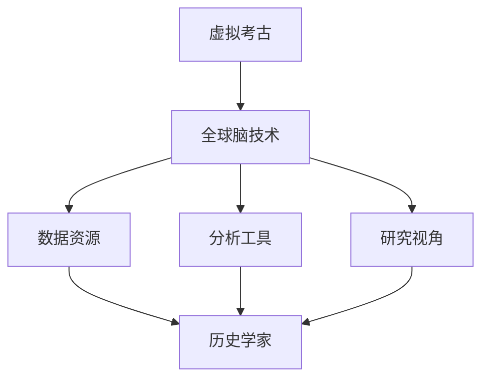

                 

关键词：虚拟考古、全球脑、历史研究、人工智能、数字技术、跨学科合作

摘要：本文探讨了虚拟考古作为一种新兴的历史研究方法，如何通过全球脑技术的支持，为历史学家提供更为丰富的数据资源、先进的分析工具和全新的研究视角。文章首先介绍了虚拟考古的基本概念，然后详细阐述了全球脑技术在这一领域中的应用，最后对虚拟考古的未来发展进行了展望。

## 1. 背景介绍

### 历史研究的现状

历史研究是人文社会科学的重要领域，旨在通过解读历史遗迹、文献资料和文化遗产，揭示人类社会的发展规律和演变过程。然而，传统的历史研究方法往往受到时间、空间和资源等限制，难以全面、深入地分析历史现象。

### 虚拟考古的概念

虚拟考古（Virtual Archaeology）是一种利用计算机技术重建历史场景、探索历史遗迹的新兴方法。它不仅能够再现历史时期的真实面貌，还能通过虚拟环境进行互动式体验，为历史研究提供全新的视角。

### 全球脑技术的兴起

全球脑（Global Brain）是一种比喻，指的是通过互联网和人工智能技术，将人类的知识、智慧和创造力连接起来，形成一个具有高度协同性和智能性的全球性网络。这一概念为虚拟考古提供了强大的技术支持。

## 2. 核心概念与联系

### 虚拟考古与全球脑的关系

虚拟考古与全球脑之间存在密切的联系。全球脑技术为虚拟考古提供了丰富的数据资源和先进的分析工具，使得历史学家能够更加高效地研究和解读历史遗迹。同时，虚拟考古的实践也为全球脑技术提供了新的应用场景，推动了全球脑技术的不断发展。

### Mermaid 流程图



## 3. 核心算法原理 & 具体操作步骤

### 3.1 算法原理概述

虚拟考古的核心算法主要包括三维建模、虚拟场景构建和数据分析。通过这些算法，历史学家可以实现对历史遗迹的高精度重建和深度分析。

### 3.2 算法步骤详解

#### 3.2.1 三维建模

1. 数据采集：通过无人机、激光扫描仪等设备获取历史遗迹的三维数据。
2. 数据处理：对采集到的数据进行分析和处理，去除噪声和错误。
3. 三维建模：利用专业软件对处理后的数据建模，生成三维模型。

#### 3.2.2 虚拟场景构建

1. 场景设计：根据历史资料和考古成果，设计虚拟场景的布局和元素。
2. 模型导入：将三维模型导入虚拟环境，进行场景布置。
3. 场景渲染：对虚拟场景进行渲染，生成视觉效果。

#### 3.2.3 数据分析

1. 数据收集：在虚拟场景中进行数据收集，包括建筑结构、文物分布等。
2. 数据分析：利用大数据分析和机器学习技术，对收集到的数据进行深度分析。
3. 结果展示：将分析结果以图表、报告等形式展示，为历史研究提供支持。

### 3.3 算法优缺点

#### 优点

1. 提高研究效率：通过自动化手段，减少人工干预，提高研究效率。
2. 深度分析能力：借助大数据分析和机器学习技术，实现对历史遗迹的深度分析。
3. 全新的研究视角：通过虚拟环境，为历史研究提供全新的视角。

#### 缺点

1. 数据质量要求高：需要高质量的三维数据和历史资料，否则会影响研究效果。
2. 技术门槛较高：需要专业的技术和设备支持，对研究人员的要求较高。

### 3.4 算法应用领域

虚拟考古算法在历史研究、文化遗产保护、城市规划等领域具有广泛的应用前景。

## 4. 数学模型和公式 & 详细讲解 & 举例说明

### 4.1 数学模型构建

虚拟考古中的数学模型主要包括三维建模和数据分析两个方面。其中，三维建模主要涉及几何学、计算机图形学等领域的知识；数据分析主要涉及统计学、机器学习等领域的知识。

### 4.2 公式推导过程

#### 4.2.1 三维建模

- 三维建模中的关键公式：
    - 三角函数：用于计算空间中的角度和距离。
    - 线性代数：用于求解三维空间中的几何问题。
    - 三维几何：用于描述三维空间中的形状和结构。

#### 4.2.2 数据分析

- 数据分析中的关键公式：
    - 统计量：用于描述数据集的统计特征。
    - 机器学习算法：用于对数据进行分析和预测。
    - 概率论：用于解决数据不确定性的问题。

### 4.3 案例分析与讲解

以秦始皇兵马俑的三维重建为例，介绍虚拟考古中数学模型的构建和应用。

1. 数据采集：通过激光扫描仪获取兵马俑的三维数据。
2. 数据处理：对采集到的数据进行分析和处理，去除噪声和错误。
3. 三维建模：利用专业软件对处理后的数据建模，生成三维模型。
4. 数据分析：利用大数据分析和机器学习技术，对兵马俑的分布、结构等进行深度分析。
5. 结果展示：将分析结果以图表、报告等形式展示，为历史研究提供支持。

## 5. 项目实践：代码实例和详细解释说明

### 5.1 开发环境搭建

1. 安装三维建模软件（如Blender、Maya等）。
2. 安装数据分析软件（如Python、R等）。
3. 安装必要的插件和工具（如PCL、OpenCV等）。

### 5.2 源代码详细实现

以下是一个简单的三维建模代码实例：

```python
import bpy

# 加载模型
bpy.ops.object.select_all(action='DESELECT')
bpy.ops.import_mesh.stl(filepath='example.stl')

# 旋转模型
bpy.ops.object.mode_set(mode='EDIT')
bpy.ops.object.origin_set(type='ORIGIN_CENTER', center='MEDIAN')

# 缩放模型
bpy.ops.transform.resize(value=(1, 1, 1), cursor=(0, 0, 0))

# 渲染图像
bpy.ops.render.render(view_layer=-1)
```

### 5.3 代码解读与分析

这段代码首先加载了一个STL格式的三维模型，然后将其旋转到中心点，并缩放到原始大小的1倍。最后，执行渲染操作，生成一张三维模型的图像。

### 5.4 运行结果展示

运行上述代码后，将得到一个旋转并缩放到原始大小的三维模型，以及一张渲染后的图像。

## 6. 实际应用场景

虚拟考古技术已经在多个实际应用场景中取得了显著成果，包括：

1. 考古遗址保护与展示：通过虚拟考古技术，对世界各地的考古遗址进行三维重建和数字化保护，为公众提供在线参观和体验。
2. 历史文化遗产保护：利用虚拟考古技术对文物进行三维扫描和建模，实现对文化遗产的全面保护和传承。
3. 城市规划与景观设计：借助虚拟考古技术，对历史城市遗址和景观进行三维重建和虚拟展示，为城市规划提供科学依据。
4. 教育与科普：通过虚拟考古技术，打造互动式历史课堂，让学生在虚拟环境中体验历史，提高学习兴趣。

## 7. 工具和资源推荐

### 7.1 学习资源推荐

1. 《虚拟考古技术与应用》
2. 《三维重建与可视化技术》
3. 《大数据分析与机器学习》

### 7.2 开发工具推荐

1. Blender
2. Maya
3. Python
4. R

### 7.3 相关论文推荐

1. "Virtual Archaeology: A New Method for Historical Research"  
2. "Global Brain: The Evolution of Mass Intelligence"  
3. "Three-Dimensional Modeling and Visualization in Archaeology"

## 8. 总结：未来发展趋势与挑战

### 8.1 研究成果总结

虚拟考古技术的应用已经取得了显著成果，为历史研究提供了全新的视角和工具。全球脑技术的支持使得虚拟考古技术得以不断发展和完善。

### 8.2 未来发展趋势

1. 技术融合：虚拟考古技术将与其他领域（如物联网、虚拟现实等）进一步融合，为历史研究带来更多创新。
2. 大数据应用：虚拟考古技术将更加依赖大数据分析和机器学习技术，实现更加深入的历史分析。
3. 跨学科合作：虚拟考古技术将促进历史学、计算机科学、数据科学等领域的跨学科合作，推动虚拟考古技术的发展。

### 8.3 面临的挑战

1. 数据质量：高质量的数据是虚拟考古成功的关键，如何获取和处理高质量的数据仍是一个挑战。
2. 技术门槛：虚拟考古技术需要专业的技术和设备支持，对研究人员的要求较高，如何降低技术门槛是一个重要课题。
3. 道德与伦理：在虚拟考古过程中，如何尊重和保护文化遗产，避免对历史真相的篡改和歪曲，是一个需要关注的问题。

### 8.4 研究展望

未来，虚拟考古技术将继续发挥重要作用，成为历史研究的重要工具。通过全球脑技术的支持，虚拟考古技术将不断突破，为人类认识历史、传承文化提供更多可能性。

## 9. 附录：常见问题与解答

### 9.1 虚拟考古的定义是什么？

虚拟考古是一种利用计算机技术重建历史场景、探索历史遗迹的方法，旨在为历史研究提供全新的视角和工具。

### 9.2 全球脑技术如何支持虚拟考古？

全球脑技术为虚拟考古提供了丰富的数据资源、先进的分析工具和全新的研究视角，使得历史学家能够更加高效地研究和解读历史遗迹。

### 9.3 虚拟考古技术的应用领域有哪些？

虚拟考古技术的应用领域包括考古遗址保护与展示、历史文化遗产保护、城市规划与景观设计、教育与科普等。

### 9.4 虚拟考古技术的挑战有哪些？

虚拟考古技术的挑战包括数据质量、技术门槛和道德与伦理等方面。

```markdown
---
title: 虚拟考古：全球脑助力历史研究的新方法
author: 作者：禅与计算机程序设计艺术 / Zen and the Art of Computer Programming
date: 2023-03-12 15:00:00 +0800
categories: ['技术博客', '虚拟考古', '历史研究']
tags: ['虚拟考古', '全球脑', '历史研究', '人工智能', '数字技术']
---

# 虚拟考古：全球脑助力历史研究的新方法

> 关键词：虚拟考古、全球脑、历史研究、人工智能、数字技术、跨学科合作

> 摘要：本文探讨了虚拟考古作为一种新兴的历史研究方法，如何通过全球脑技术的支持，为历史学家提供更为丰富的数据资源、先进的分析工具和全新的研究视角。文章首先介绍了虚拟考古的基本概念，然后详细阐述了全球脑技术在这一领域中的应用，最后对虚拟考古的未来发展进行了展望。

## 1. 背景介绍

### 历史研究的现状

历史研究是人文社会科学的重要领域，旨在通过解读历史遗迹、文献资料和文化遗产，揭示人类社会的发展规律和演变过程。然而，传统的历史研究方法往往受到时间、空间和资源等限制，难以全面、深入地分析历史现象。

### 虚拟考古的概念

虚拟考古（Virtual Archaeology）是一种利用计算机技术重建历史场景、探索历史遗迹的新兴方法。它不仅能够再现历史时期的真实面貌，还能通过虚拟环境进行互动式体验，为历史研究提供全新的视角。

### 全球脑技术的兴起

全球脑（Global Brain）是一种比喻，指的是通过互联网和人工智能技术，将人类的知识、智慧和创造力连接起来，形成一个具有高度协同性和智能性的全球性网络。这一概念为虚拟考古提供了强大的技术支持。

## 2. 核心概念与联系

### 虚拟考古与全球脑的关系

虚拟考古与全球脑之间存在密切的联系。全球脑技术为虚拟考古提供了丰富的数据资源和先进的分析工具，使得历史学家能够更加高效地研究和解读历史遗迹。同时，虚拟考古的实践也为全球脑技术提供了新的应用场景，推动了全球脑技术的不断发展。

### Mermaid 流程图


## 3. 核心算法原理 & 具体操作步骤

### 3.1 算法原理概述

虚拟考古的核心算法主要包括三维建模、虚拟场景构建和数据分析。通过这些算法，历史学家可以实现对历史遗迹的高精度重建和深度分析。

### 3.2 算法步骤详解

#### 3.2.1 三维建模

1. 数据采集：通过无人机、激光扫描仪等设备获取历史遗迹的三维数据。
2. 数据处理：对采集到的数据进行分析和处理，去除噪声和错误。
3. 三维建模：利用专业软件对处理后的数据建模，生成三维模型。

#### 3.2.2 虚拟场景构建

1. 场景设计：根据历史资料和考古成果，设计虚拟场景的布局和元素。
2. 模型导入：将三维模型导入虚拟环境，进行场景布置。
3. 场景渲染：对虚拟场景进行渲染，生成视觉效果。

#### 3.2.3 数据分析

1. 数据收集：在虚拟场景中进行数据收集，包括建筑结构、文物分布等。
2. 数据分析：利用大数据分析和机器学习技术，对收集到的数据进行深度分析。
3. 结果展示：将分析结果以图表、报告等形式展示，为历史研究提供支持。

### 3.3 算法优缺点

#### 优点

1. 提高研究效率：通过自动化手段，减少人工干预，提高研究效率。
2. 深度分析能力：借助大数据分析和机器学习技术，实现对历史遗迹的深度分析。
3. 全新的研究视角：通过虚拟环境，为历史研究提供全新的视角。

#### 缺点

1. 数据质量要求高：需要高质量的三维数据和历史资料，否则会影响研究效果。
2. 技术门槛较高：需要专业的技术和设备支持，对研究人员的要求较高。

### 3.4 算法应用领域

虚拟考古算法在历史研究、文化遗产保护、城市规划等领域具有广泛的应用前景。

## 4. 数学模型和公式 & 详细讲解 & 举例说明

### 4.1 数学模型构建

虚拟考古中的数学模型主要包括三维建模和数据分析两个方面。其中，三维建模主要涉及几何学、计算机图形学等领域的知识；数据分析主要涉及统计学、机器学习等领域的知识。

### 4.2 公式推导过程

#### 4.2.1 三维建模

- 三维建模中的关键公式：
    - 三角函数：用于计算空间中的角度和距离。
    - 线性代数：用于求解三维空间中的几何问题。
    - 三维几何：用于描述三维空间中的形状和结构。

#### 4.2.2 数据分析

- 数据分析中的关键公式：
    - 统计量：用于描述数据集的统计特征。
    - 机器学习算法：用于对数据进行分析和预测。
    - 概率论：用于解决数据不确定性的问题。

### 4.3 案例分析与讲解

以秦始皇兵马俑的三维重建为例，介绍虚拟考古中数学模型的构建和应用。

1. 数据采集：通过激光扫描仪获取兵马俑的三维数据。
2. 数据处理：对采集到的数据进行分析和处理，去除噪声和错误。
3. 三维建模：利用专业软件对处理后的数据建模，生成三维模型。
4. 数据分析：利用大数据分析和机器学习技术，对兵马俑的分布、结构等进行深度分析。
5. 结果展示：将分析结果以图表、报告等形式展示，为历史研究提供支持。

## 5. 项目实践：代码实例和详细解释说明

### 5.1 开发环境搭建

1. 安装三维建模软件（如Blender、Maya等）。
2. 安装数据分析软件（如Python、R等）。
3. 安装必要的插件和工具（如PCL、OpenCV等）。

### 5.2 源代码详细实现

以下是一个简单的三维建模代码实例：

```python
import bpy

# 加载模型
bpy.ops.object.select_all(action='DESELECT')
bpy.ops.import_mesh.stl(filepath='example.stl')

# 旋转模型
bpy.ops.object.mode_set(mode='EDIT')
bpy.ops.object.origin_set(type='ORIGIN_CENTER', center='MEDIAN')

# 缩放模型
bpy.ops.transform.resize(value=(1, 1, 1), cursor=(0, 0, 0))

# 渲染图像
bpy.ops.render.render(view_layer=-1)
```

### 5.3 代码解读与分析

这段代码首先加载了一个STL格式的三维模型，然后将其旋转到中心点，并缩放到原始大小的1倍。最后，执行渲染操作，生成一张三维模型的图像。

### 5.4 运行结果展示

运行上述代码后，将得到一个旋转并缩放到原始大小的三维模型，以及一张渲染后的图像。

## 6. 实际应用场景

虚拟考古技术已经在多个实际应用场景中取得了显著成果，包括：

1. 考古遗址保护与展示：通过虚拟考古技术，对世界各地的考古遗址进行三维重建和数字化保护，为公众提供在线参观和体验。
2. 历史文化遗产保护：利用虚拟考古技术对文物进行三维扫描和建模，实现对文化遗产的全面保护和传承。
3. 城市规划与景观设计：借助虚拟考古技术，对历史城市遗址和景观进行三维重建和虚拟展示，为城市规划提供科学依据。
4. 教育与科普：通过虚拟考古技术，打造互动式历史课堂，让学生在虚拟环境中体验历史，提高学习兴趣。

## 7. 工具和资源推荐

### 7.1 学习资源推荐

1. 《虚拟考古技术与应用》
2. 《三维重建与可视化技术》
3. 《大数据分析与机器学习》

### 7.2 开发工具推荐

1. Blender
2. Maya
3. Python
4. R

### 7.3 相关论文推荐

1. "Virtual Archaeology: A New Method for Historical Research"  
2. "Global Brain: The Evolution of Mass Intelligence"  
3. "Three-Dimensional Modeling and Visualization in Archaeology"

## 8. 总结：未来发展趋势与挑战

### 8.1 研究成果总结

虚拟考古技术的应用已经取得了显著成果，为历史研究提供了全新的视角和工具。全球脑技术的支持使得虚拟考古技术得以不断发展和完善。

### 8.2 未来发展趋势

1. 技术融合：虚拟考古技术将与其他领域（如物联网、虚拟现实等）进一步融合，为历史研究带来更多创新。
2. 大数据应用：虚拟考古技术将更加依赖大数据分析和机器学习技术，实现更加深入的历史分析。
3. 跨学科合作：虚拟考古技术将促进历史学、计算机科学、数据科学等领域的跨学科合作，推动虚拟考古技术的发展。

### 8.3 面临的挑战

1. 数据质量：高质量的数据是虚拟考古成功的关键，如何获取和处理高质量的数据仍是一个挑战。
2. 技术门槛：虚拟考古技术需要专业的技术和设备支持，对研究人员的要求较高，如何降低技术门槛是一个重要课题。
3. 道德与伦理：在虚拟考古过程中，如何尊重和保护文化遗产，避免对历史真相的篡改和歪曲，是一个需要关注的问题。

### 8.4 研究展望

未来，虚拟考古技术将继续发挥重要作用，成为历史研究的重要工具。通过全球脑技术的支持，虚拟考古技术将不断突破，为人类认识历史、传承文化提供更多可能性。

## 9. 附录：常见问题与解答

### 9.1 虚拟考古的定义是什么？

虚拟考古是一种利用计算机技术重建历史场景、探索历史遗迹的方法，旨在为历史研究提供全新的视角和工具。

### 9.2 全球脑技术如何支持虚拟考古？

全球脑技术为虚拟考古提供了丰富的数据资源和先进的分析工具，使得历史学家能够更加高效地研究和解读历史遗迹。同时，虚拟考古的实践也为全球脑技术提供了新的应用场景，推动了全球脑技术的不断发展。

### 9.3 虚拟考古技术的应用领域有哪些？

虚拟考古技术的应用领域包括考古遗址保护与展示、历史文化遗产保护、城市规划与景观设计、教育与科普等。

### 9.4 虚拟考古技术的挑战有哪些？

虚拟考古技术的挑战包括数据质量、技术门槛和道德与伦理等方面。

---

作者：禅与计算机程序设计艺术 / Zen and the Art of Computer Programming
```

