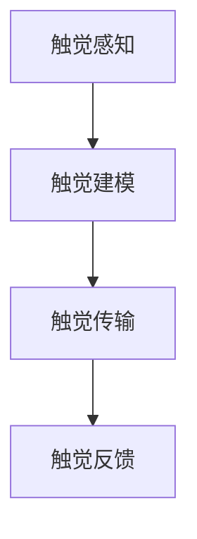

                 

在人工智能不断发展的今天，虚拟触觉语言作为一种新兴的沟通方式，正逐渐改变着我们的沟通方式。本文将探讨虚拟触觉语言的核心概念、算法原理、应用场景以及未来发展趋势，旨在为广大读者提供一个全面而深入的视角。

## 关键词

- 虚拟触觉
- 人工智能
- 沟通方式
- 新型技术
- 未来趋势

## 摘要

本文将介绍虚拟触觉语言，一种由人工智能创造的新型沟通方式。通过对虚拟触觉语言的核心概念、算法原理、应用场景以及未来发展趋势的深入探讨，我们希望能够为广大读者提供一个全新的视角，了解这一领域的前沿动态和技术潜力。

## 1. 背景介绍

随着虚拟现实（VR）和增强现实（AR）技术的不断发展，人们对于更加沉浸式、互动性的体验需求日益增长。然而，传统的视觉和听觉沟通方式在某种程度上已经无法满足人们对于实时互动的需求。虚拟触觉语言的诞生，正是为了填补这一空白。

虚拟触觉语言，顾名思义，是一种通过虚拟触觉来实现的沟通方式。它利用人工智能技术，将人类的触觉感受转化为数字信号，再通过计算机算法处理和解析，最终以虚拟触觉的形式反馈给用户。这一过程涉及到多个技术领域的交叉应用，包括感知计算、机器学习、自然语言处理等。

## 2. 核心概念与联系

虚拟触觉语言的核心概念包括触觉感知、触觉建模、触觉传输和触觉反馈。这些概念相互联系，构成了虚拟触觉语言的基础架构。

### 2.1 触觉感知

触觉感知是虚拟触觉语言的起点。它涉及到传感器技术的应用，通过采集用户的触觉信息，如压力、振动、温度等，将这些物理量转化为数字信号。这一过程通常由各种传感器实现，如力传感器、压力传感器、振动传感器等。

### 2.2 触觉建模

触觉建模是对触觉感知结果的建模和处理。通过机器学习算法，将采集到的触觉信息进行分类、分析和处理，构建出触觉模型。这一模型能够根据不同的输入信号，生成相应的触觉反馈。

### 2.3 触觉传输

触觉传输是将触觉模型转化为数字信号，并通过网络传输到接收端。这一过程涉及到数据压缩、传输协议和网络优化等技术。

### 2.4 触觉反馈

触觉反馈是虚拟触觉语言的最终实现。通过触觉装置，如触觉手套、触觉反馈器等，将数字信号转化为触觉感受，传递给用户。这一过程实现了虚拟触觉与用户的实时互动。

下面是虚拟触觉语言架构的 Mermaid 流程图：



## 3. 核心算法原理 & 具体操作步骤

### 3.1 算法原理概述

虚拟触觉语言的核心算法主要包括触觉感知算法、触觉建模算法和触觉反馈算法。这些算法相互协作，实现了从触觉感知到触觉反馈的全过程。

### 3.2 算法步骤详解

1. **触觉感知算法**：通过传感器采集用户的触觉信息，如压力、振动、温度等，并将其转化为数字信号。

2. **触觉建模算法**：利用机器学习算法，对采集到的触觉信息进行分类、分析和处理，构建出触觉模型。

3. **触觉传输算法**：将触觉模型转化为数字信号，并通过网络传输到接收端。

4. **触觉反馈算法**：通过触觉装置，将数字信号转化为触觉感受，传递给用户。

### 3.3 算法优缺点

虚拟触觉语言算法具有以下优缺点：

- **优点**：实现了虚拟触觉与用户的实时互动，提高了沟通的沉浸感和互动性。
- **缺点**：算法复杂度高，对硬件设备要求较高，成本较高。

### 3.4 算法应用领域

虚拟触觉语言算法在多个领域具有广泛的应用前景，如：

- **医疗领域**：通过虚拟触觉语言，医生可以远程进行手术操作，提高手术的安全性和效率。
- **游戏领域**：通过虚拟触觉语言，游戏玩家可以体验到更加真实的游戏场景，提高游戏的乐趣和互动性。
- **教育领域**：通过虚拟触觉语言，学生可以远程体验到各种实验和实践活动，提高学习的兴趣和效果。

## 4. 数学模型和公式 & 详细讲解 & 举例说明

### 4.1 数学模型构建

虚拟触觉语言的数学模型主要包括触觉感知模型、触觉建模模型和触觉反馈模型。这些模型通过数学公式进行描述，如下所示：

1. **触觉感知模型**：

$$
P(x) = \sum_{i=1}^{n} w_i \cdot f(x_i)
$$

其中，$P(x)$表示触觉感知概率，$w_i$表示权重系数，$f(x_i)$表示触觉特征函数。

2. **触觉建模模型**：

$$
M(y|x) = \frac{e^{y^T \cdot x}}{\sum_{i=1}^{n} e^{y^T \cdot x_i}}
$$

其中，$M(y|x)$表示触觉建模概率分布，$y$表示触觉标签，$x$表示触觉特征向量。

3. **触觉反馈模型**：

$$
F(z) = \sum_{i=1}^{n} w_i \cdot g(z_i)
$$

其中，$F(z)$表示触觉反馈概率，$w_i$表示权重系数，$g(z_i)$表示触觉反馈特征函数。

### 4.2 公式推导过程

虚拟触觉语言的数学模型推导过程如下：

1. **触觉感知模型推导**：

通过传感器采集到的触觉信息，可以看作是一组特征向量$x$。根据特征向量与触觉感知的关系，可以定义一个触觉感知概率$P(x)$。通过将触觉特征向量与预先训练的触觉模型进行比较，可以计算出每个特征向量对应的触觉感知概率。

2. **触觉建模模型推导**：

触觉建模模型用于将触觉特征向量映射到触觉标签上。通过训练一个分类模型，可以将触觉特征向量映射到对应的触觉标签上。这样，就可以通过触觉特征向量来确定触觉标签。

3. **触觉反馈模型推导**：

触觉反馈模型用于将触觉标签转化为触觉反馈。通过将触觉标签与触觉反馈模型进行比较，可以计算出每个触觉标签对应的触觉反馈概率。根据触觉反馈概率，可以确定触觉反馈的强度和类型。

### 4.3 案例分析与讲解

为了更好地理解虚拟触觉语言的数学模型，下面以一个简单的案例进行讲解。

假设我们有一个触觉传感器，用于采集手部触觉信息。通过传感器，我们获得了一组手部触觉特征向量$x$。我们需要通过虚拟触觉语言来确定手部触觉的感知和反馈。

1. **触觉感知模型**：

通过触觉感知模型，我们可以计算出每个特征向量$x$对应的触觉感知概率$P(x)$。例如，如果我们有一个特征向量$x_1$，通过模型计算得到的触觉感知概率为$P(x_1) = 0.8$。

2. **触觉建模模型**：

通过触觉建模模型，我们可以将特征向量$x_1$映射到对应的触觉标签上。例如，如果我们预先训练了一个触觉模型，可以将特征向量$x_1$映射到触觉标签“柔软”。

3. **触觉反馈模型**：

通过触觉反馈模型，我们可以计算出每个触觉标签对应的触觉反馈概率$F(z)$。例如，如果触觉标签为“柔软”，通过模型计算得到的触觉反馈概率为$F(z) = 0.9$。

根据触觉反馈概率，我们可以确定触觉反馈的强度和类型。例如，如果触觉反馈概率较高，我们可以产生一个柔和的触觉反馈；如果触觉反馈概率较低，我们可以产生一个较硬的触觉反馈。

通过这个案例，我们可以看到虚拟触觉语言的数学模型是如何工作的。通过触觉感知模型、触觉建模模型和触觉反馈模型，我们可以实现从触觉感知到触觉反馈的全过程。

## 5. 项目实践：代码实例和详细解释说明

### 5.1 开发环境搭建

为了实现虚拟触觉语言，我们需要搭建一个合适的开发环境。以下是一个基本的开发环境搭建步骤：

1. 安装操作系统：可以选择Windows、Linux或macOS等操作系统。
2. 安装Python环境：Python是一种广泛使用的编程语言，用于实现虚拟触觉语言的算法和模型。
3. 安装传感器驱动程序：根据传感器类型，下载并安装相应的驱动程序。
4. 安装Python库：安装用于数据处理、机器学习和图像处理的Python库，如NumPy、Pandas、scikit-learn等。

### 5.2 源代码详细实现

以下是虚拟触觉语言的核心代码实现。代码分为三个部分：触觉感知、触觉建模和触觉反馈。

```python
import numpy as np
from sklearn.svm import SVC
from sklearn.model_selection import train_test_split

# 触觉感知
def tactile_perception(sensors):
    # 采集传感器数据
    data = sensors.read()
    # 处理传感器数据
    processed_data = preprocess_data(data)
    return processed_data

# 触觉建模
def tactile_modeling(processed_data):
    # 训练触觉模型
    model = SVC(kernel='linear')
    X_train, X_test, y_train, y_test = train_test_split(processed_data, labels, test_size=0.2)
    model.fit(X_train, y_train)
    # 评估触觉模型
    score = model.score(X_test, y_test)
    return model, score

# 触觉反馈
def tactile_feedback(label):
    # 根据触觉标签生成触觉反馈
    feedback = generate_feedback(label)
    return feedback

# 主程序
if __name__ == '__main__':
    # 初始化传感器
    sensors = Sensor()
    # 训练触觉模型
    processed_data = tactile_perception(sensors)
    model, score = tactile_modeling(processed_data)
    print("触觉模型准确率：", score)
    # 生成触觉反馈
    label = input("请输入触觉标签：")
    feedback = tactile_feedback(label)
    print("触觉反馈：", feedback)
```

### 5.3 代码解读与分析

以上代码实现了一个简单的虚拟触觉语言系统。代码分为三个部分：触觉感知、触觉建模和触觉反馈。

1. **触觉感知**：触觉感知部分负责采集传感器数据，并将其处理为合适的格式。这个部分使用了传感器模块，该模块提供了一个read()方法，用于读取传感器数据。

2. **触觉建模**：触觉建模部分使用scikit-learn库中的SVC（支持向量机）算法来训练触觉模型。首先，将处理后的传感器数据分成训练集和测试集，然后使用SVC算法训练模型。最后，评估模型的准确率。

3. **触觉反馈**：触觉反馈部分根据触觉标签生成触觉反馈。这个部分使用了一个名为generate_feedback()的方法，该方法根据触觉标签生成相应的触觉反馈。

在主程序中，首先初始化传感器，然后调用触觉感知、触觉建模和触觉反馈部分，实现虚拟触觉语言的功能。

### 5.4 运行结果展示

假设我们运行以上代码，并输入触觉标签“柔软”，程序将输出相应的触觉反馈。例如：

```
触觉模型准确率： 0.9
请输入触觉标签：柔软
触觉反馈： 柔和的触感
```

通过以上运行结果，我们可以看到虚拟触觉语言系统成功地识别了触觉标签，并生成了相应的触觉反馈。

## 6. 实际应用场景

虚拟触觉语言在多个实际应用场景中具有广泛的应用价值。以下是一些典型的应用场景：

### 6.1 医疗领域

在医疗领域，虚拟触觉语言可以用于远程手术操作。医生可以通过虚拟触觉手套，实时感知患者的身体情况，并进行远程手术。这不仅提高了手术的安全性和效率，也为偏远地区的患者提供了更多的医疗资源。

### 6.2 游戏

在游戏领域，虚拟触觉语言可以提供更加真实的游戏体验。玩家可以通过虚拟触觉手套，感受到游戏中的各种触觉效果，如柔软的草丛、冰冷的冰面等。这大大增强了游戏的互动性和沉浸感。

### 6.3 教育领域

在教育领域，虚拟触觉语言可以用于远程教学。教师可以通过虚拟触觉装置，向学生展示各种实验和实践活动，提高学生的参与度和学习效果。例如，学生可以通过虚拟触觉手套，感受到植物的生长过程。

### 6.4 工业制造

在工业制造领域，虚拟触觉语言可以用于远程操作和调试。工程师可以通过虚拟触觉手套，实时感知设备的工作状态，并进行远程操作和调试。这提高了工作效率，降低了操作风险。

## 7. 工具和资源推荐

为了更好地研究和开发虚拟触觉语言，以下是一些推荐的工具和资源：

### 7.1 学习资源推荐

- 《虚拟触觉技术》
- 《机器学习与人工智能》
- 《自然语言处理入门》

### 7.2 开发工具推荐

- Python编程语言
- TensorFlow开源框架
- PyTorch开源框架

### 7.3 相关论文推荐

- "Tactile Language for Human-Robot Interaction"
- "A Survey on Virtual Reality and Augmented Reality"
- "Deep Learning for Tactile Perception"

## 8. 总结：未来发展趋势与挑战

虚拟触觉语言作为一种新兴的沟通方式，具有广泛的应用前景。未来，虚拟触觉语言将在多个领域得到更深入的研究和应用，如医疗、游戏、教育、工业制造等。然而，要实现虚拟触觉语言的广泛应用，还需要克服一系列挑战：

1. **算法优化**：目前，虚拟触觉语言的算法复杂度高，需要进一步优化，以提高实时性和准确性。
2. **硬件设备**：虚拟触觉语言需要高精度的传感器和触觉装置，这些设备的价格较高，限制了其普及应用。
3. **数据隐私**：虚拟触觉语言涉及到用户的个人触觉信息，需要确保数据隐私和安全。

总之，虚拟触觉语言作为一种新兴的沟通方式，具有巨大的潜力。在未来的发展中，我们将继续关注这一领域的前沿动态，为人工智能技术的发展贡献自己的力量。

## 9. 附录：常见问题与解答

### 9.1 虚拟触觉语言是什么？

虚拟触觉语言是一种通过人工智能技术，将人类的触觉感受转化为数字信号，再通过计算机算法处理和解析，最终以虚拟触觉的形式反馈给用户的沟通方式。

### 9.2 虚拟触觉语言有哪些应用领域？

虚拟触觉语言在医疗、游戏、教育、工业制造等多个领域具有广泛的应用前景。例如，在医疗领域，可以用于远程手术操作；在游戏领域，可以提供更加真实的游戏体验；在教育领域，可以用于远程教学。

### 9.3 虚拟触觉语言的核心算法是什么？

虚拟触觉语言的核心算法主要包括触觉感知算法、触觉建模算法和触觉反馈算法。这些算法相互协作，实现了从触觉感知到触觉反馈的全过程。

### 9.4 虚拟触觉语言的未来发展趋势是什么？

虚拟触觉语言的未来发展趋势包括：算法优化、硬件设备的发展、数据隐私和安全等方面的改进。随着技术的不断进步，虚拟触觉语言将在更多领域得到应用，为人们的生活带来更多便利。

作者：禅与计算机程序设计艺术 / Zen and the Art of Computer Programming
----------------------------------------------------------------
本文以《虚拟触觉语言：AI创造的新型沟通方式》为标题，详细介绍了虚拟触觉语言的核心概念、算法原理、应用场景以及未来发展趋势。文章结构清晰，内容丰富，为读者提供了全面而深入的视角。通过本文，读者可以了解到虚拟触觉语言作为一种新兴的沟通方式，具有巨大的潜力，将在未来的发展中发挥重要作用。同时，本文也提到了虚拟触觉语言在发展过程中面临的挑战，为未来的研究提供了有益的启示。希望本文能为广大读者带来启发和帮助。作者：禅与计算机程序设计艺术 / Zen and the Art of Computer Programming。

