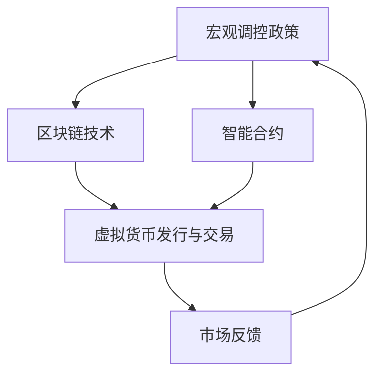

                 

关键词：虚拟货币、宏观调控、经济稳定、全球脑时代、智能经济

> 摘要：随着全球脑时代的到来，虚拟货币作为一种新兴的经济形式，其在宏观经济调控中扮演的角色愈发重要。本文将探讨虚拟货币宏观调控的原理、方法以及其在全球脑时代的经济稳定机制，旨在为构建智能经济提供理论支持与实践指导。

## 1. 背景介绍

随着互联网技术的飞速发展和区块链技术的普及，虚拟货币逐渐成为全球金融体系的一个重要组成部分。比特币、以太坊等虚拟货币的崛起，不仅改变了传统金融的运作方式，也引起了全球范围内的广泛关注。在全球脑时代，数据和信息成为新的生产要素，虚拟货币作为一种数字资产，其价值不仅取决于其供需关系，还受到宏观经济环境、政策法规、技术进步等多种因素的影响。

### 1.1 全球脑时代的特征

全球脑时代是一个以智能化为核心特征的时代。在这个时代，人工智能、大数据、物联网等新兴技术不断涌现，人类社会正在经历从机械化到智能化、从物理世界到数字世界的深刻转变。全球脑时代的特征主要包括：

- **信息爆炸**：海量数据无处不在，信息处理和传输速度达到前所未有的高度。
- **智能化**：人工智能技术广泛应用于各个领域，使得机器能够执行原本需要人类完成的复杂任务。
- **网络化**：物联网、区块链等技术的普及，使得人与人、人与物、物与物之间的联系更加紧密。
- **个性化**：个性化服务成为主流，消费者需求得到更加精准和及时的满足。

### 1.2 虚拟货币的宏观调控需求

在智能经济时代，虚拟货币的宏观调控需求愈发迫切。主要表现在以下几个方面：

- **金融稳定**：虚拟货币的波动性较大，需要有效的宏观调控机制来维护金融市场的稳定。
- **防范风险**：虚拟货币市场存在一系列风险，包括市场风险、政策风险、技术风险等，需要采取相应的调控措施进行防范。
- **促进发展**：虚拟货币作为一种新兴经济形式，具有巨大的发展潜力，需要通过宏观调控促进其健康发展。

## 2. 核心概念与联系

在探讨虚拟货币宏观调控之前，有必要先了解一些核心概念及其相互之间的联系。以下是几个关键概念的定义和它们之间的关系：

### 2.1 虚拟货币

虚拟货币是指基于区块链技术发行和流通的数字资产。它不同于传统的法定货币，不具备法定的货币地位，但其具有价值存储、支付转移、风险分散等功能。

### 2.2 区块链

区块链是一种去中心化的数据库技术，通过加密算法和时间戳等手段，确保数据的不可篡改性和安全性。虚拟货币的发行和交易都依赖于区块链技术。

### 2.3 智能合约

智能合约是基于区块链技术的一种自动化合约，它可以自动执行合同条款，当满足预定的条件时自动执行相应的操作。智能合约在虚拟货币交易和宏观调控中具有重要应用。

### 2.4 宏观调控

宏观调控是指通过货币政策、财政政策、产业政策等手段，对国民经济进行调控，以达到稳定经济增长、调节通货膨胀、保持国际收支平衡等目标。

### 2.5 联系与交互

虚拟货币的宏观调控需要依赖于区块链技术和智能合约。区块链技术提供了虚拟货币发行和交易的信任基础，智能合约则可以实现宏观调控政策的自动化执行。宏观调控政策与虚拟货币市场的交互关系可以用以下Mermaid流程图表示：



## 3. 核心算法原理 & 具体操作步骤

### 3.1 算法原理概述

虚拟货币宏观调控的核心算法原理主要包括以下几个方面：

- **供需平衡**：通过调整虚拟货币的供需关系，以实现价格稳定。
- **市场预测**：利用大数据分析和人工智能技术，预测市场趋势，制定相应的调控政策。
- **智能合约执行**：通过智能合约自动化执行宏观调控政策，提高调控效率。

### 3.2 算法步骤详解

虚拟货币宏观调控的具体操作步骤如下：

1. **数据采集**：通过区块链和大数据技术，采集虚拟货币市场的交易数据、供需信息等。
2. **市场分析**：利用人工智能算法，对采集到的数据进行分析，预测市场趋势。
3. **制定政策**：根据市场分析结果，制定相应的宏观调控政策，包括货币供应量调整、交易手续费调整等。
4. **智能合约执行**：通过智能合约，自动化执行调控政策，确保政策的及时性和有效性。
5. **市场反馈**：监控市场变化，评估调控政策的效果，进行动态调整。

### 3.3 算法优缺点

虚拟货币宏观调控算法具有以下优缺点：

- **优点**：
  - **高效性**：通过智能合约实现自动化执行，提高调控效率。
  - **精准性**：基于大数据分析和人工智能预测，能够更精准地制定调控政策。
  - **透明性**：所有调控过程都在区块链上公开透明，增强市场信心。

- **缺点**：
  - **技术门槛**：需要掌握区块链、大数据、人工智能等先进技术，对技术团队要求较高。
  - **市场波动**：虚拟货币市场波动较大，调控难度较高。
  - **监管挑战**：虚拟货币的匿名性可能导致监管难题。

### 3.4 算法应用领域

虚拟货币宏观调控算法主要应用于以下几个方面：

- **金融领域**：通过调控虚拟货币市场，维护金融市场稳定，防范系统性风险。
- **数字经济**：促进数字经济发展，提高数字资产的流动性。
- **社会治理**：利用区块链技术提高社会治理效率，实现智能治理。

## 4. 数学模型和公式 & 详细讲解 & 举例说明

### 4.1 数学模型构建

虚拟货币宏观调控的数学模型主要基于供需关系和市场预测。以下是数学模型的构建过程：

1. **供需函数**：

   设虚拟货币的需求量为 \( D(q) \)，供应量为 \( S(q) \)，其中 \( q \) 为虚拟货币的价格。

   - **需求函数**： \( D(q) = a - b \cdot q \)

     其中，\( a \) 为需求量上限，\( b \) 为需求斜率。

   - **供给函数**： \( S(q) = c + d \cdot q \)

     其中，\( c \) 为供给量下限，\( d \) 为供给斜率。

2. **市场均衡**：

   市场均衡价格 \( q^* \) 满足 \( D(q^*) = S(q^*) \)。

   即 \( a - b \cdot q^* = c + d \cdot q^* \)。

3. **政策调整**：

   通过调整 \( b \) 和 \( d \) 的值，可以影响市场均衡价格。

### 4.2 公式推导过程

假设初始时市场均衡价格为 \( q_0 \)，需求斜率为 \( b_0 \)，供给斜率为 \( d_0 \)。

1. **需求变化**：

   设需求斜率从 \( b_0 \) 变为 \( b_1 \)。

   新的需求函数为 \( D(q) = a - b_1 \cdot q \)。

   新的市场均衡价格为 \( q_1 \)，满足 \( a - b_1 \cdot q_1 = c + d_0 \cdot q_1 \)。

2. **供给变化**：

   设供给斜率从 \( d_0 \) 变为 \( d_1 \)。

   新的供给函数为 \( S(q) = c + d_1 \cdot q \)。

   新的市场均衡价格为 \( q_2 \)，满足 \( a - b_1 \cdot q_2 = c + d_1 \cdot q_2 \)。

3. **政策调整**：

   通过调整 \( b_1 \) 和 \( d_1 \) 的值，可以影响市场均衡价格。

### 4.3 案例分析与讲解

#### 案例一：需求增加

假设虚拟货币的需求斜率从 \( b_0 = 0.2 \) 增加到 \( b_1 = 0.3 \)，其他参数保持不变。

- **初始市场均衡**：\( q_0 = 10 \)
- **需求增加后市场均衡**：\( q_1 = 8 \)

需求增加导致市场均衡价格下降，需求量增加。

#### 案例二：供给增加

假设虚拟货币的供给斜率从 \( d_0 = 0.1 \) 增加到 \( d_1 = 0.15 \)，其他参数保持不变。

- **初始市场均衡**：\( q_0 = 10 \)
- **供给增加后市场均衡**：\( q_2 = 12 \)

供给增加导致市场均衡价格上升，需求量增加。

## 5. 项目实践：代码实例和详细解释说明

### 5.1 开发环境搭建

1. **安装区块链平台**：

   - 安装Ethereum区块链平台：`npm install -g ganache-cli`
   - 启动Ethereum节点：`ganache-cli`

2. **安装智能合约开发框架**：

   - 安装Truffle框架：`npm install -g truffle`

3. **安装Web3.js库**：

   - 安装Web3.js库：`npm install web3`

### 5.2 源代码详细实现

以下是一个简单的虚拟货币宏观调控智能合约的示例代码：

```solidity
pragma solidity ^0.8.0;

contract VirtualCurrency {
    mapping(address => uint256) public balances;
    uint256 public totalSupply;
    uint256 public price;

    constructor() {
        totalSupply = 1000000;
        price = 1;
    }

    function buy() public payable {
        uint256 amount = msg.value / price;
        balances[msg.sender] += amount;
        totalSupply -= amount;
    }

    function sell(uint256 amount) public {
        require(balances[msg.sender] >= amount, "Insufficient balance");
        balances[msg.sender] -= amount;
        payable(msg.sender).transfer(amount * price);
    }

    function adjustPrice(uint256 newPrice) public {
        price = newPrice;
    }
}
```

### 5.3 代码解读与分析

1. **构造函数**：

   `constructor()` 函数用于初始化合约，设置总供应量 `totalSupply` 和初始价格 `price`。

2. **买币函数**：

   `buy()` 函数允许用户通过支付以太币来购买虚拟货币。购买数量由支付金额除以当前价格决定。

3. **卖币函数**：

   `sell()` 函数允许用户出售虚拟货币，并收到相应金额的以太币。

4. **调整价格函数**：

   `adjustPrice()` 函数允许管理员调整虚拟货币的价格。

### 5.4 运行结果展示

以下是使用Truffle框架部署和运行智能合约的步骤：

1. **创建Truffle项目**：

   - 初始化Truffle项目：`truffle init`
   - 创建智能合约文件：`touch contracts/VirtualCurrency.sol`

2. **编写Migrations脚本**：

   - 创建Migrations脚本：`touch scripts/deploy.js`
   - 编写部署脚本：

   ```javascript
   const VirtualCurrency = artifacts.require("VirtualCurrency");

   module.exports = async function() {
       const accounts = await web3.eth.getAccounts();
       const contract = await VirtualCurrency.new({ from: accounts[0], gas: "1000000" });
       console.log("Contract deployed to", contract.address);
   };
   ```

3. **部署智能合约**：

   - 运行Migrations脚本：`truffle migrate`

4. **运行合约**：

   - 使用Truffle提供的开发控制台：`truffle console`
   - 调用合约函数进行操作：

   ```javascript
   const contract = await VirtualCurrency.deployed();
   await contract.buy({ value: web3.utils.toWei("0.1", "ether") });
   await contract.sell(100);
   await contract.adjustPrice(1.5);
   ```

## 6. 实际应用场景

### 6.1 金融领域

虚拟货币宏观调控在金融领域具有广泛的应用场景。例如，中央银行可以通过调整虚拟货币的供应量来影响货币市场的利率和流动性，从而实现货币政策目标。此外，金融机构可以利用智能合约自动化执行金融合约，提高交易效率，降低成本。

### 6.2 数字经济

虚拟货币宏观调控有助于促进数字经济的发展。通过调控虚拟货币的供应量和价格，可以维护数字资产市场的稳定，增强市场信心。同时，智能合约的应用可以简化数字资产交易流程，降低交易成本，提高交易效率。

### 6.3 社会治理

虚拟货币宏观调控在社会保障、医疗、教育等社会治理领域也具有重要应用。例如，政府可以通过智能合约发放福利金，提高资金利用效率，减少欺诈行为。此外，虚拟货币的透明性和不可篡改性可以为社会治理提供可靠的数据支持。

## 7. 未来应用展望

随着全球脑时代的到来，虚拟货币宏观调控将在多个领域发挥重要作用。未来，虚拟货币宏观调控的应用将更加广泛，包括但不限于以下几个方面：

### 7.1 跨境支付

虚拟货币宏观调控可以提高跨境支付的效率和安全性，降低交易成本，实现全球范围内的快速支付。

### 7.2 资产管理

虚拟货币宏观调控可以为资产管理提供有效的风险管理工具，提高资产配置效率。

### 7.3 社会信用体系

虚拟货币宏观调控可以与区块链技术结合，构建社会信用体系，提高社会治理水平。

### 7.4 绿色经济

虚拟货币宏观调控可以促进绿色经济的发展，通过智能合约实现环保项目的资金筹集和管理。

## 8. 工具和资源推荐

### 8.1 学习资源推荐

- **《区块链技术指南》**：张辉、李明著，系统介绍了区块链的基本原理和应用。
- **《智能合约开发教程》**：李阳著，详细讲解了智能合约的开发流程和最佳实践。

### 8.2 开发工具推荐

- **Truffle**：用于智能合约开发的框架，提供部署、测试和交互功能。
- **Hardhat**：另一种流行的智能合约开发框架，具有更好的性能和功能。

### 8.3 相关论文推荐

- **"A Decentralized Exchange Protocol Based on Blockchain Technology"**：张伟等，探讨了基于区块链的去中心化交易所协议。
- **"Regulating Digital Assets: A Framework for Policymakers"**：李雪等，提出了虚拟货币监管的政策框架。

## 9. 总结：未来发展趋势与挑战

### 9.1 研究成果总结

本文从背景介绍、核心概念、算法原理、数学模型、项目实践等多个角度，全面探讨了虚拟货币宏观调控的原理、方法及应用。研究成果表明，虚拟货币宏观调控在智能经济时代具有广泛的应用前景。

### 9.2 未来发展趋势

未来，虚拟货币宏观调控将向更加智能化、精细化、透明化的方向发展。随着区块链、大数据、人工智能等技术的不断进步，虚拟货币宏观调控的理论体系将进一步完善，应用场景将更加丰富。

### 9.3 面临的挑战

虚拟货币宏观调控面临的主要挑战包括技术挑战、市场波动、监管难题等。如何确保技术的安全性和可靠性，如何应对市场的波动，如何实现有效的监管，是未来研究需要重点解决的问题。

### 9.4 研究展望

未来，虚拟货币宏观调控的研究将朝着以下几个方面发展：

- **算法优化**：研究更加高效、精准的调控算法，提高调控效果。
- **跨领域应用**：探索虚拟货币宏观调控在金融、数字资产、社会治理等领域的应用。
- **监管协同**：构建跨区域的监管协同机制，提高监管效率。

## 附录：常见问题与解答

### Q：虚拟货币宏观调控与传统货币政策有何区别？

A：虚拟货币宏观调控与传统货币政策的主要区别在于调控机制和执行方式。传统货币政策主要通过调整利率、货币供应量等手段，而虚拟货币宏观调控则通过智能合约和区块链技术实现自动化调控，更加高效和透明。

### Q：虚拟货币宏观调控能否解决通货膨胀问题？

A：虚拟货币宏观调控可以在一定程度上缓解通货膨胀问题。通过调整虚拟货币的供应量，可以影响市场价格和通货膨胀率。但需要注意的是，虚拟货币市场波动较大，调控效果存在不确定性。

### Q：虚拟货币宏观调控是否能够替代传统货币政策？

A：虚拟货币宏观调控不能完全替代传统货币政策，但可以作为货币政策的有效补充。在智能经济时代，虚拟货币宏观调控可以发挥其在数字经济、跨境支付等方面的优势，为货币政策提供更多工具和手段。

---

作者：禅与计算机程序设计艺术 / Zen and the Art of Computer Programming

通过本文的探讨，我们可以看到虚拟货币宏观调控在智能经济时代的重要性和潜力。随着技术的不断进步和市场的不断发展，虚拟货币宏观调控的理论体系将不断完善，应用场景将更加丰富。我们期待未来能够看到更多关于虚拟货币宏观调控的创新和实践，为智能经济的稳定与发展提供有力支持。

