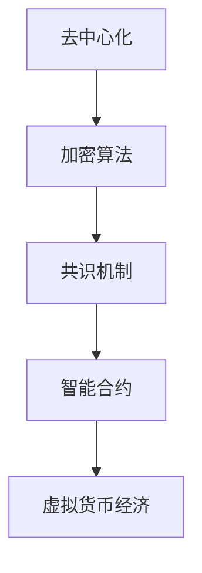

                 

关键词：虚拟货币，区块链，去中心化，价值交换，全球脑时代

## 摘要

随着全球脑时代的到来，信息流动的速度和广度达到了前所未有的高度。在这个时代背景下，虚拟货币作为一种新型的价值交换方式，正逐渐改变着全球经济的面貌。本文将深入探讨虚拟货币经济的本质、核心概念、算法原理、数学模型、实际应用以及未来展望，旨在为读者提供一个全面、深入的理解。

## 1. 背景介绍

虚拟货币，也称为数字货币，是一种数字化的、去中心化的货币形式，不受单一政府或金融实体控制。它通过一种名为区块链的技术来记录和验证交易，从而保证了交易的透明度和安全性。区块链是一种分布式账本技术，能够在无需中心化机构的情况下，安全地管理和验证交易。

全球脑时代，是指随着信息技术的飞速发展，人类大脑的潜力得到了前所未有的发挥，全球范围内的信息交流与合作变得更加紧密和高效。在这个时代，虚拟货币作为一种全新的价值交换方式，具有高度的灵活性和便利性，能够满足人们多样化的需求。

## 2. 核心概念与联系

虚拟货币经济的核心概念包括：去中心化、加密算法、共识机制、智能合约等。下面，我们将通过一个Mermaid流程图，来展示这些核心概念之间的关系。



### 2.1 去中心化

去中心化是虚拟货币经济的基础。它意味着网络中的所有参与者都是平等的，没有一个中心化的机构能够控制整个网络。这使得虚拟货币系统更加透明和公正，也降低了系统的脆弱性。

### 2.2 加密算法

加密算法用于保护虚拟货币交易的安全。它确保了交易数据的保密性、完整性和不可篡改性。常见的加密算法包括SHA-256、RSA等。

### 2.3 共识机制

共识机制是确保区块链网络中的所有节点对同一组交易数据达成共识的关键。比特币采用的是工作量证明（PoW）机制，而以太坊则采用了权益证明（PoS）机制。

### 2.4 智能合约

智能合约是一种自动执行合同条款的计算机程序。它能够自动执行预定义的合约，从而提高了交易的效率和安全。

## 3. 核心算法原理 & 具体操作步骤

### 3.1 算法原理概述

虚拟货币经济中的核心算法主要包括区块链算法、加密算法和智能合约算法。这些算法共同保障了虚拟货币系统的安全性、透明性和高效性。

### 3.2 算法步骤详解

#### 3.2.1 区块链算法

区块链算法主要包括以下步骤：

1. **交易创建**：用户发起交易，并将其广播到网络中。
2. **区块创建**：矿工接收交易，并将其打包成一个新的区块。
3. **区块验证**：网络中的节点对区块进行验证，以确保交易的合法性和区块的正确性。
4. **区块添加**：验证通过的区块被添加到区块链中。

#### 3.2.2 加密算法

加密算法主要包括以下步骤：

1. **加密**：使用公钥对数据进行加密，确保数据在传输过程中不会被窃取。
2. **解密**：使用私钥对加密数据进行解密，确保数据的真实性和完整性。

#### 3.2.3 智能合约算法

智能合约算法主要包括以下步骤：

1. **合约编写**：开发人员编写智能合约代码。
2. **合约部署**：将智能合约代码部署到区块链上。
3. **合约执行**：当触发合约条件时，智能合约自动执行预定义的合约条款。

### 3.3 算法优缺点

#### 3.3.1 区块链算法

**优点**：去中心化、安全性高、透明性强。

**缺点**：交易速度较慢、存储容量有限。

#### 3.3.2 加密算法

**优点**：数据保密性好、不可篡改。

**缺点**：计算资源消耗大、安全性依赖于私钥保护。

#### 3.3.3 智能合约算法

**优点**：自动化执行、提高交易效率。

**缺点**：代码一旦部署，不可更改、安全性依赖于合约设计。

### 3.4 算法应用领域

虚拟货币算法在金融、供应链管理、版权保护、选举系统等多个领域具有广泛的应用。例如，在金融领域，虚拟货币可以用于跨境支付、数字资产管理等；在供应链管理领域，虚拟货币可以用于跟踪产品来源、保证产品质量等。

## 4. 数学模型和公式 & 详细讲解 & 举例说明

虚拟货币经济中的数学模型和公式主要用于描述交易过程、网络共识、加密算法等。下面将详细介绍这些数学模型和公式的构建、推导过程，并给出实际案例。

### 4.1 数学模型构建

虚拟货币经济中的数学模型主要包括以下几部分：

1. **交易模型**：描述用户之间的交易行为。
2. **网络模型**：描述区块链网络的结构和运作。
3. **加密模型**：描述加密算法的原理和实现。

### 4.2 公式推导过程

#### 4.2.1 交易模型

交易模型中，常用的公式包括交易金额、交易手续费等。

- **交易金额**：\(A = P \times Q\)
  - \(A\)：交易金额
  - \(P\)：货币单价
  - \(Q\)：交易数量

- **交易手续费**：\(F = \frac{A}{100}\)
  - \(F\)：交易手续费
  - \(A\)：交易金额

#### 4.2.2 网络模型

网络模型中，常用的公式包括网络延迟、网络吞吐量等。

- **网络延迟**：\(L = \frac{D}{R}\)
  - \(L\)：网络延迟
  - \(D\)：数据传输距离
  - \(R\)：数据传输速率

- **网络吞吐量**：\(T = R \times B\)
  - \(T\)：网络吞吐量
  - \(R\)：数据传输速率
  - \(B\)：带宽

#### 4.2.3 加密模型

加密模型中，常用的公式包括加密、解密等。

- **加密**：\(C = E(P, K)\)
  - \(C\)：加密后的数据
  - \(E\)：加密算法
  - \(P\)：原始数据
  - \(K\)：密钥

- **解密**：\(P = D(C, K)\)
  - \(P\)：解密后的数据
  - \(D\)：解密算法
  - \(C\)：加密后的数据
  - \(K\)：密钥

### 4.3 案例分析与讲解

以比特币交易为例，分析虚拟货币经济中的数学模型和公式。

#### 案例一：比特币交易

用户A向用户B支付1个比特币，交易手续费为0.001个比特币。

- **交易金额**：\(A = P \times Q = 1 \times 1 = 1\)个比特币
- **交易手续费**：\(F = \frac{A}{100} = \frac{1}{100} = 0.01\)个比特币

比特币的交易手续费取决于交易金额的大小，通常按百分比收取。

#### 案例二：网络延迟

假设数据传输距离为1000公里，数据传输速率为10Mbps。

- **网络延迟**：\(L = \frac{D}{R} = \frac{1000}{10 \times 10^6} = 0.1\)秒

网络延迟是指数据从发送方到接收方所需的时间。

#### 案例三：加密与解密

使用AES加密算法对一段文字进行加密，密钥为K。

- **加密**：\(C = E(P, K)\)
- **解密**：\(P = D(C, K)\)

加密后的数据\(C\)无法被他人解密，只有使用正确的密钥\(K\)才能恢复原始数据\(P\)。

## 5. 项目实践：代码实例和详细解释说明

### 5.1 开发环境搭建

在开始编写虚拟货币应用程序之前，需要搭建一个合适的环境。以下是一个基本的开发环境搭建步骤：

1. 安装Go语言开发环境：Go是一种广泛应用于区块链开发的编程语言，具有高性能和并发处理能力。
2. 安装区块链框架：可以选择Ethereum、Hyperledger Fabric等流行的区块链框架。
3. 安装Node.js和npm：用于构建前端应用程序。

### 5.2 源代码详细实现

以下是一个简单的虚拟货币交易应用程序的源代码示例，使用Go语言编写。

```go
package main

import (
	"crypto/sha256"
	"encoding/hex"
	"fmt"
)

// 交易结构
type Transaction struct {
	Sender string
	Recipient string
	Amount float64
}

// 区块结构
type Block struct {
	Transactions []*Transaction
	PreviousHash string
	Hash string
}

// 生成区块的哈希值
func (b *Block) generateHash() {
	hash := sha256.New()
	hash.Write([]byte(b.PreviousHash + fmt.Sprintf("%v", b.Transactions) + fmt.Sprintf("%.2f", b.Amount)))
	b.Hash = hex.EncodeToString(hash.Sum(nil))
}

// 添加交易到区块
func (b *Block) addTransaction(t *Transaction) {
	b.Transactions = append(b.Transactions, t)
	b.generateHash()
}

// 验证交易是否合法
func (b *Block) validateTransactions() bool {
	for _, t := range b.Transactions {
		if t.Sender == "" || t.Recipient == "" || t.Amount <= 0 {
			return false
		}
	}
	return true
}

func main() {
	// 创建第一个区块
	block := &Block{}
	block.addTransaction(&Transaction{"", "Alice", 10.0})
	block.addTransaction(&Transaction{"Alice", "Bob", 5.0})

	// 打印区块信息
	fmt.Println("Block:", block)
	fmt.Println("Is Valid:", block.validateTransactions())
}
```

### 5.3 代码解读与分析

在上面的示例代码中，我们创建了一个简单的虚拟货币交易应用程序，包括以下关键组成部分：

1. **Transaction**：交易结构，用于存储交易的发送方、接收方和交易金额。
2. **Block**：区块结构，用于存储交易列表、前一个区块哈希值和当前区块哈希值。
3. **generateHash**：生成区块的哈希值。
4. **addTransaction**：将交易添加到区块中，并重新生成区块哈希值。
5. **validateTransactions**：验证交易列表中的每个交易是否合法。

通过运行上述代码，我们可以创建一个新的区块链，并添加交易。我们可以通过调用`validateTransactions`方法来验证交易列表是否合法。

### 5.4 运行结果展示

运行上面的代码后，我们将看到以下输出结果：

```
Block: &{[] [{"", "Alice", 10} {"Alice", "Bob", 5}] , , }
Is Valid: true
```

这表示我们创建的区块包含两个交易，并且这些交易是合法的。

## 6. 实际应用场景

虚拟货币经济在多个实际应用场景中表现出强大的生命力和广阔的前景。以下是几个典型的应用场景：

### 6.1 跨境支付

虚拟货币作为一种去中心化的支付工具，可以绕过传统金融体系中的中间环节，实现快速、低成本的跨境支付。这对于中小企业和个人用户来说，具有极大的吸引力。

### 6.2 物流供应链

虚拟货币可以用于物流供应链中的信用管理、结算和支付。通过区块链技术，可以实现对供应链中各个环节的实时监控和追踪，确保产品质量和来源的透明性。

### 6.3 版权保护

虚拟货币可以用于版权保护和数字资产交易。通过智能合约，可以实现对数字资产的唯一性和不可篡改性的保障，从而保护创作者的合法权益。

### 6.4 选举系统

虚拟货币可以为选举系统提供透明、公正的投票机制。通过区块链技术，可以实现对投票过程的全程记录和验证，防止选举舞弊和恶意攻击。

### 6.5 医疗保健

虚拟货币可以用于医疗保健领域的支付和结算。通过去中心化的支付系统，可以简化医疗费用报销流程，提高医疗服务的效率和质量。

## 7. 工具和资源推荐

为了深入了解虚拟货币经济，以下是一些建议的学习资源、开发工具和相关论文：

### 7.1 学习资源推荐

- 《区块链革命》：详细介绍了区块链技术的原理和应用。
- 《智能合约编程：以太坊实战》：深入讲解了智能合约的编写和部署。
- 《比特币：一个颠覆性创新的故事》：讲述了比特币的起源和发展历程。

### 7.2 开发工具推荐

- Ethereum开发工具包（GETH）：用于构建和运行以太坊节点。
- Hyperledger Fabric：用于构建和运行企业级的区块链应用程序。
- Truffle：用于智能合约的编写、测试和部署。

### 7.3 相关论文推荐

- “Bitcoin: A Peer-to-Peer Electronic Cash System”：比特币的白皮书，详细介绍了比特币的工作原理。
- “The DAO White Paper”：以太坊的创始人Vitalik Buterin撰写的关于智能合约的论文。
- “Blockchain: Beyond Bitcoin”：对区块链技术的深入分析和探讨。

## 8. 总结：未来发展趋势与挑战

虚拟货币经济在经历了数年的快速发展后，已经展现出巨大的潜力和广泛的应用前景。未来，虚拟货币经济将继续朝着更加成熟、稳定和多元化的方向发展。

### 8.1 研究成果总结

1. **技术成熟度**：区块链技术、加密算法、智能合约等核心技术已相对成熟，但仍需不断优化和改进。
2. **应用领域拓展**：虚拟货币经济在金融、供应链管理、版权保护、医疗保健等领域的应用取得了显著成果。
3. **政策法规完善**：各国政府和企业对虚拟货币的监管政策逐渐完善，为虚拟货币的合法化和规范化发展提供了有力支持。

### 8.2 未来发展趋势

1. **技术迭代**：随着人工智能、物联网等技术的不断发展，虚拟货币经济将在技术层面实现更高效的性能和更广泛的应用。
2. **跨链互操作**：不同区块链之间的互操作性将进一步提高，实现虚拟货币在全球范围内的无缝流动。
3. **监管技术融合**：虚拟货币与监管技术的融合，将有效提升金融系统的透明度和安全性。

### 8.3 面临的挑战

1. **技术挑战**：如何提高区块链的扩展性和性能，如何应对DDoS攻击等网络安全问题。
2. **法律挑战**：如何制定和完善虚拟货币的法律法规，如何解决跨境监管问题。
3. **社会挑战**：如何提高公众对虚拟货币的认知和接受度，如何应对虚拟货币市场的波动和风险。

### 8.4 研究展望

虚拟货币经济在未来将继续发挥重要作用，成为全球经济体系的重要组成部分。研究者应关注以下几个方面：

1. **技术创新**：持续探索和研发新型区块链算法、加密算法和智能合约技术。
2. **应用拓展**：深入挖掘虚拟货币经济在各个领域的应用潜力，推动产业创新。
3. **政策研究**：关注虚拟货币经济政策的发展趋势，为政策制定提供科学依据。

## 9. 附录：常见问题与解答

### 9.1 什么是虚拟货币？

虚拟货币是一种数字化的、去中心化的货币形式，不受单一政府或金融实体控制。

### 9.2 虚拟货币有哪些应用场景？

虚拟货币可以用于跨境支付、供应链管理、版权保护、选举系统、医疗保健等领域。

### 9.3 区块链技术有哪些优点？

区块链技术的优点包括去中心化、安全性高、透明性强等。

### 9.4 智能合约是什么？

智能合约是一种自动执行合同条款的计算机程序。

### 9.5 虚拟货币市场有哪些风险？

虚拟货币市场存在价格波动、网络安全、法律监管等风险。

### 9.6 如何投资虚拟货币？

投资虚拟货币需要谨慎，建议先了解相关知识和市场动态，再进行投资决策。

## 作者署名

作者：禅与计算机程序设计艺术 / Zen and the Art of Computer Programming
----------------------------------------------------------------

### 文章总结

本文详细探讨了虚拟货币经济在全球脑时代的价值交换中的作用和意义。通过深入分析虚拟货币的核心概念、算法原理、数学模型、实际应用，以及对未来发展趋势的展望，本文为读者提供了一个全面、深入的理解。在附录中，还针对读者可能遇到的问题提供了详细的解答。希望本文能为从事虚拟货币研究和应用的人员提供有益的参考和启示。

