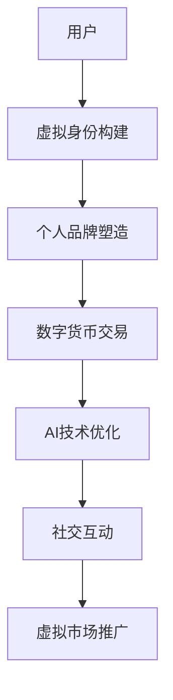

                 

在人工智能（AI）飞速发展的今天，虚拟身份市场正逐渐成为人们关注的热点。随着数字经济的蓬勃发展，个人品牌和虚拟身份的塑造对于职业发展、社交互动和市场推广变得尤为重要。本文将探讨AI时代的自我营销，分析虚拟身份市场的现状、核心概念、关键算法以及未来发展趋势。

> **关键词**：虚拟身份、自我营销、人工智能、个人品牌、数字货币

> **摘要**：本文旨在探讨AI时代虚拟身份市场的形成与发展，分析虚拟身份的核心概念与联系，深入探讨关键算法原理和应用，结合实际项目实践和未来应用场景，为读者提供一份全面的技术指南。

## 1. 背景介绍

### 1.1 虚拟身份市场的兴起

虚拟身份市场的兴起源于数字经济和社交网络的快速发展。在互联网时代，人们逐渐意识到个人品牌的重要性，而虚拟身份成为个人品牌的重要载体。虚拟身份不仅是一种在线身份标识，更是个人在网络世界中的形象和声誉。随着虚拟现实（VR）和增强现实（AR）技术的普及，虚拟身份逐渐脱离传统的2D头像，变得更加立体和个性化。

### 1.2 AI技术的推动

人工智能技术的发展为虚拟身份市场带来了巨大的变革。通过深度学习、自然语言处理和图像识别等技术，AI能够帮助用户构建和优化虚拟身份，实现个性化和智能化。同时，AI还在虚拟身份市场中扮演着关键角色，如自动推荐、内容生成和社交互动等。

### 1.3 数字货币的应用

数字货币的兴起为虚拟身份市场提供了新的动力。基于区块链技术的数字货币，如比特币和以太坊，为虚拟身份的认证、交易和价值传递提供了可靠的技术保障。通过数字货币，用户可以在虚拟身份市场中实现更便捷、安全和高效的互动。

## 2. 核心概念与联系

### 2.1 虚拟身份

虚拟身份是指用户在网络环境中使用的身份标识，通常包括头像、昵称、个人简介等信息。虚拟身份不仅用于社交互动，还代表个人在网络世界中的声誉和形象。

### 2.2 个人品牌

个人品牌是个人在职场、社交和市场中建立的独特形象和声誉。虚拟身份是个人品牌的重要组成部分，通过虚拟身份的塑造，个人可以在网络世界中展示自己的专业能力、兴趣爱好和价值观念。

### 2.3 数字货币

数字货币是一种基于区块链技术的加密货币，具有去中心化、匿名性和安全性等特点。在虚拟身份市场中，数字货币用于虚拟身份的认证、交易和价值传递。

### 2.4 AI技术

AI技术是虚拟身份市场的重要驱动力。通过AI技术，用户可以构建和优化虚拟身份，实现个性化和智能化。同时，AI技术还在虚拟身份市场中提供自动推荐、内容生成和社交互动等服务。

### 2.5 Mermaid 流程图



## 3. 核心算法原理 & 具体操作步骤

### 3.1 算法原理概述

虚拟身份市场的核心算法包括身份认证、内容生成和社交互动等。这些算法基于深度学习、自然语言处理和图像识别等技术，实现虚拟身份的构建和优化。

### 3.2 算法步骤详解

#### 3.2.1 身份认证

身份认证是虚拟身份市场的基石。通过加密算法和区块链技术，实现用户身份的认证和授权。具体步骤如下：

1. 用户注册：用户在虚拟身份平台注册账号，提供真实身份信息。
2. 身份认证：平台使用加密算法对用户身份信息进行加密存储。
3. 身份验证：用户登录时，平台使用相同加密算法验证用户身份。

#### 3.2.2 内容生成

内容生成是虚拟身份市场的核心功能。通过自然语言处理和图像识别技术，生成个性化的虚拟身份内容。具体步骤如下：

1. 数据采集：平台收集用户在社交网络、兴趣爱好等方面的数据。
2. 内容生成：使用自然语言处理和图像识别技术，生成个性化的虚拟身份内容。
3. 内容发布：用户可以在虚拟身份平台发布和分享自己的虚拟身份内容。

#### 3.2.3 社交互动

社交互动是虚拟身份市场的重要功能。通过社交网络和AI技术，实现用户之间的互动和交流。具体步骤如下：

1. 互动推荐：平台根据用户的虚拟身份和兴趣偏好，推荐合适的互动对象。
2. 内容互动：用户可以通过评论、点赞、分享等方式与其他用户互动。
3. 社交数据分析：平台分析用户互动数据，优化社交体验。

### 3.3 算法优缺点

#### 3.3.1 优点

1. 个性化和智能化：通过AI技术，实现虚拟身份的个性化定制和智能化推荐。
2. 安全性和隐私保护：通过区块链技术，确保用户虚拟身份的安全和隐私。
3. 活跃的社交互动：通过社交网络和AI技术，激发用户参与和互动的热情。

#### 3.3.2 缺点

1. 技术门槛：虚拟身份市场的核心算法涉及深度学习、自然语言处理和图像识别等技术，对开发人员有较高的技术要求。
2. 数据隐私风险：虽然区块链技术可以保障用户虚拟身份的安全，但数据隐私风险仍然存在。

### 3.4 算法应用领域

虚拟身份市场的核心算法在多个领域有广泛应用：

1. 社交网络：通过虚拟身份，实现用户之间的互动和交流。
2. 职场招聘：通过虚拟身份，展示求职者的专业能力和个人品牌。
3. 娱乐产业：通过虚拟身份，打造虚拟偶像和虚拟角色。
4. 教育培训：通过虚拟身份，提供个性化学习和互动体验。

## 4. 数学模型和公式 & 详细讲解 & 举例说明

### 4.1 数学模型构建

虚拟身份市场的数学模型包括用户行为分析、内容生成模型和社交网络模型等。以下是一个简单的数学模型示例：

$$
\text{UserModel} = f(\text{Data}, \text{AI})
$$

其中，$\text{Data}$代表用户数据，包括用户行为、兴趣偏好和社交网络等；$\text{AI}$代表人工智能算法，用于用户行为分析和内容生成。

### 4.2 公式推导过程

#### 4.2.1 用户行为分析

用户行为分析模型可以使用以下公式表示：

$$
\text{Behavior} = f(\text{Data}, \text{Time})
$$

其中，$\text{Data}$代表用户行为数据，包括浏览记录、评论、点赞等；$\text{Time}$代表时间维度，用于分析用户行为的时序特征。

#### 4.2.2 内容生成模型

内容生成模型可以使用以下公式表示：

$$
\text{Content} = f(\text{Data}, \text{Style}, \text{AI})
$$

其中，$\text{Data}$代表用户数据，包括用户兴趣偏好和社交网络等；$\text{Style}$代表内容风格，如文字、图片、视频等；$\text{AI}$代表人工智能算法，用于生成个性化内容。

#### 4.2.3 社交网络模型

社交网络模型可以使用以下公式表示：

$$
\text{Network} = f(\text{Users}, \text{Connections}, \text{AI})
$$

其中，$\text{Users}$代表用户集合；$\text{Connections}$代表用户之间的连接关系；$\text{AI}$代表人工智能算法，用于分析社交网络结构和用户互动。

### 4.3 案例分析与讲解

#### 4.3.1 案例背景

某虚拟身份平台希望提升用户活跃度和内容质量，决定采用人工智能技术进行用户行为分析和内容生成。

#### 4.3.2 案例分析

1. **用户行为分析**：平台收集用户浏览、评论和点赞等行为数据，通过自然语言处理和图像识别技术，分析用户兴趣偏好和时序特征。

2. **内容生成**：基于用户兴趣偏好和内容风格，平台使用人工智能算法生成个性化内容，如文字、图片和视频等。

3. **社交网络分析**：平台分析用户之间的连接关系，推荐合适的互动对象，提高用户活跃度。

#### 4.3.3 案例结论

通过人工智能技术的应用，虚拟身份平台成功提升了用户活跃度和内容质量，实现了用户和平台的共赢。

## 5. 项目实践：代码实例和详细解释说明

### 5.1 开发环境搭建

为了实现虚拟身份市场的核心算法，我们需要搭建一个合适的开发环境。以下是开发环境的搭建步骤：

1. **操作系统**：Windows、Linux或macOS
2. **编程语言**：Python
3. **开发工具**：PyCharm、Visual Studio Code
4. **依赖库**：TensorFlow、Keras、Scikit-learn、NumPy、Pandas

### 5.2 源代码详细实现

以下是一个简单的虚拟身份平台用户行为分析代码示例：

```python
import pandas as pd
from sklearn.feature_extraction.text import TfidfVectorizer
from sklearn.cluster import KMeans

# 加载用户行为数据
data = pd.read_csv('user_behavior_data.csv')

# 使用TF-IDF向量器进行文本特征提取
vectorizer = TfidfVectorizer()
X = vectorizer.fit_transform(data['content'])

# 使用K-Means算法进行聚类
kmeans = KMeans(n_clusters=5)
clusters = kmeans.fit_predict(X)

# 为每个用户分配聚类标签
data['cluster'] = clusters

# 分析用户兴趣偏好
interests = data.groupby('cluster')['content'].mean()

# 输出用户兴趣偏好
print(interests)
```

### 5.3 代码解读与分析

1. **数据加载**：首先加载用户行为数据，包括用户ID、内容、时间等。
2. **文本特征提取**：使用TF-IDF向量器对用户内容进行特征提取，将文本数据转换为数值向量。
3. **聚类分析**：使用K-Means算法对用户内容进行聚类，为每个用户分配聚类标签。
4. **用户兴趣偏好分析**：根据聚类结果，分析用户兴趣偏好，为用户提供个性化推荐。

### 5.4 运行结果展示

运行上述代码后，可以得到每个用户的兴趣偏好，如体育、科技、艺术等。根据这些兴趣偏好，平台可以为用户提供个性化内容推荐，提升用户体验。

## 6. 实际应用场景

### 6.1 社交网络

在社交网络中，虚拟身份市场可以为用户提供个性化推荐和互动体验。通过用户行为分析和内容生成，平台可以推荐用户感兴趣的内容，提高用户粘性。同时，虚拟身份市场还可以为社交网络提供身份认证和隐私保护功能。

### 6.2 职场招聘

在职场招聘中，虚拟身份市场可以帮助求职者展示个人品牌和技能。通过虚拟身份，求职者可以展示自己的专业能力、工作经验和项目成果，吸引招聘方的注意。同时，招聘方可以通过虚拟身份市场筛选合适的候选人，提高招聘效率。

### 6.3 娱乐产业

在娱乐产业中，虚拟身份市场可以打造虚拟偶像和虚拟角色。通过虚拟身份，娱乐产业可以为用户提供个性化的互动体验，提高用户满意度。同时，虚拟身份市场还可以为娱乐产业提供数字货币交易和价值传递功能，实现商业模式创新。

### 6.4 未来应用展望

未来，虚拟身份市场将在更多领域得到应用。随着技术的不断发展，虚拟身份将更加智能化和个性化。同时，虚拟身份市场还将与数字货币、区块链等新兴技术相结合，为用户提供更安全、高效和便捷的服务。在AI技术的推动下，虚拟身份市场将成为数字经济的重要组成部分。

## 7. 工具和资源推荐

### 7.1 学习资源推荐

1. **《深度学习》**：Goodfellow, Bengio, Courville著，全面介绍深度学习的基础知识和技术。
2. **《机器学习实战》**：Peter Harrington著，通过实际案例教授机器学习的应用技巧。
3. **《区块链技术指南》**：韩磊著，深入讲解区块链技术的原理和应用。

### 7.2 开发工具推荐

1. **PyCharm**：优秀的Python开发工具，提供丰富的插件和功能。
2. **TensorFlow**：Google开源的深度学习框架，支持多种神经网络架构。
3. **Keras**：基于TensorFlow的高级深度学习框架，简化模型搭建和训练。

### 7.3 相关论文推荐

1. **《深度学习中的迁移学习》**：Yan et al.（2016），介绍迁移学习在深度学习中的应用。
2. **《区块链技术综述》**：Li et al.（2016），全面介绍区块链技术的原理和应用。
3. **《虚拟现实与增强现实技术综述》**：Guzelis et al.（2017），探讨虚拟现实和增强现实技术的发展趋势。

## 8. 总结：未来发展趋势与挑战

### 8.1 研究成果总结

虚拟身份市场作为AI时代的重要应用领域，取得了显著的研究成果。通过深度学习、自然语言处理和图像识别等技术，虚拟身份市场实现了用户行为的个性化分析和内容生成。同时，区块链技术的应用为虚拟身份市场提供了安全、高效和价值传递的功能。

### 8.2 未来发展趋势

未来，虚拟身份市场将在更多领域得到应用，如社交网络、职场招聘、娱乐产业等。随着技术的不断发展，虚拟身份将更加智能化和个性化。同时，虚拟身份市场还将与数字货币、区块链等新兴技术相结合，为用户提供更安全、高效和便捷的服务。

### 8.3 面临的挑战

虚拟身份市场在发展过程中仍面临一些挑战。首先，技术门槛较高，需要专业的技术团队进行开发和维护。其次，数据隐私和安全风险仍然存在，需要采取有效的措施进行保障。此外，虚拟身份市场的发展还需要行业规范和法律法规的支持。

### 8.4 研究展望

未来，虚拟身份市场的研究将重点关注以下几个方面：

1. **智能化与个性化**：通过深度学习和自然语言处理技术，进一步提升虚拟身份的智能化和个性化水平。
2. **安全与隐私**：采取有效的技术手段和法律法规，保障用户虚拟身份的安全和隐私。
3. **跨领域应用**：探索虚拟身份市场在其他领域的应用，如教育、医疗等，实现更广泛的价值传递。

## 9. 附录：常见问题与解答

### 9.1 虚拟身份市场是什么？

虚拟身份市场是一个基于AI技术和区块链技术的平台，用于构建、优化和交易虚拟身份。通过虚拟身份，用户可以在网络世界中展示自己的个人品牌和形象，实现个性化营销和社交互动。

### 9.2 虚拟身份市场有哪些优点？

虚拟身份市场具有以下优点：

1. 个性化和智能化：通过AI技术，实现虚拟身份的个性化定制和智能化推荐。
2. 安全性和隐私保护：通过区块链技术，确保用户虚拟身份的安全和隐私。
3. 活跃的社交互动：通过社交网络和AI技术，激发用户参与和互动的热情。
4. 数字货币交易：通过数字货币，实现虚拟身份的价值传递和交易。

### 9.3 虚拟身份市场有哪些缺点？

虚拟身份市场存在以下缺点：

1. 技术门槛：核心算法涉及深度学习、自然语言处理和图像识别等技术，对开发人员有较高的技术要求。
2. 数据隐私风险：虽然区块链技术可以保障用户虚拟身份的安全，但数据隐私风险仍然存在。

### 9.4 虚拟身份市场有哪些应用领域？

虚拟身份市场在以下领域有广泛应用：

1. 社交网络：通过虚拟身份，实现用户之间的互动和交流。
2. 职场招聘：通过虚拟身份，展示求职者的专业能力和个人品牌。
3. 娱乐产业：通过虚拟身份，打造虚拟偶像和虚拟角色。
4. 教育培训：通过虚拟身份，提供个性化学习和互动体验。

### 9.5 如何在虚拟身份市场中保护个人隐私？

在虚拟身份市场中保护个人隐私，可以采取以下措施：

1. 使用强密码：确保账号安全。
2. 限制个人信息：仅在必要时提供个人信息。
3. 查看隐私政策：了解平台隐私政策，避免不必要的隐私泄露。
4. 使用VPN：保护网络通信安全。
5. 及时更新安全软件：防止恶意攻击和病毒感染。

---

### 附录

**作者**：禅与计算机程序设计艺术 / Zen and the Art of Computer Programming

本文旨在探讨AI时代的虚拟身份市场，分析其核心概念、算法原理和应用领域，为读者提供一份全面的技术指南。在未来的发展中，虚拟身份市场将继续发挥重要作用，为个人品牌建设和数字经济的发展提供有力支持。希望本文能为读者在虚拟身份市场的探索和实践提供有益的启示。

