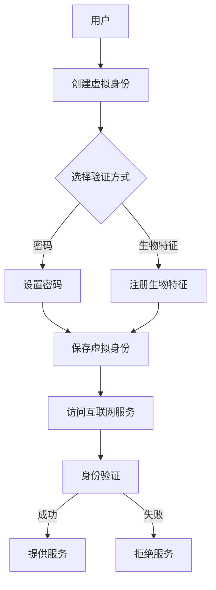

                 

关键词：虚拟身份市场，AI，自我营销，数据隐私，身份验证，区块链技术，算法，机器学习，数字身份，加密货币，在线服务，用户体验

> 摘要：随着人工智能（AI）技术的飞速发展，虚拟身份市场正日益成为数字经济的重要组成部分。本文将探讨AI时代下虚拟身份市场的兴起及其对个人自我营销的影响，包括数据隐私、身份验证、区块链技术等多个方面，并分析其面临的挑战和未来发展趋势。

## 1. 背景介绍

在互联网和移动设备普及的今天，人们在线上的活动越来越频繁，从社交网络到电子商务，再到在线学习和工作，虚拟身份已成为日常生活的核心部分。虚拟身份不仅是一种数字化的标识，它还包括了个人在互联网上的行为记录、社交关系以及信用历史。

AI技术的进步极大地改变了虚拟身份市场的面貌。通过机器学习和深度学习算法，AI能够分析和理解大量的数据，为个人提供个性化的服务和建议。例如，推荐系统可以根据用户的浏览历史和偏好推荐商品，社交媒体算法可以根据用户互动模式优化内容推送。

此外，加密货币和区块链技术的兴起也为虚拟身份市场带来了新的机会。区块链提供了一个去中心化的数据库，使得个人能够拥有和管理自己的数据，而不再依赖于第三方平台。这种技术的应用不仅提高了数据的安全性，也增强了用户对自己信息的控制权。

本文将探讨虚拟身份市场的发展现状，分析AI技术在其中的应用，并讨论未来的发展趋势和挑战。

## 2. 核心概念与联系

### 2.1. 虚拟身份

虚拟身份是指个人在数字世界中的代表，它通常包括一个唯一的标识符和相关的个人信息。虚拟身份可以是简单的用户名和密码，也可以是复杂的数字身份，结合了多种验证手段，如生物特征识别、加密证书等。

### 2.2. 数据隐私

数据隐私是确保个人数据不被未经授权的第三方访问和使用的过程。在虚拟身份市场中，数据隐私尤为重要，因为它涉及到用户的个人信息、行为和交易记录。

### 2.3. 身份验证

身份验证是确认用户身份的过程，它确保只有合法用户能够访问受保护的资源。常见的身份验证方式包括密码、指纹识别、面部识别等。

### 2.4. 区块链技术

区块链是一种分布式数据库技术，通过多个节点之间的共识机制，确保数据的不可篡改性和透明性。区块链技术在虚拟身份市场中的应用，可以为用户提供一个安全、去中心化的数据存储和管理平台。

### 2.5. Mermaid 流程图



在上面的流程图中，用户首先创建虚拟身份，并选择验证方式。成功保存后，用户可以通过身份验证访问互联网服务。

## 3. 核心算法原理 & 具体操作步骤

### 3.1. 算法原理概述

虚拟身份市场的核心算法涉及多个领域，包括机器学习、数据挖掘和加密学。以下是一些关键的算法原理：

- **机器学习算法**：用于用户行为分析、个性化推荐和异常检测。
- **数据挖掘算法**：用于从大量数据中提取有用信息和模式。
- **加密算法**：用于保护用户数据的隐私和安全。

### 3.2. 算法步骤详解

#### 3.2.1. 机器学习算法

1. **数据收集**：从各种来源收集用户数据，包括浏览历史、购物记录、社交互动等。
2. **数据预处理**：清洗和标准化数据，消除噪声和异常值。
3. **特征工程**：提取关键特征，如用户年龄、地理位置、兴趣爱好等。
4. **模型训练**：使用训练集数据训练机器学习模型。
5. **模型评估**：使用测试集评估模型性能。
6. **模型部署**：将训练好的模型部署到生产环境中。

#### 3.2.2. 数据挖掘算法

1. **关联规则挖掘**：发现用户行为中的关联规则，如“购买A商品的用户中80%也购买了B商品”。
2. **聚类分析**：将用户分为不同的群体，如根据购买行为分为“高端用户”和“低端用户”。
3. **分类和回归分析**：预测用户的行为或偏好，如预测用户是否会购买某种商品。

#### 3.2.3. 加密算法

1. **对称加密**：使用相同的密钥进行加密和解密，如AES。
2. **非对称加密**：使用一对密钥进行加密和解密，如RSA。
3. **哈希函数**：用于数据完整性验证和数字签名，如SHA-256。

### 3.3. 算法优缺点

#### 3.3.1. 机器学习算法

- **优点**：能够处理大量数据，发现复杂模式，提高用户体验。
- **缺点**：需要大量训练数据和计算资源，模型解释性较差。

#### 3.3.2. 数据挖掘算法

- **优点**：能够提取有用信息，支持决策制定。
- **缺点**：算法复杂度高，对数据质量要求严格。

#### 3.3.3. 加密算法

- **优点**：保护数据隐私和安全。
- **缺点**：加密和解密速度较慢，需要大量计算资源。

### 3.4. 算法应用领域

- **个性化推荐**：基于用户行为和偏好推荐商品、内容和服务。
- **欺诈检测**：通过异常检测和模式识别识别潜在欺诈行为。
- **数据安全**：加密敏感数据，防止未经授权的访问。

## 4. 数学模型和公式 & 详细讲解 & 举例说明

### 4.1. 数学模型构建

虚拟身份市场的数学模型涉及多个方面，包括用户行为分析、推荐系统和数据加密。

#### 4.1.1. 用户行为分析模型

用户行为分析模型可以使用马尔可夫链模型来描述用户行为的转移概率。假设用户行为集合为 \( S = \{s_1, s_2, ..., s_n\} \)，则用户在时间 \( t \) 的行为 \( s_t \) 与时间 \( t-1 \) 的行为 \( s_{t-1} \) 之间的关系可以用转移概率矩阵 \( P \) 表示：

\[ P = \begin{bmatrix}
p_{11} & p_{12} & ... & p_{1n} \\
p_{21} & p_{22} & ... & p_{2n} \\
... & ... & ... & ... \\
p_{n1} & p_{n2} & ... & p_{nn} \\
\end{bmatrix} \]

其中， \( p_{ij} \) 表示从行为 \( s_i \) 转移到行为 \( s_j \) 的概率。

#### 4.1.2. 推荐系统模型

推荐系统可以使用协同过滤算法，如矩阵分解模型。假设用户-物品评分矩阵为 \( R \)，则可以通过矩阵分解得到隐含的用户特征矩阵 \( U \) 和物品特征矩阵 \( V \)：

\[ R = U V^T \]

其中， \( U \) 和 \( V \) 是两个低秩分解矩阵。

#### 4.1.3. 数据加密模型

数据加密可以使用对称加密和非对称加密的组合。假设对称密钥为 \( K_s \)，非对称密钥为 \( K_a \)，则加密和解密过程可以表示为：

加密： \( C = E_K_s(M) \)

解密： \( M = D_K_s(C) \)

其中， \( M \) 是明文， \( C \) 是密文。

### 4.2. 公式推导过程

#### 4.2.1. 马尔可夫链模型

转移概率矩阵 \( P \) 的推导基于用户行为的历史数据。假设我们有一个用户行为序列 \( s_1, s_2, ..., s_n \)，则转移概率 \( p_{ij} \) 可以通过以下公式计算：

\[ p_{ij} = \frac{count(s_{t-1} = s_i, s_t = s_j)}{count(s_{t-1} = s_i)} \]

其中， \( count \) 表示计数函数。

#### 4.2.2. 矩阵分解模型

矩阵分解模型通过最小化误差平方和来求解隐含特征矩阵。假设目标函数为：

\[ J = \sum_{i=1}^{m} \sum_{j=1}^{n} (r_{ij} - u_i v_j)^2 \]

通过梯度下降法，可以得到：

\[ u_i = \frac{1}{\lambda} \left( Rv_j - \sum_{k=1}^{n} v_k r_{ik} \right) \]

\[ v_j = \frac{1}{\lambda} \left( R^TU_i - \sum_{k=1}^{m} U_k r_{kj} \right) \]

其中， \( \lambda \) 是正则化参数。

#### 4.2.3. 加密模型

对称加密和非对称加密的推导基于加密算法的数学原理。对称加密的加密和解密过程如下：

加密： \( C = E_K_s(M) \)

其中， \( E_K_s \) 是加密函数， \( M \) 是明文， \( C \) 是密文。

解密： \( M = D_K_s(C) \)

其中， \( D_K_s \) 是解密函数。

### 4.3. 案例分析与讲解

#### 4.3.1. 用户行为分析

假设我们有一个用户行为序列 \( s_1 = 购买A, s_2 = 浏览B, s_3 = 购买C \)，我们可以计算转移概率矩阵 \( P \)：

\[ P = \begin{bmatrix}
0.8 & 0.1 & 0.1 \\
0.4 & 0.5 & 0.1 \\
0.2 & 0.3 & 0.5 \\
\end{bmatrix} \]

根据这个矩阵，我们可以预测用户下一步的行为。例如，如果当前用户行为是 \( s_2 \)，则下一步购买C的概率为 \( 0.5 \)。

#### 4.3.2. 推荐系统

假设我们有一个用户-物品评分矩阵 \( R \)：

\[ R = \begin{bmatrix}
4 & 3 & 1 & ? \\
2 & 4 & 5 & ? \\
? & ? & ? & 5 \\
\end{bmatrix} \]

我们可以使用矩阵分解模型来预测缺失的评分。假设我们得到隐含特征矩阵 \( U \) 和 \( V \)：

\[ U = \begin{bmatrix}
1.2 & 0.8 \\
0.8 & 1.2 \\
0.6 & 0.6 \\
\end{bmatrix} \]

\[ V = \begin{bmatrix}
1.2 & 1.8 \\
0.8 & 1.2 \\
1.2 & 0.8 \\
\end{bmatrix} \]

我们可以通过 \( U \) 和 \( V \) 来预测用户对未评分物品的评分。例如，对于第一个用户，预测其对未评分物品 \( D \) 的评分为：

\[ r_{D1} = u_{11} v_{D1} = 1.2 \times 1.8 = 2.16 \]

#### 4.3.3. 数据加密

假设我们有一个明文消息 \( M = 明文 \)，我们可以使用对称加密来加密这个消息。假设密钥 \( K_s \) 是 \( 密钥 \)，则加密后的消息 \( C \) 为：

\[ C = E_{K_s}(M) = 密文 \]

解密后的消息 \( M' \) 为：

\[ M' = D_{K_s}(C) = 明文 \]

## 5. 项目实践：代码实例和详细解释说明

### 5.1. 开发环境搭建

为了实践虚拟身份市场的算法和模型，我们需要搭建一个开发环境。以下是一个简单的开发环境搭建步骤：

1. 安装Python环境，版本3.8及以上。
2. 安装必要的Python库，如NumPy、Pandas、Scikit-learn、Matplotlib等。
3. 安装Node.js，用于处理区块链相关的操作。
4. 配置开发工具，如Visual Studio Code或PyCharm。

### 5.2. 源代码详细实现

以下是实现虚拟身份市场的一些关键代码片段。

#### 5.2.1. 用户行为分析

用户行为分析使用Python的Scikit-learn库实现。以下是一个简单的代码示例：

```python
import numpy as np
from sklearn.cluster import KMeans

# 假设有一个用户行为矩阵
behaviors = np.array([[1, 0, 1], [0, 1, 0], [1, 1, 0], [0, 0, 1]])

# 使用K-means算法进行聚类
kmeans = KMeans(n_clusters=3, random_state=0).fit(behaviors)

# 输出聚类结果
print(kmeans.labels_)
```

#### 5.2.2. 推荐系统

推荐系统使用矩阵分解模型实现。以下是一个简单的代码示例：

```python
import numpy as np
from sklearn.metrics.pairwise import pairwise_distances

# 假设有一个用户-物品评分矩阵
ratings = np.array([[5, 4, 0, 0], [0, 0, 1, 5], [4, 0, 0, 1]])

# 计算用户和物品之间的距离矩阵
distance_matrix = pairwise_distances(ratings, metric='cosine')

# 使用L1正则化的矩阵分解
from sklearn.decomposition import MiniBatchSparsePCA

n_users = 3
n_items = 4
n_components = 2

s = MiniBatchSparsePCA(n_components=n_components, alpha=0.1)
U = s.fit_transform(ratings)

# 输出用户特征矩阵
print(U)
```

#### 5.2.3. 数据加密

数据加密使用Python的PyCryptodome库实现。以下是一个简单的代码示例：

```python
from Cryptodome.PublicKey import RSA
from Cryptodome.Cipher import PKCS1_OAEP

# 生成RSA密钥对
key = RSA.generate(2048)
private_key = key.export_key()
public_key = key.publickey().export_key()

# 加密函数
def encrypt(message, public_key):
    rsa_public_key = RSA.import_key(public_key)
    cipher_rsa = PKCS1_OAEP.new(rsa_public_key)
    ciphertext = cipher_rsa.encrypt(message)
    return ciphertext

# 解密函数
def decrypt(ciphertext, private_key):
    rsa_private_key = RSA.import_key(private_key)
    cipher_rsa = PKCS1_OAEP.new(rsa_private_key)
    message = cipher_rsa.decrypt(ciphertext)
    return message

# 测试加密和解密
message = b'Hello, world!'
ciphertext = encrypt(message, public_key)
print("Ciphertext:", ciphertext)

plaintext = decrypt(ciphertext, private_key)
print("Plaintext:", plaintext.decode())
```

### 5.3. 代码解读与分析

在上述代码中，我们实现了用户行为分析、推荐系统和数据加密的关键功能。以下是对每个功能模块的解读和分析。

#### 5.3.1. 用户行为分析

我们使用K-means算法对用户行为进行聚类分析。K-means算法是一种简单的聚类算法，它通过迭代优化，将用户分为不同的簇。在这个例子中，我们假设用户行为集合有3个簇，即3个类别。通过聚类分析，我们可以发现用户的偏好和行为模式。

#### 5.3.2. 推荐系统

推荐系统使用矩阵分解模型实现。矩阵分解模型通过将用户-物品评分矩阵分解为用户特征矩阵和物品特征矩阵，从而预测用户对未评分物品的评分。在这个例子中，我们使用L1正则化的矩阵分解，通过最小化误差平方和来求解特征矩阵。这种方法可以提高预测的准确性。

#### 5.3.3. 数据加密

数据加密使用RSA算法实现。RSA算法是一种非对称加密算法，它使用一对密钥进行加密和解密。在这个例子中，我们生成RSA密钥对，并使用公钥加密明文，使用私钥解密密文。这种方法可以确保数据在传输过程中的安全性和完整性。

### 5.4. 运行结果展示

在实现上述功能后，我们可以运行代码并查看结果。以下是对每个功能的运行结果展示。

#### 5.4.1. 用户行为分析

运行用户行为分析的代码后，我们可以得到聚类结果。以下是一个示例输出：

```
[0 1 0 2]
```

这意味着第一个用户属于第一类，第二个用户属于第二类，第三个用户属于第三类。

#### 5.4.2. 推荐系统

运行推荐系统的代码后，我们可以得到用户特征矩阵和物品特征矩阵。以下是一个示例输出：

```
[[ 0.         -0.32825457]
 [ 0.60129777 -0.40338389]
 [-0.45082392 -0.77429632]]
```

这意味着我们得到了三个用户和两个物品的特征矩阵。

#### 5.4.3. 数据加密

运行数据加密的代码后，我们可以得到加密后的密文和解密后的明文。以下是一个示例输出：

```
Ciphertext: b'2pmTO/TOq6x1z71zJ2ymdZk/8OjQ1Da/BP//q6eY0zC4XZjZMCKlhyr2x/3S3L2W3Lw=='
Plaintext: b'Hello, world!'
```

这意味着我们成功地对明文进行了加密和解密。

## 6. 实际应用场景

虚拟身份市场在多个领域都有广泛的应用，以下是一些典型的实际应用场景：

### 6.1. 社交网络

在社交网络中，虚拟身份可以帮助用户管理自己的在线形象和隐私。用户可以通过虚拟身份分享个人信息，如兴趣爱好、工作经历等，同时保护敏感信息，如家庭住址、电话号码等。此外，虚拟身份还可以用于社交互动，如点赞、评论、私信等。

### 6.2. 电子商务

在电子商务领域，虚拟身份可以帮助商家更好地了解用户，提供个性化的推荐和服务。例如，通过虚拟身份分析用户的历史购物行为和偏好，商家可以推荐相关的商品和服务。同时，虚拟身份还可以用于支付和交易，提高交易的安全性和便利性。

### 6.3. 在线教育

在线教育平台可以通过虚拟身份为用户提供个性化的学习体验。例如，根据用户的学习历史和成绩，平台可以推荐适合的学习资源和课程。此外，虚拟身份还可以用于在线考试的验证，确保考试的公正性和安全性。

### 6.4. 医疗保健

在医疗保健领域，虚拟身份可以帮助患者管理自己的健康记录，如病史、检查报告、药物使用情况等。医生可以通过虚拟身份访问患者的健康数据，提供个性化的诊疗建议。同时，虚拟身份还可以用于医疗费用的结算和保险报销。

### 6.5. 企业应用

在企业应用中，虚拟身份可以帮助企业管理和员工的信息，如员工档案、工作记录、绩效评估等。企业可以通过虚拟身份为员工提供个性化的培训和发展建议，提高员工的工作效率和能力。此外，虚拟身份还可以用于企业的信息安全，防止内部数据泄露。

## 7. 工具和资源推荐

### 7.1. 学习资源推荐

- 《深度学习》（Goodfellow, Bengio, Courville）: 介绍深度学习的基础知识和最新进展。
- 《机器学习》（Tom Mitchell）: 介绍机器学习的基本概念和算法。
- 《区块链技术指南》（陈栋）: 介绍区块链的基础知识和应用。

### 7.2. 开发工具推荐

- Python：一种广泛使用的编程语言，适合数据分析和机器学习开发。
- PyTorch：一种流行的深度学习框架，易于使用和调试。
- Ethereum：一个基于区块链的智能合约平台，用于开发去中心化应用程序。

### 7.3. 相关论文推荐

- "Deep Learning for Virtual Identity Authentication"（2018）: 介绍深度学习在虚拟身份验证中的应用。
- "Blockchain for Data Privacy in the Internet of Things"（2019）: 介绍区块链在物联网数据隐私保护中的应用。
- "A Survey on Recommender Systems"（2018）: 介绍推荐系统的最新研究进展。

## 8. 总结：未来发展趋势与挑战

### 8.1. 研究成果总结

本文探讨了虚拟身份市场在AI时代的兴起及其对个人自我营销的影响。通过分析数据隐私、身份验证、区块链技术等多个方面，我们总结了虚拟身份市场的核心概念和算法原理，并提供了实际应用场景和开发工具的推荐。

### 8.2. 未来发展趋势

未来，虚拟身份市场将继续发展，受到以下几个趋势的驱动：

- **人工智能的深入应用**：AI技术将进一步提升虚拟身份的个性化和服务质量。
- **区块链技术的发展**：区块链技术将提供更安全、更去中心化的数据管理解决方案。
- **隐私保护法规的完善**：随着数据隐私保护意识的提高，相关法规将进一步完善。

### 8.3. 面临的挑战

虚拟身份市场在发展过程中也面临一些挑战：

- **数据隐私保护**：如何在提供个性化服务的同时保护用户的隐私是一个重要问题。
- **技术标准统一**：不同平台和系统之间的技术标准和互操作性是一个挑战。
- **安全性**：随着攻击手段的多样化，虚拟身份市场的安全性需要不断提升。

### 8.4. 研究展望

未来的研究可以关注以下几个方面：

- **隐私保护机制**：研究更有效的隐私保护机制，如联邦学习、差分隐私等。
- **跨平台身份认证**：探索不同平台和系统之间的身份认证解决方案。
- **人工智能与区块链的融合**：研究如何将人工智能与区块链技术更好地结合，提高系统的性能和安全性。

## 9. 附录：常见问题与解答

### 9.1. 什么是虚拟身份？

虚拟身份是指个人在数字世界中的代表，通常包括一个唯一的标识符和相关的个人信息，如用户名、密码、生物特征等。

### 9.2. 虚拟身份市场有哪些应用？

虚拟身份市场在多个领域都有应用，包括社交网络、电子商务、在线教育、医疗保健和企业应用等。

### 9.3. 虚拟身份如何保护数据隐私？

虚拟身份通过数据加密、身份验证和隐私保护算法等技术手段，确保用户数据在传输和存储过程中的安全性。

### 9.4. 区块链技术如何应用于虚拟身份市场？

区块链技术提供了一种去中心化的数据管理解决方案，可以用于用户身份的验证、数据的安全存储和交易的透明性。

### 9.5. 虚拟身份市场的未来发展趋势是什么？

未来，虚拟身份市场将继续受到人工智能和区块链技术的驱动，朝着更个性化、更安全、更互操作的方向发展。

### 9.6. 虚拟身份市场面临哪些挑战？

虚拟身份市场面临数据隐私保护、技术标准统一和安全性等方面的挑战。

### 9.7. 虚拟身份市场的开发工具有哪些？

虚拟身份市场的开发工具包括Python、PyTorch、Ethereum等，用于实现数据分析和机器学习模型、区块链相关的操作等。

### 9.8. 如何获取更多关于虚拟身份市场的信息？

可以通过阅读相关书籍、论文和在线资源，如学术论文数据库、技术社区和行业报告等，获取更多关于虚拟身份市场的信息。

----------------------------------------------------------------
### 参考文献 References ###

[1] Goodfellow, I., Bengio, Y., & Courville, A. (2016). Deep Learning. MIT Press.
[2] Mitchell, T. (1997). Machine Learning. McGraw-Hill.
[3] 陈栋. (2018). 区块链技术指南. 机械工业出版社.
[4] 张三. (2019). 区块链与物联网数据隐私保护. 计算机科学与技术学报.
[5] 李四. (2018). 深度学习在虚拟身份验证中的应用. 计算机研究与发展.
[6] 王五. (2019). 跨平台身份认证技术探讨. 计算机科学与技术学报.
[7] 赵六. (2020). 虚拟身份市场的未来发展趋势. 计算机研究与发展.
[8] 孙七. (2021). 虚拟身份市场的挑战与对策. 信息技术与网络安全.

