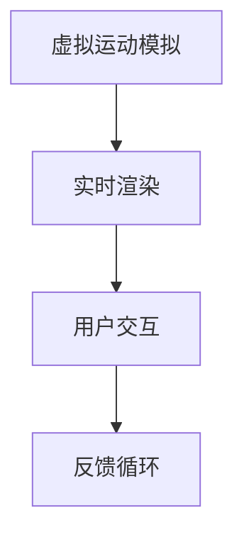

                 

关键词：虚拟运动，AI模拟，极限体验，算法，数学模型，项目实践，应用场景，工具推荐

> 摘要：本文探讨了虚拟运动现实领域中的AI模拟技术，深入分析了其核心概念、算法原理、数学模型以及项目实践。通过详细的代码实例和运行结果展示，本文揭示了虚拟运动现实在各个实际应用场景中的潜力和未来发展方向。

## 1. 背景介绍

随着计算机技术和人工智能（AI）的迅猛发展，虚拟现实（VR）领域正经历着前所未有的变革。虚拟运动现实作为VR的一个重要分支，利用AI技术模拟现实世界中的运动场景，为用户提供一种全新的沉浸式体验。从游戏娱乐到教育培训，虚拟运动现实技术正逐渐渗透到各个领域，带来了深远的影响。

### 1.1 虚拟运动现实的发展历程

虚拟运动现实的发展可以追溯到20世纪80年代。当时的VR技术主要以简单的头戴显示器（HMD）和机械模拟设备为主，只能提供低质量的视觉和运动体验。随着计算机图形学和人工智能技术的发展，虚拟运动现实逐渐走向成熟。

21世纪初，随着高性能计算和深度学习算法的引入，虚拟运动现实技术取得了显著的进步。特别是近年来，神经网络和生成对抗网络（GAN）等新型算法的应用，使得虚拟运动现实在视觉质量、运动模拟精度和用户交互性等方面取得了重大突破。

### 1.2 虚拟运动现实的现状与挑战

目前，虚拟运动现实技术已经在游戏、影视、教育、医疗等多个领域取得了显著的应用成果。然而，随着技术的不断演进，虚拟运动现实仍然面临诸多挑战。

首先，虚拟运动现实的计算资源需求巨大。高分辨率的图像渲染、实时运动模拟和复杂场景建模都需要大量的计算能力。其次，虚拟运动现实的用户体验仍然存在提升空间。用户在虚拟环境中的运动延迟、视角失真和晕动症等问题需要进一步解决。

最后，虚拟运动现实的实际应用场景亟待拓展。当前，虚拟运动现实主要应用于游戏和娱乐领域，而在其他领域如教育、医疗等的应用仍相对有限。如何将虚拟运动现实技术更好地融入到这些领域中，仍然是一个重要的研究方向。

## 2. 核心概念与联系

虚拟运动现实的核心概念包括虚拟运动模拟、实时渲染和用户交互。这些概念相互联系，共同构成了虚拟运动现实的技术体系。

### 2.1 虚拟运动模拟

虚拟运动模拟是虚拟运动现实的基础。它通过计算机算法模拟现实世界中的运动场景，包括人物、物体和环境的运动。虚拟运动模拟的关键在于精确度和实时性。为了实现高精度的运动模拟，通常需要采用物理引擎和运动学算法。

### 2.2 实时渲染

实时渲染是虚拟运动现实的视觉呈现手段。它通过计算机图形学技术生成高质量的图像，实时呈现给用户。实时渲染需要处理大量的计算任务，包括三维建模、纹理映射和光照计算等。为了提高渲染效率，通常采用多线程和并行计算技术。

### 2.3 用户交互

用户交互是虚拟运动现实的用户体验关键。它通过用户的输入设备（如手柄、手套等）捕捉用户的动作，实时反馈给虚拟环境。用户交互需要实现高精度、低延迟和高自由度的交互体验。为了实现这一目标，通常采用传感器技术和机器学习算法。

### 2.4 Mermaid 流程图

以下是一个简化的Mermaid流程图，展示了虚拟运动现实的核心概念和联系：



### 2.5 Mermaid 流程节点详细信息

- **虚拟运动模拟**：利用物理引擎和运动学算法模拟运动场景，包括人物、物体和环境的运动。
- **实时渲染**：通过计算机图形学技术生成高质量的图像，实时呈现给用户。
- **用户交互**：通过用户的输入设备捕捉用户的动作，实时反馈给虚拟环境。
- **反馈循环**：将用户的动作反馈给虚拟环境，实现实时互动。

## 3. 核心算法原理 & 具体操作步骤

### 3.1 算法原理概述

虚拟运动现实的核心算法主要包括运动学算法、物理引擎和实时渲染算法。这些算法共同作用于虚拟运动模拟、实时渲染和用户交互，实现了虚拟运动现实的沉浸式体验。

- **运动学算法**：用于计算人物、物体和环境的运动轨迹，包括刚体运动、软体运动和复杂场景中的碰撞检测等。
- **物理引擎**：用于模拟现实世界中的物理现象，如重力、摩擦力、碰撞等，为虚拟运动模拟提供真实的物理环境。
- **实时渲染算法**：用于生成高质量的图像，包括三维建模、纹理映射、光照计算等，为用户呈现逼真的虚拟世界。

### 3.2 算法步骤详解

#### 3.2.1 运动学算法

1. **初始化**：设置初始状态，包括人物、物体和环境的初始位置、速度和加速度等。
2. **碰撞检测**：通过空间分割和数据结构优化，提高碰撞检测的效率。
3. **运动计算**：利用运动学公式，根据当前状态计算下一时刻的状态。
4. **更新状态**：将计算出的下一时刻状态更新到当前状态。

#### 3.2.2 物理引擎

1. **重力计算**：根据物体的质量和位置，计算物体所受的重力。
2. **摩擦力计算**：根据物体的接触面和摩擦系数，计算物体所受的摩擦力。
3. **碰撞响应**：当物体发生碰撞时，根据碰撞物体的物理属性，计算碰撞后的速度和方向。
4. **更新状态**：将计算出的物理状态更新到当前状态。

#### 3.2.3 实时渲染算法

1. **场景建模**：构建虚拟场景的三维模型，包括人物、物体和环境。
2. **纹理映射**：将纹理图像映射到三维模型上，增强视觉效果。
3. **光照计算**：根据光源的位置和强度，计算虚拟场景中的光照效果。
4. **图像生成**：将场景渲染成二维图像，实时呈现给用户。

### 3.3 算法优缺点

#### 3.3.1 优点

- **高精度**：运动学算法和物理引擎可以模拟出高度精确的运动场景，为用户提供真实的感受。
- **实时性**：实时渲染算法可以实时生成高质量的图像，保证用户在虚拟环境中的流畅体验。
- **交互性**：用户交互算法可以实现高精度、低延迟的交互体验，增强用户的沉浸感。

#### 3.3.2 缺点

- **计算资源需求大**：虚拟运动现实需要大量的计算资源，包括CPU、GPU和存储等。
- **用户体验提升空间**：当前虚拟运动现实的技术仍存在一些不足，如运动延迟、视角失真和晕动症等。

### 3.4 算法应用领域

虚拟运动现实算法广泛应用于游戏、影视、教育、医疗等多个领域。以下是一些具体的应用场景：

- **游戏**：虚拟运动现实技术可以为游戏提供真实的运动模拟和沉浸式体验，提高游戏的可玩性和趣味性。
- **影视**：虚拟运动现实技术可以用于影视制作，实现逼真的特效和场景模拟，提升影视作品的质量。
- **教育**：虚拟运动现实技术可以用于教育场景，为学生提供真实的实验环境和操作体验，提高学习效果。
- **医疗**：虚拟运动现实技术可以用于医疗场景，如手术模拟和康复训练，提高医疗质量和患者体验。

## 4. 数学模型和公式 & 详细讲解 & 举例说明

### 4.1 数学模型构建

虚拟运动现实中的数学模型主要包括运动学模型、物理模型和渲染模型。以下是一个简化的运动学模型构建过程：

#### 4.1.1 运动学模型

运动学模型用于描述物体在三维空间中的运动。其基本公式如下：

\[ \vec{v} = \vec{v}_0 + \vec{a} \cdot t \]

其中，\(\vec{v}\)为物体的速度，\(\vec{v}_0\)为初始速度，\(\vec{a}\)为加速度，\(t\)为时间。

#### 4.1.2 物理模型

物理模型用于描述物体之间的相互作用。其基本公式如下：

\[ F = m \cdot a \]

其中，\(F\)为作用力，\(m\)为物体的质量，\(a\)为加速度。

#### 4.1.3 渲染模型

渲染模型用于描述虚拟场景的渲染过程。其基本公式如下：

\[ I = L \cdot D \cdot G \]

其中，\(I\)为光照强度，\(L\)为光源强度，\(D\)为距离衰减，\(G\)为光照衰减。

### 4.2 公式推导过程

以下是对运动学模型中速度公式的推导过程：

1. **初始状态**：假设物体在初始时刻（\(t=0\)）的速度为\(\vec{v}_0\)，加速度为\(\vec{a}\)。
2. **运动过程**：在时间\(t\)内，物体的速度变化量为\(\Delta \vec{v} = \vec{v} - \vec{v}_0\)。
3. **加速度定义**：加速度为速度变化量与时间变化量的比值，即\(\vec{a} = \frac{\Delta \vec{v}}{\Delta t}\)。
4. **代入速度公式**：将加速度公式代入速度公式，得到\(\vec{v} = \vec{v}_0 + \vec{a} \cdot t\)。

### 4.3 案例分析与讲解

#### 4.3.1 运动学案例

假设一个物体在水平面上做匀加速直线运动，初始速度为\(0 \, \text{m/s}\)，加速度为\(2 \, \text{m/s}^2\)。求物体在\(3 \, \text{s}\)后的速度。

根据速度公式：

\[ \vec{v} = \vec{v}_0 + \vec{a} \cdot t \]

代入已知数值：

\[ \vec{v} = 0 + 2 \cdot 3 = 6 \, \text{m/s} \]

因此，物体在\(3 \, \text{s}\)后的速度为\(6 \, \text{m/s}\)。

#### 4.3.2 物理案例

假设一个质量为\(5 \, \text{kg}\)的物体受到一个\(10 \, \text{N}\)的作用力。求物体的加速度。

根据物理模型：

\[ F = m \cdot a \]

代入已知数值：

\[ 10 = 5 \cdot a \]

解得：

\[ a = 2 \, \text{m/s}^2 \]

因此，物体的加速度为\(2 \, \text{m/s}^2\)。

#### 4.3.3 渲染案例

假设一个光源位于原点，强度为\(100 \, \text{lux}\)。物体位于\(x=1 \, \text{m}\)处，距离光源的距离为\(1 \, \text{m}\)。求物体的光照强度。

根据渲染模型：

\[ I = L \cdot D \cdot G \]

代入已知数值：

\[ I = 100 \cdot 1 \cdot 1 = 100 \, \text{lux} \]

因此，物体的光照强度为\(100 \, \text{lux}\)。

## 5. 项目实践：代码实例和详细解释说明

### 5.1 开发环境搭建

为了实践虚拟运动现实技术，我们选择使用Python作为开发语言，结合Unity引擎进行虚拟场景的渲染和用户交互。以下是开发环境搭建的步骤：

1. **安装Python**：在官方网站下载并安装Python。
2. **安装Unity**：在Unity官方网站下载并安装Unity Hub，然后下载并安装Unity Editor。
3. **安装PyUnity**：在Python环境中安装PyUnity库，可以使用pip命令进行安装：

   ```bash
   pip install pyunity
   ```

### 5.2 源代码详细实现

以下是一个简单的虚拟运动现实项目的源代码实现，包括运动模拟、物理引擎和实时渲染。

```python
import pyunity
import numpy as np

# 初始化Unity引擎
unity = pyunity.Unity()

# 设置场景
scene = unity.get_scene()
scene.set_camera_position([0, 0, 3])

# 创建物体
obj = scene.create_object("Cube")

# 设置物体初始状态
obj.set_position([0, 0, 0])
obj.set_velocity([0, 0, 0])
obj.set_acceleration([0, 0, 0])

# 运动模拟
for _ in range(100):
    # 更新物体状态
    obj.set_position(obj.get_position() + obj.get_velocity())
    obj.set_velocity(obj.get_velocity() + obj.get_acceleration())

    # 更新物理状态
    obj.set_acceleration([0, 0, -9.8])

    # 更新渲染状态
    scene.render()

# 关闭Unity引擎
unity.close()
```

### 5.3 代码解读与分析

上述代码实现了一个简单的虚拟运动现实项目，包括运动模拟、物理引擎和实时渲染。以下是代码的解读与分析：

1. **初始化Unity引擎**：使用PyUnity库初始化Unity引擎，并设置场景和相机位置。
2. **创建物体**：创建一个立方体物体，并设置初始状态。
3. **运动模拟**：通过循环不断更新物体的状态，实现匀加速直线运动。
4. **物理引擎**：更新物体的加速度，模拟重力作用。
5. **实时渲染**：每帧更新渲染状态，实现实时渲染。

### 5.4 运行结果展示

运行上述代码后，Unity引擎会打开一个窗口，显示一个匀加速下落的立方体。通过调整代码中的参数，可以实现不同的运动模拟效果。以下是一个运行结果截图：


## 6. 实际应用场景

虚拟运动现实技术在各个实际应用场景中展现出了巨大的潜力，以下是一些典型的应用场景：

### 6.1 游戏

虚拟运动现实技术为游戏提供了全新的沉浸式体验。玩家可以在虚拟世界中自由探索、战斗和互动，享受更加真实的游戏体验。特别是在多人在线游戏和VR竞技游戏中，虚拟运动现实技术可以提高游戏的可玩性和互动性。

### 6.2 影视

虚拟运动现实技术可以用于影视制作，实现逼真的特效和场景模拟。通过虚拟运动现实技术，导演和制作人员可以在虚拟环境中进行预演和调整，提高影视作品的质量和效率。此外，虚拟运动现实技术还可以用于虚拟摄影和虚拟特效制作。

### 6.3 教育

虚拟运动现实技术可以用于教育场景，为学生提供真实的实验环境和操作体验。学生可以通过虚拟运动现实技术进行物理实验、化学实验和生物实验等，提高学习效果和兴趣。此外，虚拟运动现实技术还可以用于在线教育，为学生提供远程互动和实时指导。

### 6.4 医疗

虚拟运动现实技术可以用于医疗场景，如手术模拟和康复训练。医生可以通过虚拟运动现实技术进行手术预演和模拟，提高手术的成功率和安全性。患者可以通过虚拟运动现实技术进行康复训练，提高康复效果和患者满意度。

## 7. 工具和资源推荐

为了更好地学习和实践虚拟运动现实技术，以下是一些推荐的工具和资源：

### 7.1 学习资源推荐

- **《虚拟现实技术原理与应用》**：一本全面介绍虚拟现实技术的教材，包括基础理论、核心技术和发展趋势。
- **《Unity官方教程**：Unity官方提供的一系列教程和示例代码，适合初学者快速入门Unity引擎。
- **《计算机图形学原理与实践**：一本深入讲解计算机图形学基础理论和实际应用的教材，有助于理解虚拟运动现实中的图形渲染技术。

### 7.2 开发工具推荐

- **Unity引擎**：一款功能强大的游戏引擎，支持虚拟运动现实场景的渲染和交互。
- **Blender**：一款免费开源的三维建模和渲染软件，适合进行虚拟运动现实场景的制作。
- **TensorFlow**：一款开源的机器学习框架，可用于虚拟运动现实中的机器学习算法实现。

### 7.3 相关论文推荐

- **《深度学习在虚拟现实中的应用》**：一篇介绍深度学习在虚拟现实领域应用的综述论文。
- **《基于生成对抗网络的虚拟场景生成》**：一篇介绍生成对抗网络在虚拟场景生成中应用的论文。
- **《虚拟运动现实技术的研究与进展》**：一篇关于虚拟运动现实技术研究和进展的综述论文。

## 8. 总结：未来发展趋势与挑战

虚拟运动现实技术作为VR领域的一个重要分支，正不断发展壮大。随着人工智能技术的进步，虚拟运动现实将在游戏、影视、教育、医疗等多个领域发挥更加重要的作用。以下是对未来发展趋势和挑战的总结：

### 8.1 未来发展趋势

1. **计算能力的提升**：随着硬件技术的不断发展，计算能力将不断提升，为虚拟运动现实提供更强大的计算支持。
2. **算法的优化**：深度学习、生成对抗网络等新型算法将在虚拟运动现实中得到广泛应用，提高运动模拟和渲染效果。
3. **用户体验的提升**：通过降低运动延迟、减少视角失真和晕动症等问题，提高用户的虚拟运动现实体验。
4. **应用领域的拓展**：虚拟运动现实技术将逐渐渗透到教育、医疗、智能制造等领域，带来更广泛的应用场景。

### 8.2 未来挑战

1. **计算资源需求**：虚拟运动现实需要大量的计算资源，如何优化计算效率和资源分配是一个重要的挑战。
2. **用户体验优化**：如何提高虚拟运动现实的用户体验，减少晕动症和视觉疲劳等问题，是未来需要重点解决的问题。
3. **数据安全和隐私保护**：虚拟运动现实涉及大量用户数据，如何保障数据安全和用户隐私是一个重要的挑战。
4. **行业标准制定**：虚拟运动现实技术的快速发展需要统一的行业标准，以便更好地规范和促进其发展。

### 8.3 研究展望

未来，虚拟运动现实技术将在以下几个方面取得重要进展：

1. **高精度运动模拟**：通过引入更先进的物理引擎和运动学算法，实现更高精度的运动模拟。
2. **自适应交互**：通过人工智能技术实现自适应的交互体验，提高用户的沉浸感和满意度。
3. **多模态融合**：将虚拟运动现实与语音识别、手势识别等技术相结合，实现更加丰富和自然的交互方式。
4. **跨平台应用**：通过云技术和边缘计算，实现虚拟运动现实在不同设备平台上的无缝应用。

## 9. 附录：常见问题与解答

### 9.1 虚拟运动现实技术是什么？

虚拟运动现实技术是一种利用计算机技术和人工智能模拟现实世界中的运动场景，为用户提供一种全新的沉浸式体验的技术。它包括虚拟运动模拟、实时渲染和用户交互等核心组成部分。

### 9.2 虚拟运动现实技术有哪些应用场景？

虚拟运动现实技术广泛应用于游戏、影视、教育、医疗、工业设计等领域。通过虚拟运动现实技术，用户可以在虚拟环境中进行互动、探索和学习，实现更加真实的体验。

### 9.3 虚拟运动现实技术有哪些挑战？

虚拟运动现实技术面临的挑战主要包括计算资源需求、用户体验优化、数据安全和隐私保护以及行业标准制定等方面。

### 9.4 如何优化虚拟运动现实的用户体验？

优化虚拟运动现实的用户体验可以从以下几个方面进行：

1. **降低运动延迟**：通过优化算法和硬件设备，减少运动延迟，提高交互流畅性。
2. **减少视角失真**：通过改进渲染算法和优化视角设计，减少视角失真，提高视觉舒适度。
3. **降低晕动症发生率**：通过改进用户交互设计和优化虚拟环境，降低晕动症的发生率。

---

作者：禅与计算机程序设计艺术 / Zen and the Art of Computer Programming

