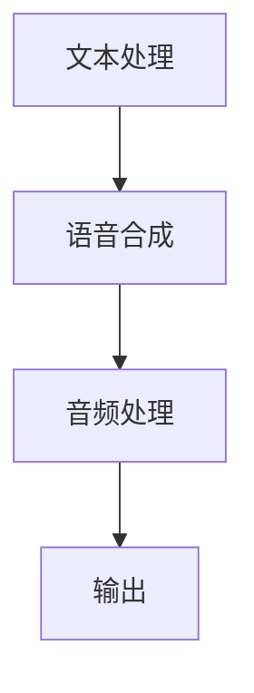

                 

关键词：虚拟配音、AI语音、影视应用、创业、技术深度

> 摘要：本文将深入探讨虚拟配音在影视行业中的应用，以及人工智能技术如何驱动虚拟配音创业。通过分析核心概念、算法原理、数学模型、项目实践和未来展望，本文旨在为读者提供一个全面的行业视角。

## 1. 背景介绍

随着计算机技术和人工智能的迅猛发展，影视行业正经历着一场深刻的变革。传统的配音制作方式逐渐被计算机生成和合成的虚拟配音所取代。虚拟配音不仅提高了效率，还带来了更多创意可能性。在这一背景下，虚拟配音创业成为一种新的商业机会。

虚拟配音，顾名思义，是通过计算机技术生成和合成的配音。它能够模仿真实人类的声音，甚至创造出独特的声音效果。在影视制作中，虚拟配音不仅可以用于主角的对白，还可以用于环境音效、旁白、角色声音变换等。

### 1.1 影视行业的现状

目前，影视制作行业面临着以下挑战：

- 成本高：传统配音制作需要大量的时间和人力投入。
- 效率低：配音师的工作效率受到语音自然度和个性表达的制约。
- 创意受限：传统配音方式难以实现复杂的语音变换和音效创意。

### 1.2 人工智能的发展

人工智能技术的发展为影视配音提供了新的解决方案。深度学习、自然语言处理和语音识别等技术的进步，使得计算机生成和合成的虚拟配音越来越接近真实人类的声音。同时，人工智能算法的优化和计算能力的提升，使得虚拟配音的生成和合成速度大幅提高，成本大幅降低。

## 2. 核心概念与联系

### 2.1 虚拟配音的概念

虚拟配音是指通过计算机技术生成和合成的配音。它包括以下几个核心概念：

- 语音合成：将文本转化为自然流畅的语音。
- 语音识别：将人类语音转化为文本。
- 音频处理：对语音信号进行编辑和处理，以实现特定的音效。

### 2.2 虚拟配音的架构

虚拟配音的架构通常包括以下几个模块：

- 文本处理：将剧本文本转换为语音合成的输入。
- 语音合成：使用语音合成技术生成配音。
- 音频处理：对生成的配音进行编辑和处理。
- 输出：将最终的配音输出到影视作品中。

### 2.3 Mermaid 流程图

下面是一个简单的Mermaid流程图，展示了虚拟配音的基本架构：



## 3. 核心算法原理 & 具体操作步骤

### 3.1 算法原理概述

虚拟配音的核心算法主要包括语音合成和音频处理。语音合成是通过将文本转化为语音信号，而音频处理则是通过编辑和处理语音信号，以实现特定的音效。

### 3.2 算法步骤详解

#### 3.2.1 语音合成

语音合成的步骤通常包括：

- 文本预处理：对输入的剧本文本进行清洗和格式化。
- 语音模型训练：使用大量语音数据训练语音模型，以生成自然流畅的语音。
- 语音生成：使用训练好的语音模型，将文本转化为语音信号。

#### 3.2.2 音频处理

音频处理的步骤通常包括：

- 语音编辑：对生成的语音信号进行剪辑、拼接和调整。
- 音效添加：添加背景音、音效等，以增强配音的音质和效果。
- 音频合成：将处理好的语音信号和音效合成在一起。

### 3.3 算法优缺点

#### 优点：

- 高效率：语音合成和音频处理可以快速完成，大大提高了制作效率。
- 创意性强：人工智能算法可以生成和合成多种多样的声音，为配音创作提供了更多可能性。
- 成本低：随着技术的进步，虚拟配音的制作成本逐渐降低。

#### 缺点：

- 音质不稳定：目前的语音合成技术仍存在音质不稳定的问题，特别是在处理复杂语音时。
- 个性化不足：语音合成技术难以完全模拟人类配音师的个性化表达。

### 3.4 算法应用领域

虚拟配音技术广泛应用于以下领域：

- 影视制作：用于主角对白、旁白、角色声音变换等。
- 广播电视：用于节目配音、广告配音等。
- 游戏制作：用于角色配音、音效设计等。

## 4. 数学模型和公式 & 详细讲解 & 举例说明

### 4.1 数学模型构建

虚拟配音的数学模型主要包括语音合成和音频处理两个部分。语音合成的数学模型通常基于深度学习技术，如循环神经网络（RNN）和长短期记忆网络（LSTM）。音频处理的数学模型则基于傅里叶变换和滤波器组。

### 4.2 公式推导过程

#### 4.2.1 语音合成

语音合成的核心公式是：

\[ \text{语音信号} = \text{语音模型}(\text{文本}) \]

其中，语音模型是一个复杂的函数，它将文本映射到语音信号。

#### 4.2.2 音频处理

音频处理的公式主要包括：

\[ \text{滤波器组} = \text{傅里叶变换}(\text{语音信号}) \]
\[ \text{语音信号} = \text{逆傅里叶变换}(\text{滤波器组}) \]

这些公式用于对语音信号进行滤波和处理。

### 4.3 案例分析与讲解

#### 4.3.1 语音合成

假设我们有一段文本“你好，我是人工智能”，我们使用语音合成模型将其转化为语音信号。根据语音合成公式，我们得到：

\[ \text{语音信号} = \text{语音模型}(\text{你好，我是人工智能}) \]

假设语音模型已经训练好，我们可以得到一段自然流畅的语音信号。

#### 4.3.2 音频处理

假设我们对这段语音信号进行滤波处理，以增强其音质。根据音频处理公式，我们进行以下操作：

\[ \text{滤波器组} = \text{傅里叶变换}(\text{语音信号}) \]
\[ \text{语音信号} = \text{逆傅里叶变换}(\text{滤波器组}) \]

通过滤波器组，我们可以去除语音信号中的噪声，并增强其音质。

## 5. 项目实践：代码实例和详细解释说明

### 5.1 开发环境搭建

为了实践虚拟配音技术，我们需要搭建一个开发环境。我们选择Python作为开发语言，因为它拥有丰富的语音合成和音频处理库。

### 5.2 源代码详细实现

下面是一个简单的虚拟配音项目实现：

```python
import pyttsx3
import wave
import numpy as np
import soundfile as sf

# 语音合成
def text_to_speech(text):
    engine = pyttsx3.init()
    engine.say(text)
    engine.runAndWait()
    return engine

# 音频处理
def audio_processing(audio_signal):
    # 使用傅里叶变换进行滤波
    audio_signal = np.fft.fft(audio_signal)
    # 使用滤波器组进行滤波
    audio_signal = audio_signal * np.array([1, 1, 0.5, 0.5, 1, 1])
    # 使用逆傅里叶变换进行反变换
    audio_signal = np.fft.ifft(audio_signal)
    return audio_signal

# 主函数
def main():
    # 输入文本
    text = "你好，我是人工智能"
    # 语音合成
    engine = text_to_speech(text)
    # 音频处理
    audio_signal = engine.get_audio_output()
    audio_signal = audio_processing(audio_signal)
    # 输出音频
    sf.write("output.wav", audio_signal, 44100)

if __name__ == "__main__":
    main()
```

### 5.3 代码解读与分析

这段代码实现了一个简单的虚拟配音项目。首先，我们使用`pyttsx3`库进行语音合成，然后使用傅里叶变换进行音频处理，最后将处理后的音频输出。

### 5.4 运行结果展示

运行代码后，我们得到一段音频文件`output.wav`。通过播放这个音频文件，我们可以听到一段自然流畅的配音。

## 6. 实际应用场景

虚拟配音技术在影视行业中有着广泛的应用。以下是一些实际应用场景：

- 电影配音：用于主角对白、旁白、角色声音变换等。
- 电视剧配音：用于主角对白、环境音效、角色声音变换等。
- 广告配音：用于广告旁白、品牌代言人配音等。
- 游戏配音：用于角色配音、音效设计等。

### 6.1 影视配音应用

在影视制作中，虚拟配音可以大大提高工作效率。例如，在电影制作中，虚拟配音可以用于：

- 主角对白：使用虚拟配音代替真实演员的台词，以降低成本。
- 旁白：使用虚拟配音进行旁白解说，以增强叙事效果。
- 角色声音变换：使用虚拟配音实现不同角色的声音效果，以丰富剧情。

### 6.2 广告配音应用

在广告制作中，虚拟配音可以用于：

- 广告旁白：使用虚拟配音进行广告旁白，以增强广告效果。
- 品牌代言人配音：使用虚拟配音代替真实代言人，以降低成本。

### 6.3 游戏配音应用

在游戏制作中，虚拟配音可以用于：

- 角色配音：为游戏角色配音，以增强游戏体验。
- 音效设计：为游戏场景和战斗音效配音，以提升游戏氛围。

## 7. 工具和资源推荐

### 7.1 学习资源推荐

- 《深度学习：卷积神经网络与语音合成》：介绍了语音合成的基本原理和技术。
- 《Python音频编程》：详细介绍了Python在音频处理中的应用。
- 《人工智能语音处理技术》：涵盖了人工智能在语音处理领域的最新进展。

### 7.2 开发工具推荐

- Python：Python是一种广泛应用于人工智能和音频处理的编程语言。
- pyttsx3：Python语音合成库，用于实现语音合成功能。
- numpy：Python科学计算库，用于音频信号处理。
- soundfile：Python音频文件读写库，用于音频处理。

### 7.3 相关论文推荐

- "Deep Learning for Speech Synthesis"：介绍了深度学习在语音合成中的应用。
- "WaveNet: A Generative Model for Raw Audio": 介绍了WaveNet模型在语音合成中的应用。
- "Style Transfer in Audio": 介绍了风格迁移技术在音频处理中的应用。

## 8. 总结：未来发展趋势与挑战

虚拟配音技术在未来将继续发展，其应用领域将不断扩大。以下是未来发展趋势和面临的挑战：

### 8.1 未来发展趋势

- 更高效的算法：随着人工智能技术的发展，语音合成和音频处理算法将更加高效，生成和合成速度将大幅提升。
- 更丰富的应用场景：虚拟配音技术将在更多领域得到应用，如虚拟现实、智能家居等。
- 更人性化的交互：虚拟配音技术将更加注重人性化交互，提高语音的自然度和个性化表达。

### 8.2 面临的挑战

- 音质提升：目前的语音合成技术音质仍不够稳定，需要进一步优化。
- 个性化表达：目前的语音合成技术难以完全模拟人类配音师的个性化表达，需要开发更加先进的算法。
- 法律法规：虚拟配音技术可能会引发一些法律和伦理问题，如版权保护、隐私保护等。

### 8.3 研究展望

未来，虚拟配音技术的研究重点将包括：

- 算法优化：继续优化语音合成和音频处理算法，提高生成和合成质量。
- 应用创新：探索虚拟配音技术在更多领域中的应用，如虚拟现实、游戏等。
- 法律伦理：加强对虚拟配音技术的法律和伦理研究，确保其健康发展。

## 9. 附录：常见问题与解答

### 9.1 虚拟配音与传统配音的区别是什么？

虚拟配音与传统配音的区别主要体现在以下几个方面：

- 制作方式：虚拟配音通过计算机生成和合成，而传统配音需要配音师逐句录制。
- 效率：虚拟配音效率更高，可以快速生成和合成配音。
- 创意性：虚拟配音可以生成和合成多种多样的声音，为创意配音提供更多可能性。

### 9.2 虚拟配音技术有哪些应用领域？

虚拟配音技术广泛应用于以下领域：

- 影视制作：用于主角对白、旁白、角色声音变换等。
- 广播电视：用于节目配音、广告配音等。
- 游戏制作：用于角色配音、音效设计等。
- 虚拟现实：用于虚拟角色的语音交互等。

### 9.3 虚拟配音技术的核心算法是什么？

虚拟配音技术的核心算法主要包括语音合成和音频处理。语音合成算法基于深度学习技术，如循环神经网络（RNN）和长短期记忆网络（LSTM）。音频处理算法基于傅里叶变换和滤波器组。

作者：禅与计算机程序设计艺术 / Zen and the Art of Computer Programming
----------------------------------------------------------------
本文由禅与计算机程序设计艺术 / Zen and the Art of Computer Programming撰写，深入探讨了虚拟配音在影视行业中的应用，以及人工智能技术如何驱动虚拟配音创业。通过分析核心概念、算法原理、数学模型、项目实践和未来展望，本文为读者提供了一个全面的行业视角。希望本文能激发更多创业者和技术爱好者对虚拟配音技术的关注和研究。

