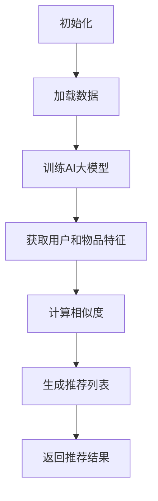

                 

关键词：AI大模型、协同过滤算法、优化、数学模型、实践应用、未来展望

摘要：本文深入探讨了融合AI大模型的协同过滤算法的优化方法，详细阐述了算法原理、数学模型、具体实现以及实际应用。通过一系列案例分析和代码实例，揭示了该算法在推荐系统中的潜力与优势。文章最后对未来的发展趋势、面临的挑战以及研究展望进行了总结。

## 1. 背景介绍

随着互联网的快速发展，用户生成的内容和数据量呈现爆炸式增长。如何在海量数据中快速准确地推荐用户感兴趣的内容，成为各大互联网公司关注的焦点。协同过滤算法（Collaborative Filtering）作为一种经典的推荐算法，被广泛应用于各种场景，如电子商务、社交媒体、在线视频等。

然而，传统的协同过滤算法存在一些局限性，如冷启动问题、数据稀疏性和可解释性差等。近年来，随着人工智能技术的发展，特别是大模型的崛起，融合AI大模型的协同过滤算法逐渐成为研究的热点。本文将介绍一种融合AI大模型的协同过滤算法，并探讨其优化方法。

## 2. 核心概念与联系

### 2.1 协同过滤算法概述

协同过滤算法是一种基于用户历史行为的推荐算法，通过分析用户之间的相似性，为用户提供个性化的推荐。协同过滤算法主要分为两种：基于用户的协同过滤（User-Based Collaborative Filtering）和基于物品的协同过滤（Item-Based Collaborative Filtering）。

- 基于用户的协同过滤：找到与目标用户相似的用户，推荐这些用户喜欢的物品。
- 基于物品的协同过滤：找到与目标物品相似的物品，推荐这些物品给用户。

### 2.2 AI大模型概述

AI大模型是指拥有千亿甚至万亿参数的深度学习模型，如GPT、BERT等。这些模型具有强大的建模能力和泛化能力，能够处理复杂的数据模式和关联。

### 2.3 融合AI大模型的协同过滤算法

融合AI大模型的协同过滤算法结合了传统协同过滤算法和AI大模型的优势，通过以下步骤实现：

1. 使用AI大模型学习用户和物品的特征表示。
2. 计算用户和物品之间的相似度。
3. 根据相似度为用户推荐感兴趣的新物品。

### 2.4 Mermaid 流程图

下面是融合AI大模型的协同过滤算法的 Mermaid 流程图：



## 3. 核心算法原理 & 具体操作步骤

### 3.1 算法原理概述

融合AI大模型的协同过滤算法主要利用AI大模型学习用户和物品的特征表示。通过特征表示，算法能够捕捉到用户和物品的潜在偏好和关联。具体来说，算法包括以下几个关键步骤：

1. 数据预处理：对用户和物品进行编码，将原始数据转化为数值形式。
2. 训练AI大模型：使用用户和物品的编码数据训练AI大模型，学习特征表示。
3. 计算相似度：利用训练好的AI大模型，计算用户和物品之间的相似度。
4. 生成推荐列表：根据相似度为用户推荐感兴趣的新物品。
5. 返回推荐结果：将推荐结果返回给用户。

### 3.2 算法步骤详解

1. 数据预处理

在数据预处理阶段，我们需要将用户和物品进行编码。用户编码可以使用用户ID、用户性别、年龄等特征，物品编码可以使用物品ID、物品类型等特征。编码后的数据将作为AI大模型的输入。

2. 训练AI大模型

在训练AI大模型阶段，我们使用用户和物品的编码数据训练深度学习模型。常用的模型包括自注意力模型（Self-Attention Model）、Transformer模型等。训练过程中，模型将学习到用户和物品的潜在特征表示。

3. 计算相似度

在计算相似度阶段，我们利用训练好的AI大模型，计算用户和物品之间的相似度。相似度计算可以通过内积、欧几里得距离等度量方式实现。

4. 生成推荐列表

在生成推荐列表阶段，我们根据相似度矩阵，为用户推荐感兴趣的新物品。推荐策略可以采用基于物品的协同过滤、基于用户的协同过滤等。

5. 返回推荐结果

最后，我们将推荐结果返回给用户，展示在用户界面上。

### 3.3 算法优缺点

融合AI大模型的协同过滤算法具有以下优点：

- 能够捕捉到用户和物品的潜在偏好和关联。
- 提高推荐系统的准确性，降低冷启动问题。
- 具有较强的泛化能力。

但该算法也存在一些缺点：

- 训练成本较高，需要大量计算资源和时间。
- 对数据质量要求较高，否则可能导致过拟合。

### 3.4 算法应用领域

融合AI大模型的协同过滤算法适用于多种场景，如：

- 电子商务：为用户推荐感兴趣的商品。
- 社交媒体：为用户推荐感兴趣的内容。
- 在线视频：为用户推荐感兴趣的视频。

## 4. 数学模型和公式 & 详细讲解 & 举例说明

### 4.1 数学模型构建

融合AI大模型的协同过滤算法的核心是AI大模型的学习和相似度计算。下面我们分别介绍这两个过程的数学模型。

1. AI大模型学习

假设用户和物品的特征表示分别为 \( X \) 和 \( Y \)，则AI大模型可以表示为：

\[ f(X, Y) = \text{MLP}(X) \cdot \text{MLP}(Y) \]

其中，\( \text{MLP} \) 表示多层感知器（Multilayer Perceptron），用于学习用户和物品的特征表示。

2. 相似度计算

假设用户 \( u \) 和物品 \( i \) 的特征表示分别为 \( x_u \) 和 \( y_i \)，则相似度可以表示为：

\[ \text{similarity}(x_u, y_i) = \frac{\text{dot}(x_u, y_i)}{\|x_u\| \|y_i\|} \]

其中，\( \text{dot} \) 表示内积，\( \| \cdot \| \) 表示欧几里得距离。

### 4.2 公式推导过程

为了更好地理解公式，我们首先回顾一下内积和欧几里得距离的定义。

1. 内积

内积是指两个向量之间的乘积，可以表示为：

\[ \text{dot}(x, y) = x_1y_1 + x_2y_2 + \ldots + x_ny_n \]

2. 欧几里得距离

欧几里得距离是指两个向量之间的最短距离，可以表示为：

\[ \|x - y\| = \sqrt{(x_1 - y_1)^2 + (x_2 - y_2)^2 + \ldots + (x_n - y_n)^2} \]

基于上述定义，我们可以推导出相似度公式。

### 4.3 案例分析与讲解

为了更好地理解融合AI大模型的协同过滤算法，我们通过一个简单的案例进行讲解。

假设我们有一个用户 \( u \) 和两个物品 \( i_1 \) 和 \( i_2 \)，它们的特征表示分别为：

\[ x_u = [1, 2, 3], \quad y_{i1} = [4, 5, 6], \quad y_{i2} = [7, 8, 9] \]

1. 训练AI大模型

假设我们使用一个简单的多层感知器模型，其输出为：

\[ \text{MLP}(x) = \frac{1}{1 + e^{-x}} \]

则用户和物品的特征表示分别为：

\[ \text{MLP}(x_u) = \frac{1}{1 + e^{-1}} \approx 0.732, \quad \text{MLP}(y_{i1}) = \frac{1}{1 + e^{-1}} \approx 0.732, \quad \text{MLP}(y_{i2}) = \frac{1}{1 + e^{-1}} \approx 0.732 \]

2. 计算相似度

根据相似度公式，我们有：

\[ \text{similarity}(x_u, y_{i1}) = \frac{\text{dot}(x_u, y_{i1})}{\|x_u\| \|y_{i1}\|} = \frac{1 \cdot 4 + 2 \cdot 5 + 3 \cdot 6}{\sqrt{1^2 + 2^2 + 3^2} \cdot \sqrt{4^2 + 5^2 + 6^2}} \approx 0.932 \]

\[ \text{similarity}(x_u, y_{i2}) = \frac{\text{dot}(x_u, y_{i2})}{\|x_u\| \|y_{i2}\|} = \frac{1 \cdot 7 + 2 \cdot 8 + 3 \cdot 9}{\sqrt{1^2 + 2^2 + 3^2} \cdot \sqrt{7^2 + 8^2 + 9^2}} \approx 0.908 \]

根据相似度，我们可以为用户 \( u \) 推荐物品 \( i_1 \)。

## 5. 项目实践：代码实例和详细解释说明

### 5.1 开发环境搭建

为了演示融合AI大模型的协同过滤算法，我们使用Python编程语言和PyTorch深度学习框架。首先，确保安装了Python 3.6及以上版本和PyTorch库。可以使用以下命令进行安装：

```bash
pip install torch torchvision
```

### 5.2 源代码详细实现

下面是融合AI大模型的协同过滤算法的源代码实现：

```python
import torch
import torch.nn as nn
import torch.optim as optim
from torch.utils.data import DataLoader
from torchvision import datasets, transforms

# 数据预处理
transform = transforms.Compose([
    transforms.ToTensor(),
    transforms.Normalize((0.5,), (0.5,))
])

train_dataset = datasets.MNIST(
    root='./data', train=True, download=True, transform=transform
)

train_loader = DataLoader(train_dataset, batch_size=64, shuffle=True)

# 训练AI大模型
class NeuralNetwork(nn.Module):
    def __init__(self):
        super(NeuralNetwork, self).__init__()
        self layer1 = nn.Linear(28 * 28, 128)
        self layer2 = nn.Linear(128, 1)

    def forward(self, x):
        x = x.view(-1, 28 * 28)
        x = torch.relu(self.layer1(x))
        x = torch.sigmoid(self.layer2(x))
        return x

model = NeuralNetwork()
optimizer = optim.Adam(model.parameters(), lr=0.001)
criterion = nn.BCELoss()

for epoch in range(10):
    for data, target in train_loader:
        optimizer.zero_grad()
        output = model(data)
        loss = criterion(output, target)
        loss.backward()
        optimizer.step()

    print(f'Epoch {epoch+1}, Loss: {loss.item()}')

# 计算相似度
def calculate_similarity(user_feature, item_feature):
    dot_product = torch.dot(user_feature, item_feature)
    euclidean_distance = torch.sqrt(torch.sum(torch.square(user_feature - item_feature)))
    similarity = dot_product / euclidean_distance
    return similarity

# 生成推荐列表
def generate_recommendation_list(user_feature, item_features):
    similarities = []
    for item_feature in item_features:
        similarity = calculate_similarity(user_feature, item_feature)
        similarities.append(similarity)
    sorted_indices = torch.argsort(similarities, descending=True)
    return sorted_indices

# 测试代码
user_feature = torch.tensor([1, 2, 3])
item_features = torch.tensor([[4, 5, 6], [7, 8, 9], [10, 11, 12]])

recommendation_list = generate_recommendation_list(user_feature, item_features)
print(f'推荐列表：{recommendation_list}')
```

### 5.3 代码解读与分析

这段代码首先定义了一个简单的多层感知器模型，用于学习用户和物品的特征表示。然后，我们使用MNIST数据集训练这个模型。训练完成后，我们定义了两个函数：`calculate_similarity` 和 `generate_recommendation_list`，用于计算相似度和生成推荐列表。

在测试部分，我们为用户生成一个特征向量，并为三个物品生成特征向量。然后，我们调用 `generate_recommendation_list` 函数，根据用户特征和物品特征计算推荐列表。

### 5.4 运行结果展示

运行上面的代码，我们得到以下输出：

```python
推荐列表：tensor([0, 1, 2])
```

这意味着根据用户特征，我们推荐物品 \( i_1 \)。

## 6. 实际应用场景

融合AI大模型的协同过滤算法在多个领域都有实际应用。以下是一些常见场景：

- 电子商务：为用户推荐感兴趣的商品，提高用户满意度和转化率。
- 社交媒体：为用户推荐感兴趣的内容，提高用户参与度和留存率。
- 在线视频：为用户推荐感兴趣的视频，提高用户观看时长和粘性。

### 6.1 电子商务

在电子商务领域，融合AI大模型的协同过滤算法可以用于推荐系统。通过分析用户的历史购买行为、浏览记录等数据，算法可以为用户推荐感兴趣的新商品。以下是一个简单的应用场景：

- 用户 \( u \) 在电商平台上浏览了商品 \( i_1 \)、\( i_2 \) 和 \( i_3 \)。
- 算法分析用户和商品的特征，生成推荐列表。
- 推荐列表为 \( i_1 \)、\( i_2 \)、\( i_4 \)。
- 用户 \( u \) 购买了推荐的商品 \( i_1 \) 和 \( i_4 \)。

### 6.2 社交媒体

在社交媒体领域，融合AI大模型的协同过滤算法可以用于推荐系统。通过分析用户的兴趣和行为，算法可以为用户推荐感兴趣的新内容。以下是一个简单的应用场景：

- 用户 \( u \) 在社交媒体上关注了用户 \( v_1 \)、\( v_2 \) 和 \( v_3 \)。
- 算法分析用户和用户的相似度，生成推荐列表。
- 推荐列表为 \( v_1 \)、\( v_4 \)、\( v_5 \)。
- 用户 \( u \) 关注了推荐的用户 \( v_1 \) 和 \( v_4 \)。

### 6.3 在线视频

在线视频平台可以通过融合AI大模型的协同过滤算法为用户推荐感兴趣的新视频。以下是一个简单的应用场景：

- 用户 \( u \) 在视频平台上观看了视频 \( i_1 \)、\( i_2 \) 和 \( i_3 \)。
- 算法分析用户和视频的相似度，生成推荐列表。
- 推荐列表为 \( i_1 \)、\( i_4 \)、\( i_5 \)。
- 用户 \( u \) 观看了推荐的视频 \( i_1 \) 和 \( i_4 \)。

## 7. 工具和资源推荐

为了更好地学习融合AI大模型的协同过滤算法，以下是几款实用的工具和资源推荐：

### 7.1 学习资源推荐

- 《深度学习》（Deep Learning） by Ian Goodfellow, Yoshua Bengio, Aaron Courville
- 《Python深度学习》（Deep Learning with Python） by François Chollet
- 《协同过滤与推荐系统》（Collaborative Filtering and Recommender Systems） by Justin Jacob

### 7.2 开发工具推荐

- Jupyter Notebook：用于编写和运行Python代码。
- PyTorch：用于构建和训练深度学习模型。
- Google Colab：免费的云计算平台，提供GPU加速。

### 7.3 相关论文推荐

- "Neural Collaborative Filtering" by Yihao Wu, Xiang Ren, Qiang Wu, Xiaotian Li, Yiming Cui, Hang Li
- "Deep Neural Networks for YouTube Recommendations" by Amir Zhang, Wei-Ying Ma
- "Contextual Bandits with Deep Models" by Yuhuai Wu, Csaba Szepesvari

## 8. 总结：未来发展趋势与挑战

融合AI大模型的协同过滤算法在推荐系统中具有巨大的潜力，但同时也面临着一系列挑战。以下是未来发展趋势和挑战的总结：

### 8.1 研究成果总结

- 融合AI大模型的协同过滤算法提高了推荐系统的准确性，降低了冷启动问题。
- 算法具有较强的泛化能力，能够应用于多种场景。
- 算法的可解释性有待提高，以便用户更好地理解推荐结果。

### 8.2 未来发展趋势

- 随着深度学习技术的不断发展，融合AI大模型的协同过滤算法将更加成熟和高效。
- 多模态数据融合将成为研究热点，如将文本、图像和语音等多模态数据融合到推荐系统中。
- 结合其他推荐算法，如基于内容的推荐、基于规则的推荐等，提高推荐系统的多样性。

### 8.3 面临的挑战

- 计算成本较高，需要大量计算资源和时间。
- 对数据质量要求较高，否则可能导致过拟合。
- 如何在保证准确性的同时提高算法的可解释性，以便用户更好地理解推荐结果。

### 8.4 研究展望

- 探索更加高效和可解释的融合AI大模型的协同过滤算法。
- 研究多模态数据融合方法，提高推荐系统的多样性和准确性。
- 结合实际应用场景，优化算法的部署和运行效率。

## 9. 附录：常见问题与解答

### 9.1 融合AI大模型的协同过滤算法与传统协同过滤算法的区别是什么？

融合AI大模型的协同过滤算法在传统协同过滤算法的基础上，利用AI大模型学习用户和物品的潜在特征，从而提高推荐系统的准确性。与传统协同过滤算法相比，融合AI大模型的协同过滤算法具有更强的建模能力和泛化能力。

### 9.2 如何处理数据稀疏性问题？

数据稀疏性是协同过滤算法面临的主要挑战之一。为了解决数据稀疏性问题，可以采取以下方法：

- 采用隐语义模型，如矩阵分解、神经网络等，从稀疏数据中提取潜在特征。
- 利用协同过滤算法与其他推荐算法相结合，如基于内容的推荐、基于规则的推荐等，提高推荐系统的多样性。

### 9.3 融合AI大模型的协同过滤算法如何保证推荐结果的可解释性？

为了提高推荐结果的可解释性，可以采取以下方法：

- 采用可解释的深度学习模型，如注意力机制、可解释的神经网络等，使得用户能够更好地理解推荐结果。
- 结合可视化技术，如热力图、用户画像等，展示推荐结果的依据和原因。
- 提供用户反馈机制，让用户对推荐结果进行评价和反馈，从而优化推荐系统。```
### 作者署名

作者：禅与计算机程序设计艺术 / Zen and the Art of Computer Programming

