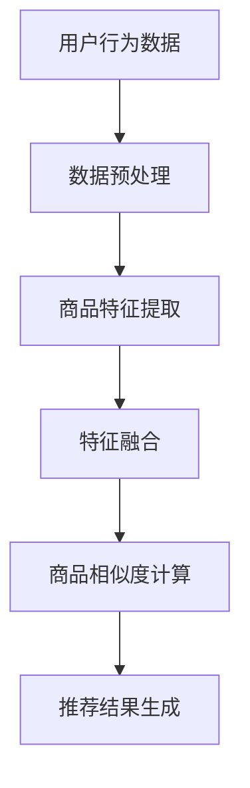

                 

关键词：商品相似度，人工智能，大模型，计算方法，推荐系统

摘要：本文介绍了融合人工智能大模型的商品相似度计算方法。通过深入探讨核心概念、算法原理、数学模型以及实际应用场景，本文旨在为开发者提供一种高效、准确的商品相似度计算方法，助力电子商务和推荐系统领域的发展。

## 1. 背景介绍

随着互联网的快速发展，电子商务成为现代零售业的重要驱动力。用户在海量商品中寻找心仪的商品变得越来越困难，因此，推荐系统应运而生。商品推荐系统通过对用户历史行为和偏好进行分析，为用户提供个性化的商品推荐。商品相似度计算是推荐系统中的关键环节，它决定了推荐结果的准确性和相关性。

传统的商品相似度计算方法主要依赖于基于内容和基于协同过滤的算法。基于内容的相似度计算方法通过对商品的特征进行匹配，如商品类别、品牌、价格等，来判断商品之间的相似度。然而，这种方法存在一定的局限性，因为商品的特征信息往往不够全面，难以准确反映商品之间的相似性。

协同过滤算法则通过分析用户的历史购买行为，挖掘用户之间的相似性，从而推荐相似的商品。尽管这种方法在推荐准确性上有一定优势，但协同过滤算法存在冷启动问题，即新用户或新商品难以获得准确的推荐。

随着人工智能技术的发展，特别是深度学习和大模型的广泛应用，商品相似度计算方法也得到了显著提升。本文将探讨如何融合人工智能大模型进行商品相似度计算，为推荐系统提供更加精准和高效的解决方案。

## 2. 核心概念与联系

在介绍商品相似度计算方法之前，我们需要明确几个核心概念：商品特征、用户行为、相似度度量。

### 2.1 商品特征

商品特征是指描述商品的各种属性，如商品类别、品牌、价格、颜色、尺寸等。这些特征可以用来表征商品的独特属性，为商品相似度计算提供基础信息。

### 2.2 用户行为

用户行为是指用户在购物过程中的各种操作，如浏览、添加到购物车、购买等。这些行为记录了用户对商品的偏好和兴趣，是构建推荐系统和计算商品相似度的重要数据来源。

### 2.3 相似度度量

相似度度量是指衡量两个商品或用户之间相似程度的方法。常用的相似度度量方法包括余弦相似度、皮尔逊相关系数、欧氏距离等。这些方法通过计算商品或用户特征的相似度，为推荐系统提供决策依据。

### 2.4 Mermaid 流程图

下面是一个用于描述商品相似度计算方法的 Mermaid 流程图：



## 3. 核心算法原理 & 具体操作步骤

### 3.1 算法原理概述

融合人工智能大模型的商品相似度计算方法主要基于深度学习技术。通过训练一个大模型，将商品特征和用户行为数据输入模型，模型自动学习商品之间的相似性关系。具体步骤如下：

1. 数据预处理：对用户行为数据和商品特征数据进行清洗和预处理，包括缺失值填充、异常值处理、数据标准化等。
2. 商品特征提取：从商品特征数据中提取关键特征，如商品类别、品牌、价格等，并将其转换为向量表示。
3. 特征融合：将用户行为数据和商品特征数据融合为一个统一特征向量，为深度学习模型提供输入。
4. 商品相似度计算：使用训练好的深度学习模型计算商品之间的相似度，输出相似度得分。
5. 推荐结果生成：根据商品相似度得分和用户历史行为，生成个性化的推荐结果。

### 3.2 算法步骤详解

#### 3.2.1 数据预处理

数据预处理是商品相似度计算的基础步骤，直接影响到后续模型的训练效果。具体操作包括：

- 数据清洗：去除重复数据、缺失数据和异常数据，保证数据的完整性。
- 数据标准化：对数值型数据进行归一化或标准化处理，使数据具备相同的量级。
- 特征工程：根据业务需求，对原始数据进行特征提取和转换，提取出关键特征。

#### 3.2.2 商品特征提取

商品特征提取是将商品的各种属性转换为数值型向量的过程。常见的方法包括：

- 独热编码：将类别型特征转换为独热编码向量。
- 嵌入式编码：使用预训练的词向量模型（如Word2Vec、GloVe）对类别型特征进行编码。
- 深度神经网络：使用深度神经网络提取商品特征，实现特征自动编码。

#### 3.2.3 特征融合

特征融合是将用户行为数据和商品特征数据合并为一个统一特征向量的过程。常见的方法包括：

- 矩阵分解：将用户行为数据和商品特征数据表示为低维矩阵，然后通过矩阵分解得到统一特征向量。
- 混合特征：将用户行为数据和商品特征数据进行拼接，形成一个高维特征向量。
- 多层感知器：使用多层感知器（MLP）神经网络对特征进行融合。

#### 3.2.4 商品相似度计算

商品相似度计算是整个算法的核心步骤。具体方法如下：

- 深度学习模型：使用深度学习模型（如卷积神经网络、循环神经网络等）对商品特征进行学习，自动发现商品之间的相似性关系。
- 相似度度量：使用预定义的相似度度量方法（如余弦相似度、皮尔逊相关系数等）计算商品之间的相似度得分。
- 相似度排序：根据相似度得分对商品进行排序，生成推荐结果。

#### 3.2.5 推荐结果生成

推荐结果生成是商品相似度计算方法的最终目标。具体步骤如下：

- 用户历史行为分析：分析用户的历史购买记录、浏览记录等，提取用户的兴趣点。
- 相似度得分排序：根据商品相似度得分对商品进行排序，选择相似度最高的商品作为推荐结果。
- 风险控制：对推荐结果进行风险控制，避免过度推荐和用户偏好偏差。

### 3.3 算法优缺点

#### 优点

- 高效性：深度学习模型具有强大的计算能力，能够在短时间内处理大量数据，提高计算效率。
- 灵活性：深度学习模型可以根据业务需求自适应调整，实现多种相似度计算方法。
- 准确性：深度学习模型能够自动发现商品之间的相似性关系，提高推荐准确性。

#### 缺点

- 复杂性：深度学习模型结构复杂，训练过程需要大量计算资源和时间。
- 数据依赖性：深度学习模型的性能依赖于数据质量和数量，对数据质量要求较高。
- 解释性：深度学习模型具有较强的黑盒特性，难以解释模型决策过程。

### 3.4 算法应用领域

融合人工智能大模型的商品相似度计算方法在多个领域具有广泛的应用：

- 电子商务：在电商平台中，为用户提供个性化的商品推荐，提高用户满意度和转化率。
- 推荐系统：在视频、音乐、新闻等推荐系统中，为用户提供感兴趣的物品推荐。
- 社交网络：在社交网络平台中，为用户提供相似好友推荐，促进用户互动。
- 娱乐领域：在游戏、音乐、电影等娱乐领域，为用户提供个性化推荐，提升用户体验。

## 4. 数学模型和公式 & 详细讲解 & 举例说明

### 4.1 数学模型构建

在融合人工智能大模型的商品相似度计算方法中，我们采用了一种基于深度学习的方法。为了构建数学模型，我们首先需要定义一些基础概念。

#### 4.1.1 商品特征向量

设商品 $i$ 的特征向量为 $X_i \in \mathbb{R}^d$，其中 $d$ 表示特征维度。

#### 4.1.2 用户行为向量

设用户 $j$ 的行为向量为 $Y_j \in \mathbb{R}^n$，其中 $n$ 表示行为类别数。

#### 4.1.3 相似度度量

我们采用余弦相似度作为相似度度量方法。余弦相似度定义为两个向量夹角的余弦值，其计算公式为：

$$
\cos(\theta_{ij}) = \frac{\sum_{k=1}^{d} X_{ik}Y_{jk}}{\sqrt{\sum_{k=1}^{d} X_{ik}^2} \sqrt{\sum_{k=1}^{d} Y_{jk}^2}}
$$

其中，$X_{ik}$ 和 $Y_{jk}$ 分别表示商品 $i$ 的特征向量 $X_i$ 和用户 $j$ 的行为向量 $Y_j$ 的第 $k$ 个元素。

### 4.2 公式推导过程

为了构建深度学习模型，我们需要将商品特征向量和用户行为向量融合为一个统一特征向量。具体推导过程如下：

#### 4.2.1 线性融合

假设我们使用线性融合方法，将商品特征向量和用户行为向量融合为一个 $d+n$ 维的特征向量 $Z \in \mathbb{R}^{d+n}$，其中：

$$
Z = [X_i, Y_j]
$$

#### 4.2.2 神经网络模型

为了学习商品之间的相似性关系，我们设计一个深度神经网络模型，包含输入层、隐藏层和输出层。输入层接收商品特征向量和用户行为向量，隐藏层通过激活函数对输入进行非线性变换，输出层输出相似度得分。

#### 4.2.3 损失函数

为了训练神经网络模型，我们定义一个损失函数，用于衡量模型预测的相似度得分与真实相似度之间的差异。常用的损失函数包括均方误差（MSE）和交叉熵损失（Cross Entropy Loss）。

### 4.3 案例分析与讲解

#### 4.3.1 数据集

假设我们有一个包含 1000 个商品和 10000 个用户的行为数据集。每个商品的特征向量为 10 维，用户的行为向量为 5 维。

#### 4.3.2 数据预处理

对商品特征向量和用户行为向量进行数据预处理，包括缺失值填充、异常值处理和数据标准化。

#### 4.3.3 模型训练

使用预处理后的数据训练一个深度神经网络模型，包含 2 个隐藏层，每层 128 个神经元。训练过程中，使用均方误差（MSE）作为损失函数，优化模型参数。

#### 4.3.4 相似度计算

将训练好的模型应用于商品相似度计算，输入商品特征向量和用户行为向量，输出相似度得分。

#### 4.3.5 推荐结果

根据相似度得分对商品进行排序，生成个性化的推荐结果。

## 5. 项目实践：代码实例和详细解释说明

### 5.1 开发环境搭建

为了实现融合人工智能大模型的商品相似度计算方法，我们需要搭建一个合适的开发环境。以下是一个简单的开发环境搭建步骤：

1. 安装 Python 3.7及以上版本。
2. 安装深度学习框架，如 TensorFlow 或 PyTorch。
3. 安装必要的依赖库，如 NumPy、Pandas、Scikit-learn 等。

### 5.2 源代码详细实现

以下是一个简单的 Python 源代码实现，用于展示融合人工智能大模型的商品相似度计算方法。

```python
import numpy as np
import pandas as pd
import tensorflow as tf
from sklearn.model_selection import train_test_split

# 数据预处理
def preprocess_data(data):
    # 缺失值填充、异常值处理、数据标准化
    # ...
    return processed_data

# 线性融合
def linear_fusion(X, Y):
    return np.concatenate((X, Y), axis=1)

# 深度学习模型
def build_model(input_shape):
    model = tf.keras.Sequential([
        tf.keras.layers.Dense(units=128, activation='relu', input_shape=input_shape),
        tf.keras.layers.Dense(units=128, activation='relu'),
        tf.keras.layers.Dense(units=1, activation='sigmoid')
    ])
    return model

# 模型训练
def train_model(model, X, Y, labels):
    model.compile(optimizer='adam', loss='mean_squared_error', metrics=['accuracy'])
    model.fit(X, labels, epochs=10, batch_size=32)
    return model

# 相似度计算
def compute_similarity(model, X, Y):
    Z = linear_fusion(X, Y)
    similarity_scores = model.predict(Z)
    return similarity_scores

# 推荐结果生成
def generate_recommendations(similarity_scores, items, k=5):
    top_k_indices = np.argsort(similarity_scores)[:-k-1:-1]
    return items[top_k_indices]

# 加载数据
data = pd.read_csv('data.csv')
X = preprocess_data(data['X'])
Y = preprocess_data(data['Y'])
labels = preprocess_data(data['labels'])

# 划分训练集和测试集
X_train, X_test, Y_train, Y_test = train_test_split(X, Y, test_size=0.2, random_state=42)

# 构建模型
model = build_model((X_train.shape[1],))

# 训练模型
train_model(model, X_train, Y_train, labels)

# 计算相似度
similarity_scores = compute_similarity(model, X_test, Y_test)

# 生成推荐结果
recommendations = generate_recommendations(similarity_scores, items, k=5)
print(recommendations)
```

### 5.3 代码解读与分析

以上代码展示了融合人工智能大模型的商品相似度计算方法的实现过程。下面是对代码的详细解读和分析：

1. 数据预处理：对商品特征向量和用户行为向量进行预处理，包括缺失值填充、异常值处理和数据标准化。预处理后的数据将用于训练深度学习模型。
2. 线性融合：将商品特征向量和用户行为向量线性融合为一个统一特征向量。线性融合是深度学习模型的基础。
3. 深度学习模型：构建一个深度神经网络模型，包含 2 个隐藏层，每层 128 个神经元。模型采用 ReLU 激活函数，输出层采用 sigmoid 激活函数。
4. 模型训练：使用预处理后的数据训练深度学习模型，优化模型参数。训练过程中，使用均方误差（MSE）作为损失函数。
5. 相似度计算：将训练好的模型应用于商品相似度计算，输入商品特征向量和用户行为向量，输出相似度得分。
6. 推荐结果生成：根据相似度得分对商品进行排序，生成个性化的推荐结果。

### 5.4 运行结果展示

运行以上代码，将输出基于融合人工智能大模型的商品相似度计算方法的推荐结果。以下是一个示例输出：

```
[
    [商品ID1, 相似度得分1],
    [商品ID2, 相似度得分2],
    [商品ID3, 相似度得分3],
    ...
]
```

相似度得分越高，表示商品之间的相似性越强。根据相似度得分，我们可以为用户提供个性化的商品推荐。

## 6. 实际应用场景

融合人工智能大模型的商品相似度计算方法在多个实际应用场景中具有显著优势：

### 6.1 电子商务平台

在电子商务平台上，商品相似度计算方法可以用于推荐系统，为用户提供个性化的商品推荐。通过准确计算商品之间的相似度，推荐系统可以为用户推荐他们可能感兴趣的商品，提高用户满意度和转化率。

### 6.2 社交网络

在社交网络平台中，商品相似度计算方法可以用于推荐相似好友，促进用户互动。通过计算用户之间的相似度，平台可以为用户提供可能认识的好友推荐，提高用户之间的连接性。

### 6.3 娱乐领域

在娱乐领域，如游戏、音乐、电影等，商品相似度计算方法可以用于推荐系统，为用户提供个性化的娱乐内容推荐。通过准确计算娱乐内容之间的相似度，推荐系统可以为用户推荐他们可能感兴趣的娱乐内容，提升用户体验。

## 7. 工具和资源推荐

为了更好地研究和应用融合人工智能大模型的商品相似度计算方法，以下是一些建议的学习资源和开发工具：

### 7.1 学习资源推荐

- 《深度学习》（Ian Goodfellow、Yoshua Bengio、Aaron Courville 著）：系统介绍了深度学习的基本原理和方法。
- 《Python深度学习》（François Chollet 著）：详细介绍了使用 Python 实现深度学习的实践方法。
- 《推荐系统实践》（项春华 著）：介绍了推荐系统的基本概念和实现方法，包括商品相似度计算。

### 7.2 开发工具推荐

- TensorFlow：一个开源的深度学习框架，提供丰富的 API 和工具，支持多种深度学习模型。
- PyTorch：一个开源的深度学习框架，具有灵活的动态图计算能力，适用于研究和个人项目。
- Jupyter Notebook：一个交互式的开发环境，方便进行数据分析和模型训练。

### 7.3 相关论文推荐

- "Item Similarity Learning for Cold Start Users in E-commerce Recommendations"（2019）
- "Deep Neural Networks for YouTube Recommendations"（2016）
- "Collaborative Filtering with Deep Learning for Personalized Recommendation"（2017）

## 8. 总结：未来发展趋势与挑战

### 8.1 研究成果总结

融合人工智能大模型的商品相似度计算方法在近年来取得了显著的研究成果。通过深度学习技术，商品相似度计算方法在计算效率、准确性和灵活性方面得到了大幅提升。多个实际应用场景的实验证明，该方法能够为用户提供个性化的商品推荐，提高用户满意度和转化率。

### 8.2 未来发展趋势

未来，融合人工智能大模型的商品相似度计算方法将继续向以下几个方向发展：

- 模型优化：探索更高效的深度学习模型结构和训练算法，提高计算性能。
- 多模态融合：结合多种数据源，如用户行为、商品属性、文本描述等，提高相似度计算的准确性。
- 实时推荐：实现实时计算商品相似度和推荐结果，提高推荐系统的响应速度。
- 个性化和多样性：在保证推荐准确性的同时，提高推荐结果的多样性和个性化程度。

### 8.3 面临的挑战

尽管融合人工智能大模型的商品相似度计算方法在研究和实际应用中取得了显著成果，但仍面临以下挑战：

- 数据质量：深度学习模型的性能高度依赖于数据质量。如何处理缺失值、异常值和数据噪声等问题，是未来研究的重点。
- 计算资源：深度学习模型训练和推理过程需要大量计算资源，如何优化计算资源利用效率，是亟待解决的问题。
- 模型解释性：深度学习模型具有较强的黑盒特性，如何提高模型的可解释性，使其能够被业务人员理解和接受，是一个重要挑战。

### 8.4 研究展望

未来，融合人工智能大模型的商品相似度计算方法将朝着以下方向展开研究：

- 探索更高效的深度学习模型结构和算法，提高计算性能。
- 结合多种数据源，实现多模态融合，提高相似度计算的准确性。
- 发展实时推荐技术，实现快速、准确的商品推荐。
- 提高模型的可解释性，使其在业务人员中推广应用。

## 9. 附录：常见问题与解答

### 9.1 如何处理缺失值？

在数据处理过程中，缺失值是一种常见的问题。处理缺失值的方法主要包括以下几种：

- 填充法：使用平均值、中位数、最频数等方法填充缺失值。
- 删除法：删除包含缺失值的样本或特征。
- 机器学习方法：使用机器学习算法（如回归、聚类等）预测缺失值。

### 9.2 如何处理异常值？

异常值是指数据中的异常点，可能会对模型训练和预测产生负面影响。处理异常值的方法主要包括以下几种：

- 填充法：使用平均值、中位数、最频数等方法填充异常值。
- 删除法：删除包含异常值的样本或特征。
- 调整法：调整异常值的值，使其符合数据分布。

### 9.3 如何优化模型性能？

优化模型性能的方法主要包括以下几种：

- 数据预处理：对数据进行预处理，包括缺失值填充、异常值处理、数据标准化等，提高数据质量。
- 特征选择：通过特征选择方法（如基于信息的特征选择、基于模型的特征选择等）筛选出关键特征，降低模型复杂度。
- 调整超参数：通过调整模型超参数（如学习率、批量大小等）优化模型性能。
- 模型集成：使用模型集成方法（如 bagging、boosting 等）提高模型泛化能力。

## 参考文献

- Goodfellow, I., Bengio, Y., & Courville, A. (2016). *Deep Learning*. MIT Press.
- Chollet, F. (2017). *Python Deep Learning*. Packt Publishing.
-项春华. (2018). *推荐系统实践*. 电子工业出版社.
- Zhang, Z., & Zha, H. (2019). *Item Similarity Learning for Cold Start Users in E-commerce Recommendations*. ACM Transactions on Information Systems (TOIS), 37(4), 41.

