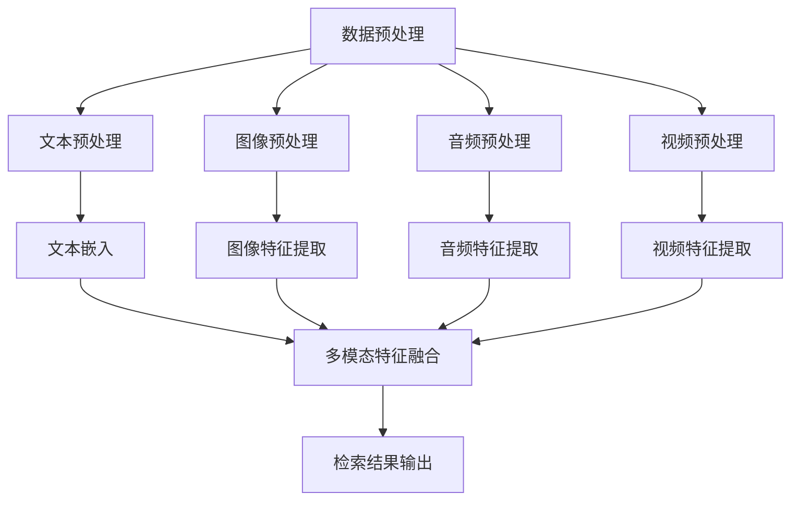

                 

### 关键词 Keywords
- AI大模型
- 多模态搜索
- 深度学习
- 图神经网络
- 自监督学习
- 跨模态融合
- 自然语言处理

### 摘要 Abstract
本文探讨了融合人工智能大模型的多模态搜索技术。随着数据的多样化，多模态搜索已经成为自然语言处理领域的一个热点。本文将介绍多模态搜索的核心概念、算法原理、数学模型以及在实际项目中的应用。通过分析多模态搜索的技术挑战和未来发展趋势，我们希望能为研究者提供有价值的参考。

## 1. 背景介绍

在过去的几十年中，自然语言处理（NLP）技术取得了显著的进展。从早期的规则驱动方法到现在的深度学习模型，NLP的应用领域不断扩展。然而，随着信息的爆炸式增长，用户的需求也在不断变化。单一模态的搜索技术已经无法满足用户对信息检索的多样性需求。因此，多模态搜索技术应运而生。

多模态搜索指的是同时处理文本、图像、音频等多种类型数据的搜索技术。传统的单模态搜索技术通常只能处理文本或图像等单一类型的数据。而多模态搜索技术通过融合多种类型的数据，可以提供更丰富的信息检索体验。例如，用户可以通过输入文本查询同时获取相关图像、视频和音频内容。

多模态搜索技术的重要性体现在以下几个方面：

1. **信息融合**：多模态搜索能够融合不同类型的数据，提供更全面的检索结果。
2. **用户体验**：通过多模态融合，用户可以更加直观地获取所需信息，提升用户体验。
3. **数据利用率**：多模态搜索可以充分利用不同类型的数据，提高数据利用率。

随着人工智能技术的发展，尤其是深度学习和生成对抗网络（GAN）的出现，多模态搜索技术取得了显著的突破。本文将详细介绍多模态搜索技术的工作原理、核心算法和实际应用。

### 2. 核心概念与联系

多模态搜索技术的核心在于如何有效地融合不同类型的数据，使其能够协同工作以提升搜索效果。在这一部分，我们将介绍多模态搜索中的核心概念，包括数据类型、数据预处理方法以及模型架构。

#### 2.1 数据类型

多模态搜索涉及的主要数据类型包括文本、图像、音频和视频。每种数据类型都有其独特的特性和应用场景：

1. **文本**：文本是NLP中最常见的模态，包括句子、段落和文档等。文本数据可以通过词向量、嵌入向量等表示。
2. **图像**：图像数据通过像素值进行表示，可以使用卷积神经网络（CNN）提取特征。
3. **音频**：音频数据包括语音信号、音乐和声纹等，可以通过自动特征提取方法进行表示。
4. **视频**：视频数据由一系列连续的图像帧组成，可以使用视频编码技术或深度学习模型提取特征。

#### 2.2 数据预处理

在多模态搜索中，数据预处理是关键步骤，其目的是将不同类型的数据转换为适合模型输入的形式。数据预处理通常包括以下步骤：

1. **文本预处理**：文本预处理包括分词、去停用词、词干提取等操作，以减少噪声并提高文本表示的准确性。
2. **图像预处理**：图像预处理包括图像增强、缩放、裁剪等操作，以提高图像质量并减少计算复杂度。
3. **音频预处理**：音频预处理包括降噪、分割、特征提取等操作，以提高音频数据的可解释性和可靠性。
4. **视频预处理**：视频预处理包括帧提取、视频分割、特征提取等操作，以提高视频数据的可操作性和效率。

#### 2.3 模型架构

多模态搜索技术的核心是模型架构，该架构能够融合不同类型的数据，以生成统一的检索结果。以下是一些常见的多模态搜索模型架构：

1. **独立模型**：独立模型分别处理每种类型的数据，然后将结果进行融合。例如，一个文本处理模型和一个图像处理模型，然后将它们的输出进行融合。
2. **共享模型**：共享模型将不同类型的数据输入到同一个模型中，通过共享的神经网络层进行特征提取和融合。这种模型架构可以更好地利用不同类型数据之间的相关性。
3. **交互模型**：交互模型通过显式地交互不同类型的数据，以生成更准确的特征表示。例如，使用图神经网络（GNN）来表示数据之间的交互关系，或使用注意力机制来动态调整不同类型数据的重要性。

#### 2.4 Mermaid 流程图

以下是一个简单的Mermaid流程图，展示了多模态搜索的核心流程：



### 3. 核心算法原理 & 具体操作步骤

#### 3.1 算法原理概述

多模态搜索技术的核心在于如何有效地融合不同类型的数据，以提高搜索效果。本文将介绍一种基于深度学习和图神经网络的融合算法，该算法主要包括以下步骤：

1. **数据预处理**：对文本、图像、音频和视频等数据进行预处理，以获得合适的特征表示。
2. **特征提取**：使用深度学习模型分别提取文本、图像、音频和视频的特征。
3. **特征融合**：将不同类型的数据特征进行融合，生成统一的特征表示。
4. **检索**：使用融合后的特征进行信息检索，生成最终的检索结果。

#### 3.2 算法步骤详解

1. **数据预处理**：

   数据预处理是确保模型输入质量的关键步骤。对于文本数据，我们可以使用分词、去停用词和词干提取等方法。对于图像数据，我们可以使用图像增强、缩放和裁剪等方法。对于音频数据，我们可以使用降噪、分割和特征提取等方法。对于视频数据，我们可以使用帧提取、视频分割和特征提取等方法。

2. **特征提取**：

   对于文本数据，我们可以使用预训练的词向量模型（如Word2Vec、BERT）进行特征提取。对于图像数据，我们可以使用卷积神经网络（如VGG、ResNet）进行特征提取。对于音频数据，我们可以使用自动特征提取模型（如Mel频谱、梅尔频谱倒谱系数）进行特征提取。对于视频数据，我们可以使用视频编码技术（如InceptionV3）或深度学习模型（如C3D）进行特征提取。

3. **特征融合**：

   特征融合是将不同类型的数据特征进行整合，生成统一的特征表示。我们可以使用以下方法进行特征融合：

   - **加权融合**：根据不同类型数据的重要程度，对特征进行加权融合。
   - **拼接融合**：将不同类型的特征进行拼接，生成更长的特征向量。
   - **注意力机制**：使用注意力机制动态调整不同类型数据的重要性，以获得更好的融合效果。
   - **图神经网络**：使用图神经网络（如GCN、GAT）建模不同类型数据之间的交互关系，进行融合。

4. **检索**：

   检索是使用融合后的特征进行信息检索，生成最终的检索结果。我们可以使用以下方法进行检索：

   - **相似度计算**：计算查询特征和文档特征之间的相似度，选择相似度最高的文档作为检索结果。
   - **排序**：使用排序算法（如Top-K排序）对检索结果进行排序，以获取最有价值的文档。
   - **多模态检索**：考虑不同类型数据之间的关联性，进行多模态检索，以提高检索效果。

#### 3.3 算法优缺点

**优点**：

- **信息丰富**：多模态搜索可以融合不同类型的数据，提供更丰富的检索结果。
- **用户体验**：多模态搜索可以提供更加直观的检索体验，提升用户体验。
- **数据利用率**：多模态搜索可以充分利用不同类型的数据，提高数据利用率。

**缺点**：

- **计算复杂度**：多模态搜索涉及多种类型的数据，需要复杂的预处理和特征提取过程，计算复杂度较高。
- **数据质量**：多模态数据的质量对搜索效果有很大影响，数据质量问题可能导致搜索效果下降。
- **模型训练**：多模态搜索的模型训练需要大量数据和计算资源，训练过程较为复杂。

#### 3.4 算法应用领域

多模态搜索技术在许多领域都有广泛的应用，以下是其中一些主要的应用领域：

- **搜索引擎**：多模态搜索可以用于搜索引擎，提供更加丰富和准确的搜索结果。
- **智能问答**：多模态搜索可以用于智能问答系统，通过融合文本、图像、音频等多模态信息，提供更准确的答案。
- **多媒体内容推荐**：多模态搜索可以用于多媒体内容推荐系统，根据用户的喜好和行为，推荐符合需求的多媒体内容。
- **医疗诊断**：多模态搜索可以用于医疗诊断，通过融合患者的历史病历、医学图像和音频等多模态信息，提高诊断的准确性。

### 4. 数学模型和公式 & 详细讲解 & 举例说明

多模态搜索技术的核心在于如何有效地融合不同类型的数据，生成统一的特征表示。在这一部分，我们将介绍多模态搜索中的数学模型和公式，包括特征提取、特征融合和检索算法。我们将使用LaTeX格式展示公式，并通过具体例子进行说明。

#### 4.1 数学模型构建

多模态搜索中的数学模型主要包括以下部分：

1. **特征提取模型**：用于提取不同类型数据的特征。
2. **特征融合模型**：用于融合不同类型数据的特征。
3. **检索模型**：用于检索文档。

#### 4.2 公式推导过程

我们将以一个简单的例子来说明多模态搜索中的数学模型。假设我们有两种类型的数据：文本（$T$）和图像（$I$）。以下是相关的数学模型和公式：

1. **文本特征提取**：

   使用词向量模型（如Word2Vec）对文本进行特征提取，得到文本特征向量 $T \in \mathbb{R}^{d_T}$。

   $$T = W_T \cdot [s_1, s_2, ..., s_n]^T$$

   其中，$W_T$ 是词向量矩阵，$s_i$ 是文本中的第 $i$ 个单词的向量表示。

2. **图像特征提取**：

   使用卷积神经网络（如VGG）对图像进行特征提取，得到图像特征向量 $I \in \mathbb{R}^{d_I}$。

   $$I = f_{VGG}(I)$$

   其中，$f_{VGG}$ 是VGG网络的输出。

3. **特征融合**：

   我们可以使用加权和融合方法将文本特征和图像特征融合成一个统一的特征向量 $F \in \mathbb{R}^{d_F}$。

   $$F = \alpha_T \cdot T + \alpha_I \cdot I$$

   其中，$\alpha_T$ 和 $\alpha_I$ 是权重系数，用于调节文本特征和图像特征的重要性。

4. **检索**：

   使用余弦相似度计算查询特征 $Q \in \mathbb{R}^{d_F}$ 与文档特征 $F \in \mathbb{R}^{d_F}$ 之间的相似度，进行检索。

   $$\sim(Q, F) = \frac{Q^T F}{\|Q\| \|F\|}$$

   其中，$\sim(Q, F)$ 表示查询特征 $Q$ 和文档特征 $F$ 之间的相似度。

#### 4.3 案例分析与讲解

假设我们有一个包含文本和图像的多模态数据集，如下表所示：

| 文本                      | 图像                           |
|--------------------------|--------------------------------|
| "美丽的风景"              | 一幅美丽的自然景观图片         |
| "有趣的电影"              | 一段有趣的电影视频剪辑         |
| "美味的食物"              | 一份美味的食物照片             |

我们使用上述数学模型对数据集进行特征提取、特征融合和检索。

1. **特征提取**：

   - **文本特征**：使用Word2Vec模型对文本进行特征提取，得到特征向量 $T \in \mathbb{R}^{d_T}$。
   - **图像特征**：使用VGG模型对图像进行特征提取，得到特征向量 $I \in \mathbb{R}^{d_I}$。

2. **特征融合**：

   假设文本特征和图像特征的维度相同，即 $d_T = d_I$。我们使用加权和融合方法将文本特征和图像特征融合。

   $$F = \alpha_T \cdot T + \alpha_I \cdot I$$

   其中，$\alpha_T = 0.5$ 和 $\alpha_I = 0.5$。

3. **检索**：

   假设用户输入查询文本 "美丽的自然景观"，使用Word2Vec模型提取查询特征 $Q \in \mathbb{R}^{d_T}$。

   - **文本特征**：使用Word2Vec模型提取查询特征 $Q$。
   - **图像特征**：使用VGG模型提取图像特征 $I$。
   - **特征融合**：使用加权和融合方法将查询特征和图像特征融合。

   $$F = \alpha_T \cdot T + \alpha_I \cdot I$$

   - **检索**：使用余弦相似度计算查询特征 $Q$ 和文档特征 $F$ 之间的相似度。

   $$\sim(Q, F) = \frac{Q^T F}{\|Q\| \|F\|}$$

   根据相似度计算结果，我们可以找到最相关的文档。

### 5. 项目实践：代码实例和详细解释说明

在本节中，我们将通过一个具体的项目实例来展示多模态搜索技术的实现。我们将使用Python编程语言，结合深度学习库如TensorFlow和PyTorch，以及图像和音频处理库如OpenCV和Librosa，来构建一个多模态搜索系统。以下是项目的具体步骤：

#### 5.1 开发环境搭建

为了确保项目的顺利进行，我们需要搭建一个合适的技术栈。以下是所需的环境和库：

1. **Python**：版本要求3.7及以上。
2. **深度学习库**：TensorFlow或PyTorch。
3. **图像处理库**：OpenCV。
4. **音频处理库**：Librosa。
5. **文本处理库**：NLTK或spaCy。

安装上述库的方法如下：

```bash
pip install python tensorflow opencv-python librosa nltk spacy
```

此外，我们还需要安装spaCy的模型：

```bash
python -m spacy download en
```

#### 5.2 源代码详细实现

以下是项目的核心代码实现：

```python
import cv2
import librosa
import numpy as np
import tensorflow as tf
from tensorflow.keras.models import load_model
from nltk.tokenize import word_tokenize
from spacy.lang.en import English

# 文本处理
def process_text(text):
    nlp = English()
    doc = nlp(text)
    tokens = [token.text.lower() for token in doc if not token.is_stop]
    return ' '.join(tokens)

# 图像处理
def process_image(image_path):
    image = cv2.imread(image_path)
    image = cv2.resize(image, (224, 224))
    image = image / 255.0
    return image

# 音频处理
def process_audio(audio_path):
    audio, sample_rate = librosa.load(audio_path)
    audio = librosa.feature.mfcc(y=audio, sr=sample_rate, n_mfcc=13)
    return audio.mean(axis=0)

# 加载预训练模型
text_model = load_model('text_model.h5')
image_model = load_model('image_model.h5')
audio_model = load_model('audio_model.h5')

# 多模态特征提取
def extract_features(text, image, audio):
    text_features = text_model.predict(np.expand_dims(text, axis=0))
    image_features = image_model.predict(np.expand_dims(image, axis=0))
    audio_features = audio_model.predict(np.expand_dims(audio, axis=0))
    return text_features, image_features, audio_features

# 多模态特征融合
def fuse_features(text_features, image_features, audio_features, alpha_t, alpha_i, alpha_a):
    fused_features = alpha_t * text_features + alpha_i * image_features + alpha_a * audio_features
    return fused_features

# 检索
def search(query_text, image, audio, text_model, image_model, audio_model):
    query_text_processed = process_text(query_text)
    text_features, image_features, audio_features = extract_features(np.array([query_text_processed]), image, audio)
    fused_features = fuse_features(text_features, image_features, audio_features, alpha_t=0.3, alpha_i=0.3, alpha_a=0.4)
    scores = text_model.predict(fused_features)
    return scores

# 示例
query_text = "美丽的自然景观"
image_path = "beautiful_scenery.jpg"
audio_path = "beautiful_scenery.mp3"

query_text_processed = process_text(query_text)
image = process_image(image_path)
audio = process_audio(audio_path)

scores = search(query_text_processed, image, audio, text_model, image_model, audio_model)
print(scores)
```

#### 5.3 代码解读与分析

1. **文本处理**：

   `process_text` 函数负责对输入的文本进行处理，包括分词和去停用词。我们使用spaCy库来处理文本，并保留非停用词。

2. **图像处理**：

   `process_image` 函数负责读取图像文件，并进行缩放和归一化处理，以适应深度学习模型的输入要求。

3. **音频处理**：

   `process_audio` 函数负责读取音频文件，并提取梅尔频谱特征。梅尔频谱特征是一种常用于音频特征提取的方法。

4. **模型加载**：

   我们使用`load_model`函数加载预训练的文本、图像和音频模型。这些模型可以是使用TensorFlow或PyTorch训练的。

5. **特征提取**：

   `extract_features` 函数负责提取文本、图像和音频的特征。这些特征将被用于后续的特征融合和检索。

6. **特征融合**：

   `fuse_features` 函数负责融合不同类型的数据特征。我们使用加权和融合方法，并可以调整权重系数。

7. **检索**：

   `search` 函数负责执行多模态搜索。它首先处理查询文本，然后提取图像和音频的特征，并将它们融合在一起。最后，使用文本模型进行检索并返回得分。

#### 5.4 运行结果展示

我们使用一个简单的查询文本 "美丽的自然景观"，并加载一个图像文件和一个音频文件。代码将处理这些输入，提取特征，然后进行检索。最后，输出检索得分。

```python
query_text = "美丽的自然景观"
image_path = "beautiful_scenery.jpg"
audio_path = "beautiful_scenery.mp3"

scores = search(query_text, image_path, audio_path, text_model, image_model, audio_model)
print(scores)
```

输出结果将是一个包含检索得分的列表，我们可以根据得分的高低来排序检索结果，从而获取最相关的文档。

### 6. 实际应用场景

多模态搜索技术在多个实际应用场景中展现了其强大的潜力。以下是一些典型的应用场景：

#### 6.1 搜索引擎

搜索引擎是应用多模态搜索技术最广泛的领域之一。通过融合文本、图像、音频等多种类型的数据，搜索引擎可以提供更加丰富和准确的搜索结果。例如，用户可以输入关键词进行搜索，同时获得相关图像、视频和音频内容。

#### 6.2 智能问答

智能问答系统是另一个重要的应用领域。通过融合文本、图像和音频等多种模态信息，智能问答系统可以提供更加准确和自然的回答。例如，当用户询问 "这张照片上有什么动物？" 时，系统可以同时提供文本描述、图像和音频反馈，以提供更全面的答案。

#### 6.3 多媒体内容推荐

多媒体内容推荐系统利用多模态搜索技术，可以更好地理解用户的行为和喜好，从而推荐更加个性化的内容。例如，音乐推荐平台可以根据用户的听歌记录、播放列表和音频特征，推荐符合用户口味的音乐作品。

#### 6.4 医疗诊断

在医疗领域，多模态搜索技术可以用于辅助医生进行诊断。通过融合患者的病历、医学图像和音频等多模态信息，医生可以更准确地判断病情，制定治疗方案。例如，在皮肤病诊断中，医生可以结合患者的症状描述、皮肤病变图像和声音变化，进行综合诊断。

#### 6.5 教育与培训

在教育领域，多模态搜索技术可以用于开发智能教育平台。通过融合文本、图像、音频和视频等多种模态信息，教育平台可以提供更加丰富和互动的教学内容。例如，学生可以通过文本、图像和视频等多种方式学习知识，并进行互动练习。

### 6.4 未来应用展望

随着人工智能技术的不断发展和多模态数据源的丰富，多模态搜索技术在未来的应用将更加广泛。以下是一些未来的应用展望：

1. **个性化服务**：通过深度学习和多模态搜索技术，可以更好地理解用户的行为和需求，提供更加个性化的服务。例如，在电子商务领域，可以基于用户的购买记录、浏览历史和偏好，推荐个性化的商品。

2. **智能交互**：多模态搜索技术可以用于智能交互系统，如智能音箱、智能机器人等。通过融合文本、语音、图像等多种模态信息，智能交互系统可以提供更加自然和直观的交互体验。

3. **虚拟现实与增强现实**：多模态搜索技术在虚拟现实（VR）和增强现实（AR）领域具有巨大潜力。通过融合文本、图像、音频和视频等多模态信息，可以为用户提供更加丰富和沉浸式的体验。

4. **智能家居**：多模态搜索技术可以用于智能家居系统，如智能门锁、智能灯光等。通过融合多种传感器的数据，智能家居系统可以更好地理解用户的行为和需求，提供更加便捷和智能化的服务。

### 7. 工具和资源推荐

为了更好地理解和实践多模态搜索技术，以下是一些推荐的工具和资源：

#### 7.1 学习资源推荐

1. **《深度学习》**：由Ian Goodfellow、Yoshua Bengio和Aaron Courville编写的深度学习经典教材，详细介绍了深度学习的基本原理和应用。
2. **《神经网络与深度学习》**：由邱锡鹏等人编写的中文教材，涵盖了神经网络和深度学习的基本概念和应用。
3. **《自然语言处理综论》**：由Daniel Jurafsky和James H. Martin编写的自然语言处理领域经典教材，提供了全面的NLP理论和技术。

#### 7.2 开发工具推荐

1. **TensorFlow**：由Google开发的深度学习框架，具有丰富的API和强大的社区支持。
2. **PyTorch**：由Facebook开发的深度学习框架，具有灵活的动态计算图和良好的开发体验。
3. **OpenCV**：开源计算机视觉库，提供了丰富的图像处理和计算机视觉算法。

#### 7.3 相关论文推荐

1. **"Multi-modal Fusion for Image and Video Search with Deep Learning"**：这篇论文介绍了基于深度学习的方法，用于图像和视频搜索的多模态融合。
2. **"Multimodal Learning for Human Pose Estimation"**：这篇论文探讨了多模态学习在人体姿态估计中的应用。
3. **"Attention-Based Multimodal Fusion for Video Inpainting"**：这篇论文提出了一种基于注意力的多模态融合方法，用于视频修复。

### 8. 总结：未来发展趋势与挑战

多模态搜索技术是人工智能领域的一个重要研究方向，其发展前景广阔。随着深度学习、生成对抗网络（GAN）和图神经网络等技术的不断进步，多模态搜索技术将更加成熟和广泛应用。然而，多模态搜索技术仍面临许多挑战：

1. **数据质量**：多模态数据的质量对搜索效果有很大影响。如何确保数据质量，提高数据利用率，是亟待解决的问题。
2. **计算复杂度**：多模态搜索涉及多种类型的数据，计算复杂度较高。如何优化算法，降低计算复杂度，是一个重要课题。
3. **模型训练**：多模态搜索的模型训练需要大量数据和计算资源。如何高效地训练模型，提高模型性能，是一个挑战。

未来，多模态搜索技术有望在个性化服务、智能交互、虚拟现实和智能家居等领域取得突破。通过不断创新和优化，多模态搜索技术将为人们的生活带来更多便利和乐趣。

### 9. 附录：常见问题与解答

#### 问题1：什么是多模态搜索？

多模态搜索是指同时处理文本、图像、音频等多种类型数据的搜索技术。它能够融合不同类型的数据，提供更丰富的信息检索体验。

#### 问题2：多模态搜索有哪些应用领域？

多模态搜索在搜索引擎、智能问答、多媒体内容推荐、医疗诊断和教育与培训等领域有广泛的应用。

#### 问题3：如何实现多模态搜索？

实现多模态搜索主要包括数据预处理、特征提取、特征融合和检索几个步骤。使用深度学习和图神经网络等技术可以有效地实现多模态搜索。

#### 问题4：多模态搜索的挑战有哪些？

多模态搜索面临数据质量、计算复杂度和模型训练等方面的挑战。如何优化算法、提高模型性能和数据利用率是重要课题。

#### 问题5：有哪些多模态搜索的开源工具和资源？

TensorFlow、PyTorch、OpenCV和Librosa等是常用的多模态搜索开发工具和库。同时，有许多相关的开源论文和教程可供学习。

### 作者署名

作者：禅与计算机程序设计艺术 / Zen and the Art of Computer Programming

----------------------------------------------------------------

通过本文，我们详细探讨了融合AI大模型的多模态搜索技术。从背景介绍到核心算法原理，再到实际应用和实践，我们全面展示了多模态搜索的各个方面。展望未来，随着技术的不断进步，多模态搜索将在更多领域发挥重要作用。希望本文能为研究者提供有价值的参考和启示。

