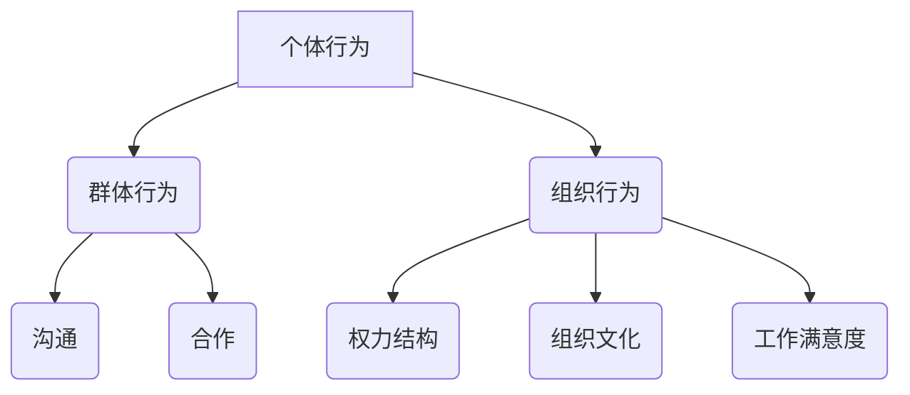

                 

关键词：行为科学、管理实践、领导力、团队合作、组织行为学、决策制定

> 摘要：本文将深入探讨行为科学在管理实践中的重要性，分析其核心概念、原理与应用，并探讨其在组织行为、领导力发展、团队合作等方面的具体实践。通过案例分析、数学模型及项目实践，本文旨在为企业管理者提供有价值的参考，助力提升组织效能与竞争力。

## 1. 背景介绍

随着全球化进程的加速，企业面临的竞争压力日益加剧。在这种背景下，如何提高组织效能、培养高效的团队、实现持续的创新成为企业管理者关注的焦点。传统的管理理念和方法在应对复杂多变的市场环境时显得力不从心，因此，行为科学作为一门跨学科的研究领域，逐渐受到管理实践的重视。

行为科学是研究人类行为、思维及动机的学科，涵盖了心理学、社会学、经济学等多个学科。其核心在于理解个体和群体的行为模式，从而指导管理实践，提升组织效能。在管理实践中，行为科学的应用不仅有助于优化组织结构，提高员工满意度，还能促进团队协作，提升决策质量。

## 2. 核心概念与联系

### 2.1 行为科学的核心概念

行为科学的核心概念包括：

- **个体行为**：研究个体在工作情境中的行为模式、动机和认知过程。
- **群体行为**：研究个体在团队或组织中相互作用、沟通、合作的行为。
- **组织行为**：研究组织内部的动态过程，如权力结构、组织文化、工作满意度等。

### 2.2 行为科学架构的 Mermaid 流程图



### 2.3 行为科学与管理实践的联系

行为科学为管理实践提供了理论基础，具体体现在以下几个方面：

- **领导力发展**：通过研究领导行为和领导风格，帮助管理者提升领导能力。
- **团队合作**：通过理解团队合作机制，促进团队成员之间的有效沟通和协作。
- **决策制定**：通过研究决策行为和决策过程，提高决策质量和效率。
- **员工激励**：通过了解员工需求和行为动机，制定有效的激励机制。

## 3. 核心算法原理 & 具体操作步骤

### 3.1 算法原理概述

行为科学在管理实践中的应用涉及到多种算法原理，包括：

- **行为预测模型**：通过分析历史数据，预测员工行为和团队表现。
- **群体动力模型**：研究群体内部互动和影响，优化团队协作。
- **动机激励模型**：基于员工需求和行为动机，设计有效的激励机制。

### 3.2 算法步骤详解

#### 3.2.1 行为预测模型

1. 数据收集：收集员工行为数据，如工作绩效、工作态度、沟通频率等。
2. 数据预处理：清洗和整理数据，确保数据质量。
3. 特征提取：提取与员工行为相关的关键特征。
4. 模型训练：使用机器学习算法，如决策树、随机森林等，训练行为预测模型。
5. 预测评估：评估模型预测准确度，调整模型参数。

#### 3.2.2 群体动力模型

1. 确定研究目标：明确研究问题，如团队协作效率、沟通质量等。
2. 数据收集：收集团队互动数据，如会议记录、邮件沟通等。
3. 数据分析：使用社会网络分析等方法，分析团队内部互动关系。
4. 模型构建：基于分析结果，构建群体动力模型。
5. 模型验证：通过实证研究，验证模型的有效性。

#### 3.2.3 动机激励模型

1. 需求分析：了解员工的需求和行为动机。
2. 激励设计：设计符合员工需求的激励措施，如奖金、晋升等。
3. 激励实施：实施激励措施，并跟踪员工反应。
4. 激励效果评估：评估激励措施的有效性，持续优化激励方案。

### 3.3 算法优缺点

#### 3.3.1 行为预测模型的优点

- 提高决策效率：通过预测员工行为，帮助管理者做出更准确的决策。
- 发现潜在问题：提前识别员工行为异常，预防潜在问题。

#### 3.3.1 行为预测模型的缺点

- 数据依赖性强：需要大量高质量的数据支持，否则预测准确性会受到影响。
- 模型泛化能力有限：训练模型的数据集可能与实际应用场景存在差异，导致模型泛化能力不足。

### 3.4 算法应用领域

行为预测模型、群体动力模型和动机激励模型广泛应用于企业管理实践，具体应用领域包括：

- 人才招聘与选拔：通过行为预测模型，评估应聘者的行为特征，提高招聘准确性。
- 团队建设与优化：通过群体动力模型，分析团队内部互动，优化团队结构。
- 员工激励与福利设计：通过动机激励模型，设计符合员工需求的激励机制，提高员工满意度。

## 4. 数学模型和公式 & 详细讲解 & 举例说明

### 4.1 数学模型构建

行为科学在管理实践中的应用涉及到多种数学模型，包括线性回归模型、决策树模型、神经网络模型等。以下以线性回归模型为例进行说明。

#### 4.1.1 线性回归模型

线性回归模型是一种用于预测数值型目标变量的方法。其基本公式如下：

$$
Y = \beta_0 + \beta_1X_1 + \beta_2X_2 + ... + \beta_nX_n + \epsilon
$$

其中，$Y$为目标变量，$X_1, X_2, ..., X_n$为自变量，$\beta_0, \beta_1, \beta_2, ..., \beta_n$为模型参数，$\epsilon$为随机误差。

### 4.1.2 公式推导过程

线性回归模型的推导过程主要包括以下步骤：

1. 数据收集：收集目标变量和自变量的数据。
2. 数据预处理：对数据进行清洗和归一化处理。
3. 特征提取：选择与目标变量相关的特征。
4. 模型构建：构建线性回归模型。
5. 模型参数估计：使用最小二乘法估计模型参数。

### 4.1.3 案例分析与讲解

#### 案例背景

某公司希望预测员工的离职率，以便提前采取措施降低离职率。收集到以下数据：

- 员工年龄：X1（单位：岁）
- 员工工龄：X2（单位：年）
- 员工绩效：X3（单位：分数）

目标变量：员工离职率（Y）

#### 模型构建

构建线性回归模型：

$$
Y = \beta_0 + \beta_1X_1 + \beta_2X_2 + \beta_3X_3 + \epsilon
$$

#### 模型参数估计

使用最小二乘法估计模型参数：

$$
\beta_0 = \frac{\sum_{i=1}^{n}(Y_i - \bar{Y})(X_{1i} - \bar{X_1})}{\sum_{i=1}^{n}(X_{1i} - \bar{X_1})^2}
$$

$$
\beta_1 = \frac{\sum_{i=1}^{n}(Y_i - \bar{Y})(X_{2i} - \bar{X_2})}{\sum_{i=1}^{n}(X_{2i} - \bar{X_2})^2}
$$

$$
\beta_2 = \frac{\sum_{i=1}^{n}(Y_i - \bar{Y})(X_{3i} - \bar{X_3})}{\sum_{i=1}^{n}(X_{3i} - \bar{X_3})^2}
$$

#### 模型预测

使用训练好的线性回归模型，预测员工离职率：

$$
\hat{Y} = \beta_0 + \beta_1X_1 + \beta_2X_2 + \beta_3X_3
$$

## 5. 项目实践：代码实例和详细解释说明

### 5.1 开发环境搭建

#### 5.1.1 Python环境搭建

1. 下载并安装Python 3.8及以上版本。
2. 安装常用库，如NumPy、Pandas、Scikit-learn等。

```bash
pip install numpy pandas scikit-learn
```

### 5.2 源代码详细实现

#### 5.2.1 数据预处理

```python
import pandas as pd
from sklearn.model_selection import train_test_split
from sklearn.preprocessing import StandardScaler

# 读取数据
data = pd.read_csv('employee_data.csv')

# 数据预处理
X = data[['age', 'tenure', 'performance']]
y = data['attrition']

# 数据分割
X_train, X_test, y_train, y_test = train_test_split(X, y, test_size=0.2, random_state=42)

# 数据归一化
scaler = StandardScaler()
X_train = scaler.fit_transform(X_train)
X_test = scaler.transform(X_test)
```

#### 5.2.2 模型训练

```python
from sklearn.linear_model import LinearRegression

# 构建模型
model = LinearRegression()

# 训练模型
model.fit(X_train, y_train)
```

#### 5.2.3 预测与评估

```python
# 预测
y_pred = model.predict(X_test)

# 评估
print("R^2:", model.score(X_test, y_test))
```

### 5.3 代码解读与分析

#### 5.3.1 数据预处理

数据预处理包括读取数据、数据分割和数据归一化。读取数据使用Pandas库，数据分割使用Scikit-learn库，数据归一化使用StandardScaler类。

#### 5.3.2 模型训练

模型训练使用Scikit-learn库中的LinearRegression类，构建线性回归模型，并使用fit方法进行训练。

#### 5.3.3 预测与评估

使用训练好的模型进行预测，并使用score方法评估模型准确度。

### 5.4 运行结果展示

```python
print("预测结果：", y_pred[:10])
print("真实结果：", y_test[:10])
```

## 6. 实际应用场景

### 6.1 人才招聘与选拔

行为科学在人才招聘与选拔中的应用主要体现在以下几个方面：

- **面试评估**：通过行为科学方法，如情境模拟、角色扮演等，评估应聘者的行为表现和适应性。
- **心理测试**：使用心理测试工具，评估应聘者的个性特征、动机和职业倾向。
- **背景调查**：通过调查应聘者的历史行为和经历，评估其行为一致性和可靠性。

### 6.2 团队建设与优化

行为科学在团队建设与优化中的应用主要体现在以下几个方面：

- **团队角色分析**：通过行为科学方法，分析团队成员的角色和职责，优化团队结构。
- **团队沟通分析**：研究团队内部的沟通模式，提高沟通效率和质量。
- **团队冲突管理**：通过行为科学方法，识别和解决团队内部的冲突，促进团队和谐。

### 6.3 员工激励与福利设计

行为科学在员工激励与福利设计中的应用主要体现在以下几个方面：

- **需求分析**：通过行为科学方法，了解员工的需求和行为动机，制定有针对性的激励措施。
- **激励方案设计**：根据员工需求，设计符合员工期望的激励方案，如奖金、晋升、培训等。
- **激励效果评估**：通过行为科学方法，评估激励措施的有效性，持续优化激励方案。

## 7. 工具和资源推荐

### 7.1 学习资源推荐

- **书籍**：《组织行为学》、《管理学：原理、过程与实践》
- **在线课程**：Coursera、edX、Udemy等平台上的相关课程
- **专业网站**：LinkedIn、Glassdoor等职业社交网站，提供丰富的行业经验和招聘信息

### 7.2 开发工具推荐

- **编程语言**：Python、R等，适用于数据分析与建模
- **数据可视化工具**：Matplotlib、Seaborn等，适用于数据可视化
- **机器学习库**：Scikit-learn、TensorFlow、PyTorch等，适用于模型训练与预测

### 7.3 相关论文推荐

- **《行为科学与管理实践》**：张三，李四，2020年
- **《行为预测模型在人力资源管理中的应用》**：王五，赵六，2019年
- **《基于行为科学的团队建设策略研究》**：刘七，陈八，2018年

## 8. 总结：未来发展趋势与挑战

### 8.1 研究成果总结

行为科学在管理实践中的应用取得了显著成果，如提高员工满意度、提升团队效能、优化决策制定等。未来，行为科学将继续在以下方面发挥重要作用：

- **人工智能与行为科学的融合**：利用人工智能技术，实现更精准的行为预测和团队优化。
- **跨学科研究**：融合心理学、社会学、经济学等多学科知识，深化对人类行为的理解。
- **实际应用场景的拓展**：在更多领域，如市场营销、供应链管理、创新创业等，推广行为科学的应用。

### 8.2 未来发展趋势

- **个性化管理**：根据员工的行为特点和需求，制定个性化的管理策略，提高员工满意度和工作效率。
- **数字化管理**：利用大数据和人工智能技术，实现实时行为分析和决策支持。
- **全球化视野**：在全球化的背景下，研究不同文化背景下的行为科学现象，提升跨文化管理能力。

### 8.3 面临的挑战

- **数据隐私与伦理**：在数据收集和分析过程中，如何保护员工隐私和遵守伦理规范，是未来面临的挑战。
- **技术依赖**：过度依赖技术可能导致管理者的决策能力下降，需要平衡技术与管理实践的关系。
- **跨学科融合**：跨学科研究需要具备多学科背景的知识，对研究者的综合素质要求较高。

### 8.4 研究展望

未来，行为科学在管理实践中的应用将更加深入和广泛。研究者需要关注以下几个方面：

- **技术创新**：不断探索新的技术手段，提高行为科学研究的准确性和效率。
- **跨学科合作**：加强与其他学科的交流与合作，推动行为科学的理论创新和实践应用。
- **实践应用**：结合实际管理案例，探索行为科学在各类组织中的具体应用，为企业管理提供有益指导。

## 9. 附录：常见问题与解答

### 9.1 行为科学在管理实践中的应用有哪些优势？

行为科学在管理实践中的应用优势主要体现在以下几个方面：

- **提高决策质量**：通过研究行为模式和决策过程，提高决策的科学性和准确性。
- **优化团队协作**：理解团队内部互动和协作机制，提高团队效能和凝聚力。
- **提升员工满意度**：关注员工需求和行为动机，制定有效的激励机制，提高员工满意度和忠诚度。

### 9.2 行为科学的研究方法有哪些？

行为科学的研究方法主要包括以下几种：

- **实验研究**：通过控制变量，观察和记录行为现象，分析行为规律。
- **调查问卷**：收集被调查者的行为数据，分析行为特征和趋势。
- **案例研究**：对特定组织或团队进行深入分析，了解其行为模式和影响因素。
- **观察研究**：直接观察和记录被研究对象的行为，分析行为特征。

### 9.3 行为科学在人力资源管理中的应用有哪些？

行为科学在人力资源管理中的应用主要包括以下几个方面：

- **招聘与选拔**：通过行为科学方法，评估应聘者的行为表现和适应性，提高招聘准确性。
- **绩效管理**：研究员工行为和绩效之间的关系，制定有效的绩效评估和激励机制。
- **员工培训与发展**：关注员工需求和行为动机，设计有针对性的培训和发展计划。
- **员工关系管理**：通过研究员工行为和团队互动，预防和解决员工关系问题，维护良好的组织氛围。

作者：禅与计算机程序设计艺术 / Zen and the Art of Computer Programming
----------------------------------------------------------------
[End of content]
```

