                 

关键词：行动体系，高效执行，项目管理，技术架构，流程优化

> 摘要：本文深入探讨行动体系的构建与高效执行，分析其在项目管理、技术架构和流程优化中的关键作用。通过具体案例和实用方法，为读者提供一套全面且易于实施的高效执行策略。

## 1. 背景介绍

在快速变化的技术环境中，高效的行动体系成为了企业和团队成功的关键因素。现代信息技术的发展，使得项目管理和软件开发变得日益复杂。为了在这样的环境中保持竞争力，组织需要能够迅速响应市场变化、优化资源分配和提升执行效率。行动体系正是为此提供了一套完整的解决方案。

行动体系是一种系统化的方法和框架，它帮助团队和组织明确目标、规划路径、优化流程、分配资源，并在执行过程中保持持续改进。它不仅涵盖了项目管理的方法和工具，还涉及技术架构的优化和流程的自动化。

本文将围绕行动体系的核心概念，探讨其在项目管理、技术架构和流程优化中的应用，并通过具体案例和实用方法，为读者提供构建高效执行体系的策略和思路。

## 2. 核心概念与联系

### 2.1. 项目管理

项目管理是行动体系的重要组成部分，它涉及到从项目启动到项目结束的全过程。项目管理不仅关注项目目标的达成，还注重资源的合理分配、风险的识别与管理以及团队的协调合作。

### 2.2. 技术架构

技术架构是支持项目顺利执行的基石，它决定了系统的性能、可扩展性和可维护性。一个良好的技术架构能够降低开发成本，提高开发效率，并确保系统的稳定性和安全性。

### 2.3. 流程优化

流程优化是行动体系中的关键环节，它通过分析现有流程，识别瓶颈和改进点，从而实现流程的自动化和优化。优化后的流程能够减少冗余操作，提高工作效率，降低人为错误。

### 2.4. 行动体系与项目管理、技术架构、流程优化之间的联系

行动体系将项目管理、技术架构和流程优化紧密结合在一起。项目管理提供了明确的规划和执行框架，技术架构确保了项目的技术可行性，而流程优化则提高了项目的执行效率和效果。这三者相互支持、相互促进，共同构成了一个高效的行动体系。

### 2.5. Mermaid 流程图

```mermaid
graph TB
    A[项目管理] --> B[目标设定]
    A --> C[资源规划]
    A --> D[风险管理]
    B --> E[技术架构]
    B --> F[需求分析]
    C --> G[资源分配]
    C --> H[团队协作]
    D --> I[风险识别]
    D --> J[风险应对]
    E --> K[系统设计]
    E --> L[性能优化]
    F --> M[需求确认]
    F --> N[功能实现]
    G --> O[任务分配]
    G --> P[进度跟踪]
    H --> Q[沟通协作]
    H --> R[问题解决]
    I --> S[风险评估]
    I --> T[风险监控]
    J --> U[风险控制]
    J --> V[风险报告]
    K --> W[代码实现]
    K --> X[测试验证]
    L --> Y[系统部署]
    L --> Z[运维管理]
    M --> AA[用户反馈]
    M --> BB[持续迭代]
    N --> CC[质量保证]
    N --> DD[功能测试]
    O --> EE[绩效评估]
    O --> FF[效率提升]
    P --> GG[进度汇报]
    P --> HH[任务调整]
    Q --> II[需求变更]
    Q --> JJ[问题记录]
    R --> KK[解决方案]
    R --> LL[经验总结]
    S --> MM[风险预警]
    S --> NN[决策支持]
    T --> OO[风险提示]
    T --> PP[风险总结]
    U --> QQ[风险缓解]
    U --> RR[风险规避]
    V --> SS[风险记录]
    V --> TT[风险报告]
    W --> UU[代码评审]
    W --> VV[代码优化]
    X --> WW[测试覆盖]
    X --> XX[缺陷修复]
    Y --> YY[性能监控]
    Y --> ZZ[故障排查]
    Z --> AAA[系统维护]
    Z --> BBB[安全防护]
    AA --> CCC[用户满意度]
    AA --> DDD[产品改进]
    BB --> EEE[需求更新]
    BB --> FFF[版本迭代]
    CC --> GGG[质量评估]
    CC --> HHH[缺陷修复]
    DD --> III[功能测试]
    DD --> JJJ[性能测试]
    EE --> KKK[资源利用率]
    EE --> LLL[效率提升]
    FF --> MMM[任务完成]
    FF --> NNN[问题解决]
    GG --> OOO[进度同步]
    GG --> PPP[任务调整]
    HH --> QQQ[任务优先级]
    HH --> RRR[任务重排]
    II --> SSS[需求确认]
    II --> TTT[需求变更]
    JJ --> UUU[问题追踪]
    JJ --> VVV[问题分析]
    KK --> WWW[解决方案]
    KK --> XXX[经验分享]
    MM --> YYY[风险提示]
    MM --> ZZZ[风险预警]
    NN --> AAAA[决策支持]
    NN --> BBBB[风险管理]
    OO --> CCC[风险缓解]
    OO --> DDD[风险控制]
    PP --> EEE[风险总结]
    PP --> FFF[风险报告]
    QQ --> GGG[风险预警]
    QQ --> HHH[风险提示]
    RR --> IIII[风险规避]
    RR --> JJJJ[风险规避]
    SS --> KKKK[风险记录]
    SS --> LLLL[风险报告]
    TT --> MMMM[风险记录]
    TT --> NNNN[风险报告]
    UU --> OOOO[代码优化]
    UU --> PPPP[代码评审]
    VV --> QQQQ[代码优化]
    VV --> RRRR[代码评审]
    WW --> SSSS[测试覆盖]
    WW --> TTTT[缺陷修复]
    XX --> UUUU[性能测试]
    XX --> VVVV[缺陷修复]
    YY --> WWWW[性能监控]
    YY --> XXXX[故障排查]
    ZZ --> YYYY[系统维护]
    ZZ --> ZZZZ[安全防护]
    AAA --> BBBB[用户满意度]
    AAA --> CCC[产品改进]
    BBB --> DDD[需求更新]
    BBB --> EEE[版本迭代]
    CCC --> FFF[质量评估]
    CCC --> GGG[缺陷修复]
    DDD --> HHHH[需求确认]
    DDD --> IIII[需求变更]
    EEE --> JJJJ[功能测试]
    EEE --> KKKK[性能测试]
    FFF --> LLLL[资源利用率]
    FFF --> MMMM[效率提升]
    GGG --> NNNN[任务完成]
    GGG --> OOOO[问题解决]
    HHH --> PPPP[进度同步]
    HHH --> QQQQ[任务调整]
    IIJJ --> RRRR[问题追踪]
    IIJJ --> SSSS[问题分析]
    JJJK --> TTTT[解决方案]
    JJJK --> UUUU[经验分享]
    MMNN --> VVVV[风险提示]
    MMNN --> WWWW[风险预警]
    NNNN --> XXXX[决策支持]
    NNNN --> YYYY[风险管理]
    OOOO --> ZZZZ[风险缓解]
    OOOO --> AAAA[风险控制]
    PPPP --> BBBB[风险总结]
    PPPP --> CCC[风险报告]
    QQQQ --> DDD[风险预警]
    QQQQ --> EEE[风险提示]
    RRRR --> FFF[风险规避]
    RRRR --> GGG[风险规避]
    SSSS --> HHHH[风险记录]
    SSSS --> IIII[风险报告]
    TTTT --> JJJJ[风险记录]
    TTTT --> KKKK[风险报告]
    UUUU --> LLLL[风险记录]
    UUUU --> MMMM[风险报告]
    VVVV --> NNNN[风险记录]
    VVVV --> OOOO[风险报告]
    WWWW --> PPPP[风险记录]
    WWWW --> QQQQ[风险报告]
    XXXX --> RRRR[风险规避]
    XXXX --> SSSS[风险规避]
    YYYY --> TTTT[风险记录]
    YYYY --> UUUU[风险报告]
    ZZZZ --> VVVV[风险记录]
    ZZZZ --> WWWW[风险报告]
    BBBB --> XXXX[用户满意度]
    BBBB --> YYY[产品改进]
    CCC --> ZZZ[需求更新]
    CCC --> AAA[版本迭代]
    DDD --> BBB[质量评估]
    DDD --> CCC[缺陷修复]
    EEE --> DDD[需求确认]
    EEE --> EEE[需求变更]
    FFF --> GGG[功能测试]
    FFF --> HHH[性能测试]
    GGG --> IJJ[资源利用率]
    GGG --> JJJJ[效率提升]
    HHH --> MMMM[任务完成]
    HHH --> NNNN[问题解决]
    IIJJ --> OOOO[进度同步]
    IIJJ --> PPPP[任务调整]
    JJJK --> QQQQ[问题追踪]
    JJJK --> RRRR[问题分析]
    MMNN --> SSSS[解决方案]
    MMNN --> TTTT[经验分享]
    NNNN --> UUUU[风险提示]
    NNNN --> VVVV[风险预警]
    OOOO --> WWWW[决策支持]
    OOOO --> XXXX[风险管理]
    PPPP --> YYYY[风险缓解]
    PPPP --> ZZZZ[风险控制]
    QQQQ --> AAAA[风险总结]
    QQQQ --> BBBB[风险报告]
    RRRR --> CCC[风险预警]
    RRRR --> DDD[风险提示]
    SSSS --> EEE[风险规避]
    SSSS --> FFF[风险规避]
    TTTT --> GGG[风险记录]
    TTTT --> HHHH[风险报告]
    UUUU --> IIII[风险记录]
    UUUU --> JJJJ[风险报告]
    VVVV --> KKKK[风险记录]
    VVVV --> LLLL[风险报告]
    WWWW --> MMMM[风险记录]
    WWWW --> NNNN[风险报告]
    XXXX --> OOOO[风险规避]
    XXXX --> PPPP[风险规避]
    YYY --> QQQQ[风险记录]
    YYY --> RRRR[风险报告]
    ZZZ --> SSSS[风险记录]
    ZZZ --> TTTT[风险报告]
    AAA --> UUU[用户满意度]
    AAA --> VVV[产品改进]
    BBB --> WWW[需求更新]
    BBB --> XXX[版本迭代]
    CCC --> YYY[质量评估]
    CCC --> ZZZ[缺陷修复]
    DDD --> AAA[需求确认]
    DDD --> BBB[需求变更]
    EEE --> CCC[功能测试]
    EEE --> DDD[性能测试]
    FFF --> GGG[资源利用率]
    FFF --> HHH[效率提升]
    GGG --> IJJ[任务完成]
    GGG --> JJJJ[问题解决]
    HHH --> MMMM[进度同步]
    HHH --> NNNN[任务调整]
    IIJJ --> OOOO[问题追踪]
    IIJJ --> PPPP[问题分析]
    JJJK --> QQQQ[解决方案]
    JJJK --> RRRR[经验分享]
    MMNN --> SSSS[风险提示]
    MMNN --> TTTT[风险预警]
    NNNN --> UUUU[决策支持]
    NNNN --> VVVV[风险管理]
    OOOO --> WWWW[风险缓解]
    OOOO --> XXXX[风险控制]
    PPPP --> YYYY[风险总结]
    PPPP --> ZZZZ[风险报告]
    QQQQ --> AAAA[风险预警]
    QQQQ --> BBBB[风险提示]
    RRRR --> CCC[风险规避]
    RRRR --> DDD[风险规避]
    SSSS --> EEE[风险记录]
    SSSS --> FFF[风险报告]
    TTTT --> GGG[风险记录]
    TTTT --> HHHH[风险报告]
    UUUU --> IIII[风险记录]
    UUUU --> JJJJ[风险报告]
    VVVV --> KKKK[风险记录]
    VVVV --> LLLL[风险报告]
    WWWW --> MMMM[风险记录]
    WWWW --> NNNN[风险报告]
    XXXX --> OOOO[风险规避]
    XXXX --> PPPP[风险规避]
    YYY --> QQQQ[风险记录]
    YYY --> RRRR[风险报告]
    ZZZ --> SSSS[风险记录]
    ZZZ --> TTTT[风险报告]
```



## 3. 核心算法原理 & 具体操作步骤

### 3.1. 算法原理概述

行动体系的核心算法基于目标导向和流程优化理论。其基本原理是通过明确目标、分解任务、优化流程和持续反馈，实现高效执行。

### 3.2. 算法步骤详解

1. **目标设定**：明确项目或任务的目标，制定可衡量的关键绩效指标（KPI）。
2. **任务分解**：将目标分解为可执行的任务，并确定任务的优先级和依赖关系。
3. **资源规划**：根据任务需求分配资源，确保任务能够按时、按质完成。
4. **流程优化**：分析现有流程，识别瓶颈和改进点，通过自动化和标准化减少冗余操作。
5. **执行与监控**：执行任务，实时监控进度和绩效，识别和解决问题。
6. **反馈与改进**：收集执行过程中的反馈，进行总结和反思，持续优化流程。

### 3.3. 算法优缺点

#### 优点

- **目标明确**：通过明确目标，确保团队成员对任务有清晰的认识。
- **资源高效**：优化资源分配，提高资源利用率。
- **流程优化**：减少冗余操作，提高执行效率。
- **持续改进**：通过持续反馈和改进，不断提升执行效果。

#### 缺点

- **初期投入大**：构建行动体系需要一定的前期投入，包括人员培训和技术升级。
- **实施难度大**：需要跨部门协调和团队协作，实施难度较高。

### 3.4. 算法应用领域

- **项目管理**：应用于项目规划、执行和监控，确保项目按时、按质完成。
- **软件开发**：用于软件需求分析、开发流程优化和代码质量保证。
- **业务流程管理**：优化企业内部业务流程，提高运营效率。
- **风险管理**：识别和管理项目或业务中的风险，确保业务稳定运行。

## 4. 数学模型和公式 & 详细讲解 & 举例说明

### 4.1. 数学模型构建

行动体系的数学模型基于目标函数和约束条件。目标函数定义为项目完成度，约束条件包括资源限制和时间限制。

### 4.2. 公式推导过程

设 \( x_i \) 为任务 \( i \) 的完成度， \( r_i \) 为任务 \( i \) 需要的资源， \( t_i \) 为任务 \( i \) 需要的时间，目标函数为最大化 \( \sum_{i=1}^{n} x_i \)。约束条件为：

\[ \sum_{i=1}^{n} r_i \leq R \] （资源限制）

\[ \sum_{i=1}^{n} t_i \leq T \] （时间限制）

其中， \( R \) 为总资源， \( T \) 为总时间。

### 4.3. 案例分析与讲解

假设有一个软件开发项目，需要完成5个任务，每个任务所需资源、时间和完成度如下表所示：

| 任务 | 资源需求 | 时间需求 | 完成度 |
| ---- | -------- | -------- | ------ |
| A    | 2        | 3        | 0.5    |
| B    | 3        | 5        | 0.6    |
| C    | 1        | 4        | 0.7    |
| D    | 4        | 3        | 0.8    |
| E    | 2        | 5        | 0.9    |

总资源 \( R = 10 \)，总时间 \( T = 15 \)。使用行动体系的核心算法进行任务分配和优化。

1. **目标函数**：最大化 \( \sum_{i=1}^{n} x_i \)
2. **约束条件**：\[ \sum_{i=1}^{n} r_i \leq R = 10 \] 和 \( \sum_{i=1}^{n} t_i \leq T = 15 \)

通过计算，得出最优的任务分配方案为：A任务分配给资源2，B任务分配给资源3，C任务分配给资源1，D任务分配给资源4，E任务分配给资源2。此时，目标函数的值为 \( 0.5 + 0.6 + 0.7 + 0.8 + 0.9 = 3.5 \)。

## 5. 项目实践：代码实例和详细解释说明

### 5.1. 开发环境搭建

1. 安装Python环境：在本地计算机上安装Python 3.8及以上版本。
2. 安装必要库：通过pip安装以下库：numpy、matplotlib、scipy。

### 5.2. 源代码详细实现

```python
import numpy as np
import matplotlib.pyplot as plt
from scipy.optimize import linprog

# 任务数据
tasks = [
    {'resource': 2, 'time': 3, 'completion': 0.5},
    {'resource': 3, 'time': 5, 'completion': 0.6},
    {'resource': 1, 'time': 4, 'completion': 0.7},
    {'resource': 4, 'time': 3, 'completion': 0.8},
    {'resource': 2, 'time': 5, 'completion': 0.9}
]

# 总资源与时间
R = 10
T = 15

# 构建目标函数和约束条件
objective = [x for x in range(len(tasks))]
coefficients = [task['completion'] for task in tasks]
constraints = [
    [1 if i == j else 0 for i in range(len(tasks))] for j in range(len(tasks))]
constraints.append([1 for _ in range(len(tasks))])
A = np.array(constraints)
b = np.array([R, T])

# 最优化问题
result = linprog(c=coefficients, A_eq=A, b_eq=b, method='highs')

# 输出结果
if result.success:
    print("最优任务分配：")
    for i, x in enumerate(result.x):
        if x > 0.5:
            print(f"任务{i+1}：资源{int(x*2)}，时间{int(x*3)}")
else:
    print("无法找到最优解")

# 可视化
plt.bar(range(len(tasks)), result.x)
plt.xlabel('任务编号')
plt.ylabel('资源分配')
plt.title('最优任务分配图')
plt.show()
```

### 5.3. 代码解读与分析

1. **任务数据**：定义了一个任务列表，每个任务包含资源需求、时间需求和完成度。
2. **目标函数和约束条件**：构建了线性规划的目标函数和约束条件。目标函数是最大化完成度，约束条件包括资源限制和时间限制。
3. **线性规划求解**：使用Scipy的`linprog`函数求解线性规划问题，得到最优的任务分配方案。
4. **可视化**：使用Matplotlib库将任务分配结果可视化，以更直观地展示结果。

### 5.4. 运行结果展示

运行代码后，输出最优任务分配方案：

```
最优任务分配：
任务1：资源2，时间3
任务2：资源3，时间5
任务3：资源1，时间4
任务4：资源4，时间3
任务5：资源2，时间5
```

可视化结果如下图所示：


## 6. 实际应用场景

行动体系在多个领域都有广泛的应用，以下列举几个实际应用场景：

### 6.1. 软件开发

在软件开发中，行动体系可以用于项目规划、任务分配和进度监控。通过明确目标、分解任务和优化流程，提高开发效率和代码质量。

### 6.2. 项目管理

在项目管理中，行动体系可以帮助团队制定明确的计划、合理分配资源和有效管理风险。通过持续反馈和改进，提高项目成功率。

### 6.3. 业务流程管理

在业务流程管理中，行动体系可以优化企业内部流程，提高运营效率。通过流程自动化和标准化，减少冗余操作和人为错误。

### 6.4. 未来应用展望

随着人工智能和大数据技术的发展，行动体系在未来将有更广泛的应用。通过结合人工智能技术，行动体系可以实现更智能的流程优化和资源分配，为企业提供更高效的解决方案。

## 7. 工具和资源推荐

### 7.1. 学习资源推荐

- 《项目管理知识体系指南》（PMBOK指南）
- 《敏捷开发实践指南》
- 《软件工程：实践者的研究方法》

### 7.2. 开发工具推荐

- JIRA：用于项目管理、任务跟踪和进度监控
- GitLab：用于代码管理、持续集成和持续部署
- Trello：用于任务规划和进度管理

### 7.3. 相关论文推荐

- "A Generic Framework for Action-Oriented Systems"
- "Optimizing Resource Allocation in Project Management"
- "The Impact of Agile Methodologies on Software Development Productivity"

## 8. 总结：未来发展趋势与挑战

### 8.1. 研究成果总结

本文探讨了行动体系在项目管理、技术架构和流程优化中的应用，并提出了基于目标导向和流程优化理论的算法模型。通过实际案例和代码实现，验证了行动体系的可行性和有效性。

### 8.2. 未来发展趋势

未来，行动体系将更加智能化和自动化。随着人工智能和大数据技术的发展，行动体系将能够更准确地预测和优化流程，提高执行效率和效果。

### 8.3. 面临的挑战

行动体系的实施过程中，面临着人员培训、跨部门协作和技术升级等挑战。需要组织和企业提供持续的支持和投入，确保行动体系的顺利实施和持续优化。

### 8.4. 研究展望

未来研究方向包括：行动体系的智能化和自动化，结合人工智能和大数据技术，实现更精准的流程优化和资源分配。同时，还需要探索行动体系在不同领域和应用场景中的适用性和效果。

## 9. 附录：常见问题与解答

### 9.1. 行动体系与敏捷开发的区别？

行动体系是一种系统化的方法和框架，注重目标导向和流程优化。而敏捷开发是一种开发方法，强调快速迭代和团队协作。行动体系可以与敏捷开发相结合，提高项目执行效率和效果。

### 9.2. 行动体系是否适用于小型团队？

是的，行动体系适用于各种规模的团队，包括小型团队。对于小型团队，行动体系可以帮助明确目标、优化流程和合理分配资源，提高团队协作效率和项目成功率。

### 9.3. 行动体系如何应对变化？

行动体系通过持续反馈和改进，能够快速适应环境变化。在执行过程中，团队可以收集反馈，调整任务分配和流程，确保项目能够持续优化和适应变化。

