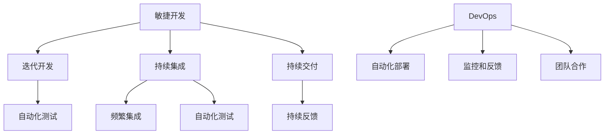

                 

关键词：行动体系、执行力、提升、技术、方法论、团队协作、项目管理

> 摘要：本文将从计算机技术领域的角度，探讨如何构建一个有效的行动体系以提升团队和个人执行力。通过分析技术团队在项目开发过程中面临的挑战，以及如何利用技术工具和方法论来优化行动流程，本文旨在为读者提供实用的指导和建议。

## 1. 背景介绍

在现代信息技术飞速发展的背景下，团队和个人执行力对于项目的成功至关重要。随着企业对于快速响应市场变化和高效交付产品需求的压力不断增加，如何提升执行力成为了一个关键议题。在技术领域，高效的执行力不仅关乎项目进度和质量，也直接影响到团队的创新能力和竞争力。

然而，执行力并非一蹴而就，它需要一系列的系统性和持续性的努力。本文将从以下几个方面探讨如何构建一个有效的行动体系来提升执行力：

- **核心概念与联系**：介绍与执行力相关的关键概念，如敏捷开发、持续集成、DevOps等，并展示其相互之间的联系。
- **核心算法原理 & 具体操作步骤**：详细探讨提升执行力的核心算法原理，包括需求分析、任务分解、进度跟踪等，并提供具体的操作步骤。
- **数学模型和公式**：运用数学模型和公式来量化执行力，通过数据分析和统计方法来评估执行效果。
- **项目实践：代码实例和详细解释说明**：通过实际项目案例，展示如何在实际开发过程中应用行动体系来提升执行力。
- **实际应用场景**：讨论行动体系在不同类型项目中的应用，以及其在面对不同挑战时的适应性和效果。
- **未来应用展望**：展望行动体系在未来的发展趋势，以及可能面临的挑战。

## 2. 核心概念与联系

### 2.1 敏捷开发

敏捷开发是一种以人为核心、迭代、渐进的方法论，强调快速反馈、灵活调整和持续交付。其核心理念包括：

- **需求优先级**：通过用户故事和迭代规划来明确和排序需求，确保团队始终专注于最高优先级的工作。
- **迭代开发**：将项目划分为多个短周期（迭代），在每个迭代中完成一个可交付的增量产品。
- **持续交付**：通过自动化测试和持续集成，确保每次交付的产品都是高质量和稳定的。

### 2.2 持续集成

持续集成是一种软件开发实践，通过频繁地将代码集成到主干分支，以快速发现和解决集成问题。其关键点包括：

- **频繁集成**：开发人员定期将代码合并到主干分支，确保主干分支始终保持稳定。
- **自动化测试**：在每次集成后自动运行一系列测试，确保新代码不会破坏现有功能。
- **持续反馈**：通过即时反馈机制，帮助开发人员快速了解代码集成后的状态，从而进行必要的调整。

### 2.3 DevOps

DevOps是一种文化和实践，旨在通过开发（Development）和运维（Operations）之间的紧密协作，实现快速交付和高质量的服务。其核心包括：

- **自动化部署**：通过自动化脚本和工具，简化部署过程，减少人为错误和提高效率。
- **监控和反馈**：持续监控系统运行状态，及时发现问题并进行反馈和优化。
- **团队合作**：建立跨职能团队，打破开发与运维之间的壁垒，促进信息的流动和协作。

### 2.4 Mermaid 流程图

为了更直观地展示核心概念之间的联系，我们可以使用Mermaid流程图来表示：



通过上述核心概念的分析和Mermaid流程图的展示，我们可以看到，敏捷开发、持续集成和DevOps在提升执行力方面是相辅相成的。它们共同构成了一个系统化的行动体系，为团队和个人提供了有效的执行框架。

### 3. 核心算法原理 & 具体操作步骤

#### 3.1 算法原理概述

提升执行力的核心在于有效管理项目需求和任务，确保团队在有限的时间内交付高质量的产品。这需要一系列算法原理和方法来支持：

- **需求分析**：明确项目目标和用户需求，确保所有工作都是围绕用户价值展开的。
- **任务分解**：将大型任务拆分为可管理的小任务，以便团队成员可以集中精力完成。
- **进度跟踪**：实时监控任务进度，确保项目按时完成。
- **风险管理**：识别潜在风险，并制定应对策略，以减少项目延误和质量问题。

#### 3.2 算法步骤详解

##### 3.2.1 需求分析

1. **用户故事编写**：采用用户故事格式（As a user, I want to... so that...）来明确用户需求。
2. **优先级排序**：根据业务价值和紧急程度，对用户故事进行优先级排序。
3. **验证需求**：与用户或利益相关者进行沟通，确保需求的准确性和可行性。

##### 3.2.2 任务分解

1. **用户故事映射**：将优先级最高的用户故事映射到具体任务。
2. **任务拆分**：将大任务拆分为小任务，每个任务都应具有明确的交付物。
3. **任务分配**：根据团队成员的技能和兴趣，合理分配任务。

##### 3.2.3 进度跟踪

1. **任务板**：使用任务板（如Kanban板）来可视化任务进度，确保每个任务都有明确的处理状态。
2. **周期性回顾**：定期召开团队会议，回顾任务进度和遇到的问题，调整计划。
3. **自动化进度跟踪**：使用项目管理工具（如JIRA、Trello）来自动化进度跟踪，减少人工干预。

##### 3.2.4 风险管理

1. **风险识别**：定期识别项目中的潜在风险。
2. **风险评估**：对识别出的风险进行评估，确定其影响程度和可能性。
3. **风险应对**：制定应对策略，包括风险规避、减轻和转移等。

#### 3.3 算法优缺点

**优点**：

- **提高效率**：通过任务分解和进度跟踪，确保团队高效完成任务。
- **减少风险**：提前识别和应对风险，降低项目延误和质量问题。
- **增强灵活性**：通过迭代和持续交付，团队可以快速响应变化，保持敏捷性。

**缺点**：

- **管理复杂度**：需要持续的管理和监控，增加了团队的工作量。
- **资源依赖**：依赖自动化工具和高效的团队协作，否则效果可能打折扣。

#### 3.4 算法应用领域

算法原理和具体操作步骤适用于各种类型的项目，包括软件开发、产品开发、市场营销等。无论是在大型企业还是在初创公司，有效的执行力都是成功的关键。

### 4. 数学模型和公式 & 详细讲解 & 举例说明

在提升执行力的过程中，数学模型和公式可以帮助我们量化任务、监控进度和评估效果。以下是一些常用的数学模型和公式的讲解及实际应用。

#### 4.1 数学模型构建

**1. 项目进度模型**

项目进度模型可以帮助我们预测任务的完成时间，常用的模型包括：

- **关键路径法（Critical Path Method, CPM）**：通过计算任务之间的依赖关系，找出影响项目完成时间的关键路径。
- **项目评估与审查技术（Program Evaluation and Review Technique, PERT）**：利用概率论来评估任务完成时间和风险。

**2. 任务复杂度模型**

任务复杂度模型用于评估任务的难度和所需资源，常用的模型包括：

- **功能点分析（Function Point Analysis, FPA）**：通过功能点数量来评估软件任务的复杂度。
- **规模评估模型（Size Estimation Models）**：如COCOMO（Constructive Cost Model）和SEER-SEM（Software Engineering Estimation Model）。

#### 4.2 公式推导过程

**1. 关键路径法（CPM）**

CPM的公式推导如下：

- **网络图**：表示任务及其依赖关系的图形模型。
- **最早开始时间（Earliest Start Time, EST）**：任务最早可以开始的时间。
- **最迟开始时间（Latest Start Time, LST）**：任务最迟必须开始的时间。
- **最早完成时间（Earliest Finish Time, EFT）**：任务最早可以完成的时间。
- **最迟完成时间（Latest Finish Time, LFT）**：任务最迟必须完成的时间。

公式推导：

\[ LST = EST + D \]
\[ LFT = EFT + D \]
\[ D = LFT - LST \]

其中，D为任务的总持续时间。

**2. 项目评估与审查技术（PERT）**

PERT的公式推导如下：

- **乐观时间（O）**：任务在最理想情况下的完成时间。
- **最可能时间（M）**：任务在正常情况下的完成时间。
- **悲观时间（P）**：任务在最不利情况下的完成时间。

公式推导：

\[ E = \frac{O + 4M + P}{6} \]
\[ D = \sqrt{E^2 - (O - E)(P - E)} \]

其中，E为期望完成时间，D为标准差，表示任务完成时间的波动范围。

#### 4.3 案例分析与讲解

**案例：项目进度计划**

假设一个软件开发项目包含5个任务，任务及其依赖关系如下：

- 任务A：2天，无依赖
- 任务B：3天，依赖任务A
- 任务C：2天，依赖任务A
- 任务D：3天，依赖任务B和任务C
- 任务E：2天，依赖任务D

根据CPM方法，我们可以计算出每个任务的关键路径和最迟开始时间：

1. **任务A**：EST = 0, EFT = 2, LST = 0, LFT = 2
2. **任务B**：EST = 2, EFT = 5, LST = 2, LFT = 5
3. **任务C**：EST = 2, EFT = 4, LST = 2, LFT = 4
4. **任务D**：EST = 5, EFT = 8, LST = 5, LFT = 8
5. **任务E**：EST = 8, EFT = 10, LST = 8, LFT = 10

关键路径为：任务A → 任务B → 任务D → 任务E，总持续时间为10天。

根据PERT方法，我们可以计算出每个任务的期望完成时间和标准差：

1. **任务A**：E = 2, D = 0
2. **任务B**：E = 3, D = 1.83
3. **任务C**：E = 2, D = 0
4. **任务D**：E = 6, D = 2.28
5. **任务E**：E = 4, D = 1.41

通过这些数学模型和公式，我们可以更准确地预测项目的完成时间和风险，从而制定更有效的行动计划。

### 5. 项目实践：代码实例和详细解释说明

在技术领域，执行力不仅体现在项目管理上，还体现在实际的代码编写和部署过程中。下面，我们将通过一个实际的代码实例，展示如何在实际项目中应用行动体系来提升执行力。

#### 5.1 开发环境搭建

为了保证项目的执行力，首先需要搭建一个稳定、高效的开发环境。以下是开发环境搭建的步骤：

1. **安装基础软件**：安装操作系统（如Linux）、编程语言（如Python）和数据库（如PostgreSQL）。
2. **配置开发工具**：安装集成开发环境（IDE，如PyCharm）、版本控制工具（如Git）和代码格式化工具（如Black）。
3. **配置自动化工具**：安装持续集成和持续交付工具（如Jenkins、Docker），以自动化代码构建、测试和部署。

#### 5.2 源代码详细实现

以下是一个简单的Python Web应用代码实例，该应用使用Flask框架实现了一个用户注册和登录功能：

```python
# app.py

from flask import Flask, request, jsonify

app = Flask(__name__)

users = {}

@app.route('/register', methods=['POST'])
def register():
    username = request.form['username']
    password = request.form['password']
    
    if username in users:
        return jsonify({'error': 'User already exists'}), 409
    
    users[username] = password
    return jsonify({'status': 'success'}), 201

@app.route('/login', methods=['POST'])
def login():
    username = request.form['username']
    password = request.form['password']
    
    if username not in users or users[username] != password:
        return jsonify({'error': 'Invalid credentials'}), 401
    
    return jsonify({'status': 'success'}), 200

if __name__ == '__main__':
    app.run(debug=True)
```

#### 5.3 代码解读与分析

该代码实例实现了两个主要的API接口：/register 和 /login。

- **/register**：接收用户名和密码，检查用户是否已存在，如果不存在则添加到用户列表中。
- **/login**：接收用户名和密码，检查用户名和密码是否匹配，如果匹配则返回成功。

代码简单易懂，但为了提升执行力和确保代码质量，我们可以采取以下改进措施：

1. **输入验证**：增加输入验证，确保用户名和密码符合规范（如长度、格式等）。
2. **安全性提升**：使用哈希算法（如SHA-256）对密码进行加密存储，以增强安全性。
3. **异常处理**：增加异常处理，确保代码在遇到错误时能够优雅地处理并给出反馈。

#### 5.4 运行结果展示

在开发环境中，我们可以使用以下命令来运行该Web应用：

```bash
python app.py
```

运行后，我们可以在浏览器或Postman等工具中访问API接口，进行用户注册和登录操作。

```bash
# 用户注册
curl -X POST -d "username=user1&password=123456" http://127.0.0.1:5000/register
# 返回结果：{"status": "success"}

# 用户登录
curl -X POST -d "username=user1&password=123456" http://127.0.0.1:5000/login
# 返回结果：{"status": "success"}
```

通过上述代码实例，我们可以看到如何在实际项目中应用行动体系来提升执行力。通过搭建稳定的环境、编写高质量的代码以及使用自动化工具，我们能够提高开发效率和项目质量。

### 6. 实际应用场景

行动体系在技术领域中的实际应用场景非常广泛，以下是一些常见的应用场景及效果分析：

#### 6.1 软件开发

在软件开发项目中，行动体系可以帮助团队更好地管理需求和任务，确保项目按期完成。通过敏捷开发、持续集成和持续交付等方法，团队可以快速响应变化，提高交付质量。

**案例**：某初创公司开发一款移动应用，采用敏捷开发模式，将需求拆分为用户故事，通过迭代开发和持续交付，成功在3个月内完成产品上线。

#### 6.2 产品开发

在产品开发过程中，行动体系可以帮助团队优化产品设计和开发流程，确保产品从概念到上市的全过程高效运行。

**案例**：某科技公司开发一款智能家居设备，通过行动体系建立跨职能团队，快速完成产品设计、开发、测试和上市，并在市场上取得成功。

#### 6.3 运维与监控

在运维和监控领域，行动体系可以帮助团队实现自动化部署、监控和反馈，提高系统稳定性和可用性。

**案例**：某互联网公司采用DevOps实践，通过自动化部署和监控，将故障响应时间缩短至分钟级，显著提高了系统的可靠性和用户体验。

#### 6.4 教育培训

在教育培训领域，行动体系可以帮助教育机构和教师更好地管理课程内容和进度，提高教学效果。

**案例**：某在线教育平台采用行动体系，通过任务分解和进度跟踪，帮助学生更好地掌握课程内容，提高了学习效果和满意度。

#### 6.5 市场营销

在市场营销领域，行动体系可以帮助团队优化营销策略和执行流程，提高市场响应速度和效果。

**案例**：某电商企业通过行动体系建立营销自动化流程，将营销活动响应时间缩短至小时级，有效提高了市场推广效果和销售额。

通过上述实际应用场景，我们可以看到行动体系在不同领域中的应用效果。无论是在软件开发、产品开发、运维监控，还是在教育培训、市场营销等方面，行动体系都能够显著提升团队和个人的执行力，从而实现项目成功。

### 6.4 未来应用展望

随着技术的不断进步和商业环境的变化，行动体系在未来将迎来更广泛的应用和发展。以下是一些未来应用展望和潜在挑战：

#### 6.4.1 人工智能与行动体系结合

人工智能（AI）技术的快速发展为行动体系提供了新的可能性。通过利用机器学习和数据挖掘技术，AI可以自动分析大量数据，为决策提供支持，从而进一步提高执行效率。

**展望**：未来，AI可以辅助行动体系中的需求分析、任务分配和进度跟踪等环节，实现更加智能化的执行管理。

**挑战**：AI的引入需要大量的数据支持和计算资源，同时对数据隐私和安全提出了更高的要求。

#### 6.4.2 区块链与行动体系融合

区块链技术的去中心化和不可篡改特性为行动体系带来了新的应用场景。通过将行动体系的各个节点记录在区块链上，可以实现更加透明和可追溯的行动流程。

**展望**：未来，区块链可以用于记录行动体系中的任务执行情况、成果验证和责任追溯，提高行动体系的可信度和效率。

**挑战**：区块链技术的性能和可扩展性需要进一步提升，以应对大规模行动体系的需求。

#### 6.4.3 虚拟现实与行动体系结合

虚拟现实（VR）技术的兴起为行动体系提供了更加直观和沉浸式的体验。通过VR，团队成员可以在虚拟环境中协作、沟通和执行任务，提高团队协作效率。

**展望**：未来，VR可以用于行动体系中的项目规划、任务演示和团队培训，为团队成员提供更加直观和高效的执行方式。

**挑战**：VR设备的成本和普及率需要进一步降低，以适应更广泛的应用场景。

#### 6.4.4 数据分析与行动体系融合

随着大数据技术的发展，行动体系可以更加有效地利用数据分析结果来优化执行过程。通过实时监控和分析项目数据，团队可以快速识别问题和优化策略，提高执行力。

**展望**：未来，数据分析将成为行动体系的重要组成部分，为团队提供更加精准和高效的执行指导。

**挑战**：数据处理和分析需要处理大量数据，同时对数据隐私和安全提出了更高的要求。

### 6.5 面临的挑战

尽管行动体系在提升执行力方面具有显著优势，但在实际应用中仍面临一些挑战：

1. **组织文化变革**：行动体系的实施需要组织文化的支持，包括团队协作、透明度和开放性等。在传统企业中，这种变革可能面临阻力。
2. **技术成熟度**：虽然许多技术工具和方法论已经成熟，但在实际应用中，技术成熟度和适应性仍是一个挑战。
3. **人员培训**：团队成员需要掌握新的工具和方法，因此人员培训是一个重要环节。

### 6.6 研究展望

未来的研究可以集中在以下几个方面：

1. **AI与行动体系融合**：探索如何更好地将AI技术应用于行动体系中，实现智能化的执行管理。
2. **区块链在行动体系中的应用**：研究如何在行动体系中利用区块链技术提高透明度和可信度。
3. **跨领域行动体系研究**：探讨行动体系在不同领域（如医疗、金融等）的应用，以及其适应性和效果。

通过不断探索和创新，行动体系将不断优化，为团队和个人的执行力提升提供更加有效的支持。

### 7. 工具和资源推荐

为了帮助读者更好地理解和应用行动体系，以下是一些建议的学习资源、开发工具和相关论文。

#### 7.1 学习资源推荐

1. **《敏捷开发实践指南》**：由Jeff Sutherland所著，详细介绍敏捷开发的理论和实践。
2. **《持续集成：从代码到云》**：由Peter J. Thompson所著，详细介绍持续集成和持续交付的方法和实践。
3. **《DevOps实践指南》**：由Jenkins之父Jeffrey A. Freed所著，介绍DevOps的核心概念和实践。

#### 7.2 开发工具推荐

1. **JIRA**：一款功能强大的项目管理工具，支持任务跟踪、进度监控和敏捷开发。
2. **Jenkins**：一款流行的持续集成和持续交付工具，支持自动化构建、测试和部署。
3. **GitLab**：一款基于Git的持续集成和持续交付平台，提供代码托管、自动化测试和容器化部署等功能。

#### 7.3 相关论文推荐

1. **"Agile Software Development: Principles, Patterns, and Practices"**：由Robert C. Martin所著，详细介绍敏捷开发的理论和实践。
2. **"Continuous Integration in the Cloud"**：由Kent Beck所著，探讨持续集成在云计算环境中的应用。
3. **"The Practice of Cloud System Administration"**：由George Wilson和Steve Gordon所著，介绍DevOps的核心概念和实践。

通过这些资源，读者可以深入了解行动体系的理论和实践，为自己的项目执行提供有力支持。

### 8. 总结：未来发展趋势与挑战

本文系统地探讨了如何构建一个有效的行动体系以提升执行力。通过介绍核心概念、算法原理、数学模型、项目实践和实际应用场景，我们展示了行动体系在技术领域的广泛应用和显著效果。未来，随着人工智能、区块链、虚拟现实等新兴技术的不断发展，行动体系将迎来更广阔的应用前景。

然而，行动体系在实际应用中仍面临组织文化变革、技术成熟度和人员培训等挑战。未来的研究应重点关注如何更好地融合AI技术、探索区块链在行动体系中的应用，以及跨领域行动体系的研究。

通过不断探索和创新，行动体系将为团队和个人的执行力提升提供更加有效的支持，助力项目成功和企业发展。

### 9. 附录：常见问题与解答

以下是一些关于行动体系和执行力提升的常见问题及解答：

#### 9.1 行动体系和项目管理有什么区别？

**解答**：行动体系是一种系统化的方法论，侧重于提升团队和个人的执行力，包括需求分析、任务分解、进度跟踪等环节。而项目管理则更加关注项目的整体规划和控制，包括项目计划、资源管理、风险管理等。行动体系是项目管理的一部分，但更加注重执行层面的细节。

#### 9.2 如何确保行动体系的有效性？

**解答**：确保行动体系的有效性需要从以下几个方面入手：

1. **领导力支持**：领导层的支持和鼓励对于行动体系的成功至关重要。
2. **团队合作**：建立高效的跨职能团队，促进信息流动和协作。
3. **持续改进**：定期回顾和优化行动体系，根据实际情况进行调整。
4. **培训与沟通**：提供必要的培训，确保团队成员了解行动体系的核心概念和操作流程，并保持有效的沟通。

#### 9.3 行动体系适用于所有项目吗？

**解答**：行动体系适用于各种类型的项目，包括软件开发、产品开发、市场营销等。然而，对于不同的项目类型，行动体系的实施方式和侧重点可能会有所不同。在实施行动体系时，需要根据项目的具体特点进行适当的调整。

#### 9.4 如何评估行动体系的执行效果？

**解答**：评估行动体系的执行效果可以从以下几个方面入手：

1. **进度指标**：跟踪任务完成情况和项目进度，评估计划执行情况。
2. **质量指标**：评估项目交付物的质量和用户满意度，确保执行效果。
3. **成本指标**：监控项目成本，评估资源利用效率。
4. **团队反馈**：收集团队成员的反馈，了解行动体系在实际操作中的效果和改进点。

通过上述指标的综合评估，可以全面了解行动体系的执行效果，并据此进行优化和改进。作者：禅与计算机程序设计艺术 / Zen and the Art of Computer Programming

