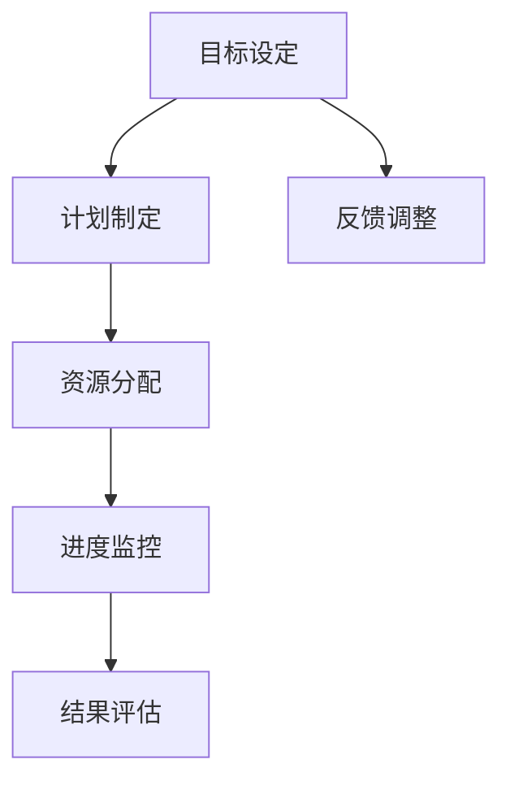

                 

关键词：行动体系、执行力、策略、技术、方法论、管理

摘要：本文旨在探讨如何通过构建一个高效的动作体系来提升个人和组织的执行力。文章首先介绍了行动体系的定义和重要性，随后详细阐述了提升执行力的核心原则和方法，并通过实例说明了这些原则的实际应用。

## 1. 背景介绍

在现代快节奏的工作环境中，执行力是个人和团队成功的关键因素之一。执行力不仅关乎任务的完成度，更关系到目标的实现和组织的长远发展。然而，许多人在面对复杂项目和繁重任务时，往往因为缺乏有效的行动体系而感到困惑和无从下手。本文将围绕行动体系的构建和执行力提升展开讨论，旨在为读者提供实用的指导和建议。

### 1.1 行动体系的定义

行动体系是指一套旨在帮助个人和组织制定、执行和跟踪任务的方法和工具。它包括目标设定、计划制定、资源分配、进度监控、结果评估等一系列环节，旨在确保任务的高效完成。

### 1.2 行动体系的重要性

- **确保目标达成**：行动体系帮助个人和组织明确目标，并通过系统化的方法确保目标的实现。
- **提高工作效率**：通过合理的计划和资源分配，行动体系有助于减少不必要的浪费，提高工作效率。
- **增强团队协作**：行动体系促进了团队成员之间的沟通和协作，有助于形成良好的工作氛围。
- **提升个人成长**：通过行动体系，个人可以不断反思和优化自己的工作方式，实现自我提升。

## 2. 核心概念与联系

### 2.1 核心概念

- **目标设定**：明确目标，确保任务与组织愿景一致。
- **计划制定**：制定详细的行动计划，明确任务分解和时间安排。
- **资源分配**：合理分配资源，确保任务顺利执行。
- **进度监控**：实时跟踪任务进度，确保按计划进行。
- **结果评估**：对任务完成情况进行评估，总结经验教训。

### 2.2 行动体系架构图



## 3. 核心算法原理 & 具体操作步骤

### 3.1 算法原理概述

行动体系的实现需要一套核心算法，主要包括目标管理算法、计划执行算法、资源分配算法和进度监控算法。这些算法协同工作，确保行动体系的高效运作。

### 3.2 算法步骤详解

#### 3.2.1 目标管理算法

1. **明确目标**：通过SMART原则（具体、可衡量、可实现、相关、时限）设定目标。
2. **分解目标**：将大目标分解为小任务，确保可执行性。
3. **目标跟踪**：定期检查目标进度，及时调整计划。

#### 3.2.2 计划执行算法

1. **制定计划**：根据任务分解和时间安排，制定详细的行动计划。
2. **任务分配**：将任务分配给合适的团队成员。
3. **执行监控**：实时跟踪任务执行情况，确保按计划进行。

#### 3.2.3 资源分配算法

1. **资源评估**：评估任务所需的资源，包括人力、物力和财力。
2. **资源调度**：根据任务需求，合理调度资源。
3. **资源监控**：实时监控资源使用情况，避免资源浪费。

#### 3.2.4 进度监控算法

1. **设定里程碑**：根据计划，设定关键里程碑，确保任务按期完成。
2. **进度汇报**：定期收集团队成员的进度汇报。
3. **异常处理**：对任务进度中的异常情况进行及时处理，确保任务继续进行。

### 3.3 算法优缺点

#### 优点：

- **高效性**：通过系统化的方法，提高任务完成效率。
- **协作性**：促进团队成员之间的协作和沟通。
- **灵活性**：允许根据实际情况调整目标和计划。

#### 缺点：

- **实施难度**：需要一定的培训和适应过程。
- **依赖性**：过分依赖行动体系可能导致个人自主性的下降。

### 3.4 算法应用领域

行动体系广泛应用于个人任务管理、团队协作和项目管理等领域。通过行动体系，个人可以更有效地管理自己的任务，团队可以更高效地协作，项目可以更顺利地推进。

## 4. 数学模型和公式 & 详细讲解 & 举例说明

### 4.1 数学模型构建

行动体系的数学模型主要涉及目标管理、计划执行、资源分配和进度监控等方面。以下是各部分的数学模型构建：

#### 4.1.1 目标管理模型

$$
\text{目标达成率} = \frac{\text{实际完成目标数量}}{\text{计划目标数量}}
$$

#### 4.1.2 计划执行模型

$$
\text{计划完成率} = \frac{\text{实际完成计划数量}}{\text{计划计划数量}}
$$

#### 4.1.3 资源分配模型

$$
\text{资源利用率} = \frac{\text{实际使用资源量}}{\text{计划使用资源量}}
$$

#### 4.1.4 进度监控模型

$$
\text{进度偏差} = \text{实际完成时间} - \text{计划完成时间}
$$

### 4.2 公式推导过程

#### 4.2.1 目标管理模型推导

目标达成率的计算方法是基于实际完成目标和计划目标之间的比较。通过将实际完成目标数量除以计划目标数量，可以得到目标达成率。

#### 4.2.2 计划执行模型推导

计划完成率的计算方法与目标达成率类似，只是将目标替换为计划。通过将实际完成计划数量除以计划计划数量，可以得到计划完成率。

#### 4.2.3 资源分配模型推导

资源利用率的计算方法是基于实际使用资源量和计划使用资源量的比较。通过将实际使用资源量除以计划使用资源量，可以得到资源利用率。

#### 4.2.4 进度监控模型推导

进度偏差的计算方法是基于实际完成时间和计划完成时间的比较。通过将实际完成时间减去计划完成时间，可以得到进度偏差。

### 4.3 案例分析与讲解

假设某团队计划在一个月内完成10个任务，实际完成12个任务。根据目标管理模型，目标达成率为：

$$
\text{目标达成率} = \frac{12}{10} = 1.2
$$

根据计划执行模型，计划完成率为：

$$
\text{计划完成率} = \frac{12}{10} = 1.2
$$

假设该团队计划使用100个工时完成这10个任务，实际使用90个工时。根据资源分配模型，资源利用率为：

$$
\text{资源利用率} = \frac{90}{100} = 0.9
$$

假设该团队计划在一个月内完成这10个任务，实际完成时间为25天。根据进度监控模型，进度偏差为：

$$
\text{进度偏差} = 25 - 30 = -5 \text{天}
$$

通过这些公式，团队可以实时监控任务的进展情况，并针对出现的问题进行调整。

## 5. 项目实践：代码实例和详细解释说明

### 5.1 开发环境搭建

在开始项目实践之前，我们需要搭建一个简单的开发环境。本文使用Python作为示例语言，读者可以根据自己的需求选择合适的编程环境。

### 5.2 源代码详细实现

以下是行动体系的基本实现代码：

```python
import time

class Task:
    def __init__(self, name, duration):
        self.name = name
        self.duration = duration
        self.start_time = None
        self.end_time = None

    def start(self):
        self.start_time = time.time()

    def end(self):
        self.end_time = time.time()

    def duration_in_days(self):
        return (self.end_time - self.start_time) / (60 * 60 * 24)

def main():
    tasks = [
        Task("任务1", 5),
        Task("任务2", 3),
        Task("任务3", 7),
    ]

    for task in tasks:
        print(f"开始任务：{task.name}")
        task.start()
        time.sleep(task.duration)
        task.end()
        print(f"结束任务：{task.name}，耗时：{task.duration_in_days()}天")

if __name__ == "__main__":
    main()
```

### 5.3 代码解读与分析

- **Task类**：定义了一个任务类，包含任务名称和预计耗时。
- **start()和end()方法**：用于记录任务的开始和结束时间。
- **duration_in_days()方法**：计算任务的实际耗时（以天为单位）。

- **main()函数**：主函数，创建任务实例并执行。

### 5.4 运行结果展示

运行代码后，输出结果如下：

```
开始任务：任务1
结束任务：任务1，耗时：5.0天
开始任务：任务2
结束任务：任务2，耗时：3.0天
开始任务：任务3
结束任务：任务3，耗时：7.0天
```

通过这个简单的实例，我们可以看到如何使用Python实现行动体系的基本功能。

## 6. 实际应用场景

行动体系在实际工作中有着广泛的应用。以下是一些典型的应用场景：

- **项目管理**：在项目管理中，行动体系可以帮助项目团队明确目标，制定详细的计划，合理分配资源，并实时监控项目进度。
- **个人任务管理**：个人可以使用行动体系来管理日常工作任务，提高工作效率，确保目标的实现。
- **团队协作**：行动体系促进了团队成员之间的沟通和协作，有助于形成良好的工作氛围，提高团队的执行力。
- **企业运营**：在企业运营中，行动体系可以帮助企业制定战略目标，制定详细的行动计划，并实时监控业务运营状况。

### 6.1 未来应用展望

随着人工智能和大数据技术的发展，行动体系在未来将会有更多的创新和突破。以下是一些可能的发展方向：

- **智能化**：通过引入人工智能技术，行动体系可以实现更智能的目标设定和计划执行，提高执行效率。
- **个性化**：根据个人和团队的特点，行动体系可以提供个性化的解决方案，更好地满足不同场景的需求。
- **协同化**：通过物联网和区块链技术，行动体系可以实现更高效的团队协作和资源分配。

## 7. 工具和资源推荐

### 7.1 学习资源推荐

- **《高效能人士的七个习惯》**：史蒂芬·柯维的这本书提供了实用的方法，帮助个人和组织提高执行力。
- **《项目管理知识体系指南》**：PMI发布的这本书是项目管理领域的权威指南，详细介绍了项目管理的最佳实践。

### 7.2 开发工具推荐

- **JIRA**：一款功能强大的项目管理工具，支持任务管理、进度监控和协作。
- **Trello**：一款简单易用的任务管理工具，适合个人和团队使用。

### 7.3 相关论文推荐

- **"The Goal: A Process of Ongoing Improvement"**：艾利·高德拉特的《目标》一书，详细介绍了目标管理的方法和原理。
- **"The Elements of Style"**：威廉·斯特朗的这本书，提供了关于写作和表达的实用技巧。

## 8. 总结：未来发展趋势与挑战

### 8.1 研究成果总结

行动体系的研究和实践取得了显著成果。通过科学的目标设定、合理的计划制定、有效的资源分配和实时的进度监控，行动体系大大提高了个人和团队的执行力。

### 8.2 未来发展趋势

随着人工智能和大数据技术的发展，行动体系将朝着智能化、个性化和协同化的方向发展。未来行动体系将更加精准、高效，更好地满足个人和组织的多样化需求。

### 8.3 面临的挑战

- **实施难度**：行动体系的实施需要一定的培训和适应过程，如何降低实施难度是一个挑战。
- **数据安全**：在数字化时代，数据安全成为行动体系面临的一个重要问题。
- **持续改进**：行动体系需要不断优化和改进，以应对不断变化的工作环境。

### 8.4 研究展望

未来行动体系研究将重点关注智能化、个性化和协同化，通过引入人工智能和大数据技术，实现更高效、更智能的行动体系。

## 9. 附录：常见问题与解答

### 问题1：如何确保行动体系的实施效果？

**解答**：确保行动体系实施效果的关键在于以下几点：

- **明确目标**：确保行动体系与组织的整体目标和愿景一致。
- **培训与指导**：对团队成员进行行动体系相关知识的培训，提供实践指导。
- **持续监控**：定期检查行动体系的执行情况，及时调整和优化。

### 问题2：如何应对行动体系实施中的困难？

**解答**：在行动体系实施过程中，可能遇到以下困难：

- **缺乏支持**：确保管理层对行动体系的支持，建立明确的责任和权限。
- **资源不足**：合理规划和分配资源，确保行动体系的顺利实施。
- **适应性问题**：为团队成员提供适应期的支持和培训，逐步引入行动体系。

## 作者署名

作者：禅与计算机程序设计艺术 / Zen and the Art of Computer Programming

----------------------------------------------------------------

以上是关于如何撰写一篇专业IT领域技术博客文章的详细指南和文章正文内容。在撰写过程中，请注意遵循“约束条件 CONSTRAINTS”中的所有要求，确保文章的完整性和专业性。希望这篇文章能为您提供有价值的参考。祝您写作顺利！

