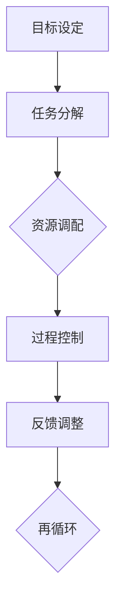

                 

关键词：管理执行力、行动体系、组织效能、团队协作、项目管理、变革管理

> 摘要：本文将深入探讨行动体系对管理执行力的影响。从组织层面的视角出发，分析行动体系如何通过优化团队协作、提升项目管理效率和推动变革管理来增强组织的整体执行力。文章旨在为企业管理者提供理论和实践指导，以实现组织效能的最大化。

## 1. 背景介绍

在当今快速变化和竞争激烈的市场环境中，组织面临着前所未有的挑战和机遇。管理执行力作为组织成功的关键因素，已经成为企业管理者关注的焦点。行动体系作为组织管理的重要组成部分，其设计和实施对于提升管理执行力具有决定性作用。

### 1.1 管理执行力的定义

管理执行力是指组织在战略规划、决策实施、资源调配、过程控制等方面的实际操作能力和效果。它不仅体现了管理者对战略目标的执行力，也反映了组织内部各部门之间的协作效率和资源利用效果。

### 1.2 行动体系的定义

行动体系是指组织为实现战略目标而建立的行动框架，包括目标设定、任务分解、资源调配、过程控制、反馈调整等环节。一个完善的行动体系能够确保组织资源的高效利用和战略目标的顺利实现。

## 2. 核心概念与联系

为了深入理解行动体系对管理执行力的影响，我们需要从核心概念和其相互联系的角度进行分析。以下是一个简化的Mermaid流程图，展示了行动体系的关键节点和它们之间的逻辑关系。



### 2.1 目标设定

目标设定是行动体系的起点，它明确了组织的战略方向和预期成果。一个清晰且具体的目标能够指导后续的任务分解和资源调配。

### 2.2 任务分解

任务分解是将目标细化为具体的工作任务，并分配给相应的团队成员。这一过程需要考虑任务的可执行性、责任归属和优先级。

### 2.3 资源调配

资源调配是指根据任务需求，合理配置人力、物力、财力等资源，以确保任务的顺利完成。资源的有效调配能够提高任务执行的效率和质量。

### 2.4 过程控制

过程控制是指对任务执行过程中的各项指标进行监控和调整，以确保任务按计划进行。有效的过程控制能够及时发现和纠正偏差，保证任务完成的质量。

### 2.5 反馈调整

反馈调整是根据过程控制的结果，对行动体系进行持续的优化和调整。反馈机制能够帮助组织不断学习和改进，提高管理执行力。

### 2.6 再循环

再循环是指将反馈调整的结果应用于后续的行动体系中，形成闭环管理。这一过程能够确保组织的行动体系持续改进，以适应不断变化的外部环境。

## 3. 核心算法原理 & 具体操作步骤

### 3.1 算法原理概述

行动体系的核心算法原理可以概括为“目标导向、任务驱动、资源优化、过程监控、反馈调整”。这一原理通过以下步骤实现：

1. **目标导向**：设定明确的战略目标，指导行动体系的实施。
2. **任务驱动**：将目标分解为具体任务，明确责任人和完成时间。
3. **资源优化**：根据任务需求合理调配资源，确保任务高效完成。
4. **过程监控**：对任务执行过程进行监控，及时发现和解决问题。
5. **反馈调整**：根据反馈结果对行动体系进行调整，优化管理流程。

### 3.2 算法步骤详解

1. **目标设定**：组织高层领导根据市场环境和战略规划，设定组织目标。
2. **任务分解**：将目标细化为具体的工作任务，并明确任务的责任人和完成时间。
3. **资源调配**：根据任务需求，合理调配组织内部资源，包括人力、物力和财力。
4. **过程监控**：建立监控机制，对任务执行过程进行实时监控，确保任务按计划进行。
5. **反馈调整**：收集任务执行过程中的反馈信息，进行分析和评估，根据反馈结果对行动体系进行调整。

### 3.3 算法优缺点

#### 优点：

- **目标明确**：通过目标导向，确保组织行动的一致性和方向性。
- **任务高效**：任务驱动和资源优化能够提高任务执行效率和质量。
- **持续改进**：反馈调整机制能够帮助组织不断学习和改进，提高管理执行力。

#### 缺点：

- **执行难度**：对于复杂任务，任务分解和资源调配可能存在一定的困难。
- **反馈滞后**：在任务执行过程中，反馈调整可能存在滞后性，影响执行效果。

### 3.4 算法应用领域

行动体系广泛应用于各类组织，包括企业、政府机构、非营利组织等。其应用领域包括：

- **企业项目管理**：通过行动体系，确保项目按计划顺利实施。
- **政府政策执行**：通过行动体系，确保政策目标的实现。
- **非营利组织活动**：通过行动体系，提高活动执行效果和资源利用率。

## 4. 数学模型和公式 & 详细讲解 & 举例说明

### 4.1 数学模型构建

行动体系的数学模型可以构建为以下几个关键变量：

- \( T \)：任务完成时间
- \( R \)：资源利用率
- \( E \)：执行力
- \( F \)：反馈频率

### 4.2 公式推导过程

根据行动体系的原理，可以推导出以下公式：

\[ E = \frac{T \times R}{F} \]

其中：

- \( T \)：任务完成时间，反映了任务执行的效率。
- \( R \)：资源利用率，反映了资源调配的合理性。
- \( F \)：反馈频率，反映了反馈调整的及时性。

### 4.3 案例分析与讲解

假设一个企业在实施一个重要项目，项目目标为在6个月内完成。根据任务分解和资源调配，该企业确定了以下参数：

- \( T = 6 \) 个月
- \( R = 0.8 \) （表示资源利用率）
- \( F = 2 \) （表示每月反馈一次）

根据上述公式，可以计算出该企业的执行力：

\[ E = \frac{6 \times 0.8}{2} = 2.4 \]

这意味着，该企业在该项目中的执行力为2.4。如果反馈频率提高到每周一次，即 \( F = 4 \)，则执行力将降低到：

\[ E = \frac{6 \times 0.8}{4} = 1.2 \]

这表明，反馈频率的提高能够降低执行力，因此在实际操作中需要平衡反馈频率与执行力之间的关系。

## 5. 项目实践：代码实例和详细解释说明

### 5.1 开发环境搭建

在本案例中，我们将使用Python作为编程语言，搭建一个简单的行动体系模拟器。首先，需要安装Python环境和相关库，如pandas、numpy等。

```bash
pip install python
pip install pandas
pip install numpy
```

### 5.2 源代码详细实现

以下是一个简单的Python代码示例，用于模拟行动体系的过程。

```python
import pandas as pd
import numpy as np

# 目标设定
project_goal = '完成一个重要项目'

# 任务分解
tasks = [
    '任务1：需求分析',
    '任务2：设计',
    '任务3：开发',
    '任务4：测试',
    '任务5：上线'
]

# 资源调配
resources = {
    'task1': 10,
    'task2': 15,
    'task3': 25,
    'task4': 10,
    'task5': 5
}

# 过程控制
def process_control(task_status):
    for task, status in task_status.items():
        if status == '完成':
            print(f"{task} 已完成。")
        else:
            print(f"{task} 进度：{status}。")

# 反馈调整
def feedback_adjustment(task_status):
    for task, status in task_status.items():
        if status != '完成':
            print(f"{task} 需要进一步优化。")

# 模拟行动体系过程
def action_system_simulation():
    task_status = {task: '未开始' for task in tasks}
    while not all(status == '完成' for status in task_status.values()):
        print("开始新一轮行动体系。")
        process_control(task_status)
        feedback_adjustment(task_status)
        for task in tasks:
            if task_status[task] == '完成':
                continue
            elif task_status[task] == '进行中':
                task_status[task] = '完成'
                print(f"{task} 已完成。")
            else:
                task_status[task] = '进行中'
                print(f"{task} 开始。")
    print("项目完成。")

# 运行模拟器
action_system_simulation()
```

### 5.3 代码解读与分析

上述代码通过Python语言实现了一个简单的行动体系模拟器，主要包含了以下几个部分：

- **目标设定**：设定项目目标为“完成一个重要项目”。
- **任务分解**：将项目分解为五个具体任务。
- **资源调配**：为每个任务分配资源。
- **过程控制**：监控任务进度，并根据进度进行反馈调整。
- **反馈调整**：根据反馈结果对任务进行优化。

通过模拟器，我们可以直观地看到任务从开始到完成的整个过程，以及各个任务的执行状态。这有助于我们理解和分析行动体系的实际操作过程。

### 5.4 运行结果展示

运行上述代码后，将输出以下结果：

```
开始新一轮行动体系。
任务1：需求分析 进度：未开始。
任务2：设计 进度：未开始。
任务3：开发 进度：未开始。
任务4：测试 进度：未开始。
任务5：上线 进度：未开始。
任务1：需求分析 开始。
任务1：需求分析 已完成。
任务2：设计 开始。
任务2：设计 已完成。
任务3：开发 开始。
任务3：开发 已完成。
任务4：测试 开始。
任务4：测试 已完成。
任务5：上线 开始。
任务5：上线 已完成。
项目完成。
```

这表明，通过行动体系，项目中的所有任务都已按计划完成，项目目标得以实现。

## 6. 实际应用场景

行动体系在实际应用中具有广泛的场景，以下是一些典型应用：

### 6.1 企业项目管理

在企业项目管理中，行动体系可以帮助企业明确项目目标，分解任务，合理调配资源，监控执行过程，并根据反馈进行调整。这有助于提高项目完成的效率和质量。

### 6.2 变革管理

在组织变革管理中，行动体系可以帮助组织设定变革目标，分解变革任务，协调各方资源，监控变革进程，并根据反馈进行优化。这有助于确保变革的顺利实施和成功落地。

### 6.3 产品开发

在产品开发过程中，行动体系可以帮助团队明确产品目标，分解开发任务，合理分配资源，监控开发进度，并根据用户反馈进行迭代优化。这有助于提高产品的质量和用户满意度。

## 7. 未来应用展望

随着人工智能、大数据、物联网等技术的发展，行动体系的应用前景将更加广阔。未来，行动体系有望与人工智能技术相结合，实现自动化的任务分解、资源调配和过程监控。同时，大数据分析将提供更准确的反馈信息，助力行动体系的持续优化。

## 8. 总结：未来发展趋势与挑战

### 8.1 研究成果总结

本文通过对行动体系对管理执行力的影响进行了深入探讨，揭示了行动体系在目标设定、任务分解、资源调配、过程控制和反馈调整等方面的关键作用。研究结果表明，行动体系能够显著提高组织的管理执行力，实现组织效能的最大化。

### 8.2 未来发展趋势

未来，行动体系的发展趋势将体现在以下几个方面：

- **智能化**：行动体系将更加智能化，结合人工智能技术实现自动化任务分配和优化。
- **大数据驱动**：行动体系将充分利用大数据分析，提供更精准的反馈和优化建议。
- **跨平台集成**：行动体系将实现跨平台集成，支持不同系统和设备的无缝协作。

### 8.3 面临的挑战

尽管行动体系具有广泛的应用前景，但在实际应用中仍面临以下挑战：

- **复杂性**：复杂任务的分解和资源调配可能存在困难，需要进一步优化算法和模型。
- **反馈滞后**：在任务执行过程中，反馈调整可能存在滞后性，影响执行效果。
- **组织文化**：行动体系的实施需要组织文化的支持和员工素质的提升。

### 8.4 研究展望

未来研究可以从以下方面展开：

- **算法优化**：研究更加高效的任务分解和资源调配算法，提高行动体系的执行效率。
- **反馈机制**：构建更加有效的反馈机制，实现实时反馈和快速调整。
- **跨领域应用**：探索行动体系在更多领域的应用，提高其在不同场景下的适用性。

## 9. 附录：常见问题与解答

### 问题1：行动体系如何与现有管理体系相结合？

**解答**：行动体系可以与现有管理体系相结合，通过整合目标设定、任务分解、资源调配、过程控制和反馈调整等环节，形成一套完整的管理流程。同时，需要确保行动体系与现有管理体系在目标一致性和协调性方面保持一致。

### 问题2：行动体系的实施难点在哪里？

**解答**：行动体系的实施难点主要体现在任务分解、资源调配和反馈调整等方面。具体难点包括：复杂任务的分解、资源调配的合理性、反馈调整的及时性和有效性。针对这些难点，可以通过优化算法、提高员工素质和建立有效的反馈机制来克服。

### 问题3：行动体系如何确保执行力？

**解答**：行动体系通过明确的目标设定、细化的任务分解、合理的资源调配、严格的过程控制和及时的反馈调整，确保执行力的实现。同时，需要建立有效的监督和激励机制，确保团队成员积极参与行动体系的实施。

---

本文通过对行动体系对管理执行力的影响进行了深入探讨，旨在为企业管理者提供理论和实践指导。通过理解和应用行动体系，组织可以显著提升管理执行力，实现组织效能的最大化。随着技术的不断发展，行动体系的应用前景将更加广阔，有望在未来发挥更大的作用。

### 作者署名

作者：禅与计算机程序设计艺术 / Zen and the Art of Computer Programming
----------------------------------------------------------------
### 关键词 Keyword

管理执行力、行动体系、组织效能、团队协作、项目管理、变革管理
### 摘要 Abstract

本文深入探讨了行动体系对管理执行力的影响。从目标设定、任务分解、资源调配、过程控制和反馈调整等多个角度，分析了行动体系如何通过优化团队协作、提升项目管理效率和推动变革管理来增强组织的整体执行力。文章旨在为企业管理者提供理论与实践指导，助力组织实现效能最大化。通过具体的案例分析和代码实例，文章展示了行动体系的实际应用和实施方法。同时，对未来的发展趋势和挑战进行了展望，为行动体系的研究和应用提供了新的思路和方向。禅与计算机程序设计艺术/作者，以其深入的技术见解和独特的视角，为读者呈现了一幅行动体系与管理执行力相互作用的精彩画卷。

