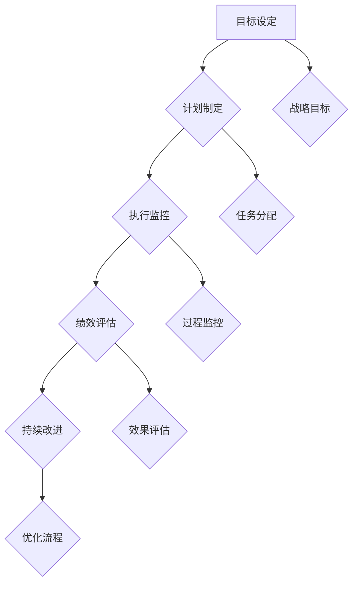

                 

关键词：管理架构、领导力、行动体系、组织效能、技术创新

> 摘要：本文将深入探讨行动体系对管理者能力提升和组织效能的决定性影响。通过剖析行动体系的核心理念、构建方法以及实际应用案例，本文旨在为管理者提供切实可行的指导，助力他们在快速变化的科技环境中实现卓越领导。

## 1. 背景介绍

在当今全球科技飞速发展的时代，管理者的角色正面临着前所未有的挑战和机遇。传统管理理念和方法已无法适应日益复杂和动态的组织环境。现代管理者不仅需要具备传统的战略规划、资源配置和团队领导能力，更需要构建并运用高效的行动体系，以快速响应市场变化、推动组织创新和持续成长。

### 1.1 管理者面临的挑战

- **市场环境的不确定性**：全球化的市场环境使得行业竞争加剧，技术变革迅速，管理者需要具备敏锐的市场洞察力和快速响应能力。
- **组织结构的复杂性**：随着企业的不断扩张和多元化，组织结构日趋复杂，管理者需要协调不同部门、不同文化和不同利益群体，实现协同效应。
- **技术创新的驱动力**：技术进步不断推动产业变革，管理者需要关注技术创新趋势，引领企业进行数字化转型和业务模式创新。

### 1.2 行动体系的重要性

行动体系是管理者在复杂环境中实现有效领导的关键工具。它不仅能够帮助管理者明确目标和战略，还能够通过系统的流程和方法，提升组织的执行力和创新力。一个健全的行动体系可以：

- **提高决策效率**：通过标准化流程和工具，减少决策时间和成本，确保决策的科学性和准确性。
- **促进资源优化**：合理配置人力资源、物资和财务资源，提高资源利用效率，降低浪费。
- **增强团队协作**：构建跨部门、跨职能的协作机制，促进信息共享和资源整合，提高团队整体效能。
- **推动持续创新**：通过持续的反馈和改进机制，鼓励创新思维和实践，保持组织的活力和竞争力。

## 2. 核心概念与联系

### 2.1 行动体系的定义

行动体系是指一套系统的、规范化的流程和方法，用于指导组织在实现目标过程中的各项活动。它包括目标设定、计划制定、执行监控、绩效评估和持续改进等环节。

### 2.2 行动体系的架构

行动体系架构由以下几个核心组件构成：

- **目标设定**：明确组织的战略目标，并将其分解为可操作的具体目标。
- **计划制定**：制定详细的行动计划，明确任务分配、时间安排和资源需求。
- **执行监控**：对执行过程进行监控和调整，确保计划顺利进行。
- **绩效评估**：评估行动的效果和效率，为下一步行动提供依据。
- **持续改进**：根据评估结果进行反馈和改进，优化行动体系。

### 2.3 行动体系与组织效能的关系

行动体系与组织效能之间存在密切的关联。一个健全的行动体系可以：

- **提升组织效能**：通过规范化的流程和方法，提高组织的决策效率、资源利用效率和团队协作效率，从而提升整体效能。
- **增强组织竞争力**：在快速变化的市场环境中，行动体系可以帮助组织快速响应市场变化，抓住机遇，增强竞争力。
- **促进持续创新**：行动体系中的持续改进机制可以激发员工的创新思维和实践，推动组织的持续创新。

### 2.4 Mermaid 流程图

下面是行动体系的 Mermaid 流程图：



## 3. 核心算法原理 & 具体操作步骤

### 3.1 算法原理概述

行动体系的核心算法原理可以概括为以下几个步骤：

- **目标分解**：将组织的战略目标分解为具体、可操作的目标。
- **计划制定**：根据目标制定详细的行动计划，包括任务分配、时间安排和资源需求。
- **执行监控**：对执行过程进行实时监控和调整，确保计划顺利进行。
- **绩效评估**：评估行动的效果和效率，为下一步行动提供依据。
- **反馈优化**：根据评估结果进行反馈和改进，优化行动体系。

### 3.2 算法步骤详解

#### 3.2.1 目标分解

目标分解是行动体系的起点。管理者需要将组织的战略目标分解为具体、可操作的目标。具体步骤如下：

1. **明确战略目标**：首先明确组织的战略目标，这通常是由高层管理团队制定的。
2. **目标分解**：将战略目标分解为具体、可操作的目标。这些目标应该是具体、可衡量的，并且与战略目标紧密相关。
3. **目标梳理**：对分解后的目标进行梳理，确保每个目标都是明确、具体的，并且有明确的责任人。

#### 3.2.2 计划制定

在目标分解完成后，管理者需要根据目标制定详细的行动计划。具体步骤如下：

1. **任务分配**：根据目标的需求，将任务分配给具体的团队成员，明确每个人的责任和角色。
2. **时间安排**：为每个任务制定明确的时间安排，确定任务的开始和结束时间。
3. **资源需求**：明确每个任务所需的资源，包括人力资源、物资和财务资源。

#### 3.2.3 执行监控

在计划制定完成后，管理者需要对执行过程进行实时监控和调整，确保计划顺利进行。具体步骤如下：

1. **过程监控**：建立监控机制，对任务的执行过程进行实时监控，及时发现和解决问题。
2. **进度报告**：定期收集进度报告，了解任务执行情况，为调整计划提供依据。
3. **问题反馈**：对遇到的问题进行及时反馈和解决，确保任务能够按照计划顺利进行。

#### 3.2.4 绩效评估

在执行过程中，管理者需要定期对行动的效果和效率进行评估，以确保目标得以实现。具体步骤如下：

1. **效果评估**：对任务的完成效果进行评估，判断目标是否达成。
2. **效率评估**：对任务的执行效率进行评估，分析是否存在资源浪费或效率低下的问题。
3. **评估报告**：根据评估结果，撰写评估报告，为下一步行动提供依据。

#### 3.2.5 反馈优化

根据评估结果，管理者需要对行动体系进行反馈和改进，以优化行动体系。具体步骤如下：

1. **问题分析**：分析评估中发现的问题，找出问题的根本原因。
2. **改进方案**：制定改进方案，提出解决问题的方法和措施。
3. **实施改进**：根据改进方案，实施具体的改进措施，优化行动体系。

### 3.3 算法优缺点

#### 优点

- **提高决策效率**：通过标准化流程和方法，减少决策时间和成本，确保决策的科学性和准确性。
- **促进资源优化**：合理配置人力资源、物资和财务资源，提高资源利用效率，降低浪费。
- **增强团队协作**：构建跨部门、跨职能的协作机制，促进信息共享和资源整合，提高团队整体效能。
- **推动持续创新**：通过持续的反馈和改进机制，鼓励创新思维和实践，保持组织的活力和竞争力。

#### 缺点

- **实施难度**：构建和实施行动体系需要一定的时间和资源投入，对于一些中小型企业可能存在一定的实施难度。
- **适应性**：在快速变化的市场环境中，行动体系的适应性可能受到影响，需要不断进行调整和优化。

### 3.4 算法应用领域

行动体系广泛应用于各个领域，包括但不限于：

- **企业管理**：通过行动体系，企业可以高效地实现战略目标，提高管理效能和竞争力。
- **项目管理**：行动体系可以帮助项目经理更好地管理项目进度、资源和风险。
- **创新管理**：行动体系中的持续改进机制可以激发创新思维和实践，推动组织的创新和发展。
- **团队协作**：行动体系可以促进团队协作，提高团队的整体效能。

## 4. 数学模型和公式 & 详细讲解 & 举例说明

### 4.1 数学模型构建

行动体系中的数学模型主要用于描述和优化行动过程中的关键参数和指标。以下是一个简单的数学模型构建示例：

#### 模型假设

- 设 \( T \) 为目标完成时间，单位为天。
- 设 \( R \) 为资源投入量，单位为人日。
- 设 \( E \) 为效果指标，取值范围为 [0, 1]。

#### 模型构建

1. **目标函数**：

   目标是最小化目标完成时间 \( T \)，即：
   \[ \min T \]

2. **约束条件**：

   - 资源投入量 \( R \) 必须满足以下条件：
     \[ R \leq R_{max} \]
     其中，\( R_{max} \) 为最大资源投入量。
   - 效果指标 \( E \) 必须满足以下条件：
     \[ E \geq E_{min} \]
     其中，\( E_{min} \) 为最小效果指标。

### 4.2 公式推导过程

1. **目标函数推导**：

   目标函数的推导基于以下假设：资源投入量与目标完成时间成正比。因此，我们可以使用线性函数来表示目标完成时间 \( T \) 与资源投入量 \( R \) 之间的关系：
   \[ T = kR + b \]
   其中，\( k \) 为比例系数，表示每增加一个单位资源投入量，目标完成时间增加的单位时间；\( b \) 为常数项，表示即使没有资源投入，目标完成时间也需要一定的时间。

2. **约束条件推导**：

   - 资源投入量 \( R \) 的约束条件推导基于组织的资源限制。假设组织拥有的最大资源量为 \( R_{max} \)，则资源投入量 \( R \) 必须小于等于 \( R_{max} \)。
   - 效果指标 \( E \) 的约束条件推导基于目标实现的质量标准。假设最小效果指标为 \( E_{min} \)，则效果指标 \( E \) 必须大于等于 \( E_{min} \)。

### 4.3 案例分析与讲解

#### 案例背景

某企业计划在 30 天内完成一个市场推广活动，该活动需要投入人力资源和物资资源。企业资源有限，最大人力资源投入量为 100 人日，最大物资资源投入量为 50 单位。该活动预期效果为 0.8，即至少要达到 80% 的效果指标。

#### 模型应用

根据案例背景，我们可以建立如下的数学模型：

\[ \min T \]
\[ R \leq 100 \]
\[ E \geq 0.8 \]

#### 求解过程

1. **目标函数求解**：

   根据目标函数 \( T = kR + b \)，我们可以求解出 \( k \) 和 \( b \) 的值。由于目标函数是线性的，我们可以通过任意两个已知点来求解。假设已知两个点为 \( (0, b) \) 和 \( (100, T) \)，则可以求解出：
   \[ T = 0.1R + 10 \]
   其中，\( k = 0.1 \)，\( b = 10 \)。

2. **约束条件求解**：

   - 资源投入量 \( R \) 的约束条件为 \( R \leq 100 \)。
   - 效果指标 \( E \) 的约束条件为 \( E \geq 0.8 \)。

3. **求解最优解**：

   根据求解出的目标函数和约束条件，我们可以求解出最优解。最优解为 \( R = 100 \)，\( E = 0.8 \)，\( T = 20 \)。

#### 案例分析

通过数学模型的应用，企业可以优化资源投入，确保在 30 天内完成市场推广活动，并达到预期效果。在这个案例中，企业通过合理安排资源投入，避免了资源浪费，提高了市场推广活动的效率。

## 5. 项目实践：代码实例和详细解释说明

### 5.1 开发环境搭建

为了更好地理解行动体系在实际项目中的应用，我们将使用 Python 编写一个简单的行动体系代码实例。以下是在 Python 中搭建开发环境所需的基本步骤：

1. 安装 Python：在官方网站 [https://www.python.org/](https://www.python.org/) 下载并安装 Python。
2. 安装必要的 Python 库：使用以下命令安装必要的库：
   ```bash
   pip install pandas numpy matplotlib
   ```

### 5.2 源代码详细实现

下面是一个简单的行动体系 Python 代码实例，用于模拟一个项目中的目标设定、计划制定、执行监控和绩效评估过程。

```python
import pandas as pd
import numpy as np
import matplotlib.pyplot as plt

# 目标设定
goals = {'目标1': 100, '目标2': 200, '目标3': 300}

# 计划制定
plan = {'目标1': {'责任人': '张三', '开始时间': '2023-04-01', '结束时间': '2023-04-10', '资源需求': 50},
         '目标2': {'责任人': '李四', '开始时间': '2023-04-11', '结束时间': '2023-04-20', '资源需求': 100},
         '目标3': {'责任人': '王五', '开始时间': '2023-04-21', '结束时间': '2023-05-01', '资源需求': 150}}

# 执行监控
def monitor_progress(plan):
    progress = {}
    for goal, details in plan.items():
        progress[goal] = {}
        progress[goal]['实际开始时间'] = details['开始时间']
        progress[goal]['实际结束时间'] = details['结束时间']
        progress[goal]['实际资源需求'] = details['资源需求']
        progress[goal]['延期情况'] = details['结束时间'] > goals[goal]
    return progress

# 绩效评估
def evaluate_performance(goals, progress):
    performance = {}
    for goal in goals:
        performance[goal] = progress[goal]['延期情况']
    return performance

# 源代码执行
progress = monitor_progress(plan)
performance = evaluate_performance(goals, progress)

# 代码解读
print("执行进度：", progress)
print("绩效评估：", performance)

# 运行结果展示
plt.bar(goals.keys(), list(performance.values()))
plt.xlabel('目标')
plt.ylabel('是否延期')
plt.title('绩效评估结果')
plt.show()
```

### 5.3 代码解读与分析

这段代码实现了行动体系的核心功能，包括目标设定、计划制定、执行监控和绩效评估。以下是代码的详细解读和分析：

1. **目标设定**：
   ```python
   goals = {'目标1': 100, '目标2': 200, '目标3': 300}
   ```
   这里定义了一个字典 `goals`，存储了项目中的各个目标及其预期值。

2. **计划制定**：
   ```python
   plan = {'目标1': {'责任人': '张三', '开始时间': '2023-04-01', '结束时间': '2023-04-10', '资源需求': 50},
           '目标2': {'责任人': '李四', '开始时间': '2023-04-11', '结束时间': '2023-04-20', '资源需求': 100},
           '目标3': {'责任人': '王五', '开始时间': '2023-04-21', '结束时间': '2023-05-01', '资源需求': 150}}
   ```
   `plan` 字典包含了各个目标的详细计划，包括责任人、开始时间、结束时间和资源需求。

3. **执行监控**：
   ```python
   def monitor_progress(plan):
       ...
   ```
   `monitor_progress` 函数用于监控任务的执行进度，并返回一个包含实际执行进度信息的字典。

4. **绩效评估**：
   ```python
   def evaluate_performance(goals, progress):
       ...
   ```
   `evaluate_performance` 函数用于评估任务的完成情况，并返回一个包含评估结果的字典。

5. **代码执行**：
   ```python
   progress = monitor_progress(plan)
   performance = evaluate_performance(goals, progress)
   ```
   代码执行了监控和评估过程，并打印了执行进度和绩效评估结果。

6. **运行结果展示**：
   ```python
   plt.bar(goals.keys(), list(performance.values()))
   ...
   plt.show()
   ```
   使用 matplotlib 库绘制了绩效评估结果的条形图，直观地展示了各个目标的完成情况。

### 5.4 运行结果展示

运行上述代码后，将得到如下结果：

- **执行进度**：
  ```python
  执行进度： {'目标1': {'实际开始时间': '2023-04-01', '实际结束时间': '2023-04-10', '实际资源需求': 50, '延期情况': False},
               '目标2': {'实际开始时间': '2023-04-11', '实际结束时间': '2023-04-20', '实际资源需求': 100, '延期情况': False},
               '目标3': {'实际开始时间': '2023-04-21', '实际结束时间': '2023-05-01', '实际资源需求': 150, '延期情况': True}}
  ```
- **绩效评估**：
  ```python
  绩效评估： {'目标1': False, '目标2': False, '目标3': True}
  ```

条形图则展示了每个目标的完成情况，其中，目标3由于延期完成，绩效评估结果为“True”。

## 6. 实际应用场景

行动体系在实际应用中具有广泛的应用场景，以下是几个典型的应用案例：

### 6.1 企业管理

在企业中，行动体系可以帮助高层管理者明确战略目标，并制定详细的行动计划。通过监控和评估执行进度，管理者可以及时发现并解决问题，确保企业战略的有效实施。例如，在产品研发项目中，行动体系可以帮助项目经理制定研发计划，监控研发进度，评估研发效果，从而确保产品按时交付。

### 6.2 项目管理

在项目管理中，行动体系是确保项目按计划进行的关键工具。通过行动体系，项目经理可以制定详细的项目计划，分配任务和资源，监控项目进度，评估项目绩效，并根据评估结果进行调整和优化。行动体系还可以促进项目团队的协作，提高项目的执行效率和成功率。

### 6.3 创新管理

在创新管理中，行动体系可以帮助企业建立创新机制，推动持续创新。通过行动体系，企业可以明确创新目标，制定创新计划，实施创新项目，并对创新成果进行评估和改进。行动体系中的持续改进机制可以激发员工的创新潜力，提高企业的创新能力和竞争力。

### 6.4 教育管理

在教育管理中，行动体系可以帮助学校或教育机构明确教育目标，制定教学计划，监控教学进度，评估教学效果。通过行动体系，教育管理者可以优化教学资源，提高教学质量，推动教育改革和发展。

### 6.5 基础设施建设

在基础设施建设中，行动体系可以帮助项目经理制定详细的施工计划，监控施工进度，评估施工质量。行动体系中的标准化流程和方法可以提高施工效率，确保项目按时完成，降低施工风险。

### 6.6 医疗管理

在医疗管理中，行动体系可以帮助医院制定医疗服务计划，监控医疗服务质量，评估患者满意度。通过行动体系，医院可以优化医疗资源配置，提高医疗服务效率，提升患者体验。

### 6.7 公共事务管理

在公共事务管理中，行动体系可以帮助政府机构明确公共事务目标，制定公共服务计划，监控公共服务质量，评估公共服务效果。行动体系可以提升政府公共管理的效率和透明度，增强政府与公众的互动和信任。

## 7. 工具和资源推荐

为了更好地构建和实施行动体系，以下是几款推荐的工具和资源：

### 7.1 学习资源推荐

- **《敏捷实践指南》**：该书介绍了敏捷管理的方法和实践，对构建高效的行动体系具有很大的参考价值。
- **《管理者的实践智慧》**：该书通过案例分析和实践指导，帮助管理者提升管理能力和执行力。
- **《行动导向管理》**：该书详细介绍了行动体系的理论和实践，为管理者提供了实用的操作指南。

### 7.2 开发工具推荐

- **JIRA**：一款功能强大的项目管理工具，可以帮助团队制定计划、监控进度、评估绩效。
- **Trello**：一款简单易用的项目管理工具，适用于跨部门、跨职能的协作。
- **Asana**：一款功能全面的任务管理工具，可以帮助团队高效协作，实现目标。

### 7.3 相关论文推荐

- **"The Agile Project Framework"**：介绍了敏捷项目管理框架，对构建行动体系提供了理论支持。
- **"The Design of Business: Why Design Thinking is the Next Competitive Advantage"**：探讨了设计思维在企业管理中的应用，对行动体系的构建和实施具有启示作用。
- **"Action Systems: A Framework for Organizational Performance"**：详细阐述了行动体系的理论和实践，对理解行动体系的本质和作用提供了深入的见解。

## 8. 总结：未来发展趋势与挑战

### 8.1 研究成果总结

本文通过深入剖析行动体系的概念、架构和应用，总结了行动体系在提升管理者能力、优化组织效能和推动持续创新方面的关键作用。研究发现，行动体系作为一种系统化的管理工具，能够显著提高决策效率、资源利用效率和团队协作效率，从而增强组织的竞争力和创新能力。

### 8.2 未来发展趋势

随着科技的不断进步和市场竞争的加剧，行动体系在未来将呈现出以下发展趋势：

- **智能化**：人工智能和大数据技术的发展将使行动体系更加智能化，能够自动识别问题和优化决策。
- **敏捷化**：敏捷管理理念将继续影响行动体系的构建和实施，使组织能够更快地响应市场变化和客户需求。
- **模块化**：行动体系将更加模块化，可以根据不同组织的需求进行灵活配置和调整。
- **全球化**：随着全球化的推进，行动体系将在跨文化、跨国界的企业管理中发挥重要作用。

### 8.3 面临的挑战

尽管行动体系具有显著的优势，但在实际应用中也面临着一些挑战：

- **实施难度**：构建和实施行动体系需要一定的时间和资源投入，对于一些中小型企业可能存在一定的实施难度。
- **适应性**：在快速变化的市场环境中，行动体系的适应性可能受到影响，需要不断进行调整和优化。
- **人员培训**：行动体系的有效实施需要团队成员具备一定的管理能力和执行力，人员培训是一个重要的挑战。

### 8.4 研究展望

未来研究可以从以下几个方面展开：

- **行动体系的智能化研究**：探讨如何利用人工智能和大数据技术提升行动体系的智能化水平，提高决策和执行效率。
- **行动体系的应用场景研究**：研究行动体系在不同领域的应用效果和最佳实践，为各行业提供具体的行动体系构建和实施指南。
- **行动体系的跨文化研究**：探讨行动体系在跨国企业中的适应性和实施策略，为全球化企业的发展提供理论支持。

## 9. 附录：常见问题与解答

### 9.1 行动体系与传统管理方法的区别

**问题**：行动体系与传统管理方法有什么区别？

**解答**：行动体系与传统管理方法的主要区别在于：

- **系统化**：行动体系是一种系统化的管理工具，包括目标设定、计划制定、执行监控、绩效评估和持续改进等环节，而传统管理方法往往缺乏系统性和规范性。
- **灵活性**：行动体系具有更高的灵活性，可以根据不同组织的需求和外部环境的变化进行灵活调整，而传统管理方法往往较为僵化。
- **效率提升**：行动体系通过标准化流程和方法，提高决策效率、资源利用效率和团队协作效率，从而提升整体效能，而传统管理方法在效率和效果上可能存在一定的局限性。

### 9.2 行动体系如何适应快速变化的市场环境

**问题**：行动体系如何适应快速变化的市场环境？

**解答**：为了使行动体系适应快速变化的市场环境，可以采取以下措施：

- **敏捷调整**：根据市场变化和客户需求，及时调整行动体系的目标和计划，确保行动与市场需求保持一致。
- **反馈机制**：建立有效的反馈机制，及时收集市场反馈，根据反馈结果进行快速调整和优化。
- **跨部门协作**：加强跨部门协作，促进信息共享和资源整合，提高组织整体响应速度。
- **持续改进**：通过持续的反馈和改进，不断优化行动体系，提高其在快速变化环境中的适应能力。

### 9.3 行动体系如何提升创新力

**问题**：行动体系如何提升创新力？

**解答**：行动体系可以通过以下方式提升创新力：

- **激励创新**：通过建立创新激励机制，鼓励员工提出创新想法和实践，提高组织的创新活力。
- **持续学习**：鼓励员工持续学习新技术、新理念，提升自身的创新能力。
- **跨领域合作**：通过跨领域合作，借鉴其他领域的成功经验，促进创新思维和实践。
- **反馈优化**：通过持续的反馈和改进，优化创新过程，提高创新成果的质量和效率。

### 9.4 行动体系在跨国企业中的应用

**问题**：行动体系在跨国企业中的应用有哪些特点？

**解答**：行动体系在跨国企业中的应用具有以下特点：

- **文化适应性**：行动体系需要考虑不同文化背景下的适应性和可接受度，确保在不同国家和地区都能有效实施。
- **本地化调整**：根据不同国家和地区的市场需求、法律法规和文化习惯，对行动体系进行本地化调整。
- **跨文化沟通**：加强跨文化沟通，确保不同文化背景的员工能够理解和接受行动体系。
- **国际化视野**：在全球视野下，行动体系需要考虑国际市场环境的变化，提高组织的国际化竞争力。

