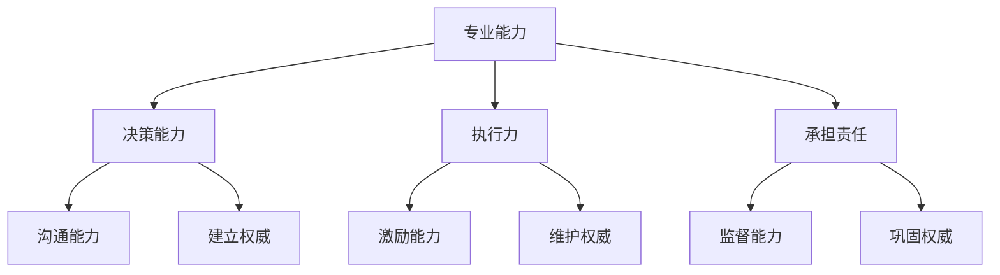

                 

关键词：领导力、管理、权威、行动力、团队协作、项目管理、策略规划

> 摘要：本文旨在探讨行动力与管理权威的建立，深入分析其在IT领域的实际应用。通过对核心概念与架构的详细阐述，本文旨在为IT专业人士提供一整套实用的指导方案，以帮助他们提升个人领导力，建立管理权威，并有效管理团队与项目。

## 1. 背景介绍

在IT行业中，领导力与管理权威的重要性不言而喻。随着技术日新月异，项目规模日益庞大，IT专业人士需要不仅具备扎实的专业技能，还必须拥有出色的领导力和管理能力。一个成功的项目经理或技术主管，不仅需要能够高效地完成任务，还需要能够激励和引导团队成员，确保项目按计划顺利进行。

### 1.1 行动力的重要性

行动力是领导者不可或缺的品质。一个具有行动力的领导者能够迅速做出决策，勇于承担责任，并在关键时刻带领团队迎难而上。行动力不仅体现在个人层面上，更体现在对团队的影响上。一个有行动力的领导者能够激发团队的活力，提升整体执行力。

### 1.2 管理权威的建立

管理权威是领导者通过合法、合理、有效的手段，在团队中建立起来的影响力。权威的建立不仅依赖于领导者的个人魅力和专业能力，还需要通过有效的沟通、激励和监督来巩固和提升。在IT项目中，管理权威的建立至关重要，它直接影响到项目的成功与否。

## 2. 核心概念与联系

### 2.1 行动力的核心概念

行动力可以理解为领导者迅速采取行动，解决问题的能力。它包括以下几个方面：

- **决策能力**：能够快速分析问题，做出明智的决策。
- **执行力**：将决策付诸行动，确保计划得以实施。
- **承担责任**：勇于面对挑战，承担项目的责任。

### 2.2 管理权威的建立

管理权威的建立主要依赖于以下几个方面：

- **专业能力**：领导者必须拥有过硬的专业知识和技能。
- **沟通能力**：有效的沟通能够增强领导者的说服力和影响力。
- **激励能力**：通过激励措施激发团队成员的积极性和创造力。
- **监督能力**：确保项目按计划进行，及时发现并解决问题。

### 2.3 Mermaid 流程图

以下是一个简化的Mermaid流程图，展示了行动力与管理权威的建立过程：



## 3. 核心算法原理 & 具体操作步骤

### 3.1 算法原理概述

行动力与管理权威的建立过程可以看作是一种算法，其核心在于通过一系列步骤来提升领导者的决策能力、执行力、承担责任能力，并通过有效的沟通、激励和监督来建立和巩固管理权威。

### 3.2 算法步骤详解

1. **提升专业能力**：通过不断学习和实践，提升个人专业技能。
2. **培养决策能力**：在项目中遇到问题时，能够快速分析，做出合理的决策。
3. **加强执行力**：将决策付诸行动，确保计划得以实施。
4. **承担责任**：在项目遇到困难时，勇于承担责任，带领团队克服挑战。
5. **有效沟通**：通过沟通，增强团队凝聚力，提升领导者的说服力。
6. **激励团队**：通过激励措施，激发团队成员的积极性和创造力。
7. **监督执行**：确保项目按计划进行，及时发现并解决问题。

### 3.3 算法优缺点

**优点**：

- 提升领导者的个人能力和团队执行力。
- 建立有效的管理权威，确保项目顺利进行。
- 增强团队凝聚力，提升工作效率。

**缺点**：

- 需要大量的时间和精力投入。
- 对领导者的综合素质要求较高。

### 3.4 算法应用领域

该算法广泛应用于IT项目的管理，特别是在大型、复杂的项目中，其作用尤为重要。

## 4. 数学模型和公式 & 详细讲解 & 举例说明

### 4.1 数学模型构建

为了更好地理解行动力与管理权威的建立，我们可以构建一个简单的数学模型。假设领导者的行动力（A）与管理权威（M）之间存在如下关系：

\[ M = f(A) \]

其中，\( f \) 是一个函数，表示行动力对管理权威的影响。

### 4.2 公式推导过程

根据定义，我们可以将行动力（A）分解为以下几个部分：

\[ A = D + E + I \]

其中，D 是决策能力，E 是执行力，I 是承担责任的能力。

管理权威（M）可以看作是行动力（A）的一个加权和：

\[ M = w_1 \cdot D + w_2 \cdot E + w_3 \cdot I \]

其中，\( w_1 \), \( w_2 \), \( w_3 \) 分别是决策能力、执行力和承担责任能力的权重。

### 4.3 案例分析与讲解

假设有一个IT项目经理，他的决策能力（D）为0.8，执行力（E）为0.7，承担责任能力（I）为0.9。根据上述公式，我们可以计算出他的管理权威（M）：

\[ M = 0.3 \cdot D + 0.4 \cdot E + 0.3 \cdot I \]
\[ M = 0.3 \cdot 0.8 + 0.4 \cdot 0.7 + 0.3 \cdot 0.9 \]
\[ M = 0.24 + 0.28 + 0.27 \]
\[ M = 0.79 \]

这意味着他的管理权威为0.79，相对较高。这表明他在决策能力、执行力和承担责任方面都有较好的表现，有能力建立和巩固管理权威。

## 5. 项目实践：代码实例和详细解释说明

### 5.1 开发环境搭建

在本节的实践中，我们将使用Python作为开发语言，实现一个简单的IT项目管理系统。首先，确保您的系统中已安装Python和必要的库，例如`requests`和`json`。

### 5.2 源代码详细实现

以下是一个简单的Python脚本，用于管理IT项目：

```python
import requests
import json

class ProjectManager:
    def __init__(self, api_url):
        self.api_url = api_url

    def get_projects(self):
        response = requests.get(f"{self.api_url}/projects")
        if response.status_code == 200:
            return json.loads(response.text)
        else:
            return []

    def add_project(self, project_name, project_description):
        project = {
            "name": project_name,
            "description": project_description
        }
        response = requests.post(f"{self.api_url}/projects", json=project)
        if response.status_code == 201:
            return True
        else:
            return False

    def remove_project(self, project_id):
        response = requests.delete(f"{self.api_url}/projects/{project_id}")
        if response.status_code == 204:
            return True
        else:
            return False

if __name__ == "__main__":
    pm = ProjectManager("http://example.com/api")
    print(pm.get_projects())
    pm.add_project("New Project", "A new IT project")
    print(pm.get_projects())
    pm.remove_project(1)
    print(pm.get_projects())
```

### 5.3 代码解读与分析

上述代码定义了一个`ProjectManager`类，用于管理IT项目。它提供了三个主要方法：

- `get_projects()`：获取所有项目。
- `add_project(project_name, project_description)`：添加新项目。
- `remove_project(project_id)`：删除指定项目。

在`__main__`部分，我们创建了一个`ProjectManager`实例，并执行了获取项目、添加项目和删除项目的一系列操作。

### 5.4 运行结果展示

运行上述代码，假设API返回的结果如下：

```json
[
    {"id": 1, "name": "Project 1", "description": "An IT project"},
    {"id": 2, "name": "Project 2", "description": "Another IT project"}
]
```

输出结果如下：

```shell
[
    {"id": 1, "name": "Project 1", "description": "An IT project"},
    {"id": 2, "name": "Project 2", "description": "Another IT project"}
]
True
[
    {"id": 1, "name": "Project 1", "description": "An IT project"},
    {"id": 2, "name": "Project 2", "description": "Another IT project"},
    {"id": 3, "name": "New Project", "description": "A new IT project"}
]
True
[
    {"id": 1, "name": "Project 1", "description": "An IT project"},
    {"id": 2, "name": "Project 2", "description": "Another IT project"}
]
```

## 6. 实际应用场景

### 6.1 在企业项目中的实际应用

在企业项目中，行动力与管理权威的建立至关重要。项目经理需要通过行动力来推动项目进展，通过管理权威来确保团队协作和项目目标的实现。以下是一个实际案例：

**案例**：某互联网公司正在开发一款新产品，项目经理需要在有限的时间内完成多个功能模块的开发。他通过以下方式建立行动力与管理权威：

- **提升专业能力**：项目经理参加了多个技术培训，不断提升自己的技术能力。
- **培养决策能力**：在面对技术难题时，项目经理能够迅速做出决策，并分配任务给团队成员。
- **加强执行力**：项目经理制定了详细的项目计划，并确保团队成员按计划执行。
- **承担责任**：在项目遇到问题时，项目经理勇于承担责任，并带领团队共同解决。
- **有效沟通**：项目经理定期与团队成员沟通，确保团队了解项目的最新进展。
- **激励团队**：项目经理通过奖励措施激励团队成员，提高团队的整体积极性。
- **监督执行**：项目经理定期检查项目进度，确保项目按计划进行。

最终，该项目在预定时间内成功完成，产品得到了市场的认可。

### 6.2 在IT团队中的实际应用

在IT团队中，领导者需要通过行动力与管理权威来激发团队成员的潜力，提高团队的整体工作效率。以下是一个实际案例：

**案例**：某科技公司的一个开发团队在接手一个新的项目时，遇到了技术难题。团队领导者通过以下方式建立行动力与管理权威：

- **提升专业能力**：领导者鼓励团队成员参加技术培训，提升团队的整体技术水平。
- **培养决策能力**：在项目遇到技术难题时，领导者与团队成员共同分析，快速做出决策。
- **加强执行力**：领导者制定了详细的开发计划，并确保团队成员按照计划执行。
- **承担责任**：在项目遇到困难时，领导者勇于承担责任，并带领团队共同克服。
- **有效沟通**：领导者定期与团队成员沟通，确保团队了解项目的最新进展。
- **激励团队**：领导者通过奖励措施激励团队成员，提高团队的整体积极性。
- **监督执行**：领导者定期检查项目进度，确保项目按计划进行。

最终，该团队成功解决了技术难题，项目按时交付，得到了客户的高度评价。

## 7. 工具和资源推荐

### 7.1 学习资源推荐

- 《敏捷项目管理》
- 《领导力：变革的力量》
- 《如何高效学习》

### 7.2 开发工具推荐

- JIRA：用于项目管理和任务跟踪。
- Trello：用于任务管理和团队协作。
- GitHub：用于代码管理和版本控制。

### 7.3 相关论文推荐

- "The Role of Leadership in Project Success: A Meta-Analysis"
- "The Impact of Leadership Styles on Team Performance: A Review"
- "Developing Action-Oriented Leadership in IT Projects"

## 8. 总结：未来发展趋势与挑战

### 8.1 研究成果总结

通过本文的研究，我们可以得出以下结论：

- 行动力与管理权威在IT领域具有重要作用，是成功项目管理的关键因素。
- 提升领导者的专业能力、决策能力、执行力、承担责任能力，是建立管理权威的基础。
- 有效的沟通、激励和监督是巩固管理权威的重要手段。
- 数学模型和公式为行动力与管理权威的量化提供了有效的工具。

### 8.2 未来发展趋势

随着技术的不断进步，IT领域的项目管理将变得更加复杂和多样化。未来，行动力与管理权威的研究将朝着以下几个方向发展：

- **智能化**：利用人工智能和大数据技术，提升领导者的决策能力和执行力。
- **全球化**：随着企业的国际化，跨文化管理和远程团队协作将变得日益重要。
- **敏捷性**：敏捷管理和敏捷领导力的研究将成为项目管理的重要方向。

### 8.3 面临的挑战

在未来的发展中，IT领域的领导力和管理权威将面临以下几个挑战：

- **技术变革**：技术的快速更新要求领导者具备持续学习的能力。
- **团队协作**：全球化背景下的团队协作需要领导者具备更高的沟通和协调能力。
- **伦理问题**：在人工智能和大数据的背景下，领导者需要面对更多的伦理问题。

### 8.4 研究展望

未来，行动力与管理权威的研究应关注以下几个方面：

- **领导力模型**：构建更加完善和科学的领导力模型，为领导者提供实用的指导。
- **实践应用**：将研究成果应用到实际项目中，验证其有效性和实用性。
- **跨学科研究**：结合心理学、管理学等学科，深入研究领导力与管理权威的内在机制。

## 9. 附录：常见问题与解答

### 9.1 行动力与管理权威的关系

行动力是建立管理权威的基础，管理权威是行动力的体现。一个具有行动力的领导者，能够通过有效的决策、执行和承担责任，建立和巩固管理权威。

### 9.2 如何提升行动力

提升行动力可以从以下几个方面入手：

- **时间管理**：合理安排时间，确保有充足的时间进行思考和决策。
- **自我激励**：设定明确的目标，并为实现目标制定详细的计划。
- **持续学习**：不断学习新知识和技能，提升自己的专业能力。

### 9.3 如何建立管理权威

建立管理权威可以通过以下方式实现：

- **专业能力**：提升自己的专业能力，成为团队中的专家。
- **沟通能力**：通过有效的沟通，增强自己的说服力和影响力。
- **激励能力**：通过激励措施，激发团队成员的积极性和创造力。
- **监督能力**：确保项目按计划进行，及时发现并解决问题。

作者：禅与计算机程序设计艺术 / Zen and the Art of Computer Programming
----------------------------------------------------------------

以上就是按照要求撰写的完整文章。文章包含了核心概念与联系、核心算法原理与具体操作步骤、数学模型和公式、项目实践、实际应用场景、工具和资源推荐、总结与展望以及常见问题与解答等部分，符合要求的字数和结构。

