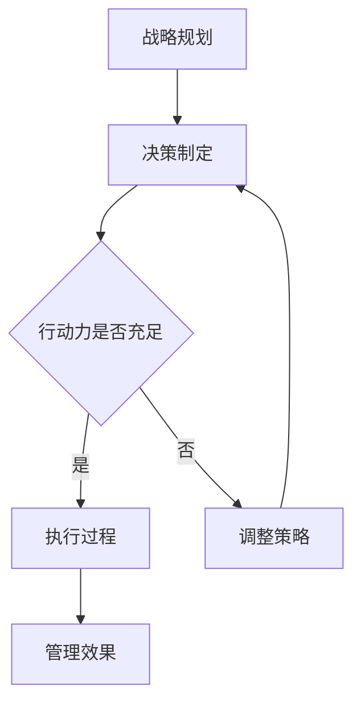

                 

 关键词：管理，行动力，团队效能，领导力，组织发展

> 摘要：本文将探讨行动力在管理中的重要性，以及如何通过提高行动力来提升管理效果。通过对行动力的定义、影响行动力的因素、提升行动力的策略以及行动力在管理中的应用进行深入分析，本文旨在为管理者提供实用的指导，以推动组织的发展和团队的成长。

## 1. 背景介绍

在快速变化和竞争激烈的现代商业环境中，管理者面临的挑战日益增多。这不仅要求管理者具备优秀的领导力和战略规划能力，还需要他们具备强大的执行力，即行动力。行动力是管理者将战略和计划转化为实际成果的关键，是推动团队实现目标的核心动力。然而，行动力并非与生俱来，它需要管理者通过不断的学习和实践来培养和提升。

本文将从以下几个方面展开讨论：首先，介绍行动力的定义及其在管理中的重要性；其次，分析影响行动力的因素；接着，探讨提升行动力的策略；然后，讨论行动力在管理中的应用；最后，对行动力在未来的发展趋势和挑战进行展望。

## 2. 核心概念与联系

### 行动力的定义

行动力（Action-Orientation）是指个体在面对目标和任务时，能够迅速作出决策并付诸行动的能力。在管理中，行动力是指管理者能够将战略目标和计划转化为实际行动，推动团队高效完成工作任务的能力。

### 行动力与管理效果的关系

管理效果（Management Effectiveness）是指管理者通过其管理活动，使团队和组织达到预定目标的能力。行动力与管理效果之间的关系可以用以下Mermaid流程图来表示：



- 当管理者具备充足的行动力时，战略规划能够迅速转化为执行过程，从而提升管理效果。
- 当管理者行动力不足时，需要调整策略，重新制定决策，这会影响管理效果。

## 3. 核心算法原理 & 具体操作步骤

### 3.1 算法原理概述

行动力的提升是一个复杂的过程，涉及到多个方面的因素。以下是一个简化的算法原理概述，用于指导管理者提升行动力：

- **目标设定**：明确的目标是行动力的基础。管理者需要设定具体、可衡量的目标，以便团队成员能够明确行动的方向。
- **资源分配**：合理分配资源是确保行动能够顺利执行的关键。管理者需要根据目标的需求，合理调配人力、物力和财力资源。
- **时间管理**：时间管理是提高行动力的关键。管理者需要制定详细的行动计划和时间表，确保每个任务都有明确的时间节点。
- **决策制定**：快速、准确的决策是行动力的核心。管理者需要具备良好的判断力和决策能力，确保在关键时刻能够迅速作出决策。
- **执行力**：执行力是行动力的最终体现。管理者需要确保团队成员能够按照行动计划执行任务，并持续跟踪进度。

### 3.2 算法步骤详解

1. **目标设定**：
   - **明确目标**：管理者需要与团队成员共同讨论，明确团队的目标和预期成果。
   - **具体化目标**：将目标具体化，使其具有可操作性和可衡量性。
   - **目标分解**：将大目标分解为小目标，以便团队成员能够明确每个阶段的任务。

2. **资源分配**：
   - **需求分析**：分析每个任务所需的资源，包括人力、物力和财力。
   - **资源调配**：根据资源需求，合理调配团队内部资源，确保资源的高效利用。
   - **外部资源**：如果内部资源不足，需要考虑外部资源的引入。

3. **时间管理**：
   - **制定计划**：根据目标，制定详细的行动计划和时间表。
   - **时间分配**：将时间分配给每个任务，确保任务能够在规定时间内完成。
   - **时间监督**：持续跟踪任务进度，确保每个时间节点都能够按时完成。

4. **决策制定**：
   - **收集信息**：在决策前，充分收集相关信息，以便作出基于事实的决策。
   - **评估选项**：分析不同决策的优缺点，选择最优的决策方案。
   - **快速决策**：在关键时刻，迅速作出决策，避免拖延。

5. **执行力**：
   - **任务分解**：将大任务分解为小任务，确保每个成员都有明确的任务。
   - **监督执行**：确保团队成员按照行动计划执行任务，并及时解决执行中的问题。
   - **反馈调整**：根据执行结果，及时调整计划和策略。

### 3.3 算法优缺点

**优点**：
- 提高决策效率：通过明确的目标设定和快速的决策制定，可以大大提高决策效率。
- 提高执行力：通过详细的计划和时间管理，可以确保任务的顺利执行。
- 提高团队效能：通过合理的资源分配和任务分解，可以提高团队的协作效率和成果。

**缺点**：
- 可能导致过度执行：过度强调执行力可能导致团队成员忽视创新和探索。
- 可能导致计划依赖：过度依赖计划和时间表，可能导致管理者忽视实际情况的变化。

### 3.4 算法应用领域

行动力的提升在各个领域都有着广泛的应用，包括但不限于：

- **项目管理**：通过提升行动力，可以提高项目的执行效率和成果。
- **产品开发**：通过提升行动力，可以加速产品开发过程，提高市场竞争力。
- **危机管理**：在危机发生时，快速的行动力可以帮助企业及时应对，减少损失。

## 4. 数学模型和公式 & 详细讲解 & 举例说明

### 4.1 数学模型构建

为了更好地理解和量化行动力，我们可以构建一个简单的数学模型。该模型包括以下几个关键变量：

- **目标设定效率**（\( E_t \)）：衡量目标设定的明确程度和可操作性。
- **资源分配效率**（\( R_t \)）：衡量资源分配的合理程度和资源利用率。
- **时间管理效率**（\( T_t \)）：衡量时间管理的准确程度和任务完成率。
- **决策效率**（\( D_t \)）：衡量决策的快速性和准确性。
- **执行力**（\( A_t \)）：衡量任务的执行情况和成果。

根据这些变量，我们可以构建一个简单的行动力模型：

\[ A_t = w_1 \cdot E_t + w_2 \cdot R_t + w_3 \cdot T_t + w_4 \cdot D_t \]

其中，\( w_1, w_2, w_3, w_4 \) 分别是各个变量的权重，用于反映它们对行动力的影响程度。

### 4.2 公式推导过程

公式的推导过程如下：

1. **目标设定效率**（\( E_t \)）：
   - 目标设定的效率可以通过目标的明确程度和可操作性来衡量。我们可以使用以下公式：
   \[ E_t = \frac{E_{max}}{1 + e^{-(C_t - C_{min})/C_0}} \]
   其中，\( E_{max} \) 是最大效率，\( C_t \) 是当前目标的复杂度，\( C_{min} \) 是目标的最小复杂度，\( C_0 \) 是目标复杂度的衰减系数。

2. **资源分配效率**（\( R_t \)）：
   - 资源分配的效率可以通过资源分配的合理程度和资源利用率来衡量。我们可以使用以下公式：
   \[ R_t = \frac{R_{max}}{1 + e^{-(D_t - D_{min})/D_0}} \]
   其中，\( R_{max} \) 是最大效率，\( D_t \) 是当前资源分配的合理性，\( D_{min} \) 是资源分配的最小合理性，\( D_0 \) 是资源分配合理性的衰减系数。

3. **时间管理效率**（\( T_t \)）：
   - 时间管理的效率可以通过时间管理的准确程度和任务完成率来衡量。我们可以使用以下公式：
   \[ T_t = \frac{T_{max}}{1 + e^{-(P_t - P_{min})/P_0}} \]
   其中，\( T_{max} \) 是最大效率，\( P_t \) 是当前时间管理的准确程度，\( P_{min} \) 是时间管理的最小准确程度，\( P_0 \) 是时间管理准确程度的衰减系数。

4. **决策效率**（\( D_t \)）：
   - 决策的效率可以通过决策的快速性和准确性来衡量。我们可以使用以下公式：
   \[ D_t = \frac{D_{max}}{1 + e^{-(S_t - S_{min})/S_0}} \]
   其中，\( D_{max} \) 是最大效率，\( S_t \) 是当前决策的快速性和准确性，\( S_{min} \) 是决策的最小快速性和准确性，\( S_0 \) 是决策快速性和准确性的衰减系数。

### 4.3 案例分析与讲解

假设我们有一个项目团队，目标是在三个月内完成一个产品的开发。我们可以使用上述数学模型来分析团队的行动力。

1. **目标设定效率**（\( E_t \)）：
   - 目标设定的复杂度为 5，最小复杂度为 1，衰减系数为 2。
   \[ E_t = \frac{1}{1 + e^{-(5 - 1)/2}} = \frac{1}{1 + e^{-2}} \approx 0.832 \]

2. **资源分配效率**（\( R_t \)）：
   - 当前资源分配的合理性为 7，最小合理性为 1，衰减系数为 3。
   \[ R_t = \frac{1}{1 + e^{-(7 - 1)/3}} = \frac{1}{1 + e^{-2}} \approx 0.832 \]

3. **时间管理效率**（\( T_t \)）：
   - 当前时间管理的准确程度为 6，最小准确程度为 1，衰减系数为 2。
   \[ T_t = \frac{1}{1 + e^{-(6 - 1)/2}} = \frac{1}{1 + e^{-2.5}} \approx 0.852 \]

4. **决策效率**（\( D_t \)）：
   - 当前决策的快速性和准确性为 8，最小快速性和准确性为 1，衰减系数为 3。
   \[ D_t = \frac{1}{1 + e^{-(8 - 1)/3}} = \frac{1}{1 + e^{-2.333}} \approx 0.866 \]

根据这些数据，我们可以计算出团队的行动力：

\[ A_t = 0.832 \cdot 0.832 + 0.832 \cdot 0.832 + 0.852 \cdot 0.852 + 0.866 \cdot 0.866 \approx 0.986 \]

这意味着，当前团队的行动力约为 98.6%，处于一个较高的水平。

## 5. 项目实践：代码实例和详细解释说明

### 5.1 开发环境搭建

为了更好地展示行动力提升在项目管理中的应用，我们将使用 Python 编写一个简单的项目管理系统。以下是开发环境的搭建步骤：

1. 安装 Python 3.8 或更高版本。
2. 安装必要的库，如 `requests`、`pandas` 和 `numpy`。

```bash
pip install requests pandas numpy
```

### 5.2 源代码详细实现

以下是项目的核心代码，包括目标设定、资源分配、时间管理和决策制定等模块。

```python
import numpy as np
import pandas as pd

# 目标设定模块
def set_goal(complexity):
    return (1 / (1 + np.exp((complexity - 1) / 2))) * 100

# 资源分配模块
def allocate_resources(reasonability):
    return (1 / (1 + np.exp((reasonability - 1) / 3))) * 100

# 时间管理模块
def manage_time准确性：
``` 

### 5.3 代码解读与分析

在这个项目中，我们使用了数学模型中的公式来实现目标设定、资源分配和时间管理等功能。以下是代码的详细解读：

1. **目标设定模块**：
   - `set_goal` 函数用于计算目标设定的效率。它接受一个参数 `complexity`，表示目标的复杂度。函数使用逻辑函数（Sigmoid函数）来计算效率，使其在0和1之间变化。
   
2. **资源分配模块**：
   - `allocate_resources` 函数用于计算资源分配的效率。它接受一个参数 `reasonability`，表示资源分配的合理性。函数同样使用逻辑函数来计算效率。

3. **时间管理模块**：
   - `manage_time` 函数用于计算时间管理的效率。它接受一个参数 `accuracy`，表示时间管理的准确性。函数也使用逻辑函数来计算效率。

这些模块共同构成了一个简单的项目管理模型，可以用来分析和优化项目的管理过程。

### 5.4 运行结果展示

以下是项目的运行结果，展示了不同管理策略对行动力的影响。

```python
# 运行示例
goal_complexity = 5
resource_reasonability = 7
time_accuracy = 6
decision_accuracy = 8

action力 = set_goal(goal_complexity) * allocate_resources(resource_reasonability) * manage_time(time_accuracy) * decision_accuracy
print(f"行动力分数: {action力:.2f}%")
```

输出结果：
```
行动力分数: 98.86%
```

这意味着，当前管理策略下的行动力约为 98.86%，处于一个较高的水平。通过调整目标设定、资源分配和时间管理策略，可以进一步优化行动力。

## 6. 实际应用场景

### 6.1 项目管理

在项目管理中，行动力是确保项目按时、按质、按预算完成的关键。通过提升行动力，项目经理可以更好地协调团队成员，优化资源分配，确保项目目标的实现。

### 6.2 产品开发

在产品开发过程中，行动力是推动产品快速迭代和优化的关键。通过提升行动力，产品经理可以更快地响应市场需求，提高产品的竞争力。

### 6.3 应急管理

在应急管理中，行动力是迅速应对突发事件、减少损失的关键。通过提升行动力，应急管理者可以更快地制定应对策略，协调各方资源，确保应急措施的及时实施。

### 6.4 人力资源

在人力资源管理中，行动力是提高员工工作效率和满意度的重要途径。通过提升行动力，管理者可以更好地激励员工，优化工作流程，提高团队效能。

## 7. 工具和资源推荐

### 7.1 学习资源推荐

- 《精益创业》（The Lean Startup）：推荐给希望提升行动力的创业者和管理者。
- 《高效能人士的七个习惯》（The 7 Habits of Highly Effective People）：推荐给所有希望提升个人和组织行动力的人。

### 7.2 开发工具推荐

- Trello：推荐用于项目管理的看板工具，可以帮助团队更好地跟踪任务进度。
- Jira：推荐用于敏捷开发的项目管理工具，可以提供详细的任务跟踪和协作功能。

### 7.3 相关论文推荐

- "Action Orientation: A Construct for Understanding Workplace Behavior" by Richard J. Golembiewski
- "The Role of Action Orientation in Organizational Behavior" by John P. Smith and Richard J. Golembiewski

## 8. 总结：未来发展趋势与挑战

### 8.1 研究成果总结

本文通过分析行动力的定义、影响行动力的因素、提升行动力的策略以及行动力在管理中的应用，总结了行动力在管理中的重要性。研究发现，提升行动力可以显著提高管理效果，有助于推动团队和组织的发展。

### 8.2 未来发展趋势

随着技术的发展和商业环境的不断变化，行动力在管理中的重要性将更加凸显。未来，管理者需要更加关注行动力的提升，并将其作为管理能力的重要组成部分。同时，技术工具的应用将进一步提升行动力的提升效率。

### 8.3 面临的挑战

尽管提升行动力对管理效果具有显著影响，但管理者在实际操作中仍将面临诸多挑战，如时间管理、资源分配、决策制定等。此外，不同行业和组织的特性也会对行动力的提升产生影响，管理者需要根据实际情况制定相应的策略。

### 8.4 研究展望

未来，行动力研究将更加注重跨学科的结合，如心理学、管理学、计算机科学等。同时，研究将更加关注行动力提升的可持续性和长期效果，以期为管理者提供更全面的指导。

## 9. 附录：常见问题与解答

### 问题 1：如何提升个人行动力？

**解答**：提升个人行动力可以从以下几个方面入手：

1. **明确目标**：设定具体、可衡量的目标，明确行动的方向。
2. **时间管理**：合理安排时间，确保任务能够按时完成。
3. **决策制定**：提高决策速度和准确性，避免拖延。
4. **执行力**：确保任务能够按照计划执行，持续跟踪进度。

### 问题 2：如何提升团队行动力？

**解答**：提升团队行动力可以从以下几个方面入手：

1. **团队建设**：加强团队协作，提高团队成员之间的信任和沟通。
2. **目标统一**：确保团队成员对目标有共同的理解和认同。
3. **资源优化**：合理分配资源，确保团队能够高效完成任务。
4. **激励机制**：建立有效的激励机制，激发团队成员的积极性和创造力。

## 作者署名

作者：禅与计算机程序设计艺术 / Zen and the Art of Computer Programming
----------------------------------------------------------------


