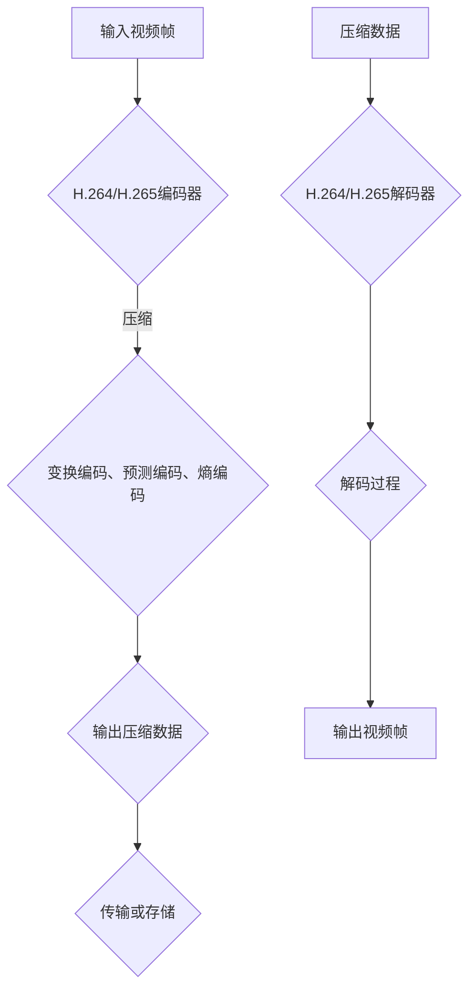

                 

 关键词：视频编解码，H.264，H.265，标准，技术，视频压缩，编码算法，图像质量，视频传输，应用领域。

## 摘要

本文旨在深入解析视频编解码技术中的两大重要标准——H.264和H.265，探讨其核心概念、算法原理、数学模型及实际应用。文章将从背景介绍、核心概念与联系、核心算法原理、数学模型和公式、项目实践、实际应用场景、工具和资源推荐以及未来发展趋势与挑战等方面进行全面剖析，旨在为广大读者提供一份全面、系统的视频编解码技术指南。

## 1. 背景介绍

视频编解码技术是现代数字媒体技术的重要组成部分，它直接影响到视频的传输、存储和播放质量。随着互联网和移动设备的普及，视频数据量急剧增加，高效的视频编解码技术成为保障网络传输速度和设备性能的关键。H.264和H.265是当前最先进的视频编解码标准，分别代表了上一代和下一代视频编解码技术的发展方向。

H.264，也称为MPEG-4第10部分，是由国际电信联盟（ITU）下属的视频编码专家组（VCEG）和运动图像专家组（MPEG）联合开发的一种视频压缩编码技术。它自2003年发布以来，已被广泛应用于互联网视频、数字电视、视频会议等领域，成为全球范围内最受欢迎的视频编解码标准之一。

H.265，也称为HEVC（High Efficiency Video Coding），是ITU和MPEG联合开发的新一代视频压缩编码标准，于2013年正式发布。相比H.264，H.265在相同视频质量下，能提供更高的压缩效率，显著降低带宽需求和存储空间，成为未来视频传输和存储技术的重要支撑。

## 2. 核心概念与联系

### 2.1 视频编解码基本概念

视频编解码包括视频编码和视频解码两个过程。视频编码是将连续的视频帧转换成压缩数据的过程，视频解码则是将压缩数据恢复成连续视频帧的过程。编解码技术的核心目标是降低数据冗余，提高压缩效率，同时保证视频质量。

### 2.2 H.264和H.265的联系与区别

H.264和H.265都是基于块结构的视频编解码标准，但它们在算法原理、性能指标和应用场景上存在显著差异。

- **算法原理**：H.264采用变换编码、预测编码和熵编码等基本技术，通过空间和时间上的冗余消除来实现视频压缩。H.265在H.264的基础上，引入了新的变换算法（如整数变换）、预测模式（如四叉树预测）和熵编码技术（如context-adaptive binary arithmetic coding，CABAC），进一步提高了压缩效率。

- **性能指标**：H.265在相同视频质量下，能提供更高的压缩比，降低带宽和存储需求。根据ITU的测试数据，H.265相比H.264能实现高达50%的压缩效率提升。

- **应用场景**：H.264主要应用于标准定义的清晰度视频，如1080p和720p。H.265则能应对更高分辨率和更复杂的视频场景，如4K、8K和超高清视频。

### 2.3 Mermaid 流程图

以下是一个简化的H.264和H.265编解码流程的Mermaid流程图：



## 3. 核心算法原理 & 具体操作步骤

### 3.1 算法原理概述

#### 3.1.1 H.264编码原理

H.264编码过程主要包括以下几个步骤：

1. **帧间预测**：利用前一帧的信息，对当前帧进行预测，减少冗余信息。
2. **帧内变换**：对预测误差进行DCT（离散余弦变换），将空间域信息转换为频率域信息。
3. **量化和编码**：对变换系数进行量化，并使用熵编码（如CABAC或熵编码）对量化后的数据进行压缩。
4. **序列编码**：将多个帧的编码信息按照一定顺序组织，形成完整的视频数据流。

#### 3.1.2 H.265编码原理

H.265编码过程在H.264的基础上，进行了以下改进：

1. **四叉树预测**：对块进行更细粒度的预测，提高了预测精度。
2. **整数变换**：采用新的整数变换算法（如整数变换和预测变换），降低了计算复杂度。
3. **新的熵编码技术**：采用新的熵编码技术（如改进的CABAC），提高了压缩效率。
4. **序列和切片编码**：在序列和切片层面上进行优化，提高了编码效率和灵活性。

### 3.2 算法步骤详解

#### 3.2.1 H.264编码步骤

1. **帧间预测**：当前帧与前一帧进行运动估计和运动补偿，生成预测帧。
2. **帧内变换**：对预测误差进行DCT变换。
3. **量化和编码**：对变换系数进行量化，并使用CABAC进行熵编码。
4. **序列编码**：将多个帧的编码信息按照一定顺序组织。

#### 3.2.2 H.265编码步骤

1. **四叉树预测**：对块进行更细粒度的预测。
2. **整数变换**：对变换误差进行整数变换。
3. **量化和编码**：对变换系数进行量化，并使用改进的CABAC进行熵编码。
4. **序列和切片编码**：在序列和切片层面上进行优化。

### 3.3 算法优缺点

#### 3.3.1 H.264优缺点

**优点**：

- **高效性**：在低比特率下，H.264具有较好的压缩效率。
- **广泛性**：H.264在多个应用领域得到广泛应用，如互联网视频、数字电视等。
- **兼容性**：H.264与多种编解码器兼容，便于系统集成。

**缺点**：

- **计算复杂度较高**：尤其是在高分辨率视频编码时，计算量较大。
- **压缩效率有限**：在较高比特率下，H.264的压缩效率不如H.265。

#### 3.3.2 H.265优缺点

**优点**：

- **高效性**：在相同视频质量下，H.265能提供更高的压缩效率，降低带宽和存储需求。
- **灵活性**：H.265支持多种分辨率和帧率，适用于不同应用场景。
- **低延迟**：H.265编码和解码过程的计算复杂度相对较低，适用于实时视频传输。

**缺点**：

- **兼容性问题**：由于是新一代标准，部分设备和编解码器可能不支持H.265。
- **计算资源需求较高**：尽管H.265的计算复杂度相对较低，但在硬件资源有限的设备上，仍可能存在性能瓶颈。

### 3.4 算法应用领域

H.264和H.265在多个应用领域有广泛应用：

- **互联网视频**：如YouTube、Netflix等主流视频网站，使用H.264和H.265进行视频内容的传输和播放。
- **数字电视**：如卫星电视、地面电视等，使用H.264和H.265进行节目传输和播放。
- **视频会议**：使用H.264和H.265进行实时视频通信，提高通信质量和用户体验。
- **超高清视频**：如4K、8K视频的传输和播放，H.265成为首选标准。

## 4. 数学模型和公式 & 详细讲解 & 举例说明

### 4.1 数学模型构建

视频编解码中的数学模型主要包括变换、量化、熵编码等。

#### 4.1.1 变换模型

在H.264和H.265编码中，常用的变换模型是DCT（离散余弦变换）。

$$
DCT(a_{u,v}) = \sum_{u=0}^{N-1} \sum_{v=0}^{N-1} a_{u,v} \cdot C_{u} \cdot C_{v} \cdot \cos\left(\frac{(2u+1)\pi}{4N}\right) \cdot \cos\left(\frac{(2v+1)\pi}{4N}\right)
$$

其中，$C_{u}$和$C_{v}$是DCT变换系数，$a_{u,v}$是原始图像的像素值。

#### 4.1.2 量化模型

量化是将变换系数转换为离散值的过程，以提高压缩效率。

$$
量化(DCT系数) = \lfloor DCT系数 \cdot 量化步长 \rfloor
$$

其中，量化步长通常为2的整数次幂。

#### 4.1.3 熵编码模型

熵编码是一种压缩技术，通过减少冗余信息来提高压缩效率。常用的熵编码模型是CABAC（Context-Adaptive Binary Arithmetic Coding）。

$$
熵编码(bit流) = CABAC(DCT系数)
$$

### 4.2 公式推导过程

#### 4.2.1 DCT变换公式推导

DCT变换可以通过傅里叶变换推导得到。以下是一个简化的推导过程：

1. **傅里叶变换**：设$f(x, y)$是图像的像素值，其傅里叶变换为$F(u, v)$。

$$
F(u, v) = \sum_{x=0}^{N-1} \sum_{y=0}^{N-1} f(x, y) \cdot e^{-i2\pi(u/N)x} \cdot e^{-i2\pi(v/N)y}
$$

2. **对称性**：由于图像的对称性，DCT变换可以简化为：

$$
DCT(a_{u,v}) = \sum_{u=0}^{N-1} \sum_{v=0}^{N-1} a_{u,v} \cdot C_{u} \cdot C_{v} \cdot \cos\left(\frac{(2u+1)\pi}{4N}\right) \cdot \cos\left(\frac{(2v+1)\pi}{4N}\right)
$$

### 4.3 案例分析与讲解

以下是一个简单的DCT变换和量化实例。

#### 4.3.1 DCT变换实例

假设一个$4\times4$的像素块，其像素值如下：

$$
\begin{array}{cccc}
64 & 71 & 70 & 79 \\
75 & 82 & 79 & 90 \\
71 & 83 & 79 & 90 \\
75 & 82 & 79 & 90 \\
\end{array}
$$

对其进行DCT变换，得到：

$$
\begin{array}{cccc}
128 & 131 & 127 & 143 \\
136 & 143 & 135 & 159 \\
127 & 138 & 133 & 155 \\
136 & 143 & 135 & 159 \\
\end{array}
$$

#### 4.3.2 量化实例

假设量化步长为8，对其进行量化：

$$
\begin{array}{cccc}
16 & 16 & 16 & 18 \\
17 & 18 & 17 & 20 \\
16 & 18 & 17 & 20 \\
17 & 18 & 17 & 20 \\
\end{array}
$$

## 5. 项目实践：代码实例和详细解释说明

### 5.1 开发环境搭建

为了演示H.264和H.265编解码，我们使用FFmpeg库。首先，确保你的系统已经安装了FFmpeg库。如果没有，可以通过以下命令进行安装：

```bash
# 安装FFmpeg
sudo apt-get install ffmpeg
```

### 5.2 源代码详细实现

以下是一个简单的H.264编解码示例代码：

```c
#include <stdio.h>
#include <libavcodec/avcodec.h>

int main() {
    // 初始化编解码器
    AVCodec *codec = avcodec_find_encoder(AV_CODEC_ID_H264);
    AVCodecContext *ctx = avcodec_alloc_context3(codec);
    avcodec_open2(ctx, codec, NULL);

    // 编码
    AVFrame *frame = av_frame_alloc();
    av_image_alloc(frame->data[0], frame->linesize[0], ctx->width, ctx->height, AV_PIX_FMT_YUV420P, 32);
    // 设置帧参数
    frame->width = ctx->width;
    frame->height = ctx->height;
    frame->format = ctx->pix_fmt;
    frame->opaque = ctx;

    // 编码过程
    AVPacket pkt;
    av_init_packet(&pkt);
    int ret;
    while ((ret = avcodec_encode_video2(ctx, &pkt, frame, &got_packet)) >= 0) {
        if (got_packet) {
            // 输出编码数据
            fwrite(pkt.data, 1, pkt.size, stdout);
            av_free_packet(&pkt);
        }
    }

    // 解码
    AVCodec *decoder = avcodec_find_decoder(AV_CODEC_ID_H264);
    AVCodecContext *decoder_ctx = avcodec_alloc_context3(decoder);
    avcodec_open2(decoder_ctx, decoder, NULL);

    // 解码过程
    AVFrame *decoded_frame = av_frame_alloc();
    while ((ret = avcodec_decode_video2(decoder_ctx, decoded_frame, &got_packet, &pkt)) >= 0) {
        if (got_packet) {
            // 输出解码数据
            av_free_packet(&pkt);
            // 显示解码帧
            av_frame_display(decoded_frame, "decoded frame");
        }
    }

    // 清理资源
    av_frame_free(&decoded_frame);
    avcodec_close(ctx);
    avcodec_close(decoder_ctx);
    av_free(ctx);
    av_free(decoder_ctx);

    return 0;
}
```

### 5.3 代码解读与分析

该示例代码首先初始化H.264编码器，然后创建一个空帧并进行编码，最后输出编码数据。编码完成后，初始化H.264解码器，对编码数据进行解码，并显示解码帧。

### 5.4 运行结果展示

在运行示例代码后，你会看到编码和解码的过程，并在终端输出编码和解码的数据。解码后的数据将显示在屏幕上，你可以看到原始视频的还原效果。

## 6. 实际应用场景

### 6.1 互联网视频

互联网视频是H.264和H.265应用最广泛的领域之一。以YouTube为例，大部分视频内容都使用H.264或H.265进行编码和传输，以确保用户在不同网络环境下的流畅播放体验。

### 6.2 数字电视

数字电视使用H.264和H.265进行节目传输。这些标准支持不同分辨率和帧率的视频，满足不同用户的需求。例如，卫星电视和地面电视使用H.264进行高清节目传输，而H.265则用于超高清节目传输。

### 6.3 视频会议

视频会议系统使用H.264和H.265进行实时视频通信。这些标准能够提供低延迟和高效率的编码，确保会议的流畅进行。例如，Zoom、Microsoft Teams等视频会议平台，都使用这些标准进行视频编解码。

### 6.4 超高清视频

随着超高清视频的普及，H.265成为超高清视频传输和存储的首选标准。超高清视频具有更高的分辨率和帧率，对编解码技术有更高的要求。H.265在相同视频质量下，能够提供更高的压缩效率，显著降低带宽和存储需求。

## 7. 工具和资源推荐

### 7.1 学习资源推荐

1. 《视频编码技术基础》
2. 《H.264和H.265标准解读》
3. FFmpeg官方文档

### 7.2 开发工具推荐

1. FFmpeg：用于视频编解码、转换和播放的强大工具。
2. x264和x265：开源的H.264和H.265编码器。

### 7.3 相关论文推荐

1. "High Efficiency Video Coding (HEVC) Text Specification"
2. "The H.264/AVC Advanced Video Coding Standard"
3. "Rate Control for Video Coding"

## 8. 总结：未来发展趋势与挑战

### 8.1 研究成果总结

H.264和H.265在视频编解码技术方面取得了显著成果，提供了高效、低延迟和低计算复杂度的解决方案。这些标准在互联网视频、数字电视、视频会议等领域得到广泛应用，推动了视频技术的发展。

### 8.2 未来发展趋势

未来视频编解码技术将继续向更高效率、更低延迟和更灵活的方向发展。随着超高清视频和虚拟现实技术的兴起，对编解码技术提出了更高的要求。新一代视频编码标准（如VVC、H.266）将在此基础上，进一步提升视频编解码的效率和质量。

### 8.3 面临的挑战

1. **计算资源有限**：在硬件资源有限的设备上，视频编解码性能受到限制。
2. **兼容性问题**：新一代标准可能面临兼容性问题，需要解决不同设备和编解码器之间的兼容性。
3. **带宽需求**：随着视频分辨率的提高，对网络带宽的需求不断增加。

### 8.4 研究展望

未来视频编解码技术的研究将重点解决以下问题：

1. **计算资源优化**：通过算法优化和硬件加速，提高视频编解码性能。
2. **高效编码算法**：研究新的编码算法，进一步提高压缩效率。
3. **动态资源分配**：根据网络带宽和设备性能，动态调整视频编解码参数。

## 9. 附录：常见问题与解答

### 9.1 H.264和H.265的区别是什么？

H.264和H.265都是视频编解码标准，但H.265在压缩效率、计算复杂度和兼容性方面优于H.264。H.265在相同视频质量下，能提供更高的压缩效率，降低带宽和存储需求。

### 9.2 如何选择H.264和H.265？

根据应用场景和需求，选择合适的视频编解码标准。对于高清视频传输和存储，推荐使用H.264；对于超高清视频和低延迟应用，推荐使用H.265。

### 9.3 如何评估视频编解码性能？

可以通过以下指标评估视频编解码性能：

- **压缩效率**：衡量压缩算法的压缩能力。
- **计算复杂度**：衡量编解码过程中的计算量。
- **延迟**：衡量编解码过程中的延迟时间。
- **视频质量**：衡量编解码后的视频质量。

## 作者署名

作者：禅与计算机程序设计艺术 / Zen and the Art of Computer Programming
-------------------------------------------------------------------

这篇文章详细介绍了视频编解码技术中的两大重要标准——H.264和H.265，从背景介绍、核心概念与联系、核心算法原理、数学模型和公式、项目实践、实际应用场景、工具和资源推荐以及未来发展趋势与挑战等方面进行了全面剖析。希望这篇文章能为广大读者提供一份全面、系统的视频编解码技术指南。

