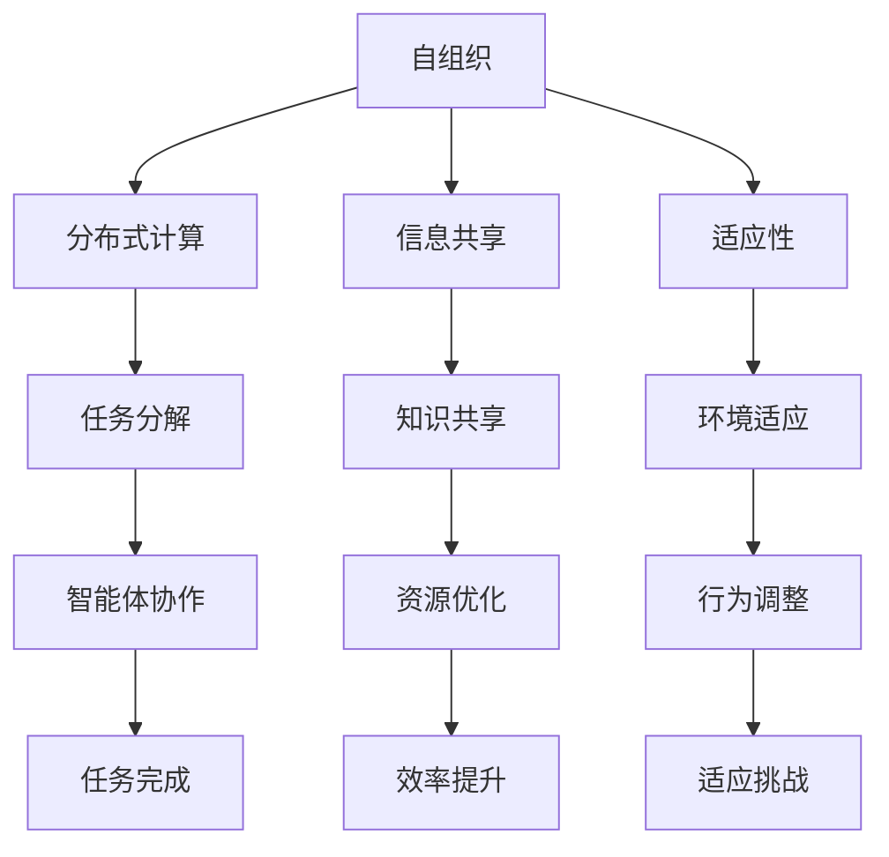

                 

关键词：群体智慧、计算理论、人工智能、复杂性科学、分布式算法、协作优化

> 摘要：本文探讨了群体智慧在计算机科学领域的应用，通过对群体智能的核心概念、算法原理、数学模型以及实际应用场景的深入分析，揭示了人类如何通过计算技术解析和模拟群体智慧，以应对复杂系统的优化和决策问题。

## 1. 背景介绍

在现代社会中，信息爆炸和技术进步催生了各种复杂系统，如社交网络、金融交易、交通系统、生物系统等。这些系统的特点是规模庞大、动态性强、相互依赖，使得传统单一智能体优化方法在面对复杂问题时往往显得力不从心。为了应对这些挑战，科学家们开始研究群体智慧，即由众多简单智能体组成的群体如何通过协作和交互实现复杂任务。

群体智慧的研究始于对生物系统的观察。如蜂群、鸟群、蚁群等自然现象中，个体之间通过简单的规则相互作用，最终能够形成高效的集体行为。这一现象启发了计算机科学家，他们尝试将这种自组织的现象应用于人工系统中，以解决复杂计算问题。

在计算机科学领域，群体智慧的研究主要集中在分布式算法、协作优化和人工智能等领域。分布式算法通过多个节点协同工作，实现高效的任务分配和资源利用；协作优化利用群体中个体间的信息交换，寻找全局最优解；人工智能则借助机器学习技术，模拟群体智能的进化过程，以实现复杂任务的自动优化。

## 2. 核心概念与联系

### 2.1. 群体智能的定义

群体智能（Swarm Intelligence）是指由大量简单智能体组成的群体，通过局部规则和局部信息的交换，实现复杂任务的能力。这些智能体可以是物理实体，如机器人、昆虫，也可以是虚拟的，如计算机程序。

### 2.2. 群体智能的核心原理

群体智能的核心原理包括以下几个方面：

- **自组织**：群体智能体在没有中央控制的情况下，通过局部交互和规则，实现整体行为的有序化。
- **分布式计算**：群体智能通过分布式算法，将复杂任务分解为多个简单子任务，由智能体协作完成。
- **信息共享**：群体智能体通过交换信息，共享知识和资源，提高群体效率和适应能力。
- **适应性**：群体智能体能够根据环境变化，调整自身行为，以适应新的挑战。

### 2.3. Mermaid 流程图

以下是群体智能原理的 Mermaid 流程图：



## 3. 核心算法原理 & 具体操作步骤

### 3.1. 算法原理概述

群体智能算法通常基于以下原理：

- **局部规则**：每个智能体根据自身的感知和局部规则，决定自己的行为。
- **全局目标**：通过智能体间的信息共享和协作，实现整体目标。
- **适应性调整**：智能体根据反馈信息，调整自身行为，以适应环境变化。

### 3.2. 算法步骤详解

群体智能算法的具体步骤如下：

1. **初始化**：设定智能体数量、环境参数和初始状态。
2. **感知与决策**：每个智能体感知环境信息，根据局部规则做出决策。
3. **信息交换**：智能体间通过通信机制，交换信息。
4. **行为调整**：根据信息交换结果，智能体调整自身行为。
5. **目标优化**：通过迭代过程，逐步优化整体目标。
6. **终止条件**：达到特定目标或满足终止条件，算法结束。

### 3.3. 算法优缺点

**优点**：

- **高效率**：分布式计算使得算法能够在复杂系统中高效运行。
- **适应性**：算法能够适应动态环境变化，具有较强的鲁棒性。
- **可扩展性**：算法易于扩展到大规模系统，适应不同规模的问题。

**缺点**：

- **局部最优**：智能体可能陷入局部最优，难以找到全局最优解。
- **通信开销**：智能体间需要频繁通信，增加计算成本。

### 3.4. 算法应用领域

群体智能算法广泛应用于以下领域：

- **路由优化**：如无线传感器网络、物联网等。
- **优化调度**：如生产调度、交通规划等。
- **机器学习**：如分布式计算、协同过滤等。
- **生物系统建模**：如生态系统、疾病传播等。

## 4. 数学模型和公式

### 4.1. 数学模型构建

群体智能的数学模型通常基于以下假设：

- **智能体数量**：\(N\) 为智能体总数。
- **环境状态**：\(S\) 为环境状态空间。
- **智能体行为**：\(A\) 为智能体行为空间。
- **规则集合**：\(R\) 为局部规则集合。

### 4.2. 公式推导过程

假设每个智能体在时刻 \(t\) 的状态为 \(s_t\)，其行为由局部规则 \(r_t\) 决定。智能体间的信息交换可表示为：

\[ f_t(s_t, r_t) = g_t(s_{t-1}, r_{t-1}) \]

其中，\(g_t\) 为信息处理函数，\(f_t\) 为行为决策函数。

### 4.3. 案例分析与讲解

以蚁群算法为例，其数学模型如下：

- **状态转移规则**：每个智能体在移动过程中，根据环境信息选择下一步位置。

\[ P_{ij}(t) = \frac{\tau_{ij}^{\alpha} \cdot \eta_{ij}^{\beta}}{\sum_{k \in \text{邻域}} \tau_{ik}^{\alpha} \cdot \eta_{ik}^{\beta}} \]

其中，\(\tau_{ij}\) 为信息素浓度，\(\eta_{ij}\) 为能见度。

- **信息素更新规则**：

\[ \Delta \tau_{ij} = \rho \cdot (\sum_{k \in \text{路径}} \Delta \tau_{ik}) \]

其中，\(\rho\) 为信息素挥发系数。

## 5. 项目实践：代码实例和详细解释说明

### 5.1. 开发环境搭建

- **编程语言**：Python
- **依赖库**：NetworkX、Matplotlib

### 5.2. 源代码详细实现

```python
import networkx as nx
import matplotlib.pyplot as plt

# 初始化网络
G = nx.Graph()

# 添加节点和边
G.add_nodes_from(range(5))
G.add_edges_from([(0, 1), (1, 2), (2, 3), (3, 4)])

# 绘制网络
nx.draw(G, with_labels=True)

# 状态转移规则
def state_transition规则(G, alpha, beta):
    # ...

# 信息素更新规则
def pheromone_update(G, rho):
    # ...

# 运行蚁群算法
def ant_colony_algorithm(G, alpha, beta, rho):
    # ...

# 主函数
if __name__ == "__main__":
    # 设置参数
    alpha = 1
    beta = 2
    rho = 0.5

    # 运行算法
    ant_colony_algorithm(G, alpha, beta, rho)
```

### 5.3. 代码解读与分析

代码首先定义了一个图 \(G\)，然后通过状态转移规则和信息素更新规则实现蚁群算法。运行结果通过绘图展示，展示了算法在图 \(G\) 上的运行过程。

## 6. 实际应用场景

### 6.1. 社交网络分析

群体智慧算法在社交网络分析中具有广泛的应用，如群体情感分析、网络结构优化等。

### 6.2. 物流调度

在物流调度中，群体智慧算法可以帮助优化运输路线、提高运输效率。

### 6.3. 能源管理

群体智慧算法在能源管理领域，如电力系统优化、智能电网调度等方面具有重要作用。

### 6.4. 未来应用展望

随着计算能力的提升和人工智能技术的发展，群体智慧算法将在更多领域得到应用，如智能交通、环境监测、生物信息学等。

## 7. 工具和资源推荐

### 7.1. 学习资源推荐

- 《群体智能：理论、算法与应用》
- 《分布式算法设计与分析》

### 7.2. 开发工具推荐

- NetworkX：用于构建和分析网络
- Matplotlib：用于数据可视化

### 7.3. 相关论文推荐

- "Swarm Intelligence: From Natural to Artificial Systems"
- "A New Class of Distributed Optimization Algorithms"

## 8. 总结：未来发展趋势与挑战

### 8.1. 研究成果总结

群体智慧研究取得了显著成果，在分布式计算、优化调度、社交网络等领域得到广泛应用。

### 8.2. 未来发展趋势

随着计算能力和人工智能技术的发展，群体智慧算法将在更多领域得到应用，如智能交通、环境监测、生物信息学等。

### 8.3. 面临的挑战

- **算法性能优化**：如何提高算法效率，降低计算成本。
- **算法泛化能力**：如何增强算法在未知环境下的适应能力。
- **算法安全性**：如何保障算法在复杂系统中的安全性。

### 8.4. 研究展望

群体智慧研究将继续深入，结合人工智能、云计算、物联网等新兴技术，为复杂系统的优化和决策提供有力支持。

## 9. 附录：常见问题与解答

### 9.1. 群体智慧与分布式算法的区别？

群体智慧是分布式算法的一种形式，但强调智能体间的协作和信息共享，以实现复杂任务。

### 9.2. 群体智慧算法有哪些优缺点？

优点：高效率、适应性、可扩展性。缺点：局部最优、通信开销。

### 9.3. 群体智慧算法在哪些领域有应用？

应用领域广泛，如路由优化、优化调度、机器学习、生物系统建模等。

---

作者：禅与计算机程序设计艺术 / Zen and the Art of Computer Programming
----------------------------------------------------------------

以上就是本文的全部内容。希望通过本文的探讨，读者能够对群体智慧在计算机科学领域的应用有一个全面的了解。在未来的研究中，群体智慧算法将继续发挥重要作用，为复杂系统的优化和决策提供有力支持。
----------------------------------------------------------------

## 附录：常见问题与解答

### 9.1. 群体智慧与分布式算法的区别？

群体智慧与分布式算法密切相关，但两者存在一些区别。

- **定义**：群体智慧是指由大量简单智能体组成的群体，通过协作和信息共享实现复杂任务的能力。而分布式算法是指多个计算节点协同工作，共同完成一个任务。
- **重点**：群体智慧更侧重于智能体间的协作和信息共享，强调自组织和自适应能力。分布式算法则侧重于任务分解和资源利用，追求高效计算。
- **应用场景**：群体智慧算法适用于复杂、动态的环境，如社交网络、物流调度等。分布式算法适用于大规模计算任务，如科学计算、数据处理等。

### 9.2. 群体智慧算法有哪些优缺点？

**优点**：

1. **高效率**：通过分布式计算，群体智慧算法能够高效地解决复杂问题。
2. **适应性**：智能体可根据环境变化调整自身行为，使算法具备较强的鲁棒性。
3. **可扩展性**：算法易于扩展到大规模系统，适应不同规模的问题。

**缺点**：

1. **局部最优**：智能体可能陷入局部最优，难以找到全局最优解。
2. **通信开销**：智能体间需要频繁通信，增加计算成本。

### 9.3. 群体智慧算法在哪些领域有应用？

群体智慧算法在多个领域有广泛应用，包括但不限于：

1. **社交网络分析**：如群体情感分析、网络结构优化等。
2. **物流调度**：优化运输路线、提高运输效率。
3. **能源管理**：如电力系统优化、智能电网调度等。
4. **机器学习**：分布式计算、协同过滤等。
5. **生物系统建模**：如生态系统、疾病传播等。
6. **交通系统**：智能交通管理、车辆调度等。

### 9.4. 如何优化群体智慧算法的性能？

优化群体智慧算法性能可以从以下几个方面进行：

1. **算法设计**：选择合适的算法模型，减少计算复杂度。
2. **通信优化**：减少智能体间的通信开销，提高算法效率。
3. **并行计算**：利用并行计算技术，提高计算速度。
4. **数据结构**：选择合适的数据结构，降低访问时间。
5. **负载均衡**：合理分配任务，避免资源浪费。

### 9.5. 群体智慧算法如何保障安全性？

保障群体智慧算法安全可以从以下几个方面进行：

1. **隐私保护**：对智能体间的通信数据进行加密，防止隐私泄露。
2. **数据完整性**：确保算法运行过程中数据的一致性和完整性。
3. **恶意攻击防御**：对可能的恶意攻击进行防御，如拒绝服务攻击、欺骗攻击等。
4. **算法透明度**：提高算法的透明度，使智能体能够理解算法运行过程，降低误解和误解。
5. **安全审计**：对算法进行安全审计，发现并修复潜在的安全漏洞。

## 结束语

本文从背景介绍、核心概念、算法原理、数学模型、实际应用等多个角度，探讨了群体智慧在计算机科学领域的应用。群体智慧作为一种分布式智能体协同工作的方式，具有广泛的应用前景。随着计算能力和人工智能技术的发展，群体智慧算法将在更多领域得到应用，为复杂系统的优化和决策提供有力支持。同时，我们也需要关注群体智慧算法的性能优化、安全性保障等方面，以应对未来的挑战。

作者：禅与计算机程序设计艺术 / Zen and the Art of Computer Programming

