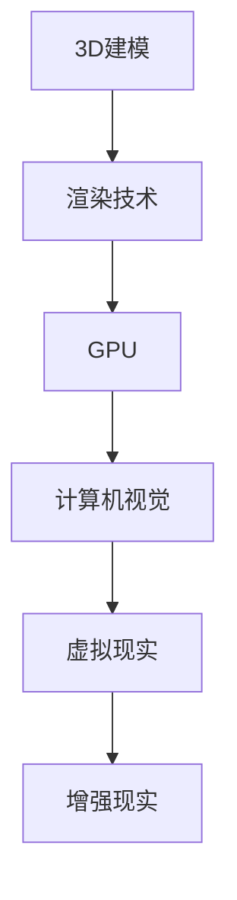

                 

关键词：计算机图形学、3D建模、渲染技术、图形处理、视觉效果、图像渲染算法、图形处理单元、计算机视觉、虚拟现实

摘要：本文深入探讨计算机图形学的关键领域，包括3D建模和渲染技术。我们将从基础概念开始，逐步深入到复杂的图形处理算法，最后讨论实际应用和未来发展趋势。本文旨在为读者提供一个全面的计算机图形学概览，帮助理解和掌握这一重要技术。

## 1. 背景介绍

计算机图形学是计算机科学与艺术之间的桥梁，它涉及到计算机生成、处理和展示图像的技术。随着计算机硬件和软件的发展，计算机图形学已经成为众多行业不可或缺的一部分，包括娱乐、医疗、建筑、教育和科学研究等。

### 1.1 历史背景

计算机图形学的历史可以追溯到20世纪60年代。当时，第一台图形处理器的问世标志着计算机图形学的诞生。随着时间的推移，图形处理技术不断进步，从最初的2D图像处理发展到今天的3D建模和渲染。

### 1.2 应用领域

计算机图形学在多个领域都有广泛的应用。例如，在娱乐行业，计算机图形学被用于电影、电视节目和视频游戏的制作。在医疗领域，3D建模和渲染技术可以帮助医生进行精确的手术规划和诊断。在建筑和设计领域，计算机图形学被用于可视化建筑和产品。

## 2. 核心概念与联系

计算机图形学的核心概念包括3D建模、渲染技术、图形处理单元（GPU）和计算机视觉。以下是这些概念之间的联系及其简要描述：

### 2.1 3D建模

3D建模是创建三维物体的过程，通常使用几何形状、纹理和材质来模拟现实世界的物体。3D建模技术包括多边形建模、曲面建模、粒子系统建模等。

### 2.2 渲染技术

渲染技术是将3D模型转换为2D图像的过程。这涉及到光照、阴影、反射、折射等物理现象的模拟。常见的渲染技术有光线追踪、路径追踪、直接渲染等。

### 2.3 图形处理单元（GPU）

GPU是专门用于图形处理的硬件组件，相较于CPU，GPU拥有更多的计算单元，适合进行并行计算。GPU在计算机图形学中起着至关重要的作用，能够快速渲染复杂的3D场景。

### 2.4 计算机视觉

计算机视觉是使计算机能够“看到”和理解图像的技术。计算机视觉与计算机图形学密切相关，两者共同推动了虚拟现实和增强现实技术的发展。

### 2.5 Mermaid 流程图

下面是一个简单的 Mermaid 流程图，展示了上述核心概念之间的联系：



## 3. 核心算法原理 & 具体操作步骤

### 3.1 算法原理概述

计算机图形学的核心算法主要涉及几何变换、光照计算、阴影生成和纹理映射。这些算法共同作用，将3D模型转换为逼真的2D图像。

### 3.2 算法步骤详解

#### 3.2.1 几何变换

几何变换是指将3D模型在空间中进行旋转、缩放和平移等操作。这些变换通常使用矩阵运算实现。

$$
\text{变换矩阵} = \begin{bmatrix}
a & b & t_x \\
c & d & t_y \\
0 & 0 & 1
\end{bmatrix}
$$

其中，\(a, b, c, d, t_x, t_y\) 分别表示旋转、缩放和平移的参数。

#### 3.2.2 光照计算

光照计算是模拟光线在物体表面产生的效果，包括光照强度、颜色和阴影。常用的光照模型有朗伯模型、菲涅尔模型和BLINN-Phong模型。

#### 3.2.3 阴影生成

阴影生成是模拟光线在物体之间的遮挡效果。常见的阴影生成技术有投影阴影、光线投射阴影和软阴影。

#### 3.2.4 纹理映射

纹理映射是将2D纹理图像映射到3D模型表面，以增加物体的细节和质感。常用的纹理映射技术有平面映射、立方体映射和球形映射。

### 3.3 算法优缺点

每种算法都有其优缺点。例如，光线追踪渲染算法能够生成非常逼真的图像，但计算成本较高。而直接渲染算法计算成本较低，但图像质量相对较差。

### 3.4 算法应用领域

核心算法在多个领域都有应用，如电影制作、游戏开发、虚拟现实和增强现实等。

## 4. 数学模型和公式 & 详细讲解 & 举例说明

### 4.1 数学模型构建

计算机图形学的数学模型主要包括几何模型、光照模型和纹理模型。以下是这些模型的基本公式：

#### 4.1.1 几何模型

$$
\text{顶点坐标} = \begin{bmatrix}
x \\
y \\
z
\end{bmatrix}
$$

#### 4.1.2 光照模型

$$
\text{光照强度} = \text{环境光} + \text{漫反射光} + \text{镜面光}
$$

其中，环境光、漫反射光和镜面光分别由以下公式计算：

$$
\text{环境光} = k_a \cdot \text{环境光色}
$$

$$
\text{漫反射光} = k_d \cdot \text{漫反射系数} \cdot \text{光照强度} \cdot \cos(\theta)
$$

$$
\text{镜面光} = k_s \cdot \text{镜面系数} \cdot (\text{光照方向} \cdot \text{反射方向})^5
$$

#### 4.1.3 纹理模型

$$
\text{纹理坐标} = \begin{bmatrix}
u \\
v
\end{bmatrix}
$$

### 4.2 公式推导过程

公式推导过程涉及到微积分和线性代数的知识。这里简要介绍几个关键步骤：

1. **几何变换**：利用矩阵运算将3D模型从局部坐标系转换到世界坐标系。
2. **光照计算**：利用三角函数和向量的点积计算光照强度。
3. **阴影生成**：利用光线投射算法计算阴影。
4. **纹理映射**：利用插值方法计算纹理坐标。

### 4.3 案例分析与讲解

以下是一个简单的案例，演示如何使用上述公式进行3D建模和渲染。

#### 4.3.1 案例描述

假设我们有一个简单的立方体模型，其顶点坐标为：

$$
\text{顶点坐标集} = \{\begin{bmatrix}0\\0\\0\end{bmatrix}, \begin{bmatrix}1\\0\\0\end{bmatrix}, \begin{bmatrix}1\\1\\0\end{bmatrix}, \begin{bmatrix}0\\1\\0\end{bmatrix}, \begin{bmatrix}0\\0\\1\end{bmatrix}, \begin{bmatrix}1\\0\\1\end{bmatrix}, \begin{bmatrix}1\\1\\1\end{bmatrix}, \begin{bmatrix}0\\1\\1\end{bmatrix}\}
$$

#### 4.3.2 案例分析

1. **几何变换**：将立方体绕z轴旋转30度，并将它平移到原点。
2. **光照计算**：设置环境光为白色，漫反射系数为0.8，镜面系数为0.2。
3. **阴影生成**：使用光线投射算法计算阴影。
4. **纹理映射**：使用平面映射将纹理图像映射到立方体表面。

#### 4.3.3 案例结果

经过上述步骤，我们得到了一个具有逼真纹理和阴影的立方体图像。

## 5. 项目实践：代码实例和详细解释说明

### 5.1 开发环境搭建

为了演示3D建模和渲染的代码实例，我们将使用Python语言和OpenGL图形库。首先，确保安装了Python和OpenGL库。在Windows上，可以使用PyInstaller将Python脚本打包成可执行文件。

### 5.2 源代码详细实现

以下是实现3D建模和渲染的Python代码：

```python
import numpy as np
from OpenGL import GL
from OpenGL.GL import *
from OpenGL.GLUT import *

# 初始化OpenGL窗口
def init():
    glutInit()
    glutInitDisplayMode(GLUT_DOUBLE | GLUT_RGB | GLUT_DEPTH)
    glutInitWindowSize(800, 600)
    glutCreateWindow("3D建模与渲染")

# 设置光照
def setup_light():
    light_pos = np.array([1, 1, 1, 0])
    glLightfv(GL_LIGHT0, GL_POSITION, light_pos)
    glEnable(GL_LIGHTING)
    glEnable(GL_LIGHT0)

# 绘制立方体
def draw_cube():
    glBegin(GL_QUADS)
    glColor3f(1, 0, 0)
    glVertex3f(-1, -1, -1)
    glVertex3f(1, -1, -1)
    glVertex3f(1, 1, -1)
    glVertex3f(-1, 1, -1)

    glColor3f(0, 1, 0)
    glVertex3f(-1, -1, 1)
    glVertex3f(1, -1, 1)
    glVertex3f(1, 1, 1)
    glVertex3f(-1, 1, 1)

    glColor3f(0, 0, 1)
    glVertex3f(-1, -1, -1)
    glVertex3f(-1, -1, 1)
    glVertex3f(-1, 1, 1)
    glVertex3f(-1, 1, -1)

    glColor3f(1, 1, 0)
    glVertex3f(1, -1, -1)
    glVertex3f(1, -1, 1)
    glVertex3f(1, 1, 1)
    glVertex3f(1, 1, -1)

    glColor3f(1, 0.5, 0)
    glVertex3f(-1, -1, -1)
    glVertex3f(1, -1, -1)
    glVertex3f(1, -1, 1)
    glVertex3f(-1, -1, 1)

    glColor3f(0.5, 1, 0.5)
    glVertex3f(-1, 1, -1)
    glVertex3f(1, 1, -1)
    glVertex3f(1, 1, 1)
    glVertex3f(-1, 1, 1)
    glEnd()

# 渲染循环
def display():
    glClearColor(0, 0, 0, 1)
    glClear(GL_COLOR_BUFFER_BIT | GL_DEPTH_BUFFER_BIT)
    setup_light()
    glMatrixMode(GL_PROJECTION)
    glLoadIdentity()
    gluPerspective(45, 1, 0.1, 100)
    glMatrixMode(GL_MODELVIEW)
    glLoadIdentity()
    glTranslatef(0, 0, -5)
    draw_cube()
    glutSwapBuffers()

# 主程序
def main():
    init()
    glEnable(GL_DEPTH_TEST)
    glutDisplayFunc(display)
    glutMainLoop()

if __name__ == "__main__":
    main()
```

### 5.3 代码解读与分析

上述代码实现了立方体的3D建模和渲染。以下是关键部分的解释：

- **初始化OpenGL窗口**：设置OpenGL窗口的基本参数，如大小、模式和标题。
- **设置光照**：定义光照的位置和强度，并启用光照效果。
- **绘制立方体**：使用OpenGL的GL_QUADS绘制立方体的六个面。
- **渲染循环**：清除屏幕，设置透视投影，绘制立方体，并交换缓冲区。

### 5.4 运行结果展示

运行上述代码后，我们将看到一个具有光照和阴影的立方体在OpenGL窗口中显示。

## 6. 实际应用场景

计算机图形学在许多实际应用场景中发挥着重要作用。以下是一些典型应用：

### 6.1 娱乐行业

在电影和电视制作中，计算机图形学被用于创建逼真的视觉效果和动画。例如，电影《阿凡达》和《星球大战：原力觉醒》都大量使用了计算机图形学技术。

### 6.2 医疗领域

在医疗领域，计算机图形学被用于手术规划和诊断。通过3D建模和渲染，医生可以更直观地了解患者的病情，从而制定更精确的治疗方案。

### 6.3 建筑设计

在建筑设计中，计算机图形学被用于可视化建筑和产品。设计师可以使用3D建模和渲染技术来展示建筑的外观和内部结构，从而更好地与客户沟通。

### 6.4 教育领域

在教育领域，计算机图形学被用于制作互动教学课件和虚拟实验室。学生可以通过虚拟现实技术体验复杂的科学概念和实验过程。

### 6.5 虚拟现实和增强现实

虚拟现实（VR）和增强现实（AR）是计算机图形学的最新应用领域。通过3D建模和渲染技术，用户可以沉浸在虚拟环境中，或者将虚拟物体叠加到现实世界中。

## 7. 工具和资源推荐

### 7.1 学习资源推荐

- 《计算机图形学原理及实践》
- 《OpenGL编程指南》
- 《Unity 2020从入门到实战》
- 《Vulkan编程指南》

### 7.2 开发工具推荐

- Blender：开源3D建模和渲染软件。
- Unity：跨平台游戏开发引擎。
- Unreal Engine：高端游戏开发引擎。
- NVIDIA CUDA：用于GPU加速的计算框架。

### 7.3 相关论文推荐

- 《实时渲染中的光线追踪技术》
- 《基于深度学习的3D建模方法》
- 《虚拟现实与增强现实的发展趋势》
- 《计算机图形学中的GPU编程技术》

## 8. 总结：未来发展趋势与挑战

### 8.1 研究成果总结

近年来，计算机图形学取得了显著的研究成果。3D建模和渲染技术的不断进步，使得逼真的虚拟现实和增强现实应用成为可能。此外，深度学习和人工智能技术的引入，也为计算机图形学带来了新的发展机遇。

### 8.2 未来发展趋势

未来，计算机图形学将继续朝着更高真实感、更高效、更智能的方向发展。例如，基于深度学习的3D建模和渲染技术有望大幅提升生成图像的质量。此外，虚拟现实和增强现实技术的普及，将进一步推动计算机图形学在各个行业中的应用。

### 8.3 面临的挑战

尽管计算机图形学取得了显著进展，但仍面临一些挑战。首先，计算资源的需求不断增长，对GPU和计算能力提出了更高的要求。其次，3D建模和渲染算法的优化仍然是一个重要的研究方向。最后，如何更好地利用人工智能技术，提高计算机图形学的效率和准确性，也是一个亟待解决的问题。

### 8.4 研究展望

未来，计算机图形学将在多个领域发挥更加重要的作用。随着技术的不断进步，我们有望看到更加逼真、高效和智能的计算机图形应用。同时，计算机图形学与人工智能、虚拟现实和增强现实等领域的融合，将为科技创新带来新的机遇。

## 9. 附录：常见问题与解答

### 9.1 什么是3D建模？

3D建模是创建三维物体的过程，通常使用几何形状、纹理和材质来模拟现实世界的物体。

### 9.2 渲染技术有哪些？

常见的渲染技术包括光线追踪、路径追踪、直接渲染、间接渲染等。

### 9.3 什么是GPU？

GPU是专门用于图形处理的硬件组件，相较于CPU，GPU拥有更多的计算单元，适合进行并行计算。

### 9.4 计算机图形学有哪些应用？

计算机图形学在娱乐、医疗、建筑、教育和科学研究等领域都有广泛的应用。

### 9.5 如何学习计算机图形学？

可以通过阅读相关书籍、参加在线课程、实践项目和加入专业社群来学习计算机图形学。

**作者：禅与计算机程序设计艺术 / Zen and the Art of Computer Programming**----------------------------------------------------------------

**结束语：**

本文深入探讨了计算机图形学的关键领域，包括3D建模和渲染技术。通过详细的讲解和实例分析，读者可以更好地理解这一复杂而又重要的技术。随着虚拟现实和增强现实技术的不断发展，计算机图形学将在未来继续发挥重要作用。希望本文能够为读者在计算机图形学领域的探索提供有益的启示。如果您有任何疑问或建议，欢迎在评论区留言交流。

