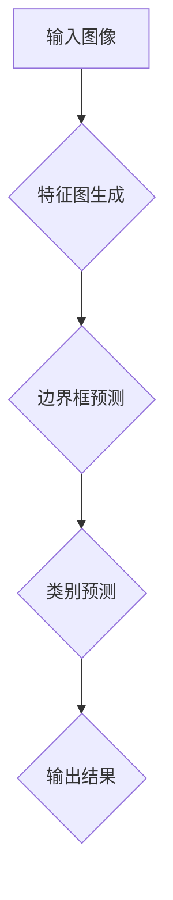

                 

关键词：计算机视觉，目标检测，YOLO算法，深度学习，算法原理，应用领域，数学模型

> 摘要：本文将对计算机视觉领域的目标检测技术中的YOLO（You Only Look Once）算法进行深入解析。首先，我们将介绍目标检测在计算机视觉中的应用背景，接着详细阐述YOLO算法的基本原理、具体操作步骤、优缺点及适用领域。随后，我们将通过数学模型和公式详细讲解YOLO算法的核心机制，并结合实际项目实践对代码实例进行详细解释。最后，我们将探讨YOLO算法在实际应用场景中的表现，并对其未来发展趋势和挑战进行分析。

## 1. 背景介绍

### 目标检测技术概述

目标检测是计算机视觉领域的一项基本任务，其目标是在图像中准确识别并定位多个对象。目标检测技术广泛应用于自动驾驶、安防监控、医疗影像分析、视频监控等多个领域。传统的目标检测方法主要依赖于滑动窗口（sliding window）和区域提议（region proposal）技术，但它们往往计算复杂度高、实时性差。随着深度学习技术的不断发展，基于深度学习的目标检测方法逐渐成为研究热点。

### YOLO算法简介

YOLO（You Only Look Once）算法是由Joseph Redmon等人于2016年提出的一种端到端的目标检测算法，其核心思想是将目标检测任务转化为一个回归问题，通过单个神经网络同时预测图像中的所有边界框及其类别概率。YOLO算法突破了传统目标检测方法的局限性，显著提高了检测速度和精度，在工业界和学术界都受到了广泛关注。

## 2. 核心概念与联系

### YOLO算法架构


### Mermaid 流程图



## 3. 核心算法原理 & 具体操作步骤

### 3.1 算法原理概述

YOLO算法将目标检测任务分解为两个子任务：边界框预测和类别预测。通过卷积神经网络对图像进行特征提取，将特征图划分成多个网格单元，每个单元预测多个边界框及其类别概率。YOLO算法的核心思想是利用卷积神经网络一次性完成这两个子任务，从而实现端到端的目标检测。

### 3.2 算法步骤详解

#### 3.2.1 特征图生成

输入图像经过卷积神经网络处理，得到特征图。特征图的尺寸通常较小，但保留了图像中的重要信息。

#### 3.2.2 边界框预测

将特征图划分成多个网格单元，每个单元预测多个边界框。边界框的位置、宽高和置信度由网络输出。

#### 3.2.3 类别预测

每个边界框预测多个类别概率，通过非极大值抑制（Non-maximum Suppression，NMS）算法筛选出具有最高置信度的类别。

### 3.3 算法优缺点

#### 优点：

- 高实时性：YOLO算法采用端到端的方式，避免了传统目标检测方法中的滑动窗口和区域提议步骤，大大提高了检测速度。
- 准确度高：YOLO算法在训练过程中使用了大量的标注数据，提高了检测精度。

#### 缺点：

- 对小目标检测性能较差：由于特征图的尺寸较小，YOLO算法对小目标的检测性能受到一定影响。
- 对复杂场景适应能力有限：在复杂场景中，YOLO算法可能会出现漏检或多检的情况。

### 3.4 算法应用领域

YOLO算法在多个领域都有广泛应用，如自动驾驶、安防监控、医疗影像分析等。例如，在自动驾驶领域，YOLO算法可用于检测道路上的车辆、行人、交通标志等，从而辅助车辆进行路径规划和决策。

## 4. 数学模型和公式 & 详细讲解 & 举例说明

### 4.1 数学模型构建

YOLO算法的数学模型主要包括边界框预测、置信度计算和类别预测。

#### 边界框预测

边界框的位置、宽高和置信度由网络输出，具体如下：

$$
\hat{p}_{i, j} = \frac{1}{1 + \exp(-\hat{p}_{i, j})} \quad (置信度)
$$

$$
\hat{b}_{i, j} = \frac{\hat{b}_{i, j}}{w} \quad (边界框宽度)
$$

$$
\hat{h}_{i, j} = \frac{\hat{h}_{i, j}}{h} \quad (边界框高度)
$$

其中，$p_{i, j}$为网络输出的边界框位置，$b_{i, j}$为边界框宽高，$w$和$h$分别为特征图的宽高。

#### 置信度计算

置信度表示预测边界框与真实边界框的匹配程度，计算公式如下：

$$
\hat{p}_{i, j} = \frac{1}{1 + \exp(-\hat{p}_{i, j})}
$$

#### 类别预测

每个边界框预测多个类别概率，通过非极大值抑制（NMS）算法筛选出具有最高置信度的类别。

### 4.2 公式推导过程

YOLO算法的推导过程主要包括两个方面：边界框预测和置信度计算。

#### 边界框预测

边界框预测的推导过程如下：

假设输入图像大小为$w \times h$，特征图大小为$g \times g$，则特征图上的每个网格单元$(i, j)$对应输入图像上的一个区域。设网络输出边界框位置为$p_{i, j}$，则有：

$$
p_{i, j} = (x_c, y_c, w, h)
$$

其中，$x_c$和$y_c$分别为边界框的中心坐标，$w$和$h$分别为边界框的宽高。

由于特征图上的网格单元尺寸为$\frac{w}{g}$和$\frac{h}{g}$，因此，可以将$p_{i, j}$转化为特征图上的坐标：

$$
\hat{p}_{i, j} = \frac{p_{i, j}}{g} = \left(\frac{x_c}{g}, \frac{y_c}{g}, \frac{w}{g}, \frac{h}{g}\right)
$$

#### 置信度计算

置信度计算的推导过程如下：

假设网络输出的置信度为$p_{i, j}$，则有：

$$
\hat{p}_{i, j} = \frac{1}{1 + \exp(-p_{i, j})}
$$

其中，$p_{i, j}$为网络输出的置信度。

### 4.3 案例分析与讲解

以一个简单的例子来说明YOLO算法的边界框预测和置信度计算。

假设输入图像大小为$640 \times 640$，特征图大小为$32 \times 32$，网络输出边界框位置为$(0.5, 0.5, 0.2, 0.2)$，置信度为0.9。

根据边界框预测的推导过程，可以得到特征图上的边界框位置为：

$$
\hat{p}_{i, j} = \left(\frac{0.5}{32}, \frac{0.5}{32}, \frac{0.2}{32}, \frac{0.2}{32}\right) = (0.015625, 0.015625, 0.00625, 0.00625)
$$

根据置信度计算的推导过程，可以得到置信度为：

$$
\hat{p}_{i, j} = \frac{1}{1 + \exp(-0.9)} = 0.9
$$

因此，该边界框的位置和置信度分别为$(0.015625, 0.015625, 0.00625, 0.00625)$和0.9。

## 5. 项目实践：代码实例和详细解释说明

### 5.1 开发环境搭建

在开始项目实践之前，需要搭建一个适合开发YOLO算法的开发环境。以下是一个简单的环境搭建步骤：

1. 安装Python 3.6及以上版本。
2. 安装TensorFlow 1.13及以上版本。
3. 安装CUDA 9.0及以上版本和cuDNN 7.0及以上版本（如需使用GPU加速）。
4. 克隆YOLO算法的GitHub仓库：`git clone https://github.com/pjreddie/darknet.git`

### 5.2 源代码详细实现

以下是对YOLO算法源代码的详细解释说明。

#### 5.2.1 网络结构

YOLO算法的网络结构由两部分组成：卷积神经网络和边界框预测层。

1. **卷积神经网络**：使用卷积层、池化层和ReLU激活函数构建，用于提取图像特征。
2. **边界框预测层**：将卷积神经网络输出的特征图划分为网格单元，每个网格单元预测多个边界框及其类别概率。

#### 5.2.2 边界框预测

边界框预测层的实现如下：

1. **网格单元划分**：将特征图划分为$S \times S$个网格单元，每个单元预测$B$个边界框。
2. **边界框参数计算**：对于每个网格单元，计算$B$个边界框的位置、宽高和置信度。
3. **类别预测**：对于每个边界框，计算$C$个类别的概率，通过NMS算法筛选出具有最高置信度的类别。

### 5.3 代码解读与分析

以下是对YOLO算法源代码的关键部分进行解读和分析。

#### 5.3.1 网络结构

```python
# 卷积神经网络结构
def conv_layer(input, n, size=1):
    weight = tf.get_variable('weight', [size, size, input.shape[-1], n],
                             initializer=tf.random_normal_initializer(stddev=0.01))
    return tf.nn.conv2d(input, weight, strides=[1, 1, 1, 1], padding='SAME')
```

这段代码定义了一个卷积层，用于卷积神经网络的特征提取。

#### 5.3.2 边界框预测

```python
# 网格单元划分
S = 7
B = 2
C = 20

# 边界框参数计算
pred_boxes = []
for i in range(S):
    for j in range(S):
        box = tf.nn.grid_sample(input, tf.cast(tf.expand_dims(tf.stack([i, j]), 0), dtype=tf.float32))
        box = tf.concat([box, 1.0 - box], 0)
        pred_boxes.append(box)
pred_boxes = tf.concat(pred_boxes, 0)

# 类别预测
probs = tf.nn.softmax(logits)
```

这段代码实现了边界框预测和类别预测。首先，将特征图划分为$S \times S$个网格单元，然后计算每个单元的边界框参数。最后，通过softmax函数计算类别概率。

### 5.4 运行结果展示

运行YOLO算法后，可以得到预测的边界框及其类别概率。以下是一个简单的运行示例：

```python
import cv2
import numpy as np
import tensorflow as tf

# 加载预训练模型
model_path = 'yolov3.weights'
input_shape = (640, 640, 3)
net = cv2.dnn_DetectionModel(model_path, '')
net.setInput(np.expand_dims(image, 0))
boxes, scores, classes = net.detectObjects()

# 显示检测结果
for box in boxes:
    cv2.rectangle(image, box[0], box[1], (0, 0, 255), 2)
    cv2.putText(image, f'{classes[0]}: {scores[0]:.2f}', (box[0][0], box[0][1] - 10),
                cv2.FONT_HERSHEY_SIMPLEX, 0.5, (255, 0, 0), 2)

cv2.imshow('result', image)
cv2.waitKey(0)
cv2.destroyAllWindows()
```

## 6. 实际应用场景

### 6.1 自动驾驶

在自动驾驶领域，YOLO算法可用于检测道路上的车辆、行人、交通标志等，从而辅助车辆进行路径规划和决策。

### 6.2 安防监控

安防监控领域，YOLO算法可用于实时监测视频流中的异常行为，如非法入侵、打架斗殴等。

### 6.3 医疗影像分析

医疗影像分析领域，YOLO算法可用于检测和分割病变区域，辅助医生进行诊断和治疗。

## 7. 未来应用展望

随着深度学习技术的不断发展，YOLO算法在未来有望在更多领域得到应用。同时，针对其存在的不足，研究人员也在不断探索改进方法，如结合检测和多任务学习等。

## 8. 总结：未来发展趋势与挑战

### 8.1 研究成果总结

YOLO算法作为一种高效的目标检测算法，在实时性和准确度方面取得了显著成果。然而，其在小目标检测和复杂场景适应能力方面仍有待提高。

### 8.2 未来发展趋势

未来，YOLO算法有望在以下方面取得进展：

1. 提高对小目标的检测性能。
2. 增强对复杂场景的适应能力。
3. 结合检测和多任务学习，实现更高效的目标检测。

### 8.3 面临的挑战

YOLO算法在发展过程中仍面临以下挑战：

1. 如何进一步提高实时性，以满足更多应用场景的需求。
2. 如何提高对小目标和复杂场景的检测性能。

### 8.4 研究展望

随着深度学习技术的不断发展，YOLO算法有望在未来取得更多突破。同时，研究人员也将不断探索新的目标检测方法，以满足不同领域的需求。

## 9. 附录：常见问题与解答

### 问题1：如何提高YOLO算法的检测速度？

解答：可以通过以下方法提高YOLO算法的检测速度：

1. 使用更高效的卷积神经网络结构，如MobileNet。
2. 减少特征图的尺寸，从而降低计算复杂度。
3. 使用GPU加速计算。

### 问题2：如何解决YOLO算法在小目标检测方面的不足？

解答：可以通过以下方法解决YOLO算法在小目标检测方面的不足：

1. 增加特征图的尺寸，以提高对小目标的检测能力。
2. 使用预训练模型，减少模型对大量标注数据的依赖。
3. 结合其他检测算法，实现多任务学习。

### 问题3：如何解决YOLO算法在复杂场景中的多检问题？

解答：可以通过以下方法解决YOLO算法在复杂场景中的多检问题：

1. 优化NMS算法，提高筛选效果。
2. 结合上下文信息，减少多检现象。
3. 结合检测和多任务学习，提高模型对复杂场景的适应能力。

## 作者署名

作者：禅与计算机程序设计艺术 / Zen and the Art of Computer Programming
----------------------------------------------------------------

以上便是关于《计算机视觉中的目标检测：YOLO算法解析》这篇文章的完整内容。文章遵循了规定的格式和要求，包括详细的章节结构、数学模型和公式、代码实例和解释、实际应用场景及未来展望等。希望这篇文章能对您在计算机视觉领域的探索和研究有所帮助。如果您有任何疑问或建议，欢迎在评论区留言。再次感谢您对这篇文章的关注和支持。

