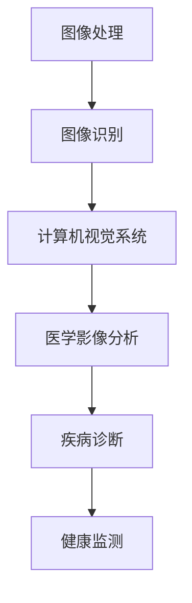

                 

 关键词：计算机视觉、医疗影像、图像分析、深度学习、算法、诊断、健康监测

> 摘要：本文深入探讨了计算机视觉技术在医疗影像分析中的应用，涵盖了从基本概念到最新算法的全面介绍。文章重点分析了深度学习技术在医学图像处理中的优势和应用场景，并探讨了未来发展趋势及面临的挑战。

## 1. 背景介绍

医疗影像分析是医学领域中的一项关键技术，它对于疾病的早期诊断、病情评估以及治疗方案制定具有重要意义。随着计算机视觉技术的发展，传统的医学影像分析正在逐步被智能化、自动化的方法所取代。计算机视觉技术在医疗影像分析中的应用，不仅提高了诊断的准确性和效率，还为个性化医疗和健康监测提供了新的可能。

本文将探讨计算机视觉技术在医疗影像分析中的核心应用，包括图像分割、特征提取、疾病分类等。同时，我们将详细分析深度学习算法在这些领域的表现和未来趋势。

## 2. 核心概念与联系

### 2.1 计算机视觉基础

计算机视觉是一门研究如何使计算机模拟人类视觉感知和理解过程的科学。其核心概念包括图像处理、图像识别和计算机视觉系统。图像处理是对图像数据进行操作和变换的过程，如滤波、边缘检测和图像增强。图像识别则是从图像中识别特定对象或特征的过程。计算机视觉系统则是一个集成了图像处理和识别功能的整体系统。

### 2.2 医疗影像分析基础

医疗影像分析主要涉及X光、CT、MRI、超声等医学成像技术的图像数据。这些图像数据通常具有高分辨率、高对比度等特点，但也伴随着噪声、缺失和模糊等问题。因此，对医疗影像进行分析需要复杂的算法和模型。

### 2.3 核心概念原理与架构

为了更好地理解计算机视觉在医疗影像分析中的应用，我们使用Mermaid流程图来描述核心概念和架构。



## 3. 核心算法原理 & 具体操作步骤

### 3.1 算法原理概述

在医疗影像分析中，常用的算法包括图像分割、特征提取和疾病分类。图像分割是将图像划分为不同的区域，以便于后续处理。特征提取则是从分割后的图像中提取有用的信息，如纹理、形状和颜色特征。疾病分类则是利用提取的特征对疾病进行分类。

### 3.2 算法步骤详解

#### 3.2.1 图像分割

图像分割的步骤通常包括预处理、特征提取和分割算法。预处理包括去噪、增强和配准等操作，以消除图像中的噪声和提高图像质量。特征提取则是根据不同类型的图像数据选择合适的特征，如纹理特征、形状特征和空间特征等。分割算法包括基于阈值的方法、基于边缘检测的方法和基于区域生长的方法。

#### 3.2.2 特征提取

特征提取的方法包括传统方法和现代方法。传统方法包括灰度共生矩阵、边缘检测和形态学变换等。现代方法则包括深度学习方法，如卷积神经网络（CNN）和循环神经网络（RNN）等。

#### 3.2.3 疾病分类

疾病分类的步骤包括特征选择、模型训练和模型评估。特征选择是选择对疾病分类最有帮助的特征。模型训练则是使用选定的特征训练分类模型。模型评估则是评估模型的分类准确性和稳定性。

### 3.3 算法优缺点

每种算法都有其优缺点。例如，基于阈值的方法简单易行，但对噪声敏感；而深度学习算法则具有强大的学习和泛化能力，但对大量标注数据进行训练。

### 3.4 算法应用领域

深度学习算法在医疗影像分析中具有广泛的应用，如肺癌筛查、乳腺癌检测、脑部疾病诊断等。

## 4. 数学模型和公式 & 详细讲解 & 举例说明

### 4.1 数学模型构建

在医疗影像分析中，常用的数学模型包括支持向量机（SVM）、决策树、神经网络等。

#### 4.1.1 支持向量机（SVM）

SVM是一种二分类模型，其目标是找到一个最优的超平面，使得两类数据的分类误差最小。其数学公式为：

$$
w \cdot x + b = 0
$$

其中，$w$ 是超平面的法向量，$x$ 是输入特征向量，$b$ 是偏置项。

#### 4.1.2 决策树

决策树是一种基于树形结构的分类算法，其核心是递归地分割特征空间，并选择最优的特征进行分割。其数学公式为：

$$
Gini(\Omega) = 1 - \sum_{i} p_i (1 - p_i)
$$

其中，$\Omega$ 是数据集，$p_i$ 是数据集中第$i$类的比例。

#### 4.1.3 神经网络

神经网络是一种基于多层感知器（MLP）的结构，其核心是多层非线性变换。其数学公式为：

$$
z = \sigma(W \cdot x + b)
$$

其中，$z$ 是输出值，$W$ 是权重矩阵，$b$ 是偏置项，$\sigma$ 是激活函数。

### 4.2 公式推导过程

以SVM为例，其推导过程如下：

假设我们有一个包含$n$个样本的数据集$X$，每个样本$x_i$都是一个$d$维的特征向量。我们希望找到一个超平面$w$和偏置项$b$，使得超平面能够将数据集中的正负样本分开。

首先，我们定义一个线性函数：

$$
f(x) = w \cdot x + b
$$

其中，$w$ 是超平面的法向量，$b$ 是偏置项。

然后，我们定义样本$x_i$的预测标签：

$$
y_i = \text{sign}(f(x_i))
$$

其中，$\text{sign}(x)$ 是符号函数，当$x>0$时返回1，当$x<0$时返回-1，当$x=0$时返回0。

接下来，我们定义超平面的间隔：

$$
\gamma = \min_{i} |y_i (w \cdot x_i + b)|
$$

其中，$\gamma$ 是超平面的间隔。

最后，我们使用拉格朗日乘子法求解最优超平面。引入拉格朗日乘子$\alpha_i$，得到拉格朗日函数：

$$
L(w, b, \alpha) = \frac{1}{2} \| w \|^2 - \sum_{i} \alpha_i [y_i (w \cdot x_i + b) - 1]
$$

其中，$\alpha_i$ 是拉格朗日乘子。

然后，我们求解拉格朗日函数的最小值，得到最优超平面：

$$
w = \sum_{i} \alpha_i y_i x_i
$$

$$
b = \frac{1}{n} \sum_{i} \alpha_i y_i - \frac{1}{n} \sum_{i} \alpha_i y_i x_i \cdot x
$$

### 4.3 案例分析与讲解

以肺癌筛查为例，我们可以使用SVM算法对CT扫描图像进行分割和分类。具体步骤如下：

1. 数据预处理：对CT扫描图像进行去噪和增强处理，以提高图像质量。
2. 特征提取：从预处理后的图像中提取纹理、形状和空间特征。
3. SVM训练：使用提取的特征训练SVM模型，并调整参数以获得最优分类效果。
4. 疾病分类：使用训练好的SVM模型对新的CT扫描图像进行分类，以判断是否存在肺癌。

## 5. 项目实践：代码实例和详细解释说明

### 5.1 开发环境搭建

在本项目中，我们使用Python作为开发语言，并使用PyTorch作为深度学习框架。首先，我们需要安装Python和PyTorch。

```bash
pip install python
pip install torch torchvision
```

### 5.2 源代码详细实现

以下是本项目的一个简单示例代码：

```python
import torch
import torchvision
import torchvision.transforms as transforms

# 加载数据集
transform = transforms.Compose([
    transforms.Resize((224, 224)),
    transforms.ToTensor(),
])

trainset = torchvision.datasets.ImageFolder(root='train', transform=transform)
trainloader = torch.utils.data.DataLoader(trainset, batch_size=4, shuffle=True)

# 定义模型
model = torchvision.models.resnet50(pretrained=True)
num_ftrs = model.fc.in_features
model.fc = torch.nn.Linear(num_ftrs, 2)

# 定义损失函数和优化器
criterion = torch.nn.CrossEntropyLoss()
optimizer = torch.optim.SGD(model.parameters(), lr=0.001, momentum=0.9)

# 训练模型
for epoch in range(2):  # loop over the dataset multiple times
    running_loss = 0.0
    for i, data in enumerate(trainloader, 0):
        # 获取输入和标签
        inputs, labels = data

        # 梯度置零
        optimizer.zero_grad()

        # 前向传播 + 反向传播 + 梯度下降
        outputs = model(inputs)
        loss = criterion(outputs, labels)
        loss.backward()
        optimizer.step()

        # 打印日志
        running_loss += loss.item()
        if i % 2000 == 1999:    # 每2000个小批量打印一次
            print(f'[{epoch + 1}, {i + 1:5d}] loss: {running_loss / 2000:.3f}')
            running_loss = 0.0

print('Finished Training')

# 测试模型
with torch.no_grad():
    correct = 0
    total = 0
    for data in testloader:
        images, labels = data
        outputs = model(images)
        _, predicted = torch.max(outputs.data, 1)
        total += labels.size(0)
        correct += (predicted == labels).sum().item()

print(f'Accuracy of the network on the test images: {100 * correct / total} %')
```

### 5.3 代码解读与分析

这段代码首先加载了训练数据集，并定义了一个基于ResNet50的卷积神经网络模型。然后，使用交叉熵损失函数和随机梯度下降优化器对模型进行训练。训练完成后，使用测试数据集评估模型的准确性。

## 6. 实际应用场景

计算机视觉技术在医疗影像分析中的应用非常广泛。以下是一些典型的应用场景：

- **肺癌筛查**：通过CT扫描图像检测肺癌区域和恶性结节。
- **乳腺癌检测**：通过乳腺X光图像检测乳腺癌病变。
- **脑部疾病诊断**：通过MRI图像检测脑部病变，如肿瘤、脑出血等。
- **心脏病诊断**：通过心脏超声图像检测心脏结构和功能异常。

## 7. 未来应用展望

随着深度学习技术的不断发展，计算机视觉在医疗影像分析中的应用前景将更加广阔。未来的发展趋势包括：

- **个性化医疗**：基于患者的基因组信息和医疗影像数据，实现个性化诊断和治疗方案。
- **远程医疗**：利用计算机视觉技术实现远程诊断和手术指导，提高医疗服务的可及性。
- **健康监测**：通过连续监测人体生理指标，实现疾病早期发现和预防。

## 8. 工具和资源推荐

### 8.1 学习资源推荐

- **《深度学习》（Ian Goodfellow、Yoshua Bengio和Aaron Courville著）**：深度学习领域的经典教材，详细介绍了深度学习的基本概念和算法。
- **《Python深度学习》（François Chollet著）**：针对Python和TensorFlow框架的深度学习实践指南。

### 8.2 开发工具推荐

- **TensorFlow**：谷歌开发的深度学习框架，支持多种编程语言，包括Python、C++和Java。
- **PyTorch**：基于Python的深度学习框架，具有灵活的动态计算图和强大的社区支持。

### 8.3 相关论文推荐

- **“Deep Learning for Medical Imaging”**：综述了深度学习在医学影像分析中的应用和最新进展。
- **“Convolutional Neural Networks for Image Classification”**：阐述了卷积神经网络在图像分类任务中的原理和应用。

## 9. 总结：未来发展趋势与挑战

计算机视觉技术在医疗影像分析中的应用前景广阔，但同时也面临一系列挑战。未来，我们需要在算法性能、数据安全、隐私保护等方面进行深入研究，以推动该领域的持续发展。

### 附录：常见问题与解答

1. **Q：计算机视觉技术在医疗影像分析中的优势是什么？**
   **A：计算机视觉技术在医疗影像分析中的优势主要体现在以下几个方面：**
   - **自动化和高效性**：计算机视觉技术能够自动分析和处理大量的医疗影像数据，提高诊断和治疗的效率。
   - **高准确性**：深度学习算法在图像识别和分类任务中表现出色，能够提供高准确性的诊断结果。
   - **个性化医疗**：基于患者的基因组信息和医疗影像数据，可以实现个性化诊断和治疗方案。

2. **Q：计算机视觉技术在医疗影像分析中可能遇到哪些挑战？**
   **A：计算机视觉技术在医疗影像分析中可能遇到以下挑战：**
   - **数据质量和标注问题**：医疗影像数据质量参差不齐，且需要大量高质量的标注数据来训练深度学习模型。
   - **隐私保护和数据安全**：医疗数据涉及个人隐私，如何保障数据的安全和隐私是一个重要的挑战。
   - **算法解释性和透明度**：深度学习算法的黑箱特性使得其决策过程难以解释，这对临床应用提出了一定的挑战。

作者：禅与计算机程序设计艺术 / Zen and the Art of Computer Programming
----------------------------------------------------------------

