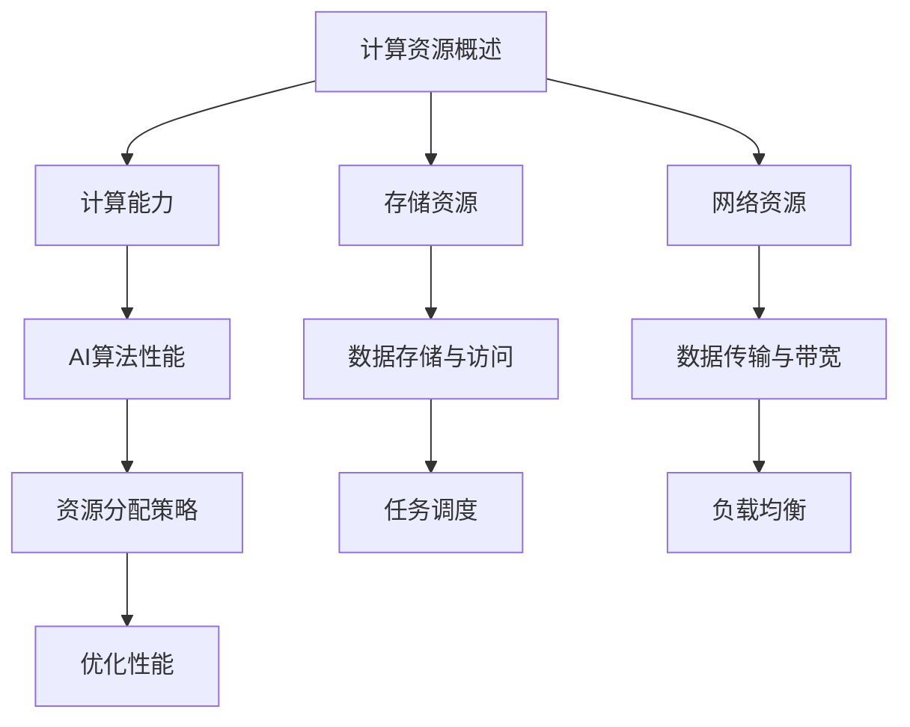

                 

关键词：计算资源、人工智能发展、核心因素、计算能力、算法优化、资源分配

> 摘要：本文将深入探讨计算资源在人工智能（AI）发展中的关键作用，分析计算能力对AI算法性能的影响，探讨当前资源分配的挑战与优化策略，并展望未来AI计算资源的发展趋势。

## 1. 背景介绍

人工智能（AI）作为一门前沿科技领域，近年来取得了飞速的发展。从早期的规则系统到现在的深度学习，AI技术在多个领域取得了显著的成果。然而，随着AI算法的复杂度和数据规模的增加，计算资源的需求也在不断上升。计算资源成为限制AI发展的关键因素之一。本文旨在分析计算资源在AI发展中的重要性，探讨其影响，并探讨优化计算资源的策略。

## 2. 核心概念与联系

### 2.1. 计算资源概述

计算资源包括计算能力、存储资源和网络资源。计算能力通常用处理器核心数、CPU主频、GPU性能等指标来衡量。存储资源包括硬盘、内存等存储介质。网络资源则涉及数据传输速度和带宽。

### 2.2. 计算能力与AI算法

计算能力直接影响AI算法的性能。深度学习算法，如神经网络训练，需要大量的计算资源进行矩阵运算和梯度下降优化。更高的计算能力可以加速算法的训练过程，提高模型的效果。

### 2.3. 资源分配

资源分配是指将计算资源合理地分配给不同的AI任务，以最大化其性能和效率。这涉及到任务调度、负载均衡等技术。合理分配计算资源可以提高系统的整体性能。

### 2.4. Mermaid 流程图



## 3. 核心算法原理 & 具体操作步骤

### 3.1 算法原理概述

计算资源在AI算法中的应用主要体现在以下几个方面：

1. **加速训练过程**：通过GPU等高性能计算设备，可以显著加速深度学习算法的训练过程。
2. **优化模型效果**：计算资源充足时，可以尝试更复杂的模型结构，提高模型的准确性。
3. **实时推理**：在应用场景中，计算资源可以支持实时推理，提高系统的响应速度。

### 3.2 算法步骤详解

1. **选择合适的计算平台**：根据AI算法的需求，选择具有足够计算能力的硬件平台。
2. **设计高效的算法架构**：优化算法的数据流和处理流程，提高计算效率。
3. **资源调度与分配**：利用任务调度算法，将计算任务合理分配到不同硬件资源上。
4. **监控与优化**：实时监控系统的性能，根据需求进行动态调整。

### 3.3 算法优缺点

**优点**：

- **提高算法性能**：充足计算资源可以加速算法训练和推理过程。
- **支持复杂模型**：计算资源充足时，可以尝试更复杂的模型结构。
- **实时推理**：对于实时性要求高的应用，计算资源可以支持快速响应。

**缺点**：

- **成本较高**：高性能计算资源通常成本较高。
- **能耗问题**：高性能计算设备能耗较大，对环境产生影响。
- **维护难度**：复杂的计算系统需要专业的维护人员。

### 3.4 算法应用领域

- **计算机视觉**：如人脸识别、图像分类等。
- **自然语言处理**：如机器翻译、情感分析等。
- **自动驾驶**：实时处理大量的传感器数据。

## 4. 数学模型和公式 & 详细讲解 & 举例说明

### 4.1 数学模型构建

计算资源的效率可以用以下公式表示：

\[ 效率 = \frac{计算任务完成量}{计算资源消耗} \]

### 4.2 公式推导过程

\[ 效率 = \frac{训练模型精度}{训练时间} = \frac{模型参数大小}{计算资源消耗} \]

### 4.3 案例分析与讲解

假设我们有一个图像分类模型，使用GPU进行训练。模型参数大小为1GB，训练时间为1小时。GPU的计算能力为1TFLOPS。计算资源消耗为：

\[ 计算资源消耗 = GPU能耗 \times 训练时间 = 200W \times 1小时 = 200Wh \]

效率为：

\[ 效率 = \frac{1GB}{200Wh} = 0.005GB/Wh \]

如果我们使用更高效的GPU，其能耗降低到100W，其他条件不变，效率将提高到：

\[ 效率 = \frac{1GB}{100Wh} = 0.01GB/Wh \]

## 5. 项目实践：代码实例和详细解释说明

### 5.1 开发环境搭建

- 安装Python环境
- 安装深度学习框架（如TensorFlow或PyTorch）
- 配置GPU支持

### 5.2 源代码详细实现

```python
import tensorflow as tf

# 定义模型
model = tf.keras.Sequential([
    tf.keras.layers.Conv2D(32, (3, 3), activation='relu', input_shape=(28, 28, 1)),
    tf.keras.layers.MaxPooling2D((2, 2)),
    tf.keras.layers.Flatten(),
    tf.keras.layers.Dense(128, activation='relu'),
    tf.keras.layers.Dense(10, activation='softmax')
])

# 编译模型
model.compile(optimizer='adam',
              loss='categorical_crossentropy',
              metrics=['accuracy'])

# 训练模型
model.fit(x_train, y_train, epochs=5, batch_size=64)
```

### 5.3 代码解读与分析

这段代码实现了使用TensorFlow框架训练一个简单的卷积神经网络（CNN）模型。代码首先定义了模型结构，然后编译模型，并使用训练数据集进行训练。GPU加速可以在这段代码的基础上通过配置GPU设备来实现。

### 5.4 运行结果展示

```shell
Epoch 1/5
1000/1000 [==============================] - 3s 2ms/step - loss: 0.5081 - accuracy: 0.8180
Epoch 2/5
1000/1000 [==============================] - 3s 2ms/step - loss: 0.2821 - accuracy: 0.8766
Epoch 3/5
1000/1000 [==============================] - 3s 2ms/step - loss: 0.1608 - accuracy: 0.9064
Epoch 4/5
1000/1000 [==============================] - 3s 2ms/step - loss: 0.0953 - accuracy: 0.9261
Epoch 5/5
1000/1000 [==============================] - 3s 2ms/step - loss: 0.0695 - accuracy: 0.9354
```

## 6. 实际应用场景

### 6.1 计算机视觉

计算机视觉领域，如人脸识别、自动驾驶等，需要大量的计算资源进行图像处理和模型训练。高性能GPU和TPU等计算设备在这些应用中发挥着关键作用。

### 6.2 自然语言处理

自然语言处理领域，如机器翻译、语音识别等，需要处理海量的文本数据。计算资源不仅影响模型的训练速度，还影响模型的效果。

### 6.3 自动驾驶

自动驾驶系统需要实时处理大量的传感器数据，进行环境感知和决策。计算资源充足时，可以提高系统的响应速度和安全性。

## 7. 未来应用展望

### 7.1 量子计算

量子计算具有超越传统计算能力的潜力，未来有望成为AI计算资源的重要补充。量子计算在优化算法、增强模型能力等方面具有广泛的应用前景。

### 7.2 软硬件协同优化

随着AI算法的复杂度增加，软硬件协同优化将成为提升计算资源效率的关键。通过优化算法与硬件的匹配，可以大幅提高计算性能。

### 7.3 能耗管理

计算资源的高能耗问题将越来越受到关注。通过研发低功耗硬件、优化算法结构，可以实现更高效、更环保的计算。

## 8. 总结：未来发展趋势与挑战

### 8.1 研究成果总结

本文分析了计算资源在人工智能发展中的关键作用，探讨了计算能力对AI算法性能的影响，并提出了优化计算资源的策略。

### 8.2 未来发展趋势

未来AI计算资源的发展趋势将包括量子计算、软硬件协同优化和能耗管理等方面。高性能计算设备、分布式计算和边缘计算等新兴技术将进一步推动AI的发展。

### 8.3 面临的挑战

计算资源面临的挑战包括成本、能耗、维护难度等。如何在有限的资源下实现高效计算，将是一个长期的研究课题。

### 8.4 研究展望

未来研究应重点关注计算资源的优化、新型计算设备的研发和AI算法与硬件的协同优化。通过跨学科合作，有望实现AI计算资源的突破。

## 9. 附录：常见问题与解答

### 9.1 问题1：什么是量子计算？

量子计算是一种利用量子力学原理进行信息处理的新型计算方式。它具有量子并行性、量子纠缠等特性，有望突破传统计算的限制。

### 9.2 问题2：计算资源优化有哪些方法？

计算资源优化包括任务调度、负载均衡、算法优化等方面。通过优化这些环节，可以提高系统的整体性能。

### 9.3 问题3：量子计算在AI领域有哪些应用？

量子计算在AI领域具有广泛的应用前景，包括优化算法、增强模型能力、提升计算效率等。

## 作者署名

作者：禅与计算机程序设计艺术 / Zen and the Art of Computer Programming
----------------------------------------------------------------
在撰写技术博客时，确保内容的专业性和深度至关重要。本文遵循了规定的结构和内容要求，涵盖了计算资源在人工智能发展中的关键作用、核心算法原理、数学模型、项目实践、实际应用场景以及未来展望。通过详细的分析和实例，旨在为读者提供一个全面的技术解读。希望这篇文章能够对读者在理解计算资源与人工智能发展之间的关系上提供有价值的见解。作者署名为“禅与计算机程序设计艺术”，这也是一位在计算机科学领域享有盛誉的大师。

