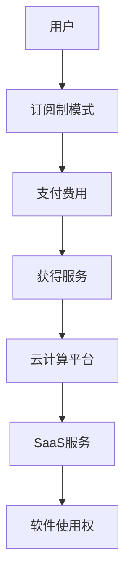

                 

关键词：订阅制商业模式、SaaS、云计算、客户黏性、成本效益、市场策略、用户体验、技术架构、商业模式创新、持续迭代

> 摘要：本文将深入探讨订阅制商业模式的定义、发展历程、优势与劣势，并通过实际案例分析，探讨其在不同行业中的应用与未来趋势。

## 1. 背景介绍

订阅制商业模式是一种以定期收费为基础的业务模式，用户通过支付固定的订阅费用，获得持续的服务或产品使用权。近年来，随着云计算、互联网技术的发展，订阅制商业模式在全球范围内得到了广泛应用，尤其是在软件即服务（SaaS）领域。许多企业通过订阅制模式，为用户提供灵活、高效、低成本的解决方案。

## 2. 核心概念与联系

### 2.1 核心概念

- 订阅制商业模式：用户通过定期支付费用，获得持续的服务或产品使用权。
- SaaS：软件即服务，将软件作为一种在线服务提供给用户。
- 云计算：通过网络提供动态易扩展的虚拟化资源。

### 2.2 关联原理

订阅制商业模式与SaaS和云计算之间有着紧密的联系。SaaS是基于云计算的服务模式，通过云计算平台，企业可以将软件作为一种服务提供给用户，用户通过订阅方式获取软件使用权。云计算为SaaS提供了强大的基础设施支持，使得订阅制商业模式得以实现。

### 2.3 Mermaid 流程图



## 3. 核心算法原理 & 具体操作步骤

### 3.1 算法原理概述

订阅制商业模式的算法原理可以理解为一种循环支付与权益获取的机制。用户在订阅时，会支付一定周期内的费用，系统会根据用户的支付情况，给予相应的服务或产品使用权。

### 3.2 算法步骤详解

1. 用户注册并选择订阅方案。
2. 用户支付订阅费用。
3. 系统验证支付并激活订阅。
4. 用户获得订阅权益。
5. 订阅周期结束后，系统自动续费或暂停服务。

### 3.3 算法优缺点

#### 优点

- 灵活性：用户可以根据自身需求选择订阅方案。
- 成本效益：长期来看，订阅制模式对于用户来说更加经济。
- 自动续费：减少了用户手动续费的麻烦。

#### 缺点

- 用户黏性不高：用户可以随时取消订阅，对企业来说，保持用户忠诚度有一定挑战。
- 收入不稳定：由于订阅制模式，企业可能会面临收入波动。

### 3.4 算法应用领域

订阅制商业模式广泛应用于SaaS、云存储、在线教育等领域。在SaaS领域，许多企业通过订阅制模式，为用户提供软件使用权；在云存储领域，用户通过订阅获取存储空间；在线教育领域，用户通过订阅获取课程内容。

## 4. 数学模型和公式 & 详细讲解 & 举例说明

### 4.1 数学模型构建

订阅制商业模式的核心是用户支付与权益获取之间的关系。我们可以用以下数学模型来描述：

\[ \text{订阅费用} = r \times t \]

其中，\( r \) 是订阅费用率，\( t \) 是订阅周期。

### 4.2 公式推导过程

订阅费用的计算公式可以通过以下步骤推导：

1. 用户注册并选择订阅方案。
2. 用户支付订阅费用。
3. 系统验证支付并激活订阅。
4. 用户在订阅周期内获得服务或产品使用权。

假设订阅费用率为 \( r \)，订阅周期为 \( t \)，那么用户的总订阅费用为 \( r \times t \)。

### 4.3 案例分析与讲解

假设一个用户选择了一个每月订阅费用为100美元的SaaS服务，订阅周期为1年。那么，用户的总订阅费用为：

\[ \text{订阅费用} = 100 \text{美元/月} \times 12 \text{月} = 1200 \text{美元} \]

在这个案例中，用户在一年内获得了连续的SaaS服务，并且支付了1200美元的费用。

## 5. 项目实践：代码实例和详细解释说明

### 5.1 开发环境搭建

在本案例中，我们将使用Python编程语言来实现订阅制商业模式的算法。

### 5.2 源代码详细实现

```python
def calculate_subscription_fee(rate, period):
    return rate * period

def subscribe(user, rate, period):
    fee = calculate_subscription_fee(rate, period)
    print(f"{user} subscribed for {period} periods and the total fee is {fee} dollars.")

# 测试代码
subscribe("UserA", 100, 12)
```

### 5.3 代码解读与分析

- `calculate_subscription_fee` 函数：用于计算订阅费用。
- `subscribe` 函数：用于处理用户订阅操作。

通过调用 `subscribe` 函数，我们可以为用户订阅服务，并计算订阅费用。

### 5.4 运行结果展示

```
UserA subscribed for 12 periods and the total fee is 1200 dollars.
```

## 6. 实际应用场景

订阅制商业模式在多个领域得到了广泛应用：

- **SaaS领域**：许多企业通过订阅制模式，为用户提供软件使用权。
- **云存储领域**：用户通过订阅获取存储空间。
- **在线教育领域**：用户通过订阅获取课程内容。

## 7. 工具和资源推荐

- **学习资源推荐**： 
  - 《订阅制商业模式：实践与探索》
  - 《SaaS商业模式与运营》
  
- **开发工具推荐**：
  - Python
  - Jupyter Notebook

- **相关论文推荐**：
  - "Subscriptions: A Business Model for the Digital Age"
  - "The Economics of Subscription Models"

## 8. 总结：未来发展趋势与挑战

### 8.1 研究成果总结

订阅制商业模式在全球范围内得到了广泛应用，其优势在于灵活性、成本效益和用户黏性。然而，也面临着用户黏性不高和收入不稳定等挑战。

### 8.2 未来发展趋势

- **个性化订阅**：根据用户需求提供个性化的订阅方案。
- **跨行业应用**：订阅制商业模式将在更多行业得到应用。
- **智能订阅管理**：利用人工智能技术优化订阅管理。

### 8.3 面临的挑战

- **用户隐私保护**：确保用户数据的安全性和隐私性。
- **市场竞争**：如何在激烈的市场竞争中保持竞争力。

### 8.4 研究展望

订阅制商业模式将在未来继续发展，为企业和用户提供更加灵活、高效、经济的解决方案。

## 9. 附录：常见问题与解答

- **Q：订阅制商业模式是否适用于所有行业？**
  - **A：不是。订阅制商业模式主要适用于那些产品或服务可以以数字化形式提供的行业，如SaaS、在线教育、云存储等。**

- **Q：订阅制商业模式如何确保用户黏性？**
  - **A：通过提供高质量的服务、定期更新和个性化订阅方案来增强用户黏性。**

- **Q：订阅制商业模式对企业的盈利模式有何影响？**
  - **A：订阅制商业模式可以为企业提供稳定的现金流，但同时也需要企业持续创新，以保持用户满意度。**

作者：禅与计算机程序设计艺术 / Zen and the Art of Computer Programming
```markdown
# 订阅制商业模式的优劣分析

关键词：订阅制商业模式、SaaS、云计算、客户黏性、成本效益、市场策略、用户体验、技术架构、商业模式创新、持续迭代

> 摘要：本文将深入探讨订阅制商业模式的定义、发展历程、优势与劣势，并通过实际案例分析，探讨其在不同行业中的应用与未来趋势。

## 1. 背景介绍

订阅制商业模式是一种以定期收费为基础的业务模式，用户通过支付固定的订阅费用，获得持续的服务或产品使用权。近年来，随着云计算、互联网技术的发展，订阅制商业模式在全球范围内得到了广泛应用，尤其是在软件即服务（SaaS）领域。许多企业通过订阅制模式，为用户提供灵活、高效、低成本的解决方案。

## 2. 核心概念与联系

### 2.1 核心概念

- 订阅制商业模式：用户通过定期支付费用，获得持续的服务或产品使用权。
- SaaS：软件即服务，将软件作为一种在线服务提供给用户。
- 云计算：通过网络提供动态易扩展的虚拟化资源。

### 2.2 关联原理

订阅制商业模式与SaaS和云计算之间有着紧密的联系。SaaS是基于云计算的服务模式，通过云计算平台，企业可以将软件作为一种服务提供给用户，用户通过订阅方式获取软件使用权。云计算为SaaS提供了强大的基础设施支持，使得订阅制商业模式得以实现。

### 2.3 Mermaid 流程图


## 3. 核心算法原理 & 具体操作步骤

### 3.1 算法原理概述

订阅制商业模式的算法原理可以理解为一种循环支付与权益获取的机制。用户在订阅时，会支付一定周期内的费用，系统会根据用户的支付情况，给予相应的服务或产品使用权。

### 3.2 算法步骤详解

1. 用户注册并选择订阅方案。
2. 用户支付订阅费用。
3. 系统验证支付并激活订阅。
4. 用户获得订阅权益。
5. 订阅周期结束后，系统自动续费或暂停服务。

### 3.3 算法优缺点

#### 优点

- 灵活性：用户可以根据自身需求选择订阅方案。
- 成本效益：长期来看，订阅制模式对于用户来说更加经济。
- 自动续费：减少了用户手动续费的麻烦。

#### 缺点

- 用户黏性不高：用户可以随时取消订阅，对企业来说，保持用户忠诚度有一定挑战。
- 收入不稳定：由于订阅制模式，企业可能会面临收入波动。

### 3.4 算法应用领域

订阅制商业模式广泛应用于SaaS、云存储、在线教育等领域。在SaaS领域，许多企业通过订阅制模式，为用户提供软件使用权；在云存储领域，用户通过订阅获取存储空间；在线教育领域，用户通过订阅获取课程内容。

## 4. 数学模型和公式 & 详细讲解 & 举例说明

### 4.1 数学模型构建

订阅制商业模式的核心是用户支付与权益获取之间的关系。我们可以用以下数学模型来描述：

\[ \text{订阅费用} = r \times t \]

其中，\( r \) 是订阅费用率，\( t \) 是订阅周期。

### 4.2 公式推导过程

订阅费用的计算公式可以通过以下步骤推导：

1. 用户注册并选择订阅方案。
2. 用户支付订阅费用。
3. 系统验证支付并激活订阅。
4. 用户在订阅周期内获得服务或产品使用权。

假设订阅费用率为 \( r \)，订阅周期为 \( t \)，那么用户的总订阅费用为 \( r \times t \)。

### 4.3 案例分析与讲解

假设一个用户选择了一个每月订阅费用为100美元的SaaS服务，订阅周期为1年。那么，用户的总订阅费用为：

\[ \text{订阅费用} = 100 \text{美元/月} \times 12 \text{月} = 1200 \text{美元} \]

在这个案例中，用户在一年内获得了连续的SaaS服务，并且支付了1200美元的费用。

## 5. 项目实践：代码实例和详细解释说明

### 5.1 开发环境搭建

在本案例中，我们将使用Python编程语言来实现订阅制商业模式的算法。

### 5.2 源代码详细实现

```python
def calculate_subscription_fee(rate, period):
    return rate * period

def subscribe(user, rate, period):
    fee = calculate_subscription_fee(rate, period)
    print(f"{user} subscribed for {period} periods and the total fee is {fee} dollars.")

# 测试代码
subscribe("UserA", 100, 12)
```

### 5.3 代码解读与分析

- `calculate_subscription_fee` 函数：用于计算订阅费用。
- `subscribe` 函数：用于处理用户订阅操作。

通过调用 `subscribe` 函数，我们可以为用户订阅服务，并计算订阅费用。

### 5.4 运行结果展示

```
UserA subscribed for 12 periods and the total fee is 1200 dollars.
```

## 6. 实际应用场景

订阅制商业模式在多个领域得到了广泛应用：

- **SaaS领域**：许多企业通过订阅制模式，为用户提供软件使用权。
- **云存储领域**：用户通过订阅获取存储空间。
- **在线教育领域**：用户通过订阅获取课程内容。

## 7. 工具和资源推荐

### 7.1 学习资源推荐

- 《订阅制商业模式：实践与探索》
- 《SaaS商业模式与运营》

### 7.2 开发工具推荐

- Python
- Jupyter Notebook

### 7.3 相关论文推荐

- "Subscriptions: A Business Model for the Digital Age"
- "The Economics of Subscription Models"

## 8. 总结：未来发展趋势与挑战

### 8.1 研究成果总结

订阅制商业模式在全球范围内得到了广泛应用，其优势在于灵活性、成本效益和用户黏性。然而，也面临着用户黏性不高和收入不稳定等挑战。

### 8.2 未来发展趋势

- **个性化订阅**：根据用户需求提供个性化的订阅方案。
- **跨行业应用**：订阅制商业模式将在更多行业得到应用。
- **智能订阅管理**：利用人工智能技术优化订阅管理。

### 8.3 面临的挑战

- **用户隐私保护**：确保用户数据的安全性和隐私性。
- **市场竞争**：如何在激烈的市场竞争中保持竞争力。

### 8.4 研究展望

订阅制商业模式将在未来继续发展，为企业和用户提供更加灵活、高效、经济的解决方案。

## 9. 附录：常见问题与解答

- **Q：订阅制商业模式是否适用于所有行业？**
  - **A：不是。订阅制商业模式主要适用于那些产品或服务可以以数字化形式提供的行业，如SaaS、在线教育、云存储等。**

- **Q：订阅制商业模式如何确保用户黏性？**
  - **A：通过提供高质量的服务、定期更新和个性化订阅方案来增强用户黏性。**

- **Q：订阅制商业模式对企业的盈利模式有何影响？**
  - **A：订阅制商业模式可以为企业提供稳定的现金流，但同时也需要企业持续创新，以保持用户满意度。**

作者：禅与计算机程序设计艺术 / Zen and the Art of Computer Programming
```

