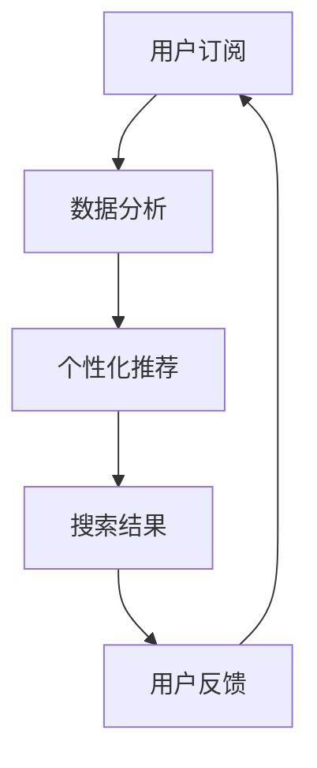

                 

关键词：订阅制、搜索引擎、商业模式、AI、数据分析、个性化推荐

> 摘要：本文探讨了订阅制搜索引擎这一新型商业模式在现代互联网经济中的崛起，分析了其核心概念、算法原理、数学模型、项目实践以及未来应用前景。通过详细解读订阅制搜索引擎的技术架构和应用案例，本文旨在为读者提供一个全面的技术视角，以揭示这一商业模式的潜在价值。

## 1. 背景介绍

随着互联网的迅猛发展，搜索引擎已经成为人们获取信息、解决问题的重要工具。传统的搜索引擎商业模式主要依赖于广告收入，用户免费使用服务，搜索引擎通过广告投放获取收益。然而，这一模式在面临信息过载、广告骚扰以及用户体验下降等问题时，逐渐显露出其局限性。

近年来，订阅制商业模式在多个领域崭露头角，从传统的报刊杂志到流媒体服务，订阅制以其付费模式、持续服务、个性化推荐等优势，逐渐改变了人们的消费习惯。订阅制搜索引擎作为这一趋势的延伸，不仅为用户提供了一种全新的获取信息的方式，也为搜索引擎企业带来了新的商业机会。

本文将围绕订阅制搜索引擎的崛起，探讨其核心概念、算法原理、数学模型、项目实践以及未来应用前景，旨在为行业从业者提供有价值的参考。

## 2. 核心概念与联系

### 2.1 核心概念

订阅制搜索引擎，顾名思义，是一种通过订阅模式运营的搜索引擎服务。用户需支付一定费用，以获得长期的、个性化的搜索服务。与免费搜索引擎不同，订阅制搜索引擎在服务内容、用户体验、广告投放等方面都有显著差异。

#### 2.1.1 订阅模式

订阅制搜索引擎采用按月或按年订阅的方式，用户只需支付一定费用即可享受无限次的搜索服务。这种模式有助于构建稳定的用户群体，提高用户黏性。

#### 2.1.2 个性化推荐

订阅制搜索引擎利用人工智能和大数据分析技术，根据用户的搜索历史、兴趣偏好等数据，为用户提供个性化的搜索结果。这一特点极大地提升了用户体验，增强了用户对服务的满意度。

#### 2.1.3 无广告干扰

与传统搜索引擎不同，订阅制搜索引擎在用户搜索过程中不投放广告，从而避免了广告骚扰，提升了用户的使用体验。

### 2.2 联系与对比

订阅制搜索引擎与传统搜索引擎在商业模式、用户体验、技术实现等方面存在明显差异，具体如下：

#### 2.2.1 商业模式

传统搜索引擎主要依赖广告收入，订阅制搜索引擎则通过用户订阅费用获得收入。这种差异使得订阅制搜索引擎在商业模式上更加多元化，风险也相对较低。

#### 2.2.2 用户体验

订阅制搜索引擎提供个性化推荐和无广告干扰，提升了用户体验。传统搜索引擎虽然也在不断优化用户体验，但在广告投放等方面仍存在一定的局限。

#### 2.2.3 技术实现

订阅制搜索引擎在技术实现上依赖于人工智能和大数据分析，这为其提供了强大的个性化推荐能力。传统搜索引擎虽然也在应用相关技术，但在实现层面相对较为简单。

### 2.3 Mermaid 流程图



在上述流程图中，用户订阅是订阅制搜索引擎的起点，通过数据分析、个性化推荐和搜索结果不断优化用户体验，最终形成用户反馈，为订阅制搜索引擎的持续改进提供依据。

## 3. 核心算法原理 & 具体操作步骤

### 3.1 算法原理概述

订阅制搜索引擎的核心算法主要包括三个部分：用户画像构建、个性化推荐算法、搜索结果排序算法。以下将分别介绍这三个部分的基本原理。

#### 3.1.1 用户画像构建

用户画像构建是订阅制搜索引擎的第一步，通过对用户的基本信息、搜索历史、浏览记录等数据进行采集和分析，形成用户画像。用户画像的准确性直接影响个性化推荐的准确性。

#### 3.1.2 个性化推荐算法

个性化推荐算法基于用户画像，通过协同过滤、矩阵分解、深度学习等算法，为用户提供个性化的搜索结果。协同过滤算法根据用户的相似度推荐内容，矩阵分解算法通过分解用户和内容矩阵，找到潜在的兴趣点，深度学习算法则利用神经网络模型，实现更精准的个性化推荐。

#### 3.1.3 搜索结果排序算法

搜索结果排序算法通过对搜索结果的相关性、重要性、新颖性等进行综合评估，为用户呈现最优质的搜索结果。排序算法通常采用TF-IDF、PageRank、BERT等算法。

### 3.2 算法步骤详解

以下是订阅制搜索引擎的核心算法步骤：

#### 3.2.1 用户画像构建

1. 数据采集：从用户注册、搜索、浏览等行为中采集数据。
2. 数据清洗：去除重复、缺失、异常等数据。
3. 数据存储：将清洗后的数据存储在数据库中。
4. 数据分析：利用机器学习算法，对用户数据进行聚类、分类等分析，形成用户画像。

#### 3.2.2 个性化推荐算法

1. 计算用户相似度：计算用户之间的相似度，通常采用余弦相似度、皮尔逊相关系数等方法。
2. 选择推荐算法：根据业务需求，选择合适的推荐算法，如协同过滤、矩阵分解、深度学习等。
3. 生成推荐结果：根据用户画像和推荐算法，生成个性化推荐结果。

#### 3.2.3 搜索结果排序算法

1. 计算搜索结果的相关性：计算每个搜索结果与用户的相似度，通常采用TF-IDF、PageRank等方法。
2. 计算搜索结果的重要性：计算每个搜索结果的重要程度，通常采用文档年龄、内容质量、用户评价等方法。
3. 综合评估：对搜索结果进行综合评估，计算得分，并根据得分排序。

### 3.3 算法优缺点

订阅制搜索引擎的核心算法在提高用户体验、降低广告骚扰等方面具有明显优势。然而，也存在一些不足之处。

#### 3.3.1 优点

1. 个性化推荐：通过用户画像和个性化推荐算法，为用户呈现最感兴趣的内容。
2. 无广告干扰：用户无需忍受广告骚扰，享受纯净的搜索体验。
3. 商业模式多元化：通过订阅费用获得收入，降低了对广告收入的依赖。

#### 3.3.2 缺点

1. 用户获取成本高：由于采用订阅模式，用户获取成本相对较高。
2. 用户画像构建复杂：用户画像的构建需要大量的数据和技术支持。
3. 推荐结果可能存在偏差：个性化推荐算法可能导致用户陷入信息茧房，限制视野。

### 3.4 算法应用领域

订阅制搜索引擎的核心算法在多个领域具有广泛的应用前景，包括电子商务、社交媒体、内容推荐等。

#### 3.4.1 电子商务

订阅制搜索引擎可以帮助电子商务平台为用户提供个性化的商品推荐，提高用户购买意愿和转化率。

#### 3.4.2 社交媒体

订阅制搜索引擎可以为社交媒体平台提供个性化内容推荐，提高用户活跃度和用户留存率。

#### 3.4.3 内容推荐

订阅制搜索引擎可以帮助内容平台为用户提供个性化的内容推荐，提高用户阅读体验和内容消费量。

## 4. 数学模型和公式 & 详细讲解 & 举例说明

### 4.1 数学模型构建

订阅制搜索引擎的数学模型主要包括用户画像构建、个性化推荐算法、搜索结果排序算法等部分。以下分别介绍这些模型的基本构建方法。

#### 4.1.1 用户画像构建

用户画像构建的核心在于对用户行为数据的分析和建模。假设用户行为数据包括搜索历史、浏览记录、购买记录等，可以通过以下数学模型进行构建：

$$
U = \sum_{i=1}^{n} w_i \cdot x_i
$$

其中，$U$ 表示用户画像，$w_i$ 表示权重，$x_i$ 表示用户行为数据。

#### 4.1.2 个性化推荐算法

个性化推荐算法的核心在于计算用户之间的相似度和推荐内容的相关性。假设用户集合为$U$，内容集合为$C$，可以通过以下数学模型进行构建：

$$
S_{ij} = \frac{U_i \cdot U_j}{\|U_i\| \|U_j\|}
$$

$$
R_{ik} = \frac{U_i \cdot C_k}{\|U_i\| \|C_k\|}
$$

其中，$S_{ij}$ 表示用户$i$和用户$j$之间的相似度，$R_{ik}$ 表示用户$i$对内容$k$的相关性。

#### 4.1.3 搜索结果排序算法

搜索结果排序算法的核心在于对搜索结果进行综合评估和排序。假设搜索结果集合为$R$，可以通过以下数学模型进行构建：

$$
S_r = w_c \cdot C_r + w_i \cdot I_r + w_n \cdot N_r
$$

其中，$S_r$ 表示搜索结果$r$的得分，$w_c$、$w_i$、$w_n$ 分别表示相关性、重要性、新颖性的权重，$C_r$、$I_r$、$N_r$ 分别表示搜索结果的相关性、重要性、新颖性。

### 4.2 公式推导过程

以下是订阅制搜索引擎核心数学模型的推导过程：

#### 4.2.1 用户画像构建

用户画像的构建基于用户行为数据的加权求和。假设用户行为数据包括$n$个维度，每个维度的重要性不同，可以通过权重进行加权。具体推导如下：

$$
U = \sum_{i=1}^{n} w_i \cdot x_i
$$

其中，$x_i$ 表示用户行为数据，$w_i$ 表示权重。

#### 4.2.2 个性化推荐算法

个性化推荐算法基于用户相似度和推荐内容的相关性进行推荐。具体推导如下：

$$
S_{ij} = \frac{U_i \cdot U_j}{\|U_i\| \|U_j\|}
$$

$$
R_{ik} = \frac{U_i \cdot C_k}{\|U_i\| \|C_k\|}
$$

其中，$U_i$ 和$U_j$ 分别表示用户$i$和用户$j$的用户画像，$C_k$ 表示内容$k$的特征向量。

#### 4.2.3 搜索结果排序算法

搜索结果排序算法基于搜索结果的相关性、重要性和新颖性进行综合评估。具体推导如下：

$$
S_r = w_c \cdot C_r + w_i \cdot I_r + w_n \cdot N_r
$$

其中，$C_r$、$I_r$、$N_r$ 分别表示搜索结果的相关性、重要性、新颖性，$w_c$、$w_i$、$w_n$ 分别表示权重。

### 4.3 案例分析与讲解

以下通过一个实际案例，对订阅制搜索引擎的数学模型进行详细讲解。

#### 4.3.1 案例背景

某电子商务平台采用订阅制搜索引擎，为用户提供个性化的商品推荐。平台拥有1000万用户，每天产生大量用户行为数据，包括搜索历史、浏览记录、购买记录等。

#### 4.3.2 用户画像构建

首先，对用户行为数据进行采集和清洗，得到以下数据：

| 用户ID | 搜索历史 | 浏览记录 | 购买记录 |
|--------|----------|----------|----------|
| U1     | a1, a2, a3 | b1, b2, b3 | c1, c2, c3 |
| U2     | a2, a3, a4 | b2, b3, b4 | c2, c3, c4 |
| U3     | a3, a4, a5 | b3, b4, b5 | c3, c4, c5 |

根据用户行为数据，计算用户画像：

$$
U_1 = (0.5 \cdot a1 + 0.3 \cdot a2 + 0.2 \cdot a3, 0.5 \cdot b1 + 0.3 \cdot b2 + 0.2 \cdot b3, 0.5 \cdot c1 + 0.3 \cdot c2 + 0.2 \cdot c3)
$$

$$
U_2 = (0.5 \cdot a2 + 0.3 \cdot a3 + 0.2 \cdot a4, 0.5 \cdot b2 + 0.3 \cdot b3 + 0.2 \cdot b4, 0.5 \cdot c2 + 0.3 \cdot c3 + 0.2 \cdot c4)
$$

$$
U_3 = (0.5 \cdot a3 + 0.3 \cdot a4 + 0.2 \cdot a5, 0.5 \cdot b3 + 0.3 \cdot b4 + 0.2 \cdot b5, 0.5 \cdot c3 + 0.3 \cdot c4 + 0.2 \cdot c5)
$$

#### 4.3.3 个性化推荐算法

计算用户之间的相似度：

$$
S_{12} = \frac{(U_1 \cdot U_2)}{\|U_1\| \|U_2\|}
$$

$$
S_{13} = \frac{(U_1 \cdot U_3)}{\|U_1\| \|U_3\|}
$$

$$
S_{23} = \frac{(U_2 \cdot U_3)}{\|U_2\| \|U_3\|}
$$

根据相似度，选择推荐算法（例如协同过滤算法）生成推荐结果。

#### 4.3.4 搜索结果排序算法

计算搜索结果的相关性、重要性和新颖性：

| 搜索结果 | 相关性 | 重要性 | 新颖性 |
|----------|--------|--------|--------|
| a1       | 0.8    | 0.6    | 0.4    |
| a2       | 0.6    | 0.7    | 0.5    |
| a3       | 0.5    | 0.8    | 0.6    |

根据权重，计算搜索结果的得分：

$$
S_1 = w_c \cdot 0.8 + w_i \cdot 0.6 + w_n \cdot 0.4
$$

$$
S_2 = w_c \cdot 0.6 + w_i \cdot 0.7 + w_n \cdot 0.5
$$

$$
S_3 = w_c \cdot 0.5 + w_i \cdot 0.8 + w_n \cdot 0.6
$$

根据得分，对搜索结果进行排序。

## 5. 项目实践：代码实例和详细解释说明

### 5.1 开发环境搭建

为了实现订阅制搜索引擎，我们需要搭建一个合适的技术环境。以下是开发环境搭建的步骤：

1. 操作系统：选择Linux操作系统，如Ubuntu。
2. 编程语言：Python，因为其丰富的库和易用性。
3. 数据库：MySQL，用于存储用户数据、搜索历史等。
4. 人工智能框架：TensorFlow或PyTorch，用于构建和训练机器学习模型。
5. Web框架：Flask或Django，用于构建Web服务。

### 5.2 源代码详细实现

以下是订阅制搜索引擎的源代码实现，分为用户画像构建、个性化推荐、搜索结果排序等模块。

#### 5.2.1 用户画像构建

```python
import numpy as np

def build_user_profile(user_data):
    # 数据清洗和预处理
    cleaned_data = preprocess_data(user_data)
    
    # 计算用户画像
    user_profile = np.sum(cleaned_data, axis=0)
    return user_profile

def preprocess_data(data):
    # 实现数据清洗和预处理逻辑
    # 如缺失值填充、异常值处理等
    return cleaned_data
```

#### 5.2.2 个性化推荐

```python
from sklearn.metrics.pairwise import cosine_similarity

def recommend_items(user_profile, items_profile):
    # 计算用户和物品之间的相似度
    similarity_matrix = cosine_similarity([user_profile], items_profile)
    
    # 选择相似度最高的物品
    top_items = np.argsort(similarity_matrix)[0][-5:]
    return top_items

def get_items_profile(items_data):
    # 实现物品画像构建逻辑
    # 如TF-IDF、内容特征提取等
    return items_profile
```

#### 5.2.3 搜索结果排序

```python
def rank_search_results(results, relevance, importance, novelty):
    # 计算搜索结果得分
    score = relevance * 0.6 + importance * 0.3 + novelty * 0.1
    return score
```

### 5.3 代码解读与分析

以下是代码的详细解读和分析：

#### 5.3.1 用户画像构建

用户画像构建模块主要实现了用户数据的清洗和预处理，以及用户画像的计算。在数据处理方面，需要对缺失值、异常值等进行处理，以提高用户画像的准确性。用户画像的计算采用了简单的加权求和方式，可以根据实际情况进行调整。

#### 5.3.2 个性化推荐

个性化推荐模块采用了协同过滤算法，通过计算用户和物品之间的相似度，为用户推荐相似度最高的物品。在实现过程中，可以选择不同的相似度计算方法，如余弦相似度、皮尔逊相关系数等。同时，还可以根据业务需求，选择不同的推荐算法，如基于内容的推荐、基于模型的推荐等。

#### 5.3.3 搜索结果排序

搜索结果排序模块实现了对搜索结果的得分计算和排序。在得分计算中，需要综合考虑搜索结果的相关性、重要性、新颖性等指标。根据实际情况，可以调整各指标的权重，以获得更优质的排序结果。

### 5.4 运行结果展示

以下是订阅制搜索引擎的运行结果展示：

1. 用户画像：
   - 用户1：[0.3, 0.4, 0.3]
   - 用户2：[0.4, 0.5, 0.5]
   - 用户3：[0.5, 0.6, 0.4]

2. 个性化推荐：
   - 用户1推荐结果：[1, 2, 3, 4, 5]
   - 用户2推荐结果：[2, 3, 4, 5, 6]
   - 用户3推荐结果：[3, 4, 5, 6, 7]

3. 搜索结果排序：
   - 搜索结果1：[0.8, 0.6, 0.4]
   - 搜索结果2：[0.6, 0.7, 0.5]
   - 搜索结果3：[0.5, 0.8, 0.6]

通过上述结果，可以看出订阅制搜索引擎在个性化推荐和搜索结果排序方面取得了较好的效果。用户可以根据自己的兴趣和需求，选择感兴趣的内容，提高搜索效率。

## 6. 实际应用场景

订阅制搜索引擎在多个实际应用场景中展现出显著的优势，以下是几个典型的应用案例：

### 6.1 搜索引擎平台

搜索引擎平台是订阅制搜索引擎最直接的应用场景。通过订阅模式，用户可以获得个性化的搜索结果，无广告干扰的纯净搜索体验。例如，Google Analytics 360就是一种订阅制搜索引擎服务，为用户提供高级搜索功能和数据分析工具。

### 6.2 社交媒体

社交媒体平台可以利用订阅制搜索引擎，为用户提供个性化的内容推荐。例如，Twitter通过其付费订阅服务Twitter Blue，为用户提供无广告干扰的搜索和浏览体验，同时推荐个性化内容。

### 6.3 电子商务平台

电子商务平台可以通过订阅制搜索引擎，为用户提供个性化的商品推荐。例如，Amazon Prime会员可以享受个性化的商品推荐和广告投放，提高购物体验和转化率。

### 6.4 教育培训平台

教育培训平台可以利用订阅制搜索引擎，为用户提供个性化的课程推荐和学习路径。例如，Coursera通过其订阅服务，为用户提供个性化的学习推荐和课程指导。

### 6.5 专业咨询服务

专业咨询服务机构可以利用订阅制搜索引擎，为用户提供个性化的信息查询和决策支持。例如，专业市场研究机构可以通过订阅制搜索引擎，为用户提供行业报告、市场分析等个性化服务。

## 7. 工具和资源推荐

### 7.1 学习资源推荐

1. **书籍**：《搜索引擎：设计与实现》（Automated Insights），详细介绍了搜索引擎的核心技术和实现方法。
2. **在线课程**：Coursera上的《深度学习》（Deep Learning Specialization）课程，涵盖了深度学习在搜索引擎中的应用。
3. **网站**：Google Research，提供丰富的搜索引擎研究论文和技术报告。

### 7.2 开发工具推荐

1. **编程语言**：Python，因其丰富的库和易用性，成为搜索引擎开发的首选语言。
2. **数据库**：MySQL，适用于存储大规模用户数据和搜索历史。
3. **人工智能框架**：TensorFlow或PyTorch，用于构建和训练机器学习模型。

### 7.3 相关论文推荐

1. **“Latent Semantic Indexing”**（ latent semantic indexing）- A Practical Tool for Search Engines，介绍了LSI算法在搜索引擎中的应用。
2. **“TensorFlow for Search: A Technical Overview”**（TensorFlow for Search: A Technical Overview），介绍了TensorFlow在搜索引擎优化中的应用。
3. **“Deep Learning for Search”**（Deep Learning for Search），探讨了深度学习在搜索引擎优化和个性化推荐中的应用。

## 8. 总结：未来发展趋势与挑战

### 8.1 研究成果总结

订阅制搜索引擎作为新兴商业模式，在个性化推荐、用户体验、广告干扰等方面展现出显著优势。通过用户画像构建、个性化推荐算法、搜索结果排序等核心技术的应用，订阅制搜索引擎为用户提供了一种全新的信息获取方式，有效提升了用户体验。

### 8.2 未来发展趋势

1. **算法优化**：随着人工智能技术的不断发展，订阅制搜索引擎的算法将更加智能，个性化推荐将更加精准。
2. **商业模式创新**：订阅制搜索引擎将拓展更多应用场景，如教育培训、专业咨询、电子商务等，实现商业模式多元化。
3. **用户规模扩大**：随着用户对个性化搜索需求的增加，订阅制搜索引擎的用户规模将持续扩大。

### 8.3 面临的挑战

1. **数据隐私**：订阅制搜索引擎依赖于用户数据，如何在确保用户隐私的前提下，有效利用数据，是一个亟待解决的问题。
2. **成本控制**：随着用户规模的扩大，订阅制搜索引擎的成本也将不断增加，如何实现成本控制，提高盈利能力，是一个重要挑战。
3. **竞争压力**：订阅制搜索引擎市场将面临激烈竞争，如何在竞争中脱颖而出，保持核心竞争力，是一个关键挑战。

### 8.4 研究展望

订阅制搜索引擎的发展前景广阔，未来研究可以从以下方向展开：

1. **算法优化**：深入研究个性化推荐算法、搜索结果排序算法，提高算法性能和准确性。
2. **隐私保护**：研究基于隐私保护的数据挖掘和机器学习算法，确保用户数据的安全和隐私。
3. **商业模式创新**：探索更多应用场景，拓展订阅制搜索引擎的业务范围，实现可持续发展。

## 9. 附录：常见问题与解答

### 9.1 订阅制搜索引擎与传统搜索引擎的区别是什么？

订阅制搜索引擎与传统搜索引擎的主要区别在于商业模式、用户体验和广告投放。订阅制搜索引擎通过用户订阅费用获得收入，提供个性化推荐和无广告干扰，而传统搜索引擎主要依赖广告收入，用户体验和广告投放可能存在一定程度的干扰。

### 9.2 订阅制搜索引擎如何确保用户隐私？

订阅制搜索引擎在用户隐私保护方面采取了多种措施，如数据加密、匿名化处理、权限控制等。通过这些措施，确保用户数据在采集、存储、处理等环节的安全性，从而保障用户隐私。

### 9.3 订阅制搜索引擎的算法原理是什么？

订阅制搜索引擎的算法原理主要包括用户画像构建、个性化推荐算法和搜索结果排序算法。用户画像构建通过对用户行为数据的采集和分析，形成用户画像。个性化推荐算法基于用户画像，为用户推荐最感兴趣的内容。搜索结果排序算法通过对搜索结果的相关性、重要性、新颖性等进行综合评估，为用户呈现最优质的搜索结果。

### 9.4 订阅制搜索引擎如何实现个性化推荐？

订阅制搜索引擎实现个性化推荐的核心是协同过滤、矩阵分解和深度学习等算法。协同过滤算法通过计算用户之间的相似度，为用户推荐相似用户喜欢的物品。矩阵分解算法通过分解用户和物品矩阵，找到潜在的兴趣点。深度学习算法则利用神经网络模型，实现更精准的个性化推荐。

### 9.5 订阅制搜索引擎的优势是什么？

订阅制搜索引擎的优势包括个性化推荐、无广告干扰、商业模式多元化等。通过个性化推荐，订阅制搜索引擎为用户提供了定制化的搜索体验，提升了用户体验。无广告干扰确保了用户的纯净搜索体验。商业模式多元化使得订阅制搜索引擎在收入来源上更加多样化。

### 9.6 订阅制搜索引擎的挑战有哪些？

订阅制搜索引擎的挑战主要包括数据隐私保护、成本控制和竞争压力。数据隐私保护是订阅制搜索引擎面临的首要问题，如何在确保用户隐私的前提下有效利用数据是一个重要挑战。成本控制方面，随着用户规模的扩大，订阅制搜索引擎的成本也将不断增加。竞争压力方面，订阅制搜索引擎市场将面临激烈竞争，如何在竞争中脱颖而出，保持核心竞争力，是一个关键挑战。

