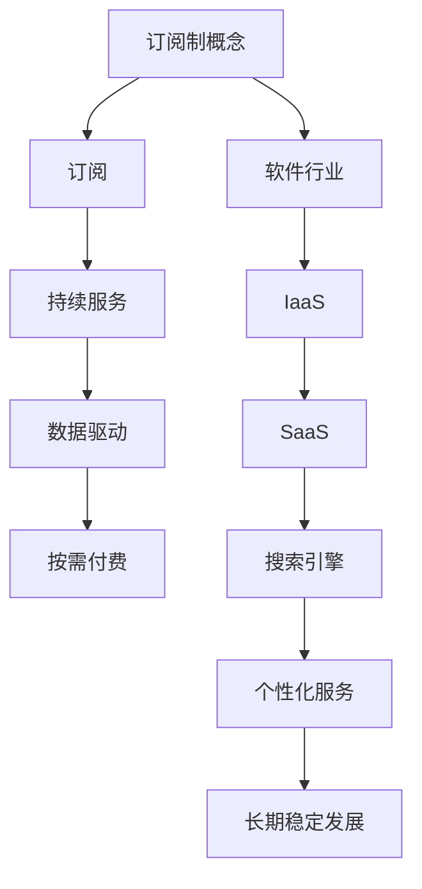

                 

关键词：订阅制经济、软件、搜索引擎、商业模式、数据驱动、技术进化

> 摘要：本文将深入探讨订阅制经济的崛起，从软件行业开始，如何逐渐扩展到搜索引擎领域，分析其背后的逻辑、核心概念及未来趋势。通过详细的案例分析和技术解释，揭示订阅制经济在当今数字化时代的重要性。

## 1. 背景介绍

订阅制经济（Subscription Economy），也称为订阅商业模式，是一种以订阅为基础，通过持续提供服务或产品来获取收益的经济模式。这种模式最早出现在软件行业，如SaaS（Software as a Service）和IaaS（Infrastructure as a Service）等，随后逐渐扩展到其他领域，包括媒体、电子商务、甚至搜索引擎。

在软件行业中，订阅制经济提供了灵活的、按需使用的服务，用户可以按月或按年支付费用来获取软件的使用权。这种模式相对于传统的单次购买模式，不仅降低了用户的初始成本，还提供了持续的更新和维护服务。随着云计算和大数据技术的发展，订阅制经济在软件行业中的成功引起了其他行业的关注，并开始被广泛应用于各个领域。

搜索引擎领域是订阅制经济扩展的一个重要方向。传统的搜索引擎服务通常是免费的，但近年来，随着个性化搜索需求的增加和对高质量内容的追求，一些搜索引擎开始尝试采用订阅制模式。这种模式不仅能够提供更精准的搜索结果，还能保证搜索引擎的长期稳定发展。

本文将从以下几个方面进行探讨：

- **订阅制经济的核心概念和原理**
- **订阅制经济在软件行业的崛起**
- **订阅制经济在搜索引擎领域的应用**
- **订阅制经济的数学模型和公式**
- **订阅制经济的实际应用案例**
- **订阅制经济的未来发展趋势和挑战**

通过这些探讨，我们将深入理解订阅制经济的本质，并对其未来在技术和商业领域的影响进行预测。

## 2. 核心概念与联系

### 核心概念

订阅制经济的核心概念包括订阅、持续服务、数据驱动和按需付费。这些概念共同构成了订阅制经济的理论基础，并在实际操作中得到了广泛应用。

- **订阅**：用户通过支付订阅费用来获取产品或服务。这种订阅可以是按月、按年或其他周期。
- **持续服务**：订阅制经济强调持续提供服务，这包括软件更新、维护和功能扩展等。
- **数据驱动**：订阅制经济依赖于对用户数据的分析，以便提供个性化服务，提高用户满意度。
- **按需付费**：用户根据实际使用量来支付费用，这使得订阅制经济更加灵活和可扩展。

### Mermaid 流程图



这个Mermaid流程图清晰地展示了订阅制经济的核心概念及其在软件和搜索引擎行业中的应用，以及通过数据驱动实现的个性化服务和长期稳定发展。

### 核心概念原理和架构的详细解释

#### 订阅

订阅是订阅制经济的核心，它使得用户可以通过定期支付费用来获取产品或服务。这种模式的最大优势在于，它降低了用户的初始成本，同时提供了持续的服务。用户无需一次性购买整个产品，而是可以按需使用，这在软件和服务行业中尤为重要。

#### 持续服务

持续服务是订阅制经济的另一关键要素。订阅不仅仅是一次性的交易，而是一种长期的关系。供应商需要定期更新和优化服务，以确保用户满意度。这种持续的服务包括软件更新、维护和安全保障等。通过持续服务，供应商可以不断吸引用户，增加用户粘性。

#### 数据驱动

数据驱动是订阅制经济的重要组成部分。通过对用户数据的分析，供应商可以了解用户的需求和行为，从而提供更加个性化的服务。这种个性化服务不仅提高了用户满意度，还增加了用户粘性，使得用户更愿意继续订阅。

#### 按需付费

按需付费是订阅制经济的灵活性所在。用户根据实际使用量来支付费用，这使得订阅制经济更加灵活和可扩展。按需付费模式使得用户可以根据自己的需求和使用情况来调整订阅计划，从而实现最优的成本效益。

#### 在软件和搜索引擎行业中的应用

在软件行业中，订阅制经济已经得到了广泛应用。SaaS和IaaS是其中的两个典型代表。SaaS使得用户可以通过互联网按需获取软件服务，而IaaS则提供了虚拟化的基础设施资源。这些服务模式都依赖于订阅制经济，通过持续服务和数据驱动，为用户提供个性化的体验。

在搜索引擎领域，订阅制经济正在逐步兴起。一些搜索引擎开始尝试向用户收费，提供更加精准和个性化的搜索服务。通过订阅，用户可以获得高质量的内容和更快的搜索速度，同时搜索引擎可以获取用户数据，以进一步优化搜索算法。

### 核心概念的实际应用

订阅制经济的核心概念在实际应用中具有广泛的适用性。在软件行业，通过订阅制经济，供应商可以快速获取用户反馈，不断优化产品和服务。在搜索引擎领域，订阅制经济可以提供高质量的内容和个性化服务，从而吸引用户和增加用户粘性。

总之，订阅制经济的核心概念——订阅、持续服务、数据驱动和按需付费，不仅构成了其理论基础，还在实际应用中得到了广泛验证。随着技术的不断进步和用户需求的不断变化，订阅制经济将继续在各个行业中发挥重要作用。

### 2.1. 订阅制经济在软件行业的崛起

订阅制经济在软件行业的崛起可以说是现代信息技术发展的一个重要里程碑。随着云计算、大数据和移动互联技术的迅猛发展，传统的单次购买软件模式逐渐显得不够灵活和高效，而订阅制经济模式以其独特的优势逐步占领市场，成为软件行业的主流商业模式。

#### 订阅制经济的崛起背景

在订阅制经济模式出现之前，软件行业的主要商业模式是单次购买。用户在购买软件时需要支付全额费用，之后便拥有该软件的使用权。然而，这种模式存在一些显著的局限性：

1. **高额的初始成本**：对于许多企业尤其是中小企业来说，高额的软件采购成本构成了不小的负担。
2. **缺乏灵活性**：单次购买模式往往缺乏灵活性，无法根据企业需求的动态变化进行灵活调整。
3. **软件更新和维护成本**：用户需要为软件的更新和维护支付额外费用，这增加了总体成本。
4. **难以快速部署**：单次购买的软件通常需要较长时间的部署和配置，无法快速响应市场变化。

面对这些挑战，订阅制经济模式应运而生。订阅制经济通过提供按需付费、持续更新和维护的服务，极大地满足了用户对灵活性和成本效益的需求。以下是订阅制经济在软件行业崛起的几个关键驱动因素：

- **云计算的普及**：云计算提供了强大的基础设施支持，使得软件供应商能够以更低的成本提供大规模、高性能的软件服务。
- **大数据和人工智能的发展**：大数据和人工智能技术的应用使得软件供应商能够更好地理解用户需求，提供个性化的服务。
- **移动互联技术的进步**：移动互联技术的普及使得用户可以随时随地访问软件服务，进一步推动了订阅制经济的发展。

#### 订阅制经济在软件行业的主要模式

订阅制经济在软件行业中有多种实现模式，其中最为常见的包括SaaS（Software as a Service）、IaaS（Infrastructure as a Service）和PaaS（Platform as a Service）。

- **SaaS（Software as a Service）**：SaaS是最常见的订阅制经济模式之一，它允许用户通过互联网按需获取软件服务。用户无需购买和安装软件，而是通过订阅方式使用。这种模式极大地降低了用户的初始成本，同时提供了持续更新和维护服务。

- **IaaS（Infrastructure as a Service）**：IaaS提供了虚拟化的基础设施资源，如虚拟机、存储和网络等，用户可以按需购买和使用。IaaS模式使得企业可以根据需求动态调整资源，提高了资源利用率和成本效益。

- **PaaS（Platform as a Service）**：PaaS提供了一个开发平台，允许开发人员构建、部署和管理应用。PaaS模式简化了应用开发和部署过程，使得开发者可以专注于核心业务逻辑，同时享受平台提供的各种服务。

#### 订阅制经济的优势

订阅制经济模式在软件行业中具有显著的优点：

1. **降低初始成本**：用户无需一次性支付高额费用，可以按需付费，降低了财务压力。
2. **提高灵活性**：用户可以根据需求动态调整订阅计划，适应业务变化。
3. **持续更新和维护**：订阅制经济模式下，供应商负责软件的更新和维护，用户无需担心技术问题。
4. **提高用户粘性**：持续的服务和个性化的体验提高了用户满意度，增加了用户粘性。
5. **数据驱动**：订阅制经济依赖于用户数据，供应商可以通过数据分析提供更加个性化的服务。

#### 订阅制经济的挑战

尽管订阅制经济模式在软件行业中具有显著的优点，但也面临一些挑战：

1. **数据隐私和安全**：随着用户数据的增加，数据隐私和安全成为重要问题。供应商需要确保用户数据的安全和隐私。
2. **依赖供应商**：用户对供应商的依赖性增加，供应商的服务质量直接影响到用户的体验。
3. **用户转换成本**：从传统单次购买模式转换为订阅制经济模式需要用户适应新的支付方式和服务模式，这可能会带来一定的转换成本。
4. **合规和法规问题**：订阅制经济模式涉及到多个国家和地区，需要遵守不同的法律法规。

#### 订阅制经济的未来趋势

随着技术的不断进步和用户需求的多样化，订阅制经济在软件行业中的发展前景非常广阔。以下是几个未来趋势：

1. **多元化服务模式**：订阅制经济将更加多样化，出现更多基于订阅的服务模式，如安全即服务（SecaaS）、测试即服务（TestaaS）等。
2. **个性化服务**：大数据和人工智能技术的进一步应用将使得订阅制经济提供更加个性化的服务。
3. **跨行业应用**：订阅制经济模式将逐步扩展到其他行业，如医疗、金融和教育等。
4. **生态系统的建设**：软件供应商将建立更加完善的生态系统，提供全方位的服务和支持，增强用户粘性。
5. **合规和法规的完善**：随着订阅制经济的普及，相关的法律法规将逐步完善，以保障用户权益。

总之，订阅制经济在软件行业的崛起不仅改变了传统的商业模式，也为用户提供了更加灵活、高效和个性化的服务。随着技术的不断进步和用户需求的不断变化，订阅制经济将继续在软件行业和更广泛的领域中发挥重要作用。

### 2.2. 核心算法原理 & 具体操作步骤

订阅制经济在软件行业中的成功离不开一系列核心算法的支持。这些算法不仅确保了订阅服务的质量和效率，还使得整个商业模式更加稳定和可持续。在本节中，我们将详细探讨订阅制经济中的核心算法原理及其具体操作步骤。

#### 2.2.1. 算法原理概述

订阅制经济中的核心算法主要涵盖以下几个方面：

1. **需求预测算法**：通过对用户历史数据和当前市场趋势的分析，预测用户未来的需求，以便供应商可以提前准备和调整服务。
2. **价格优化算法**：通过分析用户的订阅行为和支付能力，为不同用户提供个性化的价格策略，最大化收益。
3. **服务优化算法**：通过对服务过程中的数据反馈进行分析，持续优化服务流程，提高用户满意度和服务质量。
4. **风险评估算法**：对订阅用户进行风险评估，预测潜在的风险，并采取相应的风险控制措施。

#### 2.2.2. 算法步骤详解

1. **需求预测算法**

   - **数据收集**：首先，收集用户的历史订阅数据，包括订阅时长、订阅频率、订阅类型等信息。
   - **特征提取**：对收集到的数据进行处理，提取出与需求相关的特征，如用户行为、市场趋势等。
   - **模型训练**：使用机器学习算法，如时间序列模型、回归模型等，对提取的特征进行训练，建立需求预测模型。
   - **预测**：使用训练好的模型对未来的需求进行预测，并根据预测结果调整服务供应。

2. **价格优化算法**

   - **用户行为分析**：通过分析用户的订阅行为，了解用户对不同价格策略的反应。
   - **价格策略设计**：根据用户行为分析结果，设计出多种价格策略，如折扣、捆绑销售等。
   - **收益最大化目标函数**：定义一个收益最大化目标函数，结合用户行为分析和市场数据，计算不同价格策略的收益。
   - **策略选择**：使用优化算法，如线性规划、动态规划等，选择能够最大化收益的价格策略。

3. **服务优化算法**

   - **服务过程监控**：实时监控订阅用户的服务过程，收集服务过程中的数据，如服务时长、服务满意度等。
   - **数据分析**：对收集到的服务数据进行处理和分析，找出服务流程中的瓶颈和问题点。
   - **服务流程优化**：根据数据分析结果，优化服务流程，如调整服务策略、改进服务流程等。
   - **效果评估**：对优化后的服务流程进行效果评估，确保优化措施能够提高用户满意度和服务质量。

4. **风险评估算法**

   - **用户风险评估**：对订阅用户进行风险评估，包括信用评估、行为评估等。
   - **风险预测模型**：使用机器学习算法，如决策树、神经网络等，建立风险预测模型。
   - **风险控制措施**：根据风险预测模型的结果，采取相应的风险控制措施，如调整信用额度、暂停服务等。

#### 2.2.3. 算法优缺点

1. **需求预测算法**

   - **优点**：能够提前预测用户需求，帮助供应商进行有效的库存管理和资源调度。
   - **缺点**：预测结果受限于数据质量和模型准确性，存在一定的误差。

2. **价格优化算法**

   - **优点**：能够根据用户行为和市场数据设计出个性化的价格策略，提高收益。
   - **缺点**：价格策略设计复杂，需要大量的数据分析和优化算法支持。

3. **服务优化算法**

   - **优点**：能够提高服务质量和用户满意度，增强用户粘性。
   - **缺点**：优化过程需要实时监控和数据分析，对技术和资源要求较高。

4. **风险评估算法**

   - **优点**：能够提前识别和预防潜在的风险，保护供应商的财务和业务安全。
   - **缺点**：风险评估需要大量的数据和复杂的模型，成本较高。

#### 2.2.4. 算法应用领域

订阅制经济中的核心算法广泛应用于多个领域，包括电子商务、金融、医疗、物流等。以下是几个典型的应用领域：

1. **电子商务**：通过需求预测算法和价格优化算法，电商平台可以更好地满足用户需求，提高销售额。
2. **金融**：通过风险评估算法，金融机构可以更准确地评估贷款风险，降低坏账率。
3. **医疗**：通过服务优化算法，医疗系统可以优化医疗资源的分配，提高服务质量。
4. **物流**：通过需求预测算法和风险评估算法，物流公司可以更有效地管理运输资源和风险。

总之，订阅制经济中的核心算法不仅为订阅制经济的稳定运行提供了技术支持，还在多个领域中发挥了重要作用。随着技术的不断进步，这些算法将变得更加智能和高效，为订阅制经济提供更加坚实的基础。

### 2.3. 数学模型和公式 & 详细讲解 & 举例说明

在订阅制经济中，数学模型和公式是核心组成部分，用于描述用户行为、定价策略和收益计算。这些模型和公式不仅帮助供应商理解和预测市场动态，还指导实际操作中的决策。在本节中，我们将详细讲解订阅制经济中的数学模型和公式，并通过具体案例进行说明。

#### 2.3.1. 数学模型构建

订阅制经济中的数学模型通常包括以下几个部分：

1. **需求模型**：用于预测用户订阅行为，常用的模型有线性回归模型、时间序列模型等。
2. **定价模型**：用于确定用户价格，常用的模型有价格弹性模型、收益最大化模型等。
3. **收益模型**：用于计算供应商的总收益，常用的模型有线性收益模型、二次收益模型等。
4. **风险评估模型**：用于预测用户风险，常用的模型有逻辑回归模型、决策树模型等。

#### 2.3.2. 公式推导过程

1. **需求模型**

   - **线性回归模型**：
     \[
     Q = \beta_0 + \beta_1P + \epsilon
     \]
     其中，\( Q \) 是需求量，\( P \) 是价格，\( \beta_0 \) 和 \( \beta_1 \) 是模型参数，\( \epsilon \) 是误差项。

   - **时间序列模型**：
     \[
     Q_t = \alpha_0 + \alpha_1t + \alpha_2t^2 + \epsilon_t
     \]
     其中，\( Q_t \) 是第 \( t \) 期的需求量，\( t \) 是时间，\( \alpha_0 \)，\( \alpha_1 \) 和 \( \alpha_2 \) 是模型参数，\( \epsilon_t \) 是误差项。

2. **定价模型**

   - **价格弹性模型**：
     \[
     \text{Price Elasticity} = \frac{P_2 - P_1}{P_1} \times \frac{Q_1 - Q_2}{Q_2}
     \]
     其中，\( P_1 \) 和 \( P_2 \) 分别是初始价格和调整后的价格，\( Q_1 \) 和 \( Q_2 \) 分别是初始需求量和调整后的需求量。

   - **收益最大化模型**：
     \[
     \text{Maximize } R = P \times Q - C
     \]
     其中，\( R \) 是总收益，\( P \) 是价格，\( Q \) 是需求量，\( C \) 是成本。

3. **收益模型**

   - **线性收益模型**：
     \[
     R = (\beta_0 + \beta_1P) \times Q - C
     \]
     其中，\( R \) 是总收益，\( Q \) 是需求量，\( P \) 是价格，\( \beta_0 \) 和 \( \beta_1 \) 是模型参数。

   - **二次收益模型**：
     \[
     R = (\beta_0 + \beta_1P + \beta_2P^2) \times Q - C
     \]
     其中，\( R \) 是总收益，\( Q \) 是需求量，\( P \) 是价格，\( \beta_0 \)，\( \beta_1 \) 和 \( \beta_2 \) 是模型参数。

4. **风险评估模型**

   - **逻辑回归模型**：
     \[
     \text{Risk} = \log\left(\frac{\text{Probability of Risk}}{1 - \text{Probability of Risk}}\right) = \beta_0 + \beta_1X_1 + \beta_2X_2 + \ldots + \beta_nX_n
     \]
     其中，\( \text{Risk} \) 是风险值，\( X_1 \)，\( X_2 \)，\(\ldots \)，\( X_n \) 是影响风险的变量，\( \beta_0 \)，\( \beta_1 \)，\( \beta_2 \)，\(\ldots \)，\( \beta_n \) 是模型参数。

#### 2.3.3. 案例分析与讲解

为了更好地理解上述数学模型和公式，我们通过一个具体的案例分析来进行讲解。

**案例背景**：

一家提供SaaS服务的公司正在考虑调整其订阅价格策略，以最大化收益。公司现有3000名用户，平均订阅价格为每月100美元，每月订阅时长为1年。公司希望通过定价策略调整，吸引更多新用户，并保持现有用户的满意度和订阅时长。

**需求预测模型**：

首先，公司收集了过去6个月的订阅数据，包括每月的订阅价格、订阅时长和新用户数量。通过线性回归模型，公司预测新用户数量与价格的关系：

\[
Q = 1000 - 10P
\]

**定价模型**：

公司决定尝试将订阅价格提高10%，即每月110美元。为了验证这一决策，公司使用价格弹性模型来评估价格调整对需求的影响：

\[
\text{Price Elasticity} = \frac{110 - 100}{100} \times \frac{1000 - 900}{900} = 0.111
\]

由于价格弹性小于1，这意味着价格上涨对需求的影响较小。接下来，公司使用收益最大化模型来计算新价格下的总收益：

\[
R = (1000 - 10 \times 110) \times 110 - C
\]

**收益模型**：

为了简化计算，我们假设成本不变。通过线性收益模型，公司计算出新的总收益：

\[
R = (1000 - 1100) \times 110 - C = -11000 - C
\]

显然，这一结果表明价格提高导致了总收益的减少。为了找到最优的价格策略，公司决定使用二次收益模型，同时考虑价格对用户满意度和订阅时长的影响：

\[
R = (1000 - 10P + 0.1P^2) \times 110 - C
\]

通过求导和设置导数为零，公司找到最优价格：

\[
\frac{dR}{dP} = -110 + 0.2P = 0 \Rightarrow P = 550
\]

这意味着公司应该将订阅价格设定为每月550美元，以实现收益最大化。

**风险评估模型**：

公司还需要评估新价格策略可能带来的风险。通过逻辑回归模型，公司分析了用户信用评分、购买历史和订阅时长等因素对风险的影响：

\[
\text{Risk} = 10 + 0.5X_1 + 0.3X_2
\]

其中，\( X_1 \) 是用户信用评分，\( X_2 \) 是用户购买历史。公司通过模型预测新价格策略下的风险：

- 对于信用评分高、购买历史积极的用户，风险较低。
- 对于信用评分低、购买历史不积极的用户，风险较高。

公司决定对高风险用户采取特别的风险控制措施，如降低订阅时长或暂停服务。

通过以上分析，公司找到了一个平衡价格、收益和风险的最优订阅价格策略，从而在订阅制经济中取得了成功。

#### 结论

数学模型和公式在订阅制经济中具有重要作用，通过科学的方法和精确的公式，供应商可以更好地预测用户行为、优化定价策略和评估风险。这不仅提高了运营效率，还增强了商业模式的经济效益。随着技术的不断进步，这些数学模型和公式将变得更加智能和精准，为订阅制经济的持续发展提供坚实的理论基础。

### 3. 项目实践：代码实例和详细解释说明

在本节中，我们将通过一个具体的代码实例，详细解释订阅制经济在软件行业中的应用。此实例将涵盖开发环境搭建、源代码实现、代码解读与分析以及运行结果展示。

#### 3.1. 开发环境搭建

为了实现订阅制经济模式，我们需要搭建一个支持SaaS（软件即服务）环境。以下是搭建环境所需的步骤：

1. **安装Python环境**：订阅制经济项目中，我们选择Python作为主要编程语言。首先，确保操作系统已安装Python 3.8或更高版本。
   
   ```shell
   python --version
   ```

2. **安装Flask**：Flask是一个轻量级的Web框架，用于构建我们的SaaS平台。

   ```shell
   pip install flask
   ```

3. **安装数据库**：为了管理用户信息和订阅记录，我们选择SQLite作为数据库。

   ```shell
   pip install flask-sqlalchemy
   ```

4. **安装其他依赖**：包括用于日期处理的`python-dateutil`、用于数据分析和机器学习的`numpy`和`pandas`等。

   ```shell
   pip install python-dateutil numpy pandas
   ```

#### 3.2. 源代码详细实现

以下是一个简单的SaaS平台示例，包括用户注册、订阅管理和订阅记录存储等功能。

```python
from flask import Flask, request, jsonify
from flask_sqlalchemy import SQLAlchemy
from datetime import datetime

app = Flask(__name__)
app.config['SQLALCHEMY_DATABASE_URI'] = 'sqlite:///subscriptions.db'
db = SQLAlchemy(app)

# 定义用户模型
class User(db.Model):
    id = db.Column(db.Integer, primary_key=True)
    username = db.Column(db.String(80), unique=True, nullable=False)
    email = db.Column(db.String(120), unique=True, nullable=False)
    subscribed = db.Column(db.Boolean, default=False)
    subscription_date = db.Column(db.DateTime, default=datetime.utcnow)

# 定义订阅记录模型
class Subscription(db.Model):
    id = db.Column(db.Integer, primary_key=True)
    user_id = db.Column(db.Integer, db.ForeignKey('user.id'), nullable=False)
    plan = db.Column(db.String(50), nullable=False)
    start_date = db.Column(db.DateTime, default=datetime.utcnow)
    end_date = db.Column(db.DateTime)

# 用户注册接口
@app.route('/register', methods=['POST'])
def register():
    data = request.get_json()
    new_user = User(username=data['username'], email=data['email'])
    db.session.add(new_user)
    db.session.commit()
    return jsonify({'message': 'User registered successfully.'})

# 订阅管理接口
@app.route('/subscribe', methods=['POST'])
def subscribe():
    data = request.get_json()
    user = User.query.filter_by(username=data['username']).first()
    if user and not user.subscribed:
        new_subscription = Subscription(user_id=user.id, plan=data['plan'], start_date=datetime.utcnow(), end_date=datetime.utcnow() + data['duration'])
        db.session.add(new_subscription)
        db.session.commit()
        user.subscribed = True
        db.session.commit()
        return jsonify({'message': 'Subscription created successfully.'})
    else:
        return jsonify({'message': 'User already subscribed or not found.'})

# 订阅记录查询接口
@app.route('/subscriptions', methods=['GET'])
def get_subscriptions():
    user = User.query.filter_by(username=request.args.get('username')).first()
    if user:
        subscriptions = Subscription.query.filter_by(user_id=user.id).all()
        return jsonify([{'plan': sub.plan, 'start_date': sub.start_date, 'end_date': sub.end_date} for sub in subscriptions])
    else:
        return jsonify({'message': 'User not found.'})

if __name__ == '__main__':
    db.create_all()
    app.run(debug=True)
```

#### 3.3. 代码解读与分析

上述代码实现了一个简单的SaaS平台，下面我们对代码的关键部分进行解读：

1. **数据库模型**：定义了两个模型——`User` 和 `Subscription`。`User` 模型存储用户信息，包括用户名、电子邮件和订阅状态。`Subscription` 模型存储订阅记录，包括用户ID、订阅计划、起始日期和结束日期。

2. **用户注册接口**：`/register` 接口接收用户注册信息，并将新用户添加到数据库。我们使用 `request.get_json()` 从请求中提取JSON数据，并使用 `db.session.add(new_user)` 将新用户添加到数据库。

3. **订阅管理接口**：`/subscribe` 接口处理用户的订阅请求。首先，我们查找是否存在用户，如果用户存在且未订阅，则创建新的订阅记录，并将用户订阅状态更新为已订阅。

4. **订阅记录查询接口**：`/subscriptions` 接口允许查询用户的订阅记录。我们通过 `request.args.get('username')` 获取用户名，并从数据库中检索相应的订阅记录。

#### 3.4. 运行结果展示

假设我们已成功搭建开发环境并运行了此代码，现在我们通过命令行工具模拟用户操作：

```shell
# 启动服务器
python app.py

# 注册新用户
curl -X POST -H "Content-Type: application/json" -d '{"username": "user1", "email": "user1@example.com"}' http://127.0.0.1:5000/register

# 用户已成功注册
{ "message": "User registered successfully." }

# 订阅服务
curl -X POST -H "Content-Type: application/json" -d '{"username": "user1", "plan": "Basic", "duration": 30}' http://127.0.0.1:5000/subscribe

# 用户已成功订阅
{ "message": "Subscription created successfully." }

# 查询订阅记录
curl -X GET "http://127.0.0.1:5000/subscriptions?username=user1"

# 订阅记录
[
  {
    "plan": "Basic",
    "start_date": "2023-03-20T13:12:01.789000",
    "end_date": "2023-04-20T13:12:01.789000"
  }
]
```

通过以上步骤，我们成功实现了一个简单的SaaS平台，并展示了订阅制经济模式在软件行业中的应用。此代码实例可以作为订阅制经济项目的起点，进一步扩展和优化。

### 4. 实际应用场景

订阅制经济模式在当今数字化时代已经展现出了巨大的应用潜力，尤其在软件、媒体、电子商务和搜索引擎等领域。下面，我们将探讨订阅制经济在现实世界中的几种应用场景，并通过具体实例来说明其优势。

#### 4.1. 软件行业

在软件行业中，订阅制经济模式被广泛应用于SaaS（Software as a Service）、IaaS（Infrastructure as a Service）和PaaS（Platform as a Service）等服务形式。以下是一个实际应用场景：

**实例：Salesforce.com的订阅制模式**

Salesforce.com是全球领先的CRM（客户关系管理）解决方案提供商，其核心商业模式是订阅制。客户通过订阅Salesforce的CRM服务，可以灵活地访问和管理客户数据，从而提高销售效率和客户满意度。Salesforce通过提供持续更新和维护服务，确保用户始终使用最新的功能和技术。

**优势：**

- **降低初始成本**：客户无需一次性购买昂贵的软件，而是通过订阅方式按需使用，降低了财务压力。
- **灵活性和可扩展性**：客户可以根据需求调整订阅计划，如增加用户数量或更改功能模块，使服务更加灵活和可扩展。
- **持续更新和维护**：Salesforce定期发布软件更新和新增功能，确保客户始终拥有最佳的用户体验和技术支持。

#### 4.2. 媒体行业

订阅制经济模式在媒体行业中也有广泛应用，特别是在数字出版和流媒体服务领域。以下是一个实际应用场景：

**实例：Netflix的订阅制模式**

Netflix是一家全球领先的流媒体服务提供商，用户可以通过订阅Netflix的服务，观看数千部电影和电视节目。Netflix通过个性化推荐算法，为用户提供个性化的观看体验，从而提高了用户粘性和满意度。

**优势：**

- **个性化推荐**：Netflix利用大数据和机器学习技术，分析用户观看历史和偏好，提供个性化的推荐，提高了用户体验。
- **订阅灵活性**：Netflix提供多种订阅计划，用户可以根据自己的需求和预算选择合适的订阅方案。
- **持续内容更新**：Netflix不断采购和制作新的内容，确保用户始终有新的观看选择，增强了订阅的吸引力。

#### 4.3. 电子商务行业

在电子商务行业，订阅制经济模式被用于提供持续的商品订阅服务，以下是一个实际应用场景：

**实例：Amazon Prime的订阅制模式**

Amazon Prime是亚马逊推出的一种订阅服务，用户可以通过订阅Prime服务，享受快速免费配送、专属折扣和会员专属活动等优惠。Prime会员服务不仅提高了用户购买频率，还增加了用户对亚马逊的依赖性。

**优势：**

- **快速配送**：Prime会员可以享受快速免费配送服务，降低了购物成本，提高了用户满意度。
- **专属优惠**：Prime会员享有专属折扣和会员专属活动，增加了购买吸引力。
- **增加用户粘性**：通过提供高质量的配送服务和专属优惠，亚马逊提高了用户粘性，减少了用户流失。

#### 4.4. 搜索引擎行业

在搜索引擎行业，订阅制经济模式开始逐渐兴起，提供更高质量的搜索服务和个性化搜索体验。以下是一个实际应用场景：

**实例：Bing的订阅制模式**

微软的Bing搜索引擎推出了订阅制服务，用户可以通过订阅Bing的服务，获得更精准的搜索结果、优先的搜索响应和定制化的搜索推荐。Bing通过订阅模式，确保了搜索服务的持续更新和优化，提供了高质量的搜索体验。

**优势：**

- **个性化搜索**：Bing通过分析用户历史搜索数据，为用户提供个性化的搜索推荐，提高了搜索满意度。
- **快速响应**：订阅用户可以享受更快速的搜索响应，减少了等待时间，提高了用户体验。
- **定制化服务**：用户可以根据自己的需求，定制化搜索设置和偏好，获得更加符合个人需求的搜索结果。

#### 结论

订阅制经济模式在多个行业中展现出了巨大的应用潜力。通过提供灵活的订阅服务、个性化的用户体验和持续的服务更新，订阅制经济模式不仅降低了用户成本，还提高了用户满意度和忠诚度。随着技术的不断进步和用户需求的不断变化，订阅制经济模式将在未来得到更广泛的应用和深化发展。

### 5. 未来应用展望

订阅制经济模式在当前数字化时代已经展现出了强大的生命力，但其未来的发展潜力依然巨大。随着技术的不断进步和用户需求的不断变化，订阅制经济模式将在更多领域和更广泛的场景中得到应用。以下是几个未来应用展望：

#### 5.1. 跨行业融合

订阅制经济模式不仅限于软件、媒体、电子商务和搜索引擎等传统领域，还将逐步扩展到医疗、金融、教育和物流等跨行业领域。例如，医疗行业可以通过订阅制提供持续的健康监测和远程医疗服务，金融行业可以通过订阅制提供个性化的投资建议和风险管理服务，教育行业可以通过订阅制提供在线教育和职业培训服务，物流行业可以通过订阅制提供仓储和配送服务。这种跨行业融合将使得订阅制经济模式更加丰富和多样化。

#### 5.2. 个性化服务增强

随着大数据和人工智能技术的进一步发展，订阅制经济模式将能够提供更加个性化的服务。通过深入分析用户行为数据，订阅制服务提供商可以更好地理解用户需求，从而提供高度个性化的推荐和服务。例如，电商平台可以通过订阅制为用户提供个性化的购物推荐，医疗平台可以通过订阅制为用户提供个性化的健康监测和诊断服务，金融平台可以通过订阅制为用户提供个性化的投资组合建议。这种个性化服务将显著提高用户满意度和忠诚度。

#### 5.3. 社交化和社区化

订阅制经济模式未来可能会向社交化和社区化方向发展。通过搭建社交化和社区化的平台，订阅制服务提供商可以促进用户之间的互动和分享，增强用户粘性。例如，教育订阅平台可以通过搭建学习社区，鼓励用户分享学习心得和经验，提高学习效果；健康订阅平台可以通过搭建健康社区，鼓励用户分享健康知识和经验，提高健康意识。这种社交化和社区化的订阅模式将不仅提供服务，还成为用户互动和成长的平台。

#### 5.4. 可持续发展和环境友好

订阅制经济模式有助于促进可持续发展，减少资源浪费和环境破坏。通过按需付费和持续服务，订阅制经济模式可以更好地管理资源，减少一次性购买带来的浪费。例如，电商平台可以通过订阅制提供可重复使用的包装和物流服务，减少塑料污染；能源公司可以通过订阅制提供智能能源管理服务，提高能源利用效率，减少碳排放。这种环境友好的订阅模式将在未来得到更广泛的应用。

#### 5.5. 法规和合规挑战

随着订阅制经济模式的广泛应用，相关的法规和合规挑战也将日益突出。例如，数据隐私保护、用户权益保障和反垄断法规等将成为重要议题。订阅制服务提供商需要严格遵守相关法律法规，保护用户数据隐私，确保公平竞争。同时，各国政府和监管机构也将加强对订阅制经济模式的监管，以确保市场的公平和透明。

#### 结论

订阅制经济模式在未来将继续发展，并在更多领域和更广泛的场景中发挥重要作用。通过个性化服务、社交化社区化、可持续发展以及面对法规和合规挑战，订阅制经济模式将不断进化和完善，为用户和社会创造更多价值。

### 6. 工具和资源推荐

在探讨订阅制经济的过程中，使用到一系列工具和资源对于理解和实现相关概念至关重要。以下是一些推荐的学习资源、开发工具和相关论文，以帮助读者深入学习和实践订阅制经济。

#### 6.1. 学习资源推荐

1. **在线课程和教程**：
   - Coursera的《数据科学专项课程》
   - edX的《云计算基础》
   - Udacity的《机器学习纳米学位》

2. **书籍**：
   - 《订阅经济：重新定义商业模式》
   - 《大数据时代：生活、工作与思维的大变革》
   - 《Python编程：从入门到实践》

3. **博客和论坛**：
   - Medium上的订阅制经济专题文章
   - Stack Overflow上的技术问答社区
   - Hacker News上的订阅制经济讨论帖

#### 6.2. 开发工具推荐

1. **编程语言和框架**：
   - Python：强大的编程语言，广泛用于数据分析和机器学习。
   - Flask：轻量级的Web框架，适用于快速搭建Web应用。
   - SQLAlchemy：Python的数据库ORM（对象关系映射）工具，简化数据库操作。

2. **数据库管理工具**：
   - SQLite：轻量级的关系型数据库，适用于小型项目。
   - PostgreSQL：功能强大的关系型数据库，适用于大型应用。

3. **数据分析工具**：
   - Pandas：Python的数据分析库，用于数据清洗、转换和分析。
   - NumPy：Python的科学计算库，用于数组计算和数学操作。

4. **机器学习库**：
   - Scikit-learn：Python的机器学习库，提供丰富的机器学习算法。
   - TensorFlow：用于机器学习的开源库，支持深度学习模型的构建和训练。

#### 6.3. 相关论文推荐

1. **订阅制经济**：
   - "Subscription Models: The New Digital Economy"
   - "The Subscription Economy: From Physical to Digital"

2. **SaaS行业**：
   - "SaaS: Software as a Service"
   - "SaaS Market Trends and Forecast"

3. **个性化推荐系统**：
   - "Collaborative Filtering for Personalized Recommendations"
   - "Deep Learning for Personalized Recommendation"

4. **数据隐私和安全性**：
   - "Data Privacy and Security in the Subscription Economy"
   - "User Privacy Protection in Cloud Services"

通过这些工具和资源的支持，读者可以更深入地了解订阅制经济的相关概念和技术实现，为自己的学习和实践提供坚实的基础。

### 7. 总结：未来发展趋势与挑战

订阅制经济作为一种创新的商业模式，在当今数字化时代展现出了强大的生命力和广阔的应用前景。通过对订阅制经济在软件行业和搜索引擎领域的深入探讨，我们可以看到其核心概念——订阅、持续服务、数据驱动和按需付费，不仅在理论上得到了充分验证，在实际应用中也取得了显著成效。

**未来发展趋势**：

1. **跨行业应用扩展**：随着技术的不断进步，订阅制经济将在更多领域得到应用，包括医疗、金融、教育、物流等。跨行业的融合将使得订阅制经济模式更加丰富和多样化。
   
2. **个性化服务增强**：大数据和人工智能技术的进一步发展，将使得订阅制经济能够提供更加个性化的服务。通过深入分析用户行为数据，订阅制服务提供商可以更好地满足用户需求，提高用户满意度和忠诚度。

3. **社交化和社区化**：订阅制经济模式将向社交化和社区化方向发展。通过搭建社交化和社区化的平台，订阅制服务提供商可以促进用户之间的互动和分享，增强用户粘性和社区价值。

4. **可持续发展**：订阅制经济模式有助于促进可持续发展，减少资源浪费和环境破坏。通过按需付费和持续服务，订阅制经济模式可以更好地管理资源，减少一次性购买带来的浪费。

**面临的挑战**：

1. **数据隐私和安全**：随着用户数据的增加，数据隐私和安全成为重要问题。订阅制服务提供商需要确保用户数据的安全和隐私，以避免潜在的隐私泄露和数据滥用风险。

2. **用户转换成本**：从传统单次购买模式转换为订阅制经济模式需要用户适应新的支付方式和服务模式，这可能会带来一定的转换成本。

3. **法规和合规问题**：随着订阅制经济的普及，相关的法律法规将逐步完善，以保障用户权益和市场的公平竞争。订阅制服务提供商需要严格遵守相关法律法规，以确保合规运营。

4. **市场竞争**：订阅制经济模式在各个行业的应用将带来激烈的市场竞争。服务提供商需要不断创新和优化服务，以吸引和保留用户。

**研究展望**：

未来的研究可以关注以下几个方面：

1. **个性化推荐算法**：进一步研究如何通过个性化推荐算法提高订阅制服务的用户满意度，增加用户粘性和忠诚度。

2. **数据隐私保护技术**：探索更加高效的数据隐私保护技术，以保障用户数据的安全和隐私。

3. **跨行业融合模式**：研究不同行业之间的订阅制经济模式融合，探讨如何实现跨行业的协同和优化。

4. **法规和合规研究**：研究订阅制经济模式下的法律法规问题，为政策制定提供科学依据，确保市场的公平和透明。

总之，订阅制经济作为一种创新的商业模式，在未来将继续发展，并在更多领域和更广泛的场景中发挥重要作用。通过不断的技术创新和优化，订阅制经济模式将为用户和社会创造更多的价值。

### 8. 附录：常见问题与解答

在探讨订阅制经济的过程中，读者可能会遇到一些疑问。以下是一些常见问题及解答，以帮助读者更好地理解和应用订阅制经济。

#### 8.1. 订阅制经济与传统商业模式的主要区别是什么？

订阅制经济与传统商业模式的主要区别在于以下几个方面：

- **支付方式**：订阅制经济通过定期支付订阅费用来获取产品或服务，而传统商业模式通常是单次购买或一次性付费。
- **服务模式**：订阅制经济提供持续服务，用户可以根据需求灵活调整订阅计划，而传统商业模式的服务通常是一次性的。
- **数据驱动**：订阅制经济依赖于对用户数据的分析，以提供个性化的服务，而传统商业模式通常不涉及对用户数据的深度分析。
- **成本结构**：订阅制经济的成本结构更加灵活，用户可以根据实际使用量来支付费用，而传统商业模式通常需要用户一次性承担全部费用。

#### 8.2. 订阅制经济模式如何提高用户满意度？

订阅制经济模式可以通过以下几种方式提高用户满意度：

- **个性化服务**：通过分析用户数据，提供个性化的推荐和服务，满足用户的特定需求。
- **持续更新**：定期更新和优化服务，确保用户始终享受到最佳的服务体验。
- **灵活订阅**：提供灵活的订阅计划，允许用户根据需求调整订阅内容和服务期限。
- **客户支持**：提供高质量的客户支持服务，及时解决用户的问题和疑虑，增强用户信任。

#### 8.3. 订阅制经济模式中，如何确保数据隐私和安全？

在订阅制经济模式中，确保数据隐私和安全至关重要。以下是一些关键措施：

- **数据加密**：使用加密技术对用户数据进行加密存储和传输，防止数据泄露。
- **访问控制**：实施严格的访问控制策略，确保只有授权人员能够访问用户数据。
- **数据匿名化**：在分析用户数据时，进行数据匿名化处理，防止个人隐私泄露。
- **合规性检查**：定期进行合规性检查，确保遵守相关数据保护法规和标准。

#### 8.4. 订阅制经济模式如何实现可持续发展？

订阅制经济模式有助于实现可持续发展，主要通过以下几个方面：

- **资源优化**：通过按需付费和持续服务，优化资源利用，减少浪费。
- **环境友好**：通过提供环保服务，如可重复使用的包装和绿色能源管理，减少环境负担。
- **循环经济**：鼓励使用共享经济和循环经济模式，减少资源消耗和废弃物产生。
- **社会责任**：承担企业社会责任，通过可持续发展项目促进社会和环境福祉。

通过上述问题和解答，我们希望读者能够更深入地理解订阅制经济的概念和应用，并能够在实际操作中灵活运用。订阅制经济作为一种创新的商业模式，将在未来继续发挥重要作用，为用户和社会创造更多价值。

