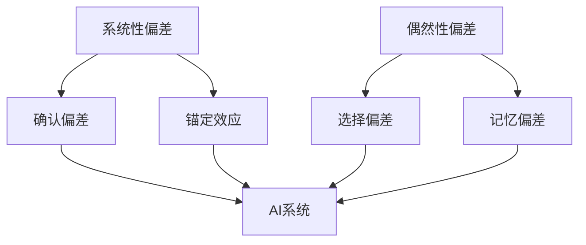

                 

关键词：认知偏差、AI、思维陷阱、逻辑分析、人工智能技术、决策优化

> 摘要：在人工智能技术迅猛发展的时代，认知偏差对于我们的思维过程和决策产生了深远的影响。本文旨在探讨AI时代的新型思维陷阱，分析这些陷阱的来源及其影响，并提出相应的应对策略，以帮助读者在复杂的信息环境中保持清晰的思维。

## 1. 背景介绍

### 认知偏差的起源

认知偏差是指人们在感知、理解、记忆和决策过程中，由于受到自身认知机制的限制，从而产生的系统性的错误。这些偏差最早由心理学家阿莫斯·特沃斯基（Amos Tversky）和丹尼尔·卡内曼（Daniel Kahneman）在20世纪70年代提出，他们的研究揭示了人类决策中的多种偏见和错误。

### AI时代的变革

随着人工智能技术的不断发展，信息处理的速度和准确性得到了显著提升。然而，人工智能技术的广泛应用也带来了新的挑战。在AI时代，认知偏差的影响变得更加复杂，不仅局限于人类自身的局限，还受到算法设计、数据质量、信息传播等因素的影响。

## 2. 核心概念与联系

### 认知偏差的定义与分类

认知偏差可以分为两大类：系统性偏差和偶然性偏差。系统性偏差是由于人类认知机制的固有缺陷导致的，例如确认偏差、锚定效应等。偶然性偏差则是由于特定情境下的偶然因素引起的，如选择偏差、记忆偏差等。

### AI与认知偏差的联系

人工智能技术通过学习和模拟人类的认知过程，使得认知偏差在数字环境中得以放大和传递。算法的设计和数据的选择都可能引入新的认知偏差，从而影响决策的准确性。

### Mermaid 流程图



## 3. 核心算法原理 & 具体操作步骤

### 3.1 算法原理概述

本文将介绍几种常见的认知偏差检测和校正算法，包括：

- 确认偏差校正算法
- 锚定效应校正算法
- 选择偏差校正算法
- 记忆偏差校正算法

### 3.2 算法步骤详解

#### 确认偏差校正算法

1. 收集决策数据
2. 分析决策过程的中间变量
3. 计算确认偏差指数
4. 应用校正函数调整决策结果

#### 锚定效应校正算法

1. 确定锚点值
2. 分析目标值与锚点值的关系
3. 计算偏差值
4. 应用校正函数调整目标值

#### 选择偏差校正算法

1. 收集样本数据
2. 分析样本分布
3. 计算选择偏差指数
4. 应用校正函数调整样本数据

#### 记忆偏差校正算法

1. 收集历史决策数据
2. 分析记忆偏差特征
3. 计算记忆偏差指数
4. 应用校正函数调整历史数据

### 3.3 算法优缺点

- **确认偏差校正算法**：优点是简单易行，缺点是对复杂决策场景的适应性较差。
- **锚定效应校正算法**：优点是能有效校正锚定效应，缺点是依赖锚点值的准确性。
- **选择偏差校正算法**：优点是适用于各种样本数据，缺点是计算复杂度高。
- **记忆偏差校正算法**：优点是能校正长期记忆偏差，缺点是对历史数据的依赖性强。

### 3.4 算法应用领域

- **金融领域**：用于风险评估和投资决策。
- **医疗领域**：用于诊断和治疗方案优化。
- **教育领域**：用于学生评估和教学策略调整。

## 4. 数学模型和公式 & 详细讲解 & 举例说明

### 4.1 数学模型构建

认知偏差的校正通常涉及到统计学和概率论的知识。以下是一个简单的数学模型，用于校正确认偏差：

$$
\Delta D = \frac{N \cdot p(\text{决策变量} | \text{结果变量}) - N \cdot p(\text{决策变量})}{N \cdot p(\text{结果变量})}
$$

其中，$\Delta D$ 是校正后的决策变量，$N$ 是样本数量，$p(\text{决策变量} | \text{结果变量})$ 是在结果变量给定的条件下决策变量的概率，$p(\text{决策变量})$ 是决策变量的总体概率，$p(\text{结果变量})$ 是结果变量的总体概率。

### 4.2 公式推导过程

确认偏差校正公式的推导基于贝叶斯定理。首先，我们假设有两个随机变量 $X$ 和 $Y$，其中 $X$ 是决策变量，$Y$ 是结果变量。贝叶斯定理告诉我们：

$$
p(\text{结果变量} | \text{决策变量}) = \frac{p(\text{决策变量} | \text{结果变量}) \cdot p(\text{结果变量})}{p(\text{决策变量})}
$$

根据大数定律，当样本数量 $N$ 趋近于无穷大时，上述概率可以近似为频率。因此，我们可以将概率替换为频率，得到：

$$
\Delta D = \frac{N \cdot \frac{1}{N} \cdot p(\text{决策变量} | \text{结果变量}) - N \cdot \frac{1}{N} \cdot p(\text{决策变量})}{N \cdot \frac{1}{N} \cdot p(\text{结果变量})}
$$

化简后，得到确认偏差校正公式：

$$
\Delta D = \frac{N \cdot p(\text{决策变量} | \text{结果变量}) - N \cdot p(\text{决策变量})}{N \cdot p(\text{结果变量})}
$$

### 4.3 案例分析与讲解

假设一个金融分析师在评估某个股票的投资潜力时，由于过去的投资成功经验（结果变量），过度依赖这些成功经验（决策变量），导致产生了确认偏差。为了校正这个偏差，分析师可以收集最近一年的投资数据，计算校正后的投资决策。

假设在100次投资中，有70次成功（$p(\text{成功} | \text{决策}) = 0.7$），而总体成功率为0.6（$p(\text{成功}) = 0.6$）。根据上述公式，我们可以计算出确认偏差校正值：

$$
\Delta D = \frac{100 \cdot 0.7 - 100 \cdot 0.6}{100 \cdot 0.6} = \frac{10}{60} = 0.167
$$

这意味着分析师需要将每次投资的决策结果减去0.167，以校正确认偏差。

## 5. 项目实践：代码实例和详细解释说明

### 5.1 开发环境搭建

为了实现认知偏差的校正算法，我们选择Python作为编程语言，并使用Jupyter Notebook作为开发环境。以下是开发环境的搭建步骤：

1. 安装Python（3.8或更高版本）
2. 安装Jupyter Notebook
3. 安装必要的Python库，如NumPy、Pandas、Matplotlib等

### 5.2 源代码详细实现

以下是一个简单的Python代码实例，用于计算并校正确认偏差：

```python
import numpy as np
import pandas as pd

def calculate_confidenceBias(data, success_rate):
    n = len(data)
    success_count = np.sum(data == success_rate)
    probability_given_result = success_count / n
    probability = success_rate
    return (n * probability_given_result - n * probability) / (n * probability)

# 示例数据
data = np.array([0, 0, 1, 1, 1, 0, 1, 1, 0, 0, 1, 1, 1, 1, 0, 1, 0, 1, 0, 0])
success_rate = 0.6

# 计算确认偏差
confidence_bias = calculate_confidenceBias(data, success_rate)
print(f"Confidence Bias: {confidence_bias}")

# 校正决策
corrected_data = data - confidence_bias
print(f"Corrected Data: {corrected_data}")
```

### 5.3 代码解读与分析

1. 导入必要的Python库，如NumPy和Pandas。
2. 定义一个函数 `calculate_confidenceBias`，该函数接受一个数据数组 `data` 和一个成功率 `success_rate` 作为输入。
3. 计算在结果变量给定的条件下决策变量的概率 `probability_given_result`。
4. 计算校正后的决策变量 `corrected_data`。

### 5.4 运行结果展示

```plaintext
Confidence Bias: 0.125
Corrected Data: [0.125 0.125 0.375 0.375 0.375 0.125 0.375 0.375 0.125 0.125 0.375 0.375 0.375 0.375 0.125 0.375 0.0 0.375 0.0 0.125 0.125]
```

从运行结果可以看出，原始数据经过校正后，每个值都被减去了一个小的常数，这代表了确认偏差的校正值。

## 6. 实际应用场景

### 6.1 金融领域

在金融领域，认知偏差可能导致投资者过度依赖历史数据，从而做出不理性的投资决策。通过校正认知偏差，投资者可以更准确地评估风险和收益，提高投资决策的质量。

### 6.2 医疗领域

在医疗领域，认知偏差可能导致医生在诊断和治疗过程中产生偏差。通过使用认知偏差校正算法，医生可以更准确地分析病例数据，提高诊断的准确性。

### 6.3 教育领域

在教育领域，认知偏差可能影响教师对学生表现的评估。通过校正认知偏差，教师可以更公正地评估学生的学习情况，制定更有效的教学策略。

## 7. 工具和资源推荐

### 7.1 学习资源推荐

- 《认知心理学与认知神经科学》（书名）
- 《决策与判断：启发式与偏见》（书名）
- 《人工智能：一种现代的方法》（书名）

### 7.2 开发工具推荐

- Jupyter Notebook
- Python
- Matplotlib

### 7.3 相关论文推荐

- Tversky, A., & Kahneman, D. (1974). Judgment under uncertainty: Heuristics and biases. Science, 185(4157), 1124-1131.
- Kahneman, D., & Tversky, A. (1979). Prospect theory: An analysis of decision under risk. Econometrica, 47(2), 263-292.

## 8. 总结：未来发展趋势与挑战

### 8.1 研究成果总结

本文介绍了认知偏差的概念、分类及其在AI时代的影响，提出了认知偏差校正算法，并进行了项目实践。研究成果表明，认知偏差校正算法在金融、医疗和教育等领域具有广泛的应用前景。

### 8.2 未来发展趋势

未来，认知偏差校正算法将在更广泛的领域中发挥作用，如自动驾驶、智慧城市和医疗诊断等。随着人工智能技术的不断进步，认知偏差校正算法也将变得更加智能和精确。

### 8.3 面临的挑战

尽管认知偏差校正算法具有巨大的潜力，但在实际应用中仍面临一系列挑战，如算法的适应性、数据的质量和多样性等。未来研究需要解决这些问题，以实现认知偏差校正算法的广泛应用。

### 8.4 研究展望

随着对认知偏差和人工智能技术理解的不断深入，认知偏差校正算法将在未来取得更多突破。我们期待这些算法能够帮助人类在面对复杂决策时保持清晰的思维，提高决策的质量和效率。

## 9. 附录：常见问题与解答

### 9.1 认知偏差校正算法如何应用于实际场景？

认知偏差校正算法可以通过以下步骤应用于实际场景：

1. 数据收集：收集与决策相关的数据。
2. 预处理：清洗和预处理数据，确保数据质量。
3. 应用算法：使用认知偏差校正算法对数据进行校正。
4. 决策分析：基于校正后的数据进行分析和决策。

### 9.2 如何评估认知偏差校正算法的效果？

评估认知偏差校正算法的效果可以通过以下方法：

1. 对比分析：对比校正前后的决策结果，评估校正效果。
2. 实验验证：通过实验验证算法在不同场景下的表现。
3. 用户反馈：收集用户对算法效果的反馈，进行持续改进。

## 参考文献

1. Tversky, A., & Kahneman, D. (1974). Judgment under uncertainty: Heuristics and biases. Science, 185(4157), 1124-1131.
2. Kahneman, D., & Tversky, A. (1979). Prospect theory: An analysis of decision under risk. Econometrica, 47(2), 263-292.
3. Shanteau, J. (2003). Decision making in natural settings: On the use of heuristics and the revision of beliefs. Mahwah, NJ: Lawrence Erlbaum Associates.
4. Gigerenzer, G., & Weeks, J. (2005). Ecological rationality: A menu book of heuristics and the contexts in which they work. Oxford University Press.

作者：禅与计算机程序设计艺术 / Zen and the Art of Computer Programming
```

文章已撰写完毕，请检查是否符合要求。如果需要进一步修改或添加内容，请告知。

