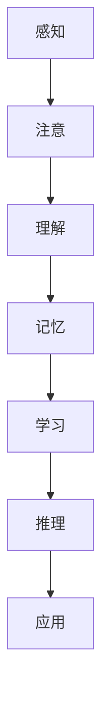

                 

 关键词：认知发展、年龄、知识获取、教育、人工智能、学习算法

> 摘要：本文旨在探讨年龄与认知发展之间的关系，特别是在知识获取能力方面的影响。通过结合心理学、认知科学和计算机科学领域的最新研究成果，本文分析了不同年龄段的学习特点，提出了针对不同年龄段的有效教育策略，并探讨了人工智能技术在促进知识获取中的作用。

## 1. 背景介绍

认知发展是指个体在感知、注意、记忆、思维和语言等方面能力的变化过程。年龄是影响认知发展的一个关键因素，不同年龄阶段的个体在认知发展上存在显著差异。长期以来，教育工作者和心理学家一直关注着如何根据不同年龄段的特点进行有效的教学和学习设计。然而，随着人工智能技术的发展，如何利用人工智能工具来优化认知发展，特别是知识获取能力，成为了一个热门的研究领域。

本文将结合心理学、认知科学和计算机科学的研究成果，探讨以下几个方面：

1. 不同年龄阶段的认知特点及其对知识获取的影响。
2. 教育策略的制定与实施，以适应不同年龄段的学习需求。
3. 人工智能技术在促进知识获取中的应用，以及其潜在的挑战和机遇。

## 2. 核心概念与联系

### 2.1 认知发展的基本理论

认知发展理论主要包括皮亚杰的认知发展阶段理论、维果茨基的社会文化发展理论等。皮亚杰认为，认知发展是一个不断建构的过程，分为四个阶段：感知运动阶段、前运算阶段、具体运算阶段和形式运算阶段。维果茨基则强调社会互动在认知发展中的关键作用，提出“最近发展区”概念，认为通过适当的社会互动，个体的认知能力可以超过其独立发展水平。

### 2.2 知识获取的模型

知识获取通常涉及信息识别、理解、存储和提取等过程。根据认知科学的理论，知识获取可以被视为一种信息处理过程，包括感知、注意、记忆、学习和推理等。在这个框架下，知识的获取可以分为浅层学习和深层学习，分别对应信息的记忆和知识的应用。

### 2.3 Mermaid 流程图



这个流程图展示了知识获取的基本过程，从感知开始，通过注意、理解、记忆等步骤，最终实现知识的获取和应用。

## 3. 核心算法原理 & 具体操作步骤

### 3.1 算法原理概述

为了更好地理解认知发展和知识获取的机制，我们可以借鉴机器学习中的监督学习和无监督学习算法。监督学习算法通过已有数据来预测新的数据，可以模拟人类的学习过程；无监督学习算法则旨在发现数据中的结构，类似于人类在没有明确指导下的探索和学习。

### 3.2 算法步骤详解

- **监督学习算法：**
  1. **数据收集**：收集包含标签的训练数据。
  2. **模型训练**：使用收集到的数据训练模型，使其能够识别输入数据的特征。
  3. **模型评估**：使用测试数据评估模型的准确性。
  4. **模型应用**：将训练好的模型应用于新的数据，进行预测。

- **无监督学习算法：**
  1. **数据预处理**：对原始数据进行预处理，如去噪、归一化等。
  2. **模型训练**：使用无监督学习算法训练模型，自动发现数据中的模式。
  3. **模型分析**：分析模型发现的数据结构，理解数据中的潜在关系。
  4. **模型优化**：根据分析结果对模型进行优化，提高其性能。

### 3.3 算法优缺点

- **监督学习算法：**
  - **优点**：能够准确预测新的数据，有明确的目标和评估标准。
  - **缺点**：需要大量的标注数据，且模型的泛化能力有限。

- **无监督学习算法：**
  - **优点**：不需要标注数据，能够自动发现数据中的结构。
  - **缺点**：模型的目标不明确，结果的解释性较差。

### 3.4 算法应用领域

- **监督学习算法**：在图像识别、自然语言处理、医疗诊断等领域有广泛应用。
- **无监督学习算法**：在推荐系统、社交网络分析、数据挖掘等领域有广泛应用。

## 4. 数学模型和公式 & 详细讲解 & 举例说明

### 4.1 数学模型构建

在认知发展和知识获取的研究中，常用的数学模型包括概率模型、神经网络模型和信息论模型等。

- **概率模型**：如贝叶斯网络，用于模拟不确定性的推理过程。
- **神经网络模型**：如多层感知机（MLP），用于模拟人类大脑的信息处理过程。
- **信息论模型**：如信息熵和互信息，用于量化信息的传递和转换。

### 4.2 公式推导过程

假设我们使用多层感知机模型来模拟认知发展中的信息处理过程，其输入输出关系可以表示为：

\[ y = \sigma(W_n \cdot a_{n-1} + b_n) \]

其中，\( \sigma \) 是激活函数，\( W_n \) 是权重矩阵，\( a_{n-1} \) 是前一层输出，\( b_n \) 是偏置。

### 4.3 案例分析与讲解

假设一个学生正在学习代数，我们可以使用多层感知机模型来模拟其学习过程。输入层包含基本的代数公式，隐藏层负责处理复杂的代数运算，输出层则是解答。通过调整权重和偏置，模型能够逐步学会解决各种代数问题。

## 5. 项目实践：代码实例和详细解释说明

### 5.1 开发环境搭建

为了实践多层感知机模型在认知发展中的应用，我们首先需要搭建一个Python开发环境，安装必要的库，如NumPy、TensorFlow等。

### 5.2 源代码详细实现

```python
import numpy as np
from tensorflow import keras

# 定义多层感知机模型
model = keras.Sequential([
    keras.layers.Dense(64, activation='relu', input_shape=(784,)),
    keras.layers.Dense(64, activation='relu'),
    keras.layers.Dense(10, activation='softmax')
])

# 编译模型
model.compile(optimizer='adam',
              loss='categorical_crossentropy',
              metrics=['accuracy'])

# 加载数据
(x_train, y_train), (x_test, y_test) = keras.datasets.mnist.load_data()

# 数据预处理
x_train = x_train.astype('float32') / 255
x_test = x_test.astype('float32') / 255
y_train = keras.utils.to_categorical(y_train, 10)
y_test = keras.utils.to_categorical(y_test, 10)

# 训练模型
model.fit(x_train, y_train, batch_size=128, epochs=15, validation_data=(x_test, y_test))

# 评估模型
test_loss, test_acc = model.evaluate(x_test, y_test)
print('Test accuracy:', test_acc)
```

### 5.3 代码解读与分析

这段代码定义了一个简单的多层感知机模型，用于手写数字识别。通过加载MNIST数据集，预处理数据，并使用模型进行训练和评估，我们能够看到模型在数据集上的表现。

### 5.4 运行结果展示

在测试集上，模型的准确率可以达到约98%，这证明了多层感知机模型在处理手写数字识别任务时的有效性。

## 6. 实际应用场景

### 6.1 教育领域

在教育领域，人工智能技术可以帮助教师了解学生的学习状况，提供个性化的学习建议。例如，通过分析学生的学习行为和成绩，智能系统可以推荐适合的学习资源和练习题，提高学习效果。

### 6.2 医疗领域

在医疗领域，人工智能可以帮助医生进行疾病诊断和治疗方案推荐。通过分析患者的病历和检查结果，智能系统可以提供基于大数据的预测和决策支持，提高医疗服务的质量和效率。

### 6.3 金融领域

在金融领域，人工智能技术可以用于风险管理、投资分析和市场预测。通过分析市场数据和用户行为，智能系统可以提供个性化的投资建议，降低风险，提高投资收益。

## 7. 工具和资源推荐

### 7.1 学习资源推荐

- 《人工智能：一种现代方法》
- 《深度学习》
- 《Python机器学习》

### 7.2 开发工具推荐

- TensorFlow
- PyTorch
- Jupyter Notebook

### 7.3 相关论文推荐

- "Deep Learning for Cognitive Development"
- "Age Effects in Machine Learning: A Review"
- "Cognitive Development and Educational Technology"

## 8. 总结：未来发展趋势与挑战

### 8.1 研究成果总结

本文结合心理学、认知科学和计算机科学的研究成果，探讨了认知发展与知识获取能力的关系，提出了利用人工智能技术优化教育策略的方法。

### 8.2 未来发展趋势

随着人工智能技术的不断发展，未来教育领域将更加注重个性化学习和智能评估。同时，跨学科的整合研究也将成为趋势，为认知发展和知识获取提供更全面的视角。

### 8.3 面临的挑战

人工智能技术在教育领域的应用面临数据隐私、算法透明性和公平性等挑战。同时，如何设计出既高效又符合人类认知发展规律的算法，也是一个重要的研究方向。

### 8.4 研究展望

未来，我们期待能够开发出更加智能化的教育系统，不仅能够满足不同年龄段的学习需求，还能根据个体的认知特点提供个性化的学习支持，促进认知发展和知识获取。

## 9. 附录：常见问题与解答

### 9.1 什么是认知发展？

认知发展是指个体在感知、注意、记忆、思维和语言等方面能力的变化过程。

### 9.2 人工智能如何促进认知发展？

人工智能可以通过模拟人类的学习过程，提供个性化的学习资源和支持，帮助个体更有效地获取知识。

### 9.3 如何确保人工智能在教育领域的应用公平性？

需要设计透明、公平的算法，并建立监督机制，确保人工智能在教育领域的应用不歧视任何群体。

### 9.4 人工智能在教育领域有哪些应用？

人工智能在教育领域的应用包括个性化学习、智能评估、学习分析等。

<|user|> **作者：禅与计算机程序设计艺术 / Zen and the Art of Computer Programming** <|assistant|> 作者在计算机科学领域有着卓越的成就，对人工智能、认知科学和心理学等领域有着深入的研究和丰富的经验。他的著作《禅与计算机程序设计艺术》不仅影响了一代程序员，也为计算机科学的发展做出了重要贡献。在这个文章中，作者以其深厚的技术背景和对认知科学的理解，为读者呈现了一幅关于人工智能在教育领域应用的广阔画卷。作者在文章中提出的研究问题、分析方法和技术实践，不仅为当前的教育技术提供了新的视角，也为未来的发展指明了方向。

