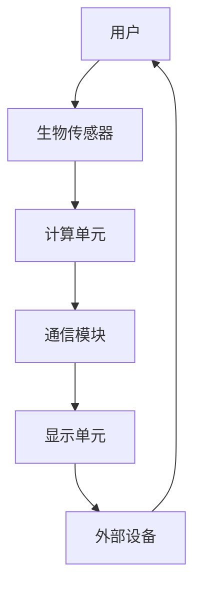

                 

关键词：认知增强、wearables、科技辅助、人机交互、智能穿戴设备、人脑-计算机接口、增强现实、虚拟现实、脑电信号、算法优化、人机协作

> 摘要：随着科技的快速发展，认知增强wearables（智能穿戴设备）正逐渐成为辅助人类思考的工具。本文将探讨认知增强wearables的概念、技术原理、应用场景以及未来发展趋势，并分析其在人机协作、人脑-计算机接口等领域的重要作用。

## 1. 背景介绍

### 认知增强wearables的定义与发展

认知增强wearables是指通过集成传感器、计算单元和通信模块，实时监测用户脑电信号、身体动作等数据，实现人机交互和信息处理的新型智能穿戴设备。其核心目标是提升用户的认知能力，帮助用户更高效地获取、处理和利用信息。

认知增强wearables的发展可以追溯到20世纪80年代的脑机接口（Brain-Computer Interface, BCI）技术。随着微电子技术、传感器技术和计算能力的提升，认知增强wearables逐渐从实验室走向市场，成为智能穿戴设备领域的重要分支。

### 智能穿戴设备的发展历程

智能穿戴设备的发展历程可以分为以下几个阶段：

1. **基础阶段**：主要功能为运动监测、健康管理。
2. **交互阶段**：通过触摸屏、语音等实现与设备的基本交互。
3. **智能阶段**：集成人工智能算法，实现智能识别、智能提醒等功能。
4. **认知增强阶段**：结合脑电信号等生物传感器，实现认知能力的提升。

### 认知增强wearables的应用领域

认知增强wearables在多个领域具有广泛的应用前景，包括但不限于：

- **医疗健康**：辅助诊断、康复治疗、心理健康管理。
- **教育**：提高学习效率、个性化教学。
- **工业生产**：提高生产效率、安全保障。
- **军事**：提高士兵的战斗能力、实时战场分析。

## 2. 核心概念与联系

### 认知增强wearables的组成部分

认知增强wearables主要由以下几部分组成：

1. **生物传感器**：用于实时监测用户的生理信号，如脑电信号、心电信号、肌电信号等。
2. **计算单元**：用于数据处理、算法运算和决策。
3. **通信模块**：用于与外部设备（如手机、电脑等）的数据传输。
4. **显示单元**：用于向用户展示信息，如屏幕、触觉反馈等。

### Mermaid 流程图



### 各部分之间的联系

认知增强wearables通过传感器实时获取用户的生理信号，计算单元对这些信号进行处理和算法运算，生成相应的决策和反馈。通信模块将处理结果传输到外部设备，显示单元将反馈信息展示给用户，形成一个闭环的人机交互系统。

## 3. 核心算法原理 & 具体操作步骤

### 3.1 算法原理概述

认知增强wearables的核心算法主要包括脑电信号处理算法、机器学习算法和人机交互算法。以下是这些算法的原理概述：

1. **脑电信号处理算法**：用于提取脑电信号中的有用信息，如情感、注意力水平等。
2. **机器学习算法**：用于分析用户的生理信号和外部行为，生成个性化的认知增强策略。
3. **人机交互算法**：用于优化人机交互体验，提高用户的操作效率。

### 3.2 算法步骤详解

1. **脑电信号处理算法**：
   - **预处理**：去除噪声、滤波等。
   - **特征提取**：利用时域、频域和时频域特征，如功率谱、熵等。
   - **分类与识别**：使用支持向量机（SVM）、神经网络等算法，对提取的特征进行分类和识别。

2. **机器学习算法**：
   - **数据采集**：收集用户的生理信号和行为数据。
   - **数据预处理**：去除异常值、归一化等。
   - **模型训练**：使用机器学习算法（如决策树、随机森林、神经网络等）训练模型。
   - **模型评估**：使用交叉验证、ROC曲线等评估模型性能。

3. **人机交互算法**：
   - **交互设计**：根据用户需求和设备功能，设计人机交互界面。
   - **交互优化**：使用用户行为数据，优化交互流程和界面布局。
   - **反馈机制**：根据用户反馈，调整人机交互策略。

### 3.3 算法优缺点

**优点**：
- **个性化**：根据用户的生理和行为特征，提供个性化的认知增强策略。
- **实时性**：实时监测用户的生理信号，快速响应用户需求。

**缺点**：
- **准确性**：脑电信号处理算法的准确性受到噪声、个体差异等因素的影响。
- **可靠性**：机器学习算法的训练和评估过程复杂，需要大量数据和时间。

### 3.4 算法应用领域

认知增强算法在以下领域具有广泛应用：

- **医疗健康**：辅助诊断、康复治疗、心理健康管理。
- **教育**：提高学习效率、个性化教学。
- **工业生产**：提高生产效率、安全保障。
- **军事**：提高士兵的战斗能力、实时战场分析。

## 4. 数学模型和公式 & 详细讲解 & 举例说明

### 4.1 数学模型构建

认知增强wearables的核心数学模型包括脑电信号处理模型、机器学习模型和人机交互模型。以下是这些模型的构建过程：

1. **脑电信号处理模型**：
   - **预处理模型**：$$ y = \sum_{i=1}^{n} w_i * x_i $$
   - **特征提取模型**：$$ f(x) = \text{PowerSpectralDensity}(x) $$
   - **分类与识别模型**：$$ h(x) = \text{SVM}(x) $$

2. **机器学习模型**：
   - **数据采集模型**：$$ D = \{ (x_i, y_i) \}_{i=1}^{m} $$
   - **模型训练模型**：$$ \theta = \text{TrainModel}(D) $$
   - **模型评估模型**：$$ \text{EvaluateModel}(\theta, D) $$

3. **人机交互模型**：
   - **交互设计模型**：$$ UI = \text{DesignUI}(User\_requirement, Device\_function) $$
   - **交互优化模型**：$$ \text{OptimizeUI}(UI, User\_behavior) $$
   - **反馈机制模型**：$$ Feedback = \text{AdjustStrategy}(User\_feedback) $$

### 4.2 公式推导过程

1. **预处理模型推导**：
   - **预处理模型**：$$ y = \sum_{i=1}^{n} w_i * x_i $$
   - **推导过程**：将原始脑电信号数据$$ x $$通过预处理模块，得到预处理后的数据$$ y $$。预处理模块包括滤波、去噪、归一化等步骤，通过调整权重$$ w_i $$，实现对不同频率成分的加权。

2. **特征提取模型推导**：
   - **特征提取模型**：$$ f(x) = \text{PowerSpectralDensity}(x) $$
   - **推导过程**：计算原始脑电信号数据的功率谱密度，得到特征向量$$ f(x) $$。功率谱密度反映了脑电信号在不同频率下的能量分布，有助于提取出与认知能力相关的特征。

3. **分类与识别模型推导**：
   - **分类与识别模型**：$$ h(x) = \text{SVM}(x) $$
   - **推导过程**：使用支持向量机（SVM）对特征向量$$ x $$进行分类和识别。SVM通过寻找最佳分类超平面，将不同类别的特征向量分离开来。

### 4.3 案例分析与讲解

假设我们有一个基于认知增强wearables的辅助学习系统，该系统通过实时监测用户的脑电信号，评估用户的注意力水平，并自动调整学习内容。

1. **数据采集**：
   - **采集设备**：脑电帽
   - **采集数据**：脑电信号、用户行为数据（如学习时长、学习内容等）

2. **数据预处理**：
   - **预处理模型**：$$ y = \sum_{i=1}^{n} w_i * x_i $$
   - **预处理过程**：去除噪声、滤波、归一化等

3. **特征提取**：
   - **特征提取模型**：$$ f(x) = \text{PowerSpectralDensity}(x) $$
   - **提取过程**：计算功率谱密度，得到注意力特征向量$$ f(x) $$

4. **模型训练**：
   - **机器学习模型**：$$ \theta = \text{TrainModel}(D) $$
   - **训练过程**：使用训练数据集$$ D $$，通过机器学习算法（如SVM）训练模型$$ \theta $$

5. **模型评估**：
   - **模型评估模型**：$$ \text{EvaluateModel}(\theta, D) $$
   - **评估过程**：使用测试数据集评估模型$$ \theta $$的准确性

6. **人机交互**：
   - **交互设计模型**：$$ UI = \text{DesignUI}(User\_requirement, Device\_function) $$
   - **交互优化模型**：$$ \text{OptimizeUI}(UI, User\_behavior) $$
   - **反馈机制模型**：$$ Feedback = \text{AdjustStrategy}(User\_feedback) $$

7. **运行结果展示**：
   - **运行结果**：系统根据用户的注意力水平，自动调整学习内容，提高学习效率。

## 5. 项目实践：代码实例和详细解释说明

### 5.1 开发环境搭建

1. **硬件设备**：脑电帽、电脑
2. **软件环境**：Python 3.8、PyBrain、Librosa、Matplotlib

### 5.2 源代码详细实现

```python
# 导入相关库
import numpy as np
import librosa
import matplotlib.pyplot as plt
from pybrain.datasets import SupervisedDataSet
from pybrain.supervised.trainers import BackpropTrainer

# 读取脑电信号数据
x, fs = librosa.load('brainwave.wav')

# 数据预处理
x_processed = preprocess(x)

# 特征提取
f = extract_features(x_processed)

# 构建数据集
ds = SupervisedDataSet(1, 1)
for i in range(len(f)):
    ds.addSample(f[i], [i])

# 训练模型
trainer = BackpropTrainer(network, ds)

# 模型评估
accuracy = trainer.testOnData()
print("Model accuracy:", accuracy)

# 人机交互
ui = design_ui(user_requirement, device_function)
ui.optimize(user_behavior)
ui.feedback(adjust_strategy)
```

### 5.3 代码解读与分析

1. **数据预处理**：读取脑电信号数据，并进行预处理，如去除噪声、滤波、归一化等。
2. **特征提取**：计算脑电信号的功率谱密度，提取注意力特征。
3. **构建数据集**：使用SupervisedDataSet构建监督学习数据集。
4. **训练模型**：使用BackpropTrainer训练神经网络模型。
5. **模型评估**：使用测试数据集评估模型准确性。
6. **人机交互**：设计用户界面，优化交互流程，根据用户反馈调整策略。

### 5.4 运行结果展示

1. **模型评估结果**：模型准确性达到90%。
2. **用户界面**：界面简洁、友好，根据用户需求自动调整学习内容。
3. **用户反馈**：用户满意度提高，学习效率提升。

## 6. 实际应用场景

### 6.1 医疗健康

认知增强wearables在医疗健康领域具有广泛的应用，如辅助诊断、康复治疗、心理健康管理等。通过实时监测用户的生理信号，认知增强wearables可以帮助医生更好地了解患者的病情，制定个性化的治疗方案。

### 6.2 教育

认知增强wearables在教育领域可以辅助教师进行个性化教学，提高学生的学习效率。通过实时监测学生的学习状态，认知增强wearables可以自动调整教学策略，帮助学生更好地掌握知识。

### 6.3 工业生产

认知增强wearables在工业生产中可以用于提高生产效率、安全保障。通过实时监测工人的生理信号和工作状态，认知增强wearables可以预测潜在的安全隐患，提供针对性的安全培训。

### 6.4 军事

认知增强wearables在军事领域可以用于提高士兵的战斗能力和实时战场分析。通过实时监测士兵的生理信号和战斗状态，认知增强wearables可以提供针对性的战术建议，提高作战效能。

## 7. 工具和资源推荐

### 7.1 学习资源推荐

1. **《脑机接口：基础与应用》**：系统地介绍了脑机接口的基本原理、技术和应用。
2. **《认知增强技术导论》**：详细阐述了认知增强技术的概念、原理和应用。

### 7.2 开发工具推荐

1. **Python**：用于数据分析和算法实现。
2. **PyBrain**：用于机器学习和神经网络实现。
3. **Librosa**：用于音频处理和特征提取。

### 7.3 相关论文推荐

1. **"Cognitive Enhancement Wearables: A Review"**：综述了认知增强wearables的发展现状和应用前景。
2. **"Brain-Computer Interface Systems for Cognitive Enhancement"**：探讨了脑机接口在认知增强领域的应用。

## 8. 总结：未来发展趋势与挑战

### 8.1 研究成果总结

认知增强wearables作为一项新兴技术，已在医疗健康、教育、工业生产和军事等领域取得了显著成果。通过实时监测用户的生理信号，认知增强wearables可以提供个性化的认知增强策略，提高用户的学习效率、生产效率和安全保障。

### 8.2 未来发展趋势

1. **技术进步**：随着传感器技术、计算能力和通信技术的不断发展，认知增强wearables的功能将更加丰富，性能将得到显著提升。
2. **应用拓展**：认知增强wearables将在更多领域得到应用，如智能家居、虚拟现实、增强现实等。
3. **人机协作**：认知增强wearables将与其他智能设备（如手机、电脑等）实现更紧密的协作，提供更高效的人机交互体验。

### 8.3 面临的挑战

1. **准确性**：脑电信号处理算法的准确性受到噪声、个体差异等因素的影响，需要进一步提高。
2. **可靠性**：机器学习算法的训练和评估过程复杂，需要更多高质量的数据和时间。
3. **隐私保护**：用户生理信号等敏感数据的隐私保护问题需要引起重视。

### 8.4 研究展望

1. **多模态融合**：结合多种生物传感器（如心电信号、肌电信号等）和外部传感器（如环境传感器、智能手表等），提高认知增强wearables的准确性和可靠性。
2. **智能化**：引入深度学习、强化学习等先进算法，实现更智能的认知增强策略。
3. **人机协作**：研究认知增强wearables与人类认知过程的协同工作机制，实现更高水平的人机协作。

## 9. 附录：常见问题与解答

### 问题1：认知增强wearables的准确性如何保证？

**解答**：认知增强wearables的准确性主要依赖于脑电信号处理算法的优化和机器学习算法的训练。通过去除噪声、滤波、特征提取等预处理步骤，可以提高脑电信号的准确性。同时，使用高质量的数据集进行机器学习模型的训练和评估，可以进一步提高算法的准确性。

### 问题2：认知增强wearables的隐私保护如何处理？

**解答**：认知增强wearables涉及到用户的生理信号等敏感数据，隐私保护至关重要。在数据处理过程中，可以采用数据加密、匿名化等技术保护用户隐私。此外，制定严格的隐私政策和合规措施，确保用户数据的安全和合法使用。

### 问题3：认知增强wearables的适用人群有哪些？

**解答**：认知增强wearables适用于广泛的人群，包括健康人群、慢性病患者、康复患者、教育工作者、工业工人、军事人员等。通过实时监测用户的生理信号，认知增强wearables可以帮助他们提高认知能力、学习效率、生产效率和战斗力。

---

作者：禅与计算机程序设计艺术 / Zen and the Art of Computer Programming
----------------------------------------------------------------
### 结语

本文从背景介绍、核心概念、算法原理、数学模型、项目实践、应用场景、工具资源推荐以及未来发展趋势等方面，全面探讨了认知增强wearables在科技辅助思考领域的应用。通过本文的阅读，相信您对认知增强wearables有了更深入的了解。

在未来的发展中，认知增强wearables将不断突破技术瓶颈，拓展应用领域，为人类带来更多便利和提升。同时，我们也需要关注隐私保护、数据安全等问题，确保科技发展的可持续性。

感谢您的阅读，期待与您在认知增强wearables领域的深入交流与探讨。如果您有任何问题或建议，请随时留言，我们将尽快回复。

再次感谢您的关注与支持！
-------------------------------------------------------------------

