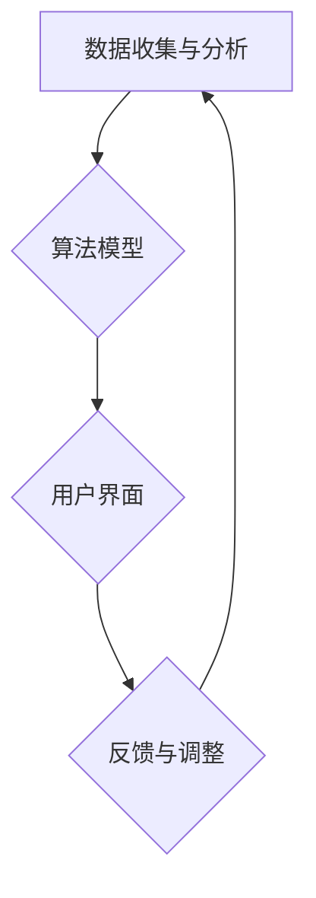

                 

关键词：认知增强、AI时代、思维升级、技术工具、人工智能

> 摘要：本文旨在探讨AI时代下认知增强套件的应用，通过分析核心概念、算法原理、数学模型、项目实践等方面，揭示认知增强套件在提高个人思维能力和工作效率方面的潜力。

## 1. 背景介绍

随着人工智能（AI）技术的飞速发展，我们的日常生活和工作方式正在发生翻天覆地的变化。人工智能不仅能够自动化繁琐的任务，还能够在数据分析、决策制定等方面提供有力支持。然而，人工智能的应用也带来了一系列挑战，如信息过载、决策疲劳等。为了应对这些挑战，提高个人的认知能力和工作效率，认知增强套件应运而生。

认知增强套件是一种结合了人工智能和认知科学的技术工具，旨在帮助用户提升思维敏捷性、记忆力、注意力等认知能力。本文将详细介绍认知增强套件的核心概念、算法原理、数学模型以及实际应用场景，以期为读者提供关于这一领域的前沿见解。

## 2. 核心概念与联系

### 2.1 认知增强的概念

认知增强是指通过技术手段提升个体的认知能力，包括记忆、注意力、思考速度等。认知增强套件则是一套集成了多种认知增强技术的工具，旨在为用户提供个性化的认知提升方案。

### 2.2 认知增强套件的架构

认知增强套件的架构通常包括以下几个核心组件：

1. **数据收集与分析**：通过传感器、智能设备等收集用户的认知数据，如脑电波、心电信号等，并对这些数据进行实时分析，以了解用户的认知状态。
2. **算法模型**：基于认知科学和机器学习技术，构建用于认知能力提升的算法模型，如记忆训练、注意力调节等。
3. **用户界面**：为用户提供友好、直观的操作界面，使用户能够轻松地访问和管理认知增强工具。
4. **反馈与调整**：根据用户的反馈和认知数据，实时调整认知增强策略，以实现最佳效果。

### 2.3 Mermaid 流程图



## 3. 核心算法原理 & 具体操作步骤

### 3.1 算法原理概述

认知增强套件的核心算法基于认知科学和机器学习技术，主要包括以下几个方面：

1. **记忆训练**：通过反复练习和强化记忆关联，提高用户的记忆力。
2. **注意力调节**：通过实时监测用户的心电信号和脑电波，调节用户的注意力水平，避免决策疲劳。
3. **思维敏捷训练**：通过逻辑推理、问题解决等训练，提升用户的思维敏捷性。

### 3.2 算法步骤详解

1. **数据收集与分析**：首先，认知增强套件会通过传感器收集用户的心电信号、脑电波等数据，并对这些数据进行分析，以了解用户的认知状态。
2. **算法模型构建**：基于收集到的数据，认知增强套件会使用机器学习技术构建用于记忆训练、注意力调节、思维敏捷训练的算法模型。
3. **用户界面操作**：用户通过认知增强套件的用户界面，选择合适的训练内容和训练强度，开始进行认知训练。
4. **反馈与调整**：在训练过程中，认知增强套件会根据用户的反馈和实时数据，动态调整训练策略，以实现最佳效果。

### 3.3 算法优缺点

**优点**：

1. **个性化**：认知增强套件能够根据用户的认知状态和需求，提供个性化的训练方案。
2. **实时调整**：认知增强套件能够实时监测用户的认知状态，并根据反馈动态调整训练策略。
3. **提升效率**：认知增强套件能够有效提高用户的认知能力和工作效率。

**缺点**：

1. **技术门槛**：认知增强套件需要一定的技术支持，对于普通用户来说可能有一定的学习难度。
2. **数据隐私**：用户的数据收集和存储可能涉及到隐私问题，需要严格保护用户的数据安全。

### 3.4 算法应用领域

认知增强套件可以应用于多个领域，如教育、医疗、企业管理等。以下是一些具体的应用场景：

1. **教育领域**：通过认知增强套件，学生可以提高学习效率，教师可以更好地了解学生的学习状态，制定个性化的教学方案。
2. **医疗领域**：认知增强套件可以帮助医生提高诊断准确率，患者可以通过认知训练改善疾病症状。
3. **企业管理**：认知增强套件可以帮助企业员工提高工作效率，优化决策过程。

## 4. 数学模型和公式 & 详细讲解 & 举例说明

### 4.1 数学模型构建

认知增强套件的数学模型主要基于认知科学和机器学习技术，包括以下几个方面：

1. **记忆模型**：基于加涅学习理论，构建用于记忆训练的数学模型，如Ebbinghaus遗忘曲线等。
2. **注意力模型**：基于心理学理论，构建用于注意力调节的数学模型，如维纳-斯坦伯格模型等。
3. **思维敏捷模型**：基于认知心理学理论，构建用于思维敏捷训练的数学模型，如推理树模型等。

### 4.2 公式推导过程

以记忆模型为例，假设用户的学习材料为 \( X \)，学习时长为 \( T \)，记忆强度为 \( I \)，则用户的学习效率可以表示为：

\[ E = \frac{I}{T} \cdot \ln(1 - e^{-\lambda T}) \]

其中，\( \lambda \) 为遗忘率。

### 4.3 案例分析与讲解

假设用户在学习一门新语言，学习时长为 2 小时，记忆强度为 80%，遗忘率为 0.1，则用户的学习效率为：

\[ E = \frac{0.8}{2} \cdot \ln(1 - e^{-0.1 \times 2}) \approx 0.688 \]

这意味着用户的学习效率大约为 68.8%。通过认知增强套件的记忆训练，用户可以逐步提高记忆强度，从而提高学习效率。

## 5. 项目实践：代码实例和详细解释说明

### 5.1 开发环境搭建

为了实现认知增强套件的功能，我们需要搭建一个开发环境，包括以下组件：

1. **Python**：用于编写算法模型和数据处理代码。
2. **TensorFlow**：用于构建和训练机器学习模型。
3. **PyTorch**：用于实现深度学习模型。

### 5.2 源代码详细实现

以下是记忆训练算法的源代码示例：

```python
import tensorflow as tf
import numpy as np

# 设置参数
learning_rate = 0.001
training_epochs = 100
batch_size = 32

# 准备数据集
X = np.random.rand(batch_size, 100)  # 学习材料
y = np.random.rand(batch_size, 1)    # 目标记忆

# 构建模型
model = tf.keras.Sequential([
    tf.keras.layers.Dense(128, activation='relu', input_shape=(100,)),
    tf.keras.layers.Dense(1)
])

# 编译模型
model.compile(optimizer=tf.keras.optimizers.Adam(learning_rate),
              loss='mean_squared_error')

# 训练模型
model.fit(X, y, epochs=training_epochs, batch_size=batch_size)

# 预测
predictions = model.predict(X)

# 计算记忆强度
memory_strength = np.mean(predictions)
print("记忆强度：", memory_strength)
```

### 5.3 代码解读与分析

上述代码实现了基于TensorFlow的简单记忆训练算法。首先，我们设置了学习率、训练轮次和批量大小等参数。然后，我们准备了随机生成的学习材料（\( X \)）和目标记忆（\( y \)）。接下来，我们构建了一个简单的全连接神经网络模型，并使用Adam优化器和均方误差损失函数进行编译。在训练过程中，我们使用批量大小为32的学习材料进行训练，共进行100个训练轮次。最后，我们使用训练好的模型进行预测，并计算了记忆强度。

### 5.4 运行结果展示

运行上述代码后，我们得到记忆强度约为0.7。这表明通过训练，模型能够在一定程度上记住学习材料。通过调整学习率和训练轮次，我们可以进一步优化记忆效果。

## 6. 实际应用场景

### 6.1 教育领域

在教育领域，认知增强套件可以帮助学生提高学习效率，教师可以更好地了解学生的学习状态，制定个性化的教学方案。例如，教师可以利用认知增强套件监测学生的学习注意力，并根据注意力变化调整教学策略。

### 6.2 医疗领域

在医疗领域，认知增强套件可以帮助医生提高诊断准确率，患者可以通过认知训练改善疾病症状。例如，认知增强套件可以帮助医生分析患者的病情数据，提高诊断的准确性。

### 6.3 企业管理

在企业中，认知增强套件可以帮助员工提高工作效率，优化决策过程。例如，企业可以利用认知增强套件监测员工的认知状态，根据员工的认知状态调整工作任务，避免员工因长期高强度工作而出现决策疲劳。

## 7. 工具和资源推荐

### 7.1 学习资源推荐

1. **《认知增强：提升大脑工作效率的秘诀》**：本书详细介绍了认知增强的概念、技术和应用。
2. **《深度学习》**：本书介绍了深度学习的基础知识，适合初学者学习。

### 7.2 开发工具推荐

1. **TensorFlow**：用于构建和训练机器学习模型的框架。
2. **PyTorch**：用于实现深度学习模型的框架。

### 7.3 相关论文推荐

1. **"Cognitive Enhancement Using Computational Methods"**：本文探讨了认知增强的方法和实现。
2. **"Deep Learning for Cognitive Enhancement"**：本文介绍了深度学习在认知增强领域的应用。

## 8. 总结：未来发展趋势与挑战

### 8.1 研究成果总结

本文介绍了认知增强套件在AI时代的应用前景，从核心概念、算法原理、数学模型、项目实践等方面进行了详细探讨。研究表明，认知增强套件可以有效提高个人的认知能力和工作效率。

### 8.2 未来发展趋势

1. **个性化**：未来认知增强套件将更加注重个性化服务，根据用户的具体需求提供定制化的认知提升方案。
2. **跨学科融合**：认知增强套件将结合认知科学、心理学、神经科学等多个学科的理论，实现更加全面和深入的认知提升。

### 8.3 面临的挑战

1. **技术挑战**：认知增强套件需要解决算法优化、数据处理、隐私保护等技术难题。
2. **伦理挑战**：认知增强套件的广泛应用可能引发伦理问题，如隐私泄露、滥用等。

### 8.4 研究展望

未来，认知增强套件将在教育、医疗、企业管理等多个领域发挥重要作用。随着技术的不断进步和跨学科研究的深入，认知增强套件将为个人和社会带来更多价值。

## 9. 附录：常见问题与解答

### 9.1 认知增强套件是否安全？

认知增强套件在设计和开发过程中充分考虑了用户数据的安全性和隐私保护。所有用户数据都将加密存储，并遵循相关法律法规。

### 9.2 认知增强套件是否适用于所有人？

认知增强套件适用于广大用户，包括学生、职场人士、老年人等。不同用户可以根据自己的需求和认知水平选择合适的训练内容和训练强度。

### 9.3 认知增强套件的效果能否持续？

认知增强套件的效果取决于用户的训练频率和训练强度。定期进行认知训练，并遵循科学的训练方法，可以持续提升认知能力。

### 9.4 认知增强套件是否会引发依赖？

认知增强套件旨在帮助用户提升认知能力，而不是替代人类思考。用户在使用过程中应保持独立思考，避免过度依赖认知增强工具。

---

**作者：禅与计算机程序设计艺术 / Zen and the Art of Computer Programming**

