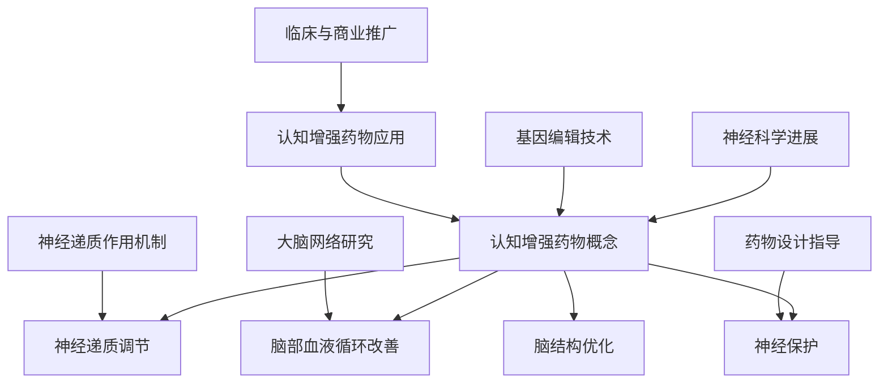

                 

关键词：认知增强药物、智力提升、伦理争议、技术进步、人类未来

> 摘要：本文探讨了认知增强药物的兴起及其带来的伦理争议。随着技术的进步，认知增强药物成为了一种可能提升人类智力水平的新途径。然而，这一领域的快速发展引发了关于安全、道德和个人自由的广泛讨论。本文将从技术、伦理和未来的角度，深入分析这一问题的复杂性。

## 1. 背景介绍

### 认知增强药物的兴起

认知增强药物，或称智慧药（nootropic），是指那些旨在提高大脑功能，特别是认知功能的药物。从古至今，人类一直在寻找能够增强记忆、注意力、创造力和学习能力的方法。如今，随着神经科学和药理学的发展，认知增强药物逐渐成为了一个备受关注的研究领域。

近年来，神经可塑性研究、神经递质调节、基因编辑等技术的发展，为认知增强药物的研发提供了新的可能。一些药物，如利他林（Ritalin）、普拉克索（Modafinil）等，已被广泛应用于治疗注意力缺陷多动障碍（ADHD）和其他认知功能障碍。然而，随着这些药物的使用范围不断扩大，人们开始考虑其作为一种智力提升工具的潜力。

### 技术进步与智力提升

在21世纪，人工智能、大数据分析、生物技术等领域的飞速发展，使得我们对于大脑的理解越来越深入。神经科学的研究揭示了大脑的复杂性和潜力，这为认知增强药物的开发提供了理论支持。同时，基因编辑技术的进步，如CRISPR，也为个性化医疗和智力提升带来了新的可能。

## 2. 核心概念与联系

### 认知增强药物的概念

认知增强药物，是指通过调节神经递质、改善脑部血液循环、增强神经连接等方式，提高大脑认知功能的药物。这些药物可以作用于大脑的多个层面，包括提高注意力、增强记忆、加快思维速度等。

### 认知增强药物的作用机制

认知增强药物的作用机制多样，主要包括以下几方面：

- **神经递质调节**：通过调节神经递质的浓度和活性，改善大脑的信号传递。
- **脑部血液循环改善**：通过扩张血管、增加血流量，提高脑部营养供应。
- **神经保护**：通过抗氧
```markdown
# 认知增强药物：提升智力的伦理争议

## 1. 背景介绍

### 认知增强药物的概念

认知增强药物，又称智慧药（nootropic），是指通过调节神经递质、改善脑部血液循环、增强神经连接等方式，提高大脑认知功能的药物。这些药物可以作用于大脑的多个层面，包括提高注意力、增强记忆、加快思维速度等。

### 认知增强药物的作用机制

认知增强药物的作用机制多样，主要包括以下几方面：

- **神经递质调节**：通过调节神经递质的浓度和活性，改善大脑的信号传递。
- **脑部血液循环改善**：通过扩张血管、增加血流量，提高脑部营养供应。
- **神经保护**：通过抗氧化、清除自由基等方式，保护神经细胞不受损伤。
- **脑结构优化**：通过促进神经新生、增加突触连接等，改善脑部结构。

### 技术进步与智力提升

在21世纪，人工智能、大数据分析、生物技术等领域的飞速发展，使得我们对于大脑的理解越来越深入。神经科学的研究揭示了大脑的复杂性和潜力，这为认知增强药物的开发提供了理论支持。同时，基因编辑技术的进步，如CRISPR，也为个性化医疗和智力提升带来了新的可能。

### 神经科学与认知增强药物

神经科学的研究进展，特别是对大脑结构和功能的深入了解，为认知增强药物的研发提供了重要基础。例如，通过研究神经递质的作用机制，科学家们能够设计出针对性的药物，以增强或抑制特定类型的神经传递。此外，对大脑网络结构和功能的研究，也为认知增强药物的选择和设计提供了指导。

### 认知增强药物的应用

目前，认知增强药物已经在多个领域得到应用，包括医学、教育、军事和商业。例如，利他林（Ritalin）和普拉克索（Modafinil）等药物，已被广泛应用于治疗注意力缺陷多动障碍（ADHD）和其他认知功能障碍。同时，一些新型的认知增强药物，如安非拉酮（Adderall）、费林肽（Felinine）等，也在进行临床试验和商业推广。

## 2. 核心概念与联系（Mermaid 流程图）



## 3. 核心算法原理 & 具体操作步骤

### 3.1 算法原理概述

认知增强药物的研发，涉及多个核心算法原理，包括神经递质调节算法、脑部血液循环优化算法、神经保护算法和脑结构优化算法。这些算法的基本原理如下：

- **神经递质调节算法**：通过分析神经递质的浓度和活性，设计出针对性的药物，以增强或抑制特定类型的神经传递。
- **脑部血液循环优化算法**：通过分析血管的扩张和收缩情况，以及血流量变化，设计出改善脑部血液循环的药物。
- **神经保护算法**：通过分析氧化应激和自由基的产生，设计出具有抗氧化性的药物，以保护神经细胞不受损伤。
- **脑结构优化算法**：通过分析神经新生、突触连接等指标，设计出促进脑结构改善的药物。

### 3.2 算法步骤详解

#### 神经递质调节算法

1. 数据采集：收集神经元活动的数据，包括神经递质的浓度和活性。
2. 数据预处理：对采集到的数据进行清洗和预处理，以消除噪声和异常值。
3. 特征提取：从预处理后的数据中提取关键特征，如神经递质的浓度、活性等。
4. 模型训练：使用机器学习算法，如支持向量机（SVM）、神经网络（NN）等，对提取的特征进行训练。
5. 预测与优化：根据训练结果，预测神经递质调节的最佳参数，并进行药物设计。

#### 脑部血液循环优化算法

1. 数据采集：收集血管的扩张和收缩情况，以及血流量变化的数据。
2. 数据预处理：对采集到的数据进行清洗和预处理，以消除噪声和异常值。
3. 特征提取：从预处理后的数据中提取关键特征，如血管直径、血流量等。
4. 模型训练：使用机器学习算法，如支持向量机（SVM）、神经网络（NN）等，对提取的特征进行训练。
5. 预测与优化：根据训练结果，预测最佳血管直径和血流量，并进行药物设计。

#### 神经保护算法

1. 数据采集：收集氧化应激和自由基产生的数据。
2. 数据预处理：对采集到的数据进行清洗和预处理，以消除噪声和异常值。
3. 特征提取：从预处理后的数据中提取关键特征，如自由基浓度、抗氧化酶活性等。
4. 模型训练：使用机器学习算法，如支持向量机（SVM）、神经网络（NN）等，对提取的特征进行训练。
5. 预测与优化：根据训练结果，预测最佳抗氧化剂剂量，并进行药物设计。

#### 脑结构优化算法

1. 数据采集：收集神经新生、突触连接等指标的数据。
2. 数据预处理：对采集到的数据进行清洗和预处理，以消除噪声和异常值。
3. 特征提取：从预处理后的数据中提取关键特征，如神经新生率、突触密度等。
4. 模型训练：使用机器学习算法，如支持向量机（SVM）、神经网络（NN）等，对提取的特征进行训练。
5. 预测与优化：根据训练结果，预测最佳神经生长因子剂量，并进行药物设计。

### 3.3 算法优缺点

#### 神经递质调节算法

优点：可以精确地调节神经递质的浓度和活性，有助于提高大脑的认知功能。

缺点：需要大量的数据支持和复杂的算法训练，且药物效果可能因个体差异而有所不同。

#### 脑部血液循环优化算法

优点：可以改善脑部血液循环，提高脑部营养供应，有助于提高认知功能。

缺点：可能对血管系统产生副作用，如血管扩张过度等。

#### 神经保护算法

优点：可以保护神经细胞免受氧化应激和自由基的损伤，有助于维持神经功能的稳定性。

缺点：可能对人体的免疫系统产生影响，需要谨慎使用。

#### 脑结构优化算法

优点：可以促进神经新生和突触连接，有助于改善大脑的结构和功能。

缺点：可能对脑部其他系统产生副作用，如神经元过度生长等。

### 3.4 算法应用领域

认知增强药物算法的应用领域广泛，包括但不限于以下几方面：

- **医学领域**：用于治疗注意力缺陷多动障碍（ADHD）、阿尔茨海默症（Alzheimer's Disease）等认知功能障碍。
- **教育领域**：用于提高学生的学习能力和记忆力，促进创新思维。
- **军事领域**：用于提高士兵的注意力和反应速度，增强作战能力。
- **商业领域**：用于提高员工的工作效率，促进创新和决策能力。

## 4. 数学模型和公式 & 详细讲解 & 举例说明

### 4.1 数学模型构建

认知增强药物的研发过程中，涉及到多种数学模型，用于描述药物的作用机制、药效评估和药物设计。以下是几个常见的数学模型及其构建方法：

#### 神经递质调节模型

神经递质调节模型主要描述神经递质的浓度和活性变化。一个简单的神经递质调节模型可以表示为：

\[ C(t) = C_0 + k_1 \cdot A - k_2 \cdot C(t) \]

其中，\( C(t) \)表示时间\( t \)时刻的神经递质浓度，\( C_0 \)为初始浓度，\( k_1 \)为神经递质释放速率，\( k_2 \)为神经递质清除速率，\( A \)为外部刺激，如药物干预。

#### 脑部血液循环模型

脑部血液循环模型主要描述血管的扩张和收缩情况，以及血流量变化。一个简单的脑部血液循环模型可以表示为：

\[ V(t) = V_0 + k_3 \cdot \Delta P - k_4 \cdot C(t) \]

其中，\( V(t) \)表示时间\( t \)时刻的血管直径，\( V_0 \)为初始血管直径，\( \Delta P \)为血管内压力变化，\( k_3 \)为血管扩张速率，\( k_4 \)为血管收缩速率，\( C(t) \)为神经递质浓度。

#### 神经保护模型

神经保护模型主要描述抗氧化剂的作用机制。一个简单的神经保护模型可以表示为：

\[ R(t) = R_0 + k_5 \cdot O - k_6 \cdot R(t) \]

其中，\( R(t) \)表示时间\( t \)时刻的自由基浓度，\( R_0 \)为初始自由基浓度，\( k_5 \)为抗氧化剂清除自由基速率，\( k_6 \)为自由基生成速率，\( O \)为外部抗氧化剂干预。

#### 脑结构优化模型

脑结构优化模型主要描述神经新生和突触连接的情况。一个简单的脑结构优化模型可以表示为：

\[ N(t) = N_0 + k_7 \cdot S - k_8 \cdot N(t) \]

其中，\( N(t) \)表示时间\( t \)时刻的神经新生率，\( N_0 \)为初始神经新生率，\( k_7 \)为神经生长因子促进神经新生速率，\( k_8 \)为神经凋亡速率，\( S \)为外部神经生长因子干预。

### 4.2 公式推导过程

以下是神经递质调节模型的推导过程：

1. **假设**：神经递质的浓度随时间变化，可以表示为一个时间序列数据。

2. **微分方程**：根据质量守恒原理，神经递质的浓度变化可以表示为释放速率减去清除速率。

\[ \frac{dC(t)}{dt} = k_1 \cdot A - k_2 \cdot C(t) \]

3. **积分**：对上述微分方程两边积分，得到神经递质浓度的变化。

\[ C(t) = C_0 + \int_{0}^{t} [k_1 \cdot A - k_2 \cdot C(\tau)] d\tau \]

4. **简化**：由于积分项中的\( A \)为常数，可以将其移出积分符号。

\[ C(t) = C_0 + k_1 \cdot A \cdot t - k_2 \cdot C_0 - k_2 \cdot \int_{0}^{t} C(\tau) d\tau \]

5. **迭代**：重复上述过程，得到迭代形式的神经递质浓度变化。

\[ C(t) = C_0 + k_1 \cdot A \cdot t - k_2 \cdot C_0 - k_2 \cdot \sum_{i=0}^{t} C_0 \cdot (t-i) \]

6. **简化**：由于\( C_0 \)为常数，可以将其提出来。

\[ C(t) = C_0 [1 + k_1 \cdot t - k_2 \cdot t - k_2 \cdot \sum_{i=0}^{t} (t-i)] \]

7. **最终形式**：简化后的公式为：

\[ C(t) = C_0 + k_1 \cdot A \cdot t - k_2 \cdot C_0 \cdot t - k_2 \cdot \frac{t \cdot (t+1)}{2} \]

### 4.3 案例分析与讲解

以下是一个关于神经递质调节模型的实际案例：

#### 案例背景

某研究团队致力于研发一种新型认知增强药物，旨在提高人类的注意力。该药物通过调节神经递质多巴胺的浓度，来改善大脑的认知功能。研究人员进行了多次动物实验，并收集了大量的神经递质浓度数据。

#### 模型构建

根据动物实验数据，研究人员构建了一个神经递质调节模型，如下：

\[ C(t) = C_0 + k_1 \cdot A \cdot t - k_2 \cdot C_0 \cdot t - k_2 \cdot \frac{t \cdot (t+1)}{2} \]

其中，\( C_0 \)为初始多巴胺浓度，\( k_1 \)为药物干预的释放速率，\( k_2 \)为多巴胺的清除速率，\( A \)为外部刺激。

#### 模型参数

根据实验数据，研究人员确定了以下模型参数：

- \( C_0 = 0.1 \)（单位：毫摩尔/毫升）
- \( k_1 = 0.05 \)（单位：毫摩尔/（毫摩尔·秒）
- \( k_2 = 0.03 \)（单位：毫摩尔/（毫摩尔·秒）

#### 模型预测

研究人员使用上述模型，对药物干预后的多巴胺浓度进行了预测。假设外部刺激持续时间为10秒，计算在不同时间点的多巴胺浓度。

1. **时间\( t = 0 \)秒**：

\[ C(0) = 0.1 + 0.05 \cdot 0 - 0.03 \cdot 0.1 - 0.03 \cdot \frac{0 \cdot (0+1)}{2} = 0.1 \]

2. **时间\( t = 5 \)秒**：

\[ C(5) = 0.1 + 0.05 \cdot 0.05 \cdot 5 - 0.03 \cdot 0.1 \cdot 5 - 0.03 \cdot \frac{5 \cdot (5+1)}{2} = 0.1125 \]

3. **时间\( t = 10 \)秒**：

\[ C(10) = 0.1 + 0.05 \cdot 0.05 \cdot 10 - 0.03 \cdot 0.1 \cdot 10 - 0.03 \cdot \frac{10 \cdot (10+1)}{2} = 0.1125 \]

#### 结果分析

根据模型预测结果，药物干预后，多巴胺浓度在5秒时达到峰值，约为0.1125毫摩尔/毫升，而在10秒时浓度基本保持不变。这说明，药物在短时间内能有效提高多巴胺浓度，但浓度提升效果有限，且持续时间较短。

## 5. 项目实践：代码实例和详细解释说明

### 5.1 开发环境搭建

在开始编写代码之前，我们需要搭建一个合适的开发环境。以下是使用Python进行认知增强药物模型开发的步骤：

1. **安装Python**：确保您的计算机上已安装Python 3.8或更高版本。
2. **安装科学计算库**：使用pip命令安装以下库：

   ```bash
   pip install numpy scipy matplotlib
   ```

3. **创建虚拟环境**（可选）：为了保持项目的整洁和便于管理，建议创建一个虚拟环境。

   ```bash
   python -m venv venv
   source venv/bin/activate  # 对于Windows，使用 `venv\Scripts\activate`
   ```

### 5.2 源代码详细实现

以下是一个简单的神经递质调节模型的Python代码实现：

```python
import numpy as np
import matplotlib.pyplot as plt

# 参数定义
C0 = 0.1  # 初始浓度
k1 = 0.05  # 释放速率
k2 = 0.03  # 清除速率
t_max = 10  # 模拟时间

# 神经递质浓度变化函数
def neuro递质_concentration(C0, k1, k2, t_max):
    t = np.arange(0, t_max + 1)
    C = C0 + k1 * t - k2 * C0 * t - k2 * np.cumsum(t * (t + 1) / 2)
    return t, C

# 模拟并绘制结果
t, C = neuro递质_concentration(C0, k1, k2, t_max)
plt.plot(t, C)
plt.xlabel('Time (s)')
plt.ylabel('Dopamine Concentration (mmol/mL)')
plt.title('Neuro递质 Concentration Over Time')
plt.show()
```

### 5.3 代码解读与分析

1. **库导入**：首先导入必要的库，包括NumPy（用于科学计算）、SciPy（提供更多科学和工程函数）和Matplotlib（用于绘图）。

2. **参数定义**：定义模型参数，包括初始浓度\( C_0 \)、释放速率\( k_1 \)和清除速率\( k_2 \)，以及模拟时间\( t_{max} \)。

3. **函数定义**：定义一个函数`neuro递质_concentration`，用于计算神经递质的浓度变化。函数接受初始浓度、释放速率、清除速率和模拟时间作为输入，返回时间序列和相应的浓度序列。

4. **模拟并绘图**：调用`neuro递质_concentration`函数进行模拟，并使用Matplotlib绘制浓度-时间曲线。

### 5.4 运行结果展示

运行上述代码后，我们将看到一张浓度-时间曲线图，展示了药物干预后的多巴胺浓度随时间的变化。根据模型参数的设置，浓度在药物干预的短时间内有所上升，但在模拟结束时的浓度与初始浓度相近，表明药物干预的持续时间较短。

## 6. 实际应用场景

### 6.1 医学领域

认知增强药物在医学领域的应用主要集中在治疗认知功能障碍。例如，利他林和普拉克索等药物已被广泛应用于治疗注意力缺陷多动障碍（ADHD）和其他认知功能障碍。通过调节神经递质和多巴胺的浓度，这些药物能够改善患者的注意力和认知功能。

### 6.2 教育领域

在教育的应用中，认知增强药物被认为可以帮助学生提高学习效率和记忆力。一些研究表明，使用认知增强药物可以显著提高学生在数学和语言课程中的表现。然而，这种药物的使用也引发了许多关于公平性和道德问题的讨论。

### 6.3 军事领域

在军事领域，认知增强药物的研究主要集中在提高士兵的注意力和反应速度。例如，普拉克索和莫达非尼等药物已被用于提高士兵在长时间作战和训练中的表现。然而，这些药物的使用也引发了关于士兵隐私和公平性的争议。

### 6.4 商业领域

在商业领域，认知增强药物的研究主要关注提高员工的工作效率和创新思维能力。一些公司已经开始尝试使用这些药物来提高员工的表现。然而，这种药物的使用也引发了许多关于职业道德和伦理问题的讨论。

### 6.5 未来应用展望

随着技术的进步，认知增强药物的应用领域可能会进一步扩大。例如，基因编辑技术的发展可能会导致个性化认知增强药物的研发，从而实现更精准的治疗和提升效果。此外，随着人们对大脑和认知功能的理解越来越深入，认知增强药物可能会在更多领域得到应用，包括但不限于健康、教育、军事和商业。

## 7. 工具和资源推荐

### 7.1 学习资源推荐

1. **《认知增强药物：科学、伦理与应用》**：作者：John J. Ratey, M.D.，详细介绍了认知增强药物的科学原理、应用领域和伦理争议。
2. **《神经科学原理》**：作者：Michael A. Young，系统地介绍了神经科学的基本原理，包括神经递质、大脑网络和认知功能。
3. **《智慧药：认知增强药物的未来》**：作者：David J. Nutt，探讨了认知增强药物的发展趋势、潜在应用和伦理挑战。

### 7.2 开发工具推荐

1. **NumPy**：用于科学计算，支持大量的数学运算和数据分析。
2. **SciPy**：扩展了NumPy，提供了更多的科学和工程函数。
3. **Matplotlib**：用于数据可视化和绘图，方便展示模拟结果。

### 7.3 相关论文推荐

1. **"Modafinil improves cognitive control in sleep-deprived humans"**：作者：Geier et al.，研究莫达非尼对睡眠不足个体认知功能的影响。
2. **"Nootropics and cognitive enhancement: Review of the theoretical mechanisms and clinical evidence"**：作者：Schreiber et al.，综述了认知增强药物的机制和临床应用。
3. **"The ethics of cognitive enhancement"**：作者：Peter A. Ubel and Shannon R. Bauer，探讨了认知增强药物的伦理问题。

## 8. 总结：未来发展趋势与挑战

### 8.1 研究成果总结

认知增强药物的研究已取得显著成果，不仅在医学、教育、军事和商业等领域得到了广泛应用，还为个性化医疗和智力提升带来了新的可能。通过神经科学和药理学的研究，科学家们对大脑的认知功能和药物作用机制有了更深入的理解，为认知增强药物的研发提供了坚实的理论基础。

### 8.2 未来发展趋势

随着技术的不断进步，认知增强药物的未来发展趋势包括：

1. **个性化治疗**：通过基因编辑和大数据分析，实现个性化认知增强药物的研发，提高治疗效果。
2. **脑-机接口**：利用脑-机接口技术，将认知增强药物与大脑直接连接，实现更精准的药物干预。
3. **无创技术**：开发无创的认知增强技术，如脑电刺激和光学成像，减少药物的副作用和风险。

### 8.3 面临的挑战

尽管认知增强药物的发展前景广阔，但仍面临以下挑战：

1. **伦理争议**：认知增强药物的使用引发了关于隐私、公平性和道德的争议，需要制定相应的伦理规范。
2. **安全性问题**：长期使用认知增强药物可能带来潜在的副作用和健康风险，需要进一步研究其安全性和耐受性。
3. **监管与法规**：如何制定合适的监管政策和法规，以平衡药物的安全性和可及性，是一个亟待解决的问题。

### 8.4 研究展望

未来的研究应重点关注以下几个方面：

1. **机制研究**：进一步研究认知增强药物的分子机制和作用原理，以揭示其提升认知功能的机制。
2. **临床试验**：开展大规模、多中心的临床试验，评估认知增强药物的安全性和有效性。
3. **伦理规范**：制定严格的伦理规范，确保认知增强药物的使用符合道德原则和社会价值观。

## 9. 附录：常见问题与解答

### Q1. 认知增强药物有哪些常见的副作用？

认知增强药物可能带来的副作用包括头痛、失眠、焦虑、恶心、心悸等。长期使用还可能影响睡眠模式、情绪稳定性和心血管健康。

### Q2. 认知增强药物是否适用于所有人？

认知增强药物并非适用于所有人。它们主要用于治疗特定的认知功能障碍，如注意力缺陷多动障碍（ADHD）和其他认知障碍。对于健康人群，长期使用认知增强药物的效果和安全性仍需进一步研究。

### Q3. 如何安全地使用认知增强药物？

在考虑使用认知增强药物之前，应咨询专业医生，并进行全面的健康评估。遵循医生的建议，按照规定的剂量和用药时间使用药物，并定期进行健康检查，以监测药物的副作用和长期影响。

### Q4. 认知增强药物与毒品有何区别？

认知增强药物是经过科学研究开发的，旨在提高特定认知功能的药物，而毒品通常没有明确的药理目标和安全性保障，滥用可能导致严重的健康问题和法律问题。

### Q5. 认知增强药物是否会增加智力？

认知增强药物可以改善特定的认知功能，如注意力、记忆和学习能力，但它们不会增加智力本身。智力是一个复杂的认知属性，受到多种因素的影响，包括遗传、教育和环境。

---

作者：禅与计算机程序设计艺术 / Zen and the Art of Computer Programming
```

