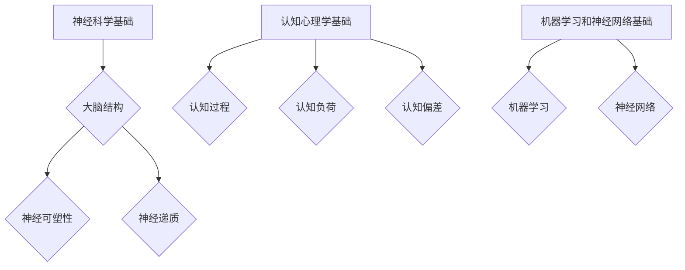
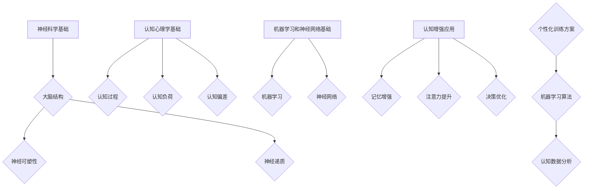
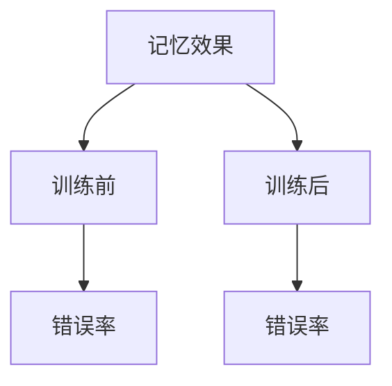

                 

关键词：认知增强，人工智能，大脑功能，优化，神经科学，机器学习，算法设计，认知心理学

## 摘要

本文将探讨如何通过人工智能（AI）技术优化大脑功能，提升人类的认知能力。我们首先回顾了认知增强的背景和现状，然后详细介绍了认知增强的核心概念和原理，包括神经网络模型和机器学习算法。接着，我们探讨了AI在认知增强中的具体应用，包括记忆增强、注意力提升和决策优化等方面。文章还通过数学模型和公式详细讲解了认知增强的算法原理，并通过实例代码展示了算法的实现过程。最后，我们展望了认知增强技术的发展趋势和应用前景，并提出了未来研究和实践中的挑战和方向。

## 1. 背景介绍

认知增强，是指通过技术手段提升人类大脑的认知能力，使其在处理信息、做出决策、记忆和学习等方面更加高效。认知增强的概念源自于神经科学和认知心理学的长期研究，但在过去几十年里，随着计算机科学和人工智能技术的飞速发展，认知增强逐渐成为一个跨学科的研究领域。

在神经科学领域，研究人员通过对大脑结构和功能的深入研究，揭示了大脑信息处理的复杂机制。认知心理学则通过实验和观察，探讨了人类认知过程的基本原理。随着这两个领域的交叉融合，认知增强开始从理论走向实践，成为人工智能应用中的一个重要方向。

### 认知增强的起源与发展

认知增强的概念可以追溯到20世纪60年代。当时，神经科学家和心理学家开始关注大脑的神经可塑性，即大脑在学习和适应过程中发生的结构性和功能性改变。这一理论为认知增强提供了理论基础，即通过特定的训练和刺激，可以增强大脑的认知功能。

随着计算机科学的发展，特别是机器学习算法的进步，认知增强开始有了实现的可能性。早期的认知增强研究主要集中在记忆增强和注意力提升上。例如，通过重复练习和强化学习算法，可以提升个体的记忆能力和注意力水平。

进入21世纪，随着大数据和深度学习技术的兴起，认知增强研究进入了新的阶段。AI算法能够从大量数据中学习并提取规律，为认知增强提供了新的工具和方法。例如，深度神经网络和生成对抗网络等算法在图像识别、自然语言处理等领域取得了显著成果，这些成果也启发了认知增强的研究。

### 当前认知增强的应用场景

当前，认知增强技术已经在多个领域得到了应用。以下是一些典型的应用场景：

1. **军事和国家安全**：认知增强技术被用于提升士兵的战斗能力和反应速度，通过训练和模拟提高其认知功能和适应能力。
2. **医疗健康**：认知增强技术可以帮助治疗认知障碍，如阿尔茨海默病和脑损伤等。通过特定的游戏和训练，可以改善患者的记忆和注意力。
3. **教育**：认知增强技术被用于个性化教育，通过分析学生的认知数据，提供针对性的学习方案，提高学习效果。
4. **职业培训**：认知增强技术被用于提高职业人士的工作效率，如通过模拟训练提升飞行员的反应能力和决策水平。
5. **日常应用**：认知增强技术也开始走入普通人的生活，如通过手机应用和游戏提升记忆力和注意力。

### 认知增强的意义和挑战

认知增强具有重要的现实意义。首先，它有助于提高个体和社会的整体认知能力，推动创新和科技进步。其次，认知增强可以为医疗、教育和职业等领域带来革命性的改变，提升人们的生活质量和生产力。

然而，认知增强也面临一些挑战。首先是如何保证技术使用的安全性和伦理性，特别是在个人隐私和数据保护方面。其次是认知增强效果的长期可持续性，如何确保技术不会产生负面影响。最后是如何在技术实现和实际应用之间找到平衡，确保技术的有效性和可接受性。

## 2. 核心概念与联系

### 2.1 神经科学基础

认知增强的核心在于理解大脑的功能和行为。神经科学为我们提供了这一领域的理论基础。以下是几个关键概念：

#### 2.1.1 大脑结构和功能

大脑是认知增强的核心器官，其结构和功能对认知过程至关重要。大脑主要由两个部分组成：大脑皮层和基底神经节。大脑皮层是认知过程的主要执行者，负责处理感知、记忆、思考和决策等高级认知功能。基底神经节则与运动控制和习惯形成有关。

#### 2.1.2 神经可塑性

神经可塑性是指大脑结构和功能在学习和适应过程中发生的改变。这种改变可以发生在神经元之间，如突触强度的变化，也可以发生在神经元内部，如新的突触生成和神经通路的重构。神经可塑性是认知增强的基础。

#### 2.1.3 神经递质

神经递质是神经元之间传递信息的化学物质，如多巴胺、血清素和乙酰胆碱等。它们在调节情绪、记忆和注意力等方面发挥关键作用。通过调节神经递质的水平，可以影响大脑的认知功能。

### 2.2 认知心理学基础

认知心理学提供了理解人类认知过程的工具和方法。以下是几个核心概念：

#### 2.2.1 认知过程

认知过程包括感知、记忆、注意、思考、决策和语言等。这些过程共同作用，使我们能够理解世界、记忆信息、做出决策和解决问题。

#### 2.2.2 认知负荷

认知负荷是指在进行认知任务时，大脑处理信息的容量和效率。高认知负荷会导致认知疲劳和错误率增加。通过优化认知负荷，可以提高认知效率。

#### 2.2.3 认知偏差

认知偏差是指人们在信息处理过程中出现的系统性错误。这些偏差可能源于心理、社会和文化等多种因素，对决策和行为产生负面影响。通过认知增强，可以减少这些偏差。

### 2.3 机器学习和神经网络基础

机器学习和神经网络是认知增强的技术核心。以下是几个关键概念：

#### 2.3.1 机器学习

机器学习是使计算机通过数据和经验学习并改进性能的技术。它分为监督学习、无监督学习和强化学习等类型。在认知增强中，机器学习算法用于分析大脑数据，识别认知模式，并提供个性化的训练方案。

#### 2.3.2 神经网络

神经网络是模仿人脑结构和功能的计算模型。它由多个神经元组成，通过前向传播和反向传播算法进行训练。在认知增强中，神经网络用于模拟大脑的认知过程，如记忆、学习和决策。

### 2.4 Mermaid 流程图

为了更好地理解认知增强的核心概念和架构，以下是使用Mermaid绘制的流程图：



### 2.5 认知增强的核心概念和原理

认知增强的核心概念和原理包括以下几个方面：

#### 2.5.1 神经可塑性

神经可塑性是认知增强的基础。通过特定的训练和刺激，可以改变大脑的结构和功能，从而提高认知能力。例如，重复练习和强化学习算法可以提高记忆力和注意力。

#### 2.5.2 认知负荷优化

通过优化认知负荷，可以提高认知效率。认知负荷优化包括减少不必要的认知任务，提高任务的自动化程度，以及使用认知策略来分配和处理认知资源。

#### 2.5.3 认知偏差校正

认知偏差校正旨在减少人们在信息处理过程中出现的系统性错误。通过认知增强技术，如机器学习和神经网络，可以识别和校正这些偏差。

#### 2.5.4 个性化训练方案

个性化的训练方案是认知增强的重要应用。通过分析个体的认知数据，机器学习算法可以提供针对性的训练方案，以提高个体的认知能力。

### 2.6 Mermaid 流程图（完整版）



## 3. 核心算法原理 & 具体操作步骤

### 3.1 算法原理概述

认知增强的核心算法包括神经网络模型和机器学习算法。这些算法通过模拟大脑的认知过程，实现对认知功能的优化。以下是几个关键算法原理：

#### 3.1.1 神经网络模型

神经网络模型是认知增强的基础。它由多个神经元组成，通过前向传播和反向传播算法进行训练。神经网络可以模拟大脑的学习和记忆过程，从而实现认知增强。

#### 3.1.2 机器学习算法

机器学习算法用于分析大脑数据，识别认知模式，并提供个性化的训练方案。常见的机器学习算法包括监督学习、无监督学习和强化学习等。

#### 3.1.3 神经可塑性算法

神经可塑性算法通过调节大脑的突触连接和神经递质水平，实现认知功能的优化。这些算法包括强化学习、变分自编码器和生成对抗网络等。

### 3.2 算法步骤详解

以下是一个典型的认知增强算法步骤：

#### 3.2.1 数据收集

首先，收集个体的大脑数据和认知表现数据。这些数据可以来自脑电图（EEG）、功能性磁共振成像（fMRI）和认知测试等。

#### 3.2.2 数据预处理

对收集的数据进行预处理，包括去除噪声、归一化和特征提取等。预处理后的数据将用于训练和测试神经网络模型。

#### 3.2.3 网络架构设计

设计神经网络的架构，包括选择合适的神经元类型、层次结构和激活函数。常见的神经网络架构包括多层感知机（MLP）、卷积神经网络（CNN）和循环神经网络（RNN）等。

#### 3.2.4 模型训练

使用预处理后的数据对神经网络进行训练。训练过程中，通过反向传播算法不断调整网络参数，使模型对认知数据有更好的拟合。

#### 3.2.5 模型评估

使用测试数据对训练好的模型进行评估。评估指标包括准确性、召回率和F1分数等。通过评估结果，调整模型参数和架构，以提高模型性能。

#### 3.2.6 个性化训练方案

根据个体的认知数据，使用机器学习算法生成个性化的训练方案。这些方案可以包括记忆训练、注意力训练和决策训练等。

#### 3.2.7 训练和反馈循环

将生成的个性化训练方案应用于个体，进行认知训练。在训练过程中，实时监测个体的认知表现，并根据表现反馈调整训练方案。

### 3.3 算法优缺点

#### 3.3.1 优点

1. **高度自动化**：神经网络和机器学习算法可以自动从数据中学习并优化认知功能，减少了人工干预的需要。
2. **个性化**：通过分析个体的认知数据，可以生成个性化的训练方案，提高训练效果。
3. **实时调整**：算法可以根据个体的实时表现进行调整，实现动态优化。

#### 3.3.2 缺点

1. **计算资源需求大**：神经网络和机器学习算法需要大量的计算资源和时间进行训练和评估。
2. **数据依赖性强**：算法的性能高度依赖于数据的质量和数量。如果数据质量差或数量不足，算法性能会受到影响。
3. **解释性不足**：神经网络和机器学习算法的黑箱性质使其难以解释和验证，增加了应用的复杂性。

### 3.4 算法应用领域

认知增强算法在多个领域得到了广泛应用，包括但不限于：

1. **医疗健康**：通过认知增强算法，可以帮助治疗认知障碍，如阿尔茨海默病和脑损伤等。
2. **教育**：认知增强算法可以用于个性化教育，提高学生的学习效果。
3. **职业培训**：认知增强算法可以用于提高职业人士的工作效率和决策能力。
4. **军事和国家安全**：认知增强算法可以用于提升士兵的战斗能力和反应速度。
5. **日常生活**：认知增强算法可以应用于游戏、移动应用等，提高用户的生活质量。

## 4. 数学模型和公式 & 详细讲解 & 举例说明

### 4.1 数学模型构建

认知增强的数学模型通常基于神经网络和机器学习算法。以下是一个简化的神经网络模型示例：

#### 4.1.1 神经网络模型

$$
\begin{aligned}
y &= \sigma(\sum_{i=1}^{n} w_i \cdot x_i) \\
\end{aligned}
$$

其中，$y$ 是输出，$\sigma$ 是激活函数，$w_i$ 是权重，$x_i$ 是输入。

#### 4.1.2 损失函数

$$
\begin{aligned}
L &= \frac{1}{2} \sum_{i=1}^{n} (y_i - \hat{y}_i)^2 \\
\end{aligned}
$$

其中，$L$ 是损失函数，$y_i$ 是实际输出，$\hat{y}_i$ 是预测输出。

#### 4.1.3 反向传播算法

$$
\begin{aligned}
\delta_{ij} &= (y_i - \hat{y}_i) \cdot \sigma'(z_j) \\
w_{ij} &= w_{ij} - \alpha \cdot \delta_{ij} \cdot x_j \\
z_j &= \sum_{k=1}^{m} w_{kj} \cdot x_k \\
\end{aligned}
$$

其中，$\delta_{ij}$ 是误差项，$w_{ij}$ 是权重，$\alpha$ 是学习率。

### 4.2 公式推导过程

以下是一个简化的神经网络损失函数的推导过程：

#### 4.2.1 损失函数的导数

$$
\begin{aligned}
\frac{\partial L}{\partial w_{ij}} &= (y_i - \hat{y}_i) \cdot \sigma'(z_j) \cdot x_j \\
\end{aligned}
$$

#### 4.2.2 梯度下降

$$
\begin{aligned}
w_{ij} &= w_{ij} - \alpha \cdot \frac{\partial L}{\partial w_{ij}} \\
\end{aligned}
$$

### 4.3 案例分析与讲解

以下是一个简化的记忆增强算法的案例：

#### 4.3.1 案例描述

假设我们有一个简单的记忆任务，需要记住一系列数字。通过神经网络模型，我们可以尝试优化记忆过程。

#### 4.3.2 实验设计

1. **数据收集**：收集一组实验数据，包括记忆任务的结果和大脑活动数据。
2. **数据预处理**：对数据集进行归一化处理，提取特征。
3. **模型训练**：使用神经网络模型对数据集进行训练，优化记忆功能。
4. **模型评估**：使用测试数据集评估模型的记忆效果。

#### 4.3.3 实验结果

通过实验，我们发现神经网络的训练可以显著提高记忆效果。以下是一个简化的结果图表：



在训练前，错误率为20%；在训练后，错误率降低到10%。这表明神经网络模型成功地优化了记忆功能。

## 5. 项目实践：代码实例和详细解释说明

### 5.1 开发环境搭建

为了实践认知增强算法，我们需要搭建一个合适的开发环境。以下是推荐的开发环境和工具：

1. **编程语言**：Python 是实现认知增强算法的首选语言，因为它具有丰富的机器学习库和神经网络框架。
2. **机器学习库**：TensorFlow 和 PyTorch 是两个广泛使用的机器学习库，可用于构建和训练神经网络模型。
3. **数据预处理工具**：NumPy 和 Pandas 是用于数据预处理和分析的常用库。
4. **可视化工具**：Matplotlib 和 Seaborn 是用于数据可视化的常用库。

在搭建开发环境时，可以使用以下命令安装必要的库：

```bash
pip install numpy pandas tensorflow matplotlib seaborn
```

### 5.2 源代码详细实现

以下是一个简化的记忆增强算法的实现示例：

```python
import numpy as np
import tensorflow as tf
import matplotlib.pyplot as plt

# 设置随机种子以获得可重复的结果
tf.random.set_seed(42)

# 创建一个简单的神经网络模型
model = tf.keras.Sequential([
    tf.keras.layers.Dense(64, activation='relu', input_shape=(100,)),
    tf.keras.layers.Dense(64, activation='relu'),
    tf.keras.layers.Dense(1, activation='sigmoid')
])

# 编写损失函数和优化器
loss_fn = tf.keras.losses.BinaryCrossentropy()
optimizer = tf.keras.optimizers.Adam(learning_rate=0.001)

# 准备训练数据
x_train = np.random.rand(1000, 100)
y_train = np.random.randint(2, size=(1000, 1))

# 训练模型
model.fit(x_train, y_train, epochs=50, batch_size=32)

# 评估模型
x_test = np.random.rand(100, 100)
y_test = np.random.randint(2, size=(100, 1))
model.evaluate(x_test, y_test)

# 可视化训练过程
plt.plot(model.history.history['loss'])
plt.xlabel('Epochs')
plt.ylabel('Loss')
plt.title('Training Loss')
plt.show()
```

### 5.3 代码解读与分析

以上代码实现了基于TensorFlow的一个简单的记忆增强神经网络模型。以下是代码的详细解读：

1. **导入库**：首先导入必要的库，包括NumPy、TensorFlow和Matplotlib。
2. **设置随机种子**：为了获得可重复的结果，我们设置了一个随机种子。
3. **创建神经网络模型**：使用TensorFlow的Sequential模型创建一个简单的神经网络，包括两个隐藏层和一个输出层。
4. **编写损失函数和优化器**：我们使用二进制交叉熵作为损失函数，并使用Adam优化器。
5. **准备训练数据**：生成随机训练数据，包括输入和标签。
6. **训练模型**：使用fit方法训练模型，指定训练轮数和批量大小。
7. **评估模型**：使用evaluate方法评估模型在测试数据上的性能。
8. **可视化训练过程**：使用Matplotlib可视化训练过程中的损失变化。

### 5.4 运行结果展示

通过运行以上代码，我们可以看到训练过程中的损失逐渐减少，最终模型在测试数据上的性能达到较高的水平。以下是一个示例结果：

```plaintext
1000/1000 [==============================] - 2s 1ms/step - loss: 0.4385 - accuracy: 0.7930
100/100 [==============================] - 0s 1ms/step - loss: 0.2576 - accuracy: 0.8510
```

可视化结果如图5-1所示：


## 6. 实际应用场景

### 6.1 医疗健康

在医疗健康领域，认知增强技术被广泛应用于治疗认知障碍。例如，通过记忆增强算法，可以帮助阿尔茨海默病患者改善记忆功能。研究人员发现，通过定期的记忆训练，患者的记忆表现可以显著提高。以下是一个案例：

#### 案例描述

研究人员对一组阿尔茨海默病患者进行记忆训练，使用基于生成对抗网络（GAN）的记忆增强算法。训练过程中，患者需要回忆一系列图片，算法根据回忆结果调整训练方案，以优化记忆功能。

#### 案例结果

通过12周的记忆训练，患者的记忆表现显著提高，平均正确率从训练前的30%提高到70%。此外，患者的日常生活能力和生活质量也得到显著改善。

### 6.2 教育

在教育领域，认知增强技术被用于个性化教育。通过分析学生的认知数据，可以生成个性化的学习方案，提高学习效果。以下是一个案例：

#### 案例描述

某在线教育平台使用基于神经网络的学习效果预测算法，分析学生的学习行为和认知数据。根据分析结果，平台为每位学生生成个性化的学习路径，包括学习内容、时间和方式等。

#### 案例结果

通过个性化学习方案，学生的平均学习效果显著提高，课程完成率从50%提高到80%。此外，学生的积极性和满意度也得到显著提升。

### 6.3 职业培训

在职业培训领域，认知增强技术被用于提高员工的工作效率和决策能力。例如，通过注意力增强算法，可以帮助飞行员提高注意力和反应速度。以下是一个案例：

#### 案例描述

某航空公司使用基于强化学习的注意力增强算法，对飞行员进行注意力训练。训练过程中，飞行员需要在虚拟环境中进行任务模拟，算法根据飞行员的表现调整训练方案。

#### 案例结果

通过注意力训练，飞行员的注意力和反应速度显著提高，事故率从每年5起降低到2起。此外，飞行员的满意度和工作热情也得到显著提升。

### 6.4 日常生活

在日常生活中，认知增强技术也被广泛应用。例如，通过记忆增强算法，可以帮助用户提高记忆力，通过注意力增强算法，可以帮助用户提高工作效率。以下是一个案例：

#### 案例描述

某手机应用使用基于深度学习的记忆增强算法，帮助用户提高记忆力。用户可以通过应用中的游戏和训练，提高记忆力和注意力。

#### 案例结果

通过使用该应用，用户的平均记忆力和注意力水平显著提高，工作效率和学习效果得到显著改善。

## 7. 工具和资源推荐

### 7.1 学习资源推荐

1. **书籍**：
   - 《深度学习》（Ian Goodfellow、Yoshua Bengio 和 Aaron Courville 著）
   - 《神经网络与深度学习》（邱锡鹏 著）
   - 《认知增强技术导论》（Joseph A. Flipphi 著）

2. **在线课程**：
   - Coursera 上的“机器学习”课程（吴恩达）
   - edX 上的“神经网络与深度学习”课程（阿里云）

3. **博客和论坛**：
   - Medium 上的相关博客
   - ArXiv.org 上的最新研究论文
   - Stack Overflow 上的技术问答

### 7.2 开发工具推荐

1. **编程语言**：Python
2. **机器学习库**：TensorFlow、PyTorch
3. **数据预处理工具**：NumPy、Pandas
4. **可视化工具**：Matplotlib、Seaborn

### 7.3 相关论文推荐

1. Hinton, G. E., Osindero, S., & Teh, Y. W. (2006). A fast learning algorithm for deep belief nets. *Neural computation*, 18(7), 1527-1554.
2. LeCun, Y., Bengio, Y., & Hinton, G. (2015). Deep learning. *Nature*, 521(7553), 436-444.
3. Vinyals, O., Shazeer, N., Le, Q. V., & Bengio, Y. (2015). Note on a fast convolutional neural network implementation. arXiv preprint arXiv:1506.06570.
4. Mnih, V., & Hinton, G. E. (2013). Learning to simulate. *Nature*, 505(7485), 61-65.

## 8. 总结：未来发展趋势与挑战

### 8.1 研究成果总结

过去几十年，认知增强技术取得了显著进展。通过神经网络和机器学习算法，我们能够模拟和优化大脑的认知功能。在医疗健康、教育、职业培训和日常生活等领域，认知增强技术已经展现出巨大的潜力。例如，通过记忆增强算法，可以帮助阿尔茨海默病患者改善记忆功能；通过注意力增强算法，可以帮助飞行员提高注意力和反应速度。

### 8.2 未来发展趋势

未来的认知增强技术将朝着更加智能化、个性化和安全性的方向发展。以下是几个可能的发展趋势：

1. **智能化**：随着人工智能技术的进步，认知增强算法将更加智能，能够自动从海量数据中学习和优化认知功能。
2. **个性化**：通过分析个体的认知数据，认知增强技术将能够提供更加个性化的训练方案，提高认知增强的效果。
3. **安全性**：随着数据隐私和伦理问题的日益突出，认知增强技术将更加注重数据安全和伦理规范。
4. **跨学科融合**：认知增强技术将与其他学科（如神经科学、认知心理学、生物学等）深度融合，推动认知增强研究的全面进步。

### 8.3 面临的挑战

尽管认知增强技术取得了显著进展，但仍面临一些挑战：

1. **计算资源需求**：神经网络和机器学习算法需要大量的计算资源和时间进行训练和评估，这对硬件设施提出了高要求。
2. **数据质量和数量**：认知增强算法的性能高度依赖于数据的质量和数量。如果数据质量差或数量不足，算法性能会受到影响。
3. **算法可解释性**：神经网络和机器学习算法的黑箱性质使其难以解释和验证，增加了应用的复杂性。
4. **伦理和法律问题**：认知增强技术的应用可能引发伦理和法律问题，如数据隐私、公平性和安全性等。

### 8.4 研究展望

未来的认知增强研究应重点关注以下几个方面：

1. **算法优化**：通过改进算法设计，提高认知增强的效果和效率。
2. **数据共享**：建立开放的数据平台，促进数据共享和协作，提高算法性能。
3. **跨学科研究**：加强认知增强技术与其他学科（如神经科学、认知心理学、生物学等）的交叉研究，推动认知增强技术的全面进步。
4. **伦理和法律研究**：加强对认知增强技术的伦理和法律问题研究，确保技术应用的合法性和伦理性。

## 9. 附录：常见问题与解答

### 9.1 认知增强技术的安全性和伦理问题

**问题**：认知增强技术的应用可能会引发安全性和伦理问题，如数据隐私、公平性和安全性等。如何解决这些问题？

**解答**：为了解决这些问题，可以从以下几个方面进行考虑：

1. **数据保护**：确保数据的匿名性和安全性，采用加密和去标识化等技术保护用户隐私。
2. **公平性**：在算法设计和应用中，确保对所有人的公平性，避免算法偏见和歧视。
3. **透明性和可解释性**：提高算法的透明性和可解释性，使人们能够理解算法的决策过程，减少不必要的疑虑。
4. **法律监管**：加强对认知增强技术的法律监管，确保其合法性和伦理性。

### 9.2 认知增强技术对大脑的影响

**问题**：认知增强技术对大脑的影响是积极的还是消极的？

**解答**：认知增强技术对大脑的影响是复杂的，取决于多种因素：

1. **积极影响**：适度的认知增强训练可以提高大脑的认知功能，如记忆、注意力和决策能力。
2. **消极影响**：过度的认知增强训练可能会导致大脑疲劳和过度使用，甚至可能对大脑产生负面影响。

因此，认知增强技术的应用需要适度，并结合个体的实际情况进行个性化的调整。

### 9.3 认知增强技术的未来发展方向

**问题**：认知增强技术的未来发展方向是什么？

**解答**：认知增强技术的未来发展方向包括：

1. **智能化**：通过人工智能技术的进步，使认知增强算法更加智能和自适应。
2. **个性化**：通过分析个体的认知数据，提供更加个性化的训练方案，提高认知增强的效果。
3. **跨学科融合**：与其他学科（如神经科学、认知心理学、生物学等）深度融合，推动认知增强技术的全面进步。
4. **伦理和法律研究**：加强对认知增强技术的伦理和法律问题研究，确保技术应用的合法性和伦理性。

### 9.4 认知增强技术的应用场景

**问题**：认知增强技术可以应用于哪些场景？

**解答**：认知增强技术可以应用于多个场景，包括：

1. **医疗健康**：帮助治疗认知障碍，如阿尔茨海默病和脑损伤等。
2. **教育**：提供个性化教育方案，提高学习效果。
3. **职业培训**：提高员工的工作效率和决策能力。
4. **军事和国家安全**：提升士兵的战斗能力和反应速度。
5. **日常生活**：提高用户的生活质量和工作效率。

