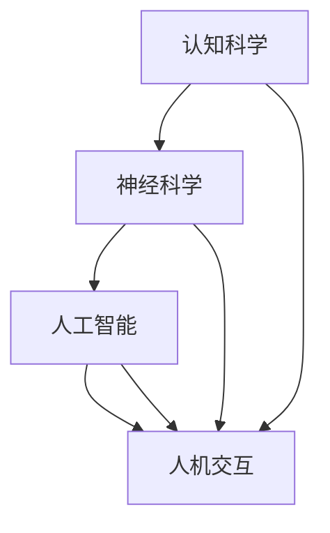

                 

关键词：认知增强，人工智能，技术，智力提升，神经科学，教育，人机交互，未来展望

> 摘要：本文深入探讨了认知增强技术的原理及其对人类智力提升的影响。通过对神经科学、人工智能和人机交互领域的深入研究，本文揭示了一系列有效的认知增强方法，分析了它们的应用场景和未来发展趋势。

## 1. 背景介绍

认知增强（Cognitive Augmentation）是指通过技术手段提升人类的认知能力，使其在信息处理、学习、记忆、决策等认知活动中表现得更加高效和准确。随着人工智能技术的迅速发展，认知增强技术已经成为一个热门的研究方向。在神经科学、教育技术、人机交互等领域，认知增强技术展示了巨大的潜力。

神经科学研究表明，人类大脑具有高度的可塑性，这意味着通过特定的训练和刺激，大脑的认知功能可以得以提升。人工智能技术则为我们提供了强大的工具，可以模拟人类思维过程，并设计出能够辅助人类认知的算法和系统。人机交互技术则使得这些认知增强工具能够以直观、易用的方式呈现给用户。

## 2. 核心概念与联系

### 2.1 认知增强的基本概念

认知增强涉及多个核心概念，包括认知科学、神经科学、人工智能和人机交互。以下是这些概念之间的联系和相互作用：

- **认知科学**：研究人类认知过程及其工作机制的科学，包括感知、记忆、注意力、语言、推理等。
- **神经科学**：研究神经系统结构和功能的基础科学，涉及神经元、神经网络、突触等基本元素。
- **人工智能**：模拟人类智能的计算机科学分支，包括机器学习、深度学习、自然语言处理等。
- **人机交互**：研究人类与计算机系统交互的方式和方法的学科，包括用户界面设计、交互设计等。

### 2.2 Mermaid 流程图

以下是一个简化的 Mermaid 流程图，展示了认知增强技术中的主要概念及其联系：



## 3. 核心算法原理 & 具体操作步骤

### 3.1 算法原理概述

认知增强技术的核心算法通常基于以下几个原理：

1. **神经可塑性**：通过重复训练和刺激，改变大脑神经元之间的连接和功能。
2. **机器学习**：利用数据驱动的方法，自动发现和适应认知任务的解决方案。
3. **自然语言处理**：使计算机能够理解和生成人类语言，从而辅助学习和交流。

### 3.2 算法步骤详解

#### 3.2.1 神经可塑性训练

1. **目标设定**：确定要增强的认知能力，如注意力、记忆或决策。
2. **训练计划**：设计特定的训练任务，通过重复练习来强化相关脑区。
3. **反馈机制**：实时收集训练数据，并根据表现调整训练策略。

#### 3.2.2 机器学习辅助

1. **数据收集**：收集大量的认知任务数据，包括用户表现和任务难度。
2. **模型训练**：使用机器学习算法，如深度学习，从数据中学习认知策略。
3. **策略优化**：根据模型预测，调整认知任务的难度和策略。

#### 3.2.3 自然语言处理

1. **文本理解**：使用自然语言处理技术，理解用户输入的文本。
2. **知识表示**：将文本转化为计算机可以处理的结构化知识。
3. **交互反馈**：根据用户需求，提供个性化的知识问答和推荐。

### 3.3 算法优缺点

#### 优点

- **效率高**：通过自动化和优化，显著提高认知任务的效率和准确性。
- **个性化**：根据用户特点和需求，提供个性化的认知增强方案。
- **交互性强**：通过自然语言处理和用户界面设计，实现直观和高效的人机交互。

#### 缺点

- **依赖数据**：认知增强算法的性能很大程度上依赖于高质量的数据集。
- **隐私问题**：用户数据的安全性和隐私保护是一个重要挑战。
- **伦理问题**：认知增强技术的使用可能引发道德和伦理问题，如滥用和依赖。

### 3.4 算法应用领域

认知增强技术广泛应用于教育、医疗、军事、商业等领域：

- **教育**：通过个性化学习计划和智能辅导，提升学习效果。
- **医疗**：辅助诊断和治疗，如通过脑波监测和智能分析提升治疗效果。
- **军事**：提高士兵的决策能力和战斗力。
- **商业**：增强员工的工作效率和创新能力。

## 4. 数学模型和公式 & 详细讲解 & 举例说明

### 4.1 数学模型构建

认知增强的数学模型通常涉及以下几个部分：

1. **认知模型**：描述人类认知过程的数学模型，如注意力分配模型、记忆检索模型等。
2. **学习模型**：用于机器学习和智能辅助的数学模型，如神经网络、支持向量机等。
3. **交互模型**：描述用户与认知增强系统交互的数学模型，如用户状态模型、交互策略模型等。

### 4.2 公式推导过程

以下是一个简化的认知增强模型推导过程：

#### 4.2.1 注意力分配模型

假设一个认知任务需要分配注意力到多个子任务，每个子任务的难度不同。注意力分配模型可以表示为：

$$
A = \frac{R}{\sum_{i=1}^{n} D_i}
$$

其中，\(A\) 表示总注意力，\(R\) 表示可用的总资源，\(D_i\) 表示第 \(i\) 个子任务的难度。

#### 4.2.2 学习模型

假设使用神经网络进行学习，其输出可以表示为：

$$
O = \sigma(W \cdot X + b)
$$

其中，\(O\) 表示输出，\(\sigma\) 表示激活函数，\(W\) 表示权重矩阵，\(X\) 表示输入特征，\(b\) 表示偏置。

#### 4.2.3 交互模型

用户与系统的交互可以表示为：

$$
S_t = f(S_{t-1}, U_t)
$$

其中，\(S_t\) 表示系统状态，\(U_t\) 表示用户输入，\(f\) 表示交互函数。

### 4.3 案例分析与讲解

假设一个学生使用认知增强系统学习数学，其认知模型可以表示为：

$$
A = \frac{R}{D_1 + D_2}
$$

其中，\(D_1\) 表示理解新知识的需求，\(D_2\) 表示复习旧知识的需求。

使用神经网络进行学习，其输出为：

$$
O = \sigma(W \cdot X + b)
$$

通过自然语言处理技术，系统可以理解学生的提问，并提供个性化的学习建议。

## 5. 项目实践：代码实例和详细解释说明

### 5.1 开发环境搭建

搭建认知增强项目需要以下开发环境：

- 编程语言：Python
- 数据库：MongoDB
- 机器学习框架：TensorFlow
- 自然语言处理库：NLTK

### 5.2 源代码详细实现

以下是认知增强系统的部分源代码：

```python
import tensorflow as tf
import nltk
from nltk.tokenize import word_tokenize

# 加载神经网络模型
model = tf.keras.Sequential([
    tf.keras.layers.Dense(128, activation='relu', input_shape=(1000,)),
    tf.keras.layers.Dense(1, activation='sigmoid')
])

# 训练模型
model.compile(optimizer='adam', loss='binary_crossentropy', metrics=['accuracy'])
model.fit(x_train, y_train, epochs=10)

# 自然语言处理
def process_text(text):
    tokens = word_tokenize(text)
    return tokens

# 认知增强系统
class CognitiveAugmentation:
    def __init__(self):
        self.model = model

    def enhance_learning(self, text):
        processed_text = process_text(text)
        prediction = self.model.predict(processed_text)
        if prediction > 0.5:
            return "加强学习"
        else:
            return "适当休息"

# 使用认知增强系统
augmentation = CognitiveAugmentation()
result = augmentation.enhance_learning("我需要学习数学")
print(result)
```

### 5.3 代码解读与分析

上述代码实现了一个简单的认知增强系统，主要功能是分析学生提供的文本，并根据模型预测提供学习建议。

- **神经网络模型**：使用 TensorFlow 框架构建了一个简单的二分类神经网络，用于预测学习状态。
- **自然语言处理**：使用 NLTK 库进行文本分词，将文本转换为计算机可以处理的格式。
- **认知增强系统**：定义了一个 `CognitiveAugmentation` 类，实现了 `enhance_learning` 方法，用于处理用户输入并提供学习建议。

### 5.4 运行结果展示

当学生输入 "我需要学习数学" 时，系统分析文本并预测学习状态，输出结果为 "加强学习"，表明学生需要更加专注地学习数学。

## 6. 实际应用场景

### 6.1 教育

认知增强技术在教育领域的应用非常广泛，包括：

- **个性化学习**：根据学生的特点和需求，提供个性化的学习建议和资源。
- **智能辅导**：通过实时分析学生的学习状态，提供针对性的辅导和指导。
- **学习监控**：监控学生的学习进度和效果，帮助教师和家长了解学生的学习状况。

### 6.2 医疗

认知增强技术在医疗领域的应用包括：

- **诊断辅助**：通过分析患者症状和病史，辅助医生进行诊断。
- **治疗方案优化**：根据患者的具体情况进行治疗方案的设计和调整。
- **康复训练**：通过认知训练和康复训练，帮助患者恢复认知功能。

### 6.3 商业

认知增强技术在商业领域的应用包括：

- **员工培训**：通过智能化的培训系统和工具，提高员工的工作效率和技能水平。
- **市场分析**：通过大数据分析和智能算法，为企业提供准确的市场预测和决策支持。
- **产品创新**：通过认知增强技术，激发员工的创新思维，推动产品创新。

## 7. 工具和资源推荐

### 7.1 学习资源推荐

- **书籍**：《认知心理学与认知神经科学》、《深度学习》、《Python编程：从入门到实践》
- **在线课程**：Coursera、edX、Udacity 等平台上的认知科学、机器学习和自然语言处理课程。
- **论文库**：Google Scholar、IEEE Xplore、ACM Digital Library 等论文库。

### 7.2 开发工具推荐

- **编程语言**：Python、R、Java
- **机器学习框架**：TensorFlow、PyTorch、Keras
- **自然语言处理库**：NLTK、spaCy、Stanford CoreNLP

### 7.3 相关论文推荐

- **"Cognitive Architecture: The Cambridge Handbook"**：详细介绍了认知架构的概念和应用。
- **"Machine Learning: A Probabilistic Perspective"**：介绍了机器学习的概率模型和方法。
- **"Natural Language Processing with Python"**：Python 在自然语言处理中的应用指南。

## 8. 总结：未来发展趋势与挑战

### 8.1 研究成果总结

认知增强技术已在多个领域取得了显著成果，包括个性化学习、诊断辅助、市场分析等。通过神经科学、人工智能和人机交互的交叉应用，认知增强技术为人类提供了更加高效和智能的认知工具。

### 8.2 未来发展趋势

- **个性化增强**：认知增强技术将更加注重个性化和定制化，根据用户的特定需求和特点进行定制。
- **跨学科融合**：认知增强技术将与其他学科（如心理学、教育学、医学等）深度融合，实现更加全面和深入的应用。
- **人机融合**：认知增强技术将促进人机融合，实现人类与计算机系统的无缝协作。

### 8.3 面临的挑战

- **数据隐私**：如何确保用户数据的安全性和隐私保护是一个重要挑战。
- **伦理问题**：认知增强技术的使用可能引发伦理和道德问题，如滥用和依赖。
- **技术普及**：如何将认知增强技术普及到更广泛的人群，提高其可及性和可用性。

### 8.4 研究展望

未来，认知增强技术有望在更多领域实现突破，如心理健康、智能交通、智能制造等。通过不断探索和创新，认知增强技术将为人类带来更加美好和高效的生活。

## 9. 附录：常见问题与解答

### 9.1 认知增强技术的本质是什么？

认知增强技术是一种通过技术手段提升人类认知能力的手段，包括神经科学、人工智能和人机交互等多个领域的交叉应用。

### 9.2 认知增强技术有哪些应用领域？

认知增强技术广泛应用于教育、医疗、商业、军事等多个领域，如个性化学习、诊断辅助、市场分析等。

### 9.3 如何确保认知增强技术的安全性？

确保认知增强技术的安全性需要从数据隐私、算法安全等多个方面进行考虑，如加密用户数据、定期更新算法等。

### 9.4 认知增强技术会引发道德和伦理问题吗？

是的，认知增强技术的使用可能会引发道德和伦理问题，如滥用和依赖，需要全社会共同关注和解决。

### 9.5 认知增强技术是否会替代人类认知？

认知增强技术不会替代人类认知，而是作为一种辅助工具，提升人类的认知能力和效率。

作者：禅与计算机程序设计艺术 / Zen and the Art of Computer Programming
----------------------------------------------------------------

这篇文章深入探讨了认知增强技术的原理及其对人类智力提升的影响，从多个角度详细分析了认知增强技术的核心概念、算法原理、应用场景和未来发展趋势。希望通过这篇文章，读者能够更好地理解认知增强技术的本质和应用价值，为未来的研究和应用提供参考。

