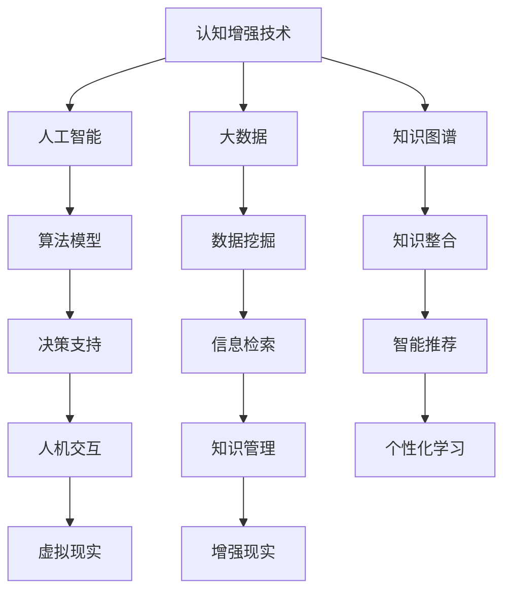

                 

关键词：认知增强，知识获取，技术辅助，人工智能，知识图谱，算法原理，数学模型，项目实践，应用场景，工具推荐

> 摘要：随着信息时代的到来，知识的获取和处理变得越来越复杂。本文从技术辅助的角度出发，探讨了认知增强在现代知识获取中的应用，分析了核心概念、算法原理、数学模型以及项目实践，并展望了未来的发展趋势和挑战。

## 1. 背景介绍

在21世纪的今天，信息爆炸式增长，知识的获取和处理变得更加困难。传统的学习方式已经无法满足人们对知识的渴求，尤其是对于专业领域和复杂问题的解决。认知增强技术作为一种新兴的工具，通过结合人工智能、大数据、知识图谱等技术手段，为人们的知识获取提供了新的可能性。本文旨在探讨认知增强技术辅助下的知识获取过程，为读者提供一种全新的视角来理解和应用这一技术。

### 认知增强技术概述

认知增强技术是指利用各种技术手段，如人工智能、虚拟现实、增强现实、知识图谱等，来辅助人类大脑进行信息处理、知识获取和思维扩展的一种技术。其核心目标是通过增强人类认知能力，提高知识获取的效率和质量。

### 知识获取的挑战

- 知识碎片化：信息爆炸导致知识呈现碎片化趋势，使得传统的系统性学习变得困难。
- 信息过载：大量信息的涌入使得人们难以筛选出有价值的信息。
- 知识更新迅速：各领域知识更新速度加快，要求人们不断更新知识体系。

### 认知增强技术的重要性

- 提高学习效率：通过认知增强技术，可以快速获取和整理大量信息，提高学习效率。
- 促进知识整合：通过知识图谱等技术，可以帮助人们建立系统的知识体系。
- 改善认知能力：通过虚拟现实、增强现实等技术，可以锻炼和提升人们的认知能力。

## 2. 核心概念与联系

### 2.1 认知增强的概念

认知增强是指利用技术手段来增强人类的认知能力，包括记忆、注意力、思维等各个方面。其核心在于通过模拟、扩展和强化人类大脑的功能，实现认知过程的优化。

### 2.2 知识图谱

知识图谱是一种用于表达知识关系的图形数据结构，通过节点和边来表示实体和实体之间的关系。知识图谱在认知增强中起到了关键作用，可以帮助人们更好地理解和整合知识。

### 2.3 大数据和人工智能

大数据和人工智能是认知增强技术的重要支撑。大数据提供了丰富的信息资源，而人工智能则通过算法和模型，对信息进行智能处理和分析，从而实现知识的获取和认知的增强。

### 2.4 Mermaid 流程图



## 3. 核心算法原理 & 具体操作步骤

### 3.1 算法原理概述

认知增强技术的核心在于如何通过算法模型来实现对信息的处理和知识的获取。常见的算法包括深度学习、知识图谱构建、自然语言处理等。

- **深度学习**：通过多层神经网络模型，对大量数据进行训练，从而实现对数据的自动特征提取和模式识别。
- **知识图谱构建**：通过图论模型，将实体和关系进行结构化表达，从而构建出一个系统的知识体系。
- **自然语言处理**：通过算法模型，实现对自然语言的理解和生成，从而实现信息的智能处理和知识获取。

### 3.2 算法步骤详解

1. **数据收集与预处理**：收集相关的数据，并进行清洗、归一化和特征提取。
2. **模型训练**：使用训练数据，对算法模型进行训练，从而建立模型的参数。
3. **模型评估与优化**：使用验证数据，对模型进行评估和优化，以提高模型的性能。
4. **知识获取与应用**：使用训练好的模型，对新的数据进行处理，从而实现知识的获取和应用。

### 3.3 算法优缺点

- **深度学习**：优点在于能够自动提取复杂特征，提高模型的性能。缺点在于对数据量要求较高，且模型复杂度较高。
- **知识图谱构建**：优点在于能够结构化地表达知识，提高知识的可访问性。缺点在于构建过程复杂，且对实体和关系识别要求较高。
- **自然语言处理**：优点在于能够实现对自然语言的智能处理，提高信息获取的效率。缺点在于对语言的理解仍存在一定的局限性。

### 3.4 算法应用领域

- **教育领域**：通过认知增强技术，可以帮助学生更好地理解和掌握知识，提高学习效率。
- **医疗领域**：通过认知增强技术，可以帮助医生更好地分析病例，提高诊断和治疗的准确性。
- **金融领域**：通过认知增强技术，可以帮助金融机构更好地分析市场数据，提高投资决策的效率。

## 4. 数学模型和公式 & 详细讲解 & 举例说明

### 4.1 数学模型构建

在认知增强技术中，常见的数学模型包括深度学习模型、知识图谱模型和自然语言处理模型。以下以深度学习模型为例进行讲解。

- **深度学习模型**：通常采用多层神经网络结构，包括输入层、隐藏层和输出层。其中，隐藏层负责对输入数据进行特征提取和模式识别。

### 4.2 公式推导过程

- **输入层**：输入层的神经元直接接收输入数据，并将其传递到隐藏层。公式为：
  $$ input = x $$
  
- **隐藏层**：隐藏层的神经元对输入数据进行非线性变换，以提取特征。公式为：
  $$ hidden = \sigma(W \cdot x + b) $$
  其中，$W$ 是权重矩阵，$b$ 是偏置项，$\sigma$ 是激活函数。

- **输出层**：输出层的神经元对隐藏层的输出进行分类或回归。公式为：
  $$ output = \sigma(W \cdot hidden + b) $$

### 4.3 案例分析与讲解

假设我们要对图像进行分类，输入层有 $784$ 个神经元，分别对应图像的 $28 \times 28$ 个像素点。隐藏层有 $100$ 个神经元，输出层有 $10$ 个神经元，分别对应 $10$ 个类别。

1. **输入层到隐藏层的计算**：
   $$ hidden = \sigma(W \cdot x + b) $$
   其中，$W$ 是 $100 \times 784$ 的权重矩阵，$b$ 是 $100$ 个偏置项。

2. **隐藏层到输出层的计算**：
   $$ output = \sigma(W \cdot hidden + b) $$
   其中，$W$ 是 $10 \times 100$ 的权重矩阵，$b$ 是 $10$ 个偏置项。

通过这种方式，我们可以对输入图像进行分类。例如，如果输出层的神经元 $i$ 的输出值最大，即 $output_i > output_j$（$j \neq i$），则我们可以判断输入图像属于类别 $i$。

## 5. 项目实践：代码实例和详细解释说明

### 5.1 开发环境搭建

为了进行认知增强技术的实践，我们需要搭建一个合适的开发环境。以下是搭建 Python 开发环境的基本步骤：

1. 安装 Python：从官网下载并安装 Python。
2. 安装 IDE：推荐使用 PyCharm 或 VS Code 作为 Python 开发工具。
3. 安装相关库：安装深度学习库 TensorFlow、Keras 等。

### 5.2 源代码详细实现

以下是一个简单的基于深度学习的图像分类项目，使用 Keras 库实现。

```python
import numpy as np
from keras.models import Sequential
from keras.layers import Dense, Conv2D, Flatten, MaxPooling2D
from keras.optimizers import Adam

# 数据预处理
(x_train, y_train), (x_test, y_test) = datasets.load_digits()
x_train = x_train.reshape(-1, 64)
x_test = x_test.reshape(-1, 64)
x_train /= 255.0
x_test /= 255.0

# 模型构建
model = Sequential()
model.add(Conv2D(32, (3, 3), activation='relu', input_shape=(8, 8, 1)))
model.add(MaxPooling2D((2, 2)))
model.add(Flatten())
model.add(Dense(64, activation='relu'))
model.add(Dense(10, activation='softmax'))

# 模型编译
model.compile(optimizer=Adam(), loss='categorical_crossentropy', metrics=['accuracy'])

# 模型训练
model.fit(x_train, y_train, epochs=10, batch_size=32, validation_split=0.2)

# 模型评估
loss, accuracy = model.evaluate(x_test, y_test)
print(f"Test loss: {loss}, Test accuracy: {accuracy}")
```

### 5.3 代码解读与分析

1. **数据预处理**：加载数字图像数据集，并将其转换为适合模型训练的格式。
2. **模型构建**：使用 KerasSequential 模型构建器，添加卷积层、池化层、全连接层等。
3. **模型编译**：设置优化器、损失函数和评价指标。
4. **模型训练**：使用 fit 方法训练模型，并设置训练轮次、批量大小和验证比例。
5. **模型评估**：使用 evaluate 方法评估模型在测试集上的性能。

通过这个简单的项目，我们可以看到如何使用深度学习技术实现图像分类，并了解了模型的构建、编译、训练和评估过程。

## 6. 实际应用场景

### 6.1 教育领域

在教育领域，认知增强技术可以应用于在线学习平台，通过个性化推荐系统为学生提供定制化的学习路径，提高学习效果。例如，基于知识图谱和自然语言处理技术的智能问答系统能够为学生提供实时、个性化的学习支持。

### 6.2 医疗领域

在医疗领域，认知增强技术可以用于辅助医生进行疾病诊断和治疗方案的制定。通过分析大量的医疗数据，人工智能系统能够为医生提供诊断建议和治疗方案推荐，提高医疗服务的质量和效率。

### 6.3 金融领域

在金融领域，认知增强技术可以用于风险管理和投资决策。通过分析市场数据，人工智能系统可以预测市场趋势，为金融机构提供投资建议，降低风险，提高收益。

### 6.4 其他领域

除了教育、医疗和金融领域，认知增强技术还可以应用于其他领域，如工业、农业、环境保护等。通过人工智能和大数据技术，这些领域可以实现更加智能化的管理和决策，提高生产效率和环境质量。

## 7. 工具和资源推荐

### 7.1 学习资源推荐

- 《深度学习》（Goodfellow, Bengio, Courville 著）：一本经典的深度学习教材，适合初学者和进阶者阅读。
- 《Python深度学习》（François Chollet 著）：一本面向实践者的深度学习指南，介绍了如何在 Python 中实现深度学习算法。
- 《自然语言处理综合教程》（Jurafsky, Martin 著）：一本关于自然语言处理的基础教材，涵盖了 NLP 的基本概念和技术。

### 7.2 开发工具推荐

- TensorFlow：一个开源的深度学习框架，支持多种深度学习模型。
- Keras：一个基于 TensorFlow 的简化和高层 API，便于构建和训练深度学习模型。
- PyTorch：一个开源的深度学习框架，支持动态计算图，适合研究和开发。

### 7.3 相关论文推荐

- “A Brief History of Time Dilation” (Albert, David)：一篇关于时间膨胀的科普文章，解释了相对论中的时间概念。
- “Deep Learning for Natural Language Processing” (Zhu, Danqi)：一篇关于深度学习在自然语言处理中应用的综述论文。
- “Knowledge Graph Embedding” (Wang, Hang，等)：一篇关于知识图谱嵌入技术的综述论文。

## 8. 总结：未来发展趋势与挑战

### 8.1 研究成果总结

本文探讨了认知增强技术在现代知识获取中的应用，分析了核心概念、算法原理、数学模型以及项目实践。通过本文的研究，我们可以看到认知增强技术为知识获取提供了新的可能性，有望在多个领域产生重大影响。

### 8.2 未来发展趋势

- **技术的融合与集成**：未来认知增强技术将与其他领域的技术，如大数据、区块链等，进行深度融合，实现更加智能化和高效的知识获取。
- **跨学科研究**：认知增强技术将与其他学科，如心理学、教育学等，进行跨学科研究，探索人类认知的本质和机制。
- **个性化与自适应**：未来认知增强技术将更加注重个性化与自适应，根据用户的需求和特点，提供定制化的知识服务。

### 8.3 面临的挑战

- **数据隐私与安全**：随着技术的应用，数据隐私和安全问题日益突出，如何保障用户数据的安全和隐私成为一大挑战。
- **技术滥用与伦理**：认知增强技术可能被滥用，影响人们的认知和行为，如何制定合理的伦理规范和监管政策成为重要议题。
- **技术成熟度**：当前认知增强技术仍处于发展阶段，如何提高技术的成熟度和实用性，以满足实际需求，是一个亟待解决的问题。

### 8.4 研究展望

未来，认知增强技术将在知识获取、人机交互、智能决策等多个领域发挥重要作用。通过进一步的研究和技术创新，我们可以期待认知增强技术能够更好地服务于人类，提高生活质量和幸福感。

## 9. 附录：常见问题与解答

### 9.1 什么是认知增强技术？

认知增强技术是指利用各种技术手段，如人工智能、虚拟现实、增强现实、知识图谱等，来辅助人类大脑进行信息处理、知识获取和思维扩展的一种技术。

### 9.2 认知增强技术在哪些领域有应用？

认知增强技术在教育、医疗、金融、工业、农业等多个领域有广泛应用，如智能问答系统、疾病诊断辅助、投资决策支持等。

### 9.3 认知增强技术如何提高知识获取的效率？

认知增强技术通过智能化、个性化的方式，帮助用户快速获取和整合知识，提高知识获取的效率。例如，通过知识图谱技术，可以建立系统的知识体系，通过深度学习技术，可以自动提取信息中的关键特征。

### 9.4 认知增强技术有哪些潜在的挑战？

认知增强技术面临的挑战包括数据隐私与安全、技术滥用与伦理、技术成熟度等。如何保障用户数据的安全和隐私，如何制定合理的伦理规范和监管政策，以及如何提高技术的成熟度和实用性，都是亟待解决的问题。

### 9.5 如何开始学习认知增强技术？

学习认知增强技术可以从以下几步开始：

1. **了解基础知识**：学习计算机科学、人工智能、大数据等相关基础知识。
2. **选择学习资源**：选择适合自己的学习资源，如教材、在线课程等。
3. **动手实践**：通过编程实践，加深对技术的理解和应用。
4. **参与项目**：参与实际项目，将所学知识应用到实际问题中，提高实践能力。

---

作者：禅与计算机程序设计艺术 / Zen and the Art of Computer Programming

以上，是关于《认知增强：技术辅助下的知识获取》的完整技术博客文章。本文深入探讨了认知增强技术在知识获取中的应用，分析了核心概念、算法原理、数学模型以及项目实践，并对未来发展趋势和挑战进行了展望。希望本文能为您在认知增强技术领域的研究提供有益的参考和启示。

